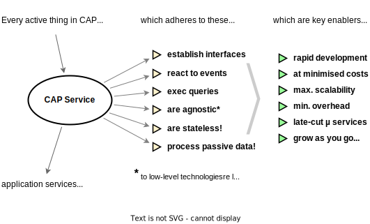

# Best Practices by CAP

Key Concepts & Rationales
{.subtitle}

[[toc]]


## Introduction

### Primary Building Blocks

The CAP framework features a mix of proven and broadly adopted open-source and SAP technologies. The following figure depicts CAP's place and focus in a stack architecture.

{style="width:555px"}

The major building blocks are as follows:

- [**Core Data Services** (CDS)](../cds/) — CAP's universal modeling language, and the very backbone of everything; used to capture domain knowledge, generating database schemas, translating to and from various API languages, and most important: fueling generic runtimes to automatically serve request out of the box.

- [**Service Runtimes**](../guides/providing-services.md) for [Node.js](../node.js/) and [Java](../java/) — providing the core frameworks for services, generic providers to serve requests automatically, database support for SAP HANA, SQLite, and PostgreSQL, and protocol adaptors for REST, OData, GraphQL, ...

- [**Platform Integrations**](../plugins/) — providing CAP-level service interfaces (*'[Calesi](#the-calesi-pattern)'*) to cloud platform services in platform-agnostic ways, as much as possible. Some of these are provided out of the box, others as plugins.

- [**Command-Line Interface** (CLI)](../tools/) — the Swiss army knife on the tools and development kit front, complemented by integrations and support in [*SAP Build Code*](https://www.sap.com/germany/products/technology-platform/developer-tools.html), *Visual Studio Code*, *IntelliJ*, and *Eclipse*.

In addition, there's a fast-growing number of [plugins](../plugins/) contributed by open-source and inner-source [communities](/resources/#public-resources) that enhance CAP in various ways, and integrate with additional tools and environments; the [*Calesi* plugins](./index.md#the-calesi-effect) are among them.


### Models fuel Runtimes

CDS models play a prevalent role in CAP applications. They're ultimately used to fuel generic runtimes to automatically serve requests, without any coding for custom implementations required.

{style="width:444px"}

CAP runtimes bootstrap *Generic Service Providers* for services defined in service models. They use the information at runtime to translate incoming requests from a querying protocol, such as OData, into SQL queries sent to the database.

:::tip Models fuel Runtimes
CAP uses the captured declarative information about data and services to **automatically serve requests**, including complex deep queries, with expands, where clauses and order by, aggregations, and so forth...
:::


### Concepts Overview

The following sections provide an overview of the core concepts and design principles of CAP. The following illustration is an attempt to show all concepts, how they relate to each other, and to introduce the terminology.

![Service models declare service interfaces, events, facades, and services. Service interfaces are published as APIs and are consumed by clients. Clients send requests which trigger events. Services are implemented in service providers, react on events, and act as facades. Facades are inferred to service interfaces and are views on domain models. Service providers are implemented through event handlers which handle events. Also, service providers read/write data which has been declared in domain models.](assets/key-concepts.drawio.svg){style="padding-right:50px"}

Start reading the diagram from the _Service Models_ bubble in the middle, then follow the arrows to the other concepts.
We dive into each of these concepts in the following sections, starting with _Domain Models_, the other grey bubble in the previous illustration.


## Domain Models

[CDS](../cds/) is CAP's universal modeling language to declaratively capture knowledge about an application's domain. Data models capture the *static* aspects of a domain, using the widely used technique of [*entity-relationship modeling*](https://en.wikipedia.org/wiki/Entity–relationship_model#:~:text=An%20entity–relationship%20model%20(or,instances%20of%20those%20entity%20types).). For example, a simple domain model as illustrated in this ER diagram:


In a first iteration, it would look like this in CDS, with some fields added:

::: code-group

```cds [Domain Data Model]
using { Country, cuid, managed } from '@sap/cds/common';

entity Books : cuid, managed {
  title  : localized String;
  author : Association to Authors;
}

entity Authors : cuid, managed {
  name    : String;
  books   : Association to many Books on books.author = $self;
  country : Country;
}
```

:::

[Type `Country` is declared to be an association to `sap.common.Countries`.](../cds/common#type-country) {.learn-more}


### Definition Language (CDL)

We use CDS's [*Conceptual Definition Language (CDL)*](../cds/cdl) as a *human-readable* way to express CDS models. Think of it as a *concise*, and more *expressive* derivate of [SQL DDL](https://wikipedia.org/wiki/Data_definition_language).

For processing at runtime CDS models are compiled into a *machine-readable* plain object notation, called *CSN*, which stands for [*Core Schema Notation (CSN)*](../cds/csn). For deployment to databases, CSN models are translated into native SQL DDL. Supported databases are [*SQLite*](../guides/databases-sqlite.md) and *[H2](../guides/databases-h2.md)* for development, and [_SAP HANA_](../guides/databases-hana.md) and [_PostgreSQL_](../guides/databases-postgres.md) for production.


See also *[On the Nature of Models](../cds/models)* in the CDS reference docs. {.learn-more}


### Associations

Approached from an SQL angle, CDS adds the concepts of (managed) *[Associations](../cds/cdl#associations)*, and [path expressions](../cds/cql#path-expressions) linked to that, which greatly increases the expressiveness of domain data models. For example, we can write queries, and hence declare views like that:

```cds [Using Associations]
entity EnglishBooks as select from Books
where author.country.code = 'GB';
```

This is an even more compact version, using *[infix filters](../cds/cql#with-infix-filters)* and *navigation*.

```cds
entity EnglishBooks as select from Authors[country.code='GB']:books;
```

::: details See how that would look like in SQL...

From a plain SQL perspective, think of *Associations* as the like of 'forward-declared joins', as becomes apparent in the following SQL equivalents of the preceding view definitions.

Path expressions in `where` clauses become *INNER JOINs*:

```sql
CREATE VIEW EnglishBooks AS SELECT * FROM Books
-- for Association Books:author:
INNER JOIN Authors as author ON author.ID = Books.author_ID
-- for Association Authors:country:
INNER JOIN Countries as country ON country.code = author.country_code
-- the actual filter condition:
WHERE country.code = 'GB';
```
Path expressions in *infix filters*  become *SEMI JOINs*, e.g.using `IN`:
```sql
CREATE VIEW EnglishBooks AS SELECT * FROM Books
-- for Association Books:author:
WHERE Books.author_ID IN (SELECT ID from Authors as author
  -- for Association Authors:country:
  WHERE author.country_code IN (SELECT code from Countries as country
    -- the actual filter condition:
    WHERE country.code = 'GB';
  )
)
```

... same with `EXISTS`, which is faster with some databases:

```sql
CREATE VIEW EnglishBooks AS SELECT * FROM Books
-- for Association Books:author:
WHERE EXISTS (SELECT 1 from Authors as author WHERE author.ID = Books.author_ID
  -- for Association Authors:country:
  AND EXISTS (SELECT 1 from Countries as country WHERE country.code = author.country_code
    -- the actual filter condition:
    AND country.code = 'GB';
  )
)
```

:::


### Aspects

A distinctive feature of CDS is its intrinsic support for [_Aspect-oriented Modeling_](../cds/aspects), which allows to factor out separate concerns into separate files. It also allows everyone to adapt and extend everything anytime, including reuse definitions you don't own, but have imported to your models.

::: code-group
```cds [Separation of Concerns]
// All authorization rules go in here, the domain models are kept clean
using { Books } from './my/clean/schema.cds';
annotate Books with @restrict: [{ grant:'WRITE', to:'admin' }];
```
```cds [Verticalization]
// Everyone can extend any definitions, also ones they don't own:
using { sap.common.Countries } from '@sap/cds/common';
extend Countries with { county: String } // for UK, ...
```
```cds [Customization]
// SaaS customers can do the same for their private usage:
using { Books } from '@capire/bookshop';
extend Books with { ISBN: String }
```
:::

<br/>

:::tip Key features & qualities
CDS greatly promotes **Focus on Domain** by a *concise* and *comprehensible* language. Intrinsic support for *aspect-oriented modeling* fosters **Separation of Concerns**, as well as **Extensibility** in customization, verticalization, and composition scenarios.
:::


## Services

Services are the most central concept in CAP when it comes to an application's behavior. They're  declared in CDS, frequently as views on underlying data, and implemented by services providers in the CAP runtimes. This ultimately establishes a **Service-centric Paradigm** which manifests in these **key design principles**:

- **Every** active thing is a **service** → _yours, and framework-provided ones_{.grey}
- Services establish **interfaces** → *declared in service models*{.grey}
- Services react to **events** → *in sync and async ones*{.grey}
- Services run **queries** → *pushed down to database*{.grey}
- Services are **agnostic** → *platforms and protocols*{.grey}
- Services are **stateless** → *process passive data*{.grey}



:::tip Design principles and benefits
The design principles - and adherence to them - are crucial for the key features & benefits.
:::

### Services as Interfaces

Service models capture the *behavioral* aspects of an application. In its simplest form a service definition, focusing on the *interface* only, could look like that:

::: code-group

```cds [Service Definition in CDS]
service BookshopService {
  entity Books : cuid { title: String; author: Association to Authors }
  entity Authors :cuid { name: String; }
  action submitOrder ( book: UUID, quantity: Integer );
}
```

:::

### Services as Facades

Most frequently, services expose denormalized views of underlying domain models. They act as facades to an application's core domain data. The service interface results from the _inferred_ element structures of the given projections.

For example, if we take the [*bookshop* domain model](../get-started/in-a-nutshell#capture-domain-models) as a basis, we could define a service that exposes a flattened view on books with authors names as follows (note and click on the *⇒ Inferred Interface* tab):

::: code-group

```cds [Service as Facade]
using { sap.capire.bookshop as underlying } from '../db/schema';
service CatalogService {
  @readonly entity ListOfBooks as projection on underlying.Books {
    ID, title, author.name as author // flattened
  }
}
```

```cds [⇒ &nbsp; Inferred Interface]
service CatalogService {
  @readonly entity ListOfBooks {
    key ID : UUID;
    title  : String;
    author : String, // flattened authors.name
  }
}
```

[Learn more about `as projection on` in the **Querying** section below](#querying). {.learn-more}

:::

::: tip **Single-purposed Services**
The previous example follows the recommended best practice of a *[single-purposed service](../guides/providing-services#single-purposed-services)* which is specialized on *one* specific use case and group of users. Learn more about that in the [Providing Services](../guides/providing-services) guide.
:::

### Service Providers

As we'll learn in the next chapter after this, service providers, that is the implementations of services, react to events, such as a request from a client, by registering respective event handlers. At the end of the day, a service implementation is **the sum of all event handlers** registered with this service.

[More about service implementations through *Event Handlers* in the next chapter](#events) {.learn-more}


### Not Microservices

Don't confuse CAP services with Microservices:

- **CAP services** are modular software components, while ...
- **Microservices** are deployment units.

CAP services are important for how you *design* and *implement* your applications in clean and modularized ways on a fine-granular use case-oriented level. The primary focus of Microservices is on how to cut your whole application into independent coarse-grained(!) deployment units, to release and scale them independently.

[Learn more about that in the *Anti Patterns* section on Microservices](bad-practices#microservices-mania) {.learn-more}

## Events

While services are the most important concept for models and runtime, events are equally, if not more, important to the runtime. CAP has a *ubiquitous* notion of events: they show up everywhere, and everything is an event, and everything happening at runtime is in reaction to events.
We complement our [*Service-centric Paradigm*](#services) by these additional **design principles**:

- **Everything** happening at runtime is triggered by / in reaction to **events**
- **Providers** subscribe to, and *handle* events, as their implementations
- **Observers** subscribe to, and *listen* to events 'from the outside'
- Events can be of ***local*** or ***remote*** origin, and be...
- Delivered via ***synchronous*** or ***asynchronous*** channels


### Event Handlers

Services react to events by registering *event handlers*.


This is an example of that in Node.js:

```js
class BookshopService extends cds.ApplicationService { init() {
  const { Books } = this.entities
  this.before ('UPDATE', Books, req => validate (req.data))
  this.after ('READ', Books, books => ... )
  this.on ('SubmitOrder', req => this.emit ('BookOrdered',req.data))
}}
```

You can also register *generic* handlers, acting on classes of similar events:

```js
this.before ('READ','*', ...)   // for READ requests to all entities
this.before ('*','Books', ...)  // for all requests to Books
this.before ('*', ...)          // for all requests served by this srv
```

::: info What constitutes a service implementation?
The service's implementation consists of all event handlers registered with it.
:::


### Event Listeners

The way we register event handlers that *implement* a service looks similar to how we register similar handlers for the purpose of just *listening* to what happens with other services. At the end of the day, the difference is only to *whom* we register event listeners.

::: code-group

```js [Service Provider]
class SomeServiceProvider { async init() {
  this.on ('SomeEvent', req => { ... })
}}
```

```js [Observer]
class Observer { async init() {
  const that = await cds.connect.to ('SomeService')
  that.on ('SomeEvent', req => { ... })
}}
```

:::

::: info Service provider and observer
Everyone/everything can register event handlers with a given service. This is not limited to the service itself, as its implementation, but also includes *observers* or *interceptors* listening to events 'from the outside'.
:::


### Sync / Async

From an event handler's perspective, there's close to no difference between *synchronous requests* received from client like UIs, and *asynchronous event messages* coming in from respective message queues. The arrival of both, or either of which, at the service's interface is an event, to which we can subscribe to and react in the same uniform way, thus blurring the lines between the synchronous and the asynchronous world.


Handling synchronous requests vs asynchronous event messages:

::: code-group

```js [Handling sync Requests]
class CatalogService { async init() {
  this.on ('SubmitOrder', req => {        // sync action request
    const { book, quantity } = req.data  // process it...
  })
}}
```

```js [Handling async Events]
class AnotherService { async init() {
  const cats = await cds.connect.to ('CatalogService')
  cats.on ('BookOrdered', msg => {        // async event message
    const { book, quantity } = msg.data  // process it...
  })
}}
```

:::

Same applies to whether we *send* a request or *emit* an asynchronous event:

```js
await cats.send ('SubmitOrder', { book:201, quantity:1 })
await this.emit ('BookOrdered', { book:201, quantity:1 })
```


### Local / Remote

Services cannot only be used and called remotely, but also locally, within the same process. The way we connect to and interact with *local* services is the same as for *remote* ones, via whatever protocol:

```js
const local_or_remote = await cds.connect.to('SomeService')
await local_or_remote.send ('SomeRequest', {...data})
await local_or_remote.read ('SomeEntity').where({ID:4711})
```

Same applies to the way we subscribe to and react to incoming events:

```js
this.on ('SomeRequest', req => {/* process req.data */})
this.on ('READ','SomeEntity', req => {/* process req.query */})
```

> [!note]
>
> The way we *connect* to and *consume* services, as well as the way we *listen* and *react* to events, and hence *implement* services, are *agnostic* to whether we deal with *local* or *remote* services, as well as to whatever *protocols* are used. <br/>→ see also [*Agnostic by Design*](#agnostic-by-design)


## Data

All data processed and served by CAP services is *passive*, and represented by *plain simple* data structures as much as possible. In Node.js it's plain JavaScript record objects, in Java it's hash maps.  This is of utmost importance for the reasons set out in the following sections.


### Extensible Data

Extensibility, in particular in a SaaS context, allows customers to tailor a SaaS application to their needs by adding extension fields. These fields are not known at design time but need to be served by your services, potentially through all interfaces. CAP's combination of dynamic querying and passive data this is intrinsically covered and extension fields look and feel no different than pre-defined fields.

For example, an extension like that can automatically be served by CAP:

```cds
extend Books with {
   some_extension_field : String;
}
```

> [!warning]
>
> In contrast to that, common *DAOs*, *DTOs*, *Repositories*, or *Active Records* approaches which use static classes can't transport such extension data, not known at the time these classes are defined. Additional means would be required, which is not the case for CAP.

### Queried Data

As detailed out in the next chapter, querying allows service clients to ask exactly for the data they need, instead of always reading full data records, only to display a list of books titles. For example, querying allows that:

```js
let books = await GET `Books { ID, title, author.name as author }`
```

While a static DAO/DTO-based approach would look like that:

```js
let books = await GET `Books` // always read in a SELECT * fashion
```

In effect, when querying is used the shape of records in result sets vary very much, even in denormalized ways, which is hardly possible to achieve with static access or transfer objects.

### Passive Data

As, for the previously mentioned reasons, we can't use static classes to represent data at runtime, there's also no reasonable way to add any behavior to data objects. So in consequence, all data has to be passive, and hence all logic, such as for validation or field control 'determinations' has to go somewhere else → into event handlers.

> [!tip]
>
> Adhering to the principle of passive data also has other positive effects. For example:
>
> **(1)** Passive data can be easily cached in content delivery networks. &nbsp; **(2)** Passive data is more lightweight than active objects. &nbsp; **(3)** Passive data is *immutable* → which allows to apply parallelization as known from functional programming.


## Querying

As a matter of fact, business applications tend to be *data-centric*. That is, the majority of operations deal with the discipline of reading and writing data in various ways. Over the decades, querying, as known from SQL, as well as from web protocols like OData or GraphQL, became the prevalent and most successful way for this discipline.

### Query Language (CQL)

As already introduced in the [*Domain Models*](#domain-models) section, CAP uses queries in CDS models, for example to declare service interfaces by projections on underlying entities, here's an excerpt of what was mentioned earlier:

```cds
entity ListOfBooks as projection on underlying.Books {
  ID, title, author.name as author
}
```

We use [CDS's *Conceptual Query Language (CQL)*](../cds/cql) to write queries in a human-readable way. For reasons of familiarity, CQL is designed as a derivate of SQL, but used in CAP independent of SQL and databases. For example to derive new types as projections on others, or sending OData or GraphQL queries to remote services.

Here's a rough comparison of [CQL](../cds/cql.md) with [GraphQL](http://graphql.org), [OData](https://www.odata.org), and [SQL](https://en.wikipedia.org/wiki/SQL):

<span class="centered">

| Feature            |   CQL   |  GraphQL  |  OData  |   SQL   |
| ------------------ | :-----: | :-------: | :-----: | :-----: |
| CRUD               | &check; |  &check;  | &check; | &check; |
| Flat Projections   | &check; |  &check;  | &check; | &check; |
| Nested Projections | &check; |  &check;  | &check; |         |
| Navigation         | &check; | (&check;) | &check; |         |
| Filtering          | &check; |           | &check; | &check; |
| Sorting            | &check; |           | &check; | &check; |
| Pagination         | &check; |           | &check; | &check; |
| Aggregation        | &check; |           | &check; | &check; |
| Denormalization    | &check; |           |         | &check; |
| Native SQL         | &check; |           |         | &check; |

</span>

As apparent from this comparison, we can regard CQL as a superset of the other query languages, which enables us to translate from and to all of them.

### Queries at Runtime

CAP also uses queries at runtime: an OData or GraphQL request is essentially a query which arrives at a service interface. Respective protocol adapters translate these into *machine-readable* runtime representations of CAP queries (→ see [*Core Query Notation, CQN*](../cds/cqn)), which are then forwarded to and processed by target services. Here's an example, including CQL over http:

::: code-group

```sql [CQL]
SELECT from Books { ID, title, author { name }}
```

```graphql [CQL /http]
GET Books { ID, title, author { name }}
```
```graphql [GraphQL]
POST query {
  Books {
    ID, title, author {
      name
    }
  }
}
```
```http [OData]
GET Books?$select=ID,title&$expand=author($select=name)
```
```js [⇒  CAP Query (in CQN)]
{ SELECT: { from: {ref:['Books']},
    columns: [ 'ID', 'title', {ref:['author']},
      expand:[ 'name' ]
    }]
}}
```

:::

Queries can also be created programmatically at runtime, for example to send queries to a database. For that we're using *human-readable* language bindings, which in turn create CQN objects behind the scenes. For example, like that in Node.js (both creating the same CQN object as described earlier):

::: code-group

```js [Using TTL]
let books = await SELECT `from Books {
  ID, title, author { name }
}`
```

```js [Using Fluent API]
let books = await SELECT.from (Books, b => {
  b.ID, b.title, b.author (a => a.name)
})
```

:::

### Push-Down to Databases

The CAP runtimes automatically translate incoming queries from the protocol-specific query language to CQN and then to native SQL, which is finally sent to underlying databases. The idea is to push down queries to where the data is, and execute them there with best query optimization and late materialization.


CAP queries are **first-class** objects with **late materialization**. They're captured in CQN, kept in standard program variables, passed along as method arguments, are transformed and combined with other queries, translated to other target query languages, and finally sent to their targets for execution. This process is similar to the role of functions as first-class objects in functional programming languages.


## Agnostic by Design


In [Introduction - What is CAP](../about/index) we learned that your domain models, as well as the services, and their implementations are **agnostic to protocols**, as well whether they're connected to and consume other services **locally or remotely**. In this chapter, we complement this by CAP-level integration of platform services and vendor-independent database support.

So, in total, and in effect, we learn:

> [!tip] Your domain models and application logic stays...
>
> - Agnostic to *Local vs Remote*
> - Agnostic to *Protocols*
> - Agnostic to *Databases*
> - Agnostic to *Platform Services* and low-level *Technologies*
>
> **This is *the* key enabling quality** for several major benefits and value propositions of CAP, such as [*Fast Inner Loops*](./index#fast-inner-loops), [*Agnostic Services*](./index#agnostic-microservices), [*Late-cut Microservices*](./index.md#late-cut-microservices), and several more...


### Hexagonal Architecture


The *[Hexagonal Architecture](https://alistair.cockburn.us/hexagonal-architecture/)* (aka *Ports and Adapters Architecture/Pattern*) as first proposed by Alistair Cockburn in 2005, is quite famous and fancied these days (rightly so). As he introduces it, its intent is to:

*"Allow an application to equally be driven by users, programs, automated test or batch scripts, and to be developed and tested in isolation from its eventual run-time devices and databases"* {.indent style="font-family:serif"}

... and he illustrated that like this:


In a nutshell, this introduction to the objectives of hexagonal architecture translates to that in our world of cloud-based business applications:

> [!tip] Objectives of Hexagonal Architecture
>
> - Your *Application* (→ the inner hexagon) should stay ***agnostic*** to *"the outside"*
> - Thereby allowing to replace *"the outside"* met in production by *mocked* variants
> - To reduce complexity and speed up turnaround times at *development*, and in *tests*
>   <br/>→ [*'Airplane Mode' Development & Tests*](index.md#fast-inner-loops)
>
> **In contrast to that**, if you (think you) are doing Hexagonal Architecture, but still find yourself trapped in a slow and expensive always-connected development experience, you might have missed a point... → the *Why* and *What*, not *How*.


#### CAP as an implementation of Hexagonal Architecture

CAP's [agnostic design principles](#agnostic-by-design) are very much in line with the goals of Hexagonal Architecture, and actually give you exactly what these are aiming for: as your applications greatly stay *agnostic* to protocols, and other low-level details, which could lock them in to one specific execution environment, they can be "*developed and tested in isolation*", which in fact is one of CAP's [key value propositions](./index#fast-inner-loops). Moreover, they become [*resilient* to disrupting changes](./index#minimized-lock-ins) in "the outside".

Not only do we address the very same goals, we can also identify several symmetries in the way we address and achieve these goals as follows:

<span class="centered">

| Hexagonal Architecture | CAP                                                          |
| ---------------------- | ------------------------------------------------------------ |
| "The Outside"          | Remote *Clients* of Services (inbound) <br/>Databases, Platform Services (outbound) |
| Adapters               | Protocol ***Adapters*** (inbound + outbound), <br/>Framework Services (outbound) |
| Ports                  | Service ***Interfaces*** + Events (inbound + outbound)       |
| Application Model      | Use-case ***Services*** + Event Handlers                     |
| Domain Model           | Domain ***Entities*** (w/ essential invariants)              |

</span>


> [!tip]
>
> CAP is very much in line with both, the intent and goals of Hexagonal Architecture, as well as with the fundamental concepts. Actually, CAP *is an implementation* of Hexagonal Architecture, in particular with respect to the [*Adapters*](#protocol-adapters) in the outer hexagon, but also regarding [*Application Models*](#application-domain) and [*(Core) Domain Models*](#application-domain) in the inner hexagon.

[Also take notice of the *Squared Hexagons* section in the Anti Patterns guide](bad-practices#squared-hexagons) {.learn-more}


### Application Domain


Looking at the things in the inner hexagon, many protagonists distinct between *application model* and *domain model* living in there. In his initial post about [*Hexagonal Architecture*](https://wiki.c2.com/?HexagonalArchitecture) in the in [*c2 wiki*](https://wiki.c2.com) Cockburn already highlighted that as follows in plain text:

​	*OUTSIDE <-> transformer <--> ( **application**  <->  **domain** )* {style="text-align: center; font-size: 111%; font-family: serif; padding-right: 44px"}

::: details Background from MVC and *Four Layers Architecture* ...

That distinction didn't come by surprise to the patterns community in c2, as Cockburn introduced his proposal as a *"symmetric"* evolution of the [*Four Layers Architecture*](https://wiki.c2.com/?FourLayerArchitecture) by Kyle Brown, which in turn is an evolution of the [*Model View Controller*](https://wiki.c2.com/?ModelViewController) pattern, invented by Trygve Reenskaug et al. at Xerox PARC.

The first MVC implementations in [*Smalltalk-80*](https://en.wikipedia.org/wiki/Smalltalk) already introduced the notion of an *[Application Model](https://wiki.c2.com/?ApplicationModel)* which acts as a *mediator* between use case-oriented application logic, and the core [*Domain Model*](https://wiki.c2.com/?DomainModel) classes, which primarily represent an application's data objects, with only the most central invariants carved in stone.

Yet, **both are agnostic** to wire protocols or ['UI widgetry'](https://wiki.c2.com/?FourLayerArchitecture) → the latter being covered and abstracted from by *Views* and *Controllers* in MVC.

:::

#### See Also...

- The [*Model Model View Controller*](https://wiki.c2.com/?ModelModelViewController) pattern in c2 wiki, in which Randy Stafford points out the need for such twofold models:

  *"... there have always been two kinds of model: [DomainModel](https://wiki.c2.com/?DomainModel), and [ApplicationModel](https://wiki.c2.com/?ApplicationModel)."* {.indent style="font-family: serif"}

- [*Hexagonal Architecture and DDD (Domain Driven Design)*](https://www.happycoders.eu/software-craftsmanship/hexagonal-architecture/#hexagonal-architecture-and-ddd-domain-driven-design) by Sven Woltmann, a great end-to-end introduction to the topic, which probably has the best, and most correct illustrations, like this one:

{.zoom75}

#### Entities ⇒ Core Domain Model {#core-domain-model}

Your core domain model is largely covered by CDS-declared entities, enriched with invariant assertions, which are deployed to databases and automatically served by generic service providers out of the box. Even enterprise aspects like common code lists, localized data, or temporal data are simple to add and served out of the box as well.

#### Services ⇒ Application Model

Your application models are your services, also served automatically by generic providers, complemented with your domain-specific application logic you added in custom event handlers. The services are completely agnostic to inbound and outbound protocols: they react on events in agnostic ways, and use other services in equally agnostic ways — including framework-provided ones, like database services or messaging services.

> [!tip]
>
> Your ***Core Domain Model*** is largely captured in respective [CDS data models](#domain-models), including annotations for invariants, and served automatically by CAP's generic providers.
>
> Your ***Application Model*** are CAP services, which are [also declared in CDS](#services) and served by generic providers, complemented with your domain-specific [**custom event handlers**](#event-handlers).


### Protocol Adapters

Behind the scenes, i.e., in the **outer hexagon** containing stuff, you as an application developer should not see, the CAP runtime employs Protocol Adapters, which translate requests from (and to) low-level protocols like HTTP, REST, OData, GraphQL, ... to protocol-agnostic CAP requests and queries.

- for ***inbound*** communication → i.e., requests your application *receives*, as well as as...
- for ***outbound*** communication → i.e., requests your application *sends* to other services.

In effect your service implementations stay agnostic to (wire) protocols, which allows us to exchange protocols, replace targets by mocks, do fast inner loop development in airplane mode, ... even change topologies from a monolith to micro services and vice versa late in time.


The inbound and outbound adapters (and the framework services) effectively provide your inner core with the ***ports*** to the outside world, which always provide the same, hence *agnostic* style of API (indicated by the green arrows used in the previous graphic), as already introduced in [Local  /Remote](#local-remote).

Inbound:

```js
this.on ('SomeEvent', msg => {/* process msg.data */})
this.on ('SomeRequest', req => {/* process req.data */})
this.on ('READ','SomeEntity', req => {/* process req.query */})
```

Outbound:

```js
const any = await cds.connect.to('SomeService')
await any.emit ('SomeEvent', {...data})
await any.send ('SomeRequest', {...data})
await any.read ('SomeEntity').where({ID:4711})
```

> In the latter, `any` can be any service your application needs to talk to. Local application services, remote services, CAP-based and non-CAP-based ones, as well as framework-provided services, such as database services, or messaging services → more on that in the next section...


### Framework Services


In the figure above we see boxes for *Framework Services* and *Database Services*. Both are CAP framework-provided services, which — following our [guiding principle](#services) of *"Every active thing in CAP is a CAP service"* — are implemented as CAP services itself, and hence are also consumed via the same agnostic API style, as any other CAP service.

Overall, this is the class hierarchy implemented in the CAP runtimes:


The *RemoteService* box at the bottom is a CAP service proxy for remote services, which in turn used the outbound *Protocol Adapters* behind the scenes to translate outgoing requests to the target wire protocols.

The *DatabaseService* subclasses provide implementations for the different databases, thereby trying to provide a consistent, portable usage, without falling into a common denominator syndrome pit. Same for the *MessagingServices*.


## Intrinsic Extensibility


SaaS customers of CAP applications use the very same techniques than any developer can use to adapt given models or service implementations to their needs. That applies to both, models and service implementations.

### Extending Models

Everyone can extend every model definition: SaaS customers can add extension fields or new entities to respective definitions of as SaaS application's models.

In the same way, you can extend any reuse definition that you might consume from reuse packages, including the reuse models shipped with CAP itself. For example:

```cds
using { User, managed } from '@sap/cds/common';
extend managed with {
  ChangeNotes : Composition of many {
    key timestamp : DateTime;
    author : User;
    note : String(1000);
  }
}
```

This would extend the common reuse type `managed` obtained from `@sap/cds/common` to not only capture latest modifications, but a history of commented changes, with all entities inheriting from that aspect, own or reused ones, receiving this enhancement automatically.

> [!tip]
>
> Not only can your SaaS customers extend *your* definitions, but also you can extend any definitions that you *reuse* to adapt it to your needs. Adapting widely used reuse definitions, as in this example, has the advantage that you reach many existing usages.

[Learn more about these options in the CDS guide about *Aspect-oriented Modeling*](../cds/aspects). {.learn-more}


### Extension Logic

As introduced in the section on [*Event Listeners*](#event-listeners) above, everyone can add event handlers to every service. Similar to aspect-oriented modeling, this allows to extend reuse services.

For example, assumed you're using a reuse package that provides a service to manage reviews, as show-cased in the [*cap/samples* *reviews*](https://github.com/sap-samples/cloud-cap-samples/tree/main/reviews) package. And whenever a new review is added you want to do something in addition. To accomplish this, simply add a respective event handler to the reuse service like so:

```js
const ReviewsService = await cds.connect.to('ReviewsService')
ReviewsService.after ('CREATE', 'Reviews', req => {
   // do something in addition...
})
```


As a service provider you can also introduce explicitly defined business-level extension points, instead of allowing your clients to hook in to your technical event. For example as the owner of the reviews service, you could add and event like that to your service definition:

```cds
service ReviewsService { ...
   event ReviewAdded {
      subject  : ReviewedSubject;
      title    : String;
      message  : String;
      reviewer : User;
   }
}
```

And in your implementation you would emit such events like so:

```js
class ReviewsService { init() {
   this.after ('CREATE','Reviews', req => this.emit('ReviewAdded', req.data))
}}
```


With that your clients can hook in to that extension point like that:

```js
const ReviewsService = await cds.connect.to('ReviewsService')
ReviewsService.on ('ReviewAdded', msg => {
   // do something in addition...
})
```


### Extensible Framework


As stated in the introduction: "*Every active thing is a Service*". This also applies to all framework features and services, like databases, messaging, remote proxies, MTX services, and so on.

And as everyone can add event handlers to every service, you can also add event handlers to framework services, and thereby extend the core framework.

For example, you could extend CAP's primary **database service** like this:

```js
cds.db .before ('*', req => {
  console.log (req.event, req.target.name)
})
```

In the same way you could add handlers to **remote service proxies**:

```js
const proxy = await cds.connect.to ('SomeRemoteService')
proxy.on ('READ', 'Something', req => {
  // handle that remote call yourself
})
proxy.before ('READ', '*', req => {
  // modify requests before they go out
})
proxy.after ('READ', '*', result => {
  // post-process recieved responses
})
```


## The Calesi Pattern


'Calesi' stands for CAP-level Service Interfaces, and refers to the increasing numbers of BTP platform services which offer a CAP-level client library. These drastically reduce the boilerplate code applications would have to write.

For example, adding attachments required thousands of lines of code, caring for the UI, streaming of large data, size limiting, malware scanning, multitenancy, and so forth... after we provided the [Attachments plugin](../plugins/#attachments), all an application needs to do now is to add that line to an entity:

```cds
entity Foo { //...
   attachments : Composition of many Attachments; // [!code focus]
}
```


Whenever you have to integrate external services, you should follow the Calesi patterns. For example, let's take an audit logging use case: Data privacy regulations require to write audit logs whenever personal data is modified.

1. **Declare the service interface** — provide a CAP service that encapsulates outbound communication with the audit log service. Start by defining the respective service interface in CDS:

   ```cds
   service AuditLogService {

     event PersonalDataModified : LogEntry {
       subject   : DataSubject;
       changes   : many {
         field : String;
         old   : String;
         new   : String;
       };
       tenant    : Tenant;
       user      : User;
       timestamp : DateTime:
     }

   }
   ```


2. **Implement a mock variant** — Add a first service implementation: one for mocked usage during development:

   ```js
   class AuditLogService {init(){
     this.on('PersonalDataModified', msg => {
       console.log('Received audit log message', red.data)
     })
   }}
   ```

   >  [!tip]
   >
   > With that, you already fulfilled a few goals and guidelines from Hexagonal Architecture: The interface offered to your clients is agnostic and follows CAP's uniform service API style. Your consumers can use this mock implementation at development to speed up their [inner loop development](./#fast-inner-loops) phases.


3. **Provide the real impl** — Start working on the 'real' implementation that translates received audit log messages into outbound calls to the real audit log service.

   > [!note]
   >
   > You bought yourself some time for doing that, as your clients already got a working mock solution, which they can use for their development.


4. **Plug and play** —Add profile-aware configuration presets, so your consumers don't need to do any configuration at all:

   ```js
   {
     cds: {
       requires: {
         'audit-log': {
           "[development]": { impl: ".../audit-log-mock.js" },
           "[production]":  { impl: ".../the-real-audit-log-srv.js" },
         }
       }
     }
   }
   ```


5. **Served automatically?** — Check if you could automate things even more instead of having your use your service programmatically. For example, we could introduce an annotation *@PersonalData*, and write audit log entries automatically whenever an entity or element is tagged with that:

   ```js :line-numbers
   cds.on('served', async services => {
     const auditlog = await cds.connect.to('AuditLog')
     for (let each of services) {
       for (let e of each.entities) if (e['@PersonalData']) {
         each.on('UPDATE',e, auditlog.emit('PersonalDataModified', {...}))
       }
     }
   })
   ```


That example was an *outbound* communication use case. Basically, we encapsulate outbound channels with CAP Services, as done in CAP for messaging service interfaces and database services.

For *inbound* integrations, we would create an adapter, that is, a service endpoint which translates incoming messages into CAP event messages which it forwards to CAP services. With that, the actual service provider implementation is again a protocol-agnostic CAP service, which could as well be called locally, for example in development and tests.

> [!tip]
>
> Essentially, the 'Calesi' pattern is about encapsulating any external communication within a CAP-service-based interface, so that the actual consumption and/or implementation benefits from the related advantages, such as an agnostic consumption, intrinsic extensibility, automatic mocking, and so on.
