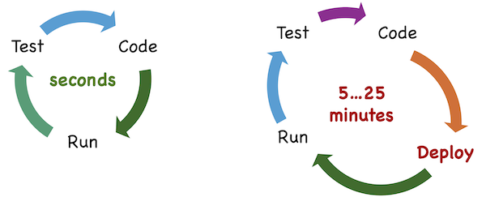
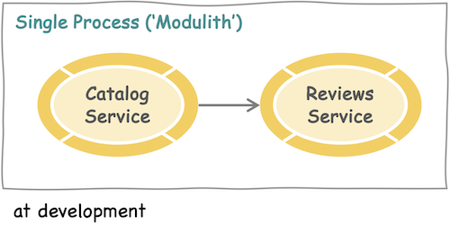
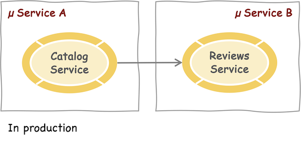

# Introduction to CAP

Value Propositions {.subtitle}

[[toc]]


## What is CAP?

The _Cloud Application Programming Model_ (CAP) is a framework of languages, libraries, and tools for building *enterprise-grade* cloud applications. It guides developers along a *golden path* of **proven best practices**, which are **served out of the box** by generic providers cloud-natively, thereby relieving application developers from tedious recurring tasks.

In effect, CAP-based projects benefit from a primary **focus on domain**, with close collaboration of developers and domain experts, **rapid development** at **minimized costs**, as well as **avoiding technical debts** by eliminating exposure to, and lock-ins to volatile low-level technologies.

Someone once said:

"CAP is like ABAP for the non-ABAP world" {.quote}

... which is not completely true, of course
<br/>... ABAP is much older \:-)

## Jumpstart & Grow As You Go...
###### grow-as-you-go


### Jumpstarting Projects

To get started with CAP, there's only a [minimalistic initial setup](../get-started/index.md) required. Starting a project is a matter of seconds. No tedious long lasting platform onboarding ceremonies are required; instead you can (and should):

- Start new CAP projects within seconds.
- Create functional apps with full-fledged servers within minutes.
- Without prior onboarding to, or being connected to, the cloud.

```sh
cds init
cds watch
```

> [!tip]
>
> Following the principle of *convention over configuration*, CAP uses built-in configuration presets and defaults for different profiles. For the development profile, there's all set up for jumpstart development. In parallel, ops teams could set up the cloud, to be ready for first deployments later in time.


### Growing as You Go...

Add things only when you need them or when you know more. Avoid any premature decisions or up-front overhead. For example, typical CAP projects adopt an *iterative* and *evolutionary* workflow like that:

1. **jumpstart a project** → no premature decisions made at that stage, just the name.
2. **rapidly create** fully functional first prototypes or proof-of-concept versions.
3. work in **fast inner loops** in airplane mode, and only occasionally go hybrid.
4. anytime **add new features** like Fiori UIs, message queues, different databases, etc.
5. do a first **ad-hoc deployment** to the cloud some days later
6. set up your **CI/CD pipelines** some weeks later
7. switch on **multitenancy** and **extensibility** for SaaS apps before going live
8. optionally cut out some **micro services** only if necessary and months later earliest

```sh
cds add hana,redis,mta,helm,mtx,multitenancy,extensibility...
```

> [!tip]
>
> Avoid futile up-front setups and overhead and rather **get started rapidly**, having a first prototype up and running as fast as possible... by doing so, you might even find out soon that this product idea you or somebody else had doesn't work out anyways, so rather stop early ...


### Fast Inner Loops

Most of your development happens in inner loops, where developers would **code**, **run**, and **test** in **fast iteration**. However, at least in mediocre cloud-based development approaches, this is slowed down drastically, for example, by the need to always be connected to platform services, up to the need to always deploy to the cloud to see and test the effects of recent changes.

{.zoom75}

CAP applications are [**agnostic by design**](best-practices#agnostic-by-design), which allows to stay in fast inner loops by using local mock variants as stand-ins for many platform services and features, thereby eliminating the need to always connect to or deploy to the cloud; developers can stay in fast inner loops, without connection to cloud – aka. ***airplane*** mode development. Only when necessary, they can test in ***hybrid*** mode or do ad-hoc deployments to the cloud.

CAP provides mocked variants for several platform services out of the box, which are used automatically through default configuration presets in ***development*** profile, while the real services are automatically used in ***production*** profile. Examples are:

| Platform Service | Development          | Production                       |
| ---------------- | -------------------- | -------------------------------- |
| Database         | SQLite, H2 in-memory | SAP HANA, PostgreSQL             |
| Authentication   | Mocked Auth          | SAP Identity Services            |
| App Gateway      | None                 | SAP App Router                   |
| Messaging        | File-based Queues    | SAP Cloud Appl. Event Hub, Kafka, Redis, ... |

> [!tip]
>
>  CAP's agnostic design, in combination with the local mock variants provided out of the box, not only retains **fast turnarounds** in inner loops, it also **reduces complexity**, and makes development **resilient** against unavailable platform services → thus promoting **maximized speed** at **minimized costs**.


### Agnostic Microservices

CAP's thorough [agnostic design](best-practices#agnostic-by-design) not only allows to swap local mock variants as stand-ins for productive platform services, it also allows to do the same for your application services.

Assumed you plan for a microservices architecture, the team developing microservice `A` would always have a dependency to the availability of microservice `B`, which they need to connect to, at least in a hybrid setup, worst case even ending up in the need to always have both deployed to the cloud.

With CAP, you can (and should) instead just run both services in the same local process at development, basically by using `B` as a plain old library in `A`, and only deploy them to separate microservices in production, **without having to touch your models or code** (given `A` uses `B` through public APIs, which should always be the case anyways).

{.zoom66}

{.zoom66}

If service `A` and `B` are developed in different runtimes, for example, Node.js and Java, you can't run them in the same process. But even then you can (and should) leverage CAP's ability to easily serve a service generically based on a service definition in CDS. So during development, `A`  would use a mocked variant of `B` served automatically by CAP's generic providers.


### Late-cut Microservices

You can (and should) also leverage the offered options to have CAP services co-deployed in a single *modulithic* process to delay the decision of whether and how to cut your application into microservices to a later phase of your project, when you know more about where to actually do the right cuts in the right way.

In general, we always propose that approach:

1. **Avoid** premature cuts into microservices → ends up in lots of pain without gains
2. **Go for** a *modulith* approach instead → with CAP services for modularization
3. Cut into separate microservices **later on** → only when you really need to

>  [!tip]
>
>  - **CAP services** are your primary means for modularization
>  - **Microservices** are **deployment units**.
>  - **Valid** reasons for microservices are:
>   1. need to scale things differently
>   2. different runtimes, for example, Node.js vs Java
>   3. loosely coupled, coarse-grained subsystems with separate lifecycles
>  - **False** reasons are: distributed development, modularization, isolation, ... → there are well established and proven better ways to address these things, without the pain which comes with microservices.

[See also the anti pattern of *Microservices Mania*](bad-practices#microservices-mania) {.learn-more}


### Parallelized Workflows


As shown in the [*Bookshop by capire*](../get-started/in-a-nutshell) walkthrough, a simple service definition in CDS is all we need to run a full-fledged REST, or OData, or GraphQL server

There are more options to parallelize workflows. Fueled by service definition is all that is required to get a full-fledged REST or OData service **served out of the box** by generic providers.

So, projects could spawn two teams in parallel: one working on the frontend using automatically served backends, while the other one works on the actual implementations of the backend part.


## Proven Best Practices


### Served Out Of The Box


The CAP runtimes in Node.js and Java provide many generic implementations for recurring tasks and best practices, distilled from proven SAP applications. This is a list of the most common tasks covered by the core frameworks:

- [Serving CRUD Requests](../guides/providing-services#generic-providers)
- [Serving Nested Documents](../guides/providing-services#deep-reads-and-writes)
- [Serving Variable Data](../releases/archive/2024/oct24#basic-support-for-cds-map) <Alpha/>
- [Serving (Fiori) Drafts](../advanced/fiori#draft-support)
- [Serving Media Data](../guides/providing-services#serving-media-data)
- [Searching Data](../guides/providing-services#searching-data)
- [Pagination](../guides/providing-services#implicit-pagination)
- [Sorting](../guides/providing-services#implicit-sorting)
- [Authentication](../node.js/authentication)
- [Authorization](../guides/security/authorization)
- [Localization / i18n](../guides/i18n)
- [Basic Input Validation](../guides/providing-services#input-validation)
- [Auto-generated Keys](../guides/providing-services#auto-generated-keys)
- [Concurrency Control](../guides/providing-services#concurrency-control)

<br/>

> [!tip]
>
> This set of automatically served requests and covered related requirements, means that CAP's generic providers automatically serve the vast majority, if not all of the requests showing up in your applications, without you having to code anything for that, except for true custom domain logic.

[See also the *Features Overview*](./features) {.learn-more}


### Enterprise Best Practices


On top of the common request-serving related things handled by CAP's generic providers, we provide out of the box solutions for these higher-level topic fields:

- [Common Reuse Types & Aspects](../cds/common)
- [Managed Data](../guides/domain-modeling#managed-data)
- [Localized Data](../guides/localized-data)
- [Temporal Data](../guides/temporal-data)
- [Data Federation](https://github.com/SAP-samples/teched2022-AD265/wiki) → hands-on tutorial; capire guide in the making...
- [Verticalization & Extensibility](../guides/extensibility/)

<br/>

> [!tip]
>
> These best practice solutions mostly stem from close collaborations with as well as contributions by real, successful projects and SAP products, and from ABAP. Which means they've been proven in many years of adoption and real business use.


### The 'Calesi' Effect


'**Calesi**' stands for "**CA**P-**le**vel **S**ervice **I**ntegrations" as well as for an initiative we started late 2023 by rolling out the *CAP Plugins* technique, which promotes plugins and add-ons contributions not only by the CAP team, but also by

- **SAP BTP technology units** and service teams (beyond CAP team)
- **SAP application teams**
- **Partners** & **Customers**, as well as
- **Contributors** from the CAP community

That initiative happened to be successful, and gave a boost to a steadily **growing ecosystem** around CAP with an active **inner source** and **open source** community on the one hand side. On the other hand, it resulted into an impressive collection of production-level add-ons. Here are some highlights **maintained by SAP teams**:

- [GraphQL Adapter](../plugins/#graphql-adapter)
- [OData V2 Adapter](../plugins/#odata-v2-proxy)
- [WebSockets Adapter](../plugins/#websocket)
- [UI5 Dev Server](../plugins/#ui5-dev-server)
- [Open Telemetry → SAP Cloud Logging, Dynatrace, ...](../plugins/#telemetry)
- [Attachments → SAP Object Store /S3](../plugins/#attachments)
- [Attachments → SAP Document Management Service](../plugins/#@cap-js/sdm)
- [Messaging → SAP Cloud Application Event Hub](../plugins/#event-hub)
- [Change Tracking](../plugins/#change-tracking)
- [Notifications](../plugins/#notifications)
- [Audit Logging → SAP Audit Logging](../plugins/#audit-logging)
- [Personal Data Management → SAP DPI Services](../guides/data-privacy/)
- [Open Resource Discovery (ORD)](../plugins/#ord-open-resource-discovery)

>  [!tip]
>
> This is just a subset and a snapshot of the growing number of plugins <br/>→ find more in the [***CAP Plugins***](../plugins/) page, as well in the [***CAP Commmunity***](../resources/community-sap) spaces.


### Intrinsic Extensibility <UnderConstruction/>

SaaS customers, verticalization partners, or your teams can...

- Add/override annotations, translations, initial data
- Add extension fields, entities, relationships
- Add custom logic → in-app + side-by-side
- Bundle and share that as reuse extension packages
- Feature-toggle such pre-built extension packages per tenant

All of these tasks are done in [the same way as you do in your own projects](best-practices.md#intrinsic-extensibility):

- Using the same techniques of CDS Aspects and Event Handlers
- Including adaption and extensions of reuse types/models
- Including extensions to framework-provided services

And all of that is available out of the box, that is, without you having to create extension points. You would want to restrict who can extend what, though.


### Cloud-Native by Design


CAP's [service-centric paradigm](best-practices#services) is designed from the ground up for cloud-scale enterprise applications. Its core design principles of flyweight, stateless services processing passive, immutable data, complemented by an intrinsic, ubiquitous [events-based](best-practices#events) processing model greatly promote scalability and resilience.

On top of that, several built-in facilities address many things to care about in cloud-based apps out of the box, such as:

- **Multitenancy** → tenant *isolation* at runtime; *deploy*, *subscribe*, *update* handled by MTX
- **Extensibility** → for customers to tailor SaaS apps to their needs →  [see Intrinsic...](#intrinsic-extensibility)
- **Security** → CAP+plugins do authentications, certificates, mTLS, ...
- **Scalability** → by stateless services, passive data, messaging, ...
- **Resilience** → by messaging, tx outbox, outboxed audit logging, ...
- **Observability** → by logging + telemetry integrated to BTP services

<br/>

> [!tip]
>
> Application developers don't have to and **should not have to care** about these complex non-functional requirements. Instead they should [focus on domain](#focus-on-domain), that is, their functional requirements, as much as possible.

> [!caution]
>
> Many of these crucial cloud qualities are of complex and critical nature, for example, **multitenancy**, **isolation** and **security**, but also scalability and resilience isn't that easy to do right → it's a **high risk** to assume each application developer in each project is doing everything in the right ways


### Open _and_ Opinionated


That might sound like a contradiction, but it isn't: While CAP certainly gives *opinionated* guidance, we do so without sacrificing openness and flexibility.  At the end of the day, you stay in control of which tools or technologies to choose, or which architecture patterns to follow as depicted in the following table.

| CAP is *Opinionated* in...                                   | CAP is *Open* as...                                          |
| ------------------------------------------------------------ | ------------------------------------------------------------ |
| **Platform-agnostic APIs** to avoid lock-ins to low-level stuff. | All abstractions follow a glass-box pattern that allows unrestricted access to lower-level things, if necessary |
| **Best practices**, served out of the box by generic providers | You're free to do things your way in [custom handlers](../guides/providing-services#custom-logic), ... while CAP simply tries to get the tedious tasks out of your way. |
| **Out-of-the-box support** for <br> **[SAP Fiori](https://developers.sap.com/topics/ui-development.html)** and **[SAP HANA](https://developers.sap.com/topics/hana.html)** | You can also choose other UI technologies, like [Vue.js](../get-started/in-a-nutshell#vue). Other databases are supported as well. |
| **Tools support** in [SAP Build Code](../tools/cds-editors#bas) or [VS Code](../tools/cds-editors#vscode). | Everything in CAP can be done using the [`@sap/cds-dk`](../tools/cds-cli) CLI and any editor or IDE of your choice. |

<br/>

> [!tip]
>
> And most important: As CAP itself is designed as an open framework, everything what's not covered by CAP today can be solved in application projects, in specific custom code, or by [generic handlers](best-practices.md#extensible-framework) ... or by [plugins](../plugins/index.md) that you could build and contribute. <br/>⇒  **Contributions *are* welcome!**


## Focus on Domain

CAP places **primary focus on domain**, by capturing _domain knowledge_ and _intent_ instead of imperative coding — that means, _What, not How_ — which promotes the following:

- Close collaboration of _developers_ and _domain experts_ in domain modeling.
- _Out-of-the-box_ implementations for _best practices_ and recurring tasks.
- _Platform-agnostic_ approach to _avoid lock-ins_, hence _protecting investments_.

### Conceptual Modeling by CDS <UnderConstruction/>

### Domain-Driven Design <UnderConstruction/>

### Rapid Development <UnderConstruction/>

### Minimal Distraction <UnderConstruction/>


## Avoid Technical Debt

There are several definitions of technical debt found in media which all boil down to:

Technical debt arises when speed of delivery is prioritized over quality. <br>The results must later be revised, thoroughly refactored, or completely rebuilt. {.quote}

So, how could CAP help to avoid, or reduce the risks of piling up technical debt?

### Less Code → Less Mistakes

Every line of code not written is free of errors. {.quote}

Moreover:

- Relieving app dev teams from overly technical disciplines not only saves efforts and time, it also avoids **severe mistakes** which can be made in these fields, for example, in tenant isolation and security.
- **Best practices** reproduce proven solution patterns to recurring tasks, found and refined in successful application projects; your peers.
- Having them **served out of the box** paves the path for their adoption, and hence reduces the likelihood of picking anti patterns instead.

### Single Points to Fix

Of course, we also make mistakes and errors in CAP, but ...

- We can fix them centrally and all CAP users benefit from that immediately.
- Those bugs are frequently found and fixed by your peers in crime, before you even encounter them yourselves.
- And this effect increases with steadily growing adoption of CAP that we see, ...
- And with the open culture we established successfully, for example, **open issue reports** in GitHub, that is, the standard out there, instead of private support tickets — a relict of the past.

> Note that all of this is in contrast to code generators, where you can't fix code generated in the past → see also [*Avoid Code Generators*](bad-practices#code-generators) in the anti patterns guide.

### Minimized Lock-Ins

Keeping pace with a rapidly changing world of volatile cloud technologies and platforms is a major challenge, as today's technologies that might soon become obsolete. CAP avoids such lock-ins and shields application developers from low-level things like:

- **Authentication** and **Authorization**, incl. things like Certificates, mTLS, OAuth, ...
- **Service Bindings** like K8s secrets, VCAP_SERVICES, ...
- **Multitenancy**-related things, especially w.r.t. tenant isolation
- **Messaging** protocols or brokers such as AMQP, MQTT, Webhooks, Kafka, Redis, ...
- **Networking** protocols such as HTTP, gRCP, OData, GraphQL, SOAP, RFC, ...
- **Audit Logging** → use the *Calesi* variant, which provides ultimate resilience
- **Logs**, **Traces**, **Metrics** → CAP does that behind the scenes + provides *Calesi* variants
- **Transaction Management** → CAP manages all transactions → don't mess with that!

> [!tip]
>
> CAP not only abstracts these things at scale, but also does most things automatically in the background. In addition, it allows us to provide various implementations that encourage *Evolution w/o Disruption*, as well as fully functional mocks used in development.

> [!caution]
>
> Things get dangerous when application developers have to deal with low-level security-related things like authentication, certificates, tenant isolation, and so on. Whenever this happens, it's a clear sign that something is seriously wrong.


## What about AI? <UnderConstruction/>

- AI provides tremendous boosts to productivity → for example:
  - **Coding Assists** → for example, by [GitHub Copilot](https://github.com/features/copilot) in `.cds`, `.js`, even `.md` sources
  - **Code Analysis** → detecting [bad practices](bad-practices) → guiding to [best practices](best-practices)
  - **Code Generation** → for example, for tests, test data, ...
  - **Project Scaffolding** → for quick head starts
  - **Search & Learning Assists** → like SAP Joule, ...
- But this doesn't replace the need for **Human Intelligence**!
  - There's a different between a GPT-generated one-off thesis and long-lived enterprise software, which needs to adapt and scale to new requirements.

By **embracing and advocating standard tooling** like VS Code and GitHub Actions, CAP ensures its projects are day-one beneficiaries of new AI features rolled out there.

**CAP itself** is a major contribution to AI → its simple, clear concepts, uniform ways to implement and consume services make it easier for AIs and humans alike to reason about the system.

Its openness and public visibility helped influence the very first AI models — even the original ChatGPT knew some CAP, and its baked-in knowledge of it has since improved dramatically.
