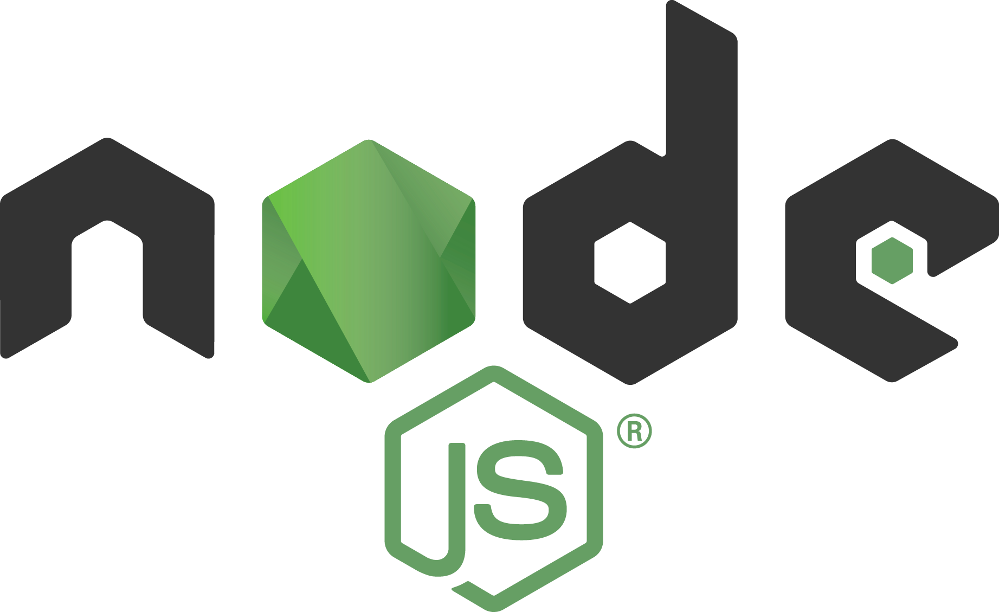
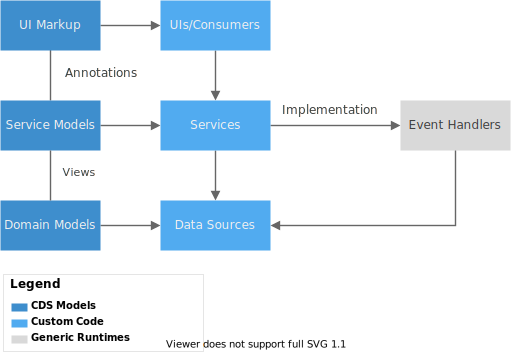
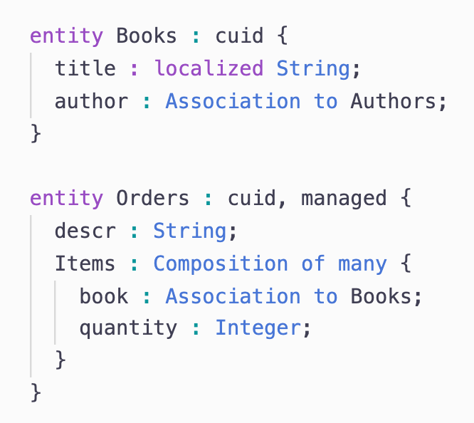
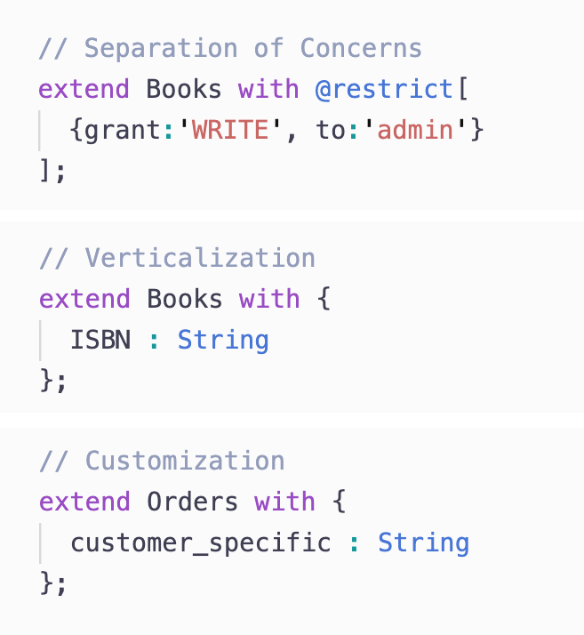
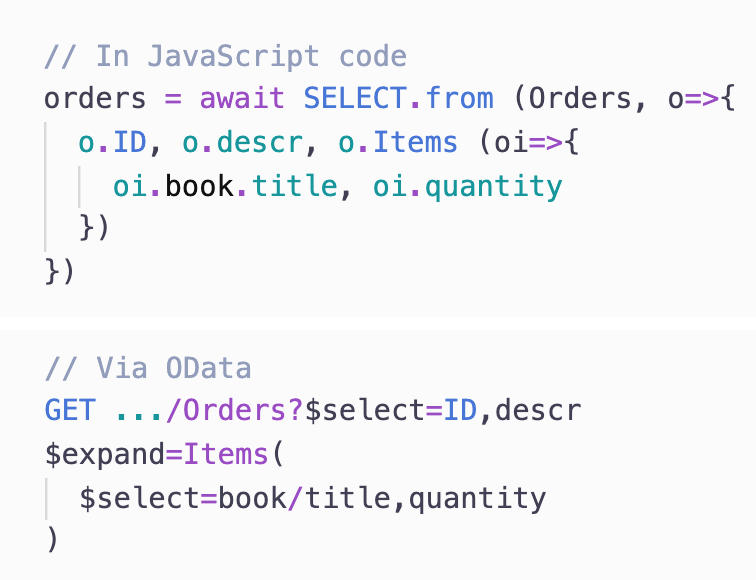
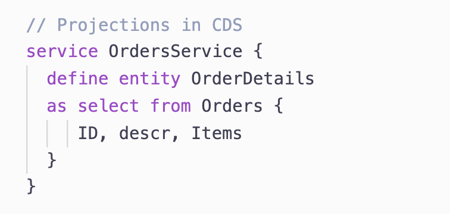
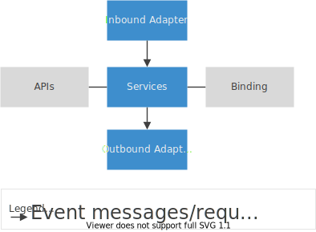
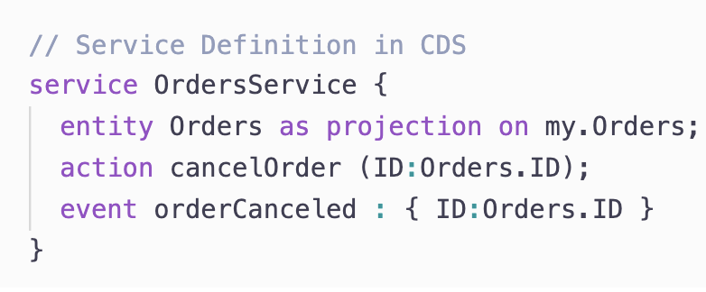
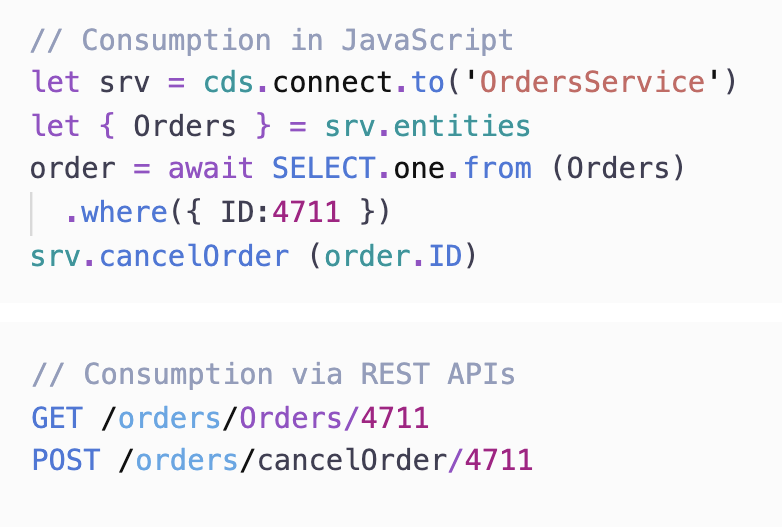
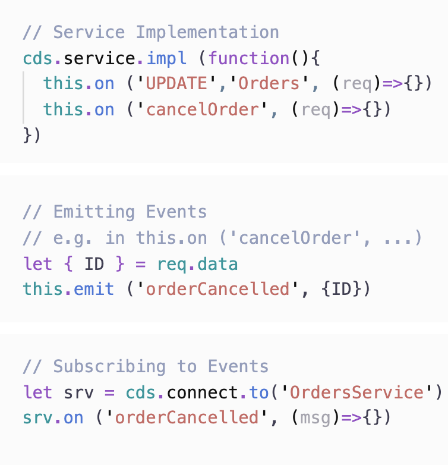

# About CAP

<!--@include: ../links.md-->

The _SAP Cloud Application Programming Model_ (CAP) is a framework of **languages**, **libraries**, and **tools** for building enterprise-grade services and applications. It guides developers along a 'golden path' of proven [**best practices**](#enterprise-best-practices) and a great wealth of [**out-of-the-box solutions**](#generic-providers) to recurring tasks.

CAP-based projects benefit from a **[primary focus on domain](#domain-modeling)**. Instead of delving into overly technical disciplines, we focus on **[accelerated development](#grow-as-you-go)** and **[safeguarding investments](#agnostic-approach)** in a world of rapidly changing cloud technologies.

<br>


## Overview & Design Principles {:#overview}

The CAP framework features a mix of proven and broadly adopted open-source and SAP technologies, as highlighted in the figure below.


<div id="logos" style="text-align:center;">
  
  
  
  
</div>

<style scoped>
  #logos img { display:inline-block; margin: 0 11px 11px; }
</style>

On top of open source technologies, CAP mainly adds:

- **Core Data Services (CDS)** as our universal modeling language for both domain models and service definitions.


- **Service SDKs and runtimes** for Node.js and Java, offering libraries to implement and consume services as well as generic provider implementations serving many requests automatically.


### Agnostic Design <wbr/> &rarr; *Safeguarding Investments* {:#agnostic-approach}

Keeping pace with a rapidly changing world of cloud technologies and platforms is a major challenge when having to hardwire too many things to today’s technologies, which might soon become obsolete. **CAP avoids such lock-ins** through **higher-level concepts and APIs**, which abstract low-level platform features and protocols to a large extent. In particular, this applies to things like:

- Platform-specific deployment approaches and techniques
- Platform-specific identity providers and authentication strategies
- On/Off-boarding of tenants in SaaS solutions and tenant isolation
- Synchronous protocols like *REST*, *OData*, or *GraphQL* <sup>1</sup>
- Asynchronous channels and brokers like *SAP Event Mesh*, *MQ*, or *Kafka* <sup>1</sup>
- Different database technologies including *SQL* and *NoSQL*


These abstractions allow us to quickly adapt to new emerging technologies or platforms, without affecting application code, thus **safeguarding your investments**.


### CAP is Open _and_ Opinionated <wbr/> &rarr; *Zero Lock-in* {:#open-and-opinionated}

That might sound like a contradiction, but isn't: While CAP certainly gives *opinionated* guidance, we do so without sacrificing openness and flexibility.  At the end of the day, **you stay in control** of which tools or technologies to choose, or which architecture patterns to follow as depicted in the table below.

| CAP is *Opinionated* in...                                   | CAP is *Open* as...                                          |
| ------------------------------------------------------------ | ------------------------------------------------------------ |
| **Higher-level concepts and APIs** abstracting from and avoiding lock-ins to low-level platform features and protocols | All abstractions follow a glass-box pattern that allows unrestricted access to lower-level things, if required |
| **Best Practices served out-of-the-box** with generic solutions for many recurring tasks | You can always handle things your way in [custom handlers](../guides/providing-services#adding-custom-logic), decide whether to adopt [CQRS](./related#cqrs) or [Event Sourcing](./related#event-sourcing), for example ... while CAP simply tries to get the tedious tasks out of your way. |
| **Out-of-the-box support** for <br> **[SAP Fiori]** and **[SAP HANA]** | You can also choose other UI technologies, like [Vue.js](../get-started/in-a-nutshell#vue), or databases, by providing new database integrations. |
| **Dedicated tools support** provided in [SAP Business Application Studio](../tools/#bastudio), and [Visual Studio Code](../tools#vscode) or [Eclipse](../java/getting-started#eclipse). | CAP doesn't depend on those tools. Everything in CAP can be done using the [`@sap/cds-dk`](../get-started) CLI and any editor or IDE of your choice. |


### Key Concepts & Paradigms

The following sections highlight key concepts of CAP, which are based on two major paradigms: A **declarative paradigm** using CDS to capture knowledge about problem domains, and a **service-centric paradigm**, with ubiquitous notions of _Services_, _Events_, and _Queries_.

## Focus on Domain, Powered by CDS {:#domain-modeling}
<!-- label='Focus on Domain, by CDS' -->

CAP places **primary focus on domain**, by capturing _domain knowledge_ and _intent_ instead of imperative coding — that means, _What, not How_ — thereby promoting:

- Close collaboration of _developers_ and _domain experts_ in domain modeling.
- _Out-of-the-box_ implementations for _best practices_ and recurring tasks.
- _Platform-agnostic_ approach to _avoid lock-ins_, hence _protecting investments_.

The figure below illustrates the prevalent use of CDS models (in the left column), which fuel generic runtimes, like the CAP service runtimes or databases.

<figure>
  
  <figcaption>Anatomy of a Typical Application</figcaption>
</figure>

###### Core Data Services (CDS)

[CDS](../cds/) is our universal modeling language to capture static, as well as behavioral aspects of problem domains in **conceptual**, **concise**, and **comprehensible** ways, and hence serves as the very backbone of CAP.

###### Domain Models in CDS



Domain Models capture static aspects of problem domains as well-known _entity-relationship models_.

**_[Associations](../cds/cdl#associations)_** capture relationships. _[Compositions](../cds/cdl#compositions)_ extend that to easily model **document structures**.

**_[Annotations](../cds/cdl#annotations)_** allow enriching models with additional metadata, such as for [UIs](../advanced/fiori), [Validations](../guides/providing-services/#input-validation), [Input Validation](../guides/providing-services/#input-validation) or [Authorization](../guides/authorization/).

###### CDS Aspects & Mixins



**_[Aspects](../cds/cdl#aspects)_** allow to flexibly **extend** models in same or separate modules, packages, or projects; at design time or dynamically at runtime.

This greatly promotes **[adaptability](../guides/extensibility)** in _verticalization_ and _customization_ scenarios, especially in SaaS solutions.

Moreover, that fosters [**separation of concerns**](../guides/domain-models#use-aspects-for-separation-of-concerns-and-verticalization), for example to keep domain models clean and comprehensible, by factoring out technical concerns.

<br>

## Proven Best Practices, Served Out-of-the-Box {:#generic-providers label='Proven Best Practices'}


The CAP runtimes in Node.js and Java provide many generic implementations for recurring tasks and best practices, distilled from proven SAP applications.
Benefits are significantly **accelerated** development, **minimized boilerplate** code, as well as **increased quality** through single points to fix and optimize.

Following is an excerpt of generic features provided:

###### Automatically Serving Requests

- [Serving CRUD Requests](../guides/providing-services#generic-providers)
- [Serving Nested Documents](../guides/providing-services#serving-documents)
- [Serving Media Data](../guides/media-data)
- [Serving Draft Choreography](../advanced/fiori#draft-support)

###### Handling Recurring Tasks

- [Implicit Pagination](../guides/providing-services#implicit-pagination)
- [Input Validation](../guides/providing-services#input-validation)
- [Authentication](../node.js/authentication)
- [Authorization](../guides/authorization)
- [Localization / i18n](../guides/i18n)
- [Concurrency Control](../guides/providing-services#concurrency-control)

###### Enterprise Best Practices

- [Common Reuse Types & Aspects](../cds/common)
- [Managed Data](../guides/providing-services#managed-data)
- [Localized Data](../guides/localized-data)
- [Temporal Data](../guides/temporal-data)
- [Verticalization & Extensibility](../guides/extensibility)

<br>

[See also the Features Overview](./features){:.learn-more}


## Dynamic Querying & Views {:#querying}
 <!-- label='Querying & Views' -->

All data access in CAP is through dynamic queries, which allows clients to request the exact information they really need. These powerful intrinsic querying capabilities are key enablers for **serving requests automatically**.

> The querying-based approach to process data is in strong contrast to Object-Relational Mapping (→ see also *[Related Concepts: CAP != ORM](related#orm)*)


###### Core Query Language (CQL)

**[CQL](../cds/cql)** is CDS’s advanced query language. It enhances standard SQL with elements to easily query deeply nested **object graphs** and **document structures**. For example, here's a query in CQL:

```sql
SELECT ID, addresses.country.name from Employees
```
... and the same in plain SQL:
```sql
SELECT Employees.ID, Countries.name FROM Employees
 LEFT JOIN Addresses ON Addresses.emp_ID=Employees.ID
 LEFT JOIN Countries AS Countries ON Addresses.country_ID = Countries.ID
```

###### Queries as first-order Objects (CQN)



**Queries are first-order objects** – using [CQN](../cds/cqn) as a plain object notation – sent
to **local** services directly,
to **remote** services through protocols like *OData* or *GraphQL*<sup>1</sup>,
or to **database** services, which translate them to native database queries for optimized execution with **late materialization**.

###### Projections at Design Time



We also use [CQL](../cds/cql) in CDS to declare [_de-normalized views_](../cds/cdl#views) on the underlying domain model, such as in tailored service APIs.

<br>


## Services & Events {:#services}

All behavioral aspects in CAP are based on ubiquitous notions of [Services](#services) and [Events](#events), as expressed in this manifest:

1. _All active things are Services_ --- local ones, remote ones, as well as databases
2. *Services are [declared in CDS](#service-definitions-in-cds)* --- reflected and used in generic service providers
3. *Services [provide uniform APIs](#uniform-consumption)* --- consumed by other services or frontends
4. _Services [react on Events](#events)_ --- covering _synchronous_ and _asynchronous_ APIs
5. *Services [consume other Services](#uniform-consumption)* --- in event handler implementations
6. _All data is passive_ --- that is, without its own behavior, adhering to _REST_

Services in CAP are **stateless** and with a **minimal footprint**, which allows you to modularize solutions into single-purposed (nano) services or functions-as-a-service.

<figure>
  
  <figcaption><a href="related#hexagonal-architecture">Hexagonal Architecture à la CAP</a></figcaption>
</figure>


###### Service Definitions in CDS



Services are declared in CDS models, used to [serve requests automatically](#generic-providers). They embody the behavioral aspects of a domain in terms of exposed **entities**, **actions**, and **events**.


###### Uniform Consumption



**Every active thing in CAP is a service**, including *local* services or *remote* ones --- even *databases* are represented as services.

All services provide a **uniform** API for programmatic consumption. Thus, application code stays **agnostic** to underlying protocols.

::: tip _[Late-cut µ services](../guides/providing-services#late-cut-microservices)_{:.tip-title}
This protocol-agnostic API allows [mocking remote services](../get-started/grow-as-you-go#with-mocks), as well as late changes to service topologies, for example, co-locating services in a single process or deploying them to separate micro services later on.
:::


###### Ubiquitous Events {:#events}



**Everything in CAP happens in response to events.** CAP features a ubiquitous notion of events, which represent both, *requests* coming in through **synchronous** APIs, as well as **asynchronous** *event messages*, thus blurring the line between both worlds.

We add custom logic in [event handlers](../guides/providing-services#event-handlers), registered to **implement** service operations. In the same way, we **subscribe** to asynchronous events emitted by other services.

::: tip _Domain-level Eventing_{:.tip-title}
Instead of talking to message brokers, services in CAP simply emit events on themselves, and consumers subscribe to events from services. Everything else is handled behind the scenes.
:::


## Jumpstart & Grow-as-you-go {:#grow-as-you-go}
 <!-- label='Grow as You Go' -->

Following the principle of **convention over configuration**, there’s no need to set up things upfront. CAP allows you to **jumpstart** projects within seconds and have a team starting development right away, using generic providers, on top of a lightweight in-memory database → see [*Getting Started in a Nutshell*](../get-started/in-a-nutshell).

CAP also offers **mocks for many platform features**, which allow **fast dev-test-run cycles** with minimal development environment complexity — aka *Airplane Mode*. Similarly, CAP greatly facilitates **integration scenarios** by simply importing an API from, say, an SAP S/4 backend or from SAP API Hub and running mocks for this locally.

Over time, you **add things gradually**, only when they’re needed. For example, you can move ahead to running your apps in close-to-productive setups for integration tests and delivery, without any change in models or code. → see [*Grow-as-you-Go*](../get-started/grow-as-you-go).

Finally, projects are encouraged to **parallelize workloads**. For example, following a **contracts-first** approach, a service definition is all that is required to automatically run a full-fledged REST or OData service. So, projects could spawn two teams in parallel: one working on the frontend, while the other one works on the backend part. A third one could start setting up CI/CD and delivery in parallel.

<br>


## [Related Concepts](./related) {:.toc-redirect}

[Learn more how CAP relates to other concepts.](./related){:.learn-more}

## [Features Overview](./features)
{:.toc-redirect}

[Get an overview of all features.](./features){:.learn-more}

## [Glossary](./glossary) {:.toc-redirect}

[Glossary of common terms and abbreviations.](./glossary){:.learn-more}


<br>

---
<div markdown="1" style="font-size:90%; color:#666">
<sup>1</sup> *GraphQL* and *Kafka* aren’t supported out-of-the-box today, but might be added in future.
</div>
