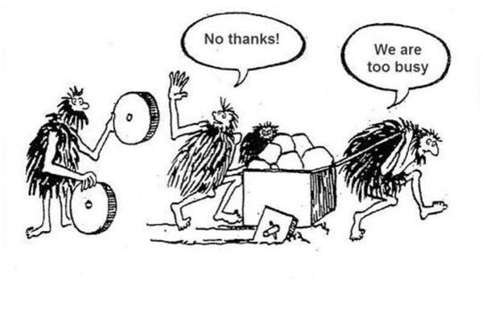

# Best Practices by CAP
A Primer {.subtitle}


The _Cloud Application Programming Model_ (CAP) is a framework of languages, libraries, and tools for building *enterprise-grade* cloud applications. It guides developers along a *golden path* of proven [best practices](#enterprise-best-practices), served [out-of-the-box](#served-out-of-the-box), and hence greatly reducing boilerplate and tedious recurring tasks.

In effect, CAP-based projects benefit from a primary [focus on domain](#focus-on-domain) in close collaboration with domain experts, and from [accelerated development](#grow-as-you-go) at minimised costs. CAP's *agnostic design* shields developers from overly technical disciplines, and fosters [evolution w/o disruption]() in a world of rapidly changing technologies.


[[toc]]


## Architecture Overview {#overview}

The CAP framework is built on a choice of proven open-source technologies, namely [Node.js]() and [Java](), with [express]() and [Spring]() as web frameworks. On top of these, CAP adds these major building blocks:

- [Core Data Services (CDS)](../cds/) — our universal domain modeling language
- [Services](../guides/providing-services.md) for [Node.js](../node.js/) and [Java](../java/) — incl. generic providers
- [Protocol Adaptors](../guides/) for protocol-agnostic remoting via REST, OData, GraphQL, ...
- [Connectors](../guides/) for integration of platform services without lock-in
- [Command Line Interface](../tools/) and plugins for [VS Code](), [IntelliJ](), and [Eclipse]().

{style="width:555px"}

In addition, tool suites like [SAP Build Code]() have chosen CAP as a core technology to build on and for. At the same time strong open-source and inner-source [communities]() contribute increasing numbers of [plugins](), that enhance CAP in various ways.


## Key Concepts


### Domain Models

CAP apps use [CDS](../cds/) as our universal modelling language to iterativelly capture domain knowledge in [Entity-Relationship Models]() in *concise* and *comprehensible* ways.

#### Entity-Relationship Modelling

A simplistic Entity-Relationship Model would look like this in CDS:

::: code-group
```cds [Entity-Relationship Model]
entity Books : cuid, managed {
  title  : localized String;
  author : Association to Authors;
}
entity Orders : cuid, managed {
  Items : Composition of many {
    book : Association to Books;
    quantity : Integer;
  }
}
```
:::

#### Aspect-oriented Modelling

Intrinsic [Aspect-oriented Modelling]() allows to flexibly *extend* models in same or separate modules, packages, or projects; at design time or dynamically at runtime. This greatly promotes [adaptability](../guides/extensibility/) in _verticalization_ and _customization_ scenarios, as well as [separation of concerns](../guides/domain-modeling#separation-of-concerns), and thus keeping domain models clean and comprehensible, by factoring out technical concerns.

::: code-group
```cds [Separation of Concerns]
extend Books with @restrict: [
  { grant:'WRITE', to:'admin' }
];
```
:::
::: code-group
```cds [Verticalization]
extend Books with {
  ISBN : String
};
```
:::
::: code-group
```cds [Customization]
extend Orders with {
  customer_specific : String
};
```
:::

#### Models fuel Generic Runtimes

CDS models utimately fuel the CAP runtimes which automatically serve most requests, even for deeply structured documents, based on reflected models.


### Services

Services are also declared in CDS, as views on underlying domain models. They act as *facades* to an application's core domain data, with their declared or inferred structure of entities and elements, plus custom actions and events, constituting the *interfaces* to clients.

#### Services as Interfaces

A standalone service definition with fully declared interface could look like that:

::: code-group

```cds [Service Definition in CDS]
service OrdersService {
  entity Orders { key ID:UUID; title:String; Items: ... };
  action cancelOrder (ID:Orders.ID);
  event orderCanceled : { ID:Orders.ID }
}
```

:::

#### Services as Facades

Most frequently though, services would expose (denormalised) views on underlying domain models, as in this example:

::: code-group

```cds [Service as Facade]
using { my.bookshop as my } from '../db/schema';
service CatalogService {   // intended and designed to serve end users
  @readonly entity Books as projection on my.Books { *,
    author.name as author, // flattened
  } excluding {
    createdBy, modifiedBy, // as end users shouldn't see them
    localized, texts,      // as end users don't need them
  };
}
```

The interface would result from the inferred elements structure from the given projection, which used CDS' query language CQL.

:::

> [!tip]
>
> The example above is a good example for the recommended best practice of a *[single-purposed service]()* which is specialized on *one* specific use case and group of users. Learn more about that in the [Providing Services]() guide.


#### Service-centric Paradigm

The Services framework in the CAP runtimes are thoroughly built on a *Service-centric Paradigm* which manifests in the following key design principles:

- [**Every** active thing is a **service**]() <sup>1)</sup>
- [Services establish **interfaces**](#services-as-interfaces) <sup>2)</sup>
- [Services react to **events**](#events) <sup>3)</sup>
- [Services run **queries**](#querying) <sup>4)</sup>
- [Services are **agnostic**](#agnostic-design) <sup>5)</sup>
- [Services are **stateless**]() <sup>6)</sup>
- [Services process **passive data**]() <sup>6)</sup>

<sup>1)</sup> Comprising your [application services](), as well as [framework services](). <br/>
<sup>2)</sup> Comprising interfaces [_provided_](../guides/providing-services) by your app, as well as imported, [_consumed_](../guides/using-services) ones. <br/>
<sup>3)</sup> Comprising _synchronous_ and _asynchronous_ events, sent from _local_ or _remote_ clients. <br/>
<sup>4)</sup> With late materialization, and push-down to database → the opposite of ORMs! <br/>
<sup>5)</sup> Re volatile technologies, as well as to being called *locally* or *remotely* via whatever *protocol*. <br/>
<sup>6)</sup> Key for *multitenancy*, maximized *scalability*, and minimized overhead. <br/>


> [!tip]
>
> These key design principles — and adherence to them — are **crucial** to **benefit** from CAP's advantages and value propositions. They are *key enablers* and *preconditions* for [accelerated development at minimized costs](), maximized [scalability]() and minimized overhead, [late-cut µ services](), and hence [grow as you go]().


### Events

The Service-centric Paradigm is complemented by a ubiquitous notion of events:

- **Everything** happening is in reaction to **Events**:
- *generic* & *custom*
- *sync* & *async*
- *local* & *remote*

Service implementations are essentially collections of event handlers that react on incomming events.

----


**Everything in CAP happens in response to events.** CAP features a ubiquitous notion of events, which represent both, *requests* coming in through **synchronous** APIs, as well as **asynchronous** *event messages*, thus blurring the line between both worlds.

We add custom logic in [event handlers](../guides/providing-services#event-handlers), registered to **implement** service operations. In the same way, we **subscribe** to asynchronous events emitted by other services.

::: code-group
```js [Service Implementation]
cds.service.impl (function(){
  this.on ('UPDATE','Orders', (req)=>{})
  this.on ('cancelOrder', (req)=>{})
})
```
:::
::: code-group
```js [Emitting Events]
// in this.on ('cancelOrder', ...)
let { ID } = req.data
this.emit ('orderCancelled', {ID})
```
:::
::: code-group
```js [Subscribing to Events]
let srv = cds.connect.to('OrdersService')
srv.on ('orderCancelled', (msg)=>{})
```
:::

> [!tip]
>
> Instead of talking to message brokers, services in CAP simply emit events on themselves, and consumers subscribe to events from services, local or remote, in a broker-agnostic way. Everything else is handled behind the scenes. We call this *[Domain-level Eventing]()*.


### Querying

All data access in CAP is through dynamic queries, which allows clients to request the exact information they really need. These powerful intrinsic querying capabilities are key enablers for **serving requests automatically**.

> Note: The querying-based approach to process data is in strong contrast to Object-Relational Mapping (→ see also *[Related Concepts: CAP != ORM]()*)

#### Core Query Language (CQL)


**[CQL](../cds/cql)** is CDS's advanced query language. It enhances standard SQL with elements to easily query deeply nested **object graphs** and **document structures**. For example, here's a query in CQL:

```sql
SELECT ID, addresses.country.name from Employees
```

... and the same in plain SQL:

```sql
SELECT Employees.ID, Countries.name FROM Employees
 LEFT JOIN Addresses ON Addresses.emp_ID=Employees.ID
 LEFT JOIN Countries AS Countries ON Addresses.country_ID = Countries.ID
```


#### Queries as first-order Objects (CQN)


```js
// In JavaScript code
orders = await SELECT.from (Orders, o=>{
  o.ID, o.descr, o.Items (oi=>{
    oi.book.title, oi.quantity
  })
})
```

```http
// Via OData
GET .../Orders?$select=ID,descr
$expand=Items(
  $select=book/title,quantity
)
```


**Queries are first-order objects** – using [CQN](../cds/cqn) as a plain object notation – sent
to **local** services directly,
to **remote** services through protocols like *OData* or *GraphQL*,
or to **database** services, which translate them to native database queries for optimized execution with **late materialization**.


#### Projections at Design Time


```cds
// Projections in CDS
service OrdersService {
  define entity OrderDetails
  as select from Orders {
     ID, descr, Items
  }
}
```


We also use [CQL](../cds/cql) in CDS to declare [_de-normalized views_](../cds/cdl#views) on the underlying domain model, such as in tailored service APIs.


### Agnostic Design

Keeping pace with a rapidly changing world of cloud technologies and platforms is a major challenge when having to hardwire too many things to today's technologies, which might soon become obsolete. **CAP avoids such lock-ins** through **higher-level concepts and APIs**, which abstract low-level platform features and protocols to a large extent. In particular, this applies to things like:

- Platform-specific deployment approaches and techniques
- Platform-specific identity providers and authentication strategies
- On-/Offboarding of tenants in SaaS solutions and tenant isolation
- Synchronous protocols like *REST*, *OData*, or *GraphQL*
- Asynchronous channels and brokers like *SAP Event Mesh*, *MQ*, or *Kafka*
- Different database technologies including *SQL* and *NoSQL*

These abstractions allow us to quickly adapt to new emerging technologies or platforms, without affecting application code, thus **safeguarding your investments**.

Services in CAP are **stateless** and with a **minimal footprint**, which allows you to modularize solutions into single-purposed (nano) services or functions-as-a-service.

<figure>
   
</figure>


<br><br>

#### Uniform Consumption


```js
// Consumption in JavaScript
let srv = cds.connect.to('OrdersService')
let { Orders } = srv.entities
order = await SELECT.one.from (Orders)
  .where({ ID:4711 })
srv.cancelOrder (order.ID)
```

```http
// Consumption via REST APIs
GET /orders/Orders/4711
POST /orders/cancelOrder/4711
```

**Every active thing in CAP is a service**, including *local* services or *remote* ones — even *databases* are represented as services.

All services provide a **uniform** API for programmatic consumption. Thus, application code stays **agnostic** to underlying protocols.

> [!tip]
 _[Late-cut µ services]()_ —
This protocol-agnostic API allows [mocking remote services](../guides/using-services#local-mocking), as well as late changes to service topologies, for example, co-locating services in a single process or deploying them to separate micro services later on.


## Key Features & Qualities


### Inner Loop Development

*"Developing for the cloud doesn't development in the cloud"* → means: even though your productive will be deployed to the cloud, consisting use many cloud-based services, and may be a micro services

- Local / Inner Loop Development
  - using mocked platform services
- Disconnected Development
  - using mocked remote services
- Speedup Pipelines


### Focus On Domain

CAP places **primary focus on domain**, by capturing _domain knowledge_ and _intent_ instead of imperative coding — that means, _What, not How_ — thereby promoting:

- Close collaboration of _developers_ and _domain experts_ in domain modeling.
- _Out-of-the-box_ implementations for _best practices_ and recurring tasks.
- _Platform-agnostic_ approach to _avoid lock-ins_, hence _protecting investments_.

The figure below illustrates the prevalent use of CDS models (in the left column), which fuel generic runtimes, like the CAP service runtimes or databases.


Anatomy of a Typical Application{.caption}


### Grow As You Go...

 <!-- label='Grow as You Go' -->

Following the principle of **convention over configuration**, there's no need to set up things upfront. CAP allows you to **jumpstart** projects within seconds and have a team starting development right away, using generic providers, on top of a lightweight in-memory database → see [*Getting Started in a Nutshell*](../get-started/in-a-nutshell).

CAP also offers **mocks for many platform features**, which allow **fast dev-test-run cycles** with minimal development environment complexity — aka *Airplane Mode*. Similarly, CAP greatly facilitates **integration scenarios** by simply importing an API from, say, an SAP S/4 backend or from SAP API Hub and running mocks for this locally.

Over time, you **add things gradually**, only when they're needed. For example, you can move ahead to running your apps in close-to-productive setups for integration tests and delivery, without any change in models or code.

Finally, projects are encouraged to **parallelize workloads**. For example, following a **contracts-first** approach, a service definition is all that is required to automatically run a full-fledged REST or OData service. So, projects could spawn two teams in parallel: one working on the frontend, while the other one works on the backend part. A third one could start setting up CI/CD and delivery in parallel.


### Proven Best Practices ...

### Served Out Of The Box

The CAP runtimes in Node.js and Java provide many generic implementations for recurring tasks and best practices, distilled from proven SAP applications.
Benefits are significantly **accelerated** development, **minimized boilerplate** code, as well as **increased quality** through single points to fix and optimize.

Following is an excerpt of generic features provided:

#### Automatically Serving Requests

- [Serving CRUD Requests](../guides/providing-services#generic-providers)
- [Serving Nested Documents](../guides/providing-services#deep-reads-writes)
- [Serving Media Data](../guides/providing-services#serving-media-data)
- [Serving Draft Choreography](../advanced/fiori#draft-support)

#### Handling Recurring Tasks

- [Implicit Pagination](../guides/providing-services#implicit-pagination)
- [Input Validation](../guides/providing-services#input-validation)
- [Authentication](../node.js/authentication)
- [Authorization](../guides/security/authorization)
- [Localization / i18n](../guides/i18n)
- [Concurrency Control](../guides/providing-services#concurrency-control)

#### Enterprise Best Practices

- [Common Reuse Types & Aspects](../cds/common)
- [Managed Data](../guides/domain-modeling#managed-data)
- [Localized Data](../guides/localized-data)
- [Temporal Data](../guides/temporal-data)
- [Verticalization & Extensibility](../guides/extensibility/)

#### **CAP-level Service Integrations ('Calesi')**

- [Open Telementry → SAP Cloud Logging, Dynatrace, ...](../plugins/#telemetry)
- [Attachments → SAP Object Store](../plugins/#attachments)
- [Attachments → SAP Document Management Service](../plugins/#@cap-js/sdm)
- [Messaging → SAP Cloud Application Event Hub](../plugins/#event-broker-plugin)
- [Messaging → Kafka]()
- [Change Tracking](../plugins/#change-tracking)
- [Notifications](../plugins/#notifications)
- [Audit Logging](../plugins/#audit-logging)
- [Personal Data Management](../guides/data-privacy/)

[Find more in the **CAP Plugins** page](../plugins/){.learn-more}

[See also the **Features Overview**](./features){.learn-more}


### Intrinsic Cloud Qualities

#### Multitenancy

#### Extensibility

#### Security

#### Scalability

#### Resilience


### Reuse and Compose


### Open _and_ Opinionated

[SAP Fiori]: https://developers.sap.com/topics/ui-development.html
[SAP HANA]: https://developers.sap.com/topics/hana.html

That might sound like a contradiction, but isn't: While CAP certainly gives *opinionated* guidance, we do so without sacrificing openness and flexibility.  At the end of the day, you stay in control** of which tools or technologies to choose, or which architecture patterns to follow as depicted in the table below.

| CAP is *Opinionated* in...                                   | CAP is *Open* as...                                          |
| ------------------------------------------------------------ | ------------------------------------------------------------ |
| **Higher-level concepts and APIs** abstracting from and avoiding lock-ins to low-level platform features and protocols | All abstractions follow a glass-box pattern that allows unrestricted access to lower-level things, if required |
| **Best Practices served out of the box** with generic solutions for many recurring tasks | You can always handle things your way in [custom handlers](../guides/providing-services#custom-logic), decide whether to adopt [CQRS]() or [Event Sourcing](), for example ... while CAP simply tries to get the tedious tasks out of your way. |
| **Out-of-the-box support** for <br> **[SAP Fiori](https://developers.sap.com/topics/ui-development.html)** and **[SAP HANA](https://developers.sap.com/topics/hana.html)** | You can also choose other UI technologies, like [Vue.js](../get-started/in-a-nutshell#vue), or databases, by providing new database integrations. |
| **Dedicated tools support** provided in [SAP Business Application Studio](../tools/cds-editors#bas) or [Visual Studio Code](../tools/cds-editors#vscode). | CAP doesn't depend on those tools. Everything in CAP can be done using the [`@sap/cds-dk`](../tools/cds-cli) CLI and any editor or IDE of your choice. |


## Related Art

The sections below provide additional information about CAP in the context of, and in comparison to, related concepts.

### Domain-driven Design (DDD)

### Command-Query Separation (CQRS)

### Hexagonal Archictecture

### OData and GraphQL

### SQL and NoSQL

### ABAP and RAP

### Aspect Orientation, AOP

### Functional Programming

----


#### CAP == _Hexagonal Architecture_

CAP's service architecture is designed with the same ideas in mind as the blueprints of _Hexagonal Architecture_ (or Onion Architecture, or Clean Architecture). With that, CAP facilitates projects that choose to apply the principles and designs of those architecture patterns. {.indent}


#### CAP promotes Domain-Driven Design

CAP greatly supports domain-driven design (DDD) by placing the primary focus on the problem domain, providing CDS as a powerful language to capture domain models and thereby facilitating close collaboration between domain experts and developers. CAP's core concepts fit well to the DDD counterparts of _Entities_, _Value Objects_, _Services_, and _Events_. {.indent}

In contrast to DDD however, CAP prefers a strong distinction of active services and passive data; for example, there's no such thing as instance methods of entities in CAP. CAP also stays at a more axiomatic level of key concepts: the DDD concepts of _Repositories_, _Aggregates_, and _Factories_ intentionally don't have first-class counterparts in CAP, but can be realized using CAP's core concepts. {.indent}


#### CAP promotes CQRS

Similar to CQRS, CAP strongly recommends separating write APIs from read APIs by [defining separate, single-purposed services](../guides/providing-services#single-purposed-services). CDS's reflexive view building eases the task of declaring derived APIs exposing use case-specific de-normalized views on underlying domain models. Service actions in CAP can be used to represent pure commands. There's no restriction to 'verb-only' dogmas in CAP though, as CAP focuses on business applications, which are mostly data-oriented by nature, hence frequently 'entity/noun-centric'. {.indent}


#### CAP and Event Sourcing

CAP can be combined with event sourcing patterns, that is, by tracking events in an event store, like Apache Kafka, instead of maintaining a snapshot of data in a relational or NoSQL database. Currently we don't provide out-of-the-box integration to such event sources (we may do so in near future), however this can be easily done in projects by respective service implementations using CAP's built-in capabilities to send and receive messages. {.indent}

#### CAP supports SQL

CDS borrows reflexive view building from SQL to declare derived models and APIs as projections/transformation of underlying models, such as domain models. [CQL](../cds/cql) is based on SQL DML to allow direct mapping to SQL databases. However, it extends SQL with [Associations](../cds/cdl#associations), [Path Expressions](../cds/cql#path-expressions), and [Nested Projections](../cds/cql#nested-expands) to overcome the need to deal with JOINs. Instead, these extensions allow working with data in a structured document-oriented way. {.indent}


#### CAP supports NoSQL

The previously mentioned extensions in [CQL](../cds/cql) feature the modeling of nested document structures as well as view building and querying using navigation instead of cross products, joins, and unions. This actually brings CDS close to the concepts of NoSQL databases, with the data models playing the role of schemas for validation. Although CAP currently doesn't provide out-of-the-box support for concrete NoSQL databases, it's easy to do so in project-specific solutions. {.indent}


#### CAP and the Relational Model

While CDS extends SQL and the relational model by means to describe, read, and write deeply nested document structures (see relationship to SQL below), it stays compatible to the principles of relational models with a specified mapping to relational databases. {.indent}


#### CAP == Entity-Relationship Modeling

CAP employs proven basics of Entity-Relationship Modeling for capturing the conceptual data structures of a given domain. Relationships are modeled as [Associations](../cds/cdl#associations) and [Compositions](../cds/cdl#compositions). {.indent}


#### CAP == Aspect-Oriented Programming

[Aspects](../cds/cdl#aspects) in [CDS](../cds/) are borrowed from AOP, especially _Mixins_. With that, CAP greatly facilitates separation of concerns by "...factoring out technical concerns (such as security, transaction management, logging) from a domain model, and as such makes it easier to design and implement domain models that focus purely on the business logic." (source: [Wikipedia](https://en.wikipedia.org/wiki/Domain-driven_design#Relationship_to_other_ideas)) {.indent}


#### CAP == Functional Programming

Similar to Functional Programming, CAP promotes a declarative programming paradigm, which declaratively captures domain knowledge and intent (what), instead of writing imperative boilerplate code (how), as much as possible. This helps to automate many recurring tasks using best practices. Also similar to functional programming, and in contrast to object-oriented and object-relational approaches, CAP promotes the distinction of passive data (~immutable data) and active, stateless services (~pure functions). {.indent}

In addition, CAP features _queries as first-class and higher-order objects_, allowing us to apply late evaluation and materialization, similar to first-class and higher-order functions in Functional Programming. {.indent}


#### CAP != Object-Relational Mapping

CAP and CDS aren't _Object-Relational Mapping_ (ORM). Instead, **we prefer querying** using [CQL](../cds/cql) to read and write data, which allows declaratively expressing which data you're interested in by means of projection and selection instead of loading object graphs automatically. Result sets are pure REST data, that are snapshot data representations. One reason for this is the assumption that the lifetime of object cache entries (which are essential for ORMs to perform) is frequently in the range of milliseconds for _REST_ services. {.indent}

#### CAP != Business Objects

Business Object Patterns promote the notion of active objects, which provide instance methods to modify their internal state. In contrast to that, CAP promotes a strict separation of passive data, read and exchanged in RESTful ways, and pure, stateless services. (→ see also the relationship to Functional Programming above). {.indent}


## Bad Practices

### Determinations & Validations

### Business Objects Frameworks

... which bypass or are in conflict with CAP's [key design principles](), for example:

- ORM techniques like Spring repositories
- Active Records, DAOs

These would be in conflict with CAP's focus on stateless services processing passive data, as well as with the querying-based approach to read and write data.

### Object-Relational Mapping


### Conflicting Architectures

CAP's design principles are very much in line with the approaches of [hexagonal architecture](https://en.wikipedia.org/wiki/Hexagonal_architecture) or [clean architecture](https://blog.cleancoder.com/uncle-bob/2012/08/13/the-clean-architecture.html), and actually give you exactly what hexagonal architecture is aiming for:

- your core domain logic stays agnostic to protocols and changing low-level technologies
- hence becomes reselient to disrupting changes in those spaces.

So, there's little need to homebrew your own hexagonal architecture on top of CAP, and high risks you miss CAP's advantages in this regard.


### Abstracting from CAP

### Using Low-level Stuff

Such as...

- Low-level http or OData requests
- Low-level integration with message brokers
- Database-specific things without need
- Non-CAP client libraries for BTP services

Doing so would spoil the party, for example regarding rapid local development at minimized costs, fast test pipelines, late-cut µ services.
It would also expose your projects to risks of disruptions by changes in those rather volatile technologies.


### Code Generator Tooling

Alternative frameworks or toolsets follow code generation approaches. Swagger does so for example: Given an OpenAPI document, such as the one we [generated above](#services-as-interfaces), we can throw that into [Swagger Editor](https://editor.swagger.io), and have a server package generated, for example for Node.js, which, as the included readme tells us *"... leverages the mega-awesome [swagger-tools](https://github.com/apigee-127/swagger-tools) middleware which does most all the work."* → it does so as follows:

| Feature                              |                       Swagger                        |                    CAP                    |
| ------------------------------------ | :--------------------------------------------------: | :---------------------------------------: |
| Lines of code for service definition |      **~555**{.h3} <br/>written in YAML {.red}       | **~11**{.h3} <br/>written in CDS {.green} |
| Lines of code for implementation     | **~500**{.h3} <br/>generated <br/>boilerplate {.red} |            **0**{.h3} {.green}            |
| Size of framework library            |                     16 MB {.red}                     |              10 MB {.green}               |
| CRUDQ served on DB, including...     |                          ❌                           |                     ✅                     |
| Deep Reads & Writes                  |                          ❌                           |                     ✅                     |
| Deep Hierarchies                     |                          ❌                           |                     ✅                     |
| Aggregations                         |                          ❌                           |                     ✅                     |
| Pagination                           |                          ❌                           |                     ✅                     |
| Sorting                              |                          ❌                           |                     ✅                     |
| Search                               |                          ❌                           |                     ✅                     |
| Filtering                            |                          ❌                           |                     ✅                     |
| Primary Keys                         |                          ❌                           |                     ✅                     |
| Access Control                       |                          ❌                           |                     ✅                     |
| Localized Data                       |                          ❌                           |                     ✅                     |
| Managed Data                         |                          ❌                           |                     ✅                     |
| Media Data                           |                          ❌                           |                     ✅                     |
| Temporal Data                        |                          ❌                           |                     ✅                     |
| Fiori Draft Handling                 |                          ❌                           |                     ✅                     |
| Exclusive Locking                    |                          ❌                           |                     ✅                     |
| Conflict Detection (via ETags)       |                          ❌                           |                     ✅                     |
| Data Replication (upcomming)         |                          ❌                           |                     ✅                     |
| Data Privacy                         |                          ❌                           |                     ✅                     |
| ...                                  |                          ❌                           |                     ✅                     |

While code generators also have you writing less code yourself, the code is still there (to cover all that CAP covers, we could extrapolate the 500 lines of code to end up in ~5,000, maybe 50,000 ...?). To mention only the most critical consequence out of this: **No single points to fix**, as you simply can't fix code generated in the past.

::: details CDS-based service definitions vs OpenAPI documents ...

Even if we'd ignore all the other things, there still remains the difference between writing ~11 lines of concise and comprehensible CDS declarations, or ~333 lines of YAML. While the former allows to involve and closely collaborate with domain experts, the latter certainly doesn't. (And technocratic approaches like Hexagonal Architecture or Domain-Driven Design the way it's frequently done by developers don't really help either.)

:::


### Fragmented Micro Services

### Overdesigned Implementations

### Too Busy to Save Time...?

A major challenge observed with frameworks like CAP is probably best expressed by the following cartoons.

{.zoom75}
{.zoom75}

... or just too entrenched in questionable prior arts?  ;-\)


## The 'Calesi' Effect
