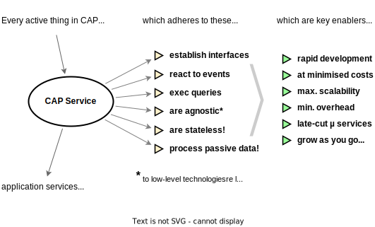

# Best Practices by CAP

Key Concepts & Benefits
{.subtitle}

<!-- @include: ../links.md -->

[[toc]]


## Introduction

The _Cloud Application Programming Model_ (CAP) is a framework of languages, libraries, and tools for building *enterprise-grade* cloud applications. It guides developers along a *golden path* of proven [best practices](#enterprise-best-practices), served [out-of-the-box](#served-out-of-the-box), and hence greatly reduces boilerplate code and tedious recurring tasks.

In effect, CAP-based projects benefit from a primary [focus on domain](#focus-on-domain) in close collaboration with domain experts, and from [accelerated development](#grow-as-you-go) at minimised costs. CAP's *agnostic design* shields developers from overly technical disciplines, and fosters [evolution w/o disruption]() in a world of rapidly changing technologies.

#### Primary Building Blocks

The CAP framework features a mix of proven and broadly adopted open-source and SAP technologies. The figure below depicts CAP's place and focus in a stack architecture.

{style="width:555px"}

The major building blocks are as follows:

- [**Core Data Services** (CDS)](/cds) — CAP's universal modeling language, and the very backbone of everything; used to capture domain knowledge, generating database schemas, translating to and from various API languages, and most important: fueling generic runtimes to automatically serve request out of the box.

- [**Service Runtimes**](/guides/providing-services.md) for [Node.js](/node.js/) and [Java](/java/) — providing the core frameworks for services, generic providers to serve requests automatically, database support for SAP HANA, SQLite, and PostgreSQL, and protocol adaptors for REST, OData, GraphQL, ...

- [**Platform Integrations**](/guides/) — providing CAP-level service interfaces (*'[Calesi]()'*) to cloud platform services in platform-agnostic ways, as much as possible. Some of these are provided out of the box, others as plugins.

- [**Command Line Interface** (CLI)](/tools/) — the swiss army knife on the tools and development kit front, complemented by integrations and support in [*SAP Build Code*](), *Visual Studio Code*, *IntelliJ*, and *Eclipse*.

In addition, there is a fast-growing number of [CAP plugins]() contributions by open-source and inner-source [communities]() that enhance CAP in various ways, and integrate with additional tools and environments; the [*Calesi* plugins]() are among them.

#### Models fuel Generic Runtimes

CDS models play a prevalent role in CAP applications. They are ultimately used to fuel generic runtimes to automatically serve requests, without any coding for custom implementations required.

{style="width:444px"}

CAP runtimes bootstrap *[Generic Service Providers]()* for services defined in service models. They use the information at runtime to translate incoming requests from a querying protocols, such as OData, into SQL queries sent to the database.

:::tip Models fuel Runtimes
CAP uses the captured declarative information about data and services to **automatically serve requests**, including complex deep queries, with expands, where clauses and order by, aggregations, and so forth...
:::


####


## Core Concepts

Following sections provide an overview of the core concepts and design principles of CAP. The illustration below is an attempt to show all concepts, how they relate to each other, and to introduce the terminology.

{style="padding-right:50px"}

Start reading the diagram from the _Service Models_ bubble in the middle, then follow the arrows to the other concepts.
We'll dive into each of these concepts in the following sections below, starting with _Domain Models_, the other grey bubble above...


### Domain Models

[CDS](/cds) is CAP's universal modeling language to declaratively capture knowledge about an application's domain. Data models capture the *static* aspects of a domain, using the widely used technique of [*entity-relationship modelling*](). For example, a simple domain model as illustrated in this ER diagram:


... would look like this in CDS in first iteration (with some fields added):

::: code-group

```cds [Domain Data Model]
using { Country, cuid, managed } from '@sap/cds/common';

entity Books : cuid, managed {
  title  : localized String;
  author : Association to Authors;
}

entity Authors : cuid, managed {
  name    : String;
  books   : Association to many Books on books.author = $self;
  country : Country;
}
```

:::

[Type `Country` is declared to be an association to `sap.common.Countries`.](/cdscommon#type-country) {.learn-more}


#### Conceptual Definition Language (CDL)

We use CDS's [*Conceptual Definition Language (CDL)*](/cdscdl) as a *human-readable* way to express CDS models. Think of it as a *concise*, and more *expressive* derivate of [SQL DDL](https://wikipedia.org/wiki/Data_definition_language).

For processing at runtime CDS models are compiled into a *machine-readable* plain object notation, called *CSN*, which stands for [*Core Schema Notation (CSN)*](/cds/csn). For deployment to databases, CSN models are translated into native SQL DDL. Supported databases are *[SQLite]* and *[H2]* for development, and *[SAP HANA]* and *[PostgreSQL]* for production.


See also *[On the Nature of Models](/cdsmodels)* in the CDS reference docs. {.learn-more}


#### (Managed) Associations

Approached from an SQL angle, CDS adds the concepts of (managed) *[Associations]()*, and [path expressions]() linked to that, which greatly increases expressiveness of domain data models. For example, we can write queries, and hence declare views like that:

```cds [Using Associations]
entity EnglishBooks as select from Books
where author.country.code = 'GB';
```

This is an even more compact version, using *[infix filters]()* and [*navigation*]():

```cds
entity EnglishBooks as select from Authors[country.code='GB']:books;
```

::: details See how that would look like in SQL...

From a plain SQL perspective, think of *Associations* as the like of 'forward-declared joins', as becomes apparent in the following SQL equivalents of the above view definitions.

Path expression in `where` clauses become *INNER JOINs*:

```sql
CREATE VIEW EnglishBooks AS SELECT * FROM Books
-- for Association Books:author:
INNER JOIN Authors as author ON author.ID = Books.author_ID
-- for Association Authors:country:
INNER JOIN Countries as country ON country.code = author.country_code
-- the actual filter condition:
WHERE country.code = 'GB';
```
Path expression in *infix filters*  become *SEMI JOINs*, e.g.using `IN`:
```sql
CREATE VIEW EnglishBooks AS SELECT * FROM Books
-- for Association Books:author:
WHERE Books.author_ID IN (SELECT ID from Authors as author
  -- for Association Authors:country:
  WHERE author.country_code IN (SELECT code from Countries as country
    -- the actual filter condition:
    WHERE country.code = 'GB';
  )
)
```

... same with `EXISTS`, which is faster with some databases:

```sql
CREATE VIEW EnglishBooks AS SELECT * FROM Books
-- for Association Books:author:
WHERE EXISTS (SELECT 1 from Authors as author WHERE author.ID = Books.author_ID
  -- for Association Authors:country:
  AND EXISTS (SELECT 1 from Countries as country WHERE country.code = author.country_code
    -- the actual filter condition:
    AND country.code = 'GB';
  )
)
```

:::


#### Aspect-oriented Modelling

A distinctive feature of CDS is its intrinsic support for [_Aspect-oriented Modelling_](), which allows to factor out separate concerns into separate files. It also allows everyone to adapt and extend everything anytime, including reuse definitions you don't own, but imported to your models.

::: code-group
```cds [Separation of Concerns]
// All authorization rules go in here, the domain models are kept clean
using { Books } from './my/clean/schema.cds';
annotate Books with @restrict: [{ grant:'WRITE', to:'admin' }];
```
```cds [Verticalization]
// Everyone can extend any definitions, also ones they don't own:
using { sap.common.Countries } from '@sap/cds/common';
extend Countries with { county: String } // for UK, ...
```
```cds [Customization]
// SaaS customers can do the same for their private usage:
using { Books } from '@capire/bookshop';
extend Books with { ISBN: String }
```
:::

<br/>

:::tip Key features & qualities
CDS greatly promotes [***Focus on Domain***]() by a *concise* and *comprehensible* language. Intrinsic support for *[aspect-oriented modeling]()* fosters *[**Separation of Concerns**]()*, as well as *[**Extensibility**]()* in [customization](), [verticalization](), and [composition]() scenarios.
:::


### Service-centric Paradigm

Services are the most central concept in CAP when it comes to an application's behavior. They are  declared in CDS, frequently as views on underlying data, and implemented by services providers in the CAP runtimes. These are the **key design principles**:

- **Every** active thing is a **service** → _yours, and framework-provided ones_{.grey}
- Services establish **interfaces** → *declared in service models*{.grey}
- Services react to **events** → *in sync and async ones*{.grey}
- Services run **queries** → *pushed down to database*{.grey}
- Services are **agnostic** → *platforms and protocols*{.grey}
- Services are **stateless** → *process passive data*{.grey}



:::tip Design principles and benefits
The design principles - and adherence to them - are crucial for the [key features & benefits]().
:::

#### Services as Interfaces

Service models capture the *behavioral* aspects of an application. In its simplest form a service definition focusing on the *interface* only could look like that:

::: code-group

```cds [Service Definition in CDS]
service BookshopService {
  entity Books : cuid { title: String; author: Association to Authors }
  entity Authors :cuid { name: String; }
  action submitOrder ( book: UUID, quantity: Integer );
}
```

:::

#### Services as Facades

Most frequently, services expose denormalized views of underlying domain models. They act as facades to an application's core domain data. The service interface results from the _inferred_ element structures of the given projections.

For example, if we take the [*bookshop* domain model](/get-started/in-a-nutshell#capture-domain-models) as a basis, we could define a service that exposes a flattened view on books with authors names as follows (note and click on the *⇒ Inferred Interface* tab):

::: code-group

```cds [Service as Facade]
using { sap.capire.bookshop as underlying } from '../db/schema';
service CatalogService {
  @readonly entity ListOfBooks as projection on underlying.Books {
    ID, title, author.name as author // flattened
  }
}
```

```cds [⇒ &nbsp; Inferred Interface]
service CatalogService {
  @readonly entity ListOfBooks {
    key ID : UUID;
    title  : String;
    author : String, // flattened authors.name
  }
}
```

[Learn more about `as projection on` in the **Querying** section below](#querying). {.learn-more}


:::

:::tip Example for single-purposed service
The previous example follows the recommended best practice of a *[single-purposed service]()* which is specialized on *one* specific use case and group of users. Learn more about that in the [Providing Services]() guide.
:::


### Ubiquitous Events

CAP has a *ubiquitous* notion of events: they show up everywhere and everything is an event, and everything happening at runtime is in response to events. This manifests in these additional **design principles**, complementing our [*Service-centric Paradigm*]():

- **Every** activity is triggered through **events** → _local or remote, sync or async_{.grey}
- Services *subscribe* to, and *handle* events → *which can be...*{.grey}
- *generic* or *custom*-defined
- *local* or *remote*
- *sync* or *async*

#### Event Handlers

Services react to events by registering *event handlers*, the sum of which constitutes a *service implementation*. This is an example of that in Node.js:

```js
class BookshopService extends cds.ApplicationService { init() {
  const { Books } = this.entities
  this.before ('UPDATE', Books, req => validate (req.data))
  this.after ('READ', Books, books => ... )
  this.on ('submitOrder', req => this.emit ('BookOrdered',req.data))
}}
```

You can also register generic handlers, acting on classes of similar events:

```js
this.before ('READ','*', ...)   // for READ requests to all entities
this.before ('*','Books', ...)  // for all requests to Books
this.before ('*', ...)          // for all requests served by this srv
```

#### Agnostic Events

All events of all kinds are handled in the same fundamental ways. Your code stays *agnostic* to whether events are from a *local* or *remote* origin. We also subscribe to and handle events from a message queue in the very same way as we register handlers for synchronous requests.

::: code-group

```js [Handling sync Requests, and emitting async ones]
class CatalogService extends cds.ApplicationService { init() {
  this.on ('submitOrder', req => {              // sync request
    await this.emit ('BookOrdered', req.data)  // inform others
    const { book, quantity } = req.data       // process it...
    return req.reply ({some:'thing'})        // reply to clients
  })
}}
```

:::

::: code-group

```js [Handling async Events]
class AnotherService extends cds.ApplicationService { async init() {
  const cats = await cds.connect.to ('CatalogService')
                                           // ^^^ local or remote
  cats.on ('BookOrdered', msg => {        // async event
    const { book, quantity } = msg.data  // process it...
  })
}}
```

:::

<br/>

> [!tip]
>
> CAP's *ubiquitous* notion of events, *intrinsically* used everywhere, combined with the protocol- and platform-*agnostic* way to emit and handle events fuels many key features and qualities, like [*Agnostic Core*](), *[Inner Loop Development]()*, and *[Late-cut µ Services]()*.


### Passive Data

All data processed and server by CAP services is *passive*, and representations are *plain simple* data structures as much as possible. In Node.js it's plain JavaScript record objects, in Java it's hash maps.  This is **of utter importance** due to the following reasons...

#### Extensible Data

Extensibility, in particular in a SaaS context, allows customers to tailor an SaaS application to their needs by adding extension fields. This fields are not known at design time but need to be served by your services, potentially through all interfaces. CAP's combination of dynamic querying and passive data this is intrinsically covered and extension fields look and feel no different than pre-defined fields.

For example, an extension like that can automatically be served by CAP:

```cds
extend Books with {
   some_extension_field : String;
}
```

> [!warning]
>
> In contrast to that, common *DAOs*, *DTOs*, *Repositories*, or *Active Records* approaches which use static classes can't transport such extension data, not known at the time these classes are defined. Additional means would be required, which is not the case for CAP.

#### Queried Data

As detailed out in the next chaper, querying allows service clients to exactly ask for the data they need, instead of always reading full data records, only to display a list of books titles. For example, querying allows that:

```js
let books = await GET `Books { ID, title, author.name as author }`
```

While a static DAO/DTO-based approach would look like that:

```js
let books = await GET `Books` // always read in a SELECT * fashion
```

In effect, with querying the shape of records in result sets vary very much, even in denormalized ways, which is hardly possible to achieve with static access or transfer objects.

#### Adhering to 'ReST'

One might argue that this is very much in line with REST, read verbally like that: (1) You always get different ***representations*** of data; there is nothing like one shape to fit all needs. (2) The data you get is always some ***state*** captured in time, and potentially outdated the moment you got it. (3) That data is always ***transfered*** to you, without any notion of references to some matching server-side state.


### Querying

As a matter of fact, business applications tend to be *data-centric*. That is, the majority of operations deal with the discipline of reading and writing data in various ways. Over the decades, querying, as known from SQL, as well as from web protocols like OData or GraphQL, became the prevalent and most successful way for this discipline.

#### Conceptual Query Language (CQL)

As already introduced in the [*Domain Models*]() section, CAP uses queries in CDS models, for example to declare service interfaces by projections on underlying entities, here's an excerpt of the above:

```cds
entity ListOfBooks as projection on underlying.Books {
  ID, title, author.name as author
}
```


We use [CDS's *Conceptual Query Language (CQL)*](/cdscql) to write queries in a human-readable way. For reasons of familarity, CQL is designed as a derivate of SQL, but used in CAP independent of SQL and databases. For example to derive new types as projections on others, or sending OData or GraphQL queries to remote services.

#### Core Query Notation (CQN)

CAP also uses queries at runtime: an OData or GraphQL request is essentially a query which arrives at a service interface. Respective protocol adapter translate these into *machine-readable* runtime representations of CAP queries (→ see [*Core Query Notation, CQN*](/cdscqn)), which are then forwarded to and processed by target services. Here's an example, including CQL over http:

::: code-group

```sql [CQL]
SELECT from Books { ID, title, author { name }}
```

```graphql [CQL /http]
GET Books { ID, title, author { name }}
```
```graphql [GraphQL]
POST query {
  Books {
    ID, title, author {
      name
    }
  }
}
```
```http [OData]
GET Books?$select=ID,title&$expand=author($select=name)
```
```js [⇒  CAP Query (in CQN)]
{ SELECT: { from: {ref:['Books']},
    columns: [ 'ID', 'title', {ref:['author']},
      expand:[ 'name' ]
    }]
}}
```

:::

Queries can also be created programmatically at runtime, for example to send queries to a database. For that we're using *human-readable* language bindings, which in turn create CQN objects behind the scenes. For example, like that in Node.js (both creating the same CQN object as above):

::: code-group

```js [Using TTL]
let books = await SELECT `from Books {
  ID, title, author { name }
}`
```

```js [Using Fluent API]
let books = await SELECT.from (Books, b => {
  b.ID, b.title, b.author (a => a.name)
})
```

:::

#### Push-down to Databases

The CAP runtimes automatically translate incomming queries from the protocol-specific query language to CQN and then to native SQL, which is finally sent to underlying databases. The idea is to push down queries to where the data is, and be executed there with best query optimization and late materialization.


CAP queries are **first-class** objects with **late materialization**: they captured in CQN, kept in standard program variables, passed along as method arguments, transformed and combined with other queries, translated to other target query languages, and finally send to their targets to finally get executed there. This is very much like the role of functions as first-class objects in functional programming languages.

#### Comparison with SQL, OData, GraphQL

Here's a brief comparison of CQL with GraphQL, OData, and SQL:

<span class="centered">

| Feature            | CQL  | GraphQL | OData | SQL  |
| ------------------ | :--: | :-----: | :---: | :--: |
| CRUD               |  ✔️   |    ✔️    |   ✔️   |  ✔️   |
| Flat Projections   |  ✔️   |    ✔️    |   ✔️   |  ✔️   |
| Nested Projections |  ✔️   |    ✔️    |   ✔️   |      |
| Navigation         |  ✔️   |   (✔️)   |   ✔️   |      |
| Filtering          |  ✔️   |         |   ✔️   |  ✔️   |
| Sorting            |  ✔️   |         |   ✔️   |  ✔️   |
| Pagination         |  ✔️   |         |   ✔️   |  ✔️   |
| Aggregation        |  ✔️   |         |   ✔️   |  ✔️   |
| Denormalization    |  ✔️   |         |       |  ✔️   |
| Native SQL         |  ✔️   |         |       |  ✔️   |

</span>

As apparent from this comparison, we can regard CQL as a superset of the other query languages, which enables us to translate from and to all of them.

### Protocols

## Key Benefits & Qualities

### Served Out Of The Box...

The CAP runtimes in Node.js and Java provide many generic implementations for recurring tasks and best practices, distilled from proven SAP applications.
Benefits are significantly **accelerated** development, **minimized boilerplate** code, as well as **increased quality** through single points to fix and optimize, hence **reduced technical debt**.


#### Automatically Serving Requests

- [Serving CRUD Requests](/guides/providing-services#generic-providers)
- [Serving Nested Documents](/guides/providing-services#deep-reads-writes)
- [Serving Media Data](/guides/providing-services#serving-media-data)
- [Serving Draft Choreography](/advanced/fiori#draft-support)

#### Handling Recurring Tasks

- [Implicit Pagination](/guides/providing-services#implicit-pagination)
- [Input Validation](/guides/providing-services#input-validation)
- [Authentication](/node.js/authentication)
- [Authorization](/guides/security/authorization)
- [Localization / i18n](/guides/i18n)
- [Concurrency Control](/guides/providing-services#concurrency-control)

#### Enterprise Best Practices

- [Common Reuse Types & Aspects](/cdscommon)
- [Managed Data](/guides/domain-modeling#managed-data)
- [Localized Data](/guides/localized-data)
- [Temporal Data](/guides/temporal-data)
- [Verticalization & Extensibility](/guides/extensibility/)

#### **CAP-level Service Integrations ('Calesi')**

- [Open Telementry → SAP Cloud Logging, Dynatrace, ...](/plugins/#telemetry)
- [Attachments → SAP Object Store](/plugins/#attachments)
- [Attachments → SAP Document Management Service](/plugins/#@cap-js/sdm)
- [Messaging → SAP Cloud Application Event Hub](/plugins/#event-broker-plugin)
- [Messaging → Kafka]()
- [Change Tracking](/plugins/#change-tracking)
- [Notifications](/plugins/#notifications)
- [Audit Logging](/plugins/#audit-logging)
- [Personal Data Management](/guides/data-privacy/)

[Find more in the **CAP Plugins** page](/plugins/){.learn-more}

[See also the **Features Overview**](./features){.learn-more}


### Intrinsic Cloud Qualities

#### Multitenancy

#### Extensibility

#### Security

#### Scalability

#### Resilience


### Intrinsic Extensibility

- in models
- in (service) implementations

#### Extensible Framework Services

As stated in the introduction: "*Every active thing is a Service*". This also applies to all framework features and services, like databases, messaging, remote proxies, MTX services, etc.

And as everybody can add event handlers to services, not only the service implementations, you can also add event handlers to framework services, and thereby extend the core framework.

For example, you could extend the database service like this:

```js
cds.db.before ('*', req => {
  console.log (req.event, req.target.name)
})
```


### Agnostic by Design

to _protocols_ and _platform_ {.subtitle}

Keeping pace with a rapidly changing world of cloud technologies and platforms is a major challenge when having to hardwire too many things to today's technologies, which might soon become obsolete. CAP avoids such lock-ins and shields application developers from things like SAML, OAuth, HTTP, OData, GraphQL, Kafka, or other message brokers, different databases, and so forth...

#### Protocol-agnostic Consumption

Services are always consumed in the same ways, regardless of whether you call a local service, or a remote one, and independent of the protocol:

```js
const srv = await cds.connect.to('SomeService')
```

```js
await srv.emit('SomeEvent', {...payload})
await srv.send('SomeRequest', {...data})
await srv.read('SomeEntity').where({ID:4711})
await srv.create('SomeEntity').entries({...data})
await srv.update('SomeEntity',4711).with({...data})
await srv.delete('SomeEntity',4711)
```

#### Protocol-agnostic Implementation

The same applies to the way we subscribe to and react to incoming events / requests / queries in event handlers:

```js
srv.on('SomeEvent', msg => {/* process msg.data */})
srv.on('SomeRequest', req => {/* process req.data */})
srv.on('READ','SomeEntity', req => {/* process req.query */})
srv.on('WRITE','SomeEntity', req => {/* process req.query */})
srv.on('DELETE','SomeEntity', req => {/* process req.query */})
```

:::tip Late-cut µ services
The agnostic design allows [mocking remote services](/guides/using-services#local-mocking), as well as doing late changes to service topologies, for example, co-locating services in a single process or deploying them to separate micro services later on.
:::


#### Agnostic to Framework Services

These usages even look the same for application services and framework-provided ones, like CAP's [*database services*]() or [*messaging services*](). That is, we send queries to database services in the very same way as we do with local CAP services that support [querying](), or with remote [*OData*]() or [*GraphQL*]() services.


### Focus On Domain

CAP places **primary focus on domain**, by capturing _domain knowledge_ and _intent_ instead of imperative coding — that means, _What, not How_ — which promotes the following:

- Close collaboration of _developers_ and _domain experts_ in domain modeling.
- _Out-of-the-box_ implementations for _best practices_ and recurring tasks.
- _Platform-agnostic_ approach to _avoid lock-ins_, hence _protecting investments_.


### Grow As You Go...

 <!-- label='Grow as You Go' -->

Following the principle of **convention over configuration**, there's no need to set up things upfront. CAP allows you to **jumpstart** projects within seconds and have a team starting development right away, using generic providers, on top of a lightweight in-memory database → see [*Getting Started in a Nutshell*](/get-started/in-a-nutshell).

CAP also offers **mocks for many platform features**, which allow **fast dev-test-run cycles** with minimal development environment complexity — aka *Airplane Mode*. Similarly, CAP facilitates **integration scenarios** by importing an API from, for example, an SAP S/4HANA backend or from SAP Business Accelerator Hub and running mocks for this locally.

Over time, you **add things gradually**, only when they're needed. For example, you can move ahead to running your apps in close-to-productive setups for integration tests and delivery, without any change in models or code.

Finally, projects are encouraged to **parallelize workloads**. For example, following a **contracts-first** approach, a service definition is all that is required to automatically run a full-fledged REST or OData service. So, projects could spawn two teams in parallel: one working on the frontend, while the other one works on the backend part. A third one could start setting up CI/CD and delivery in parallel.


### Inner Loop Development

### Safeguarding Investments

### Minimising Technical Debt

### Hexagonal Architecture & DDD

CAP's agnostic services design is very much in line with the goals of [hexagonal architecture](https://en.wikipedia.org/wiki/Hexagonal_architecture_(software)) or [clean architecture](https://blog.cleancoder.com/uncle-bob/2012/08/13/the-clean-architecture.html), and actually give you exactly what these are aiming for: your core domain logic stays agnostic to protocols and changing low-level technologies, hence becomes resilient to disrupting changes in those spaces.

### Open _and_ Opinionated


That might sound like a contradiction, but isn't: While CAP certainly gives *opinionated* guidance, we do so without sacrificing openness and flexibility.  At the end of the day, you stay in control of which tools or technologies to choose, or which architecture patterns to follow as depicted in the table below.

| CAP is *Opinionated* in...                                                                                                                                                 | CAP is *Open* as...                                                                                                                                                                                                                             |
|----------------------------------------------------------------------------------------------------------------------------------------------------------------------------|-------------------------------------------------------------------------------------------------------------------------------------------------------------------------------------------------------------------------------------------------|
| **Higher-level concepts and APIs** abstracting from and avoiding lock-ins to low-level platform features and protocols                                                     | All abstractions follow a glass-box pattern that allows unrestricted access to lower-level things, if required                                                                                                                                  |
| **Best Practices served out of the box** with generic solutions for many recurring tasks                                                                                   | You can always handle things your way in [custom handlers](/guides/providing-services#custom-logic), decide whether to adopt [CQRS]() or [Event Sourcing](), for example ... while CAP simply tries to get the tedious tasks out of your way. |
| **Out-of-the-box support** for <br> **[SAP Fiori](https://developers.sap.com/topics/ui-development.html)** and **[SAP HANA](https://developers.sap.com/topics/hana.html)** | You can also choose other UI technologies, like [Vue.js](/get-started/in-a-nutshell#vue), or databases, by providing new database integrations.                                                                                               |
| **Dedicated tools support** provided in [SAP Business Application Studio](/tools/cds-editors#bas) or [Visual Studio Code](/tools/cds-editors#vscode).                  | CAP doesn't depend on those tools. Everything in CAP can be done using the [`@sap/cds-dk`](/tools/cds-cli) CLI and any editor or IDE of your choice.                                                                                          |


## Related Art

The sections below provide additional information about CAP in the context of, and in comparison to, related concepts.

----


#### CAP == _Hexagonal Architecture_

CAP's service architecture is designed with the same ideas in mind as the blueprints of _Hexagonal Architecture_ (or Onion Architecture, or Clean Architecture). With that, CAP facilitates projects that choose to apply the principles and designs of those architecture patterns. {.indent}


#### CAP promotes Domain-Driven Design

CAP supports domain-driven design (DDD) by placing the primary focus on the problem domain. It provides CDS as a powerful language to capture domain models and thereby facilitates close collaboration between domain experts and developers. CAP's core concepts fit well to the DDD counterparts of _Entities_, _Value Objects_, _Services_, and _Events_. {.indent}

In contrast to DDD however, CAP prefers a strong distinction of active services and passive data; for example, there's no such thing as instance methods of entities in CAP. CAP also stays at a more axiomatic level of key concepts: the DDD concepts of _Repositories_, _Aggregates_, and _Factories_ intentionally don't have first-class counterparts in CAP, but can be realized using CAP's core concepts. {.indent}


#### CAP promotes CQRS

Similar to CQRS, CAP strongly recommends separating write APIs from read APIs by [defining separate, single-purposed services](/guides/providing-services#single-purposed-services). CDS's reflexive view building eases the task of declaring derived APIs exposing use case-specific de-normalized views on underlying domain models. Service actions in CAP can be used to represent pure commands. There's no restriction to 'verb-only' dogmas in CAP though, as CAP focuses on business applications, which are mostly data-oriented by nature, hence frequently 'entity/noun-centric'. {.indent}


#### CAP and Event Sourcing

CAP can be combined with event sourcing patterns, that is, by tracking events in an event store, like Apache Kafka, instead of maintaining a snapshot of data in a relational or NoSQL database. Currently we don't provide out-of-the-box integration to such event sources (we may do so in near future), however this can be easily done in projects by respective service implementations using CAP's built-in capabilities to send and receive messages. {.indent}

#### CAP supports SQL

CDS borrows reflexive view building from SQL to declare derived models and APIs as projections/transformation of underlying models, such as domain models. [CQL](/cdscql) is based on SQL DML to allow direct mapping to SQL databases. However, it extends SQL with [Associations](/cdscdl#associations), [Path Expressions](/cdscql#path-expressions), and [Nested Projections](/cdscql#nested-expands) to overcome the need to deal with JOINs. Instead, these extensions allow working with data in a structured document-oriented way. {.indent}


#### CAP supports NoSQL

The previously mentioned extensions in [CQL](/cdscql) feature the modeling of nested document structures as well as view building and querying using navigation instead of cross products, joins, and unions. This actually brings CDS close to the concepts of NoSQL databases, with the data models playing the role of schemas for validation. Although CAP currently doesn't provide out-of-the-box support for concrete NoSQL databases, it's easy to do so in project-specific solutions. {.indent}


#### CAP and the Relational Model

While CDS extends SQL and the relational model by means to [describe, read, and write deeply nested document structures](#cap-supports-sql), it stays compatible to the principles of relational models with a specified mapping to relational databases. {.indent}


#### CAP == Entity-Relationship Modeling

CAP employs proven basics of Entity-Relationship Modeling for capturing the conceptual data structures of a given domain. Relationships are modeled as [Associations](/cdscdl#associations) and [Compositions](/cdscdl#compositions). {.indent}


#### CAP == Aspect-Oriented Programming

[Aspects](/cdscdl#aspects) in [CDS](/cds) are borrowed from AOP, especially _Mixins_. With that, CAP greatly facilitates separation of concerns by "...factoring out technical concerns (such as security, transaction management, logging) from a domain model, and as such makes it easier to design and implement domain models that focus purely on the business logic." (source: [Wikipedia](https://en.wikipedia.org/wiki/Domain-driven_design#Relationship_to_other_ideas)) {.indent}


#### CAP == Functional Programming

Similar to Functional Programming, CAP promotes a declarative programming paradigm, which declaratively captures domain knowledge and intent (what), instead of writing imperative boilerplate code (how), as much as possible. This helps to automate many recurring tasks using best practices. Also similar to functional programming, and in contrast to object-oriented and object-relational approaches, CAP promotes the distinction of passive data (~immutable data) and active, stateless services (~pure functions). {.indent}

In addition, CAP features _queries as first-class and higher-order objects_, allowing us to apply late evaluation and materialization, similar to first-class and higher-order functions in Functional Programming. {.indent}


#### CAP != Object-Relational Mapping

CAP and CDS aren't _Object-Relational Mapping_ (ORM). Instead, **we prefer querying** using [CQL](/cdscql) to read and write data, which allows declaratively expressing which data you're interested in by means of projection and selection instead of loading object graphs automatically. Result sets are pure REST data, that are snapshot data representations. One reason for this is the assumption that the lifetime of object cache entries (which are essential for ORMs to perform) is frequently in the range of milliseconds for _REST_ services. {.indent}

#### CAP != Business Objects

Business Object Patterns promote the notion of active objects, which provide instance methods to modify their internal state. In contrast to that, CAP promotes a strict separation of passive data, read and exchanged in RESTful ways, and pure, stateless services, see also the [relationship to Functional Programming](#cap-functional-programming). {.indent}


## Bad Practices

### Determinations & Validations

### Business Objects Frameworks

... which bypass or are in conflict with CAP's [key design principles](), for example:

- ORM techniques like Spring repositories
- Active Records, DAOs

These would be in conflict with CAP's focus on stateless services processing passive data, as well as with the querying-based approach to read and write data.

### Object-Relational Mapping


### Conflicting Architectures

CAP's design principles are very much in line with the approaches of [hexagonal architecture](https://en.wikipedia.org/wiki/Hexagonal_architecture) or [clean architecture](https://blog.cleancoder.com/uncle-bob/2012/08/13/the-clean-architecture.html), and actually give you exactly what hexagonal architecture is aiming for:

- domain logic stays agnostic to protocols and changing low-level technologies
- resilience to disrupting changes in those spaces

So, there's little need to homebrew your own hexagonal architecture on top of CAP, and high risks you miss CAP's advantages in this regard.


### Abstracting from CAP

### Using Low-level Stuff

Such as...

- Low-level http or OData requests
- Low-level integration with message brokers
- Database-specific things without need
- Non-CAP client libraries for BTP services

Doing so would spoil the party, for example regarding rapid local development at minimized costs, fast test pipelines, late-cut µ services.
It would also expose your projects to risks of disruptions by changes in those rather volatile technologies.


### Code Generator Tooling

Alternative frameworks or toolsets follow code generation approaches. Swagger does so for example: Given an OpenAPI document, such as the one we [generated above](#services-as-interfaces), we can throw that into [Swagger Editor](https://editor.swagger.io), and have a server package generated, for example for Node.js, which, as the included readme tells us *"... leverages the mega-awesome [swagger-tools](https://github.com/apigee-127/swagger-tools) middleware which does most all the work."* → it does so as follows:

| Feature                              |                       Swagger                        |                    CAP                    |
|--------------------------------------|:----------------------------------------------------:|:-----------------------------------------:|
| Lines of code for service definition |      **~555**{.h3} <br/>written in YAML {.red}       | **~11**{.h3} <br/>written in CDS {.green} |
| Lines of code for implementation     | **~500**{.h3} <br/>generated <br/>boilerplate {.red} |            **0**{.h3} {.green}            |
| Size of framework library            |                     16 MB {.red}                     |              10 MB {.green}               |
| CRUDQ served on DB, including...     |                          ❌                           |                     ✅                     |
| Deep Reads & Writes                  |                          ❌                           |                     ✅                     |
| Deep Hierarchies                     |                          ❌                           |                     ✅                     |
| Aggregations                         |                          ❌                           |                     ✅                     |
| Pagination                           |                          ❌                           |                     ✅                     |
| Sorting                              |                          ❌                           |                     ✅                     |
| Search                               |                          ❌                           |                     ✅                     |
| Filtering                            |                          ❌                           |                     ✅                     |
| Primary Keys                         |                          ❌                           |                     ✅                     |
| Access Control                       |                          ❌                           |                     ✅                     |
| Localized Data                       |                          ❌                           |                     ✅                     |
| Managed Data                         |                          ❌                           |                     ✅                     |
| Media Data                           |                          ❌                           |                     ✅                     |
| Temporal Data                        |                          ❌                           |                     ✅                     |
| Fiori Draft Handling                 |                          ❌                           |                     ✅                     |
| Exclusive Locking                    |                          ❌                           |                     ✅                     |
| Conflict Detection (via ETags)       |                          ❌                           |                     ✅                     |
| Data Replication (upcomming)         |                          ❌                           |                     ✅                     |
| Data Privacy                         |                          ❌                           |                     ✅                     |
| ...                                  |                          ❌                           |                     ✅                     |

While code generators also have you writing less code yourself, the code is still there (to cover all that CAP covers, we could extrapolate the 500 lines of code to end up in ~5,000, maybe 50,000 ...?). To mention only the most critical consequence out of this: **No single points to fix**, as you simply can't fix code generated in the past.

::: details CDS-based service definitions vs OpenAPI documents ...

Even if we'd ignore all the other things, there still remains the difference between writing ~11 lines of concise and comprehensible CDS declarations, or ~333 lines of YAML. While the former allows to involve and closely collaborate with domain experts, the latter certainly doesn't. (And technocratic approaches like Hexagonal Architecture or Domain-Driven Design the way it's frequently done by developers don't really help either.)

:::


### Fragmented Micro Services

### Overdesigned Implementations


## The 'Calesi' Effect
