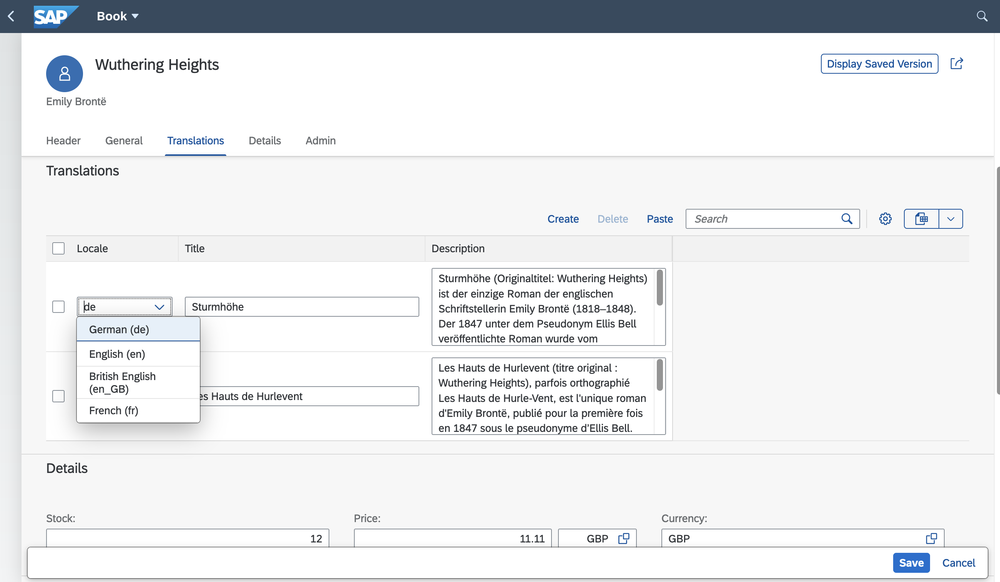

# Serving Fiori UIs

{{ $frontmatter.synopsis }}

This guide explains how to add one or more SAP Fiori elements apps to a CAP project, how to add SAP Fiori elements annotations to respective service definitions, and more. In the following sections, when mentioning Fiori, we always mean SAP Fiori elements.

[Learn more about developing SAP Fiori elements and OData V4 (since 1.84.)](https://sapui5.hana.ondemand.com/#/topic/62d3f7c2a9424864921184fd6c7002eb){.learn-more}


[[toc]]


## SAP Fiori Preview

For entities exposed via OData V4 there is a _Fiori preview_ link on the index page. It dynamically serves an SAP Fiori Elements list page that allows you to quickly see the effect of annotation changes without having to create a UI application first.

<div class="impl node">

::: details Be aware that this is **not meant for production**.

The preview not meant as a replacement for a proper SAP Fiori Elements (UI5) application.
It is only active locally where the [development profile](../node.js/cds-env#profiles) is enabled.

To also enable it in cloud deployments, for test or demo purposes maybe, add the following configuration:

::: code-group

```json [package.json]
{
  "cds": {
    "features": {
      "fiori_preview": true
    }
  }
}
```
```json [.cdsrc.json]
{
  "features": {
    "fiori_preview": true
  }
}
```

:::

</div>

<div class="impl java">

::: details Be aware that this is **not meant for production**.

The preview not meant as a replacement for a proper SAP Fiori Elements (UI5) application.
It is active by default, but disabled automatically in case the [production profile](../java/developing-applications/configuring#production-profile) is enabled.

To also enable it in cloud deployments, for test or demo purposes maybe, add the following configuration:

::: code-group

```yaml [application.yaml]
cds:
  index-page:
    enabled: true
```

:::

</div>

## Adding Fiori Apps

As showcased in [cap/samples](https://github.com/sap-samples/cloud-cap-samples/tree/main/fiori/app), SAP Fiori apps should be added as sub folders to the `app/` of a CAP project. Each sub folder constitutes an individual SAP Fiori application, with [local annotations](#fiori-annotations), _manifest.json_, etc. So, a typical folder layout would look like this:


| Folder/Sub Folder        | Description                          |
|----------------------------|--------------------------------------|
| `app/`                     | All SAP Fiori apps should go in here |
| &nbsp; &nbsp; `browse/`    | SAP Fiori app for end users          |
| &nbsp; &nbsp; `orders/`    | SAP Fiori app for order management   |
| &nbsp; &nbsp; `admin/`     | SAP Fiori app for admins             |
| &nbsp; &nbsp; `index.html` | For sandbox tests                    |
| `srv/`                     | All services                         |
| `db/`                      | Domain models, and db stuff          |

::: tip
Links to Fiori applications created in the `app/` folder are automatically added to the index page of your CAP application for local development.
:::

### Using SAP Fiori Tools

The SAP Fiori tools provide advanced support for adding SAP Fiori apps to existing CAP projects as well as a wealth of productivity tools, for example for adding SAP Fiori annotations, or graphical modeling and editing. They can be used locally in [Visual Studio Code (VS Code)](https://marketplace.visualstudio.com/items?itemName=SAPSE.sap-ux-fiori-tools-extension-pack) or in [SAP Business Application Studio](https://help.sap.com/docs/SAP_FIORI_tools/17d50220bcd848aa854c9c182d65b699/b0110400b44748d7b844bb5977a657fa.html).

[Learn more about **how to install SAP Fiori tools**.](https://help.sap.com/docs/SAP_FIORI_tools/17d50220bcd848aa854c9c182d65b699/2d8b1cb11f6541e5ab16f05461c64201.html){.learn-more}


### From [cap/samples](https://github.com/sap-samples/cloud-cap-samples)

For example, you can copy the [SAP Fiori apps from cap/samples](https://github.com/sap-samples/cloud-cap-samples/tree/main/fiori/app) as a template and modify the content as appropriate.


### From [Incidents Sample](https://github.com/SAP-samples/fiori-elements-incident-management/tree/sampleSolution)

This is a sample to create an incident management app with SAP Fiori elements for OData V4.


## Fiori Annotations

The main content to add is service definitions annotated with information about how to render respective data.


### What Are SAP Fiori Annotations?

SAP Fiori elements apps are generic front ends, which construct and render the pages and controls based on annotated metadata documents. The annotations provide semantic annotations used to render such content, for example:


```cds
annotate CatalogService.Books with @(
  UI: {
    SelectionFields: [ ID, price, currency_code ],
    LineItem: [
      {Value: title},
      {Value: author, Label:'{i18n>Author}'},
      {Value: genre.name},
      {Value: price},
      {Value: currency.symbol, Label:' '},
    ]
  }
);
```


[Find this source and many more in **cap/samples**.](https://github.com/sap-samples/cloud-cap-samples/tree/main/fiori/app){.learn-more target="_blank"}
[Learn more about **OData Annotations in CDS**.](./odata#annotations){.learn-more}


### Where to Put Them?

While CDS in principle allows you to add such annotations everywhere in your models, we recommend putting them in separate _.cds_ files placed in your _./app/*_ folders, for example, as follows.

```sh
./app  #> all your Fiori annotations should go here, for example:
   ./admin
      fiori-service.cds #> annotating ../srv/admin-service.cds
   ./browse
      fiori-service.cds #> annotating ../srv/cat-service.cds
   index.cds
./srv  #> all service definitions should stay clean in here:
   admin-service.cds
   cat-service.cds
...
```

[See this also in **cap/samples/fiori**.](https://github.com/sap-samples/cloud-cap-samples/tree/main/fiori/app){.learn-more}

**Reasoning:** This recommendation essentially follows the best practices and guiding principles of [Conceptual Modeling](../guides/domain-modeling#domain-driven-design) and [Separation of Concerns](../guides/domain-modeling#separation-of-concerns).


### Maintaining Annotations

Maintaining OData annotations in _.cds_ files is accelerated by the SAP Fiori tools - CDS OData Language Server [@sap/ux-cds-odata-language-server-extension](https://www.npmjs.com/package/@sap/ux-cds-odata-language-server-extension) in the [SAP CDS language support plugin](https://marketplace.visualstudio.com/items?itemName=SAPSE.vscode-cds). It helps you add and edit OData annotations in CDS syntax with:

-   Code completion
-   Validation against the OData vocabularies and project metadata
-   Navigation to the referenced annotations
-   Quick view of vocabulary information
-   Internationalization support

These assisting features are provided for [OData annotations in CDS syntax](../advanced/odata#annotations) and can't be used yet for the [core data services common annotations](../cds/annotations).

The [@sap/ux-cds-odata-language-server-extension](https://www.npmjs.com/package/@sap/ux-cds-odata-language-server-extension) module doesn't require any manual installation. The latest version is fetched by default from [npmjs.com](https://npmjs.com) as indicated in the user preference setting **CDS > Contributions: Registry**.

[Learn more about the **CDS extension for VS Code**.](https://www.youtube.com/watch?v=eY7BTzch8w0){.learn-more}

### Code Completion

The CDS OData Language Server provides a list of context-sensitive suggestions based on the service metadata and OData vocabularies. You can use it to choose OData annotation terms, their properties, and values from the list of suggestions in annotate directives applied to service entities and entity elements. See [annotate directives](../cds/cdl#annotate) for more details.


#### Using Code Completion

To trigger code completion, choose <kbd>⌘</kbd> + <kbd class="space">⎵</kbd> (macOS) or <kbd>Ctrl</kbd> + <kbd class="space">⎵</kbd> (other platforms). The list of suggested values is displayed.

> Note: You can filter the list of suggested values by typing more characters.

Navigate to the desired value using the up or down arrows or your mouse. Accept the highlighted value by pressing <kbd>Enter</kbd> or by clicking the mouse.
Use code completion to add and change individual values (word-based completion) and to add small code blocks containing annotation structures along with mandatory properties (micro-snippets). In an active code snippet, you can use the <kbd>&#x21e5;</kbd> (tab) key to quickly move to the next tab stop.


##### Example: Annotating Service Entities

  \(cursor position indicated by `|`\)

1.  Place cursor in the `annotate` directive for a service entity, for example `annotate Foo.Bar with ;` and trigger code completion.

2.  Type `u` to filter the suggestions and choose `{} UI`. Micro-snippet `@UI : {|}` is inserted: `annotate Foo.Bar with @UI : {|};`

3.  Use code completion again to add an annotation term from the UI vocabulary, in this example `SelectionFields`. The micro snippet for this annotation is added and the cursor is placed directly after the term name letting you define a qualifier: `annotate Foo.Bar with @UI : {SelectionFields | : []};`

4.  Press the <kbd>&#x21e5;</kbd> (tab) key to move the cursor to the next tab stop and use code completion again to add values. Because the `UI.SelectionFields` annotation is a collection of entity elements \(entity properties\), all elements of the annotated entity are suggested.

    ::: tip
    To choose an element of an associated entity, first select the corresponding association from the list and type *. \(period\)*. Elements of associated entity are suggested.

    Note: You can add multiple values separated by comma.
    :::

   ```cds
   annotate Foo.Bar with @UI : { SelectionFields : [
       description, assignedIndividual.lastName|
     ],
   };
   ```

5. Add a new line after `,` (comma) and use code completion again to add another annotation from the UI vocabulary, such as `LineItem`. Line item is a collection of `DataField` records. To add a record, select the record type you need from the completion list.


   ```cds
   annotate Foo.Bar with @UI : {
      SelectionFields : [
        description, assignedIndividual.lastName
      ],
      LineItem : [{
        $Type:'UI.DataField',
        Value : |,
     },
   };
   ```

    > Note: For each record type, two kinds of micro-snippets are provided: one containing only mandatory properties and one containing all properties defined for this record \(full record\). Usually you need just a subset of properties. So, you either select a full record and then remove the properties you don't need, or add the record containing only required properties and then add the remaining properties.

6.  Use code completion to add values for the annotation properties.


    ```cds
    annotate Foo.Bar with @UI : {
      SelectionFields : [
        description, assignedIndividual.lastName
      ],
      LineItem : [
        {
            $Type:'UI.DataField',
            Value : description,
        },
        {
            $Type:'UI.DataFieldForAnnotation',
            Target :  'assignedIndividual/@Communication.Contact',
        },|
      ]
    };
    ```

    > Note: To add values pointing to annotations defined in another CDS source, you must reference this source with the `using` directive. See [The `using` Directive](../cds/cdl#using) for more details.


##### Example: Annotating Entity Elements

  \(cursor position indicated by `|`\)

1.  Place the cursor in the `annotate` directive, for example `annotate Foo.Bar with {|};`, add a new line and trigger code completion. You get the list of entity elements. Choose the one that you want to annotate.

  ```cds
  annotate Foo.Bar with {
      code|
  };
  ```

2.  Press the <kbd class="space">⎵</kbd> key, use code completion again, and choose `{} UI`. The `@UI : {|}` micro-snippet is inserted:

  ```cds
  annotate Foo.Bar with {
      code @UI : { | }
  };
  ```

3.  Trigger completion again and choose an annotation term from the UI vocabulary, in this example: **Hidden**.


  ```cds
  annotate Foo.Bar with {
      code @UI : {Hidden : |}
  };
  ```

4.  Press the <kbd>&#x21e5;</kbd> (tab) key to move the cursor to the next tab stop and use code completion again to add the value. Because the `UI.Hidden` annotation is of Boolean type, the values true and false are suggested:


  ```cds
  annotate Foo.Bar with {
      code @UI : {Hidden : false }
  };
  ```

### Diagnostics

The CDS OData Language Server validates OData annotations in _.cds_ files against the service metadata and OData vocabularies. It also checks provided string content for language-dependent annotation values and warns you if the format doesn't match the internationalization (i18n) key reference. It shows you that this string is hard coded and won't change based on the language setting in your application. See [Internationalization support](#internationalization-support) for more details.

Validation is performed when you open a _.cds_ file and then is retriggered with each change to the relevant files.

You can view the diagnostic messages by hovering over the highlighted part in the annotation file or by opening the problems panel. Click on the message in the problems panel to navigate to the related place in the annotation file.

> Note: If an annotation value points to the annotation defined in another CDS source, you must reference this source with a `using` directive to avoid warnings. See [The `using` Directive](../cds/cdl#using) for more details.


### Navigation to Referenced Annotations

CDS OData Language Server enables quick navigation to the definition of referenced annotations. For example, if your annotation file contains a `DataFieldForAnnotation` record referencing an `Identification` annotation defined in the service file, you can view which file it's defined in and what fields or labels this annotation contains. You can even update the `Identification` annotation or add comments.

You can navigate to the referenced annotation using the [Peek Definition](#peek-definition) and [Go To Definition](#go-to-definition) features.

> Note: If the referenced annotation is defined in another CDS source, you must reference this source with the `using` directive to enable the navigation. See [The `using` Directive](../cds/cdl#using) for more details.


#### Peek Definition { #peek-definition}

Peek Definition lets you preview and update the referenced annotation without switching away from the code that you're writing. It's triggered when your cursor is inside the referenced annotation value.
- Using a keyboard: choose <kbd class="space">⌥</kbd> + <kbd>F12</kbd> (macOS) or <kbd>Alt</kbd> + <kbd>F12</kbd> (other platforms)
- Using a mouse: right-click and select **Peek Definition**
If an annotation is defined in multiple sources, all these sources are listed. You can select which one you want to view or update. Annotation layering isn't considered.


#### Go to Definition { #go-to-definition}

Go To Definition lets you navigate to the source of the referenced annotation and opens the source file scrolled to the respective place in a new tab. It's triggered when your cursor is inside the referenced annotation value.

Place your cursor inside the path referencing the annotation term segment or translatable string value, and trigger Go to Definition:

-   Using a keyboard: choose <kbd>F12</kbd> in VS Code, or <kbd>Ctrl</kbd> + <kbd>F12</kbd> in SAP Business Application Studio
-   Using a mouse: right-click and select **Go To Definition**
-   Using a keyboard and mouse: <kbd>⌘</kbd> + mouse click (macOS) or <kbd>Ctrl</kbd> + mouse click (other platforms)

If an annotation is defined in multiple sources, a Peek definition listing these sources will be shown instead. Annotation layering isn't considered.


### Documentation \(Quick Info\)

The annotation language server provides quick information for annotation terms, record types, and properties used in the annotation file, or provided as suggestions in code completion lists. This information is retrieved from the respective OData vocabularies and can provide answers to the following questions:

-   What is the type and purpose of the annotation term/record type/property?
-   What targets can the annotation term apply to?
-   Is the annotation term/record type/property experimental? Is it deprecated?
-   Is this annotation property mandatory or optional?

> Note: The exact content depends on the availability in OData vocabularies.

To view the quick info for an annotation term, record type, or property used in the annotation file, hover your mouse over it. The accompanying documentation is displayed in a hover window, if provided in the respective OData vocabularies.

To view the quick info for each suggestion in the code completion list, either pressing <kbd>⌘</kbd> + <kbd class="space">⎵</kbd> (macOS) or <kbd>Ctrl</kbd> + <kbd class="space">⎵</kbd> (other platforms), or click the *info* icon. The accompanying documentation for the suggestion expands to the side. The expanded documentation stays open and updates as you navigate the list. You can close this by pressing <kbd>⌘</kbd> + <kbd class="space">⎵</kbd> / <kbd>Ctrl</kbd> + <kbd class="space">⎵</kbd> again or by clicking on the close icon.


#### Internationalization Support

When you open an annotation file, all language-dependent string values are checked against the _i18n.properties_ file. Each value that doesn't represent a valid reference to the existing text key in the _i18n.properties_ file, is indicated with a warning. A Quick Fix action is suggested to generate a text key in i18n file and substitute your string value with the reference to that entry.


### Prefer `@title` and `@description`

Influenced by the [JSON Schema](https://json-schema.org), CDS supports the [common annotations](../cds/annotations#common-annotations) `@title` and `@description`, which are mapped to corresponding [OData annotations](./odata#annotations) as follows:

| CDS            | JSON Schema   | OData               |
|----------------|---------------|---------------------|
| `@title`       | `title`       | `@Common.Label`     |
| `@description` | `description` | `@Core.Description` |

We recommend preferring these annotations over the OData ones in protocol-agnostic data models and service models, for example:

```cds
annotate my.Books with { //...
   title @title: 'Book Title';
   author @title: 'Author ID';
}
```


### Prefer `@readonly`, `@mandatory`, ...

CDS supports `@readonly` as a common annotation, which translates to respective [OData annotations](./odata#annotations) from the `@Capabilities` vocabulary. We recommend using the former for reasons of conciseness and comprehensibility as shown in this example:

```cds
@readonly entity Foo {   // entity-level
  @readonly foo : String // element-level
}
```

is equivalent to:

```cds
entity Foo @(Capabilities:{
  // entity-level
  InsertRestrictions.Insertable: false,
  UpdateRestrictions.Updatable: false,
  DeleteRestrictions.Deletable: false
}) {
  // element-level
  @Core.Computed foo : String
}
```

Similar recommendations apply to `@mandatory` and others &rarr; see [Common Annotations](../cds/annotations#common-annotations).


## Draft Support

SAP Fiori supports edit sessions with draft states stored on the server, so users can interrupt and continue later on, possibly from different places and devices. CAP, as well as SAP Fiori elements, provide out-of-the-box support for drafts as outlined in the following sections. **We recommend to always use draft** when your application needs data input by end users.

[For details and guidelines, see **SAP Fiori Design Guidelines for Draft**.](https://experience.sap.com/fiori-design-web/draft-handling/){.learn-more}

[Find a working end-to-end version in **cap/samples/fiori**.](https://github.com/sap-samples/cloud-cap-samples/tree/main/fiori){.learn-more}

[For details about the draft flow in SAP Fiori elements, see **SAP Fiori elements > Draft Handling**](https://ui5.sap.com/#/topic/ed9aa41c563a44b18701529c8327db4d){.learn-more}


### Enabling Draft with `@odata.draft.enabled`

To enable draft for an entity exposed by a service, simply annotate it with `@odata.draft.enabled` as in this example:

```cds
annotate AdminService.Books with @odata.draft.enabled;
```

[See it live in **cap/samples**.](https://github.com/sap-samples/cloud-cap-samples/tree/main/fiori/app/admin-books/fiori-service.cds#L51){.learn-more}

::: warning
You can't project from draft-enabled entities, as annotations are propagated. Either _enable_ the draft for the projection and not the original entity or _disable_ the draft on the projection using `@odata.draft.enabled: null`.
:::

### Difference between Compositions and Associations
Be aware that you must not modify associated entities through drafts. Only compositions will get a "Create" button in SAP Fiori elements UIs because they are stored as part of the same draft entity.

### Enabling Draft for [Localized Data](../guides/localized-data) {#draft-for-localized-data}

Annotate the underlying base entity in the base model with `@fiori.draft.enabled` to also support drafts for [localized data](../guides/localized-data):

```cds
annotate sap.capire.bookshop.Books with @fiori.draft.enabled;
```

:::info Background
SAP Fiori drafts required single keys of type `UUID`, which isn't the case by default for the automatically generated `_texts` entities (&rarr; [see the _Localized Data_ guide for details](../guides/localized-data#behind-the-scenes)). The `@fiori.draft.enabled` annotation tells the compiler to add such a technical primary key element named `ID_texts`.
:::

::: warning
Adding the annotation `@fiori.draft.enabled` won't work if the corresponding `_texts` entities contain any entries, because existing entries don't have a value for the new key field `ID_texts`.
:::

{style="margin:0"}
[See it live in **cap/samples**.](https://github.com/sap-samples/cloud-cap-samples/tree/main/fiori/app/admin-books/fiori-service.cds#L50){.learn-more}

If you're editing data in multiple languages, the _General_ tab in the example above is reserved for the default language (often "en"). Any change to other languages has to be done in the _Translations_ tab, where a corresponding language can be chosen from a drop-down menu as illustrated above. This also applies if you use the URL parameter `sap-language` on the draft page.

### Validating Drafts

You can add [custom handlers](../guides/providing-services#custom-logic) to add specific validations, as usual. In addition, for a draft, you can register handlers to the `PATCH` events to validate input per field, during the edit session, as follows.


###### ... in Java

You can add your validation logic before operation event handlers. Specific events for draft operations exist. See [Java > Fiori Drafts > Editing Drafts](../java/fiori-drafts#draftevents) for more details.


###### ... in Node.js

You can add your validation logic before the operation handler for either CRUD or draft-specific events. See [Node.js > Fiori Support > Handlers Registration](../node.js/fiori#draft-support) for more details about handler registration.


<div id="query-data-draft-enabled" />

### Query Drafts Programmatically

To access drafts in code, you can use the [`.drafts` reflection](../node.js/cds-reflect#drafts).
```js
SELECT.from(Books.drafts) //returns all drafts of the Books entity
```

[Learn how to query drafts in Java.](../java/fiori-drafts#draftservices){.learn-more}


## Value Helps

In addition to supporting the standard `@Common.ValueList` annotations as defined in the [OData Vocabularies](odata#annotations), CAP provides advanced, convenient support for Value Help as understood and supported by SAP Fiori.


### Convenience Option `@cds.odata.valuelist`

Simply add the `@cds.odata.valuelist` annotation to an entity, and all managed associations targeting this entity will automatically receive Value Lists in SAP Fiori clients. For example:

```cds
@cds.odata.valuelist
entity Currencies {}
```
```cds
service BookshopService {
   entity Books { //...
      currency : Association to Currencies;
   }
}
```


### Pre-Defined Types in `@sap/cds/common`

[@sap/cds/common]: ../cds/common

The reuse types in [@sap/cds/common] already have this added to base types and entities, so all uses automatically benefit from this. This is an effective excerpt of respective definitions in `@sap/cds/common`:

```cds
type Currencies : Association to sap.common.Currencies;
```
```cds
context sap.common {
  entity Currencies : CodeList {...};
  entity CodeList { name : localized String; ... }
}
```
```cds
annotate sap.common.CodeList with @(
   UI.Identification: [name],
   cds.odata.valuelist,
);
```

### Usages of `@sap/cds/common`

In effect, usages of [@sap/cds/common] stay clean of any pollution, for example:

```cds
using { Currency } from '@sap/cds/common';
entity Books { //...
  currency : Currency;
}
```

[Find this also in our **cap/samples**.](https://github.com/sap-samples/cloud-cap-samples/tree/main/bookshop/db/schema.cds){.learn-more}

Still, all SAP Fiori UIs, on all services exposing `Books`, will automatically receive Value Help for currencies. You can also benefit from that when [deriving your project-specific code list entities from **sap.common.CodeList**](../cds/common#adding-own-code-lists).


### Resulting Annotations in EDMX

Here is an example showing how this ends up as OData `Common.ValueList` annotations:

```xml
<Annotations Target="AdminService.Books/currency_code">
  <Annotation Term="Common.ValueList">
    <Record Type="Common.ValueListType">
      <PropertyValue Property="CollectionPath" String="Currencies"/>
      <PropertyValue Property="Label" String="Currency"/>
      <PropertyValue Property="Parameters">
        <Collection>
          <Record Type="Common.ValueListParameterInOut">
            <PropertyValue Property="ValueListProperty" String="code"/>
            <PropertyValue Property="LocalDataProperty" PropertyPath="currency_code"/>
          </Record>
          <Record Type="Common.ValueListParameterDisplayOnly">
            <PropertyValue Property="ValueListProperty" String="name"/>
          </Record>
        </Collection>
      </PropertyValue>
    </Record>
  </Annotation>
</Annotation>
```

## Actions

In our SFLIGHT sample application, we showcase how to use actions covering the definition in your CDS model, the needed custom code and the UI implementation.

[Learn more about Custom Actions & Functions.](../guides/providing-services#actions-functions){.learn-more}


We're going to look at three things.
1. Define the action in CDS and custom code.
1. Create buttons to bring the action to the UI
1. Dynamically define the buttons status on the UI


First you need to define an action, like in the [_travel-service.cds_ file](https://github.com/SAP-samples/cap-sflight/blob/dfc7827da843ace0ea126f76fc78a6591b325c67/srv/travel-service.cds#L11).

```cds
entity Travel as projection on my.Travel actions {
    action createTravelByTemplate() returns Travel;
    action rejectTravel();
    action acceptTravel();
    action deductDiscount( percent: Percentage not null ) returns Travel;
  };
```

To define what the action actually is doing, you need to write some custom code. See the [_travel-service.js_](https://github.com/SAP-samples/cap-sflight/blob/dfc7827da843ace0ea126f76fc78a6591b325c67/srv/travel-service.js#L126) file for example:

```js
this.on('acceptTravel', req => UPDATE(req._target).with({TravelStatus_code:'A'}))
```
> Note: `req._target` is a workaround that has been [introduced in SFlight](https://github.com/SAP-samples/cap-sflight/blob/685867de9e6a91d61276671e4af7354029c70ac8/srv/workarounds.js#L52). In the future, there might be an official API for it.

Create the buttons, to bring this action onto the UI and make it actionable for the user. There are two buttons: On the overview and in the detail screen. Both are defined in the [_layouts.cds_](https://github.com/SAP-samples/cap-sflight/blob/dfc7827da843ace0ea126f76fc78a6591b325c67/app/travel_processor/layouts.cds) file.

For the overview of all travels, use the [`@UI.LineItem` annotation](https://github.com/SAP-samples/cap-sflight/blob/dfc7827da843ace0ea126f76fc78a6591b325c67/app/travel_processor/layouts.cds#L40-L41).

```cds
annotate TravelService.Travel with @UI : {
LineItem : [
    { $Type  : 'UI.DataFieldForAction',
      Action : 'TravelService.acceptTravel',
      Label  : '{i18n>AcceptTravel}'   }
  ]
};
```

For the detail screen of a travel, use the [`@UI.Identification` annotation](https://github.com/SAP-samples/cap-sflight/blob/dfc7827da843ace0ea126f76fc78a6591b325c67/app/travel_processor/layouts.cds#L9-L10).

```cds
annotate TravelService.Travel with @UI : {
  Identification : [
    { $Type  : 'UI.DataFieldForAction',
      Action : 'TravelService.acceptTravel',
      Label  : '{i18n>AcceptTravel}'   }
  ]
};
```

Now, the buttons are there and connected to the action. The missing piece is to define the availability of the buttons dynamically. Annotate the `Travel` entity in the `TravelService` service accordingly in the [_field-control.cds_](https://github.com/SAP-samples/cap-sflight/blob/8f65dc8b7985bc22584d2a9f94335f110c0450ea/app/travel_processor/field-control.cds#L20-L32) file.

```cds
annotate TravelService.Travel with actions {
 acceptTravel @(
   Core.OperationAvailable : {
     $edmJson: { $Ne: [{ $Path: 'in/TravelStatus_code'}, 'A']}
   },
   Common.SideEffects.TargetProperties : ['in/TravelStatus_code'], ) };
```
This annotation uses [dynamic expressions](../advanced/odata#dynamic-expressions) to control the buttons for each action. And the status of a travel on the UI is updated, triggered by the `@Common.SideEffects.TargetProperties` annotation.

:::info More complex calculation
If you have the need for a more complex calculation, then the interesting parts in SFLIGHT are [virtual fields in _field-control.cds_](https://github.com/SAP-samples/cap-sflight/blob/dfc7827da843ace0ea126f76fc78a6591b325c67/app/travel_processor/field-control.cds#L10-L16) (also lines 37-44) and [custom code in _travel-service.js_](https://github.com/SAP-samples/cap-sflight/blob/dfc7827da843ace0ea126f76fc78a6591b325c67/srv/travel-service.js#L13-L22).
:::


## Cache Control

CAP provides the option to set a [Cache-Control](https://developer.mozilla.org/en-US/docs/Web/HTTP/Headers/Cache-Control) header with a [max-age](https://developer.mozilla.org/en-US/docs/Web/HTTP/Headers/Cache-Control#max-age) directive to indicate that a response remains fresh until _n_ seconds after it was generated .
In the CDS model, this can be done via a `@http.CacheControl: {maxAge: <seconds>}` annotation on stream properties. The header indicates that caches can store the response and reuse it for subsequent requests while it's fresh.
The `max-age` (in seconds) specifies the maximum age of the content before it becomes stale.

:::info Note
The `max-age` is the elapsed time since the response was generated on the origin server (not the elapsed time since the response was received).
:::

::: warning Only Java
Cache Control feature is currently supported on the Java runtime only.
:::

<div id="client-side-validations" />

<div id="fiori-compat" />

<div id="reserved-words" />
