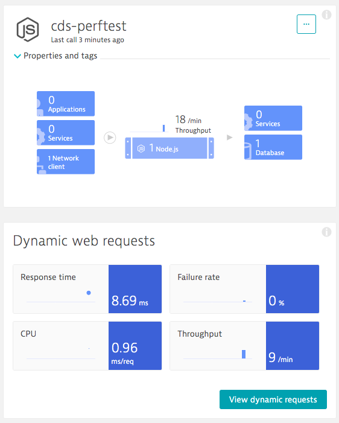
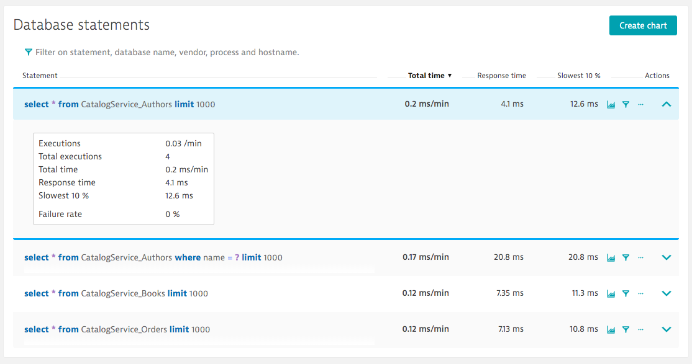

# Monitoring

{{ $frontmatter.synopsis }}

## Dynatrace

### Node.js and Java

To monitor performance-relevant metrics with Dynatrace, you need to create a user-provided service in Cloud Foundry and bind it to your service as described in the [Dynatrace documentation](https://www.dynatrace.com/support/help/setup-and-configuration/setup-on-container-platforms/cloud-foundry/deploy-oneagent-on-sap-cloud-platform-for-application-only-monitoring).

::: tip
To track database requests for the Node.js runtime, you need to add the `@dynatrace/oneagent-sdk` dependency to your project. The functionality was verified with version `1.2` of the SDK.
:::

#### Known Issues

If a Node.js application is started via `npm`, the _OneAgent_ isn't properly injected into the service.
In this case, you won't see your service in Dynatrace but the logs will show that it was installed and injected properly.

1. Add an environment variable to your service:

    `DT_INJECTION_RULES=::INCLUDE:ENDS,NODEJS_APP_BASE_DIR,/node_modules/npm`

1. Set the environment variable before the process startup.
