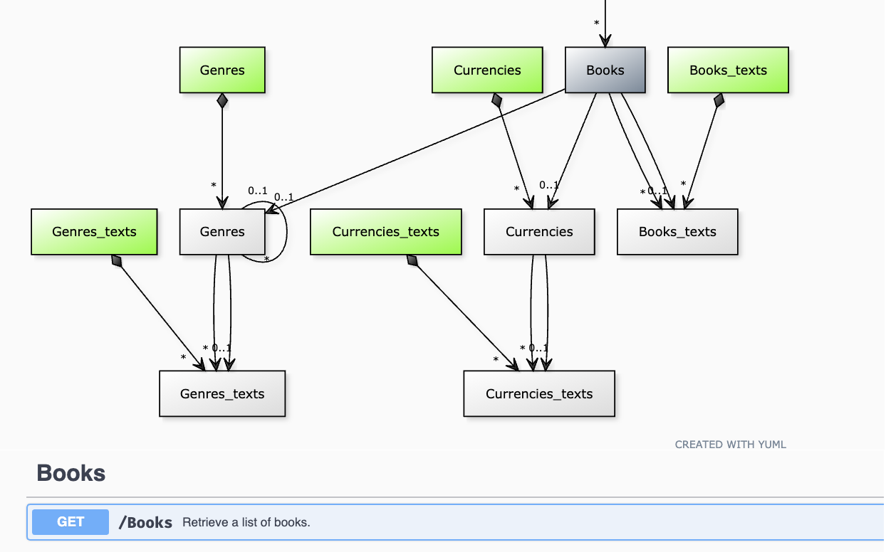

# Publishing to OpenAPI

You can convert CDS models to the [OpenAPI Specification](https://www.openapis.org), a widely adopted API description standard.

## Usage from CLI { #cli}

For example, this is how you convert all services in `srv/` and store the API files in the `docs/` folder:

```shell
cds compile srv --service all -o docs --to openapi
```

With the `--openapi:diagram` parameter, you can also include a [yuml](https://yuml.me/) ER diagram of the service entities in the Open API file.

{ .adapt }

The default value of the server URL is the service base path as declared in the CDS source.

If you have a **single server** and you want to set the server URL, use `--openapi:url <Server URL for Open API export>` option. Include the service path in the URL. For that, you can use the `${service-path}` variable.

If you want to configure **multiple servers**, you can use `--openapi:servers <JSON_Object_defining_servers>` which accepts stringified JSON of the server object.
Here, you can pass multiple server objects by passing the stringified JSON objects as an array.

```shell
cds compile srv service.cds --to openapi --openapi:servers "\"'[{\\\"url\\\":\\\"api.sandbox.com\\\",\\\"description\\\":\\\"Test URL\\\"},{\\\"url\\\":\\\"api.prod.com\\\",\\\"description\\\":\\\"Production URL\\\"}]'\""
```

_Note:_ `--openapi:url` is ignored when this option is specified.

## Swagger UI { #swagger-ui}

#### Embedded in Node.js

In Node.js apps, the standard Swagger UI can be served with the help of the [`cds-swagger-ui-express`](https://www.npmjs.com/package/cds-swagger-ui-express) package:

```shell
npm add --save-dev cds-swagger-ui-express
```

You need a [`server.js`](../node.js/cds-serve#custom-server-js) file to integrate it in the bootstrap process:

```js
const cds = require ('@sap/cds')
module.exports = cds.server

if (process.env.NODE_ENV !== 'production') {
  const cds_swagger = require ('cds-swagger-ui-express')
  cds.on ('bootstrap', app => app.use (cds_swagger()) )
}
```

Swagger UI is then served at `$api-docs/...`.  Just follow the _Open API preview_ links on the index page:
{style="margin:5px auto;width:50%" .adapt}

[Learn more about the `cds-swagger-ui-express`.](https://www.npmjs.com/package/cds-swagger-ui-express){.learn-more}

#### Embedded in Java

Swagger UI is not available out of the box for CAP Java. However, check out this [commit in our CAP Java sample application](https://github.com/SAP-samples/cloud-cap-samples-java/commit/67f0ba618fc7da131d1a104f7a23e8b836e14d93) that demonstrates how to integrate a Swagger UI into your Spring Boot application.

#### Online Swagger Editor

Alternatively, you can use the [online Swagger editor](https://editor.swagger.io/) with the OpenAPI files produced with the [CLI](#cli).
In this case, you likely need to enable [CORS](https://en.wikipedia.org/wiki/Cross-origin_resource_sharing) because the `swagger.io` site needs to call `localhost`. You can use the [`cors` middleware](https://www.npmjs.com/package/cors), for example.

## Annotations

The OData to OpenAPI Mapping can be fine-tuned via annotations in the CSDL (`$metadata`) documents.

See [Frequently Asked Questions](#faq) for examples on how to use these annotations.


## [Core Annotations](https://github.com/oasis-tcs/odata-vocabularies/blob/master/vocabularies/Org.OData.Core.V1.md)

Term | Annotation Target | OpenAPI field
-----|-------------------|--------------
`Computed` | Property | omit from Create and Update structures
`DefaultNamespace` | Schema | path templates for actions and functions without namespace prefix
`Description` | Action, ActionImport, Function, FunctionImport | `summary` of Operation Object
`Description` | EntitySet, Singleton | `description` of Tag Object
`Description` | EntityType | `description` of Request Body Object
`Description` | ComplexType, EntityType, EnumerationType, Parameter, Property, TypeDefinition | `description` of Schema Object
`Description` | Schema, EntityContainer | `info.title`
`Example`   | Property | `example` of Schema Object
`Immutable` | Property | omit from Update structure
`LongDescription` | Action, ActionImport, Function, FunctionImport | `description` of Operation Object
`LongDescription` | Schema, EntityContainer | `info.description`
`Permissions:Read`   | Property | omit read-only properties from Create and Update structures
`SchemaVersion` | Schema | `info.version`


## [Capabilities](https://github.com/oasis-tcs/odata-vocabularies/blob/master/vocabularies/Org.OData.Capabilities.V1.md)

Term | Annotation Target | OpenAPI field
-----|-------------------|--------------
`CountRestrictions`<br />&emsp;`/Countable` | EntitySet | `$count` system query option for `GET` operation
`DeleteRestrictions`<br />&emsp;`/Deletable` | EntitySet, Singleton | `DELETE` operation for deleting an existing entity
&emsp;`/Description` | EntitySet, Singleton | `summary` of Operation Object
&emsp;`/LongDescription` | EntitySet, Singleton | `description` of Operation Object
`ExpandRestrictions`<br />&emsp;`/Expandable` | EntitySet, Singleton | `$expand` system query option for `GET` operations
`FilterRestrictions`<br />&emsp;`/Filterable` | EntitySet | `$filter` system query option for `GET` operation
&emsp;`/RequiredProperties` | EntitySet | required properties in `$filter` system query option for `GET` operation (parameter description only)
&emsp;`/RequiresFilter` | EntitySet | `$filter` system query option for `GET` operation is `required`
`IndexableByKey` | EntitySet | `GET`, `PATCH`, and `DELETE` operations for a single entity within an entity set
`InsertRestrictions`<br />&emsp;`/Insertable` | EntitySet | `POST` operation for inserting a new entity
&emsp;`/Description` | EntitySet | `summary` of Operation Object
&emsp;`/LongDescription` | EntitySet | `description` of Operation Object
`KeyAsSegmentSupported` | EntityContainer | `paths` URL templates use key-as-segment style instead of parenthesis style
`NavigationRestrictions`<br />&emsp;`/RestrictedProperties` | EntitySet, Singleton | operations via a navigation path
&emsp;&emsp;`/DeleteRestrictions/...` | EntitySet, Singleton | `DELETE` operation for deleting a contained entity via a navigation path
&emsp;&emsp;`/FilterRestrictions/...` | EntitySet, Singleton | `$filter` system query option for reading related entities via a navigation path
&emsp;&emsp;`/InsertRestrictions/...` | EntitySet, Singleton | `POST` operation for inserting a new related entity via a navigation path
&emsp;&emsp;`/ReadByKeyRestrictions/...` | EntitySet, Singleton | `GET` operation for reading a contained entity by key via a navigation path
&emsp;&emsp;`/ReadRestrictions/...` | EntitySet, Singleton | `GET` operation for reading related entities via a navigation path
&emsp;&emsp;`/SearchRestrictions/...` | EntitySet, Singleton | `$search` system query option for reading related entities via a navigation path
&emsp;&emsp;`/SelectSupport/...` | EntitySet, Singleton | `$select` system query option for reading related entities via a navigation path
&emsp;&emsp;`/SkipSupported` | EntitySet, Singleton | `$skip` system query option for reading contained entities via a navigation path
&emsp;&emsp;`/SortRestrictions/...` | EntitySet, Singleton | `$orderby` system query option for reading related entities via a navigation path
&emsp;&emsp;`/TopSupported` | EntitySet, Singleton | `$top` system query option for reading contained entities via a navigation path
&emsp;&emsp;`/UpdateRestrictions/...` | EntitySet, Singleton | `PATCH` operation for modifying a contained entity via a navigation path
`ReadByKeyRestrictions`<br />&emsp;`/Readable` | EntitySet | `GET` operation for reading a single entity by key
&emsp;`/Description` | EntitySet | `summary` of Operation Object
&emsp;`/LongDescription` | EntitySet | `description` of Operation Object
`ReadRestrictions`<br />&emsp;`/Readable` | EntitySet, Singleton | `GET` operation for reading an entity set or singleton
&emsp;`/Description` | EntitySet, Singleton | `summary` of Operation Object
&emsp;`/LongDescription` | EntitySet, Singleton | `description` of Operation Object
`SearchRestrictions`<br />&emsp;`/Searchable` | EntitySet | `$search` system query option for `GET` operation
`SelectSupport`<br />&emsp;`/Supported` | EntitySet, Singleton | `$select` system query option for `GET` operation
`SkipSupported` | EntitySet | `$skip` system query option for `GET` operation
`SortRestrictions`<br />&emsp;`/NonSortableProperties` | EntitySet | properties not listed in `$orderby` system query option for `GET` operation
&emsp;`/Sortable` | EntitySet | `$orderby` system query option for `GET` operation
`TopSupported` | EntitySet | `$top` system query option for `GET` operation
`UpdateRestrictions`<br />&emsp;`/Updatable` | EntitySet, Singleton | `PATCH` operation for modifying an existing entity
&emsp;`/Description` | EntitySet, Singleton | `summary` of Operation Object
&emsp;`/LongDescription` | EntitySet, Singleton | `description` of Operation Object
`BatchSupport`<br />&emsp;`/Supported` |  EntityContainer |  `Batch` Support for the service


## [Validation](https://github.com/oasis-tcs/odata-vocabularies/blob/master/vocabularies/Org.OData.Validation.V1.md)

Term | Annotation Target | OpenAPI field
-----|-------------------|--------------
`AllowedValues` | Property | `enum` of Schema Object - list of allowed (string) values
`Exclusive` | Property | `exclusiveMinimum`/`exclusiveMaximum` of Schema Object
`Maximum` | Property | `maximum` of Schema Object
`Minimum` | Property | `minimum` of Schema Object
`Pattern` | Property | `pattern` of Schema Object


## [Authorization](https://github.com/oasis-tcs/odata-vocabularies/blob/master/vocabularies/Org.OData.Authorization.V1.md)

Term | Annotation Target | OpenAPI field
-----|-------------------|--------------
`Authorizations` | EntityContainer | `securitySchemes` of Components Object/`securityDefinitions` of Swagger Object
`SecuritySchemes` | EntityContainer | `security` of OpenAPI/Swagger Object


## Frequently Asked Questions { #faq label='FAQs'}

Examples for typical questions on how to fine-tune the generated OpenAPI descriptions.

### How do I suppress GET (list and by-key) on an entity set?

To suppress both types of GET requests to an entity set, annotate it with

```json
"@Capabilities.ReadRestrictions": {
    "Readable": false
}
```

### How do I suppress GET (list) on an entity set?

To suppress only GET list requests to an entity set and still allow GET by-key, annotate it with

```json
"@Capabilities.ReadRestrictions": {
    "Readable": false,
    "ReadByKeyRestrictions": {
        "Readable": true
    }
}
```


### How do I suppress GET (by-key) on an entity set?

To suppress only GET by-key requests to an entity set and still allow GET list, annotate it with

```json
"@Capabilities.ReadRestrictions": {
    "ReadByKeyRestrictions": {
        "Readable": false
    }
}
```
