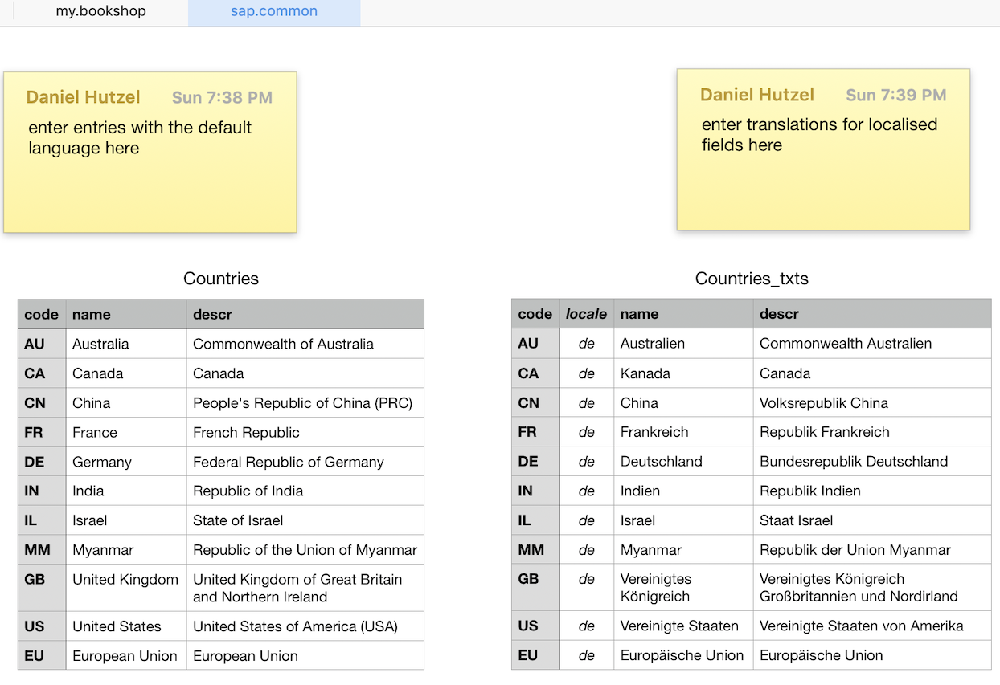

# Common Types and Aspects

_@sap/cds/common_ {.subtitle}

<br>

CDS ships with a prebuilt model *`@sap/cds/common`* that provides common types and aspects for reuse.

[[toc]]

[ISO 3166]: https://en.wikipedia.org/wiki/ISO_3166
[ISO 3166-1]: https://en.wikipedia.org/wiki/ISO_3166-1
[ISO 3166-2]: https://en.wikipedia.org/wiki/ISO_3166-2
[ISO 3166-3]: https://en.wikipedia.org/wiki/ISO_3166-3
[ISO 4217]: https://en.wikipedia.org/wiki/ISO_4217
[ISO/IEC 15897]: https://en.wikipedia.org/wiki/ISO/IEC_15897
[tzdata]: https://en.wikipedia.org/wiki/Tz_database
[localized data]: ../guides/localized-data
[temporal data]: ../guides/temporal-data

## Why Use _@sap/cds/common_?

It's recommended that all applications use the common types and aspects provided through _@sap/cds/common_ to benefit from these features:

* **Concise** and **comprehensible** models &rarr; see also [Conceptual Modeling](../guides/domain-modeling)
* **Foster interoperability** between all applications
* **Proven best practices** captured from real applications
* **Streamlined** data models with **minimal entry barriers**
* **Optimized** implementations and runtime performance
* **Automatic** support for [localized](../guides/localized-data) code lists and [value helps](../advanced/fiori#pre-defined-types-in-sap-cds-common)
* **Extensibility** using [Aspects](../guides/domain-modeling#aspect-oriented-modeling)
* **Verticalization** through third-party extension packages

For example, usage is as simple as indicated in the following sample:

```cds
using { Country } from '@sap/cds/common';
entity Addresses {
  street  : String;
  town    : String;
  country : Country; //> using reuse type
}
```

### Outcome = Optimized Best Practice

The final outcomes in terms of modeling patterns, persistence structures, and implementations is essentially the same as with native means, if you would have collected design experiences from prior solutions, such as we did.
::: tip
All the common reuse features of _@sap/cds/common_ are provided only through this ~100 line .cds model. Additional runtime support isn't required. _@sap/cds/common_ merely uses basic CDS modeling features as well as generic features like [localized data] and [temporal data] (which only need minimal runtime support with minimal overhead).
:::

In effect, the results are **straightforward**, capturing **best practices** we learned from real business applications, with **minimal footprint**, **optimized performance**, and **maximized adaptability** and **extensibility**.


## Common Reuse Aspects

_@sap/cds/common_ defines the following [aspects](cdl#aspects) for use in your entity definitions. They give you shortcuts, for concise and comprehensible models, interoperability and out-of-the-box runtime features connected to them.


### Aspect `cuid`

Use `cuid` as a convenient shortcut, to add canonical, universally unique primary keys to your entity definitions. These examples are equivalent:

```cds
entity Foo : cuid {...}
```


```cds
entity Foo {
  key ID : UUID;
  ...
}
```

> The service provider runtimes automatically fill in UUID-typed keys like these with auto-generated UUIDs.

[Learn more about **canonical keys** and **UUIDs**.](../guides/domain-modeling#prefer-canonic-keys){ .learn-more}


### Aspect `managed`

Use `managed`, to add four elements to capture _created by/at_ and latest _modified by/at_ management information for records. The following examples are equivalent-

```cds
entity Foo : managed {...}
```


```cds
entity Foo {
  createdAt  : Timestamp @cds.on.insert : $now;
  createdBy  : User      @cds.on.insert : $user;
  modifiedAt : Timestamp @cds.on.insert : $now  @cds.on.update : $now;
  modifiedBy : User      @cds.on.insert : $user @cds.on.update : $user;
  ...
}
```
::: tip
`modifiedAt` and `modifiedBy` are set whenever the respective row was modified, that means, also during `CREATE` operations.
:::

The annotations `@cds.on.insert/update` are handled in generic service providers so to fill in those fields automatically.

[Learn more about **generic service features**.](../guides/domain-modeling#managed-data){ .learn-more}


### Aspect `temporal`

This aspect basically adds two canonical elements, `validFrom` and `validTo` to an entity. It also adds a tag annotation that connects the CDS compiler's and runtime's built-in support for _[Temporal Data](../guides/temporal-data)_. This built-in support covers handling date-effective records and time slices, including time travel. All you've to do is, add the temporal aspect to respective entities as follows:

```cds
entity Contract : temporal {...}
```

[Learn more about **temporal data**.][temporal data]{ .learn-more}


## Common Reuse Types {#code-types}

_@sap/cds/common_ provides predefined easy-to-use types for _Countries_, _Currencies_, and _Languages_. Use these types in all applications to foster interoperability.

### Type `Country`
[`Country`]: #country

The reuse type `Country` is defined in _@sap/cds/common_ as a simple managed [Association](cdl#associations) to the [code list](#code-lists) for [countries](#entity-countries) as follows:

```cds
type Country : Association to sap.common.Countries;
```

Here's an example of how you would use that reuse type:

<!--- % include _code sample='using-country-type.cds' %} -->
```cds
using { Country } from '@sap/cds/common';
entity Addresses {
  street  : String;
  town    : String;
  country : Country; //> using reuse type
}
```

The [code lists](#code-lists) define a key element `code`, which results in a foreign key column `country_code` in your SQL table for Addresses. For example:

<!--- % include _code sample='using-country-type.sql' %} -->
```sql
CREATE TABLE Addresses (
  street NVARCHAR(5000),
  town NVARCHAR(5000),
  country_code NVARCHAR(3) -- foreign key
);
```

[Learn more about **managed associations**.](cdl#associations){ .learn-more}


### Type `Currency`

The type for an association to [Currencies](#entity-currencies).

```cds
type Currency : Association to sap.common.Currencies;
```

[It's the same as for `Country`.](#type-country){ .learn-more}

### Type `Language`

The type for an association to [Languages](#entity-languages).

```cds
type Language : Association to sap.common.Languages;
```

[It's the same as for `Country`.](#type-country){ .learn-more}

### Type `Timezone`

The type for an association to [Timezones](#entity-timezones).

```cds
type Timezone : Association to sap.common.Timezones;
```

[It's the same as for `Country`.](#type-country){ .learn-more}

## Common Code Lists { #code-lists}

As seen in the previous section, the reuse types `Country`, `Currency`, and `Language` are defined as associations to respective code list entities. They act as code list tables for respective elements in your domain model.

> Note: You rarely have to refer to the code lists in consuming models, but always only do so transitively by using the corresponding reuse types [as shown previously](#code-types).

#### Namespace: `sap.common`

The following definitions are within namespace `sap.common`...

### Aspect `CodeList`

This is the base definition for the three code list entities in _@sap/cds/common_. It can also be used for your own code lists.

```cds
aspect sap.common.CodeList {
  name  : localized String(111);
  descr : localized String(1111);
}
```
[Learn more about **localized** keyword.](../guides/localized-data){ .learn-more}


### Entity `Countries`

The code list entity for countries is meant to be used with **[ISO 3166-1] two-letter alpha codes** as primary keys. For example, `'GB'` for the United Kingdom. Nevertheless, it's defined as `String(3)` to allow you to fill in three-letter codes, if needed.

```cds
entity sap.common.Countries : CodeList {
  key code : String(3); //> ISO 3166-1 alpha-2 codes (or alpha-3)
}
```


### Entity `Currencies`

The code list entity for currencies is meant to be used with **[ISO 4217] three-letter alpha codes** as primary keys, for example, `'USD'` for US Dollar. In addition, it provides an element to hold the minor unit fractions and for common currency symbols.

```cds
entity sap.common.Currencies : CodeList {
  key code  : String(3); //> ISO 4217 alpha-3 codes
  symbol    : String(5); //> for example, $, €, £, ₪, ...
  minorUnit : Int16;     //> for example, 0 or 2
}
```


### Entity `Languages`

The code list entity for countries is meant to be used with POSIX locales as defined in **[ISO/IEC 15897]** as primary keys. For example, `'en_GB'` for British English.

```cds
entity sap.common.Languages : CodeList {
  key code : sap.common.Locale; //> for example, en_GB
}
```
[Learn more on **normalized locales**.](../guides/i18n#normalized-locales){ .learn-more}

### Entity `Timezones`

The code list entity for time zones is meant to be used with primary keys like _Area/Location_, as defined in the [IANA time zone database][tzdata].
Examples are `America/Argentina/Buenos_Aires`, `Europe/Berlin`, or `Etc/UTC`.

```cds
entity sap.common.Timezones : CodeList {
  key code : String(100); //> for example, Europe/Berlin
}
```

[Learn more about time zones in Javascript](https://developer.mozilla.org/en-US/docs/Web/JavaScript/Reference/Global_Objects/Date) {.learn-more}

[Learn more about time zones in Java](https://docs.oracle.com/en/java/javase/21/docs/api/java.base/java/time/ZoneId.html) {.learn-more}


### SQL Persistence

The following table definition represents the resulting SQL persistence of the `Countries` code list, with the ones for `Currencies` and `Languages` alike:

```sql
-- the basic code list table
CREATE TABLE sap_common_Countries (
  name NVARCHAR(255),
  descr NVARCHAR(1000),
  code NVARCHAR(3),
  PRIMARY KEY(code)
);
```


### Minimalistic Design

The models for code lists are intentionally minimalistic to keep the entry barriers as low as possible, focusing on the bare minimum of what all applications generally need: a unique code and localizable fields for name and full name or descriptions.

**ISO alpha codes** for languages, countries, and currencies were chosen because they:

1. Are most common (most projects would choose that)
2. Are most efficient (as these codes are also frequently displayed on UIs)
3. Guarantee minimal entry barriers (bringing about 1 above)
4. Guarantee best support (for example, by readable foreign keys)

Assumption is that ~80% of all apps don't need more than what is already covered in this minimalistic model. Yet, in case you need more, you can easily leverage CDS standard features to adapt and extend these base models to your needs as demonstrated in the section [Adapting to your needs](#adapting-to-your-needs).

## Aspects for Localized Data

Following are types and aspects mostly used behind the scenes for [localized data](../guides/localized-data). <br>
For example given this entity definition:

```cds
entity Foo {
  key ID : UUID;
  name   : localized String;
  descr  : localized String;
}
```

When unfolding the `localized` fields, we essentially add `.texts` entities in these steps:

1. Add a new entity `Foo.texts` which inherits from `TextsAspects`:
   ```cds
   entity Foo.texts : sap.common.TextsAspects { ... }
   ```
   Which in turn unfolds to:
   ```cds
   entity Foo.texts {
     key locale : sap.common.Locale;
   }
   ```

2. Add the primary key of the main entity `Foo`:
   ```cds
   entity Foo.texts {
     key locale : sap.common.Locale;
     key ID : UUID; // [!code focus]
   }
   ```

3. Add the localized fields:
   ```cds
   entity Foo.texts {
     key locale : sap.common.Locale;
     key ID : UUID;
     name   : String; // [!code focus]
     descr  : String; // [!code focus]
   }
   ```


#### Namespace: `sap.common`

The following definitions are with namespace `sap.common`...

### Aspect `TextsAspect` {#texts-aspects}

This aspect is used when generating `.texts` entities for the unfolding of localized elements. It can be extended, which effectively extends all generated `.texts` entities.

```cds
aspect sap.common.TextsAspect {
  key locale: sap.common.Locale;
}
```

[Learn more about **Extending .texts entities**.](../guides/localized-data#extending-texts-entities){ .learn-more}

### Type `Locale` {#locale-type}

```cds
type sap.common.Locale : String(14) @title: '{i18n>LanguageCode}';
```

The reuse type `sap.common.Locale` is used when generating `.texts` entities for the unfolding of *localized* elements.

[Learn more about **localized data**.](../guides/localized-data){ .learn-more}

### SQL Persistence

In addition, the base entity these additional tables and views are generated behind the scenes to efficiently deal with translations:

```sql
-- _texts table for translations
CREATE TABLE Foo_texts (
  ID NVARCHAR(36),
  locale NVARCHAR(14),
  name NVARCHAR(255),
  descr NVARCHAR(1000),
  PRIMARY KEY(ID, locale)
);
```

```sql
-- view to easily read localized texts with automatic fallback
CREATE VIEW localized_Foo AS SELECT
  code,
  COALESCE (localized.name, name) AS name,
  COALESCE (localized.descr, descr) AS descr
FROM Foo (
  LEFT JOIN Foo_texts AS localized
    ON localized.code= code
    AND localized.locale = SESSION_CONTEXT('locale')
)
```

[Learn more about **localized data**.](../guides/localized-data){ .learn-more}

## Providing Initial Data

You can provide initial data for the code lists by placing CSV files in a folder called `data` next to your data models.

The following is an example of a `csv` file to provide data for countries:

<!--- % include _code sample='db/data/sap.common-Countries.csv' %} -->
::: code-group
```csv [db/data/sap.common-Countries.csv]
code;name;descr
AU;Australia;Commonwealth of Australia
CA;Canada;Canada
CN;China;People's Republic of China (PRC)
FR;France;French Republic
DE;Germany;Federal Republic of Germany
IN;India;Republic of India
IL;Israel;State of Israel
MM;Myanmar;Republic of the Union of Myanmar
GB;United Kingdom;United Kingdom of Great Britain and Northern Ireland
US;United States;United States of America (USA)
EU;European Union;European Union
```
:::

[Learn more about the database aspects of **Providing Initial Data**.](../guides/databases#providing-initial-data){ .learn-more}


### Add Translated Texts

In addition, you can provide translations for the `sap.common.Countries_texts` table as follows:

<!--- % include _code sample='db/data/sap.common-Countries_texts.csv' %} -->
::: code-group
```csv [db/data/sap.common-Countries_texts.csv]
code;locale;name;descr
AU;de;Australien;Commonwealth Australien
CA;de;Kanada;Canada
CN;de;China;Volksrepublik China
FR;de;Frankreich;Republik Frankreich
DE;de;Deutschland;Bundesrepublik Deutschland
IN;de;Indien;Republik Indien
IL;de;Israel;Staat Israel
MM;de;Myanmar;Republik der Union Myanmar
GB;de;Vereinigtes Königreich;Vereinigtes Königreich Großbritannien und Nordirland
US;de;Vereinigte Staaten;Vereinigte Staaten von Amerika
EU;de;Europäische Union;Europäische Union
```
:::

[Learn more about **Localization/i18n**.](../guides/localized-data){ .learn-more}


### Using Tools like Excel

You can use Excel or similar tools to maintain these files. For example, the following screenshot shows how we maintained the above two files in Numbers on a Mac:



### Using Prebuilt Content Package {#prebuilt-data}

Package [@sap/cds-common-content](https://www.npmjs.com/package/@sap/cds-common-content) provides prebuilt data for the entities `Countries`, `Currencies`, `Languages`, and `Timezones`.

Add it your project:

```sh
npm add @sap/cds-common-content --save
```

Use it in your `cds` files:

```cds
using from '@sap/cds-common-content';
```

[Learn more about integrating reuse packages](../guides/extensibility/composition){.learn-more}


## Adapting to Your Needs

As stated, the predefined definitions are minimalistic by intent. Yet, as _@sap/cds/common_ is also just a CDS model, you can apply all the standard features provided by [CDS](./cdl), especially CDS' [Aspects](./cdl#aspects) to adapt, and extend these definitions to your needs.

Let's look at a few examples of what could be done. You can combine these extensions in an effective model.
::: tip
You can do such extensions in the models of your project. You can also collect your extensions into reuse packages and share them as common definitions with several consuming projects, similar to _@sap/cds/common_ itself.
:::

[Learn more about providing reuse packages.](../guides/extensibility/composition){ .learn-more}


### Adding Detailed Fields as of [ISO 3166-1]

<!--- % include _code sample='your-common.1.cds' %} -->
```cds
using { sap.common.Countries } from '@sap/cds/common';
extend Countries {
  numcode : Integer; //> ISO 3166-1 three-digit numeric codes
  alpha3 : String(3); //> ISO 3166-1 three-letter alpha codes
  alpha4 : String(4); //> ISO 3166-3 four-letter alpha codes
  independent : Boolean;
  status : String(111);
  statusRemark : String(1111);
  remarkPart3 : String(1111);
}
```

> Value lists in SAP Fiori automatically search in the new text fields as well.


### Protecting Certain Entries

Some application logic might have to be hard-coded against certain entries in code lists. Therefore, these entries have to be protected against changes and removal. For example, let's assume a code list for payment methods defined as follows:

```cds
entity PaymentMethods : sap.common.CodeList {
  code : String(11);
}
```

Let's further assume the entires with code `Main` and `Travel` are required by implementations and hence must not be changed or removed. Have a look at a couple of solutions.

<div id="beforeprogrammatic" />

#### Programmatic Solution

A fallback, and at the same time, the most open, and most flexible approach, is to use a custom handler to assert that. For example, in Node.js:

```js
srv.on ('DELETE', 'PaymentMethods', req=>{
  const entry = req.query.DELETE.where[2].val
  if (['Main','Travel'].includes(entry))
    return req.reject(403, 'these entries must not be deleted')
})
```


### Using Different Foreign Keys

Let's assume you prefer to have references to the latest code list entries without adjusting foreign keys. This can be achieved by adding and using numeric ISO codes for foreign keys instead of the alpha codes.

<!--- % include _code sample='your-common.2.cds' %} -->
::: code-group
```cds [your-common.2.cds]
namespace your.common;
using { sap.common.Countries } from '@sap/cds/common';

// Extend Countries code list with fields for numeric codes
extend Countries {
  numcode : Integer; //> ISO 3166-1 three-digit numeric codes
}

// Define an own Country type using numcodes for foreign keys
type Country : Association to Countries { numcode };
```
:::

You can use your own definition of `Country` instead of the one from _@sap/cds/common_ in your models as follows:

<!--- % include _code sample='using-numcodes.cds' %} -->
```cds
using { your.common.Country } from './your-common.2';

entity Addresses {
  //...
  country : Country;
}
```

### Mapping to SAP S/4HANA or ABAP Table Signatures

<!--- % include _code sample='your-common.3.cds' %} -->
```cds
using { sap.common.Countries } from '@sap/cds/common';
entity Countries4GFN as projection on Countries {
  code as CountryCodeAlpha2,
  name as CountryShortName,
  // ...
}
entity Countries4ABAP as projection on Countries {
  code as LAND,
  // ...
}
```

These views are updatable on SAP HANA and many other databases. You can also use CDS to expose them through corresponding OData services in order to ease integration with SAP S/4HANA or older ABAP backends.


## Adding Own Code Lists

As another example of adaptations, let's add support for subdivisions, that means regions, as of [ISO 3166-2] to countries.


### Defining a New Code List Entity

<!--- % include _code sample='your-common.4.1.cds' %} -->
::: code-group
```cds [your-common.4.1.cds]
using sap from '@sap/cds/common';

// new code list for regions
entity Regions : sap.common.CodeList {
  key code : String(5); // ISO 3166-2 alpha5 codes, e.g. DE-BW
  country  : Association to sap.common.Countries;
}

// bi-directionally associate Regions with Countries
extend sap.common.Countries {
  regions : Composition of many Regions on regions.country = $self;
}
```
:::

`Regions` is a new, custom-defined code list entity defined in the same way as the predefined ones in _@sap/cds/common_. In particular, it inherits all elements and annotations from the base definition [`sap.common.CodeList`](#code-lists). For example, the `@cds.autoexpose` annotation, which provides that `Regions` is auto-exposed in any OData service that has exposed entities with associations to it. The localization of the predefined elements `name` and `descr` is also inherited.

[Learn in our sample how an own code list can be used to localize `enum` values.](https://github.com/SAP-samples/cap-sflight/blob/236de55b58fd0620dcd1d4f043779a7c632391b1/db/schema.cds#L60){.learn-more}


### Defining a New Reuse Type

Following the pattern for codes in _@sap/cds/common_ a bit more, you can also define a reuse type for regions as a managed association:

<!--- % include _code sample='your-common.4.2.cds' %} -->
::: code-group
```cds [your-common.4.2.cds]
using { Regions } from './your-common.4.1'; /*>skip<*/
// Define an own reuse type referring to Regions
type Region : Association to Regions;
```
:::

### Using the New Reuse Type and Code List

This finally allows you to add respective elements, the same way you do it with predefined reuse types. These elements receive the same support from built-in generic features. For example:

<!--- % include _code sample='using-region-type.cds' %} -->
```cds
using { Country, Region } from './your-common.4.2';
entity Addresses {
  street  : String;
  town    : String;
  country : Country; //> pre-defined reuse type
  region  : Region; //> your custom reuse type
}
```

## Code Lists with Validity

Even ISO codes may change over time and you may have to react to that in your applications. For example, when Burma was renamed to Myanmar in 1989. Let's investigate strategies on how that can be updated in our code lists.


### Accommodating Changes

The renaming from Burma to Myanmar in 1989, was reflected in [ISO 3166] as follows (_the alpha-4 codes as specified in [ISO 3166-3] signify entries officially deleted from [ISO 3166-1] code lists_):

| Name    | Alpha-2 | Alpha-3 | Alpha-4 | Numeric |
|---------|---------|---------|---------|---------|
| Burma   | BU      | BUR     | BUMM    | 104     |
| Myanmar | MM      | MMR     |         | 104     |

By default, and with the given default definitions in _@sap/cds/common_, this would have been reflected as a new entry for Myanmar and you'd have the following choices on what to do with the existing records in your data:

* **(a)** Adjust foreign keys for records so that it always reflects the current state.
* **(b)** Keep foreign keys as is for cases where the old records reflect the state effective at the time they were created or valid.


### Exclude Outdated Entries from Pick Lists (Optional)

Although outdated entries like the one for Burma have to remain in the code lists as targets for references from historic records in other entities, you would certainly want to exclude it from all pick lists used in UIs when entering new data. This is how you could achieve that:


#### 1. Extend the Common Code List Entity

```cds
using { sap.common.Countries } from '@sap/cds/common';
extend Countries with { validTo: Date default '9999-12-31'; }
```


#### 2. Fill Validity Boundaries in Code Lists:

| code | name    | validTo    |
|------|---------|------------|
| BU   | Burma   | 1989-06-18 |
| MM   | Myanmar | 9999-12-31 |


#### 3. Model Pick List Entity

Add the following line to your service definition:

```cds
entity CountriesPickList as projection on sap.common.Countries where validTo >= $now;
```

Basically, the entity `Countries` serves all standard requests, and the new entity `CountriesPickList` is built for the value help only. This entity is a projection that gives you only those records that are valid right now.

#### 4. Include Pick List with Validity on the UI

This snippet equips UI fields for a `countries` association with a value help from the `CountriesPickList` entity.

```cds
annotate YourService.EntityName with {

  countries @(
    Common: {
      Text: country.name , // TextArrangement: #TextOnly,
      ValueList: {
        Label: 'Country Value Help',
        CollectionPath: 'CountriesPickList',
        Parameters: [
          { $Type: 'Common.ValueListParameterInOut',
            LocalDataProperty: country_code,
            ValueListProperty: 'code'
          },
          { $Type: 'Common.ValueListParameterDisplayOnly',
            ValueListProperty: 'name'
          }
      ]
      }
    },
  );
}
```
