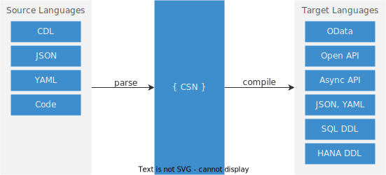

# Core Data Services (CDS)
Language Reference Documentation
{ .subtitle}

CDS is the backbone of the SAP Cloud Application Programming Model (CAP). It provides the means to declaratively capture service definitions and data models, queries, and expressions in plain (JavaScript) object notations. CDS features to parse from a variety of source languages and to compile them into various target languages.

CDS models are plain JavaScript objects complying to the _[Core Schema Notation (CSN)](./csn)_, an open specification derived from [JSON Schema](https://json-schema.org/). You can easily create or interpret these models, which foster extensions by 3rd-party contributions. Models are processed dynamically at runtime and can also be created dynamically.

[See the Nature of Models for more details](models){.learn-more}

 
<IndexList :pages='pages' />
