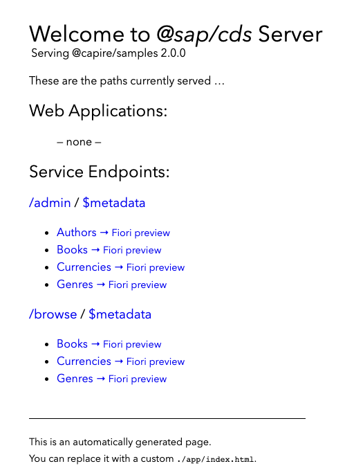
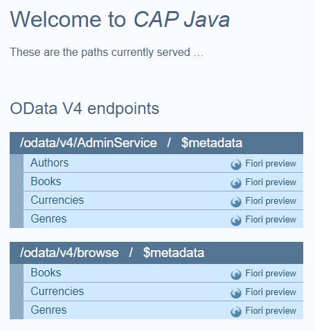
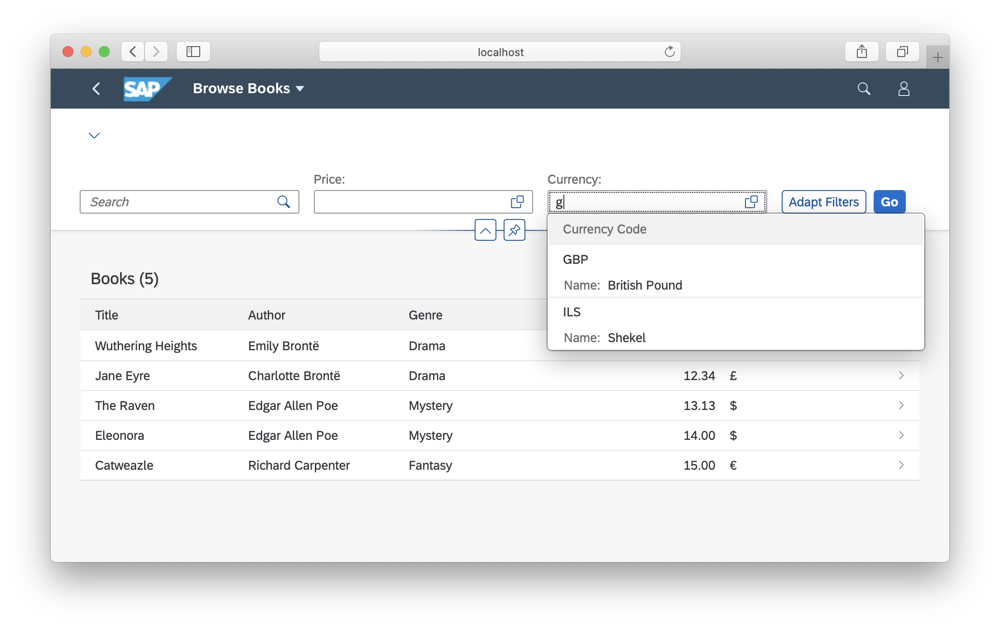
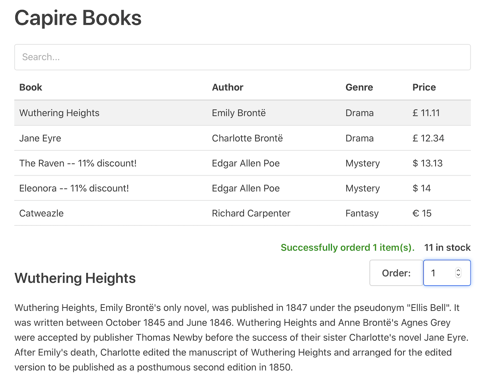

<style scoped lang="scss">
  ol {
    margin-left: 10px;
    counter-reset: my-counter;
    li {
      counter-increment: my-counter;
      list-style: none;
      margin-top: 30px;
      &::before {
        content: counter(my-counter);
        color: var(--vp-c-text-1);
        background-color: var(--vp-code-bg);
        width: 25px;
        height: 25px;
        background-size: 25px;
        line-height: 27px;
        border-radius: 50%;
        font-weight: 600;
        text-align: center;
        font-size: 15px;
        vertical-align: middle;
        display: inline-block;
        position: relative;
        top: -2px;
        left: -36px;
        margin-right: -25px;
      }
      p {
        display: inline;
      }
    }
  }
</style>

# Getting Started in a Nutshell

Using a minimal setup
{ .subtitle}


This guide is a step-by-step walkthrough to build a CAP application, using a minimal setup with Node.js and SQLite.

>This guide is available for Node.js and Java. Press <kbd>v</kbd> to switch, or use the toggle.

[[toc]]


## Preliminaries

The sections below describe a hands-on walkthrough, in which you'd create a new project and fill it with content step by step. Alternatively, you can get the final sample content from GitHub as follows:

::: code-group

```sh [Node.js]
git clone https://github.com/sap-samples/cloud-cap-samples samples
cd samples
npm install
```

```sh [Java]
git clone https://github.com/sap-samples/cloud-cap-samples-java bookshop
```

:::

> When comparing the code from the *cap/samples* on GitHub to the snippets given in the sections below you will recognise additions showcasing enhanced features. So, what you find in there is a superset of what we describe in this getting started guide.


## Jumpstart a Project {#jumpstart}
<!--Used as link target from Help Portal: https://help.sap.com/products/BTP/65de2977205c403bbc107264b8eccf4b/29c25e504fdb4752b0383d3c407f52a6.html -->

**Prerequisite:** Assumed you've installed Node.js, `@sap/cds-dk`, and Visual Studio Code as described in the [_Jumpstart_ guide](jumpstart)....

2. Create a new project using `cds init`

   ::: code-group
   ```sh [Node.js]
   cds init bookshop
   ```
   ```sh [Java]
   cds init bookshop --add java
   ```
   :::

3. Open the project in VS Code

   ```sh
   code bookshop
   ```

   ::: details **Note:** VS Code CLI on macOS needs extra setup
   In order to start VSCode via the `code` CLI, users on macOS must first run a command (*Shell Command: Install 'code' command in PATH*) to add the VS Code executable to the `PATH` environment variable. Read VS Code's [macOS setup guide](https://code.visualstudio.com/docs/setup/mac) for help.
   :::

4. Run `cds watch` in an [*Integrated Terminal*](https://code.visualstudio.com/docs/terminal/basics)

   ::: code-group

   ```sh [Node.js]
   cds watch
   ```

   ```sh [Java]
   cd srv && mvn cds:watch
   ```

   :::

   ::: details `cds watch` is waiting for things to come...

   ```log
   [dev] cds w

   cds serve all --with-mocks --in-memory?
   live reload enabled for browsers

         ___________________________

     No models found in db/,srv/,app/,schema,services. // [!code focus]
     Waiting for some to arrive... // [!code focus]

   ```

   So, let's go on adding some CDS model as follows...

   :::


## Capture Domain Models {#domain-models}
<!--Used as link target from Help Portal: https://help.sap.com/products/BTP/65de2977205c403bbc107264b8eccf4b/29c25e504fdb4752b0383d3c407f52a6.html -->

Let's feed our project by adding a simple domain model. Start by creating a file named _db/schema.cds_ (also indicated in the code box's label) and copy the following definitions into it:

::: code-group

```cds [db/schema.cds]
using { Currency, managed, sap } from '@sap/cds/common';
namespace sap.capire.bookshop; // [!code focus]

entity Books : managed { // [!code focus]
  key ID : Integer;
  title  : localized String(111);
  descr  : localized String(1111);
  author : Association to Authors;
  genre  : Association to Genres;
  stock  : Integer;
  price  : Decimal(9,2);
  currency : Currency;
}

entity Authors : managed { // [!code focus]
  key ID : Integer;
  name   : String(111);
  books  : Association to many Books on books.author = $self;
}

/** Hierarchically organized Code List for Genres */
entity Genres : sap.common.CodeList { // [!code focus]
  key ID   : Integer;
  parent   : Association to Genres;
  children : Composition of many Genres on children.parent = $self;
}

```
:::

<!--- % include _code from='bookshop:db/schema.cds' %} -->

_Find this source also in `cap/samples` [for Node.js](https://github.com/sap-samples/cloud-cap-samples/tree/main/bookshop/db/schema.cds), and [for Java](https://github.com/SAP-samples/cloud-cap-samples-java/blob/main/db/books.cds)_{ .learn-more}
[Learn more about **Domain Modeling**.](../guides/domain-modeling){ .learn-more}
[Learn more about **CDS Modeling Languages**.](../cds/){ .learn-more}


### Automatically Deployed to Databases {#deployed-in-memory}

<div class="impl node">

As soon as you save your file, the still running `cds watch` reacts immediately with new output like this:

```log
[cds] - connect to db { database: ':memory:' }
/> successfully deployed to in-memory database.
```

This means that `cds watch` detected the changes in _db/schema.cds_ and automatically bootstrapped an in-memory _SQLite_ database when restarting the server process.

</div>

<div class="impl java">

As soon as you save your CDS file, the still running `mvn cds:watch` command reacts immediately with a CDS
compilation and reload of the CAP Java application. The embedded database of the started application will reflect the schema defined in your CDS file.

</div>

### Compiling Models (Optional) {#cli}

We can optionally test-compile models individually to check for validity and produce a parsed output in [CSN format](../cds/csn). For example, run this command in a new terminal:

```sh
cds db/schema.cds
```

This dumps the compiled CSN model as a plain JavaScript object to stdout. <br>
Add `--to <target>` (shortcut `-2`) to produce other outputs, for example:

```sh
cds db/schema.cds -2 json
cds db/schema.cds -2 yml
cds db/schema.cds -2 sql
```

[Learn more about the command line interface by executing `cds help`.](#cli){.learn-more}


## Providing Services {#services}

<!--Used as link target from Help Portal: https://help.sap.com/products/BTP/65de2977205c403bbc107264b8eccf4b/29c25e504fdb4752b0383d3c407f52a6.html -->

<div class="impl node">

After the recent changes, `cds watch` also prints this message:

```log
No service definitions found in loaded models.
Waiting for some to arrive...
```

</div>

<div class="impl java">

After the recent changes, the running CAP Java application is still not exposing any service endpoints.

</div>

So, let's go on feeding it with two service definitions for different use cases:

- An `AdminService` for administrators to maintain `Books` and `Authors`
- A `CatalogService` for end users to browse and order `Books`

Create the following two files in folder _./srv_ and fill them wih this content:

::: code-group
```cds [srv/admin-service.cds]
using { sap.capire.bookshop as my } from '../db/schema';
service AdminService @(requires:'authenticated-user') { // [!code focus]
  entity Books as projection on my.Books;
  entity Authors as projection on my.Authors;
}
```
```cds [srv/cat-service.cds]
using { sap.capire.bookshop as my } from '../db/schema';
service CatalogService @(path:'/browse') { // [!code focus]

  @readonly entity Books as select from my.Books {*,
    author.name as author
  } excluding { createdBy, modifiedBy };

  @requires: 'authenticated-user'
  action submitOrder (book: Books:ID, quantity: Integer);
}
```
:::

*Find this source also on GitHub [for Node.js](https://github.com/sap-samples/cloud-cap-samples/tree/main/bookshop/srv), and [for Java](https://github.com/SAP-samples/cloud-cap-samples-java/blob/main/srv)*{.learn-more}
[Learn more about **Defining Services**.](../guides/providing-services){ .learn-more}


### Served to OData out of the box

<div class="impl node">

This time `cds watch` reacted with additional output like this:

```log
[cds] - serving AdminService { at: '/admin' }
[cds] - serving CatalogService { at: '/browse', impl: 'bookshop/srv/cat-service.js' }

[cds] - server listening on { url: 'http://localhost:4004' }
```

As you can see, the two service definitions have been compiled and generic service providers have been constructed to serve requests on the listed endpoints _/admin_ and _/browse_.

</div>

<div class="impl java">

In case the CDS service definitions were compiled correctly the Spring Boot runtime is reloaded automatically and should output a log line like this:

```log
c.s.c.services.impl.ServiceCatalogImpl : Registered service AdminService
c.s.c.services.impl.ServiceCatalogImpl : Registered service CatalogService
```

As you can see in the log output, the two service definitions have been compiled and generic service providers have been constructed to serve requests on the listed endpoints _/odata/v4/AdminService_ and _/odata/v4/browse_.

::: warning
Both services defined above contain security annotations that restrict access to certain endpoints. Please add the dependency to spring-boot-security-starter to the srv/pom.xml in order to activate mock user and authentication support:
:::

<!-- TODO Notebooks: can't be automated yet as it requires insert in pom.xml -->
```xml
<dependency>
  <groupId>org.springframework.boot</groupId>
  <artifactId>spring-boot-starter-security</artifactId>
</dependency>
```

</div>

::: tip

CAP-based services are full-fledged OData services out of the box. Without adding any provider implementation code, they translate OData request into corresponding database requests, and return the results as OData responses.

:::

You can even use advanced query options, such as `$select`, `$expand`, `$search`, and many more. For example, try out this link:

- http://localhost:4004/browse/Books?$search=Brontë&$select=title,author&$expand=currency($select=code,name,symbol)&$orderby=title

[Learn more about **Serving OData Protocol**.](../advanced/odata){.learn-more}


### Generic *index.html* Pages

<!-- TODO: explain "Why" is there a generic index.html and from where is it served? Link zu cds.server-->
Open _<http://localhost:4004>_ in your browser and see the generic _index.html_ page:

<div class="impl node">

{style="width:450px; box-shadow: 1px 1px 5px #888888"}

> User `alice` is a [default user with admin privileges](../node.js/authentication#mocked). Use it to access the _/admin_ service. You don't need to enter a password.

</div>

<div class="impl java">



> User `authenticated` is a [prepared mock user](../java/security#mock-users) which will be authenticated by default. Use it to access the _/admin_ service. You don't need to enter a password.

</div>


### Compiling APIs (Optional) { #repl}

You can also compile service definitions explicitly, for example to an [OData model](https://docs.oasis-open.org/odata/odata/v4.0/odata-v4.0-part3-csdl.html):

```sh
cds srv/cat-service.cds -2 edmx
```

Essentially, using a CLI, this invokes what happened automatically behind the scenes in the previous steps.
While we don't really need such explicit compile steps, you can do this to test correctness on the model level, for example.

## Using Databases {#databases}
<!--Used as link target from Help Portal: https://help.sap.com/products/BTP/65de2977205c403bbc107264b8eccf4b/29c25e504fdb4752b0383d3c407f52a6.html -->


### Using _sqlite_ In-Memory Database {.impl .node}

As [previously shown](#deployed-in-memory), `cds watch` automatically bootstraps an SQLite in-process and in-memory database by default — that is, unless told otherwise. While this **isn't meant for productive use**, it drastically speeds up development turn-around times, essentially by mocking your target database, for example, SAP HANA. {.impl .node}

[Learn more about mocking options in **Grow as you go**.](./grow-as-you-go){.learn-more .impl .node}

### Using _H2_ In-Memory Database {.impl .java}

As [previously shown](#deployed-in-memory), `mvn cds:watch` automatically bootstraps an H2 in-process and in-memory database by default — that is, unless told otherwise. While this **isn't meant for productive use**, it drastically speeds up turn-around times in local development and furthermore allows self-contained testing. {.impl .java}

### Adding Initial Data in `.csv` Files

Now, let's fill your database with initial data by adding a few plain CSV files under _db/data_ like this:

::: code-group

```csvc [db/data/sap.capire.bookshop-Books.csv]
ID,title,author_ID,stock
201,Wuthering Heights,101,12
207,Jane Eyre,107,11
251,The Raven,150,333
252,Eleonora,150,555
271,Catweazle,170,22
```
:::

::: code-group

```csvc [db/data/sap.capire.bookshop-Authors.csv]
ID,name
101,Emily Brontë
107,Charlotte Brontë
150,Edgar Allen Poe
170,Richard Carpenter
```
:::


[Find a full set of `.csv` files in **cap/samples**.](https://github.com/sap-samples/cloud-cap-samples/tree/main/bookshop/db/data){ .learn-more target="_blank"}

<div class="impl node">

<!-- Add a file named `init.js` in your `db` folder. The next time you run `cds deploy` it will automatically detect that file and run it after the schema has been deployed.

% include _code from='bookshop:db/init.js' %}
[learn more about using `cds.ql` for reading and writing data](../node.js/cds-ql){ .learn-more}  -->

After you've added these files, `cds watch` restarts the server with output, telling us that the files have been detected and their content has been loaded into the database automatically:

```log
[cds] - connect to db { database: ':memory:' }
 > filling sap.capire.bookshop.Authors from bookshop/db/data/sap.capire.bookshop-Authors.csv
 > filling sap.capire.bookshop.Books from bookshop/db/data/sap.capire.bookshop-Books.csv
 > filling sap.capire.bookshop.Books_texts from bookshop/db/data/sap.capire.bookshop-Books_texts.csv
 > filling sap.capire.bookshop.Genres from bookshop/db/data/sap.capire.bookshop-Genres.csv
 > filling sap.common.Currencies from common/data/sap.common-Currencies.csv
 > filling sap.common.Currencies_texts from common/data/sap.common-Currencies_texts.csv
/> successfully deployed to in-memory database.
```

> This is the output when you're using the [samples](https://github.com/sap-samples/cloud-cap-samples). It's less if you've followed the manual steps here.

</div>

<div class="impl java">

After you've added these files, `mvn cds:watch` restarts the server with output, telling us that the files have been detected and their content has been loaded into the database automatically:

```log
c.s.c.s.impl.persistence.CsvDataLoader   : Filling sap.capire.bookshop.Books from db/data/sap.capire.bookshop-Authors.csv
c.s.c.s.impl.persistence.CsvDataLoader   : Filling sap.capire.bookshop.Books from db/data/sap.capire.bookshop-Books.csv
```

</div>

[Learn more about **Using Databases**.](../guides/databases){.learn-more}


### Querying Through OData Out of the Box

Now that we've a connected, fully capable SQL database, filled with some initial data, we can send complex OData queries, served by the built-in generic providers:

- _[…/Books?$select=ID,title](http://localhost:4004/odata/v4/browse/Books?$select=ID,title)_ {.impl .node}
- _[…/Authors?$search=Bro](http://localhost:4004/odata/v4/admin/Authors?$search=Bro)_ {.impl .node}
- _[…/Authors?$expand=books($select=ID,title)](http://localhost:4004/odata/v4/admin/Authors?$expand=books($select=ID,title))_ {.impl .node}
- _[…/Books?$select=ID,title](http://localhost:8080/odata/v4/browse/Books?$select=ID,title)_ {.impl .java}
- _[…/Authors?$search=Bro](http://localhost:8080/odata/v4/AdminService/Authors?$search=Bro)_ {.impl .java}
- _[…/Authors?$expand=books($select=ID,title)](http://localhost:8080/odata/v4/AdminService/Authors?$expand=books($select=ID,title))_ {.impl .java}

> Use [_alice_](../node.js/authentication#mocked) as user to query the `admin` service. You don't need to enter a password. {.impl .node}

> Use [_authenticated_](../java/security#mock-users) to query the `admin` service. You don't need to enter a password. {.impl .java}

[Learn more about **Generic Providers**.](../guides/providing-services){.learn-more}
[Learn more about **OData's Query Options**.](../advanced/odata){.learn-more}


<div class="impl node">

### Deploying Persistent Databases

We can also use persistent instead of in-memory databases. For example, still with SQLite:

```sh
npm add sqlite3 -D
cds deploy --to sqlite:my.sqlite
```

The difference from the automatically provided in-memory database is that we now get a persistent database stored in the local file _./my.sqlite_. This is also recorded in the _package.json_.

To see what that did, use the `sqlite3` CLI with the newly created database:

```sh
sqlite3 my.sqlite .dump
sqlite3 my.sqlite .tables
```

You could also deploy to a provisioned SAP HANA database using this variant:

```sh
cds deploy --to hana
```
</div>


[Learn more about deploying to SAP HANA.](../guides/databases){.learn-more .impl .node}


## Serving UIs {#uis}
<!--Used as link target from Help Portal: https://help.sap.com/products/BTP/65de2977205c403bbc107264b8eccf4b/29c25e504fdb4752b0383d3c407f52a6.html -->
You can consume the provided services, for example, from UI frontends, using standard AJAX requests.
Simply add an _index.html_ file into the _app/_ folder, to replace the generic index page.


### SAP Fiori UIs {#fiori}

CAP provides out-of-the-box support for SAP Fiori UIs, for example, with respect to SAP Fiori annotations and advanced features such as search, value helps and SAP Fiori Draft.

{.mute-dark}

[Learn more about **Serving Fiori UIs**.](../advanced/fiori){.learn-more}


### Vue.js UIs {#vue .impl .node}

Besides Fiori UIs, CAP services can be consumed from any UI frontends using standard AJAX requests.
For example, you can [find a simple Vue.js app in **cap/samples**](https://github.com/sap-samples/cloud-cap-samples/tree/main/bookshop/app/vue), which demonstrates browsing and ordering books using OData requests to [the `CatalogService` API we defined above](#services). {.impl .node}

{style="margin:0" .impl .node .adapt}


## Adding Custom Logic
<!--Used as link target from Help Portal: https://help.sap.com/products/BTP/65de2977205c403bbc107264b8eccf4b/29c25e504fdb4752b0383d3c407f52a6.html -->

While the generic providers serve most CRUD requests out of the box, you can add custom code to deal with the specific domain logic of your application.


### Providing Service Implementations

In Node.js, the easiest way to provide implementations for services is through equally named _.js_ files placed next to a service definition's _.cds_ file: {.impl .node}

<div class="impl node">

```console
./srv
  - cat-service.cds  # service definitions
  - cat-service.js   # service implementation
...
```

[See these files also in **cap/samples**/bookshop/srv folder.](https://github.com/sap-samples/cloud-cap-samples/tree/main/bookshop/srv){.learn-more}
[Learn more about providing service implementations **in Node.js**.](../node.js/core-services#implementing-services){.learn-more .impl .node}
[Learn also **how to do that in Java** using Event Handler Classes.](../java/provisioning-api#handlerclasses){.learn-more .impl .java}

</div>

<div class="impl java">

In CAP Java, you can add custom handlers for your service as so called EventHandlers. As CAP Java integrates with Spring Boot, you need to provide your custom code in classes, annotated with `@Component`or `@Service`, for example. Use your favorite Java IDE to add a class like the following to the `srv/src/main/java/` folder of your application. {.impl .java}

```java
@Component
@ServiceName(CatalogService_.CDS_NAME)
public class CatalogHandler implements EventHandler {
  // your custom code will go here
}
```

::: tip
Place the code in your package of choice and use your IDE to generate the needed `import` statements.
:::

</div>


### Adding Custom Event Handlers

Service implementations essentially consist of one or more event handlers.

<div class="impl node">

Copy this into _srv/cat-service.js_ to add custom event handlers:

::: code-group
```js [srv/cat-service.js]
const cds = require('@sap/cds')
module.exports = function (){
  // Register your event handlers in here, for example, ...
  this.after ('READ','Books', each => {
    if (each.stock > 111) {
      each.title += ` -- 11% discount!`
    }
  })
}
```
:::

[Learn more about adding **event handlers** using `<srv>.on/before/after`.](../node.js/core-services#srv-on-before-after){.learn-more}

</div>

<div class="impl java">

Now that you have created the classes for your custom handlers it's time to add the actual logic. You can achieve this by adding methods annotated with CAP's `@Before`,  `@On`, or `@After` to your new class. The annotation takes two arguments: the event that shall be handled and the entity name for which the event is handled.

```java
@After(event = CqnService.EVENT_READ, entity = Books_.CDS_NAME)
public void addDiscountIfApplicable(List<Books> books) {
	for (Books book : books) {
		if (book.getStock() > 111) {
			book.setTitle(book.getTitle() + " -- 11% discount!");
		}
	}
}
```

[Learn more about **event handlers** in the  CAP Java documentation.](../java/provisioning-api#handlerclasses){.learn-more}

</div>

### Consuming Other Services

Quite frequently, event handler implementations consume other services, sending requests and queries, as in the completed example below.

<div class="impl node">

::: code-group
```js [srv/cat-service.js]
const cds = require('@sap/cds')
module.exports = async function (){

  const db = await cds.connect.to('db') // connect to database service
  const { Books } = db.entities         // get reflected definitions

  // Reduce stock of ordered books if available stock suffices
  this.on ('submitOrder', async req => {
    const {book,quantity} = req.data
    const n = await UPDATE (Books, book)
      .with ({ stock: {'-=': quantity }})
      .where ({ stock: {'>=': quantity }})
    n > 0 || req.error (409,`${quantity} exceeds stock for book #${book}`)
  })

  // Add some discount for overstocked books
  this.after ('READ','Books', each => {
    if (each.stock > 111)  each.title += ` -- 11% discount!`
  })
}
```
:::
</div>

<div class="impl java">

```java
@Component
@ServiceName(CatalogService_.CDS_NAME)
public class SubmitOrderHandler implements EventHandler {

	private final PersistenceService persistenceService;

	public SubmitOrderHandler(PersistenceService persistenceService) {
		this.persistenceService = persistenceService;
	}

	@On()
	public void onSubmitOrder(SubmitOrderContext context) {
		Select<Books_> byId = Select.from(cds.gen.catalogservice.Books_.class).byId(context.getBook());
		Books book = persistenceService.run(byId).single().as(Books.class);
		book.setStock(book.getStock() - context.getQuantity());

		persistenceService.run(Update.entity(Books_.CDS_NAME).data(book));

		context.setCompleted();
	}
}
```
</div>

[Find this source also in **cap/samples**.](https://github.com/sap-samples/cloud-cap-samples/tree/main/bookshop/srv/cat-service.js){ .learn-more .impl .node target="_blank"}
[Find this source also in **cap/samples**.](https://github.com/SAP-samples/cloud-cap-samples-java/blob/main/srv/src/main/java/my/bookshop/handlers/CatalogServiceHandler.java#L166){ .impl .java .learn-more target="_blank"}
[Learn more about **connecting to services** using `cds.connect`.](../node.js/cds-connect){ .learn-more .impl .node}
[Learn more about **connecting to services** using `@Autowired`, `com.sap.cds.ql`, etc.](../java/consumption-api){.learn-more .impl .java}
[Learn more about **reading and writing data** using `cds.ql`.](../node.js/cds-ql){ .learn-more .impl .node}
[Learn more about **reading and writing data** using `cds.ql`.](../java/query-api){ .learn-more .impl .java}
[Learn more about **using reflection APIs** using `<srv>.entities`.](../node.js/core-services#entities){ .learn-more .impl .node}
[Learn more about **typed access to data** using the CAP Java SDK.](../java/data#typed-access){ .learn-more .impl .java}

**Test this implementation**, [for example using the Vue.js app](#vue), and see how discounts are displayed in some book titles. {.impl .node}

Or submit orders until you see the error messages. {.impl .node}


## Summary and Next Steps
With this getting started guide we introduced many of the basics of CAP, such as:

- [Jump-Starting Projects and Grow-as-you-go](./grow-as-you-go) <!-- Airplane Mode is still empty concept -->
- [Domain Modeling](../guides/domain-modeling)
- [Defining Services and APIs](../guides/providing-services)
- [Providing Services](../guides/providing-services)
- [Consuming Services](../guides/using-services)
- [Using Databases](../guides/databases)
- [Adding/Serving UIs](../advanced/fiori)
- [Adding Custom Logic](../guides/providing-services#custom-logic)

[**Visit our Cookbook**](../guides/) to find more task-oriented guides. For example, you can find guides about potential next steps such as adding [Authentication](../node.js/authentication) and [Authorization](../guides/authorization) or [Deploying to SAP BTP](../guides/deployment/).

Also **see the reference sections** to find detailed documentation about [**CDS**](../cds/), as well as [**Node.js**](../node.js/) and [**Java**](../java/) Service SDKs and runtimes.
