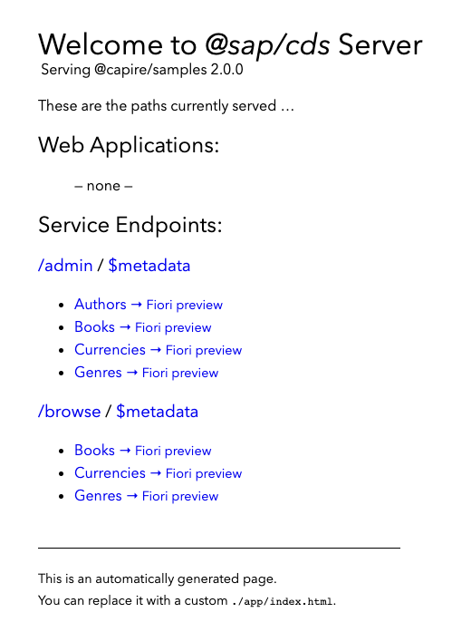
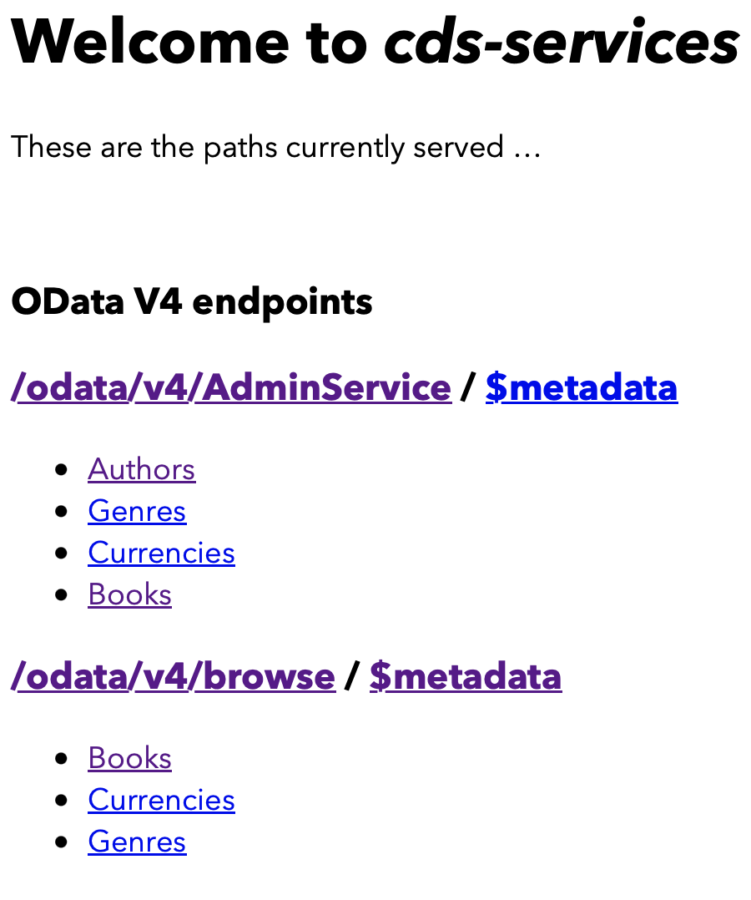
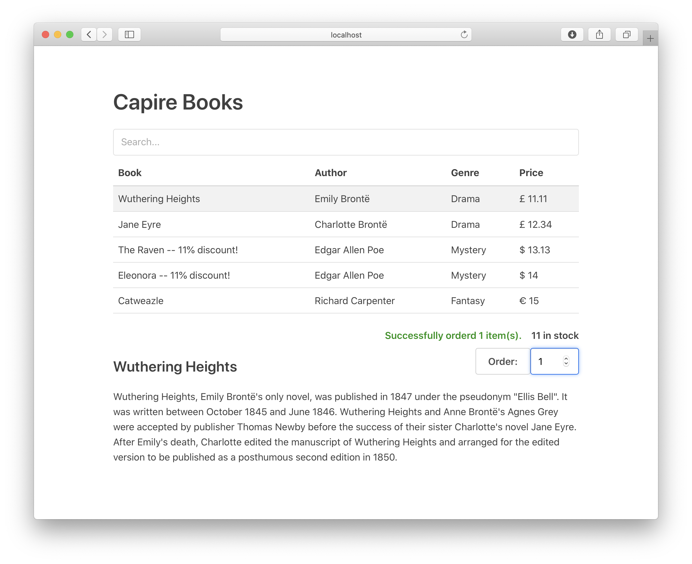
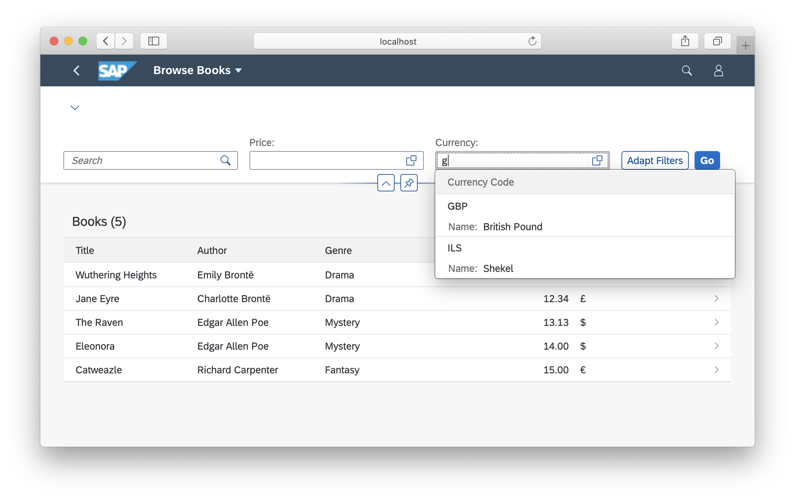

# Getting Started in a Nutshell

Using a minimalistic setup
{ .subtitle}

<!-- EXCLUDE IN NOTEBOOK START -->
You’ll learn, step by step, how to do the following:
[[toc]]
<!-- EXCLUDE IN NOTEBOOK END -->

## Jumpstarting Projects { #start-a-project}
<!--Used as link target from Help Portal: https://help.sap.com/products/BTP/65de2977205c403bbc107264b8eccf4b/29c25e504fdb4752b0383d3c407f52a6.html -->
[After installing `@sap/cds-dk` globally](./#local-setup), create a project with minimal defaults as follows:

<div class="impl node">

```sh
cds init bookshop
```
</div>

<div class="impl java">

```sh
cds init bookshop --add java
```
</div>

<!-- EXCLUDE IN NOTEBOOK START -->
> To copy code snippets, click the 
> icon in the upper-right corner of the code box.


### Download from _cap/samples_ (Optional)

<!-- TODO: Add a toggle on the new capire to toggle between manual and cloning -->
Instead of going for a manual step-by-step experience, you can also get the [cap/samples from GitHub](https://github.com/sap-samples/cloud-cap-samples). In this case, skip the previous `cds init bookshop` step. {.impl .node}

Instead of going for a manual step-by-step experience, you can also get the [cap/samples from GitHub](https://github.com/sap-samples/cloud-cap-samples-java). In this case, skip the previous `cds init bookshop --add java` step. {.impl .java}

Just keep in mind that the sample code on GitHub is an already complete application showcasing a lot of features. So you might find more code in the app than in the code that is created in this step-by-step guide. {.impl .java}

<div class ="impl node">

```sh
git clone https://github.com/sap-samples/cloud-cap-samples samples
cd samples
npm install
```
</div>

<div class ="impl java">

```sh
git clone https://github.com/sap-samples/cloud-cap-samples-java bookshop
```
</div>

<div class ="impl node">

::: tip
Don't forget to execute `npm install`, as the sample repository has multiple parts that require each other.
:::
</div>


<!-- EXCLUDE IN NOTEBOOK END -->

### Go to the _bookshop_ folder

In the following, we assume that you're in the _bookshop_ folder unless told otherwise.

```sh
cd bookshop
```

### Launch `cds watch` {#run}

For an automated jumpstart, you can just tell `cds` to watch out for things to arrive:
<!-- also here .. we either mention mvn or have it wrapped by cds watch --mode java or sth alike -->

<div class="impl node">

```sh
cds watch
```
</div>

<!--
at the moment you need to switch to srv folder in order to get mvn cds:watch
working. not nice.. maybe we want to improve this
-->

<div class="impl java">

```sh
cd srv && mvn cds:watch
```
</div>

Use `cds watch` to start a cds server, even in a newly created and yet empty project. Whenever you feed your project with new content, for example, by adding or modifying _.cds_, _.json_, or _.js_ files, the server automatically restarts to serve the new content. Because there isn't any content in your project yet, it just keeps waiting with a message like this: {.impl .node}


<pre class="log impl node">
<span style="color:#fc0">[cds](cds) - running nodemon...
--ext cds,csn,csv,ts,mjs,cjs,js,json,properties,edmx,xml
</span>
    No models found at db/,srv/,app/,schema,services,.
    Waiting for some to arrive...

</pre>

Change to the `srv` folder and use `mvn cds:watch` to start your CAP Java application along with a CDS compiler,
watching for changed or newly added CDS files. Since your project is still empty the first run will wait at
the CDS compile phase until the first CDS file is added. Once this is added, your CAP Java application will start as a Spring Boot application. Each change or addition of a CDS or Java resource will trigger a restart. {.impl .java}

## Defining Domain Models { #domain-models}
<!--Used as link target from Help Portal: https://help.sap.com/products/BTP/65de2977205c403bbc107264b8eccf4b/29c25e504fdb4752b0383d3c407f52a6.html -->

Let's feed our project by adding a simple domain model. Start by creating a file named _db/schema.cds_ (also indicated in the code box's label) and copy the following definitions into it:

::: code-group

```cds [db/schema.cds]
using { Currency, managed, sap } from '@sap/cds/common';
namespace sap.capire.bookshop;

entity Books : managed {
  key ID : Integer;
  title  : localized String(111);
  descr  : localized String(1111);
  author : Association to Authors;
  genre  : Association to Genres;
  stock  : Integer;
  price  : Decimal(9,2);
  currency : Currency;
}

entity Authors : managed {
  key ID : Integer;
  name   : String(111);
  books  : Association to many Books on books.author = $self;
}

/** Hierarchically organized Code List for Genres */
entity Genres : sap.common.CodeList {
  key ID   : Integer;
  parent   : Association to Genres;
  children : Composition of many Genres on children.parent = $self;
}

```
:::

<!--- % include _code from='bookshop:db/schema.cds' %} -->

[Find this source also in **cap/samples**.](https://github.com/sap-samples/cloud-cap-samples/tree/main/bookshop/db/schema.cds){ .learn-more .impl .node target="_blank"}
[Find this source also in **cap/samples**.](https://github.com/SAP-samples/cloud-cap-samples-java/blob/main/db/books.cds){ .learn-more target="_blank" .impl .java}
[Learn more about **Domain Modeling**.](../guides/domain-models/){ .learn-more}
[Learn more about **CDS Modeling Languages**.](../cds/){ .learn-more}


### Deployed to Databases Automatically {#deployed-in-memory}

As soon as you save your file, the still running `cds watch` reacts immediately with new output like this: {.impl .node}

<pre class="log impl node">
[cds](cds) - connect to db { database: <em>':memory:'</em> }
/> successfully deployed to sqlite in-memory db
</pre>

This means that `cds watch` detected the changes in _db/schema.cds_ and automatically bootstrapped an in-memory _SQLite_ database when restarting the server process. {.impl .node}

As soon as you save your CDS file, the still running `mvn cds:watch` command reacts immediately with a CDS
compilation and reload of the CAP Java application. The embedded database of the started application will reflect the schema defined in your CDS file. {.impl .java}

[Learn more about using databases.](#databases){.learn-more}


<!-- EXCLUDE IN NOTEBOOK START -->
### Compiling Models (Optional) {#cli}

We can also test-compile models individually to check for validity and produce a parsed output in [CSN format](../cds/csn). For example, run this command in a new terminal:

```sh
cds db/schema.cds
```

This dumps the compiled CSN model as a plain JavaScript object to stdout. <br>
Add `--to <target>` (shortcut `-2`) to produce other outputs, for example:

```sh
cds db/schema.cds -2 json
cds db/schema.cds -2 yml
cds db/schema.cds -2 sql
```

[Learn more about the command line interface by executing `cds --help`.](#cli){.learn-more}
<!-- EXCLUDE IN NOTEBOOK END -->

## Defining Services { #defining-services}
<!--Used as link target from Help Portal: https://help.sap.com/products/BTP/65de2977205c403bbc107264b8eccf4b/29c25e504fdb4752b0383d3c407f52a6.html -->

After the recent changes, `cds watch` also prints this message: {.impl .node}

<pre class="log impl node">
    No service definitions found in loaded models.
    Waiting for some to be added...
</pre>

After the recent changes, the running CAP Java application is still not
exposing any service endpoints. {.impl .java}

So, let's go on feeding it with service definitions.
Following the [best practice of single-purposed services](../guides/providing-services/#single-purposed-services), we’ll define two services for different use cases.


### One for Admins to Maintain _Books_ and _Authors_

::: code-group
```cds [srv/admin-service.cds]
using { sap.capire.bookshop as my } from '../db/schema';
service AdminService @(requires:'authenticated-user') {
  entity Books as projection on my.Books;
  entity Authors as projection on my.Authors;
}
```
:::

<!--- % include _code from='bookshop:srv/cat-service.cds' %} -->
[Find this source also in **cap/samples**.](https://github.com/sap-samples/cloud-cap-samples/tree/main/bookshop/srv/admin-service.cds){.learn-more .impl .node target="_blank"}
[Find this source also in **cap/samples**.](https://github.com/SAP-samples/cloud-cap-samples-java/blob/main/srv/admin-service.cds){.learn-more .impl .java target="_blank"}

### And One for End Users to Browse and Order _Books_ {#cat-service}

::: code-group
```cds [srv/cat-service.cds]
using { sap.capire.bookshop as my } from '../db/schema';
service CatalogService @(path:'/browse') {

  @readonly entity Books as SELECT from my.Books {*,
    author.name as author
  } excluding { createdBy, modifiedBy };

  @requires: 'authenticated-user'
  action submitOrder (book: Books:ID, quantity: Integer);
}
```
:::

[Find this source also in **cap/samples**.](https://github.com/sap-samples/cloud-cap-samples/tree/main/bookshop/srv/cat-service.cds){ .learn-more .impl .node target="_blank"}
[Find this source also in **cap/samples**.](https://github.com/sap-samples/cloud-cap-samples/tree/main/bookshop/srv/cat-service.cds){ .learn-more .impl .java target="_blank"}
[Learn more about **Defining Services**.](../guides/providing-services/){ .learn-more}


### Served to OData out-of-the-box

This time `cds watch` reacted with additional output like this: {.impl .node}


<pre class="log impl node">
[cds](cds) - serving AdminService { at: <em>'/admin'</em> }
[cds](cds) - serving CatalogService { at: <em>'/browse'</em>, impl: <em>'bookshop/srv/cat-service.js'</em> }
[cds](cds) - launched in: 744.291ms
[cds](cds) - server listening on { url: <em>'http://localhost:4004'</em> }
</pre>

In case the CDS service definitions were compiled correctly the Spring Boot runtime is reloaded automatically and should output a log line like this: {.impl .java}

<pre class="log impl java">
c.s.c.services.impl.ServiceCatalogImpl   : Registered service AdminService
...
c.s.c.services.impl.ServiceCatalogImpl   : Registered service CatalogService
</pre>


As you can see in the log output, the two service definitions have been compiled and generic service providers have been constructed to serve requests on the listed endpoints _/admin_ and _/browse_.{.impl .node}

As you can see in the log output, the two service definitions have been compiled and generic service providers have been constructed to serve requests on the listed endpoints _/odata/v4/AdminService_ and _/odata/v4/browse_. {.impl .java}


<div class="impl java">

::: warning
Both services defined above contain security annotations that restrict access to certain endpoints. Please add the dependency to spring-boot-security-starter to the srv/pom.xml in order to activate mock user and authentication support:
:::
</div>

<div class="impl java">

```xml
<dependency>
	<groupId>org.springframework.boot</groupId>
	<artifactId>spring-boot-starter-security</artifactId>
</dependency>
```
</div>

<!-- TODO: explain "Why" is there a generic index.html and from where is it served? Link zu cds.server-->
Open _<http://localhost:4004>_ in your browser and see the generic _index.html_ page:
{.impl .node}
<!-- TODO: explain "Why" is there a generic index.html and from where is it served? Link zu cds.server-->
Open _<http://localhost:8080>_ in your browser and see the generic _index.html_ page:
{.impl .java}

{style="width:450px; box-shadow: 1px 1px 5px #888888" class="adapt"} {.impl .node}

{style="width:450px; box-shadow: 1px 1px 5px #888888" class="adapt"} {.impl .java}


> User `alice` is a [default user with admin privileges](../node.js/authentication#mocked). Use it to access the `admin` service. You don't need to enter a password. {.impl .node}

> User `authenticated` is a [prepared mock user](../java/security#mock-users) which will be authenticated by default. Use it to access the `admin` service. You don't need to enter a password. {.impl .java}

<!-- EXCLUDE IN NOTEBOOK START -->
### Compiling APIs (Optional) { #repl}

You can also compile service definitions explicitly, for example to an [OData model](http:/docs.oasis-open.org/odata/odata/v4.0/odata-v4.0-part3-csdl.html):

```sh
cds srv/cat-service.cds -2 edmx
```

Essentially, using a CLI, this invokes what happened automatically behind the scenes in the previous steps.
While we don't really need such explicit compile steps, you can do this to test correctness on the model level, for example.
<!-- EXCLUDE IN NOTEBOOK END -->

## Using Databases {#databases}
<!--Used as link target from Help Portal: https://help.sap.com/products/BTP/65de2977205c403bbc107264b8eccf4b/29c25e504fdb4752b0383d3c407f52a6.html -->


### Using _sqlite_ In-Memory Database {.impl .node}

As [previously shown](#deployed-in-memory), `cds watch` automatically bootstraps an SQLite in-process and in-memory database by default --- that is, unless told otherwise. While this **isn't meant for productive use**, it drastically speeds up development turn-around times, essentially by mocking your target database, for example, SAP HANA. {.impl .node}

[Learn more about mocking options in **Grow as you go**.](./grow-as-you-go){.learn-more .impl .node}

### Using _H2_ In-Memory Database {.impl .java}

As [previously shown](#deployed-in-memory), `mvn cds:watch` automatically bootstraps an H2 in-process and in-memory database by default --- that is, unless told otherwise. While this **isn't meant for productive use**, it drastically speeds up turn-around times in local development and furthermore allows self-contained testing. {.impl .java}

### Adding Initial Data in `.csv` Files

Now, let's fill your database with initial data by adding a few plain CSV files under _db/data_ like this:

::: code-group

```csv [db/data/sap.capire.bookshop-Books.csv]
ID;title;author_ID;stock
201;Wuthering Heights;101;12
207;Jane Eyre;107;11
251;The Raven;150;333
252;Eleonora;150;555
271;Catweazle;170;22
```
:::

::: code-group

```csv [db/data/sap.capire.bookshop-Authors.csv]
ID;name
101;Emily Brontë
107;Charlotte Brontë
150;Edgar Allen Poe
170;Richard Carpenter
```
:::


[Find a full set of `.csv` files in **cap/samples**.](https://github.com/sap-samples/cloud-cap-samples/tree/main/bookshop/db/data){ .learn-more target="_blank"}

<!-- Add a file named `init.js` in your `db` folder. The next time you run `cds deploy` it will automatically detect that file and run it after the schema has been deployed.

% include _code from='bookshop:db/init.js' %}
[learn more about using `cds.ql` for reading and writing data](../node.js/cds-ql){ .learn-more}  -->

After you’ve added these files, `cds watch` restarts the server with output, telling us that the files have been detected and their content been loaded into the database automatically: {.impl .node}

<pre class="log impl node">
[cds](cds) - connect to db { database: <em>':memory:'</em> }
 > filling sap.capire.bookshop.Authors from bookshop/db/data/sap.capire.bookshop-Authors.csv
 > filling sap.capire.bookshop.Books from bookshop/db/data/sap.capire.bookshop-Books.csv<!-- EXCLUDE IN NOTEBOOK START -->
 > filling sap.capire.bookshop.Books_texts from bookshop/db/data/sap.capire.bookshop-Books_texts.csv
 > filling sap.capire.bookshop.Genres from bookshop/db/data/sap.capire.bookshop-Genres.csv
 > filling sap.common.Currencies from common/data/sap.common-Currencies.csv
 > filling sap.common.Currencies_texts from common/data/sap.common-Currencies_texts.csv<!-- EXCLUDE IN NOTEBOOK END -->
/> successfully deployed to sqlite in-memory db
</pre>

> This is the output when you're using the [samples](https://github.com/sap-samples/cloud-cap-samples). It's less if you've followed the manual steps here. {.impl .node}

After you’ve added these files, `mvn cds:watch` restarts the server with output, telling us that the files have been detected and their content been loaded into the database automatically: {.impl .java}

<pre class="log impl java">
 c.s.c.s.impl.persistence.CsvDataLoader   : Filling sap.capire.bookshop.Books from db/data/sap.capire.bookshop-Authors.csv
 c.s.c.s.impl.persistence.CsvDataLoader   : Filling sap.capire.bookshop.Books from db/data/sap.capire.bookshop-Books.csv
</pre>

[Learn more about **Using Databases**.](../guides/databases/){.learn-more}


### Querying Through OData out-of-the-box

Now that we've a connected, fully capable SQL database, filled with some initial data, we can send complex OData queries, served by the built-in generic providers:

- _[browse/Books?$select=ID,title](http://localhost:4004/browse/Books?$select=ID,title)_ {.impl .node}
- _[admin/Authors?$search=Bro](http://localhost:4004/admin/Authors?$search=Bro)_ {.impl .node}
- _[admin/Authors?$expand=books($select=ID,title)](http://localhost:4004/admin/Authors?$expand=books($select=ID,title))_ {.impl .node}


- _[browse/Books?$select=ID,title](http://localhost:8080/odata/v4/browse/Books?$select=ID,title)_ {.impl .java}
- _[admin/Authors?$search=Bro](http://localhost:8080/odata/v4/AdminService/Authors?$search=Bro)_ {.impl .java}
- _[admin/Authors?$expand=books($select=ID,title)](http://localhost:8080/odata/v4/AdminService/Authors?$expand=books($select=ID,title))_ {.impl .java}

> Use [_Alice_](../node.js/authentication#mocked) as user to query the `admin` service. You don't need to enter a password. {.impl .node}

> Use [_authenticated_](../java/security#mock-users) to query the `admin` service. You don't need to enter a password. {.impl .java}

[Learn more about **Generic Providers**.](../guides/providing-services/){.learn-more}
[Learn more about **OData's Query Options**.](../advanced/odata){.learn-more}

<!-- EXCLUDE IN NOTEBOOK START -->
### Deploying Persistent Databases {.impl .node}

Instead of using in-memory, we can also use persistent databases. For example, still with SQLite: {.impl .node}

<div class="impl node">

```sh
npm add sqlite3 -D
cds deploy --to sqlite:my.db
```
</div>

The difference from the automatically provided in-memory database is that we now get a persistent database stored in the local file _./my.db_. This is also recorded in the _package.json_. s{.impl .node}

To see what that did, use the _sqlite3_ CLI with the newly created database: {.impl .node}

<div class="impl node">

```sh
sqlite3 my.db .dump
sqlite3 my.db .tables
```
</div>

You could also deploy to a provisioned SAP HANA database using this variant: {.impl .node}

<div class="impl node">

```sh
cds deploy --to hana
```
</div>


[Learn more about deploying to SAP HANA.](../guides/databases/){.learn-more .impl .node}


## Adding/Serving UIs
<!--Used as link target from Help Portal: https://help.sap.com/products/BTP/65de2977205c403bbc107264b8eccf4b/29c25e504fdb4752b0383d3c407f52a6.html -->
You can consume the provided services, for example, from UI frontends, using standard AJAX requests.
Simply add an _index.html_ file into the _app/_ folder, to replace the generic index page.


### Vue.js UIs {#vue .impl .node}

For example, you can [find a simple Vue.js app in **cap/samples**](https://github.com/sap-samples/cloud-cap-samples/tree/main/bookshop/app/vue), which demonstrates browsing and ordering books using OData requests to [the `CatalogService` API we defined above](#cat-service). {.impl .node}

{style="margin:0" .impl .node .adapt}


### SAP Fiori UIs {#fiori}

Besides, being usable from any UI frontends using standard AJAX requests, CAP provides out-of-the-box support for SAP Fiori UIs, for example, with respect to SAP Fiori annotations and advanced features such as search, value helps and SAP Fiori draft.

{style="margin:0" .adapt}

[Learn more about **Serving Fiori UIS**.](../advanced/fiori){.learn-more}


### Using OData Protocol

As CAP-based services are full-fledged OData services out-of-the-box, you can use advanced
query options, such as `$select`, `$expand`, `$search`, and many more.

[Learn more about **Serving OData Protocol**.](../advanced/odata){.learn-more}


## Adding Custom Logic {#adding-custom-logic}
<!--Used as link target from Help Portal: https://help.sap.com/products/BTP/65de2977205c403bbc107264b8eccf4b/29c25e504fdb4752b0383d3c407f52a6.html -->

While the generic providers serve most CRUD requests out-of-the-box, you can add custom code to deal with the specific domain logic of your application.


### Providing Service Implementations

In Node.js, the easiest way to provide implementations for services is through equally named _.js_ files placed next to a service definition's _.cds_ file: {.impl .node}

<div class="impl node" style="margin: 0 44px">

```sh
./srv
  - cat-service.cds  # service definitions
  - cat-service.js   # service implementation
...
```
</div>


[See these files also in **cap/samples**/bookshop/srv folder.](https://github.com/sap-samples/cloud-cap-samples/tree/main/bookshop/srv){ .learn-more .impl .node target="_blank"}
[Learn more about providing service implementations **in Node.js**.](../node.js/services#srv-impls){.learn-more .impl .node}
[Learn also **how to do that in Java** using Event Handler Classes.](../java/provisioning-api#handlerclasses){.learn-more .impl .node}

In CAP Java, you can add custom handlers for your service as so called EventHandlers. As CAP Java integrates with Spring Boot, you need to provide your custom code in classes, annotated with `@Component`or `@Service`, for example. Use your favorite Java IDE to add a class like the following to the `srv/src/main/java/` folder of your application. {.impl .java}

<div class="impl java">

```java
@Component
@ServiceName(CatalogService_.CDS_NAME)
public class CatalogHandler implements EventHandler {
  // your custom code will go here
}
```
</div>

<div class="impl java">

::: tip
Place the code in your package of choice and use your IDE to generate the needed `import` statements.
:::
</div>


### Adding Custom Event Handlers

Service implementations essentially consist of one or more event handlers.
Copy this into _srv/cat-service.js_ to add custom event handlers: {.impl .node}

<div class="impl node">

```js
const cds = require('@sap/cds')
module.exports = function (){
  // Register your event handlers in here, for example, ...
  this.after ('READ','Books', each => {
    if (each.stock > 111) {
      each.title += ` -- 11% discount!`
    }
  })
}
```
</div>

[Learn more about adding **event handlers** using `<srv>.on/before/after`.](../node.js/services#event-handlers){.learn-more} {.impl .node}

Now that you have created the classes for your custom handlers it's time to add the actual logic. You can achieve this by adding methods annotated with CAP's `@Before`,  `@On`, or `@After` to your new class. The annotation takes two arguments: the event that shall be handled and the entity name for which the event is handled.
{.impl .java}

```java
@After(event = CqnService.EVENT_READ, entity = Books_.CDS_NAME)
public void addDiscountIfApplicable(List<Books> books) {
	for (Books book : books) {
		if (book.getStock() > 111) {
			book.setTitle(book.getTitle() + " -- 11% discount!");
		}
	}
}
```
{.impl .java}

[Learn more about **event handlers** in the  CAP Java documentation.](../java/provisioning-api#handlerclasses){.learn-more} {.impl .java}


### Consuming Other Services

Quite frequently, event handler implementations consume other services, sending requests and queries, as in the completed example below.

<div class="impl node">

::: code-group
```js [srv/cat-service.js]
const cds = require('@sap/cds')
module.exports = async function (){

  const db = await cds.connect.to('db') // connect to database service
  const { Books } = db.entities         // get reflected definitions

  // Reduce stock of ordered books if available stock suffices
  this.on ('submitOrder', async req => {
    const {book,quantity} = req.data
    const n = await UPDATE (Books, book)
      .with ({ stock: {'-=': quantity }})
      .where ({ stock: {'>=': quantity }})
    n > 0 || req.error (409,`${quantity} exceeds stock for book #${book}`)
  })

  // Add some discount for overstocked books
  this.after ('READ','Books', each => {
    if (each.stock > 111)  each.title += ` -- 11% discount!`
  })
}
```
:::
</div>

<div class="impl java">

```java
@Component
@ServiceName(CatalogService_.CDS_NAME)
public class SubmitOrderHandler implements EventHandler {

	private final PersistenceService persistenceService;

	public SubmitOrderHandler(PersistenceService persistenceService) {
		this.persistenceService = persistenceService;
	}

	@On()
	public void onSubmitOrder(SubmitOrderContext context) {
		Select<Books_> byId = Select.from(cds.gen.catalogservice.Books_.class).byId(context.getBook());
		Books book = persistenceService.run(byId).single().as(Books.class);
		book.setStock(book.getStock() - context.getQuantity());

		persistenceService.run(Update.entity(Books_.CDS_NAME).data(book));

		context.setCompleted();
	}
}
```
</div>

[Find this source also in **cap/samples**.](https://github.com/sap-samples/cloud-cap-samples/tree/main/bookshop/srv/cat-service.js){ .learn-more .impl .node target="_blank"}
[Find an extended version of this source also in **cap/samples**.](https://github.com/SAP-samples/cloud-cap-samples-java/blob/main/srv/src/main/java/my/bookshop/handlers/CatalogServiceHandler.java#L166){ .impl .java .learn-more target="_blank"}
[Learn more about **connecting to services** using `cds.connect`.](../node.js/cds-connect){ .learn-more .impl .node}
[Learn more about **connecting to services** using `@Autowired`, `com.sap.cds.ql`, etc.](../java/consumption-api){.learn-more .impl .java}
[Learn more about **reading and writing data** using `cds.ql`.](../node.js/cds-ql){ .learn-more .impl .node}
[Learn more about **reading and writing data** using `cds.ql`.](../java/query-api){ .learn-more .impl .java}
[Learn more about **using reflection APIs** using `<srv>.entities`.](../node.js/services#srv-entities){ .learn-more .impl .node}
[Learn more about **typed access to data** using the CAP Java SDK.](../java/data#typed-access){ .learn-more .impl .java}

**Test this implementation**, [for example using the Vue.js app](#vue), and see how discounts are displayed in some book titles. {.impl .node}

Or submit orders until you see the error messages. {.impl .node}
<!-- EXCLUDE IN NOTEBOOK END -->


## Summary and Next Steps
With this getting started guide we introduced many of the basics of CAP, such as:

- [Jump-Starting Projects and Grow-as-you-go](./grow-as-you-go) <!-- Airplane Mode is still empty concept -->
- [Domain Modeling](../guides/domain-models/)
- [Defining Services and APIs](../guides/providing-services/)
- [Providing Services](../guides/providing-services/)
- [Consuming Services](../guides/using-services/)
- [Using Databases](../guides/databases/)
- [Adding/Serving UIs](../advanced/fiori)
- [Adding Custom Logic](../guides/providing-services/#adding-custom-logic)

[**Visit our Cookbook**](../guides/) to find more task-oriented guides. For example, you can find guides about potential next steps such as adding [Authentication](../node.js/authentication) and [Authorization](../guides/authorization/) or [Deploying to SAP BTP, Cloud Foundry environment](../guides/deployment/).

Also **see the reference sections** to find detailed documentation about [**CDS**](../cds/), as well as [**Node.js**](../node.js/) and [**Java**](../java/) Service SDKs and runtimes.
