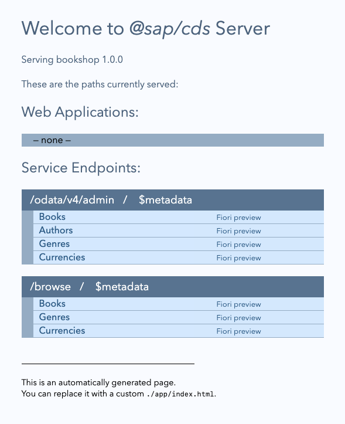
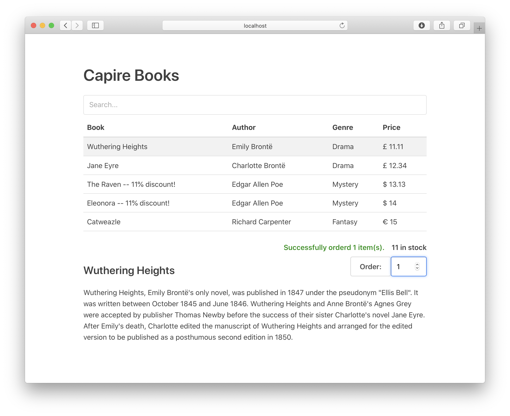
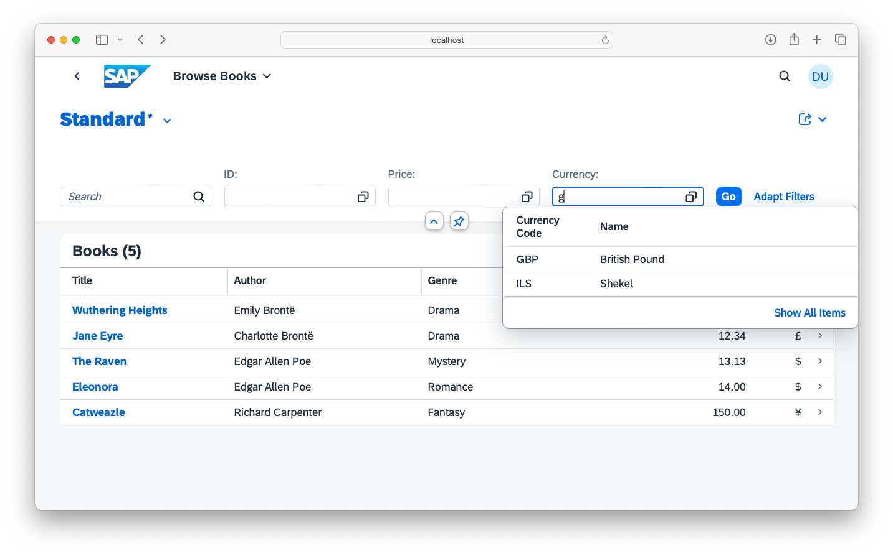

# Getting Started in a Nutshell
Using a minimalistic setup {: .subtitle}

You’ll learn, step by step, how to do the following:


## Jumpstarting Projects {: #start-a-project}
<!--Used as link target from Help Portal: https://help.sap.com/products/BTP/65de2977205c403bbc107264b8eccf4b/29c25e504fdb4752b0383d3c407f52a6.html -->
[After installing `@sap/cds-dk` globally](./#local-setup), create a project with minimal defaults as follows:

```sh
cds init bookshop
```
<!-- INCLUDE IN NOTEBOOK [{ value: 'cd bookshop', kind: 2 }] -->
<!-- EXCLUDE IN NOTEBOOK START -->
> To copy code snippets, click the 
> icon in the upper-right corner of the code box.


### Download from [_cap/samples_][samples] (Optional)

Instead of going for a manual step-by-step experience, you can also get the [cap/samples from GitHub](https://github.com/SAP-samples/cloud-cap-samples):

```sh
git clone https://github.com/SAP-samples/cloud-cap-samples samples
cd samples
npm install
```
<!-- EXCLUDE IN NOTEBOOK END -->
### Launch `cds watch` {:#run}

For an automated jumpstart, you can just tell `cds` to watch out for things to arrive:

```sh
cds watch bookshop
```

Use `cds watch` to start a cds server, even in a newly created and yet empty project. Whenever you feed your project with new content, for example, by adding or modifying _.cds_, _.json_, or _.js_ files, the server automatically restarts to serve the new content. Because there isn't any content in your project yet, it just keeps waiting with a message like this:

<pre class="log">
<span style="color:#fc0">[cds] - running nodemon...
--ext cds,csn,csv,ts,mjs,cjs,js,json,properties,edmx,xml
</span>
    No models found at db/,srv/,app/,schema,services,.
    Waiting for some to arrive...

</pre>


## Defining Domain Models {: #domain-models}
<!--Used as link target from Help Portal: https://help.sap.com/products/BTP/65de2977205c403bbc107264b8eccf4b/29c25e504fdb4752b0383d3c407f52a6.html -->

Let's feed our project by adding a simple domain model. Start by creating a file named _db/schema.cds_ (also indicated in the code box's label) and copy the following definitions into it:



[Find this source also in **cap/samples**.](./assets/bookshop/db/schema.cds){: .learn-more target="_blank"}
[Learn more about **Domain Modeling**.][Domain Modeling]{: .learn-more}
[Learn more about **CDS Modeling Languages**.][CDS]{: .learn-more}


### Deployed to Databases Automatically {:#deployed-in-memory}

As soon as you save your file, the still running `cds watch` will react immediately with new output like this:

<pre class="log">
[cds] - connect to db { database: <em>':memory:'</em> }
/> successfully deployed to sqlite in-memory db
</pre>

This means that `cds watch` detected the changes in _db/schema.cds_ and automatically bootstrapped an in-memory _SQLite_ database when restarting the server process.

[Learn more about using databases.](#databases){:.learn-more}


<!-- EXCLUDE IN NOTEBOOK START -->
### Compiling Models (Optional) {:#cli}

We can also test-compile models individually to check for validity and produce a parsed output in [CSN format][CSN]. For example, run this command in a new terminal:

```sh
cds db/schema.cds
```

This dumps the compiled CSN model as a plain JavaScript object to stdout. <br>
Add `--to <target>` (shortcut `-2`) to produce other outputs, for example:

```sh
cds db/schema.cds -2 json
cds db/schema.cds -2 yml
cds db/schema.cds -2 sql
```

[Learn more about the command line interface by executing `cds --help`.](#cli){:.learn-more}
<!-- EXCLUDE IN NOTEBOOK END -->

## Defining Services {: #defining-services}
<!--Used as link target from Help Portal: https://help.sap.com/products/BTP/65de2977205c403bbc107264b8eccf4b/29c25e504fdb4752b0383d3c407f52a6.html -->

After the recent changes, `cds watch` also prints this message:

<pre class="log">
    No service definitions found in loaded models.
    Waiting for some to be added...
</pre>

So, let's go on feeding it with service definitions.
Following the [best practice of single-purposed services](../../guides/providing-services/#single-purposed-services), we’ll define two services for different use cases.


### One for Admins to Maintain _Books_ and _Authors_


[Find this source also in **cap/samples**.](./assets/bookshop/srv/admin-service.cds){: .learn-more target="_blank"}


### And One for End Users to Browse and Order _Books_ {:#cat-service}


[Find this source also in **cap/samples**.](./assets/bookshop/srv/cat-service.cds){: .learn-more target="_blank"}
[Learn more about **Defining Services**.][Services]{: .learn-more}


### Served to OData out-of-the-box

This time `cds watch` reacted with additional output like this:

<pre class="log">
[cds] - serving AdminService { at: <em>'/admin'</em> }
[cds] - serving CatalogService { at: <em>'/browse'</em>, impl: <em>'bookshop/srv/cat-service.js'</em> }
[cds] - launched in: 744.291ms
[cds] - server listening on { url: <em>'http://localhost:4004'</em> }
</pre>


As you can see in the log output, the two service definitions have been compiled and generic service providers have been constructed to serve requests on the listed endpoints _/admin_ and _/browse_.

Open _<http://localhost:4004>_ in your browser and see the generic _index.html_ page: <!-- TODO: explain "Why" is there a generic index.html and from where is it served? Link zu cds.server-->
{:style="width:450px; box-shadow: 1px 1px 5px #888888"}

> Alice is a [default user with admin privileges](../../node.js/authentication/#mocked). Use it to access the `admin` service. You don't need to enter a password.

<!-- EXCLUDE IN NOTEBOOK START -->
### Compiling APIs (Optional) {: #repl}

You can also compile service definitions explicitly, for example to an [OData model][EDMX]:

```sh
cds srv/cat-service.cds -2 edmx
```

Essentially, using a CLI, this invokes what happened automatically behind the scenes in the previous steps.
While we don't really need such explicit compile steps, you can do this to test correctness on the model level, for example.
<!-- EXCLUDE IN NOTEBOOK END -->

## Using Databases {:#databases}
<!--Used as link target from Help Portal: https://help.sap.com/products/BTP/65de2977205c403bbc107264b8eccf4b/29c25e504fdb4752b0383d3c407f52a6.html -->


### Using _sqlite_ In-Memory Database

As [previously shown](#deployed-in-memory), `cds watch` automatically bootstraps an SQLite in-process and in-memory database by default --- that is, unless told otherwise. While this **isn't meant for productive use**, it drastically speeds up development turn-around times, essentially by mocking your target database, for example, SAP HANA.

[Learn more about mocking options in **Grow as you go**.](./grow-as-you-go){:.learn-more}


### Adding Initial Data in `.csv` Files

Now, let's fill your database with initial data by adding a few plain CSV files under _db/data_ like this:




[Find a full set of `.csv` files in **cap/samples**.](./assets/bookshop/db/data){: .learn-more target="_blank"}

<!-- Add a file named `init.js` in your `db` folder. The next time you run `cds deploy` it will automatically detect that file and run it after the schema has been deployed.


[learn more about using `cds.ql` for reading and writing data](../../node.js/cds-ql){: .learn-more} -->

After you’ve added these files, `cds watch` restarts the server with output, telling us that the files have been detected and their content been loaded into the database automatically:

<pre class="log">
[cds] - connect to db { database: <em>':memory:'</em> }
 > filling sap.capire.bookshop.Authors from bookshop/db/data/sap.capire.bookshop-Authors.csv
 > filling sap.capire.bookshop.Books from bookshop/db/data/sap.capire.bookshop-Books.csv<!-- EXCLUDE IN NOTEBOOK START -->
 > filling sap.capire.bookshop.Books_texts from bookshop/db/data/sap.capire.bookshop-Books_texts.csv
 > filling sap.capire.bookshop.Genres from bookshop/db/data/sap.capire.bookshop-Genres.csv
 > filling sap.common.Currencies from common/data/sap.common-Currencies.csv
 > filling sap.common.Currencies_texts from common/data/sap.common-Currencies_texts.csv<!-- EXCLUDE IN NOTEBOOK END -->
/> successfully deployed to sqlite in-memory db
</pre>

> This is the output when you're using the [samples](https://github.com/SAP-samples/cloud-cap-samples). It's less if you've followed the manual steps here.

[Learn more about **Using Databases**.][Using Databases]{:.learn-more}


### Querying Through OData out-of-the-box

Now that we've a connected, fully capable SQL database, filled with some initial data, we can send complex OData queries, served by the built-in generic providers:

- _[browse/Books?$select=ID,title](http://localhost:4004/browse/Books?$select=ID,title)_
- _[admin/Authors?$search=Bro](http://localhost:4004/admin/Authors?$search=Bro)_
- _[admin/Authors?$expand=books($select=ID,title)](http://localhost:4004/admin/Authors?$expand=books($select=ID,title))_

> Use [_Alice_](../../node.js/authentication/#mocked) as user to query the `admin` service. You don't need to enter a password.

[Learn more about **Generic Providers**.][Generic Providers]{:.learn-more}
[Learn more about **OData's Query Options**.][OData]{:.learn-more}

<!-- EXCLUDE IN NOTEBOOK START -->
### Deploying Persistent Databases

Instead of using in-memory, we can also use persistent databases. For example, still with SQLite:

```sh
npm add sqlite3 -D
cds deploy --to sqlite:my.db
```

The difference from the automatically provided in-memory database is that we now get a persistent database stored in the local file _./my.db_. This is also recorded in the _package.json_.

To see what that did, use the _sqlite3_ CLI with the newly created database:

```sh
sqlite3 my.db .dump
sqlite3 my.db .tables
```

You could also deploy to a provisioned SAP HANA database using this variant:

```sh
cds deploy --to hana
```

[Learn more about deploying to SAP HANA.][Using Databases]{:.learn-more}


## Adding/Serving UIs
<!--Used as link target from Help Portal: https://help.sap.com/products/BTP/65de2977205c403bbc107264b8eccf4b/29c25e504fdb4752b0383d3c407f52a6.html -->
You can consume the provided services, for example, from UI frontends, using standard AJAX requests.
Simply add an _index.html_ file into the _app/_ folder, to replace the generic index page.


### Vue.js UIs {:#vue}

For example, you can [find a simple Vue.js app in **cap/samples**](./assets/bookshop/app/vue), which demonstrates browsing and ordering books using OData requests to [the `CatalogService` API we defined above](#cat-service).

{:style="margin:0"}


### SAP Fiori UIs {:#fiori}

Besides, being usable from any UI frontends using standard AJAX requests, CAP provides out-of-the-box support for SAP Fiori UIs, for example, with respect to SAP Fiori annotations and advanced features such as search, value helps and SAP Fiori draft.

{:style="margin:0"}

[Learn more about **Serving Fiori UIS**.](../../advanced/fiori){:.learn-more}


### Using OData Protocol

As CAP-based services are full-fledged OData services out-of-the-box, you can use advanced
query options, such as `$select`, `$expand`, `$search`, and many more.

[Learn more about **Serving OData Protocol**.][OData]{:.learn-more}


## Adding Custom Logic {:#adding-custom-logic}
<!--Used as link target from Help Portal: https://help.sap.com/products/BTP/65de2977205c403bbc107264b8eccf4b/29c25e504fdb4752b0383d3c407f52a6.html -->

While the generic providers serve most CRUD requests out-of-the-box, you can add custom code to deal with the specific domain logic of your application.


### Providing Service Implementations

In Node.js, the easiest way to provide implementations for services is through equally named _.js_ files placed next to a service definition's _.cds_ file:

```sh
./srv
  - cat-service.cds  # service definitions
  - cat-service.js   # service implementation
...
```

[See these files also in **cap/samples**/bookshop/srv folder.](./assets/bookshop/srv){: .learn-more target="_blank"}<br>
[Learn more about providing service implementations **in Node.js**.](../../node.js/services/#srv-impls) {:.learn-more}<br>
[Learn also **how to do that in Java** using Event Handler Classes.](../../java/provisioning-api/#handlerclasses){:.learn-more}<br>

### Adding Custom Event Handlers

Service implementations essentially consist of one or more event handlers.
Copy this into _srv/cat-service.js_ to add custom event handlers:

```js
const cds = require('@sap/cds')
module.exports = function (){
  // Register your event handlers in here, for example, ...
  this.after ('READ','Books', each => {
    if (each.stock > 111) {
      each.title += ` -- 11% discount!`
    }
  })
}
```

[Learn more about adding **event handlers** using `<srv>.on/before/after`.](../../node.js/services/#event-handlers){:.learn-more}
[Learn also **how to do that in Java** using Event Handler Methods.](../../java/provisioning-api/#handlerclasses){:.learn-more}


### Consuming Other Services

Quite frequently, event handler implementations consume other services, sending requests and queries, as in the completed example below.



[Find this source also in **cap/samples**.](./assets/bookshop/srv/cat-service.js){: .learn-more target="_blank"}
[Learn more about **connecting to services** using `cds.connect`.](../../node.js/cds-connect){: .learn-more}
[Learn more about **reading and writing data** using `cds.ql`.](../../node.js/cds-ql){: .learn-more}
[Learn more about **using reflection APIs** using `<srv>.entities`.](../../node.js/services/#srv-entities){: .learn-more}
[Learn also **how to do that in Java** using `@Autowired`, `com.sap.cds.ql`, etc.](../../java/consumption-api){:.learn-more}

**Test this implementation**, [for example using the Vue.js app](#vue), and see how discounts are displayed in some book titles.
Or submit orders until you see the error messages.
<!-- EXCLUDE IN NOTEBOOK END -->


## Summary and Next Steps
With this getting started guide we introduced many of the basics of CAP, such as:

- [Jump-Starting Projects and Grow-as-you-go](grow-as-you-go) <!-- Airplane Mode is still empty concept -->
- [Domain Modeling](../../guides/domain-models)
- [Defining Services and APIs](../../guides/providing-services)
- [Providing Services](../../guides/providing-services)
- [Consuming Services](../../guides/providing-services)
- [Using Databases](../../guides/databases)
- [Adding/Serving UIs](../advanced/fiori)
- [Adding Custom Logic](../../guides/providing-services/#adding-custom-logic)

[**Visit our Cookbook**](../../guides/) to find more task-oriented guides. For example, you can find guides about potential next steps such as adding [Authentication](../../node.js/authentication) and [Authorization](../../guides/authorization) or [Deploying to SAP BTP, Cloud Foundry environment](../../guides/deployment).

Also **see the reference sections** to find detailed documentation about [**CDS**](../../cds), as well as [**Node.js**](../../node.js) and [**Java**](../../java) Service SDKs and runtimes.
