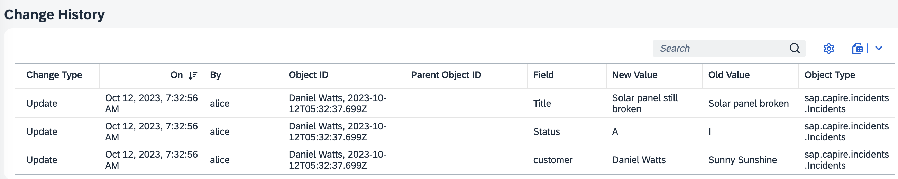
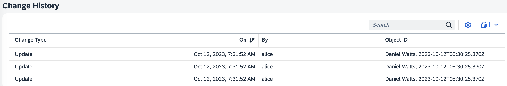

# Change Tracking

The [`@cap-js/change-tracking`](https://www.npmjs.com/package/@cap-js/change-tracking) plugin provides out-of-the box support for automatic capturing, storing, and viewing of the change records of modeled entities.

:::warning

_The following is mainly written from a Node.js perspective._ <!--For Java's perspective, please see [Java - Change Tracking](../../java/change-tracking).-->

:::

[[toc]]


In this guide, we use the [Incidents Management reference sample app](https://github.com/cap-js/incidents-app) as the base to add change tracking to.

To start with change tracking, we first need to identify the entities and elements that should be change tracked.

## Annotate Change Records

Following the best practice of separation of concerns, we annotate our domain model in a separate file _srv/change-tracking.cds_, which we add to our project with the following content:

::: code-group

```cds [srv/change-tracking.cds]
using { ProcessorService as srv } from '@capire/incidents';

annotate srv.Incidents with @changelog: [customer.name, createdAt] {
  customer @changelog: [ customer.name ];
  title  @changelog;
  status @changelog;
}

annotate srv.Conversations with @changelog.keys: [author, timestamp] {
  message  @changelog;
}
```

:::

Entities and elements are annotated with `@changelog`.

The underlying structure of how the Change Tracking data model is stored is as follows:

The main entity `ChangeLog` contains the `changes` property, which is a `Composition of many Changes`. These changes contain all the detailed information on the changes performed in a draft event and are stored in `Changes`.

The view `ChangeView` provides a summary of all of detailed change records. Here, the `Object ID` and `Parent Object ID` are meaningful and human-readable string patterns which we have annotated above when setting the identifiers. Note, that by implementing Object ID and parent Object ID, change history could be displayed in hierarchy.

## Adding the Plugin { #setup }

To enable change tracking, simply add the  [`@cap-js/change-tracking`](https://www.npmjs.com/package/@cap-js/change-tracking) plugin package to your project like so:

```sh
npm add @cap-js/change-tracking
```

## Test-drive Locally

With the steps above, we have successfully set up change tracking for our reference application. Let's see that in action…

1. **Start the server** as usual:

  ```sh
  cds watch
  ```

  You should see the following in your console output, indicating the change tracking is now active:

  ```log
  [cds] - loaded model from 6 file(s):

    @cap-js/change-tracking/index.cds // [!code focus]
    app/services.cds
    app/incidents/annotations.cds
    srv/processors-service.cds
    db/schema.cds
    node_modules/@sap/cds/common.cds
  ```

  Any change you make on the records which you have change-tracked will now be persisted in a database table `sap.changelog.ChangeLog`.
  For convenience, a Fiori view is also available as described in the next section.

## Fiori facet for Change History

If you have a Fiori Element application, you wil see that the CDS plugin automatically generates and appends a facet `sap.changelog.ChangeView` to the Object Page of your change-tracked entity. In the UI, this provides you with the *Change History* table which helps you to view and search the stored change records of your modeled entities.



### Configuring the facet

The Fiori facet from above can be easily configured and adjusted to your own needs my simply changing or extending it in your service. For example, let's assume we only want to show the first 4 columns in equal spacing, we would annotate as follows:

```cds
annotate sap.changelog.ChangeView with @(
    UI.LineItem : [
      { Value: modification, @HTML5.CssDefaults: {width:'25%'}},
      { Value: createdAt, @HTML5.CssDefaults: {width:'25%'}},
      { Value: createdBy, @HTML5.CssDefaults: {width:'25%'}},
      { Value: objectID, @HTML5.CssDefaults: {width:'25%'}}
  ]
);
```
In the UI, the *Change History* table now looks as desired:



For more information and examples on adding Fiori Annotations, see [Adding SAP Fiori Annotations](http://localhost:5173/docs/advanced/fiori#fiori-annotations).
