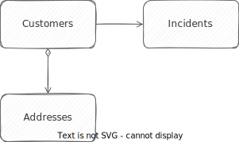
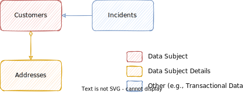

<style>
    .annotation::before { content: '@PersonalData '; color: grey; }
    .annotation { font-style: italic; }
</style>


# Annotating Personal Data

In order to automate audit logging, personal data management, and data retention management as much as possible, the first and frequently only task to do as an application developer is to identify entities and elements (potentially) holding personal data using `@PersonalData` annotations.

[[toc]]


## Reference App Sample { #annotated-model }

In the remainder of this guide, we use the [Incidents Management reference sample app](https://github.com/cap-js/incidents-app) as the base to add data privacy and audit logging to.



So, let's annotate the data model to identify personal data.
In essence, in all our entities we search for elements which carry personal data, such as person names, birth dates, etc., and tag them accordingly.
All found entities are classified as either *Data Subjects*, *Subject Details* or *Related Data Objects*.

Following the [best practice of separation of concerns](../domain-modeling#separation-of-concerns), we annotate our domain model in a separate file *srv/data-privacy.cds*, which we add to our project and fill it with the following content:

::: code-group

```cds [srv/data-privacy.cds]
using { sap.capire.incidents as my } from '../db/extensions';

annotate my.Customers with @PersonalData : {
  DataSubjectRole : 'Customer',
  EntitySemantics : 'DataSubject'
} {
  ID           @PersonalData.FieldSemantics: 'DataSubjectID';
  firstName    @PersonalData.IsPotentiallyPersonal;
  lastName     @PersonalData.IsPotentiallyPersonal;
  email        @PersonalData.IsPotentiallyPersonal;
  phone        @PersonalData.IsPotentiallyPersonal;
  creditCardNo @PersonalData.IsPotentiallySensitive;
};

annotate my.Addresses with @PersonalData: {
  EntitySemantics : 'DataSubjectDetails'
} {
  customer      @PersonalData.FieldSemantics: 'DataSubjectID';
  city          @PersonalData.IsPotentiallyPersonal;
  postCode      @PersonalData.IsPotentiallyPersonal;
  streetAddress @PersonalData.IsPotentiallyPersonal;
};

annotate my.Incidents with @PersonalData : {
  EntitySemantics : 'Other'
} {
  customer @PersonalData.FieldSemantics: 'DataSubjectID';
};
```

:::


## @PersonalData...

Let's break down the annotations to identify personal data, shown in the sample above. These annotations fall into three categories:

- **Entity-level annotations** signify relevant entities as *Data Subjects*, *Data Subject Details*, or *Related Data Objects* in data privacy terms, as depicted in the graphic below.
- **Key-level annotations** signify object primary keys, as well as references to data subjects (which have to be present on each object).
- **Field-level annotations** identify elements containing personal data.

Learn more about these annotations in the [@PersonalData OData vocabulary](https://github.com/SAP/odata-vocabularies/blob/main/vocabularies/PersonalData.md). {.learn-more}

### .EntitySemantics {.annotation}

The entity-level annotation `@PersonalData.EntitySemantics` signifies relevant entities as *Data Subject*, *Data Subject Details*, or *Other* in data privacy terms, as depicted in the following graphic.



The following table provides some further details.

Annotation            | Description
--------------------- | -------------
`DataSubject`         | The entities of this set describe a data subject (an identified or identifiable natural person), for example, Customer or Vendor.
`DataSubjectDetails`  | The entities of this set contain details of a data subject (an identified or identifiable natural person) but do not by themselves identify/describe a data subject, for example, Addresses.
`Other`               | Entities containing personal data or references to data subjects, but not representing data subjects or data subject details by themselves. For example, customer quote, customer order, or purchase order with involved business partners. These entities are relevant for audit logging. There are no restrictions on their structure. The properties should be annotated suitably with `FieldSemantics`.

Hence, we annotate our model as follows:

```cds
annotate db.Customers with @PersonalData: {
  EntitySemantics: 'DataSubject' // [!code focus]
};

annotate db.Addresses with @PersonalData: {
  EntitySemantics: 'DataSubjectDetails' // [!code focus]
};

annotate db.Incidents with @PersonalData: {
  EntitySemantics: 'Other' // [!code focus]
};
```


### .DataSubjectRole {.annotation}

Can be added to `@PersonalData.EntitySemantics: 'DataSubject'`. It's a user-chosen string specifying the role name to use. If omitted, the default is the entity name. Use case is similar to providing user-friendly labels for the UI, although in this case there's no i18n.

In our model, we can add the `DataSubjectRole` as follows:

```cds
annotate db.Customers with @PersonalData: {
  EntitySemantics: 'DataSubject',
  DataSubjectRole: 'Customer' // [!code focus]
};
```


### .FieldSemantics: DataSubjectID {.annotation}

Use this annotation to identify data subject's unique key, or a reference to it. References are commonly associations or foreign keys in subject details entities, or related ones, referring to a subject entity.

- Each `@PersonalData` entity needs to identify a  the `DataSubjectID` element.
- For entities with `DataSubject` semantics, this is typically the primary key.
- For entities with `DataSubjectDetails` or `Other`  semantics, this is usually an association to the data subject.

Hence, we annotate our model as follows:

```cds
annotate db.Customers with {
  ID @PersonalData.FieldSemantics: 'DataSubjectID' // [!code focus]
};

annotate db.Addresses with {
  customer @PersonalData.FieldSemantics: 'DataSubjectID' // [!code focus]
};

annotate db.Incidents with {
  customer @PersonalData.FieldSemantics: 'DataSubjectID' // [!code focus]
};
```


### .IsPotentiallyPersonal {.annotation}

`@PersonalData.IsPotentiallyPersonal` tags which fields are personal and, for example, require audit logs if modified.

```cds
annotate db.Customers with {
  firstName @PersonalData.IsPotentiallyPersonal; // [!code focus]
  lastName  @PersonalData.IsPotentiallyPersonal; // [!code focus]
  email     @PersonalData.IsPotentiallyPersonal; // [!code focus]
  phone     @PersonalData.IsPotentiallyPersonal; // [!code focus]
};
```


### .IsPotentiallySensitive {.annotation}

`@PersonalData.IsPotentiallySensitive` tags which fields are sensitive and, for example, require audit logs in case of access.

```cds
annotate db.Customers with {
  creditCardNo @PersonalData.IsPotentiallySensitive; // [!code focus]
};
```


## Next Steps...

Having annotated your data model with `@PersonalData` annotations, you can now go on to the respective tasks that leverage these annotations to automate as much as possible:

- [*Automated Audit Logging*](audit-logging)
- [*Personal Data Management*](pdm)
- [*Data Retention Management*](drm)
