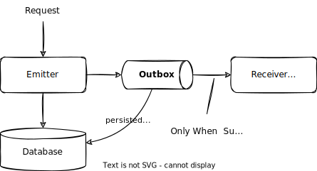

# Audit Logging

<div v-html="$frontmatter?.synopsis" />

_The following is mainly written from a Node.js perspective. For Java's perspective, please see [Java - Audit Logging](../../java/auditlog)._


## Introduction

CAP provides means for writing [custom audit logs](#custom-audit-logging) using the programmatic APIs, as well as out-of-the-box support for [automatic audit logging](#generic-audit-logging) of selected events.
By default, all audit logs - whether custom or automatic - are written to the [transactional outbox](#transactional-outbox). This ensures the audit logs are (eventually) stored without having to wait for an acknowledgement by the store itself.


### Out-of-the-box Features

Currently, CAP provides audit logging out of the box for the following events:

- Changes to *personal* data — enabled by default
- Reads of *sensitive* data — __disabled by default__

> See [Setup & Configuration - Behind the Scenes](#setup) for details regarding configuration options.

More events are on the roadmap, to be supported out of the box.


### How-to in a Nutshell

In essence, the steps to use Audit Logging in CAP are:

1. [Add `@PersonalData` annotations](annotations) to your domain models.
1. [Enable audit logging](#setup) via plugin.
1. [Test-drive locally](#generic-audit-logging) → `cds watch` w/ audit logs in console.
1. [Using SAP Audit Log Service](#sap-audit-log-service) for production.


## Setup & Configuration { #setup }

The audit logging functionality was externalized to the open source CDS Plugin Package [`@cap-js/audit-logging`](https://www.npmjs.com/package/@cap-js/audit-logging).

[CDS Plugin Packages](../../node.js/cds-plugins) are self-containing extensions. They include not only the relevant code but also bring their own default configuration. To use audit logging in your CAP application, you only need to run:

```sh
npm add @cap-js/audit-logging
```

::: details Behind the Scenes…

Next to bringing the respective code, the plugin does the following:

1. Sets `cds.requires.audit-log: true` in `cds.env`, equivalent to:
    ```json
    {"cds":{
      "requires": {
        "audit-log": true
      }
    }}
    ```

2. Which in turn activates the `audit-log` configuration **presets**:
    ```jsonc
    {
       "audit-log": {
         "handle": ["WRITE"],
         "[development]": {
           "impl": "@cap-js/audit-logging/srv/audit-log-to-console",
           "outbox": false
         },
         "[production]": {
           "impl": "@cap-js/audit-logging/srv/audit-log-to-restv2",
           "outbox": true
         }
       }
    }
    ```

**The individual configuration options are:**

- `impl` — the service implementation to use
- `outbox` — whether to use transactional outbox or not
- `handle` — which events (`READ` and/or `WRITE`) to intercept and generate log messages from

**The preset uses profile-specific configurations** for development and production. Use the `cds env` command to find out the effective configuration for your current environment:

::: code-group
```sh [w/o profile]
cds env requires.audit-log
```

```sh [production profile]
cds env requires.audit-log --profile production
```
:::


<!--
<span id="in-setup-and-config" />
-->


## Generic Audit Logging { #generic-audit-logging }

The [@PersonalData annotations](annotations) are all we need to automatically log personal data-related events. Let's see that in action…

1. **Start the server** as usual:

    ```sh
    cds watch
    ```

2. **Send an update** request that changes personal data:

    ```http
    PATCH http://localhost:4004/admin/Customers(8e2f2640-6866-4dcf-8f4d-3027aa831cad) HTTP/1.1
    Authorization: Basic alice:in-wonderland
    Content-Type: application/json

    {
      "firstName": "Johnny",
      "lastName": "Doey"
    }
    ```

3. **See the audit logs** in the server's console output:

    ```js
    {
      data_subject: {
        type: 'AdminService.Customers',
        id: { ID: '8e2f2640-6866-4dcf-8f4d-3027aa831cad' },
        role: 'Customer',
      },
      object: {
       type: 'AdminService.Customers',
       id: { ID: '8e2f2640-6866-4dcf-8f4d-3027aa831cad' }
      },
      attributes: [
        { name: 'firstName', old: 'John', new: 'Johnny' },
        { name: 'lastName', old: 'Doe', new: 'Doey' }
      ],
      user: 'alice',
      tenant: 't1',
      uuid: '1391A703E2CBE52E817269EC7527368C',
      time: '2023-02-26T08:13:48.287Z'
    }
    ```


**Behind the scenes** the generic audit logging implementation does the following:

- Intercept all write operations potentially involving personal data.
- Intercept all read operations potentially involving sensitive data.
    - If configured, cf. `handle`
- Determine the affected fields containing personal data, if any.
- Construct log messages, and send them to the connected audit log service.
- All emitted log messages are sent through the [transactional outbox](#transactional-outbox).
- Apply resiliency mechanisms like retry with exponential backoff, and more.


## Using SAP Audit Log Service { #sap-audit-log-service }

Here is a brief description of the necessary steps for using SAP Audit Log Service on SAP BTP.
A more comprehensive guide, incl. tutorials, is currently under development.

### Setup Instance and Deploy App

<span id="audit-logging-in-saas" />

For deployment in general, please follow the [deployment guide](../deployment/). Check the rest of this guide before actually triggering the deployment (i.e., executing `cf deploy`).

Here is what you need to do additionally,  to integrate with SAP Audit Log Service:

1. In your space, create a service instance of the _SAP Audit Log Service_ (`auditlog`) service with plan `premium`.
2. Add the service instance as _existing resource_ to your `mta.yml` and bind it to your application in its _requires_ section. Existing resources are defined like this:
      ```yml
      resources:
      - name: my-auditlog-service
        type: org.cloudfoundry.existing-service
      ```


### Accessing Audit Logs

There are two options to access audit logs:

1. Create an instance of service `auditlog-management` to retrieve audit logs via REST API, see [Audit Log Retrieval API Usage for the Cloud Foundry Environment](https://help.sap.com/docs/btp/sap-business-technology-platform/audit-log-retrieval-api-usage-for-subaccounts-in-cloud-foundry-environment?locale=en-US).
2. Use the SAP Audit Log Viewer, see [Audit Log Viewer for the Cloud Foundry Environment](https://help.sap.com/docs/btp/sap-business-technology-platform/audit-log-viewer-for-cloud-foundry-environment).


## Transactional Outbox { #transactional-outbox }

By default, all log messages are sent through a transactional outbox. This means, when sent, log messages are first stored in a local outbox table, which acts like a queue for outbound messages. Only when requests are fully and successfully processed, these messages are forwarded to the audit log service.



This provides an ultimate level of resiliency, plus additional benefits:

- **Audit log messages are guaranteed to be delivered** &mdash; even if the audit log service should be down for a longer time period.

- **Asynchronous delivery of log messages** &mdash; the main thread doesn't wait for requests being sent and successfully processed by the audit log service.

- **False log messages are avoided** &mdash;  messages are forwarded to the audit log service on successfully committed requests; and skipped in case of rollbacks.


## Custom Audit Logging { #custom-audit-logging }

In addition to the generic audit logging provided out of the box, applications can also log custom events with custom data using the programmatic API.

Connecting to the service:

```js
const audit = await cds.connect.to('audit-log')
```

Sending log messages:

```js
await audit.log('Foo', { bar: 'baz' })
```

::: tip Audit Logging as Just Another CAP Service
The Audit Log Service API is implemented as a CAP service, with the service API defined in CDS as shown in the next section. In effect, the common patterns of [*CAP Service Consumption*](../using-services) apply, as well as all the usual benefits like *mocking*, *late-cut µ services*, *resilience* and *extensibility*.
:::


### Service Definition

Below is the complete reference modeling as contained in `@cap-js/audit-logging`. The individual operations and events are briefly discussed in the following sections.

The service definition declares the generic `log` operation, which is used for all kinds of events, as well as the common type `LogEntry`, which declares the common fields of all log messages. These fields are filled in automatically by the base service and any values provided by the caller are ignored.

Further, the service has pre-defined event payloads for the four event types:
1. _Log read access to sensitive personal data_
1. _Log changes to personal data_
1. _Security event log_
1. _Configuration change log_

These payloads are based on [SAP Audit Log Service's REST API](https://help.sap.com/docs/btp/sap-business-technology-platform/audit-log-write-api-for-customers?locale=en-US), which maximizes performance by omitting any intermediate data structures.

```cds
namespace sap.auditlog;

service AuditLogService {

  action log(event : String, data : LogEntry);

  event SensitiveDataRead : LogEntry {
    data_subject : DataSubject;
    object       : DataObject;
    attributes   : many {
      name       : String;
    };
    attachments  : many {
      id         : String;
      name       : String;
    };
    channel      : String;
  };

  event PersonalDataModified : LogEntry {
    data_subject :      DataSubject;
    object       :      DataObject;
    attributes   : many Modification;
    success      :      Boolean default true;
  };

  event ConfigurationModified : LogEntry {
    object     :      DataObject;
    attributes : many Modification;
  };

  event SecurityEvent : LogEntry {
    data : {};
    ip   : String;
  };

}

/** Common fields, filled in automatically */
type LogEntry {
  uuid   : UUID;
  tenant : String;
  user   : String;
  time   : Timestamp;
}

type DataObject {
  type : String;
  id   : {};
}

type DataSubject : DataObject {
  role : String;
}

type Modification {
  name : String;
  old  : String;
  new  : String;
}
```

<!--

### log vs. logSync

```js
await audit.logSync('SomeOtherEvent', {
  some_other_details: 'whatever else'
})
```

The difference between `log` and `logSync` is that `logSync` circumvents the [transactional outbox](#transactional-outbox) and, hence, resolves once writing to the audit log store was successful. In production, for example, that would mean that the audit log was acknowledged by the SAP Audit Log Service. However, it also means that the benefits of the transactional outbox, such as resilience, are skipped.

If configuration `outbox` is set to `false`, the two operations behave identical, namely `log` bahaves like `logSync`. For this reason (and better error handling), you should always `await` calling `log` as well.

-->


### Sensitive Data Read

```cds
event SensitiveDataRead : LogEntry {
  data_subject : DataSubject;
  object       : DataObject;
  attributes   : many {
    name       : String;
  };
  attachments  : many {
    id         : String;
    name       : String;
  };
  channel      : String;
}

type DataObject {
  type : String;
  id   : {};
}

type DataSubject : DataObject {
  role : String;
}
```

Send `SensitiveDataRead` event log messages like that:

```js
await audit.log ('SensitiveDataRead', {
  data_subject: {
    type: 'sap.capire.bookshop.Customers',
    id: { ID: '1923bd11-b1d6-47b6-a91b-732e755fa976' },
    role: 'Customer',
  },
  object: {
    type: 'sap.capire.bookshop.BillingData',
    id: { ID: '399a2704-3d2d-4fa1-9e7d-a4e45c67749b' }
  },
  attributes: [
    { name: 'creditCardNo' }
  ]
})
```


### Personal Data Modified

```cds
event PersonalDataModified : LogEntry {
  data_subject :      DataSubject;
  object       :      DataObject;
  attributes   : many Modification;
  success      :      Boolean default true;
}

type Modification {
  name : String;
  old  : String;
  new  : String;
}
```

Send `PersonalDataModified` event log messages like that:

```js
await audit.log ('PersonalDataModified', {
  data_subject: {
    type: 'sap.capire.bookshop.Customers',
    id: { ID: '1923bd11-b1d6-47b6-a91b-732e755fa976' },
    role: 'Customer',
  },
  object: {
    type: 'sap.capire.bookshop.Customers',
    id: { ID: '1923bd11-b1d6-47b6-a91b-732e755fa976' }
  },
  attributes: [
    { name: 'emailAddress', old: 'foo@example.com', new: 'bar@example.com' }
  ]
})
```


### Configuration Modified

```cds
event ConfigurationModified : LogEntry {
  object     :      DataObject;
  attributes : many Modification;
}
```

Send `ConfigurationModified` event log messages like that:

```js
await audit.log ('ConfigurationModified', {
  object: {
    type: 'sap.common.Currencies',
    id: { ID: 'f79ba248-c348-4962-9fef-680c3b88807c' }
  },
  attributes: [
    { name: 'symbol', old: 'EUR', new: '€' }
  ]
})
```


### Security Events

```cds
event SecurityEvent : LogEntry {
  data : {};
  ip   : String;
}
```

Send `SecurityEvent` log messages like that:

```js
await audit.log ('SecurityEvent', {
  data: {
    user: 'alice',
    action: 'Attempt to access restricted service "PDMService" with insufficient authority'
  },
  ip: '127.0.0.1'
})
```

> In the SAP Audit Log Service REST API, `data` is a String. For ease of use, the default implementation stringifies `data`, if it is provided as an object. [Custom implementations](#custom-implementation) should also handle both.


## Custom Implementation { #custom-implementation }

In addition, everybody could provide new implementations in the same way as we implement the mock variant:

```js
const { AuditLogService } = require('@cap-js/audit-logging')

class MyAuditLogService extends AuditLogService {
  async init() {
    this.on('*', function (req) {
      const { event, data } = req

      console.log(`[my-audit-log] - ${event}:`, data)
    })

    // call AuditLogService's init
    await super.init()
  }
}

module.exports = MyAuditLogService
```

As always, custom implementations need to be configured:

```json
{
  "cds": {
    "requires": {
      "audit-log": {
        "impl": "lib/MyAuditLogService.js"
      }
    }
  }
}
```
