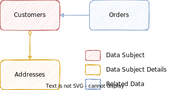

<!--- Migrated: @external/guides/67-Data-Privacy/66-Data-Privacy/index.md -> @external/guides/data-privacy-new/index.md -->

# Data Privacy & Audit Logging {:.impl.beta}

::: danger
**❗️ Concept Only ❗️**
This guide currently is just a capire-style concept of the next evolution of CAP's
support for data privacy compliance & audit logging.
Please refer to the former [Data Privacy guide](../index) for what's currently implemented.
:::
<br>

<!---  -->
<!---  -->


## Introduction & Overview

Compliance to data privacy regulations is an important requirement for all busines applications nowadays. CAP provides easy ways to designate personal data, as well as out-of-the-box integration with SAP BTP services, like  SAP Audit Log Service, or  SAP Personal Data Manager service. This greatly relieves application developers these tedious tasks and related efforts.


### Related SAP Product Standards {: .impl.internal}

Within SAP the following product standards apply:

* [**SEC-255**: Provide a retrieval function, which can be used to inform the data subjects about the personal data stored about them](https://wiki.one.int.sap/wiki/x/mwzGNQ).
* [**SEC-265**: Log changes to personal data](https://wiki.one.int.sap/wiki/x/nICvTw)
* [**SEC-254**: Log read access to sensitive personal data](https://wiki.one.int.sap/wiki/x/tqHgMg).
* [**SEC-256**: Erase personal data when retention periods have expired](https://wiki.one.int.sap/wiki/x/8gnqMg).
* [**SEC-224**: Capture explicit consent before collecting personal data](https://wiki.one.int.sap/wiki/x/6o4bNg).


### Addressed Requirements

The most essential requests you have to answer are those in the table below, with the job to be done in response to that given on the right-hand side:

| Question / Request                         | Discipline                                               |
| ------------------------------------------ | -------------------------------------------------------- |
| *When was personal data stored/changed?*   | → [Audit Logging](#audit-logging)                        |
| *What data about me do you have stored?*   | → [Personal Data Management](#sap-personal-data-manager) |
| *Please delete all personal data about me!* | → [Retention Management](#sap-data-retention-manager)    |

<br>
::: danger
**PLEASE NOTE:** Full compliance is more than that! <br>
While CAP and SAP BTP services greatly facilitate fulfilling the obligations related to data privacy, there are usually numerous **additional regulations** you have comply to, such as from industry-specific legislation in different countries.
:::


### Sample Application

In the remainder of this guide, we'll use this domain model as the base to add data privacy and audit logging.

db/schema.cds
{:.sample-label}

```cds
using { Country, managed, cuid } from '@sap/cds/common';
namespace sap.capire.bookshop;

entity Customers : cuid, managed {
  emailAddress  : String;
  firstName     : String;
  lastName      : String;
  creditCardNo  : String;
  dateOfBirth   : Date;
  addresses : Composition of Addresses on addresses.customer = $self;
}

entity Addresses : cuid, managed {
  customer       : Association to Customers;
  street         : String(128);
  town           : String(128);
  country        : Country;
  someOtherField : String(128);
}

entity Orders : cuid, managed {
  orderNo      : String(111); // human-readable key
  customer     : Association to Customers;
  personalNote : String;
  dateOfOrder  : Date;
  Items        : Composition of many { ... }
}
```


## Annotating Personal Data {:#annotations .impl.concept}

Let's annotate our data model to identify personal data. In essence, in all our entities we search for elements which carry personal data, such as person names, birth dates, etc., and tag them accordingly. All found entities are classified as either *Data Subjects*, *Subject Details*  or *Related Data Objects*.



Following the [best practice of separation of concerns](../../domain-models/#separation-of-concerns), we do that in a separate file `db/data-privacy.cds`:


db/data-privacy.cds
{:.sample-label}

```cds
annotate Customers with @PersonalData.kind: #Subject {
  ID            @PersonalData: #SubjectID; //> primary key of subject
  emailAddress  @PersonalData;
  firstName     @PersonalData;
  lastName      @PersonalData;
  creditCardNo  @PersonalData: #Sensitive;
  dateOfBirth   @PersonalData;
}
```

```cds
annotate Addresses with @PersonalData.kind: #Details {
  customer      @PersonalData: #SubjectID; //> reference to subject
  street        @PersonalData;
  town          @PersonalData;
  country       @PersonalData;
}
```

```cds
annotate Orders with @PersonalData.kind: #Related {
  customer      @PersonalData: #SubjectID; //> reference to subject
  orderNo       @PersonalData: #ID;
  personalNote  @PersonalData;
}
```


- The **entity-level annotations** signify relevant entities as *Data Subjects*, *Data Subject Details*, or *Related Data Objects* in data privacy terms, as depicted in the graphic below.

- The **key-level annotations** signify object primary keys, as well as references to data subjects (which have to be present on each object).

- The **field-level annotations** identify elements containing personal data.

### `@PersonalData.kind: #Subject`

Tags an entity as a personal data *subject*. Essentially, this is data about a natural person, e.g. customer, vendor, employee.
{:.indent}

### `@PersonalData.kind: #Details`

Tags an entity to be a contained-in details entity of a subject. Usually this applies to target entities of compositions like `Customer:addresses`.
{:.indent}

### `@PersonalData.kind: #Related`

Tags an entity containing personal data as being *related* to subjects. This can be transactional data entities with elements containing personal data.
{:.indent}

### `@PersonalData.role: <String>`

User-chosen string designing the role name to use. Default is the entity name. For example, the above annotation could be enhanced like that:
{:.indent}

```cds
annotate Customers with @PersonalData: {
  kind: #Subject,
  role: 'Customer'
}; ...
```
{:.indent}


### `@PersonalData: #SubjectID` {:#SubjectID}

A data subject's unique key, or a reference to it. References are commonly associations or foreign keys in subject details entities, or related ones, referring to a subject entity.
{:.indent}

### `@PersonalData: #ID`

The unique key for a related object. These are commonly contract numbers users can relate to, like a human-readable order number. Yet, in case of question, it can also be a technical primary key.
{:.indent}

### `@PersonalData`

Identifies fields to (potentially) contain personal data. For example, this will be used to audit-log all write access operations (create, update, delete) affecting such elements in data subjects, data subject details, or related data objects.
{:.indent}

### `@PersonalData: #Sensitive`

Identifies fields to (potentially) contain sensitive data. For example, this will be used to audit-log all read access operations including such elements in data subjects, data subject details, or related data objects.
{:.indent}

::: warning _Warning_ <!--  -->
Read access logs for sensitive data happen for each and every _Read_ access. --- Only use this annotation in [relevant cases](https://ec.europa.eu/info/law/law-topic/data-protection/reform/rules-business-and-organisations/legal-grounds-processing-data/sensitive-data/what-personal-data-considered-sensitive_en).
--- Try to avoid reading sensitive data at all, for example, by obscuring credit card numbers as `**** **** **** 1234`.
:::


### Behind the Scenes: Official Vocabulary

The `@PersonalData` vocabulary introduced above is a simplified variant of the corresponding [SAP OData Vocabulary for Personal Data](https://sap.github.io/odata-vocabularies/vocabularies/PersonalData.html). When compiling models, the simplified annotations will be translated to the official ones. For example, the outcoume for the annotations of the `Customers` wntity would be like this:

```cds
annotate Customers with @PersonalData : {
  EntitySemantics: 'DataSubject',
  DataSubjectRole: 'Customer',
} {
  ID            @PersonalData.FieldSemantics: 'DataSubjectID';
  emailAddress  @PersonalData.IsPotentiallyPersonal;
  firstName     @PersonalData.IsPotentiallyPersonal;
  lastName      @PersonalData.IsPotentiallyPersonal;
  creditCardNo  @PersonalData.IsPotentiallySensitive;
  dateOfBirth   @PersonalData.IsPotentiallyPersonal;
}
```


## Audit Logging {:.impl.concept}

CAP provides out-of-the-box support for automatic audit logging of these events:

- Changes to *personal* data  — enabled by default
- Reads of *sensitive* data — disabled by default

In essence, the steps to use that are:

1. [Add `@PersonalData` Annotations](#annotations) to your domain models → as shown before.
1. [Enable audit-logging](#enable-audit-logging) → `cds add audit-logging`
1. [Test-drive locally](#generic-audit-logging) → `cds watch` w/ audit logs in console
1. [Using SAP Audit Log Service](#sap-audit-log-service) for production

In addition, custom audit logs can be recorded using the programmatic APIs.

### Setup & Configuration {:#enable-audit-logging }

Run this to enable audit logging:

```sh
cds add audit-logging
```

#### Behind the Scenes...

This CLI command is a convenient shortcut for...

1. Installing the `@sap/cds-audit-logging` package:
   ```js
   npm add @sap/cds-audit-logging
   ```

2. Enabling `cds.requires.audit-log` in *package.json*:
   ```json
   {"cds":{
     "requires": {
       "audit-log": true
     }
   }}
   ```

3. Which in turn activates the `audit-log` configuration **preset**:
   ```jsonc
   {
      "audit-log": {
        "[development]": {
          "impl": "@sap/cds/srv/audit-log/to-console"
        },
        "[production]": {
          "impl": "@sap/cds/srv/audit-log/to-sap-audit-log-srv-v2",
        },
        "handle": [ "CREATE", "UPDATE" ],
        "outbox": true
      }
   }
   ```

**The individual config options are:**

- `impl` — the service implementation to use
- `outbox` — whether to use transactional outbox or not
- `handle` — which events to intercept and generate log messages from

::: warning **Read Access Logs are disabled by default!** <!--  -->
This is because, they'd create a lot of overhead and load to the audit log. Instead **always try to avoid reading sensitive data** at all, for example, by excluding credit card numbers from common APIs, or obscuring them as `**** **** **** 1234`.
:::

**The preset uses profile-specific configs** for development and production. Use the `cds env` command to find out the effective configuration for your current environment:

```sh
cds env requires.audit-log
```

```sh
cds env requires.audit-log --profile production
```


### Generic Audit Logging

[The annotations above](#annotations) is all we need to automatically log personal data-related events. Let's see that in action...

1. **Start the server** as usual:

   ```sh
   cds watch
   ```

2. **Send an udate** request, changing personal data

   ```http
   PATCH http://localhost:4004/admin/Customers(8e2f2640-6866-4dcf-8f4d-3027aa831cad) HTTP/1.1
   Authorization: Basic alice:in-wonderland
   Content-Type: application/json

   {
     "firstName": "Johnny",
     "dateOfBirth": "2002-03-09"
   }

   ```


4. **See the audit logs** in the server's console output:

   ```js
   {
     object: { type: 'AdminService.Customers', id: { ID: '8e2f2640-6866-4dcf-8f4d-3027aa831cad' } },
     attributes: [
       { name: 'firstName', old: 'John', new: 'Johnny' },
       { name: 'dateOfBirth', old: '1970-01-01', new: '2002-03-09' }
     ],
     data_subject: {
       id: { ID: '8e2f2640-6866-4dcf-8f4d-3027aa831cad' },
       role: 'Customer',
       type: 'AdminService.Customers'
     },
     user: 'alice',
     tenant: 't1',
     uuid: '1391A703E2CBE52E817269EC7527368C',
     time: '2023-02-26T08:13:48.287Z'
   }
   ```


**Behind the scenes** the generic audit logging implementation automatically cares for:

- Intercepting all read operations potentially involving sensitive data and
- Intercepting all write operations potentially involving personal data
- Determining the affected fields containing personal data, if any
- Constructing log messages, and sending them to the connected log service
- All emitted log messages are sent through [transactional outbox](#transactional-outbox)
- Applying resiliency mechanisms like retry with exponential backof, etc.


### Transactional Outbox

By default all log messages are sent through a transactional outbox. This means, when sent, log messages are first stored in a local outbox table, which acts like a queue for outbound messages. Only when requests are fully and successfully processed, will these messages be forwarded to the audit log service.


This provides an ultimate level of resiliency, plus additional benefits:

- **Audit log messages are guaranteed to be delivered** &mdash; even if the audit log service should be down for a longer time period.

- **Asynchronous delivery of log messages** &mdash; the main thread doesn't wait for requests being sent and successfully processed by the audit log service.

- **False log messages are avoided** &mdash;  messages are forwarded to the audit log service on successfully committed requests; and skipped in case of rollbacks.


### Programmatic API

In addition to the generic audit logging provided out of the box, applications can also log custom events with custom data using the programmatic API.

Connecting to the service:

```js
const audit = await cds.connect.to('audit-log')
```

Sending log messages:

```js
await audit.log ('SomeEvent', { ... })
```

<br>


::: tip
The Audit Log Service API is implemented as a CAP service, with the service API defined in CDS as shown below. In effect, the common patterns of [*CAP Service Consumption*](../../using-services/) apply, as well as all the usual benefits like *mocking*, *late-cut µ services*, *resilience* and *extensibility*.
:::

#### Basic Service API

The basic service definition declares the generic `log` operation used for all kinds of events, along with type `LogMessage` declares the common fields of all log messages — these fields are filled in automatically if not provided by the caller.

```cds
service AuditLogService {

  action log (event: String, data: LogMessage);

  /** Common fields, filled in automatically if missing */
  entity LogMessage {
    uuid: UUID;
    tenant: String;
    user: String;
    time: String;
  }

}
```

Usage is like that:

```js
await audit.log ('SomeEvent', {
  some_details: 'whatever'
})
```

#### Personal Data-related Events

In addition, pre-defined event payloads for personal data-related events are declared:

```cds
service AuditLogService {
  // ... as above

  type DataSubject : DataObject { role: String }
  type DataObject  : { type: String; id: {} }

  event SensitiveDataRead : LogMessage {
    data_subjects : many DataSubject;
    data_subject  : DataSubject;
    object        : DataObject;
    channel       : String;
    attributes    : many { name: String };
    attachments   : many { name: String; id: String };
  }

  event PersonalDataChanged : LogMessage {
    data_subject  : DataSubject;
    object        : DataObject;
    attributes    : ChangedAttributes;
  }

  type ChangedAttributes : many {
    name: String;
    old: String;
    new: String
  }
}
```

Send corresponding log messages complying to these definitions like that:

```js
await audit.log ('SensitiveDataRead', {
  data_subject: {
    type: 'sap.capire.bookshop.Customers',
    id: { ID: '1923bd11-b1d6-47b6-a91b-732e755fa976' },
    role: 'Customer',
  },
  attributes: [
    { name: 'firstName' },
    { name: 'lastName' },
    { name: 'dateOfBirth' },
  ]
})
```


#### Config Change Events

```cds
service AuditLogService {
  // ... as above
  event ConfigChange : LogMessage {
    object        : DataObject;
    attributes    : ChangedAttributes;
  }
}
```


#### Security Events

```cds
service AuditLogService {
  // ... as above
  event FailedLogin : LogMessage {
    action : String;
    data   : String;
  }
}
```


### Service Providers

In addition, everybody could provide new implementations in the same way as we implement the mock variant:

```js
const cds = require('@sap/cds')

class ConsoleAuditLogService extends cds.Service {
  log (event, data) {
    console.log (event, data)
  }
}

module.exports = ConsoleAuditLogService
```


## Personal Data Mgmt {:#sap-personal-data-manager}

SAP BTP provides the [*SAP Personal Data Manager (PDM)*](https://help.sap.com/docs/PERSONAL_DATA_MANAGER) which allows administrators to respond to question "What data of me do you have?". To answer this question, the PDM service needs to fetch read all personal data via a respective OData endpoint, to be provided by the app as follows.

### Add OData Endpoint for PDM

With CAP it is very easy to provide endpoints as required by SAP Personal Data Manager, using standard service definitions and projections in CDS, no additional implementation is required.

For the [our sample](#sample-application) we would add this service definition in file *srv/pdm-service.cds*:

srv/pdm-service.cds
{:.sample-label}
```cds
using { sap.capire.bookshop as my } from '../db/schema';
service PDMService {
  entity Customers as projection on my.Customers;
  entity Addresses as projection on my.Addresses;
  entity Orders as projection on my.Orders;
};
```

Personal Data Manager can consume flat entities only.
So the following rules apply:

- All entities containing personal data, i.e. [*Data Subjects*, *Data Subject Details*, and *Related Data Objects*](#annotations), have to be exposed top-level
- All details or related entities have a [one-stop reference to the data subject](#SubjectID) entity → indicated by `@PersonalData: #SubjectID` annotations.
- All elements in exposed entities are of scalar type.
::: tip
**Note:** Data Privacy annotations the exposed entities are derived from the domain model entity definitions as shown in section [*Personal Data Annotations*](#annotations).  :::


### Annotating Search Fields

The most important search fields of the data subject, i.e. `Customers` in our case, have to be identified using `@Communication.Contact` annotations. To perform a valid search SAP Personal Data Manager needs _Surname_, _Given Name_, and _Birthday_.

srv/pdm-service.cds
{:.sample-label}
```cds
service PDMService { // as above /*...*/

  annotate Customers with @Communication.Contact: {
    n: { surname: lastName, given: firstName },
    bday : dateOfBirth
  }
};
```

[Learn more about this anotation in the **Communication Vocabulary**](https://github.com/SAP/odata-vocabularies/blob/main/vocabularies/Communication.md){:.learn-more}


### Adding Flat Projections

As we learned above, Personal Data Manager can consume flat entities only. Now, let's assume we want to include details from nested `Orders.Items` as well as from ordered `Books` into the data visible through PDM. CAP's projection capabilities to the rescue, we can also do that quite easily by turning `Orders` into a flattened view in our service as follows:


srv/pdm-service.cds
{:.sample-label}
<!-- cds-mode: ignore -->
```cds
service PDMService { // as above ...

  @PersonalData.kind: #Related // Identify kind of data object
  entity OrderItems as projection on my.Orders {
    // Flattened view on Orders, OrderItems, and Books
    key Items.ID       as ItemID @PersonalData: #ID,
        customer.ID    as CustomerID // @PersonalData: #SubjectID,
        customer.email as CustomerEmail // @PersonalData,
        orderNo        as OrderID,
        Items.book.ID  as BookID,
        Items.quantity as Quantity
  }
};
```
::: tip
As shown above, we need to annotate such new entities and their elements in the same way as we annotated our domain model entities, as documented in section *[Personal Data Annotations](#annotations)* above. Some annotations — the commented ones — are inherited from the base entities and elements.  :::


### Restricting Access to PDM only

So far the PDM service can be used by anybody, ich is not what we want of course.So let's protect it to be only accessibly by Personal Data Manager only.

1. Annotate the service definition with `@requires`:

   ```cds
   service PDMService @(requires:'PersonalDataManager') { ... };
   ```

2. Add XSUAA-based authentication for production:
   ```sh
   cds add xsuaa --for production
   ```

3. In the generated `xs-security.json` search for `PersonalDataManager` and add the grant line to that entry like that:

   ```json
   {
     "name": "$XSAPPNAME.PersonalDataManager",
     "grant-as-authority-to-apps": [ "$XSSERVICENAME(pdm)" ]
   }
   ```

   [Learn more about security configuration and the SAP Personal Data Manager.](https://help.sap.com/docs/PERSONAL_DATA_MANAGER/620a3ea6aaf64610accdd05cca9e3de2/4ee5705b8ded43e68bde610223722971.html#loio8eb6d9f889594a2d98f478bd57412ceb){:.learn-more}


### Data Retention Mgmt... {:#sap-data-retention-manager .impl.concept }

Currently under construction...


## Deploy for Production

### Deploy your Application

... for example, as documented in the [Deploy to Cloud Foundry](../../deployment/to-cf) guide.

In essence, for a single-tenant app, run these commands in order:

```sh
cds add approuter,xsuaa,hana,mta --for production
```

```sh
mbt build -t gen --mtar mta.tar
```

```sh
cf deploy gen/mta.tar
```

For a SaaS app, change first command to:

```sh
cds add mtx,approuter,xsuaa,hana,mta --for production
```


### Bind to SAP Audit Log Service {:#sap-audit-log-service }

As shown in the configuration](#setup--configuration) section  above, CAP provides out-of-the-box support for SAP Audit Log Service as the recommended target for collecting audit logs in production.

TODO: Now I'd want us to say something like:

1. **Given** you have access to instance of SAP Audit Log Service (→ in cockpit)
2. **Bind that to our app** using `cds bind`
3. Optionally: Test-drive it in hybrid setup
4. (Re-) Deploy your app ?

>  BTW: Can we do that without having local `.json` files?

### Bind to SAP PDM Service

TODO: Similar to above, I'd like us to say something like:

1. **Given** you have access to instance of SAP Personal Data Manager (→ in cockpit)
2. **Bind that to our app** using `cds bind`
   - care for `"authorities": ["$ACCEPT_GRANTED_AUTHORITIES"]`
3. Optionally: Test-drive it in hybrid setup
4. (Re-) Deploy your app ?

> BTW: Creating and Asssigning Role Collections should be covered in their docs?


## Using the PDM Application

Open the SAP Personal Data Manager application from the _Instances and Subscriptions_ page in the SAP BTP cockpit.

{:width="500"}

In the personal data manager application you can search for data subjects with _First Name_, _Last Name_, and _Date of Birth_, or alternatively with their _ID_.

{:width="500"}
