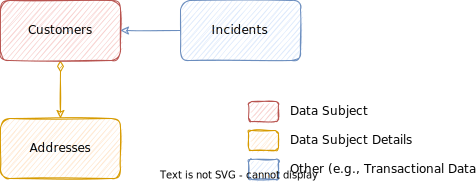

# Basics of Data Privacy in CAP

{{ $frontmatter.synopsis }}


## Introduction


Data protection is associated with numerous legal requirements and privacy concerns, such as the EU's [General Data Protection Regulation](https://en.wikipedia.org/wiki/General_Data_Protection_Regulation). In addition to compliance with general data protection and privacy acts regarding [personal data](https://en.wikipedia.org/wiki/Personal_data), you need to consider compliance with industry-specific legislation in different countries.

CAP supports applications in their obligations to comply to data privacy regulations, by automating tedious tasks as much as possible based on annotated models. That is, CAP provides easy ways to designate personal data, as well as out-of-the-box integration with SAP BTP services, which enable you to fulfill specific data privacy requirements in your application. This greatly relieves application developers these tedious tasks and related efforts.


::: warning
SAP provides specific features and functions to support compliance regarding the relevant legal requirements, including data protection. SAP does not give any advice on whether these features and functions are the best method to support company, industry, regional, or country-specific requirements. Furthermore, this information should not be taken as advice or a recommendation regarding additional features that would be required in specific IT environments. Decisions related to data protection must be made on a case-by-case basis, considering the given system landscape and the applicable legal requirements.
:::


### In a Nutshell

The most essential requests you have to answer are those in the table below, with the basis of the requirement in the middle, and the job to be done in response to that given on the right-hand side:

| Question / Request                          | Basis                                           | Discipline                          |
| ------------------------------------------- | ----------------------------------------------- | ----------------------------------- |
| *What data about me do you have stored?*    | [Right of access](#right-of-access)             | [Personal Data Management](pdm.md)  |
| *Please delete all personal data about me!* | [Right to be forgotten](#right-to-be-forgotten) | [Data Retention Management](drm.md) |
| *When was personal data stored/changed?*    | [Transparency](#transparency)                   | [Audit Logging](audit-logging.md)   |


### Right of Access { #right-of-access }

The [right of access to personal data](https://en.wikipedia.org/wiki/Right_of_access_to_personal_data) "gives people the right to access their personal data and information about how this personal data is being processed".

The [SAP Personal Data Manager](https://help.sap.com/docs/personal-data-manager?locale=en-US) allows you to inform individuals about the data you have stored regarding them.


### Right to be Forgotten { #right-to-be-forgotten }

The [right to be forgotten](https://en.wikipedia.org/wiki/Right_to_be_forgotten) gives people "the right to request erasure of personal data related to them on any one of a number of grounds [...]".

The [SAP Data Retention Manager](https://help.sap.com/docs/data-retention-manager?locale=en-US) allows you to manage retention and residence rules to block or destroy personal data.


### Transparency { #transparency }

Data privacy regulations typically include language demanding transparency regarding with whom the data stored about an individual is shared and where that came from (e.g., [EU GDPR Article 15(1)(c,g)](https://eur-lex.europa.eu/legal-content/EN/TXT/HTML/?uri=CELEX:02016R0679-20160504&qid=1692819634946#tocId22)).

The [SAP Audit Log Service](https://help.sap.com/docs/personal-data-manager?locale=en-US) stores all audit logs for a tenant in a common, compliant data store and allows auditors to search through and retrieve the respective logs when necessary.


<span id="afterTransparency" />


## Example Annotated Model { #annotated-model }

In the remainder of this guide, we'll use the [Incidents Management reference sample app](https://github.com/SAP-samples/cap-sample-incidents-mgmt) as the base to add data privacy and audit logging to.

Below is the fully annotated model. The individual annotations are briefly discussed in the following sections.

Following the [best practice of separation of concerns](../domain-modeling#separation-of-concerns), we annotated our domain model in a separate file:

```cds
using { sap.capire.incidents as db } from '@capire/incidents';

annotate db.Customers with @PersonalData : {
  DataSubjectRole : 'Customer',
  EntitySemantics : 'DataSubject'
} {
  ID           @PersonalData.FieldSemantics : 'DataSubjectID';
  firstName    @PersonalData.IsPotentiallyPersonal;
  lastName     @PersonalData.IsPotentiallyPersonal;
  email        @PersonalData.IsPotentiallyPersonal;
  phone        @PersonalData.IsPotentiallyPersonal;
  creditCardNo @PersonalData.IsPotentiallySensitive;
};

annotate db.Addresses with @PersonalData : {
  EntitySemantics : 'DataSubjectDetails'
} {
  customer @PersonalData.FieldSemantics : 'DataSubjectID';
  city          @PersonalData.IsPotentiallyPersonal;
  postCode      @PersonalData.IsPotentiallyPersonal;
  streetAddress @PersonalData.IsPotentiallyPersonal;
};

annotate db.Incidents with @PersonalData : {
  EntitySemantics : 'Other'
} {
  customer @PersonalData.FieldSemantics : 'DataSubjectID';
};
```


## @PersonalData { #indicate-privacy }

Next, let's annotate our data model to identify personal data. In essence, in all our entities we search for elements which carry personal data, such as person names, birth dates, etc., and tag them accordingly. This allows you to manage the data privacy-related actions on a fine granular level only using metadata definitions with annotations and without any need of implementation. We do so using the `@PersonalData` annotations.

::: tip
For more details on the `@PersonalData` vocabulary, see [this](https://github.com/SAP/odata-vocabularies/blob/main/vocabularies/PersonalData.md).
:::


### .EntitySemantics

The entity-level annotation `@PersonalData.EntitySemantics` signifies relevant entities as *Data Subject*, *Data Subject Details*, or *Other* in data privacy terms, as depicted in the graphic below.



The following table provides some further details.

Annotation            | Description
--------------------- | -------------
`DataSubject`         | The entities of this set describe a data subject (an identified or identifiable natural person), for example, Customer or Vendor.
`DataSubjectDetails`  | The entities of this set contain details of a data subject (an identified or identifiable natural person) but do not by themselves identify/describe a data subject, for example, Addresses.
`Other`               | Entities containing personal data or references to data subjects, but not representing data subjects or data subject details by themselves. For example, customer quote, customer order, or purchase order with involved business partners. These entities are relevant for audit logging. There are no restrictions on their structure. The properties should be annotated suitably with `FieldSemantics`.

Hence, we annotate our model as follows:

```cds
annotate db.Customers with @PersonalData: {
  EntitySemantics: 'DataSubject'
};

annotate db.Addresses with @PersonalData: {
  EntitySemantics: 'DataSubjectDetails'
};

annotate db.Incidents with @PersonalData: {
  EntitySemantics: 'Other'
};
```


### .DataSubjectRole

```cds
@PersonalData.DataSubjectRole: '<Role>'
```

Can be added to `@PersonalData.EntitySemantics: 'DataSubject'`. It is a user-chosen string specifying the role name to use. If omitted, the default is the entity name. Use case is similar to providing user-friendly labels for the UI, although in this case there is no i18n.

In our model, we can add the `DataSubjectRole` as follows:

```cds
annotate db.Customers with @PersonalData: {
  EntitySemantics: 'DataSubject',
  DataSubjectRole: 'Customer'
};
```


### .FieldSemantics

The key-level annotation `.FieldSemantics` indicates the corresponding key information.
This key information consists of the `DataSubject` (= Person) and its identifiers and the corresponding personal documents (such as Order, Consent, ...) and its identifiers.
The latter is always captured implicitly, so we mainly have to specify the type and the key of the `DataSubject`.

For each entity annotated with `@PersonalData`, we need to specify the relating data subject.
For entities with entity semantics `DataSubject`, this is typically the key property (may be multiple), although any unique scalar value is possible.
For entities with entity semantics `DataSubjectDetails` or `Other`, this is the association to the data subject.

Hence, we annotate our model as follows:

```cds
annotate db.Customers with {
  ID @PersonalData.FieldSemantics: 'DataSubjectID'
};

annotate db.Addresses with {
  customer @PersonalData.FieldSemantics: 'DataSubjectID'
};

annotate db.Incidents with {
  customer @PersonalData.FieldSemantics: 'DataSubjectID'
};
```

::: warning _❗ Data Subject and Data Object_<br>
For each specific personal data operation on a data object (like a Sales Order) a valid data subject (like a Customer) is needed.

The application has to clarify that this link between data object and data subject - which is typically induced by an annotation like `Customer @PersonalData.FieldSemantics : 'DataSubjectID'` - is never broken. Thus, semantically correct personal data operation logs can only be written on top of a semantical correctly built application.

Make sure that the data subject is a valid CAP entity, otherwise the metadata-driven automatism will not work.
:::


### .IsPotentiallyPersonal

`@PersonalData.IsPotentiallyPersonal` tags which fields are personal and, for example, require audit logs in case of modification.

```cds
annotate db.Customers with {
  firstName @PersonalData.IsPotentiallyPersonal;
  lastName  @PersonalData.IsPotentiallyPersonal;
  email     @PersonalData.IsPotentiallyPersonal;
  phone     @PersonalData.IsPotentiallyPersonal;
};
```


### .IsPotentiallySensitive

`@PersonalData.IsPotentiallySensitive` tags which fields are sensitive and, for example, require audit logs in case of access.

```cds
annotate db.Customers with {
  creditCardNo @PersonalData.IsPotentiallySensitive;
};
```

::: warning _Warning_
Please see [Audit Logging](./audit-logging.md) for implications before marking data as sensitive.
:::
