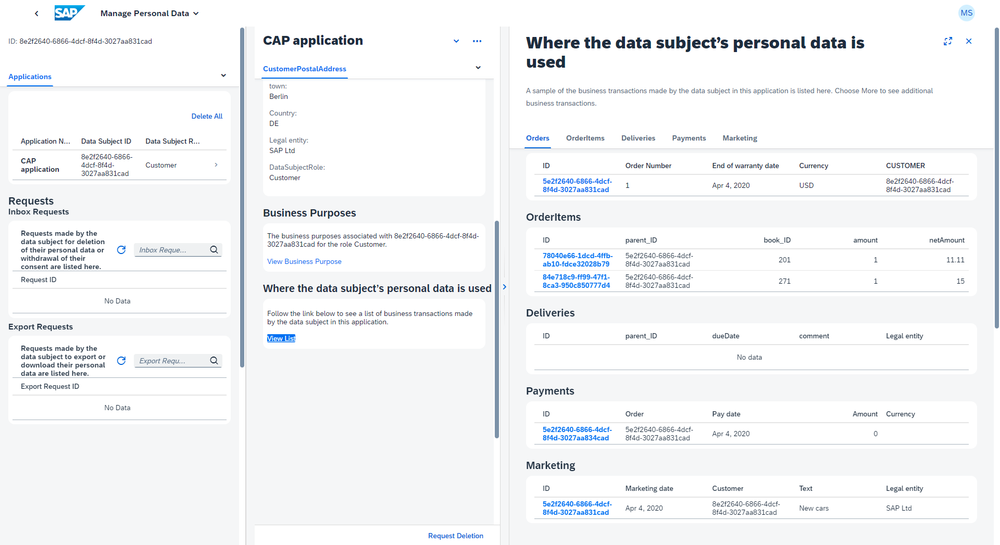

# Personal Data Management

{{ $frontmatter.synopsis }}

::: warning _❗ To follow this cookbook hands-on you need an enterprise account._ <!--  -->
The SAP Personal Data Manager service is currently only available for [enterprise accounts](https://discovery-center.cloud.sap/missiondetail/3019/3297/). An entitlement in trial accounts is not possible.
:::

SAP BTP provides the [*SAP Personal Data Manager (PDM)*](https://help.sap.com/docs/PERSONAL_DATA_MANAGER) which allows administrators to respond to the question "What data of me do you have?". To answer this question, the PDM service needs to fetch all personal data using an OData endpoint. That endpoint has to be provided by the application as follows.


## Provide a Service Interface to SAP Personal Data Manager

SAP Personal Data Manager needs to call into your application to read personal data so you have to define a respective service endpoint, complying to the interface required by SAP Personal Data Manager.
Following the CAP principles, we recommend adding a new dedicated CAP service that handles all the personal data manager requirements for you. This keeps the rest of your data model clean and enables reuse, just as CAP promotes it.


### CAP Service Model for SAP Personal Data Manager

Following the [best practice of separation of concerns](../domain-modeling#separation-of-concerns), we create a dedicated service for the integration with SAP Personal Data Manager:

::: code-group
```cds [srv/pdm-service.cds]
using {sap.capire.incidents as db} from '../db/schema';

@requires: 'PersonalDataManagerUser' // security check
service PDMService @(path: '/pdm') {

  // Data Privacy annotations on 'Customers' and 'Addresses' are derived from original entity definitions
  entity Customers                as projection on db.Customers;
  entity Addresses                as projection on db.Addresses;
  entity Incidents                as projection on db.Incidents

  // create view on Incidents and Conversations as flat projection
  entity IncidentConversationView as
      select from Incidents {
              ID,
              title,
              urgency,
              status,
          key conversation.ID        as conversation_ID,
              conversation.timestamp as conversation_timestamp,
              conversation.author    as conversation_author,
              conversation.message   as conversation_message,
              customer.ID            as customer_ID,
              customer.email         as customer_email
      };

  // annotate new view
  annotate PDMService.IncidentConversationView with @(PersonalData.EntitySemantics: 'Other') {
      customer_ID @PersonalData.FieldSemantics: 'DataSubjectID';
  };

  // annotations for Personal Data Manager - Search Fields
  annotate Customers with @(Communication.Contact: {
        n    : {
            surname: lastName,
            given  : firstName
        },
        email: [{address: email}]
    });

  };


```
:::

::: tip
Make sure to have [indicated all relevant entities and elements in your domain model](annotations).
:::


### Provide Flat Projections

As an additional step, you have to create flat projections on the additional business data, like transactional data.

In our model, we have `Incidents` and `Conversations`, which are connected via a [composition](https://github.com/SAP-samples/cloud-cap-samples/blob/gdpr/orders/db/schema.cds). Since SAP Personal Data Manager needs flattened out structures, we define a helper view `IncidentConversationView` to flatten this out.

We have to then add data privacy-specific annotations to this new view as well. The `IncidentConversationView` as transactional data is marked as `Other`. In addition, it is important to tag the correct field, which defines the corresponding data subject, in our case that is `customer_ID @PersonalData.FieldSemantics: 'DataSubjectID';`


### Annotating Search Fields

In addition, the most important search fields of the data subject have to be annotated with the corresponding annotation `@Communication.Contact`.

To perform a valid search in the SAP Personal Data Manager application, you will need _Surname_, _Given Name_, and _Email_ or the _Data Subject ID_. Details about this annotation can be found in
[Communication Vocabulary](https://github.com/SAP/odata-vocabularies/blob/main/vocabularies/Communication.md).

Alternatively to the tuple _Surname_, _Given Name_, and _Email_, you can also use _Surname_, _Given Name_, and _Birthday_ (called `bday`), if available in your data model. Details about this can be found in
[SAP Personal Data Manager - Developer Guide](https://help.sap.com/docs/personal-data-manager/4adcd96ce00c4f1ba29ed11f646a5944/v4-annotations?q=Contact&locale=en-US).


### Restrict Access Using the `@requires` Annotation

To restrict access to this sensitive data, the `PDMservice` is protected by the `@requires: 'PersonalDataManagerUser'` annotation. Calling the `PDMservice` externally without the corresponding permission is forbidden. The Personal Data Manager service calls the `PDMservice` with the needed role granted. This is configured in the _xs-security.json_ file, which is explained later.

[Learn more about security configuration and the SAP Personal Data Manager.](https://help.sap.com/docs/PERSONAL_DATA_MANAGER/620a3ea6aaf64610accdd05cca9e3de2/4ee5705b8ded43e68bde610223722971.html#loio8eb6d9f889594a2d98f478bd57412ceb){.learn-more}


At this point, you are done with your application. Let's set up the SAP Personal Data Manager and try it out.


## Connecting SAP Personal Data Manager

Next, we will briefly detail the integration to SAP Personal Data Manager.
A more comprehensive guide, incl. tutorials, is currently under development.
For further details, see the [SAP Personal Data Manager Developer Guide](https://help.sap.com/docs/personal-data-manager/4adcd96ce00c4f1ba29ed11f646a5944/what-is-personal-data-manager).


### Subscribe to SAP Personal Data Manager Service

[Subscribe to the service](https://help.sap.com/docs/PERSONAL_DATA_MANAGER/620a3ea6aaf64610accdd05cca9e3de2/ef10215655a540b6ba1c02a96e118d66.html) from the _Service Marketplace_ in the SAP BTP cockpit.

{width="300"}

Follow the wizard to create your subscription.


### Build and Deploy Your Application

The Personal Data Manager can't connect to your application running locally. Therefore, you need to deploy your application. 

The general deployment is described in detail in [Deploy to Cloud Foundry guide](../deployment/to-cf). Here's for short what you need to do.

### Prepare for Deployment

Add SAP HANA Cloud configuration, as well as an approuter and an _mta.yaml_ to your project:

```sh
cds add hana,approuter,mta
```

Add `@sap/xssec` library, to make the authentication work:

```sh
npm install @sap/xssec
```

[Learn more about authorization in CAP using Node.js.](../../node.js/authentication#jwt){.learn-more}

### Enhance mta.yaml with DPI

```yaml
modules:
  - name: incidents-srv
    ...
    requires:
      ... 
      - name: incidents-information // [!code ++]
...
resources:
  ... 
  - name: incidents-information  // [!code ++]
      type: org.cloudfoundry.managed-service // [!code ++]
      requires: // [!code ++]
        - name: srv-api // [!code ++]
      parameters: // [!code ++]
        service-name: incidents-information // [!code ++]
        service: data-privacy-integration-service // [!code ++]
        service-plan: data-privacy-internal // [!code ++]
        path: ./pdm-config.json // [!code ++]
        config: // [!code ++]
          xs-security:  // [!code ++]
            xsappname: incidents-information-${org}-$ // [!code ++]{space}                                                     
            authorities: // [!code ++]
              - $ACCEPT_GRANTED_AUTHORITIES // [!code ++]
```

### Configure PDM Service

::: code-group
```json [pdm-config.json]
{
    "dataPrivacyConfiguration": {
        "configType": "information",
        "applicationConfiguration": {
            "applicationName": "incidents-information",
            "applicationDescription": "DPI NextGen Bookshop CAP Reference Application",
            "applicationTitle": "DPI NextGen Bookshop"
        },
        "informationConfiguration": {
            "applicationConfiguration": {
                "dataSubjectDeletionAgent": "retention-manager",
                "retentionApplicationName": "incidents-retention",
                "disableDataSubjectCorrection": true,
                "cacheControl": "no-cache"
            },
            "components": [
                {
                    "componentName": "incidents-srv",
                    "componentBaseURL": "~{srv-api/srv-url}",
                    "serviceEndPoints": [
                        {
                            "serviceName": "dpi-service",
                            "serviceFormat": "odata-v4",
                            "annotationFormat": "v4",
                            "serviceEndPoint": "/pdm",
                            "appPaginationEnabled": true,
                            "cacheControl": "no-cache"
                        }
                    ]
                }
            ]
        }
    }
}
```
:::


### Activate Access Checks in _xs-security.json_

Because we protected the `PDMservice`, we need to establish the security check properly. In particular, you need the _xs-security.json_ file to make the security check active. Add the following scope:

```json
{
  "scopes": [
    {
      "name": "$XSAPPNAME.PersonalDataManagerUser",
      "description": "Authority for Personal Data Manager",
      "grant-as-authority-to-apps": [
        "$XSSERVICENAME(incidents-information)"
      ]
    }
  ]
}
```

Here you define that your personal data manager service instance, called `incidents-information`, is allowed to access your CAP application granting the `PersonalDataManagerUser` role.


### Create Role Collections

SAP Personal Data Manager comes with the following roles:

Role Name | Role Template
----------|------
PDM_Administrator | PDM_Administrator
PDM_CustomerServiceRepresentative | PDM_CustomerServiceRepresentative
PDM_OperatorsClerk | PDM_OperatorsClerk

All of these roles have two different _Application Identifiers_.
::: tip
Application identifiers with **!b** are needed for the UI, and identifiers with **!t** are needed for executing the Postman collection.
:::

[Learn more about defining a role collection in SAP BTP cockpit](https://help.sap.com/products/BTP/65de2977205c403bbc107264b8eccf4b/4b20383efab341f181becf0a947a5498.html){.learn-more}


## Using the SAP Personal Data Manager Application

Open the SAP Personal Data Manager application from the _Instances and Subscriptions_ page in the SAP BTP cockpit.

{width="500"}

In the personal data manager application you can search for data subjects with _First Name_, _Last Name_, and _Date of Birth_, or alternatively with their _ID_.

{width="500"}
