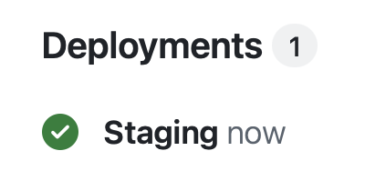
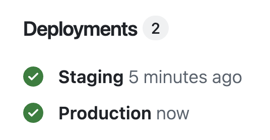

---
breadcrumbs:
  - Cookbook
  - Deployment
  - More Options
label: Deploy with CI/CD
synopsis: >
  A comprehensive guide to implementing continuous integration and continuous deployment (CI/CD) for CAP projects using best practices, tools, and services.
# layout: cookbook
status: released
---

# Deploy using CI/CD Pipelines
{{ $frontmatter.synopsis }}

[[toc]]


## GitHub Actions

GitHub offers continuous integration using [GitHub Actions](https://docs.github.com/en/actions/automating-builds-and-tests/about-continuous-integration). In our [samples](https://github.com/capire/samples), we use simple workflows to [test, deploy and release new versions](https://github.com/capire/samples/tree/main/.github/workflows).

Add a default set of workflows to your project like so:

```sh
cds add github-actions
```
> You can also use `cds add gha` as a shortcut.

### Deploy to Staging

The created workflows do a _Staging_ deployment for pushes on the `main` branch, for example after merging pull requests.

If no defaults are maintained in your GitHub org, a set of variables and secrets has to be provided. Open the repository and navigate here to maintain them:

`Settings` → `Secrets and variables` → `Actions`

For a minimal deployment setup, these variables and secrets are required:

#### Cloud Foundry

| **Type**   | **Name**       | **Note**  | **Example**       |
|------------|----------------|-----------|-------------------|
| Variable   | `CF_API`       | API URL   | `https://api.cf.example.com` |
|    | `CF_USERNAME`  | Username  | `user@example.com` |
|    | `CF_ORG`       | Org Name  | `my-org`          |
|    | `CF_SPACE`     | Space Name| `my-space`        |
| Secret     | `CF_PASSWORD`  | Password  | `********`        |

#### Kyma

| **Type**   | **Name**       | **Note**  | **Example**       |
|------------|----------------|-----------|-------------------|
| Secret   | `KUBE_CONFIG`       | Base64-encoded Kubernetes config   | see below |


::: details Example of a decoded `KUBE_CONFIG`

Your `KUBE_CONFIG` will have to look similar to this. Make sure to replace `token` by an authorization token created for your technical user used for deployment.

```yaml{6-7,11}
apiVersion: v1
kind: Config
clusters:
  - name: default-cluster
    cluster:
      certificate-authority-data: ...
      server: https://api.<server ID>.stage.kyma.ondemand.com
users:
  - name: ci-user
    user:
      token: ...
contexts:
  - name: ci-context
    context:
      cluster: default-cluster
      namespace: ci
      user: ci-user
current-context: ci-context
```
[Learn more about configuring Kubernetes](./to-kyma#configure-kubernetes){.learn-more style="margin-top:20px"}

:::

#### BTP Prerequisites

Also make sure sufficient service entitlements are assigned to your subaccount depending on your expected usage.

::: tip Set up a sandbox subaccount as an org-wide default

Organization variables and secrets allow you to provide defaults for new projects without prior setup.

Once required for your use case, you can easily **overwrite org-wide** variables and secrets by **repository-local** ones.
:::

#### You're set!

You can now simply push any CAP project that was set up using `cds add github-actions` to your org. When merging PRs or pushing to your `main` branch, the deployment workflow will start and after some time a new entry will show up in the _Deployments_ section on your repository front page:

{style="max-width: 200px"} <!-- = image-width/2 -->

### Create a GitHub Release

#### Prerequisites

For the actual release we want to override org-wide sandbox variables to deploy to a different subaccount/organization and database.

Go to `Settings` → `Environments` → `New environment` → enter "Production".

Now override org-wide variables (e.g. `CF_ORG` and `CF_SPACE` in Cloud Foundry) to use a dedicated subaccount you created for the release deployment.

#### Publish the release

On your repository front page go to `Releases` → `Draft a new release` → `Select tag`.

Now enter a tag name, e.g. `v1.0.0` and select `Create new tag: v1.0.0 on publish`.

You can optionally add a release title and release notes. Hit **Publish release** once you're ready.

The release will show up in your _Releases_ page and a deployment to your production environment is started. Once finished, a _Production_ entry shows up next to _Staging_:

{style="max-width: 268px"} <!-- = image-width/2 -->


<span id="afterstart" />

<span id="beforecicd" />

## SAP Continuous Integration and Delivery

[SAP Continuous Integration and Delivery](https://help.sap.com/viewer/SAP-Cloud-Platform-Continuous-Integration-and-Delivery) lets you configure and run predefined continuous integration and delivery pipelines. It connects with your Git SCM repository and in its user interface, you can easily monitor the status of your builds and detect errors as soon as possible, which helps you prevent integration problems before completing your development.

SAP Continuous Integration and Delivery has a ready-to-use pipeline for CAP, that is applicable to Node.js, Java and multitarget application (MTA) based projects. It does not require you to host your own Jenkins instance and it provides an easy, UI-guided way to configure your pipelines.

Try the tutorial [Get Started with SAP Continuous Integration and Delivery](https://developers.sap.com/tutorials/cicd-start-cap.html) to configure a CI/CD pipeline that builds, tests, and deploys your code changes.

## CI/CD Pipelines with SAP Piper

For more flexibility you can set up continuous delivery in your software development project, applicable to both SAP Business Technology Platform (BTP) and SAP on-premise platforms. SAP implements tooling for continuous delivery in project [Piper](https://www.project-piper.io/).

Try the tutorial [Create Automated System Tests for SAP Cloud Application Programming Model Projects](https://developers.sap.com/tutorials/cicd-wdi5-cap.html) to create system tests against a CAP-based sample application and automate your tests through a CI/CD pipeline.

[See a comparison with SAP Continuous Integration and Delivery Service.](https://www.project-piper.io/){.learn-more}
