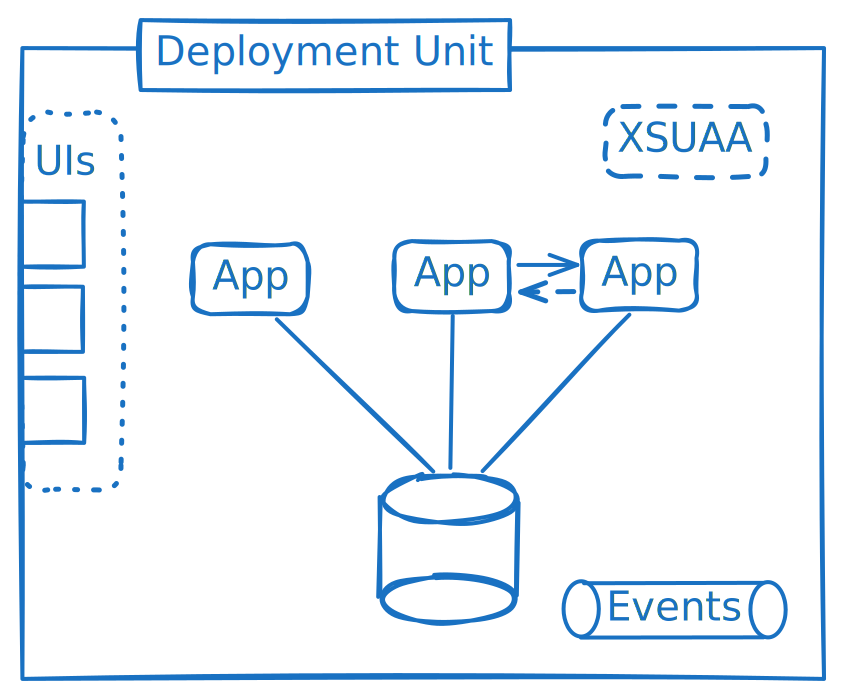

# Late-Cut Microservices

::: warning Work in Progress
:::

Microservices have been attributed with a multitude of benefits like
- granular scalability
- deployment agility
- distributed development
- etc.

While these benefits exist, they are accompanied by complexity and performance losses.
True microservices each constitute their own deployment unit with their own database.
But the benefits are derived from specific aspects. Let's break it down.

## Monolith

A monolith is a single deployment unit with a single application. This is very convenient, because every part of the app is accessible in memory.

## Application Instances

Having only a single virtual machine or container, the application can only be scaled vertically by increasing the cpu and memory resources. This typically has an upper limit and requires a restart when scaling.

To improve scalability, we can start multiple instances of the same application.

Benefits:
- Near unlimited scaling
- No downtimes when scaling
- Better resilience against failures in single app instances

Requirement:
- The app needs to be stateless, state needs to be persisted

Multiple app instances can be used both for monoliths and microservices.

## Modules

When many developers work on an app, a distribution of work is necessary. Nowadays this distribution is often reached by each team working on one or multiple microservices.
Also, microservices are potentially cut by which team is developing them.

Instead, developers can work on single modules, which are later deployed and run as a single app... or as multiple apps. But this choice is then independent of who is developing the module.

## Multiple applications

As described above, [application instances](#application-instances) already have near unlimited scaling, even for a monolith. So why would you want multiple apps?

### Resource Separation

One part of an application may do highly critical background processing, while another handles incoming requests.
The incoming requests take cpu cycles and consume memory, which should rather be used for the background processing.
To make sure that there are always enough resources for specific tasks, they can be split into their own app.

### Independent scaling

Similar to resource separation, different parts of the app may have different requirements and profiles for scaling.
For some parts, a 100% cpu utilization over an extended period is accepted for efficiency, while request handling apps need spare resources to handle user requests with low latency.

### Resilience

While app instances already provide some resilience, there are failure classes (e.g. bugs) which affect each app instance.

Separating functionality into different apps means that when one app experiences issues, the functionality of the other apps is still available.
In the bookstore example, while reviews may be down, orders may still be possible.

## Multiple Deployment Units

## Multiple Databases

True microservices each consist of their own deployment unit with their own application and their own database.
Meaning that they are truly independent of each other. And it works well if they actually are independent.

The above is a simplified view. In an actual microservice deployment, there are typically shared service instances and wiring needs to be provided so that apps can talk to each other, directly or via events.
If the microservices are not cut well, this leads to high performance losses and often the need for data replication or caching.

## Summary

### Flexibility in Deployments

