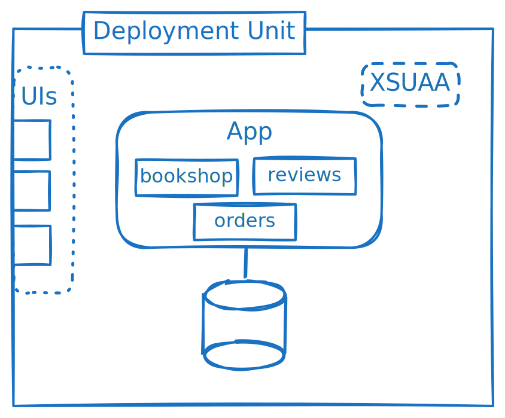
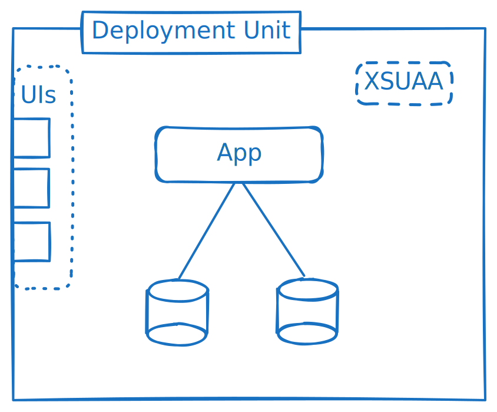

---
breadcrumbs:
  - Cookbook
  - Deployment
  - Late Cut Microservices
synopsis: >
  An overview on monoliths, moduliths and microservices - breaking down their aspects, benefits and drawbacks.
status: released
---

# Late-Cut Microservices

Microservices have been attributed with a multitude of benefits like
- granular scalability,
- deployment agility,
- distributed development, and so on.

While these benefits exist, they're accompanied by complexity and performance losses. True microservices each constitute their own deployment unit with their own database. The benefits attributed to microservices can be broken down into multiple aspects.

| Aspect | Benefits | Drawbacks |
| ---------- | -------- | --------- |
| App Instances | Scalability, Resilience | Requires Statelessness |
| Modules | Distributed Development, Structure | |
| Applications | Independent Scalability, Fault Tolerance | Communication Overhead |
| Deployment Units | Faster Deploy Times, Independent Deployments | Configuration Complexity |
| Databases | Depends | Data Consistency, Fragmentation |

## Flexibility in Deployments

Instead of just choosing between a monolith and microservices, these aspects can be combined into an architecture that fits the specific product.

Since each cut not only has benefits, but also drawbacks, it's important to choose which benefits actually help the overall product and which drawbacks can be accepted.

## A Late Cut

When developing a product, it may initially not be apparent where the boundaries are.

Keeping this in mind, an app can be developed as a modular application with use case specific CAP services.
It can first be deployed as a [monolith / modulith](#monolith-or-microservice). Once the boundaries are clear, it can then be split into multiple applications.

Generally, the semantic separation and structure can be enforced using modules. The deployment configuration is then an independent step on top. In this way, the same application can be deployed as a monolith, as microservices with shared db, as true microservices, or as a combination of these, just via configuration change.

## Best Practices

* Prefer a late cut
* Stay flexible in where to cut
* Prefer staying loosely coupled → for example, ReviewsService → reviewed events → UPDATE avg ratings
* Leverage database-level integration selectively → Prefer referring to (public) service entities, not (private) db entities

## Appendix

### Monolith or Microservice

A monolith is a single deployment unit with a single application. This is very convenient, because every part of the app is accessible in memory.

A modulith, even though the app is separated into multiple CAP services inside multiple modules, can still be deployed as a single monolithic application.
This combines the benefit of a clear structure and distributed development while keeping a simple deployment.

True microservices each consist of their own deployment unit with their own application and their own database.
So they're truly independent of each other. And it works well if they are actually independent.

What was mentioned earlier is a simplified view. In an actual microservice deployment, there are typically shared service instances and wiring needs to be provided so that apps can talk to each other, directly or via events.
If the microservices aren't cut well, the communication overhead leads to high performance losses and often the need for data replication or caching.

### Application Instances

Having only a single virtual machine or container, the application can only be scaled vertically by increasing the cpu and memory resources. This typically has an upper limit and requires a restart when scaling.

To improve scalability, we can start multiple instances of the same application.

Benefits:
- Near unlimited scaling
- No downtimes when scaling
- Better resilience against failures in single app instances

Requirement:
- The app needs to be stateless, state needs to be persisted

Multiple app instances can be used both for monoliths and microservices.

### Modules

When many developers work on an app, a distribution of work is necessary. Nowadays this distribution is often reached by each team working on one or multiple microservices.
Also, microservices are potentially cut by which team is developing them.

Instead, developers can work on single modules, which are later deployed and run as a single app... or as multiple apps. But this choice is then independent of who is developing the module.

Benefits:
- Distributed Development
- Clear Structure

### Multiple applications

As described above, [application instances](#application-instances) already have near unlimited scaling, even for a monolith. So, why would you want multiple apps?

Benefits:
- Resource Separation
- Independent Scaling
- Fault Tolerance

Drawbacks:
- Latency for synchronous calls between dependent apps

#### Resource Separation

One part of an application may do highly critical background processing, while another handles incoming requests.
The incoming requests take cpu cycles and consume memory, which should rather be used for the background processing.
To make sure that there are always enough resources for specific tasks, they can be split into their own app.

#### Independent Scaling

Similar to resource separation, different parts of the app may have different requirements and profiles for scaling.
For some parts, a 100% cpu utilization over an extended period is accepted for efficiency, while request handling apps need spare resources to handle user requests with low latency.

#### Fault Tolerance

While app instances already provide some resilience, there are failure classes (for example, bugs) which affect each app instance.

Separating functionality into different apps means that when one app experiences issues, the functionality of the other apps is still available.
In the bookstore example, while reviews may be down, orders may still be possible.

This benefit is null for apps with synchronous dependencies on each other. If A depends on synchronous calls to B, then if B is down, A is down as well.

### Independent Deployments of Multiple Deployment Units 

With multiple apps, you can still deploy them together as one unit, for example as part of a multitarget application archive.
Once an application grows bigger, this takes a significant amount of time.
Deployments can then be split up either by type (e.g. deploying UIs separately) or horizontally (e.g. deploying each app via its own deployment unit).

Benefits:
- Faster individual deploy times
- Independent deployments

Drawbacks:
- Coordination between deployment units for updates with dependencies
- Configuration wiring to connect systems across deployment units

With a single deployment unit, when a fix for one part needs to be deployed, the risk of redeploying the rest of the application needs to be considered.
For example, there may already been changes to other parts of the app in the same code line.
A restart / rolling restart may also lead to higher resource consumption due to startup activities and thus slightly degrade the performance during this time.

Being able to deploy apps or other resources independently reduces the risk when a single part of the system needs to be updated.
The update decision needs less coordination and can be made by the team responsible for this part of the system.

Coordination is still necessary when deploying changes that affect the whole system, for example when a feature needs implementations in multiple apps.

### Multiple Databases

Here we need to differentiate between two scenarios:
- Using multiple types of databases
- Using multiple databases of the same type

A polyglot persistence can be used when the app has different requirements for the types of data it needs to store.
For example, there may be a large amount of large files that can be stored in a document store, while corresponding administrative data is stored in a relational database.

Benefits:
- Use suitable technology for different use cases

In contrast, using multiple databases of the same type may be suggested for
- Scalability
- Resource Separation
- Tenant Isolation
- Semantic Separation

Scalability and resource separation need multiple database instances. Tenant isolation and semantic separation could also be achieved through multiple schemas or containers inside the same database instance.

Drawbacks:
- Data consistency across databases
- Collecting data across databases

### Data Federation

When data is distributed across multiple databases, strategies may be necessary to combine data from multiple sources.

- Fetching on-demand
  - Caching
- HANA synonyms
- Data Replication

