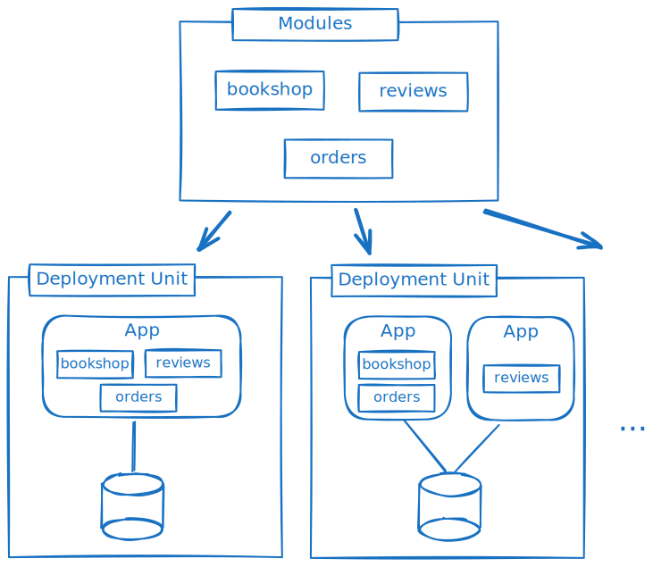
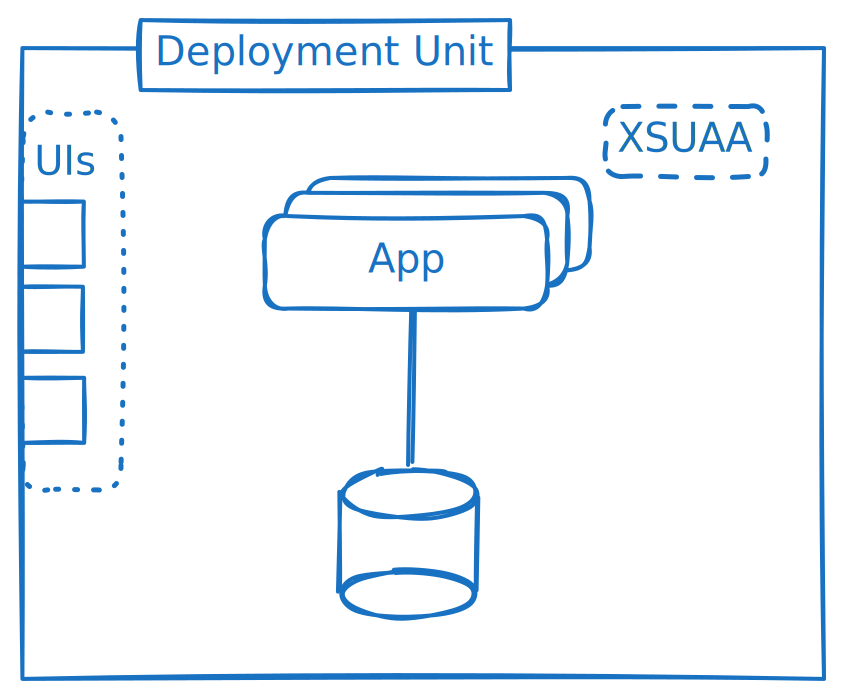
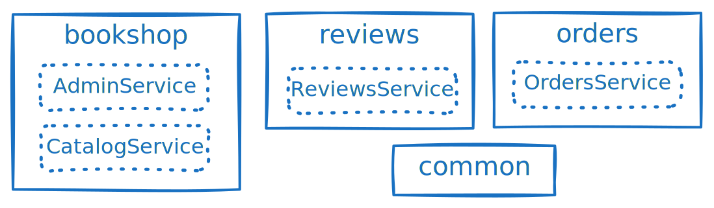
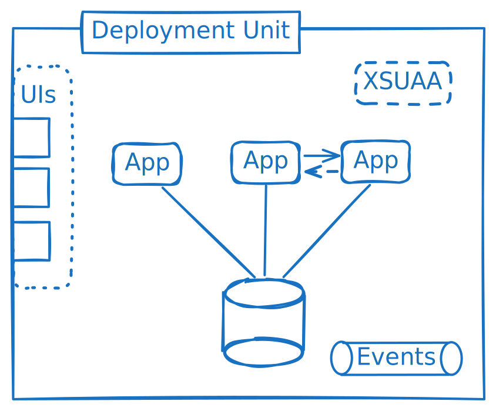
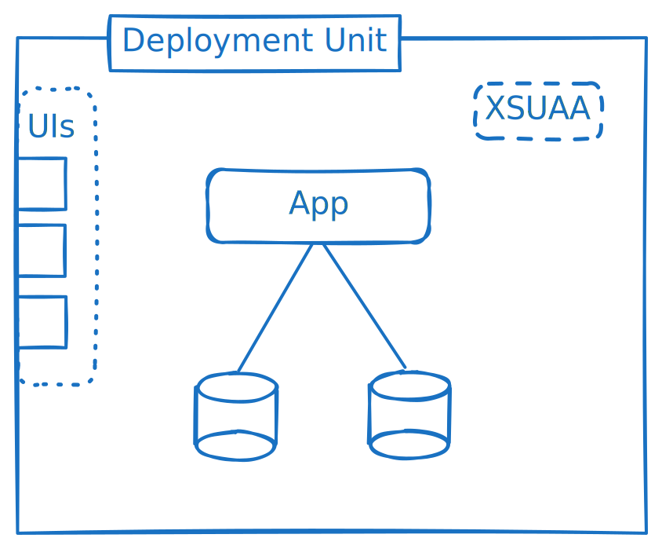

# Microservices with CAP

A comprehensive guide on deploying your CAP application as microservices.

[[toc]]


## Create a Solution Monorepo

Assumed we want to create a composite application consisting of two or more micro services, each living in a separate GitHub repository, for example:

- https://github.com/capire/bookstore
- https://github.com/capire/reviews
- https://github.com/capire/orders

With some additional repositories, used as dependencies in the same manner, like:

- https://github.com/capire/common
- https://github.com/capire/bookshop
- https://github.com/capire/data-viewer

This guide describes a way to manage development and deployment via *[monorepos](https://en.wikipedia.org/wiki/Monorepo)* using *[NPM workspaces](https://docs.npmjs.com/cli/using-npm/workspaces)* and *[git submodules](https://git-scm.com/book/en/v2/Git-Tools-Submodules)* techniques.

1. Create a new monorepo root directory using *NPM workspaces*:

   ```sh
   mkdir capire
   cd capire
   echo "{\"name\":\"@capire/samples\",\"workspaces\":[\"*\"]}" > package.json
   ```

2. Add the previously mentioned projects as `git` submodules:

   ```sh
   git init
   git submodule add https://github.com/capire/bookstore 
   git submodule add https://github.com/capire/reviews
   git submodule add https://github.com/capire/orders
   git submodule add https://github.com/capire/common
   git submodule add https://github.com/capire/bookshop
   git submodule add https://github.com/capire/data-viewer
   git submodule update --init
   ```

   Add a _.gitignore_ file with the following content:
   ```txt
   node_modules
   gen
   ```
   > The outcome of this looks and behaves exactly as the monorepo layout in *[cap/samples](https://github.com/sap-samples/cloud-cap-samples)*,  so we can exercise the subsequent steps in there...

3. Test-drive locally:
   ```sh
   npm install
   ```

   ```sh
   cds w bookshop
   ```

   ```sh
   cds w bookstore
   ```

   Each microservice can be started independently. If you start each microservice, one after the other in a different terminal, the connection is already established.

   [Learn more about Automatic Bindings by `cds watch`](../extensibility/composition#bindings-via-cds-watch){.learn-more}
   

::: details The project structure

The project structure used here is as follows:

```txt
<PROJECT-ROOT>/
├─ bookstore/
├─ orders/
├─ reviews/
├─ ...
└─ package.json
```

The individual services (`bookstore`, `reviews`, `orders`) can be one of the following:
 * folders, committed directly to the root project
 * git submodules

Links between the projects are established using NPM dependencies.
Since the root project defines workspaces, these dependencies are also found locally without the need for publishing or linking.
When one of the projects is cloned in isolation, it's still possible to fetch dependencies to other modules via the NPM registry.

:::

## Using a Shared Database

You can deploy your model to a single database and then share it across applications, if you have one of the following scenarios:

- multiple CAP applications relying on the same domain model
- a monolithic CAP application that you want to split up  **on the service level only, while still sharing the underlying database layer**

In the following steps, we create an additional project to easily collect the relevant models from these projects, and act as a vehicle to deploy these models to SAP HANA in a controlled way.

::: details Why a shared database?

A shared database is beneficial if the following are important for you:

 - **Query Performance:** Complex queries are executed much faster, for example `$expand` to an entity on another microservice, compared to calls across services with own data persistencies.
 - **Independent Scalability** of application runtimes, compared to a monolithic application.

These are the (not so beneficial) side effects you when using a shared persistence:

 - Accessing data directly (without an API) means any changes in the data model affect all applications directly.
 - Every change in one of the services requires either one of the following:
   - Redeployment of all microservices involved.
   - Logic to decide which microservices need redeployment to avoid inconsistencies.
 - Violates the 12 factors concept.

:::

### Add a Project For Shared Database

1. Add another `cds` project to collect the models from these projects:

   ```sh
   cds init shared-db --add hana
   ```

   ```sh
   npm add --workspace shared-db @capire/bookstore
   npm add --workspace shared-db @capire/reviews
   npm add --workspace shared-db @capire/orders
   ```

   > Note how *NPM workspaces* allows us to use the package names of the projects, and nicely creates symlinks in *node_modules* accordingly.

2. Add a `shared-db/db/schema.cds` file as a mashup to actually collect the models:

  ::: code-group
   ```cds [shared-db/db/schema.cds]
   using from '@capire/bookstore';
   using from '@capire/reviews';
   using from '@capire/orders';
   ```
   :::

   > Note: the `using` directives refer to `index.cds` files existing in the target packages. Your projects may have different entry points. 

::: details Try it out

With that we're basically done with the setup of the collector project. In sum, it's just another CAP project with some cds models in it, which we can handle as usual. We can test whether it all works as expected, for example, we can test-compile and test-deploy it to sqlite and hana, build it, and deploy it to the cloud as usual:

```sh
cd shared-db
```

```sh
cds compile db -2 sql
```
```sh
cds compile db -2 hana
```

```sh
cds deploy -2 sqlite
```
```sh
cds build --for hana
```

```sh
cd ..
```

> Note: As we can see in the output for `cds deploy` and `cds build`, it also correctly collects and adds all initial data from enclosed `.csv` files. 
:::

::: details Other project structures

The project structure used here is as follows:

```txt
<PROJECT-ROOT>/
├─ bookstore/
├─ reviews/
├─ orders/
└─ shared-db/
   └─ db/
     └─ schema.cds # references schemas of bookstore, reviews, orders
   └─ package.json # npm dependencies to bookstore, reviews, orders
├─ ...
└─ package.json
```

The `shared-db` module is simply another CAP project, with only database content. The dependencies are installed via NPM, so it's still possible to install via an NPM registry if used outside of the monorepo setup.

The database model could also be collected on root level instead of creating a separate `shared-db` module. When collecting on root level, the `cds build --ws` option can be used to collect the models of all NPM workspaces.

:::

## All-in-one Deployment

This section is about how to deploy all 3+1 projects at once with a common _mta.yaml_.


[cap-samples](https://github.com/SAP-samples/cloud-cap-samples?tab=readme-ov-file#welcome-to-capsamples) already has an all-in-one deployment implemented. Similar steps are necessary to convert projects with multiple CAP applications into a shared database deployment.

### Deployment Descriptor

Add initial multitarget application configuration for deployment to Cloud Foundry:

```shell
cds add mta
```

[Learn more about **how to deploy to Cloud Foundry**.](../deployment/to-cf){.learn-more}

### Database

Add initial database configuration using the command:

```shell
cds add hana
```

Delete the generated _db_ folder as we don't need it on the root level:

```shell
rm -r db
```

Update the `db-deployer` path to use our `shared-db` project [created previously](#using-a-shared-database):

::: code-group
```yaml [mta.yaml]
  - name: samples-db-deployer
    path: gen/db # [!code --]
    path: shared-db/gen/db # [!code ++]
```
:::

Add build command for generation of the database artifacts:

::: code-group
```yaml [mta.yaml]
build-parameters:
  before-all:
    - builder: custom
      commands:
        - npm ci
        - npx cds build --production # [!code --]
        - npx cds build ./shared-db --for hana --production # [!code ++]
```
:::


::: info `cds build --ws`
If the CDS models of every NPM workspace contained in the monorepo should be considered, then instead of creating this `shared-db` folder, you can also use:
```shell
cds build --for hana --production --ws
```
The `--ws` aggregates all models in the NPM workspaces.

In this walkthrough, we only include a subset of the CDS models in the deployment.
:::


::: details Configure each app for cloud readiness
The preceding steps only added configuration to the workspace root.

Additionally add database configuration to each module that we want to deploy - bookstore, orders, and reviews:

```shell
npm i @cap-js/hana --workspace bookstore
npm i @cap-js/hana --workspace orders
npm i @cap-js/hana --workspace reviews
```
:::


### Applications

Replace the MTA module for `samples-srv` with versions for each CAP service and adjust `name`, `path`, and `provides[0].name` to match the module name. Also change the `npm-ci` builder to the `npm` builder.

::: code-group
```yaml [mta.yaml]
modules:
  - name: bookstore-srv # [!code focus]
    type: nodejs
    path: bookstore/gen/srv # [!code focus]
    parameters:
      instances: 1
      buildpack: nodejs_buildpack
    build-parameters:
      builder: npm # [!code focus]
    provides: # [!code focus]
      - name: bookstore-api # [!code focus]
        properties:
          srv-url: ${default-url}
    requires:
      - name: samples-db
      - name: samples-auth
      - name: samples-messaging
      - name: samples-destination

  - name: orders-srv # [!code focus]
    type: nodejs
    path: orders/gen/srv # [!code focus]
    parameters:
      instances: 1
      buildpack: nodejs_buildpack
    build-parameters:
      builder: npm # [!code focus]
    provides: # [!code focus]
      - name: orders-api # [!code focus]
        properties:
          srv-url: ${default-url}
    requires:
      - name: samples-db
      - name: samples-auth
      - name: samples-messaging
      - name: samples-destination

  - name: reviews-srv # [!code focus]
    type: nodejs
    path: reviews/gen/srv # [!code focus]
    parameters:
      instances: 1
      buildpack: nodejs_buildpack
    build-parameters:
      builder: npm # [!code focus]
    provides: # [!code focus]
      - name: reviews-api # [!code focus]
        properties:
          srv-url: ${default-url}
    requires:
      - name: samples-db
      - name: samples-auth
      - name: samples-messaging
      - name: samples-destination
...
```
:::

Add build commands for each module to be deployed:

::: code-group
```yaml [mta.yaml]
build-parameters:
  before-all:
    - builder: custom
      commands:
        - npm ci
        - npx cds build ./shared-db --for hana --production
        - npx cds build ./orders --for nodejs --production --ws-pack # [!code ++]
        - npx cds build ./reviews --for nodejs --production # [!code ++]
        - npx cds build ./bookstore --for nodejs --production --ws-pack # [!code ++]
```
:::

::: info --ws-pack
Note that we use the *--ws-pack* option for some modules. It's important for node modules referencing other repository-local node modules.
:::


### Authentication

Add [security configuration](../security/authorization#xsuaa-configuration) using the command:

```shell
cds add xsuaa --for production
```

Add the admin role

::: code-group
```json [xs-security.json]
{
  "scopes": [
    { // [!code ++]
      "name": "$XSAPPNAME.admin", // [!code ++]
      "description": "admin" // [!code ++]
    } // [!code ++]
  ],
  "role-templates": [
    { // [!code ++]
      "name": "admin", // [!code ++]
      "scope-references": [ // [!code ++]
        "$XSAPPNAME.admin" // [!code ++]
      ], // [!code ++]
      "description": "cap samples multi-service shared-db" // [!code ++]
    } // [!code ++]
  ]
}
```
:::

::: details Configure each app for cloud readiness
Add NPM dependency `@sap/xssec`:

```shell  
npm i @sap/xssec --workspace bookstore
npm i @sap/xssec --workspace orders
npm i @sap/xssec --workspace reviews
```
:::

### Messaging

The messaging service is used to organize asynchronous communication between the CAP services.

```shell
cds add enterprise-messaging
```

Relax the publish filters for the message topics

::: code-group
```json [event-mesh.json]
{
  ...
  "rules": {
    "topicRules": {
      "publishFilter": [
        "${namespace}/*" // [!code --]
        "*" // [!code ++]
      ],
      "subscribeFilter": [
        "*"
      ]
    },
    "queueRules": {
      "publishFilter": [
        "${namespace}/*"
      ],
      "subscribeFilter": [
        "${namespace}/*"
      ]
    }
  }
}
```
:::

Parameterize the properties `emname` and `namespace`:

::: code-group
```json [event-mesh.json]
  {
    "emname": "samples-emname", // [!code --]
    "version": "1.1.0",
    "namespace": "default/samples/1", // [!code --]
    ...
  }
```
:::
::: code-group
```yaml [mta.yaml]
resources:
  - name: samples-messaging
    type: org.cloudfoundry.managed-service
    parameters:
      service: enterprise-messaging
      service-plan: default
      path: ./event-mesh.json
      config: # [!code ++]
        emname: bookstore-${org}-${space}  # [!code ++]
        namespace: cap/samples/${space}    # [!code ++]
```
:::

::: details Configure each app for cloud readiness
Enable messaging for the modules that use it:

::: code-group
```json [bookstore/package.json]
{
  "cds": {
    "requires": {
      "messaging": true // [!code ++]
    }
  }
}
```
```json [orders/package.json]
{
  "cds": {
    "requires": {
      "messaging": true // [!code ++]
    }
  }
}
```

:::


### Destinations

Add [destination configuration](https://cap.cloud.sap/docs/guides/using-services#using-destinations) for connectivity between the apps:

```shell
cds add destination
```

Add destinations that point to the API endpoints of the orders and reviews applications:

::: code-group
```yaml [mta.yaml]
modules:
...
  - name: destination-content
    type: com.sap.application.content
    requires:
      - name: orders-api
      - name: reviews-api
      - name: bookstore-api
      - name: samples-auth
        parameters:
          service-key:
            name: xsuaa_service-key
      - name: samples-destination
        parameters:
          content-target: true
    build-parameters:
      no-source: true
    parameters:
      content:
        instance:
          existing_destinations_policy: update
          destinations:
            - Name: orders-dest
              URL: ~{orders-api/srv-url}
              Authentication: OAuth2ClientCredentials
              TokenServiceInstanceName: samples-auth
              TokenServiceKeyName: xsuaa_service-key
            - Name: reviews-dest
              URL: ~{reviews-api/srv-url}
              Authentication: OAuth2ClientCredentials
              TokenServiceInstanceName: samples-auth
              TokenServiceKeyName: xsuaa_service-key
...
```
:::

Use the destinations in the bookstore application:

::: code-group
```yaml [mta.yaml]
modules:
  - name: bookstore-srv
    ...
    properties: # [!code ++]
      cds_requires_ReviewsService_credentials: {"destination": "reviews-dest","path": "/reviews"} # [!code ++]
      cds_requires_OrdersService_credentials: {"destination": "orders-dest","path": "/odata/v4/orders"} # [!code ++]
```
:::

::: details Configure each app for cloud readiness

Add `@sap-cloud-sdk/http-client` and `@sap-cloud-sdk/resilience` for each module utilizing the destinations:

```shell
npm i @sap-cloud-sdk/http-client --workspace bookstore
npm i @sap-cloud-sdk/resilience --workspace bookstore
```
:::

### Approuter

Add [approuter configuration](../deployment/to-cf#add-app-router) using the command:

```shell
cds add approuter
```

The approuter serves the UIs and acts as a proxy for requests toward the different apps.

Since the approuter folder is only necessary for deployment, we move it into a `.deploy` folder.

```shell
mkdir .deploy
mv app/router .deploy/app-router
```

::: code-group
```yaml [mta.yaml]
modules:
  ...
  - name: samples
    type: approuter.nodejs
    path: app/router # [!code --]
    path: .deploy/app-router # [!code ++]
  ...
```
:::

#### Static Content

The approuter can serve static content. Since our UIs are located in different NPM workspaces, we create symbolic links to them as an easy way to deploy them as part of the approuter.

```shell
mkdir .deploy/app-router/resources
cd .deploy/app-router/resources
ln -s ../../../bookshop/app/vue bookshop
ln -s ../../../orders/app/orders orders
ln -s ../../../reviews/app/vue reviews
cd ../../..
```

::: warning Simplified Setup
This is a simplified setup which deploys the static content as part of the approuter.
See [Deploy to Cloud Foundry](./to-cf#add-ui) for a productive UI setup.
:::

#### Configuration

Add destinations for each app url:

::: code-group
```yaml [mta.yaml]
modules:
  ...
  - name: samples
    type: approuter.nodejs
    ....
    requires:
      - name: service-api # [!code --]
        group: destinations  # [!code --]
        properties:  # [!code --]
          name: service-api  # [!code --]
          url: ~{srv-url}  # [!code --]
          forwardAuthToken: true  # [!code --]
      - name: orders-api # [!code ++]
        group: destinations  # [!code ++]
        properties:  # [!code ++]
          name: orders-api  # [!code ++]
          url: ~{srv-url}  # [!code ++]
          forwardAuthToken: true  # [!code ++]
      - name: reviews-api  # [!code ++]
        group: destinations  # [!code ++]
        properties:  # [!code ++]
          name: reviews-api  # [!code ++]
          url: ~{srv-url}  # [!code ++]
          forwardAuthToken: true  # [!code ++]
      - name: bookstore-api  # [!code ++]
        group: destinations  # [!code ++]
        properties:  # [!code ++]
          name: bookstore-api  # [!code ++]
          url: ~{srv-url}  # [!code ++]
          forwardAuthToken: true  # [!code ++]
```
:::

The _xs-app.json_ file describes how to forward incoming request to the API endpoint / OData services and is located in the _.deploy/app-router_ folder. Each exposed CAP Service endpoint needs to be directed to the corresponding application which is providing this CAP service.

::: code-group
```json [.deploy/app-router/xs-app.json]
{
  "routes": [
    { // [!code --]
      "source": "^/(.*)$", // [!code --]
      "target": "$1", // [!code --]
      "destination": "srv-api", // [!code --]
      "csrfProtection": true // [!code --]
    } // [!code --]
    { // [!code ++]
      "source": "^/admin/(.*)$", // [!code ++]
      "target": "/admin/$1", // [!code ++]
      "destination": "bookstore-api", // [!code ++]
      "csrfProtection": true // [!code ++]
    }, // [!code ++]
    { // [!code ++]
      "source": "^/browse/(.*)$", // [!code ++]
      "target": "/browse/$1", // [!code ++]
      "destination": "bookstore-api", // [!code ++]
      "csrfProtection": true // [!code ++]
    }, // [!code ++]
    { // [!code ++]
      "source": "^/user/(.*)$", // [!code ++]
      "target": "/user/$1", // [!code ++]
      "destination": "bookstore-api", // [!code ++]
      "csrfProtection": true // [!code ++]
    }, // [!code ++]
    { // [!code ++]
      "source": "^/odata/v4/orders/(.*)$",  // [!code ++]
      "target": "/odata/v4/orders/$1", // [!code ++]
      "destination": "orders-api", // [!code ++]
      "csrfProtection": true // [!code ++]
    }, // [!code ++]
    { // [!code ++]
      "source": "^/reviews/(.*)$", // [!code ++]
      "target": "/reviews/$1", // [!code ++]
      "destination": "reviews-api", // [!code ++]
      "csrfProtection": true // [!code ++]
    } // [!code ++]
  ]
}
```
:::

Add routes for static content:

::: code-group
```json [.deploy/app-router/xs-app.json]
{
  "routes": [
    ...
    { // [!code ++]
      "source": "^/app/(.*)$", // [!code ++]
      "target": "$1", // [!code ++]
      "localDir": "resources", // [!code ++]
      "cacheControl": "no-cache, no-store, must-revalidate" // [!code ++]
    } // [!code ++]
  ]
}
```
:::

The `/app/*` route exposes our UIs, so bookstore is available as `/app/bookstore`, orders as `/app/orders` and reviews as `/app/reviews`.
Due to the `/app` prefix, make sure that static resources are accessed via relative paths inside the UIs.

Add the `bookshop/index.html` as initial page when visiting the app:

::: code-group
```json [.deploy/app-router/xs-app.json]
{
  "welcomeFile": "app/bookshop/index.html", // [!code ++]
  "routes": {
    ...
  }
}
```
:::

Additionally, the welcomeFile is important for deployed Vue UIs as they obtain CSRF-Tokens via this url.


### Deploy

Before deploying you need to log in to Cloud Foundry: `cf login --sso`

Start the deployment and build process:

```
cds up
```

[Learn more about `cds up`.](./to-cf#build-and-deploy){.learn-more}

Once the app is deployed, you can get the url of the approuter via

```shell
cf apps # [!code focus]

name                         requested state   processes   routes
bookstore-srv                started           web:1/1     my-capire-bookstore-srv.cfapps.us10-001.hana.ondemand.com
orders-srv                   started           web:1/1     my-capire-orders-srv.cfapps.us10-001.hana.ondemand.com
reviews-srv                  started           web:1/1     my-capire-reviews-srv.cfapps.us10-001.hana.ondemand.com
samples                      started           web:1/1     my-capire-samples.cfapps.us10-001.hana.ondemand.com # [!code focus]
samples-db-deployer          stopped           web:0/1
```

You can then navigate to this url and the corresponding apps
```text
<url>/              -> bookshop
<url>/app/bookshop  -> bookshop
<url>/app/orders    -> orders
<url>/app/reviews   -> reviews
```


## Deployment as Separate MTA

This is an alternative to the all-in-one deployment. Assume the applications each already have their own _mta.yaml_. For example by running `cds add mta` in the _reviews_, _orders_ and _bookstore_ folder.

### Database

We can add the [previously created](#using-a-shared-database) `shared-db` project as its own MTA deployment:

::: code-group
```sh [shared-db/]
cds add mta
```
:::

This adds everything necessary for a full CAP application.
Since we only want the database and database deployment, remove everything else like the srv module and destination and messaging resources:

::: details Diff
```yaml
_schema-version: 3.3.0
ID: shared-db
version: 1.0.0
description: "A simple CAP project."
parameters:
  enable-parallel-deployments: true
build-parameters:
  before-all:
    - builder: custom
      commands:
        - npm ci
        - npx cds build --production # [!code --]
        - npx cds build --production --for hana # [!code ++]
modules:
  - name: shared-db-srv # [!code --]
    type: nodejs # [!code --]
    path: gen/srv # [!code --]
    parameters: # [!code --]
      instances: 1 # [!code --]
      buildpack: nodejs_buildpack # [!code --]
    build-parameters: # [!code --]
      builder: npm-ci # [!code --]
    provides: # [!code --]
      - name: srv-api  # [!code --]
        properties: # [!code --]
          srv-url: ${default-url} # [!code --]
    requires: # [!code --]
      - name: shared-db-destination # [!code --]
      - name: shared-db-messaging # [!code --]
      - name: shared-db-db # [!code --]

  - name: shared-db-db-deployer
    type: hdb
    path: gen/db
    parameters:
      buildpack: nodejs_buildpack
    requires:
      - name: shared-db-db

resources:
  - name: shared-db-destination # [!code --]
    type: org.cloudfoundry.managed-service # [!code --]
    parameters: # [!code --]
      service: destination # [!code --]
      service-plan: lite # [!code --]
  - name: shared-db-messaging # [!code --]
    type: org.cloudfoundry.managed-service # [!code --]
    parameters: # [!code --]
      service: enterprise-messaging # [!code --]
      service-plan: default # [!code --]
      path: ./event-mesh.json # [!code --]
  - name: shared-db-db
    type: com.sap.xs.hdi-container
    parameters:
      service: hana
      service-plan: hdi-shared
```
:::


#### Binding to shared database

The only thing left to care about is to ensure all 3+1 projects are bound and connected to the same database at deployment, subscription, and runtime.

Configure the _mta.yaml_ of the other apps to bind to the existing shared database, for example, in the reviews module:

```yaml [reviews/mta.yaml]
...
modules:
  ...

  - name: reviews-db-deployer # [!code --]
    type: hdb # [!code --]
    path: gen/db # [!code --]
    parameters: # [!code --]
      buildpack: nodejs_buildpack # [!code --]
    requires: # [!code --]
      - name: reviews-db # [!code --]

resources:
  ...
  - name: reviews-db
    type: com.sap.xs.hdi-container # [!code --]
    type: org.cloudfoundry.existing-service # [!code ++]
    parameters:
      service: hana # [!code --]
      service-plan: hdi-shared # [!code --]
      service-name: shared-db-db # [!code ++]
```


#### Subsequent updates

Whenever one of the projects has changes affecting the database, the database artifacts need to be deployed prior to the application deployment. With a single _mta.yaml_, this is handled in the scope of the MTA deployment. When using multiple deployment units, ensure to first deploy the `shared-db` project before deploying the others.

## Late-Cut Microservices

Microservices have been attributed with a multitude of benefits like
- granular scalability,
- deployment agility,
- distributed development, and so on.

While these benefits exist, they are accompanied by complexity and performance losses. True microservices each constitute their own deployment unit with their own database. The benefits attributed to microservices can be broken down into multiple aspects.

| Aspect | Benefits | Drawbacks |
| ---------- | -------- | --------- |
| App Instances | Scalability, Resilience | Requires Statelessness |
| Modules | Distributed Development, Structure | |
| Applications | Independent Scalability, Fault Tolerance | Communication Overhead |
| Deployment Units | Faster Deploy Times, Independent Deployments | Configuration Complexity |
| Databases | Depends | Data Consistency, Fragmentation |

### Flexibility in Deployments

Instead of just choosing between a monolith and microservices, these aspects can be combined into an architecture that fits the specific product.

Since each cut not only has benefits, but also drawbacks, it's important to choose which benefits actually help the overall product and which drawbacks can be accepted.


### A Late Cut

When developing a product, it may initially not be apparent where the boundaries are.

Keeping this in mind, an app can be developed as a modular application with use case specific CAP services.
It can first be deployed as a [monolith / modulith](#monolith-or-microservice). Once the boundaries are clear, it can then be split into multiple applications.

Generally, the semantic separation and structure can be enforced using modules. The deployment configuration is then an independent step on top. In this way, the same application can be deployed as a monolith, as microservices with a shared database, as true microservices, or a combination of these, just via configuration change.



### Best Practices {.good}

* Prefer a late cut
* Stay flexible in where to cut
* Prefer staying loosely coupled → for example, ReviewsService → reviewed events → UPDATE average ratings
* Leverage database-level integration selectively → Prefer referring to (public) service entities, not (private) database entities

## Appendix

### Monolith or Microservice

A monolith is a single deployment unit with a single application. This is very convenient, because every part of the app is accessible in memory.


A modulith, even though the app is separated into multiple CAP services inside multiple modules, can still be deployed as a single monolithic application.
This combines the benefit of a clear structure and distributed development while keeping a simple deployment.


True microservices each consist of their own deployment unit with their own application and their own database.
Meaning that they're truly independent of each other. And it works well if they are actually independent.


What was mentioned earlier is a simplified view. In an actual microservice deployment, there are typically shared service instances and wiring needs to be provided so that apps can talk to each other, directly or via events.
If the microservices are not cut well, the communication overhead leads to high performance losses and often the need for data replication or caching.

![Diagram showing a detailed microservices architecture with three separate deployment units. Each unit contains one application labeled App and one database labeled DU. The units are visually separated, emphasizing their independence. Between the applications, there are two types of communication: a solid line labeled Events connecting the rightmost and center units, and a solid line connecting the center and left units. The environment is clean and technical, focusing on the modular structure and event-driven communication between microservices. The tone is neutral and informative. Text in the image includes DU, App, and Events.](./assets/microservices/true-microservices-full.excalidraw.svg)


### Application Instances

Having only a single virtual machine or container, the application can only be scaled vertically by increasing the CPU and memory resources. This typically has an upper limit and requires a restart when scaling.

To improve scalability, we can start multiple instances of the same application.

Benefits:
- Near unlimited scaling
- No downtimes when scaling
- Better resilience against failures in single app instances

Requirement:
- The app needs to be stateless, state needs to be persisted

Multiple app instances can be used for both monoliths and microservices.



### Modules

When many developers work on an app, a distribution of work is necessary. Nowadays this distribution is often reached by each team working on one or multiple microservices.
Also, microservices are potentially cut by which team is developing them.

Instead, developers can work on single modules, which are later deployed and run as a single app... or as multiple apps. But this choice is then independent of who is developing the module.

Benefits:
- Distributed Development
- Clear Structure



### Multiple Applications

As described above, [application instances](#application-instances) already have near unlimited scaling, even for a monolith. So why would you want multiple apps?

Benefits:
- Resource Separation
- Independent Scaling
- Fault Tolerance

Drawbacks:
- Latency for synchronous calls between dependent apps



#### Resource Separation

One part of an application may do highly critical background processing, while another handles incoming requests.
The incoming requests take CPU cycles and consume memory, which should rather be used for the background processing.
To make sure that there are always enough resources for specific tasks, they can be split into their own app.

#### Independent Scaling

Similar to resource separation, different parts of the app may have different requirements and profiles for scaling.
For some parts, a 100% CPU utilization over an extended period is accepted for efficiency, while request handling apps need spare resources to handle user requests with low latency.

#### Fault Tolerance

While app instances already provide some resilience, there are failure classes (for example, bugs) which affect each app instance.

Separating functionality into different apps means that when one app experiences issues, the functionality of the other apps is still available.
In the bookstore example, while reviews may be down, orders may still be possible.

This benefit is null for apps with synchronous dependencies on each other. If A depends on synchronous calls to B, then if B is down, A is down as well.

### Multiple Deployment Units 

With multiple apps, you can still deploy them together as one unit, for example as part of a multitarget application archive.
Once an application grows bigger, this takes a significant amount of time.
Deployments can then be split up either by type (for example, deploying UIs separately) or horizontally (for example, deploying each app via its own deployment unit).

Benefits:
- Faster individual deploy times
- Independent deployments

Drawbacks:
- Coordination between deployment units for updates with dependencies
- Configuration wiring to connect systems across deployment units

![Diagram illustrating multiple deployment units in a microservices architecture. The image shows several distinct containers, each representing a deployment unit. One unit contains UIs, another contains shared service instances, a third contains a shared database, and two separate units each contain an app connected to the shared database. There is also a unit that contains both a database and an app, which is also connected to the shared database. The containers are visually separated, emphasizing modularity and independent deployment. The environment is technical and organized, focusing on the structure and relationships between deployment units. Text in the image includes DU, App, and UIs. The tone is neutral and informative, highlighting architectural flexibility and separation of concerns in microservices deployment.](./assets/microservices/multiple-deployment-units.excalidraw.svg)


With a single deployment unit, when a fix for one part needs to be deployed, the risk of redeploying the rest of the application needs to be considered.
For example, there may already been changes to other parts of the app in the same code line.
A restart / rolling restart may also lead to higher resource consumption due to startup activities and thus slightly degrade the performance during this time.

Being able to deploy apps or other resources independently reduces the risk when a single part of the system needs to be updated.
The update decision needs less coordination and can be made by the team responsible for this part of the system.

Coordination is still necessary when deploying changes that affect the whole system, for example when a feature needs implementations in multiple apps.

### Multiple Databases

Here we need to differentiate between two scenarios:
- Using multiple types of databases
- Using multiple databases of the same type

A polyglot persistence can be used when the app has different requirements for the types of data it needs to store.
For example, there may be a large number of large files that can be stored in a document store, while corresponding administrative data is stored in a relational database.

Benefits:
- Use suitable technology for different use cases


In contrast, using multiple databases of the same type may be suggested for
- Scalability
- Resource Separation
- Tenant Isolation
- Semantic Separation

Scalability and resource separation need multiple database instances. Tenant isolation and semantic separation could also be achieved through multiple schemas or containers inside the same database instance.


Drawbacks:
- Data consistency across databases
- Collecting data across databases



#### Data Federation

When data is distributed across multiple databases, strategies may be necessary to combine data from multiple sources.

- Fetching on demand
  - Caching
- HANA synonyms
- Data Replication
