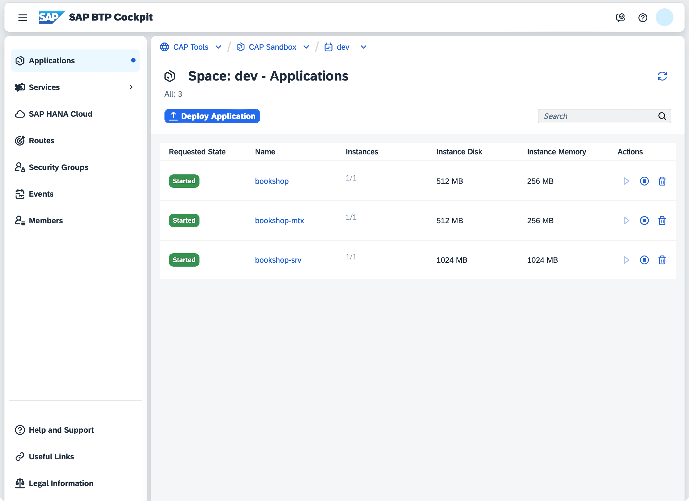

# Deploy to Cloud Foundry

{{ $frontmatter.synopsis }}

[[toc]]

## Intro & Overview

After completing the functional implementation of your CAP application by following the [Getting Started](../../get-started/in-a-nutshell) or [Cookbook](../) guides, you would finally deploy it to the cloud for production. The essential steps are illustrated in the following graphic:

{style="margin: 30px auto"}

First, you apply these steps manually in an ad-hoc deployment, as described in this guide. Then, after successful deployment, you automate them using [CI/CD pipelines](cicd).

<ImplVariantsHint />

## Prerequisites

The following sections are based on a new project that you can create like this:

<div class="impl node">

```sh
cds init bookshop --add sample
cd bookshop
```

::: details Alternatively, download or clone the sample repository

Exercise the following steps in the `bookshop` subfolder of the [`cloud-cap-samples`](https://github.com/sap-samples/cloud-cap-samples) repo:

```sh
git clone https://github.com/sap-samples/cloud-cap-samples samples
cd samples/bookshop
```

:::

</div>

<div class="impl java">

```sh
cds init bookshop --java --add sample
cd bookshop
```

> If you want to use a ready-to-be-deployed sample, see our [java/samples](https://github.com/sap-samples/cloud-cap-samples-java).

[Learn more about Setting Up Local Development.](../../java/getting-started#local){.learn-more}
</div>

<br>

In addition, you need to prepare the following:

#### 1. SAP BTP with SAP HANA Cloud Database Up and Running {#btp-and-hana}

- Access to [SAP BTP, for example a trial](https://developers.sap.com/tutorials/hcp-create-trial-account.html)
- An [SAP HANA Cloud database running](https://help.sap.com/docs/hana-cloud/sap-hana-cloud-administration-guide/create-sap-hana-database-instance-using-sap-hana-cloud-central) in your subaccount <!--, mapped to your space -->
- Entitlement for [`hdi-shared` service plan](https://help.sap.com/docs/hana-cloud/sap-hana-cloud-getting-started-guide/set-up-schema-or-hdi-container-cloud-foundry) for your subaccount
- A [Cloud Foundry space](https://help.sap.com/docs/btp/sap-business-technology-platform/create-spaces?version=Cloud)
<!-- - A Cloud Foundry quota plan assigned to your space -->
::: tip Starting the SAP HANA database takes several minutes
Therefore, we recommend doing these steps early on. In trial accounts, you need to start the database **every day**.
:::

#### 2. Latest Versions of `@sap/cds-dk` {#latest-cds}

Ensure you have the latest version of `@sap/cds-dk` installed globally:

```sh
npm -g outdated       #> check whether @sap/cds-dk is listed
npm i -g @sap/cds-dk  #> if necessary
```

<div class="impl node">

Likewise, ensure the latest version of `@sap/cds` is installed in your project:

```sh
npm outdated          #> check whether @sap/cds is listed
npm i @sap/cds        #> if necessary
```

</div>

#### 3. Cloud MTA Build Tool {#mbt}

- Run `mbt` in a terminal to check whether you've installed it.
- If not, install it according to the [MTA Build Tool's documentation](https://sap.github.io/cloud-mta-build-tool/download).
- For macOS/Linux machines best is to install using `npm`:

  ```sh
  npm i -g mbt
  ```

- For Windows, [please also install `GNU Make`](https://sap.github.io/cloud-mta-build-tool/makefile/).

#### 4. Cloud Foundry CLI w/ MTA Plugins {#cf-cli}

- Run `cf -v` in a terminal to check whether you've installed version **8** or higher.
- If not, install or update it according to the [Cloud Foundry CLI documentation](https://github.com/cloudfoundry/cli#downloads).
- In addition, ensure to have the [MTA plugin for the Cloud Foundry CLI](https://github.com/cloudfoundry-incubator/multiapps-cli-plugin/tree/master/README.md) installed.

   ```sh
   cf add-plugin-repo CF-Community https://plugins.cloudfoundry.org
   cf install-plugin -f multiapps
   cf install-plugin -f html5-plugin
   ```

## Prepare for Production {#prepare-for-production}

If you followed CAP's grow-as-you-go approach, you've developed your application with an in-memory database and basic (mocked) authentication. In the cloud, you typically use production-grade services like SAP HANA and authentication providers.

The `cds add <facets>` command ensures required services are configured correctly and their dependencies are added to your _package.json_.

### 1. SAP HANA Database

<div class="impl node">

While we used SQLite as a low-cost stand-in during development, we're using an SAP HANA Cloud database for production:

</div>

<div class="impl java">

While we used SQLite or H2 as a low-cost stand-in during development, we're going to use an SAP HANA Cloud database for production:

</div>

```sh
cds add hana
```

[Learn more about using SAP HANA for production.](../databases-hana){.learn-more}

### 2. Authorization/Authentication

Configure your app for XSUAA-based authentication:

```sh
cds add xsuaa
```

::: tip This will also generate an `xs-security.json` file
The roles/scopes are derived from authorization-related annotations in your CDS models. Ensure to rerun `cds compile --to xsuaa`, as documented in the [_Authorization_ guide](/guides/security/authorization#xsuaa-configuration) whenever there are changes to these annotations.
:::

[Learn more about SAP Authorization and Trust Management/XSUAA.](https://discovery-center.cloud.sap/serviceCatalog/authorization-and-trust-management-service?region=all){.learn-more}

### 3. MTA-Based Deployment { #add-mta-yaml}

We'll be using the [Cloud MTA Build Tool](https://sap.github.io/cloud-mta-build-tool/) to execute the deployment. The modules and services are configured in an `mta.yaml` deployment descriptor file, which we generate with:

```sh
cds add mta
```

[Learn more about MTA-based deployment.](https://help.sap.com/products/BTP/65de2977205c403bbc107264b8eccf4b/d04fc0e2ad894545aebfd7126384307c.html?locale=en-US){.learn-more}

### 4. App Router as Gateway { #add-app-router}

The _App Router_ acts as a single point-of-entry gateway to route requests to. In particular, it ensures user login and authentication in combination with XSUAA.

Two deployment options are available:

- **Managed App Router**: for SAP Build Work Zone, the Managed App Router provided by SAP Fiori Launchpad is available.
- **Custom App Router**: for custom scenarios without SAP Fiori Launchpad, the App Router needs to be deployed along with your application.
  In this case, use the following command to enhance the application configuration:

    ```sh
    cds add approuter
    ```

[Learn more about the SAP BTP Application Router.](https://help.sap.com/products/BTP/65de2977205c403bbc107264b8eccf4b/01c5f9ba7d6847aaaf069d153b981b51.html?locale=en-US){.learn-more}

### 5. User Interfaces { #add-ui }

#### Option A: SAP Cloud Portal

If you intend to deploy user interface applications, you also need to set up the [HTML5 Application Repository](https://discovery-center.cloud.sap/serviceCatalog/html5-application-repository-service) in combination with the [SAP Cloud Portal service](https://discovery-center.cloud.sap/serviceCatalog/cloud-portal-service):

```sh
cds add portal
```

#### Option B: SAP Build Work Zone, Standard Edition <Beta />

For **single-tenant applications**, you can use [SAP Build Work Zone, Standard Edition](https://discovery-center.cloud.sap/serviceCatalog/sap-build-work-zone-standard-edition):

```sh
cds add workzone
```

**Important:** This also requires you to set up SAP Build Work Zone, Standard Edition [according to the SAP Learning tutorial](https://developers.sap.com/tutorials/spa-configure-workzone.html).

### 6. Optional: Multitenancy { #add-multitenancy }

To enable multitenancy for production, run the following command:

```sh
cds add multitenancy
```

[Learn more about MTX services.](../multitenancy/#behind-the-scenes){.learn-more}

<br>

::: tip You're set!
The previous steps are required _only once_ in a project's lifetime. With that done, we can repeatedly deploy the application.
:::

<br>


## Build and Deploy

Make sure you are logged in to Cloud Foundry and target the space you want to deploy to:
```sh
cf login --sso  # to log on with SAP Universal ID
cf target
```
[Learn more about `cf login`](https://help.sap.com/products/BTP/65de2977205c403bbc107264b8eccf4b/7a37d66c2e7d401db4980db0cd74aa6b.html){.learn-more}

::: tip Prevent outdated lock file issues
If your project already includes a _package-lock.json_, run `npm update` to make sure it’s in sync with your _package.json_ before proceeding.
:::

You can now freeze dependencies, build, and deploy the application:

```sh
cds up
```

::: details Essentially, this automates the following steps...

```sh
# Installing app dependencies, e.g.
npm i app/browse
npm i app/admin-books

# If project is monorepo
ln -sf ../package-lock.json

# If project is multitenant
npm i --package-lock-only --prefix mtx/sidecar

# If package-lock.json doesn't exist
npm i --package-lock-only

# Final assembly and deployment...
mbt build -t gen --mtar mta.tar
cf deploy gen/mta.tar -f
```
:::

::: details Test with `cds build`

While `cds build` is already ran as part of `mbt build` in `cds up`, you can also run it standalone to inspect what is generated for production:

```sh
cds build --production
```

[Learn more about running and customizing `cds build`.](custom-builds){.learn-more style="margin-top: 10px"}

:::

[Got errors? See the troubleshooting guide.](../../get-started/troubleshooting#mta){.learn-more style="margin-top: 10px"}
[Learn how to reduce the MTA archive size **during development**.](../../get-started/troubleshooting#reduce-mta-size){.learn-more}

This process can take some minutes and finally logs an output like this:

```log
[…]
Application "bookshop" started and available at
"[org]-[space]-bookshop.<landscape-domain>.com"
[…]
```

You can use this URL to access the App Router as the entry point of your application.

For **multitenant applications**, you have to subscribe a tenant first. The application is accessible via a tenant-specific App Router URL after subscription.

::: info SaaS Extensibility
Share the generic App-Router URL with SaaS consumers for logging in as extension developers using `cds login` or other [extensibility-related commands](../extensibility/customization#prep-as-operator).
:::

::: tip No index page and SAP Fiori preview in the cloud
The default index page and [SAP Fiori preview](../../advanced/fiori#sap-fiori-preview), that you are used to seeing during local development, are only meant for the development profile and not available in the cloud. For productive applications, you should add a proper SAP Fiori elements application through on of the [user interface options](#add-ui) outlined before.
:::

### Inspect Apps in BTP Cockpit

Visit the "Applications" section in your [SAP BTP cockpit](https://help.sap.com/docs/BTP/65de2977205c403bbc107264b8eccf4b/144e1733d0d64d58a7176e817fa6aeb3.html) to see the deployed apps:



::: tip Next up: Assign the _admin_ role
In order to access the admin APIs you need to assign the _admin_ role required by `AdminService`. Create a role collection and [assign the role and your user](https://developers.sap.com/tutorials/btp-app-role-assignment.html) to get access.
:::

[Got errors? See the troubleshooting guide.](../../get-started/troubleshooting#cflogs-recent){.learn-more}


## Keep Dependencies Up-to-date { #freeze-dependencies }

Deployed applications should freeze all their dependencies, including transient ones. Therefore, on first execution, `cds up` creates a _package-lock.json_ file for all application modules.

It is **essential to regularly update dependencies** to consume latest bug fixes and improvements. Not doing so will increase the risk of **security vulnerabilities**, expose your application to **known bugs**, and make future upgrades significantly harder and more time-consuming.

We recommend setting up [Dependabot](https://docs.github.com/en/code-security/dependabot), [Renovate](https://docs.renovatebot.com/) or similar automated solutions to update dependencies **one-by-one** to easily identify breaking changes, minimize risks, and ensure continuous compatibility and **stability of your application**.


## Upgrade Tenants {.java}

The CAP Java SDK offers `main` methods for Subscribe/Unsubscribe in the classes `com.sap.cds.framework.spring.utils.Subscribe/Unsubscribe` that can be called from the command line. This way, you can run the tenant subscribe/unsubscribe for the specified tenant. This would trigger also your custom handlers, which is useful for the local testing scenarios.

In order to register all handlers of the application properly during the execution of a tenant operation `main` method, the component scan package must be configured. To set the component scan, the property <Config java>cds.multitenancy.component-scan</Config> must be set to the package name of your application.

The handler registration provides additional information that is used for the tenant subscribe, for example, messaging subscriptions that are created.

::: warning The MTX sidecar must be running
You can stop the CAP Java backend when you call this method, but the MTX sidecar application must be running!
:::

This synchronization can also be automated, for example using [Cloud Foundry Tasks](https://docs.cloudfoundry.org/devguide/using-tasks.html) on SAP BTP and [Module Hooks](https://help.sap.com/products/BTP/65de2977205c403bbc107264b8eccf4b/b9245ba90aa14681a416065df8e8c593.html) in your MTA.

The `main` method optionally takes tenant ID (string) as the first input argument and tenant options (JSON string) as the second input argument. Alternatively, you can use the environment variables `MTCOMMAND_TENANTS` and `MTCOMMAND_OPTIONS` instead of arguments. The command-line arguments have higher priority, so you can use them to override the environment variables.

The method returns the following exit codes.

| Exit Code  | Result                                                                                                              |
|-----------:|---------------------------------------------------------------------------------------------------------------------|
| 0          | Tenant subscribed/unsubscribed successfully.                                                                        |
| 3          | Failed to subscribe/unsubscribe the tenant. Rerun the procedure to make sure the tenant is subscribed/unsubscribed. |

To run this method locally, use the following command where `<jar-file>` is the one of your applications:

::: code-group

```sh [&gt;= Spring Boot 3.2.0]
java -cp <jar-file> -Dloader.main=com.sap.cds.framework.spring.utils.Subscribe/Unsubscribe org.springframework.boot.loader.launch.PropertiesLauncher <tenant> [<tenant options>]
```

```sh [&lt; Spring Boot 3.2.0]
java -cp <jar-file> -Dloader.main=com.sap.cds.framework.spring.utils.Subscribe/Unsubscribe org.springframework.boot.loader.PropertiesLauncher <tenant> [<tenant options>]
```

:::

In the SAP BTP, Cloud Foundry environment, it can be tricky to construct such a command. The reason is that the JAR file is extracted by the Java buildpack and the place of the Java executable isn't easy to determine. Also the place differs for different Java versions. Therefore, we recommend adapting the start command that is generated by the buildpack and run the adapted command:

::: code-group

```sh [&gt;= Spring Boot 3.2.0]
sed -i 's/org.springframework.boot.loader.launch.JarLauncher/org.springframework.boot.loader.launch.PropertiesLauncher/g' /home/vcap/staging_info.yml && sed -i 's/-Dsun.net.inetaddr.negative.ttl=0/-Dsun.net.inetaddr.negative.ttl=0 -Dloader.main=com.sap.cds.framework.spring.utils.Subscribe/Unsubscribe/g' /home/vcap/staging_info.yml && jq -r .start_command /home/vcap/staging_info.yml | sed 's/^/ MTCOMMAND_TENANTS=my-tenant [MTCOMMAND_TENANTS=<tenant options>]/' | bash
```

```sh [&lt; Spring Boot 3.2.0]
sed -i 's/org.springframework.boot.loader.JarLauncher/org.springframework.boot.loader.PropertiesLauncher/g' /home/vcap/staging_info.yml && sed -i 's/-Dsun.net.inetaddr.negative.ttl=0/-Dsun.net.inetaddr.negative.ttl=0 -Dloader.main=com.sap.cds.framework.spring.utils.Subscribe/Unsubscribe/g' /home/vcap/staging_info.yml && jq -r .start_command /home/vcap/staging_info.yml | sed 's/^/ MTCOMMAND_TENANTS=my-tenant [MTCOMMAND_TENANTS=<tenant options>]/' | bash
```

```sh [Java 8]
sed -i 's/org.springframework.boot.loader.JarLauncher/-Dloader.main=com.sap.cds.framework.spring.utils.Subscribe/Unsubscribe org.springframework.boot.loader.PropertiesLauncher/g' /home/vcap/staging_info.yml && jq -r .start_command /home/vcap/staging_info.yml | sed 's/^/ MTCOMMAND_TENANTS=my-tenant [MTCOMMAND_TENANTS=<tenant options>]/' | bash
```

:::

<!--
---
{style="margin-top:11em"}

# Appendices

## Deploy using `cf push`

As an alternative to MTA-based deployment, you can choose Cloud Foundry-native deployment using [`cf push`](https://docs.cloudfoundry.org/devguide/push.html), or `cf create-service-push` respectively.

### Prerequisites

Install the [_Create-Service-Push_ plugin](https://github.com/dawu415/CF-CLI-Create-Service-Push-Plugin):

```sh
cf install-plugin Create-Service-Push
```

This plugin acts the same way as `cf push`, but extends it such that services are _created_ first.  With the plain `cf push` command, this is not possible.

### Add a `manifest.yml` {#add-manifest}

```sh
cds add cf-manifest
```

This creates two files, a _manifest.yml_ and _services-manifest.yml_ in the project root folder.

- _manifest.yml_ holds the applications. In the default layout, one application is the actual server holding the service implementations, and the other one is a 'DB deployer' application, whose sole purpose is to start the SAP HANA deployment.
- _services-manifest.yml_ defines which Cloud Foundry services shall be created. The services are derived from the service bindings in _package.json_ using the [`cds.requires` configuration](../../node.js/cds-env#services).

::: tip Version-control manifest files
Unlike the files in the _gen_ folders, these manifest files are genuine sources and should be added to the version control system. This way, you can adjust them to your needs as you evolve your application.
:::

### Build the Project

This prepares everything for deployment, and -- by default -- writes the build output, that is the deployment artifacts, to folder _./gen_ in your project root.

```sh
cds build --production
```

[Learn how `cds build` can be configured.](custom-builds#build-config){.learn-more}

The `--production` parameter ensures that the cloud deployment-related artifacts are created by `cds build`. See section [SAP HANA database deployment](../databases-hana) for more details.

### Push the Application { #push-the-application}

This command creates service instances, pushes the applications and binds the services to the application with a single call:

```sh
cf create-service-push
```

During deployment, the plugin reads the _services-manifest.yml_ file and creates the services listed there. It then reads _manifest.yml_, pushes the applications defined there, and binds these applications to service instances created before. If the service instances already exist, only the `cf push` operation will be executed.

You can also apply some shortcuts:

- Use `cf push` directly to deploy either all applications, or `cf push <app-name>` to deploy a single application.
- Use `cf create-service-push --no-push` to only create or update service-related data without pushing the applications.

In the deployment log, find the application URL in the `routes` line at the end:

```log{3}
name:              bookshop-srv
requested state:   started
routes:            bookshop-srv.cfapps.sap.hana.ondemand.com
```

Open this URL in the browser and try out the provided links, for example, `…/browse/Books`. Application data is fetched from SAP HANA.
::: tip Ensure successful SAP HANA deployment
Check the deployment logs of the database deployer application using

```sh
cf logs <app-name>-db-deployer --recent
```

to ensure that SAP HANA deployment was successful. The application itself is by default in state `started` after HDI deployment has finished, even if the HDI deployer returned an error. To save resources, you can explicitly stop the deployer application afterwards.
:::


::: warning
Multitenant applications are not supported yet as multitenancy-related settings are not added to the generated descriptors. The data has to be entered manually.
:::

[Got errors? See the troubleshooting guide.](../../get-started/troubleshooting#aborted-deployment-with-the-create-service-push-plugin){.learn-more} -->
