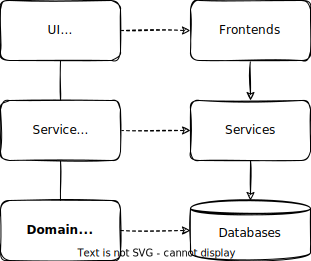

# Domain Modeling

Domain Models capture the static, data-related aspects of a problem domain in terms of entity-relationship models. They serve as the basis for *[persistence models](./databases)* deployed to databases as well as for *[service definitions](./providing-services)*.

[[toc]]

## Introduction

### Capture Intent — *What, not How!*

CDS focuses on *conceptual modelling*: we want to capture intent, not imperative implementations — that is: What, not How. Not only does that keep domain models concise and comprehensible, it also allows us to provide optimized generic implementations.

For example, given an entity definition like that:

```cds
using { cuid, managed } from '@sap/cds/common';
entity Books : cuid, managed {
   title  : localized String;
   descr  : localized String;
   author : Association to Authors;
}
```

In that model we used the [pre-defined aspects](../cds/common.md) `cuid` and `managed`, as well as the [qualifier `localized`](./localized-data#declaring-localized-data) to capture generic aspects. We also used [managed associations](#associations).

In all these cases, we focus on capturing our intent, while leaving it to generic implementations to provide best-possible implementations.

### Entity-Relationship Modeling

Entity-Relationship Modelling (ERM) is likely the most widely known and applied conceptual modelling technique for data-centric applications. It is also one of the foundations for CDS.

Assume we had been given this requirement:

>  _"We want to create a bookshop allowing users to browse **Books** and **Authors**, and <u>navigate</u> from Books to Authors and vice versa. Books are classified by **Genre**"._

Using CDS, we would translate that into an initial domain model as follows:

```cds
using { cuid } from '@sap/cds/common';

entity Books : cuid {
  title  : String;
  descr  : String;
  genre  : Genre;
  author : Association to Authors;
}

entity Authors : cuid {
  name   : String;
  books  : Association to many Books on books.author = $self;
}

type Genre : String enum {
  Mystery; Fiction; Drama;
}
```


### Aspect-oriented Modeling

CDS Aspects and Annotations provide powerful means for **separation of concerns**. This greatly helps to keep our core domain model clean, while putting secondary concerns into separate files and model fragments. → Find details in chapter [Aspects](#aspects) below.

### Fueling Generic Providers

As depicted in the illustration below, domain models serve as the sources for persistence models, deployed to databases, as well as the underlying model for services acting as API facades to access data.



The more we succeeded in capturing intent over imperative implementations, the more we can provide optimized generic implementations.

### Domain-Driven Design

::: tip CAP shares these goals and approaches with [Domain-driven Design](https://en.wikipedia.org/wiki/Domain-driven_design):

1. Placing projects' primary **focus on the core domain**
2. Close collaboration of **developers** and **domain experts**
3. Iteratively refining **domain knowledge**

:::

We use CDS as our ubiquitous modelling language, with CDS Aspects giving us the means to separate core domain aspects from generic aspects. CDS's human-readable nature fosters collaboration of developers and domain experts.

As CDS models are used to fuel generic providers — the database as well as application services — we ensure the models are applied in the implementation. And as coding is minimized we can more easily refine and revise our models, without having to refactor large boilerplate code based.


## Best Practices


### Keep it Simple, Stupid

Domain modeling is a means to an end; your clients and consumers are the ones who have to understand and work with your models the most, much more than you as their creator. Keep that in mind and understand the task of domain modeling as a service to others.

::: tip **Keep models *concise* and *comprehensible***

As said in the *["Keep it simple, stupid!"](https://en.wikipedia.org/w/index.php?title=KISS_principle&oldid=992997588)* wikipedia entry: *"... most systems work best if they're kept simple rather than made complicated; therefore, [simplicity](https://en.wikipedia.org/wiki/Simplicity) should be a key goal in [design](https://en.wikipedia.org/wiki/Design), and unnecessary complexity should be avoided."*

:::

::: warning **Avoid overly abstract models**

Even though domain models should abstract from technical implementations, don't overstress this and balance it with ease of adoption. For example if the vast majority of your clients use relational databases, don't try to overly abstract from that, as that would have all suffer from common denominator syndromes.

:::


#### Prefer Flat Models

While CDS provides great support for structured types, you should always think twice before using this, as several technologies that you or your customers might want to integrate with, may have difficulties with this. Moreover, flat structures are easier to understand and consume.

##### **Good:** {.good}

```cds
entity Contacts {
  isCompany : Boolean;
  company   : String;
  title     : String;
  firstname : String;
  lastname  : String;
}
```

##### **Bad:** {.bad}

```cds
entity Contacts {
  isCompany   : Boolean;
  companyData : CompanyDetails;
  personData  : PersonDetails;
}
type CompanyDetails {
  name : String;
}
type PersonDetails {
  titles : AcademicTitles;
  name   : PersonName;
}
type PersonName : {
  first  : String;
  last   : String;
}
type AcademicTitles : {
  primary   : String;
  secondary : String;
}
```


### Separation of Concerns

As highlighted with a few samples in the chapter above, always strive to keep your core domain model clean, concise and comprehensible.

CDS Aspects help you to do so, by decomposing models and definitions into separate files with potentially different life cycles, contributed by different _people_.

We strongly recommend to make use of that as much as possible.


### Naming Conventions

We recommend adopting the following simple naming conventions as commonly used in many communities, for example, Java, JavaScript, C, SQL, etc.

To easily distinguish type / entity names  from elements names we recommend to...

::: tip Capitalize *Type / Entity* Names

* Start **_entity_** and **_type_** names with capital letters — e.g., `Authors`
* Start **_elements_** with a lowercase letter — e.g., `name`

:::

As entities represent not only data types, but also data sets, from which we can read from, we recommend following common SQL convention:

::: tip Pluralize *Entity* Names

* Use **plural** form for **_entities_** — e.g., `Authors`
* Use **singular** form for **_types_** — e.g., `Genre`

:::

In general always prefer conciseness, comprehensibility and readability, and avoid overly lenghty names, probably dictated by overly strict systematics:

::: tip Prefer *Concise* Names

- Don't repeat contexts &rarr; e.g. `Authors.name` instead of `Authors.authorName`
- Prefer one-word names &rarr;  e.g. `address` instead of `addressInformation`
- Use `ID` for technical primary keys &rarr; see also [Use Canonic Primary Keys](#prefer-canonic-keys)

:::


## Core Concepts


### Namespaces

You can use [namespaces](../cds/cdl#namespaces) to get to unique names without bloating your code with fully qualified names. For example:

```cds
namespace foo.bar;
entity Boo {}
entity Moo : Boo {}
```

... is equivalent to:

```cds
entity foo.bar.Boo {}
entity foo.bar.Moo : foo.bar.Boo {}
```

Note:

- **Namespaces are just prefixes** — which are automatically applied to all relevant names in a file. Beyond this there's nothing special about them.
- **Namespaces are optional** — use namespaces if your models might be reused in other projects; otherwise, you can go without namespaces.
- The **reverse domain name** approach works well for choosing namespaces.

::: warning

Avoid short-lived ingredients in namespaces, or names in general, such as your current organization's name, or project code names.

:::


### Domain Entities

Entities represent a domain's data. When translated to persistence models, especially relational ones, entities become tables.

Entity definitions essentially declare structured types with named and typed elements, plus the [primary key](#primary-keys) elements used to identify entries.

```cds
entity name {
   key element1 : Type;
       element2 : Type;
   ...
}
```

[Learn more about entity definitions](../cds/cdl.md#entity-and-type-definitions){.learn-more}


#### Views / Projections

Borrowing powerful view building from SQL, we can declare entities as (denormalized) views on other entities:

```cds
entity ProjectedEntity as select from BaseEntity {
   element1, element2 as name, /*...*/
};
```

[Learn more about views and projections](../cds/cdl.md#views-and-projections){.learn-more}


### Primary Keys

Use the keyword `key` to signify one or more elements that form an entity's primary key:

```cds
entity Books {
  key ID : UUID; // [!code focus]
  ...
}
```

##### Do: {.good}

- [Prefer ***simple***, ***technical*** primary keys](#prefer-simple-technical-keys)
- [Prefer ***canonic*** primary keys](#prefer-canonic-keys)
- [Prefer ***UUIDs*** for primary keys](#prefer-uuids-for-keys)

##### Don't: {.bad}

- Don't use binary data as keys!
- [Don't interpret UUIDs!](#don-t-interpret-uuids)

#### Prefer Simple, Technical Keys

While you can use arbitrary combinations of fields as primary keys, keep in mind that primary keys are frequently used in joins all over the place. And the more fields there are to compare for a join the more you'll suffer from poor performance. So prefer primary keys consisting of single fields only.

Moreover, primary keys should be immutable, that means once assigned on creation of a record they should not change subsequently, as that would break references you might have handed out. Think of them as a fingerprint of a record.

#### Prefer Canonic Keys

We recommend using canonically named and typed primary keys, as promoted [by aspect `cuid` from @sap/cds/common](../cds/common.md#aspect-cuid).

```cds
// @sap/cds/common
aspect cuid { key ID : UUID }
```

```cds
using { cuid } from '@sap/cds/common';
entity Books : cuid { ... }
entity Authors : cuid { ... }
```

This eases the implementation of generic functions that can apply the same ways of addressing instances across different types of entities.

#### Prefer UUIDs for Keys

While UUIDs certainly come with an overhead and a performance penalty when looking at single databases, they have several advantages when we consider the total bill. So, you can avoid [the evil of premature optimization](https://wiki.c2.com/?PrematureOptimization) by at least considering these points:

* **UUIDs are universal** — that means that they're unique across every system in the world, while sequences are only unique in the source system's boundaries. Whenever you want to exchange data with other systems you'd anyways add something to make your records 'universally' addressable.

* **UUIDs allow distributed seeds** — for example, in clients. In contrast, database sequences or other sequential generators always need a central service, for example, a single database instance and schema. This becomes even more a problem in distributed landscape topologies.

* **Database sequences are hard to guess** — assume that you want to insert a _SalesOrder_ with three _SalesOrderItems_ in one transaction. INSERT _SalesOrder_ will automatically get a new ID from the sequence. How would you get this new ID in order to use it for the foreign keys in subsequent INSERTs of the _SalesOrderItems_?

* **Auto-filled primary keys** — primary key elements with type UUID are automatically filled by generic service providers in Java and Node.js upon INSERT.

::: tip Prefer UUIDs for Keys

* Use DB sequences only if you really deal with high data volumes.
* Otherwise, prefer UUIDs.

:::

You can also have semantic primary keys such as order numbers constructed by customer name+date, etc. And if so, they usually range between UUIDs and DB sequences with respect to the pros and cons listed above.

#### Don't Interpret UUIDs! {.bad}

It is an unfortunate anti pattern to validate UUIDs, such as for compliance to [RFC 4122](https://tools.ietf.org/html/rfc4122). This not only means useless processing, it also impedes integration with existing data sources. For example, ABAP's [**GUID_32s**](https://www.sapdatasheet.org/abap/dtel/guid_32.html) are uppercase without hyphens.

**UUIDs are unique opaque values!** — The only assumption required and allowed is that UUIDs are unique so that they can be used for lookups and compared by equality — nothing else! It's the task of the UUID generator to ensure uniqueness, not the task of subsequent processors!

On the same note, converting UUID values obtained as strings from the database into binary representations such as `java.lang.UUID`, only to render them back to strings in responses to HTTP requests, is useless overhead.

::: warning

* Avoid unnecessary assumptions, for example, about uppercase or lowercase
* Avoid useless conversions, for example, from strings to binary and back
* Avoid useless validations of UUID formats, for example, about hyphens

:::

[See also: Mapping UUIDs to OData](../advanced/odata#override-type-mapping) {.learn-more}

[See also: Mapping UUIDs to SQL](../advanced/hana#mapping-uuids-to-sql) {.learn-more}


### Data Types

#### Standard Built-in Types

CDS comes with a small set of built-in types:

- `UUID`,
- `Boolean`,
- `Date`, `Time`, `DateTime`, `Timestamp`
- `Integer`, `UInt8`, `Int16`, `Int32`, `Int64`
- `Double`, `Decimal`
- `String`, `LargeString`
- `Binary`, `LargeBinary`

[See list of **Built-in Types** in the CDS reference docs](../cds/types.md#built-in-types){.learn-more}

#### Common Reuse Types

In addition, a set of common reuse types and aspects is provided with package [_`@sap/cds/common`_](../cds/common.md), such as:

- Types `Country`, `Currency`, `Language` with corresponding value list entities
- Aspects `cuid`, `managed`, `temporal`

For example, usage is as simple as this:

```cds
using { Country } from '@sap/cds/common';
entity Addresses : managed { //> using reuse aspect
  street  : String;
  town    : String;
  country : Country; //> using reuse type
}
```

[Learn more about reuse types provided by _`@sap/cds/common`_.](../cds/common.md){.learn-more}

::: tip **Use common reuse types and aspects**...

... to keep models concise, and benefitting from improved interoperability, proven best practices, and out-of-the-box support through generic implementations in CAP runtimes.
:::

#### Custom-defined Types

Declare custom-defined types to increase semantic expressiveness of your models, or to share details and annotations as follows:

```cds
type User : String; //> merely for increasing expressiveness
type Genre : String enum { Mystery; Fiction; ... }
type DayOfWeek : Number @assert.range:[1,7];
```


#### Use Custom Types Reasonably

Avoid overly excessive use of custom-defined types. They're valuable when you have a decent **reuse ratio**. Without reuse, your models just become harder to read and understand, as one always has to look up respective type definitions, as in the following example:

```cds
using { sap.capire.bookshop.types } from './types';
namespace sap.capire.bookshop;
entity Books {
  key ID : types.BookID;
  name : types.BookName;
  descr : types.BookDescr;
  ...
}
```

```cds
// types.cds
namespace sap.capire.bookshop.types;
type BookID : UUID;
type BookName : String;
type BookDescr : String;
```


### Associations

Use _Associations_ to capture relationships between entities.

```cds
entity Books { ...
  author : Association to Authors; //> to one
}
entity Authors { ...
  books : Association to many Books on books.author = $self;
}
```

[Learn more about Associations in the _CDS Language Reference_](../cds/cdl#associations){ .learn-more}

#### Managed :1 Associations

The association `Books:author` in the sample above is a so-called *managed* association, with foreign key columns and on conditions added automatically behind the scenes.

```cds
entity Books { ...
  author : Association to Authors;
}
```

In contrast to that we could also use *unmanaged* associations with all foreign keys and on conditions specified manually:

```cds
entity Books { ...
  author : Association to Authors on author.ID = author_ID;
  author_ID : type of Authors:ID;
}
```

>  Note: To-many associations are unmanaged by nature as we always have to specify an on condition. Reason for that is that backlink associations or foreign keys cannot be guessed reliably.

::: tip Prefer managed associations

For the sake of conciseness and comprehensibility of your models always prefer *managed Associations* for to-one associations.

:::

#### To-Many Associations

Simply add the `many` qualifier keyword to indicate a to-many cardinality:

```cds
entity Authors { ...
  books : Association to many Books;
}
```

If your models are meant to target APIs, this is all that is required. When targeting databases though, we need to add an `on` condition, like so:

```cds
entity Authors { ...
  books : Association to many Books on books.author = $self;
}
```

> The `on` condition can either compare a backlink association to `$self`, or a backlink foreign key to the own primary key, e.g. `books.author.ID = ID`.

#### Many-to-Many Associations

CDS currently doesn't provide dedicated support for _many-to-many_ associations. Unless we add some, you have to resolve _many-to-many_ associations into two _one-to-many_ associations using a link entity to connect both. For example:

```cds
entity Projects { ...
  members : Composition of many Members on members.project = $self;
}
entity Users { ...
  projects : Composition of many Members on projects.user = $self;
}
entity Members { // link table
  key project : Association to Projects;
  key user : Association to Users;
}
```

We can use [_Compositions of Aspects_](#composition-of-aspects) to reduce noise a bit:

```cds
entity Projects { ...
  members : Composition of many { key user : Association to Users };
}
entity Users { ...
  projects : Composition of many Projects.members on projects.member = $self;
}
```

Behind the scenes the equivalent of the model above would be generated, with the link table called `Projects.members` and the backlink association to `Projects` in there called `up_`.

### Compositions

Compositions represent contained-in relationships. CAP runtimes provide these special treatments to Compositions out of the box:

- **Deep Insert / Update** automatically filling in document structures
- **Cascaded Delete** is when deleting Composition roots
- **Composition** targets are **auto-exposed** in service interfaces

#### Modeling Document Structures

Compositions are used to model document structures. For example, in the following definition of `Orders`, the `Orders:Items` composition refers to the `OrderItems` entity, with the entries of the latter being fully dependent objects of `Orders`.

```cds
entity Orders { ...
  Items : Composition of many OrderItems on Items.parent = $self;
}
entity OrderItems { // to be accessed through Orders only
  key parent : Association to Orders;
  key pos    : Integer;
  quantity   : Integer;
}
```

[Learn more about Compositions in the _CDS Language Reference_](../cds/cdl#compositions){ .learn-more}

#### Composition of Aspects

We can use anonymous inline aspects to rewrite the above with less noise as follows:

```cds
entity Orders { ...
  Items : Composition of many {
    key pos  : Integer;
    quantity : Integer;
  };
}
```

[Learn more about Compositions of Aspects in the _CDS Language Reference_](../cds/cdl#managed-compositions){ .learn-more}

Behind the scenes this will add an entity named `Orders.Items` with a backlink association named `up_`, so effectively generating the same model as above.

## Aspects

CDS's [Aspects](../cds/cdl.md#aspects) provide powerful mechanisms to separate concerns. It allows decomposing models and definitions into separate files with potentially different life cycles, contributed by different _people_.

The basic mechanism use the `extend` or `annotate` directives to add secondary aspects to a core domain entity like so:

```cds
extend Books with {
   someAdditionalField : String;
}
```

```cds
annotate Books with @some.entity.level.annotations {
  title @some.field.level.annotations;
};
```

Variants of this allow declaring and applying **named aspects** like so:

```cds
aspect NamedAspect { someAdditionalField : String }
extend Books with NamedAspect;
```

We can also apply named aspects as **includes** in an inheritance-like syntax:

```cds
entity Books : NamedAspect { ... }
```

[Learn more about Aspects in the _CDS Language Reference_](../cds/cdl#aspects){ .learn-more}

::: tip

Consumers always see the merged effective models, with the separation into aspects fully transparent to them.

:::


### Authorization

CAP supports out-of-the-box authorization by annotating services and entities with `@requires` and `@restrict` annotations like that:

```cds
entity Books @(restrict: [
  { grant: 'READ',   to: 'authenticated-user' },
  { grant: 'CREATE', to: 'content-maintainer' },
  { grant: 'UPDATE', to: 'content-maintainer' },
  { grant: 'DELETE', to: 'admin' },
]) {
  ...
}
```

To avoid polluting our core domain model with the generic aspect of authorization, we can use aspects to separate concerns, putting the authorization annotations into a separate file, maintained by security experts like so:

```cds
// core domain model in schema.cds
entity Books { ... }
entity Authors { ... }
```

```cds
// authorization model
using { Books, Authors } from './schema.cds';

annotate Books with @restrict: [
  { grant: 'READ',   to: 'authenticated-user' },
  { grant: 'CREATE', to: 'content-maintainer' },
  { grant: 'UPDATE', to: 'content-maintainer' },
  { grant: 'DELETE', to: 'admin' },
];

annotate Authors with @restrict: [
  ...
];
```


### Fiori Annotations

Similarly to authorization annotations we would frequently add annotations which are related to UIs, starting with `@title`s used for field or column labels in UIs, or specific Fiori annotations in `@UI`, `@Common`, etc. vocabularies.

Also here we strongly recommend to keep the core domain models clean of that, but put such annotation into respective frontend models:

```cds
// core domain model in db/schema.cds
entity Books : cuid { ... }
entity Authors : cuid { ... }
```

```cds
// common annotations in app/common.cds
using { sap.capire.bookshop as my } from '../db/schema';

annotate my.Books with {
  ID     @title: '{i18n>ID}';
  title  @title: '{i18n>Title}';
  genre  @title: '{i18n>Genre}'   @Common: { Text: genre.name, TextArrangement: #TextOnly };
  author @title: '{i18n>Author}'  @Common: { Text: author.name, TextArrangement: #TextOnly };
  price  @title: '{i18n>Price}'   @Measures.ISOCurrency : currency_code;
  descr  @title: '{i18n>Description}'  @UI.MultiLineText;
}
```

```cds
// Specific UI Annotations for Fiori Object & List Pages
using { sap.capire.bookshop as my } from '../db/schema';

annotate my.Books with @(
  Common.SemanticKey : [ID],
  UI: {
    Identification  : [{ Value: title }],
    SelectionFields : [ ID, author_ID, price, currency_code ],
    LineItem        : [
      { Value: ID, Label: '{i18n>Title}' },
      { Value: author.ID, Label: '{i18n>Author}' },
      { Value: genre.name },
      { Value: stock },
      { Value: price },
      { Value: currency.symbol },
    ]
  }
) {
  ID @Common: {
    SemanticObject : 'Books',
    Text: title, TextArrangement : #TextOnly
  };
  author @ValueList.entity: 'Authors';
};
```


### Localized Data

Business applications frequently need localized data, for example to display books titles and descriptions in the user's preferred language. With CDS we simply use the `localized` qualifier to tag respective text fields in your as follows.

#### **Do:** {.good}

```cds
entity Books { ...
  title : localized String;
  descr : localized String;
}
```

#### **Don't:** {.bad}

In contrast to that, this is what you would have to do without CAP's `localized` support:

```cds
entity Books {
  key ID : UUID;
   title : String;
   descr : String;
   texts : Composition of many Books.texts on texts.book = $self;
   ...
}

entity Books.texts {
  key locale : Locale;
  key ID : UUID;
  title  : String;
  descr  : String;
}
```

Essentially, this is also what CAP generates behind the scenes, plus many more things to ease working with localized data and serving it out of the box.

::: tip
By generating `.texts` entities and associations behind the scenes, CAP's **out-of-the-box support** for `localized` data avoids polluting your models with doubled numbers of entities, and detrimental effects on comprehensibility.
:::

[Learn more in the **Localized Data** guide.](./localized-data){.learn-more}


## Managed Data


### `@cds.on.insert` {.annotation}

### `@cds.on.update` {.annotation}

Use the annotations `@cds.on.insert` and `@cds.on.update` to signify elements to be auto-filled by the generic handlers upon insert and update. For example, you could add fields to track who created and updated data records and when:

```cds
entity Foo { //...
   createdAt  : Timestamp @cds.on.insert: $now;
   createdBy  : User      @cds.on.insert: $user;
   modifiedAt : Timestamp @cds.on.insert: $now  @cds.on.update: $now;
   modifiedBy : User      @cds.on.insert: $user @cds.on.update: $user;
}
```

[Learn more about pseudo variables `$now` and `$user` below.](#pseudo-variables	){.learn-more}

These **rules** apply:

- Data *cannot* be filled in from external clients → payloads are cleansed
- Data *can* be filled in from custom handlers or from `.csv` files

::: details Note the differences to [defaults](../cds/cdl#default-values)...

... for example, given this model:

```cds
entity Foo { //...
  managed   : Timestamp @cds.on.insert: $now;
  defaulted : Timestamp default $now;
}
```

While both behave identical for database-level `INSERT`s, they differ for `CREATE` requests on higher-level service providers: Values for `managed` in the request payload will be ignored, while provided values for `default` will be written to the database.

:::

::: tip In Essence:

Managed data fields are filled in automatically and are write-protected for externa clients.
:::

::: warning Limitations
In case of `UPSERT` operations, the handlers for `@cds.on.update` are executed, but not the ones for `@cds.on.insert`.
:::


### Aspect _`managed`_

You can also use the [pre-defined aspect `managed`](../cds/common#aspect-managed) from [@sap/cds/common](../cds/common) to get the very same as by the definition above:

```cds
using { managed } from '@sap/cds/common';
entity Foo : managed { /*...*/ }
```

[Learn more about `@sap/cds/common`](../cds/common){.learn-more}

With this we keep our core domain model clean and comprehensible.


## Pseudo Variables

The pseudo variables used in the annotations above are resolved as follows:

- `$now` is replaced by the current server time (in UTC)
- `$user` is the current user's ID as obtained from the authentication middleware
- `$user.<attr>` is replaced by the value of the respective attribute of the current user
- `$uuid` is replaced by a version 4 UUID

[Learn more about **Authentication** in Node.js.](../node.js/authentication){.learn-more}
[Learn more about **Authentication** in Java.](../java/security#authentication){.learn-more}
