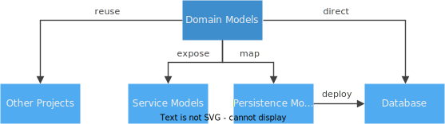

# Domain Modeling with CDS

{{ $frontmatter.synopsis }}

The following figure illustrates this central role of domain models:

{:.adapt}

[See also the introduction in the _About_ page](../../about/#domain-modeling){:.learn-more}

## Capture Intent  &rarr; _What, not How_

Domain Models describe the _static, data-related_ aspects of a problem domain in terms of entity-relationship models. They serve as the basis for *[persistence models](../databases/)* deployed to databases as well as for *[service definitions][services]*. Sometimes, domain models might also be exposed for [reuse in other projects](../extensibility/composition).


### Promoting Domain-Driven Design {:#domain-driven-design}

Similar to [Domain-driven Design](../../about/related#domain-driven-design), a key goal of domain modeling in CAP is to place the primary focus of projects on the problem domain, thereby promoting **close collaboration** of **developers** and **domain experts** to iteratively refine knowledge about a given problem domain.


### _"Keep it simple, stupid!"_ {:#kiss}

To reach these goals of domain focus, but also for the sake of simplicity and quality, robustness and consumability, it is of utter importance to keep your models:

- **clean** = don't pollute them with technical details
- **concise** = be on point, use [short names](), [simple flat models](), etc.
- **comprehensible** = domain modeling is a means to an end; your clients and consumers are the ones who have to understand and work with your models the most, much more than you as their creator. Keep that in mind and understand the tasks of domain modeling as a service to others.

Or, as said in the *["Keep it simple, stupid!"](https://en.wikipedia.org/w/index.php?title=KISS_principle&oldid=992997588)* wikipedia entry:

> ... most systems work best if they're kept simple rather than made complicated; therefore, [simplicity](https://en.wikipedia.org/wiki/Simplicity) should be a key goal in [design](https://en.wikipedia.org/wiki/Design), and unnecessary complexity should be avoided.


### Be Pragmatic About Abstraction

Even though domain models should abstract from technical implementations, don’t overstress this and balance it with the equally, if not more, important goals of conciseness and comprehensibility, and not the least: ease of adoption.

::: tip _Strive for Adequate Models_
If the vast majority of your clients uses relational databases, don't overly abstract from that, as that would have all suffer from common denominator syndromes.
:::


### Prefer Simple, Flat Models

While CDS provides great support for structured types, you should always think twice before using this, as several technologies that you or your customers might want to integrate with, may have difficulties with this. Moreover, flat structures are easier to understand and consume.

#### **Good:**{:style="color:teal"}

```cds
entity Contacts {
  isCompany : Boolean;
  company   : String;
  title     : String;
  firstname : String;
  lastname  : String;
}
```

#### **Bad:**{:style="color:darkred"}

```cds
entity Contacts {
  isCompany   : Boolean;
  companyData : CompanyDetails;
  personData  : PersonDetails;
}
type CompanyDetails {
  name : String;
}
type PersonDetails {
  titles : AcademicTitles;
  name   : PersonName;
}
type PersonName : {
  first  : String;
  last   : String;
}
type AcademicTitles : {
  primary   : String;
  secondary : String;
}
```


::: warning _❗ Avoid overly structured models_
If you can't rule out SQL databases or alike to serve your data that might **impede adoption** significantly. Both, in your own projects, as well as in other projects that have to consume your models, or integrate with the services you provide.
:::


### Use Higher-level Options Provided by CDS

CAP and CDS provide several higher-level language constructs and pre-build modeling elements which help to greatly reduce complexity of models. Such as for:

- [`Localized` Data](../localized-data/) &rarr; [see below](#localized-data/)
- [`Temporal` Data](../temporal-data/)
- [`Managed` Data](../providing-services/#managed-data)
- [Managed Associations](../../cds/cdl#managed-associations) &rarr; [see below](#managed-associations)
- [Managed Compositions](../../cds/cdl#managed-compositions) &rarr; [see below](#managed-compositions)
- etc...

::: tip
**Higher-level concepts** provided by CAP and CDS allow **capturing intent** on conceptual levels, as well as **greatly reducing complexity** of your domain models, hence promoting conciseness and comprehensibility.
:::


### Use _Aspects_ for _Separation of Concerns_ and _Verticalization_

The major reason for complexity are extensive and complex requirements, of course, and the number of non-functional requirements to be addressed in addition. This is especially true for common reuse models that are meant to ease integration.

For example, starting out with a simple core model of `Contacts`, we might be requested to additionally address these requirements:

- support middle initials, or more than three names in general
- add postal addresses, email and phone numbers
- add payment options &rarr; required for shops and the like
- track when records are created and changed, and by whom
- keep track of the history of all changes
- support scripted names, for example, in Han characters, or Kanji
- etc...

Adding all this to our model would quite likely leave us with a very complex model, difficult to adopt. Many might rather decide to opt out, and go for simple home-brewed variants, thus we'd end up having reached the exact opposite of our initial goals of improved integration through broad adoption of common reuse models.

Use CDS Aspects to mitigate this. [**CDS Aspects**](#aspects) greatly help keeping your models clean and concise.

::: tip
[**Factor out**](#separation-of-concerns) technical concerns, as well as [**modularize**](#verticalization) into common core models plus pre-built extension packages for advanced use cases.
:::

Probably there are different extension packages in different usage contexts supporting [**verticalization**](#verticalization).


## Naming Conventions --- Recommendations {:#naming-conventions}

We recommend adopting the following simple naming conventions as commonly used in many communities, for example, Java, JavaScript, C, SQL, etc.


### Distinguish _entities_, _types_, and _elements_

* Start **_entity_** and **_type_** names with capital letters
* Use **plural** form for **_entities_** - for example, `Authors`
* Use **singular** form for **_types_** - for example, `Genre`
* Start **_elements_** with a **lowercase** letter - for example, `name`

##### Example:

```cds
entity Books {
  key ID : UUID;
  title : String;
  genre : Genre;
  author : Association to Authors;
}
type Genre : String enum {
  Mystery; Fiction; Drama;
}
```

::: tip _Prefer Concise and Comprehensible Naming_
<!-- PLEASE DO NOT REPLACE uses of "e.g." with "for example" in here... -->
Don't repeat contexts &rarr; e.g. `Author.name` instead of `Author.authorName`
Prefer one-word names &rarr;  e.g. `address` instead of `addressInformation`
Use `ID` for technical primary keys &rarr; see also [Use Canonic Primary Keys](#use-canonic-primary-keys)
:::


### Using Namespaces

You can use [namespaces](../../cds/cdl#namespaces) to help getting to unique names without bloating your code with fully qualified names. Beyond this, there's nothing special about them. At the end of the day, they're just prefixes, which are automatically applied to all relevant names in a file. For example:

```cds
namespace foo.bar;
entity Boo {}
entity Moo : Boo {}
```

... is equivalent to:

```cds
entity foo.bar.Boo {}
entity foo.bar.Moo : foo.bar.Boo {}
```

::: tip _Namespaces Are Optional_
You don't have to use namespaces or prefixes in general. You can come up with unique names by any other reasonable way, as long as you are in control of your target 'universe of discourse'.
:::

##### Rule of Thumb

* Use namespaces if your models might be reused in other projects
* Otherwise, you can go without namespaces
* Services exposed by your app are rarely reused, so rarely need namespaces

Whatever you choose, just make sure that all your names are unique within your project.

##### Recommendations

In case you decide to use namespaces, it’s up to you how to construct them; just a few recommendations you may want to take into account:

* The reverse-domain-name approach works well in open target scopes
* Avoid having to change names in future, so avoid short-lived name parts like your current organization's name
* Avoid overly lengthy cascades of acronyms

### Prefer Namespaces over Top-Level Contexts

Namespaces and [contexts](../../cds/cdl#context) are similar. In former uses of CDS in SAP HANA, you were forced to put all definitions into an enclosing top-level context. This limitation doesn't exist anymore and is in fact rather detrimental. Always prefer namespaces over single top-level contexts, for example, ...

| Do:                                                          | Don't:                                                       |
| ------------------------------------------------------------ | ------------------------------------------------------------ |
| <code>namespace foo.bar;<br>entity Boo {}<br>entity Car {}</code> | <code>context foo.bar {<br>&nbsp;  entity Boo {}<br>&nbsp;  entity Car {}<br>}</code> |


## Entities & Types &rarr; Conceptual Modeling {: #conceptual-modeling }


### Entities Represent Domain Data

Let's start conceptual with the good old method of writing requirements in natural language,
then highlighting nouns, verbs, prepositions, keywords, etc., as in this:

> "We want to create a bookshop allowing users to browse **Books** and **Authors**, and <u>navigate</u> from Books to Authors and vice versa. Books are classified by **Genre**".

We could translate that into CDS as follows:

```cds
namespace capire.bookshop;

entity Books {
  key ID : UUID;
  title  : String;
  descr  : String;
  genre  : Genre;
  author : Association to Authors;
}

entity Authors {
  key ID : UUID;
  name   : String;
  books  : Association to many Books on books.author=$self;
}

type Genre : String enum {
  Mystery; Fiction; Drama;
}
```
<!-- TODO revisit -->
[Find this source also in **cap/samples**.](https://github.com/sap-samples/cloud-cap-samples/blob/f32398ba8dd9b10c7f236282c3e1f89067e64c6f/bookshop/db/schema.cds#L2-L31){: .learn-more}

We used CDS's basic means for capturing data structures here.

::: tip
**Entities** represent data, with records identified by [**primary keys**](#primary-keys).
**Types** are used to describe the types of elements within entities.
:::


### Predefined Types & Reuse Types

CDS comes with a small set of common predefined types, which are used to assign types to elements, or to derive custom-defined types from.

[See list of **Built-in Types** in the CDS reference docs](../../cds/types){:.learn-more}


In addition, [**_@sap/cds/common_**](../../cds/common) provides a set of reuse types and aspects. Make yourself familiar with these and use them, instead of redefining the semantically same things again in different flavors. By doing so, you benefit from:

* **Concise** and **comprehensible** models on your side
* **Higher interoperability** between all applications using these types
* **Proven best practices** captured from real applications
* **Optimized** implementations and runtime performance
* **Out-of-the-box** support for [localized] code lists and value helps

For example, usage is as simple as this:

```cds
using { Country } from '@sap/cds/common';
entity Addresses {
  street  : String;
  town    : String;
  country : Country; //> using reuse type
}
```
[Learn more about reuse types provided by _`@sap/cds/common`_.](../../cds/common){:.learn-more}


::: tip
**Use common reuse types and aspects**, such as from [_@sap/cds/common_](../../cds/common), to keep models concise, as well as benefitting from improved **interoperability**, proven **best practices**, and centrally optimized **out-of-the-box** support through generic implementations in CAP runtimes or other reuse libraries.
:::


### Using `localized` Type Qualifiers {:#localized-data}

With CAP, you stay on a conceptual level. For example, when having to serve localized data, you would simply add the `localized` qualifier to respective text fields in your model like so.

#### **Do:**{:style="color:teal"}

```cds
entity Books { ...
  title : localized String;
  descr : localized String;
}
```

##### **Don't:**{:style="color:darkred"}

In contrast to that, this is what you would usually have to do without having CAP's `localized` support:

```cds
entity Books { ...
  title : String;
  descr : String;
  texts : Composition of many Books_texts on texts.book = $self;
}
entity Books_texts { ...
  book  : Association to Books;
  title : String;
  descr : String;
}
```

Essentially, this is also what CAP generates behind the scenes, plus many more things to ease working with localized data and serving it out-of-the-box.

::: tip
By placing `_texts` entities and associations behind the scenes, CAP's **out-of-the-box support** for `localized` data avoids polluting your models with doubled numbers of entities, and detrimental effects on comprehensibility.
:::

<!-- TODO -->
[Learn more in the **Localized Data** guide.][localized data]{:.learn-more}


### Custom-Defined Derived Types

The basic way to declare custom-defined types is to use the `:` syntax to derive new types from given base types like so:

```cds
type User : String; //> merely for increasing expressiveness
type Genre : String enum { Mystery; Fiction; ... }
type DayOfWeek : Number @assert.range:[1,7];
```

::: warning _❗ Use Custom-defined types reasonably_
They’re valuable when you have a decent **reuse ratio**. Without reuse, your models would then be much harder to read and understand, as one always has to look up respective type definitions.
<br>Here is a **bad practice example**:
<br>`entity Book { key ID:BookID; name:BookName; descr:BookDescr; ... }`
:::

### Derived Types with Includes

While the preceding samples only showed derived _scalar_ types, the same is available for _structured_ types, for example:

```cds
type Person : { firstname: String; lastname: String; }
type Contact : Person {
  company   : String;
  isCompany : boolean;
  // addresses, ...
}
```

... as well as for _entities_:
```cds
using { managed, temporal } from '@sap/cds/common';
entity Contacts : Contact, managed, temporal {
  key ID : UUID;
}
```

> While the use of `:` very much looks like and works like (multiple) inheritance,
it's actually [based on and applying CDS Aspects](../../cds/cdl#includes).

::: warning _❗ Avoid Dogmatic Separation of Entity Types and Entity Sets_
It's possible to use includes and always have separate declarations of entity types and entity sets
(for example, as in _OData_), following this pattern:
<br> `type <EntityType> : {...}`
<br> `entity <EntitySet> : <EntityType> {}`
<br> **We strongly discourage doing that**, as it’s counterproductive to our goals of concise and comprehensible domain models.
:::


### Deriving Types with Projections {: .impl.concept}

While includes allow deriving new structured types from existing ones by taking all inherited elements, CDS also allows to create derived struct types **by projection**, by which you can selectively pick and map fields
from another type or entity:

```cds
type Contact {
  firstname : String;
  lastname  : String;
  company   : String;
  isCompany : boolean;
  addresses : ...
}
type Person : projection on Contact {
  firstname,
  lastname,
  addresses,
  false as isCompany,
}
type Company : projection on Contact {
  true as isCompany,
  company as name,
  addresses,
}
```

> Projections are very much like views and actually use the same syntax and powerful underpinning mapping options as [projections in views](../../cds/cdl#views).
> Yet, they don't result in any kind of database views, of course.

#### Using `excluding` Clauses {: .impl.concept}

Also the `excluding` clauses known from [CQL] can be used in type projections. With that, the previous example could also be rewritten like that:

```cds
type Person : projection on Contact {
  *, false as isCompany,
} excluding { company }

type Company : projection on Contact {
  *, true as isCompany,
  company as name,
} excluding { firstname, lastname }
```


## Primary Keys --- Best Practices {: #primary-keys }

Primary keys are used to uniquely identify addressable top-level entities.
Use the keyword `key` to signify one or more elements that form an entity's primary key.

In general, primary keys can be....

* _simple_ --- a single field, or _compound_, for example, composed of multiple fields.
* _technical_ --- not carrying semantic information, or _semantical_.
* _immutable_ --- not changing their values after initial creation.

While CAP supports all of the above, our **recommended best practice** is:

::: tip
Prefer **_simple_**, **_technical_**, and **_immutable_** primary keys as much as possible. It's strongly discouraged to use binary data as keys.
:::


<!-- TODO -->
<!-- #### Find More In -->

<!-- ToC is added here automatically -->

### Use Canonic Primary Keys

We recommend using canonically named and typed primary keys, as in the following examples:

```cds
entity Books {
  key ID : UUID;
  title : String;
  ...
}
entity Authors {
  key ID : UUID;
  name : String;
  ...
}
```

This eases the implementation of generic functions that can apply the same ways of addressing instances across different types of entities.

While CDS has to stay open for any kind of use cases, projects can establish more restricted rules and policies. For example they can turn this recommendation of using canonic primary keys into a project-wide policy by using base types and aspects as follows:

```cds
// common definitions
entity StandardEntity {
  key ID : UUID;
}
```
```cds
using { StandardEntity } from './common';
entity Books : StandardEntity {
  title : String;
  ...
}
entity Authors : StandardEntity {
  name : String;
  ...
}
```

> Actually _[@sap/cds/common]_ already provides such a predefined entity named [`cuid`](../../cds/common#aspect-cuid).


### Use UUIDs for Technical Keys

While UUIDs certainly come with an overhead and a performance penalty when looking at single databases, they have several advantages when we consider the total bill. So, you can avoid [the evil of premature optimization](http://wiki.c2.com/?PrematureOptimization) by at least considering these points:

* **UUIDs are universal** - that means that they’re unique across every system in the world, while sequences are only unique in the source system's boundaries. Whenever you want to exchange data with other systems you'd anyways add something to make your records 'universally' addressable.

* **UUIDs allow distributed seeds** - for example, in clients. In contrast, database sequences or other sequential generators always need a central service, for example, a single database instance and schema. This becomes even more a problem in distributed landscape topologies.

* **Database sequences are hard to guess** - assume that you want to insert a _SalesOrder_ with three _SalesOrderItems_ in one transaction. INSERT _SalesOrder_ will automatically get a new ID from the sequence. How would you get this new ID in order to use it for the foreign keys in subsequent INSERTs of the _SalesOrderItems_?

* **Auto-filled primary keys** - primary key elements with type UUID are automatically filled by generic service providers in Java and Node.js upon INSERT.

#### Rule of Thumb:

* Use local integer sequences if you really deal with high loads and volumes.
* Otherwise, prefer UUIDs.

You can also have semantic primary keys such as order numbers constructed by customer name+date, etc. And if so, they usually range between UUIDs and DB sequences with respect to the pros and cons listed above.


### Don't Interpret UUIDs!

We strongly recommend to always follow these rules when dealing with UUIDs:

* Avoid unnecessary assumptions, for example, about uppercase or lowercase
* Avoid useless conversions, for example, from strings to binary and back
* Avoid useless validations of UUID formats, for example, about hyphens

::: tip
**Ultimate Rule:** UUIDs are immutable opaque values!
:::

UUIDs should be unique so that they can be used for lookups and compared by equality - nothing else! It's the task of the UUID generator to ensure uniqueness, not the task of subsequent usages!

On the same note, converting UUID values obtained as strings from the database into binary representations such as `java.lang.UUID`, only to render them back to strings in the response to an HTTP request, is useless overhead.

Finally, existing data that shall be imported into or processed by a CAP app may not be compliant to [RFC 4122](https://tools.ietf.org/html/rfc4122). Examples:
- ABAP's [**GUID_32s**](https://www.sapdatasheet.org/abap/dtel/guid_32.html) are uppercase and may need to be processed during remote service consumption.
- SAP HANA's [**SYSUUID**](https://help.sap.com/docs/HANA_CLOUD_DATABASE/c1d3f60099654ecfb3fe36ac93c121bb/20e8cdfc7519101498c5ab902aee5306.html) function generates something like `CF773C584E3A6213E2008AC320F0F2BE`.

#### See Also...

[**Mapping UUIDs to OData**](../../advanced/odata#override-type-mapping){:.learn-more}

[**Mapping UUIDs to SQL**](../../advanced/hana#mapping-uuids-to-sql){:.learn-more}


## Compositions &rarr; Document-Oriented Modeling


### Compositions Capture Contained-In Relationships

Compositions are used to model document structures through _"contained-in"_ relationships. For example, in the following definition of `Orders`, the `Orders.Items` composition refers to the `Order_Items` entity, with the entries of the latter being fully dependent objects of `Orders`.

```cds
// Define Orders with contained OrderItems
entity Orders {
  key ID   : UUID;
  Items    : Composition of many Order_Items on Items.parent=$self;
}
entity Order_Items { // to be accessed through Orders only
  key parent : Association to Orders;
  key book   : Association to Books;
  quantity   : Integer;
}
```

CAP provides these special treatments to Compositions out of the box:

- **Composition** targets are **auto-exposed** in service interfaces
- **Deep Insert/Update/Upsert** automatically fill in document structures
- **Cascaded Delete** is applied as the default strategy when deleting Composition roots

::: tip
CAP runtimes provide out-of-the-box support to serve structured document data through generic service provider implementations.
:::


### Using Managed Compositions of Aspects {:#managed-compositions}

[Compositions of Aspects]: ../../cds/cdl#managed-compositions

[Compositions of Aspects] greatly simplify definitions of document structures as follows:

Eliminating to-parent associations and on conditions:

```cds
entity Orders {
  key ID   : UUID;
  Items    : Composition of many Order_Items;
}
aspect Order_Items {
  key book : Association to Books;
  quantity : Integer;
}
```

Alternatively with anonymous inline types:

```cds
entity Orders {
  key ID   : UUID;
  Items    : Composition of many {
    key book : Association to Books;
    quantity : Integer;
  };
}
```

Both definitions are equivalent to, and unfolded behind the scenes to, the initial sample above using _Composition of entities_.

::: tip
Prefer using [Compositions of Aspects] to model document structures with contained-in relationships.
:::


### Many-to-many Relationships with Compositions of Aspects {: #many-to-many-relationships-w-compositions-of-aspects}

If you don't need bidirectional associations, you can use compositions of aspects to model many-to-many relationships as follows:
Let's start with an example without composition of aspects, based on a many-to-many relationship sample, for example, as in GitHub repositories as projects:

```cds
entity Projects { ...
   members : Composition of many Users_in_Projects on members.project = $self;
}
entity Users { ... }
// link table to reflect many-to-many relationship:
entity Users_in_Projects { ...
   project : Association to Projects;
   member : Association to Users;
}
```

With [Compositions of Aspects] this simplifies to:

```cds
entity Projects { ...
   members : Composition of many { key user : Association to Users; }
}
entity Users { ... }
```

::: tip
Prefer using [Compositions of Aspects] to model uni-directional many-to-many relationships.
:::


### Avoid Overly Normalized Models &rarr; use `array of` {:#avoid-overly-normalized-models}

For example, let's say we have to model Contacts with e-mail addresses and phone numbers. This is how you would probably think about this on a conceptual level:

**Good**{:style="color:teal"}, as this would allow you to map `emails` and `phones` to simple JSON attributes and speed up reading and writing data significantly.

```cds
entity Contacts {
  key ID : UUID;
  name : String;
  emails : array of {
    kind : String;
    address : String;
    primary : Boolean;
  };
  phones : array of {...}
}
```

**Bad**{:style="color:darkred"}, because this would end up with lots of JOINs when mapping to relational databases, with detrimental effects on read and write performance, as well as making the model harder to read.

```cds
entity Contacts {
  key ID : UUID;
  name : String;
  emails : Composition of many EmailAddresses on emails.contact=$self;
  phones : Composition of many PhoneNumbers on phones.contact=$self;
}
entity EmailAddresses {
  contact : Association to Contacts;
  key ID  : UUID;
  kind    : String;
  address : String;
  primary : Boolean;
}
entity PhoneNumbers {...}
```

#### Rules of Thumb:

- If you don't really need to support sophisticated queries addressing individual entries of compound data, such as emails, don't normalize.
- If consumers of related services usually read all entries, not individual ones, don't normalize.

::: tip
Prefer using [`array of`](../../cds/cdl#arrayed-types) for things like lists of emails or phone numbers in a contacts entity.
:::

::: tip
If you use UI5 and/or SAP Fiori Elements use compositions instead of [arrayed types](../../cds/cdl#arrayed-types). UI5 and SAP Fiori Elements don't support OData models that have entities with elements of [arrayed type](../../cds/cdl#arrayed-types).
:::


## Associations &rarr; Structured Models


### Associations Capture Relationships

CAP uses _Associations_ to capture relationships between entities. This is rather in line with Object-oriented and NoSQL.

```cds
entity Books {
  key ID : Integer;
  title  : String;
  author : Association to Authors;
}
entity Authors {
  key ID : Integer;
  name   : String;
}
```
[See _CDS Language Reference_ to learn more about Associations.](../../cds/cdl#associations){: .learn-more}


In payloads of requests and responses, Associations map to reference values:
```js
{
  ID: '201', title: 'Wuthering Heights',
  author: { ID:'101' }
}
```


### Associations Are like Forward-Declared Joins

In contrast to _Associations_ in CDS, persistence modeling using SQL DDL, would capture relationships mere foreign keys, and the respective JOINs have to be done in each query.

##### Example in SQL DDL:

Schema Definition:

```sql
CREATE TABLE Books (
  ID Integer,
  title String,
  author_ID Integer
)
CREATE TABLE Authors (
  ID Integer,
  name String
)
```
{:.indent}

Queries:

```sql
SELECT ID, title, author.name from Books
JOIN Authors AS author on author_ID = author.ID
```
{:.indent}

##### Same Example in CAP CDL:

Schema Definition:

```cds
entity Books {
  key ID : Integer;
  title  : String;
  author : Association to Authors;
}
entity Authors {
  key ID : Integer;
  name   : String;
}
```
{:.indent}

Queries:

```sql
SELECT ID, title, author.name from Books
```
{:.indent}
> ~~`JOIN Authors author on author_ID = author.ID`~~
{:.indent}

::: tip
That _Associations_ act like **_forward-declared joins_** means:
Queries just use them much like forward-declared table aliases. There's no need to repeat the respective JOINs and ON conditions all over the place.
:::


### Prefer Managed Associations {:#managed-associations}

When deploying to relational databases Associations are mapped to foreign keys. Yet, when mapped to non-relational databases they’re just references. Keep your domain models agnostic to that by using managed associations. Associations - especially managed ones - capture your intent, while foreign keys are rather an imperative technical discipline.

#### **Do:**{: style="color:teal"}

```cds
entity Books { ...
  author : Association to Authors;
}
```

#### **Don't:**{: style="color:darkred"}

```cds
entity Books { ...
  author_ID : UUID;
  author : Association to Authors on author.ID = author_ID;
}
```

::: tip
Prefer using [Managed Associations](../../cds/cdl#managed-associations) as much as possible, and avoid declaring and dealing with low-level foreign keys.
:::


### (One-) To-Many Associations

Simply add the `many` qualifier keyword to indicate a to-many cardinality:

```cds
entity Authors { ...
  books : Association to many Books;
}
```

If your models are meant to target APIs, this is all that is required. When targeting deployment to databases though, we need to specify a _reverse_ to-one associations on target sides, and connect to that using SQL-like `on` conditions:

```cds
entity Authors { ...
  books : Association to many Books on books.author = $self;
}
entity Books { ...
  author : Association to Authors;
}
```

::: tip
[One-to-many Associations](../../cds/cdl#to-many-associations) **always need `on` conditions** referring to some reverse association (or foreign key) on the target side.
:::


### Many-To-Many Associations

CDS currently doesn’t provide dedicated support for _many-to-many_ associations. Unless we add some, you have to resolve _many-to-many_ associations **into two** _one-to-many_ associations using a **link entity** to connect both. For example, assumed we want to capture that Books can have multiple Authors:


You can break that down into two _one-to-many_ associations as follows:

```cds
entity Authors { ...
  books : Association to many Books_Authors on books.author = $self;
}
entity Books { ...
  author : Association to many Books_Authors on author.book = $self;
}
// link table entity for many-to-many relationship
entity Books_Authors { ...
  book : Association to Books;
  author : Association to Authors;
}
```

**Addition:** For uni-directional _many-to-many_ relationships, you can and should use [_Compositions of Aspects_](#many-to-many-relationships-w-compositions-of-aspects) to reduce complexity and raise comprehensibility.


## Aspects &rarr; Aspect-Oriented Modeling {: #aspects }

CDS's [Aspects](../../cds/cdl.md#aspects) provide powerful mechanisms to separate concerns. Decompose models and definitions into files with potentially different life cycles, contributed by different _people_.

Consumers always see the merged effective models, with the separation into aspects fully transparent to them.

<!-- TODO -->
<!-- #### Content -->
<!-- filled in automatically by script -->


### Adding New Fields

Essentially, Aspects allow you to extend any kind of definitions, for example with new elements, from wherever you are, like this:

```cds
using { SomeEntity } from 'somewhere';
extend SomeEntity with {
  // adding new fields
  someNewField: String;
}
```

This will be merged into an effective model, which looks to consumers as if `someNewField` would have always been in `SomeEntity` from the very beginning.


### Adding New Entities and Relationships

You can also add new entities or types and extend existing ones with Associations or Compositions:

```cds
using { SomeEntity } from 'somewhere';

// defining new entities
entity SomeNewEntity {...}

extend SomeEntity with {
  // adding new relationships
  associated : Association to SomeNewEntity;
  composed   : Composition of {...};
}
```

Such extensions can be placed anywhere, in the same files as definitions, in separate files in same project, or even in separate projects, and applied to any kind of definition - those defined by you in your project, or those reused by you from some other project, as we’ll see in the following sections...


### Adding and Overriding Annotations

The syntax variant `annotate` allows you to **add** and/or **override** annotations as follows:

```cds
using { SomeEntity } from 'somewhere';
// adding or overriding annotations
annotate SomeEntity with @another.annotation {
  someField @some.field.level.annotation;
}
```

### Summary --- All-in-One

So basically, you can extend an entity with new fields and associations, as well as add and override annotations in one statement, for example:

```cds
using { SomeEntity } from 'somewhere';

// defining new entities
entity SomeNewEntity {...}

extend SomeEntity with @your.annotation {
// adding new fields
  someNewField: String @with.some.annotations;
// adding new relationships
  associated : Association to SomeNewEntity;
  composed   : Composition of {...};
}

// adding or overriding annotations
annotate SomeEntity with @another.annotation {
  someNewField @some.field.level.annotation;
}
```

Rules of the Game:
- **Fields** (including new Associations) can only be added, not changed in type-related details.
- **Annotations** can be added, overridden, or removed (by assigning `null`).

::: tip
Aspects allow you to _flexibly_ and _transparently_ _add_ new **entities**, **fields**, and **relationships** to existing models, as well as to _add_ or _override_ **annotations**.
:::


## Using _Aspects_ for Separation of Concerns {:#separation-of-concerns}

Aspects allow you to factor out cross-cutting or technical concerns into separate models/files, potentially with different ownerships and lifecycles. This greatly facilitates [keeping core domain models **concise** and **comprehensible**](#kiss).

For example, you could separate concerns into separate files as follows:

- _schema.cds_ - your **core domain model**, kept clean and comprehensible
- _admin-model.cds_ - adds additional fields required for **maintenance** and **auditing**
- _auth-model.cds_ - adds annotations for **authorization** in a separate file
- _analytics-model.cds_ - adds annotations required for **analytics** use cases
- _fiori-app.cds_ - adds annotations required for SAP Fiori UIs

```cds
// schema.cds -- basic structure definitions, kept tidy...
entity Books {
  key ID : UUID;
  title  : String;
  author : Association to Authors;
}
entity Authors { ... }
```


### Using Ad-Hoc Anonymous Aspects

You can also place extensions into separate files within the same project:

```cds
// admin-model.cds -- technical concerns as separate aspects
using { sap.capire.bookshop as our } from './schema';
extend our.Books with {
  modifiedBy : User;
  modifiedAt : DateTime;
}
extend our.Authors with {
  modifiedBy : User;
  modifiedAt : DateTime;
}
```

::: tip
Aspects allow you to _flexibly_ and _transparently_ **separate concerns**, in the same or separate artifacts within a project.
:::


### Using Predefined Named Aspects

Instead of extending several definitions repeatedly with the same aspects, you can also predefine _named aspects_ and then easily apply these extensions repeatedly.
Actually, this is commonly done with the [`managed` aspects provided through `@sap/cds/common`](../../cds/common#aspect-managed), defined as follows:

```cds
aspect managed {
  createdAt  : Timestamp @cds.on.insert : $now;
  createdBy  : User      @cds.on.insert : $user;
  modifiedAt : Timestamp @cds.on.insert : $now  @cds.on.update : $now;
  modifiedBy : User      @cds.on.insert : $user @cds.on.update : $user;
}
```
> The annotations fuel generic runtime behavior to automatically fill in [_Managed Data_](../providing-services#managed-data).

Given that, we can simplify the previous extensions as follows:

```cds
// admin-model.cds -- technical concerns as separate aspects
using { sap.capire.bookshop as our } from '@capire/bookshop';
using { managed } from '@sap/cds/common';
extend our.Books with managed;
extend our.Authors with managed;
```

::: tip
In addition to ad-hoc extensions, **named aspects** allow you to **predefine**, share, and repeatedly apply **common aspects**.
:::


## Using _Aspects_ to Reuse, Compose and Extend {: #reuse-and-compose }


### Using Aspects to Extend Reused Definitions

Extending definitions as shown above isn’t limited to your own models in one project, but also works cross-project in reuse scenarios.
Assuming we have...

- One project, which provides a reuse model &rarr; for example [@capire/bookshop]
- Another project which uses the models from bookshop like so:

1. **Add reuse dependency** to consuming project via `npm`:
```sh
npm add @capire/bookshop
```

2. **Reuse** models from bookshop in our models:
```cds
using { sap.capire.bookshop as our } from '@capire/bookshop';
...
```

3. **Extend** imported definitions as before:
```cds
using { sap.capire.bookshop as our } from '@capire/bookshop';
extend our.Books with {
  modifiedBy : User;
  modifiedAt : DateTime;
}
extend our.Authors with {
  modifiedBy : User;
  modifiedAt : DateTime;
}
```
[See also Adapting to Your Needs in @sap/cds/common.](../../cds/common#adapting-to-your-needs){:.learn-more}

::: tip
Aspects allow you to _flexibly_ **extend and adapt reused definitions**, in the same way as if they were owned by the consuming project.
:::


### Using Aspects to Compose Models from Reuse Packages

We can take this a step further and reuse stuff and models from two reuse packages that we mash up --- again using Aspects.

There’s also an example for that in [cap/samples]:

- One package _[@capire/bookshop]_ providing reuse models and services
- Another package _[@capire/reviews]_ providing reuse models and services
- A third project _[@capire/fiori]_ combining them like so:

> The two projects are independent from each other.

1. **Add reuse dependencies** to the third project using `npm`:
```sh
npm add @capire/bookshop
npm add @capire/reviews
```

2. **Mash up and Extend** imported models to extend `Books` with `Reviews`:
```cds
using { sap.capire.bookshop.Books } from '@capire/bookshop';
using { ReviewsService.Reviews } from '@capire/reviews';
extend Books with {
  reviews : Composition of many Reviews on reviews.subject = $self.ID;
  rating : Reviews.rating;
}
```

::: tip
Aspects greatly promote **composing** new solutions from two or more reuse packages by **extending** imported definitions to flexibly **mash up**  imported content into an _integrated_ target solution.
:::


### An Advanced Example of Extending Reused Entities

Here is another example that is a bit more complex, showing you the power of Aspects, by showing how to apply them to reuse definitions, and hence transitively to all definitions reusing those definitions.

1. **A foundation package**, like _[@sap/cds/common]_, could provide these definitions to capture change information and/or manage temporal data for arbitrary entities.
```cds
aspect tracked {
  created: { _by: User; at: DateTime; };
  modified: { _by: User; at: DateTime; };
}
type User : String @title:'User ID';
```
[See also @sap/cds/common][@sap/cds/common]{:.learn-more}

2. **An application**, like _[@capire/bookshop]_, would selectively use these as follows:
```cds
entity Books : tracked, temporal { ... }
entity Authors : tracked { ... }
```
[Learn more about the inheritance-like `:`-syntax variant of applying aspects.](../../cds/cdl#includes){:.learn-more}

3. **A third party**, such as individual SaaS customers of that application, ISVs, or partners providing prebuilt extension packages, could extend the foundation aspects as follows:
```cds
extend tracked with {
  changes : Composition of many ChangeNotes on changes.subject = $self;
}
entity ChangeNotes {
  key subject : UUID;
  key at : DateTime;
  user : User;
  note : String(666);
}
```


## Using _Aspects_ for Modularization & Verticalization {: #verticalization}

We can use the same techniques as depicted above not only to factor out technical concerns but also to construct a complex model as a core model covering the common needs of all use cases, plus a set of prebuilt extension packages to address different advanced use cases.

{:style="width:90%"}

For example, see [Adding own Code Lists](../../cds/common#adding-own-code-lists) to see how to extend the `Countries` reuse entities from `@sap/cds/common` with a new code list `Regions`.

This helps us to achieve greatly **lowered entry barriers** for the 80% of the masses, as well as serving the 20% by allowing all to **flexibly** and **selectively** choose what they need, without them suffering from "one-size-fits-all" complexity syndromes.


The same applies to **verticalization** scenarios in which the prebuilt extension packages of some common core modes could address the needs of certain industries or regions by providing respective extensions and adaptations. The originators of the base solution, partners or specialized ISVs could provide such prebuilt industry-specific or region-specific packages.


## Using _Aspects_ for SaaS-level Customization <br> (aka _Dynamic Extensibility_) {:#extensibility}

Finally, taking that one step further, CAP applies the same techniques when we allow subscribers of a SaaS solution to add extension fields or adjust labels and other annotation-based properties, in order to adapt subscribed SaaS software to their needs. In that case, the **extensions are applied dynamically at runtime** of the SaaS application.

[Learn more on that in the **SaaS Extensibility** guide.](../extensibility/){:.learn-more}
