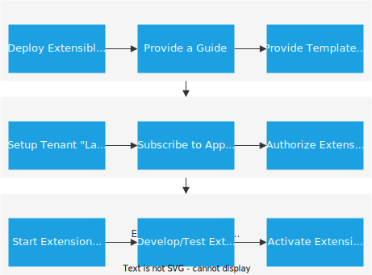

# Extending and Customizing SaaS Solutions (Old)

{{ $frontmatter.synopsis }}

::: warning
This guide assumes that the SaaS application is deployed using the _previous_ MTX services package `@sap/cds-mtx`. Projects working with the _new_ MTX version, see [the extensibility guide](../customization).

Check if you can migrate to the _new_ package `@sap/cds-mtxs` with the help of our [migration guide](../../multitenancy/old-mtx-migration) and the [list of current limitations](https://github.tools.sap/cap/cds-tools/issues/317#issuecomment-1300295).
:::

<span id="afterstart" />

## Extend SaaS Applications { #extend-saas-applications}

Subscribers (customers) of a SaaS application can extend data and service models in the context of their subscription (= tenant context = subaccount context). New fields can be added to SAP-provided database tables. Those fields can be added to UIs as well, if they have been built with SAP's Fiori Elements technology.

The overall process is depicted in the following figure:



## Platform Setup

#### Set Up Tenant Landscape

Using SAP Business Technology Platform (BTP) cockpit, an account administrator sets up a "landscape of tenants" (= multiple subaccounts) to enable a staged extension development scenario (for example, _development_ and _productive_ tenants). We recommend setting up at least a development tenant to test extended data, service, and UI models before activating these into the productive tenant.

#### Subscribe to SaaS Application

Using SAP BTP cockpit, a subaccount administrator subscribes to the SaaS application. During this subscription, the SaaS application automatically performs a tenant onboarding step, which (if using SAP HANA) allocates an SAP HANA persistence for this tenant (= subaccount) and deploys all database objects.

> Extending CDS services and database entities is only possible if the SaaS application is using the SAP HANA database service.
> In addition, the SaaS application must have been enabled for extensibility by the SaaS provider.

#### Authorize Extension Developer

The extension is done by an extension developer (a customer role). The privilege to extend the base model of a tenant is linked to a scope of the SaaS application. Therefore, the security administrator of a subaccount has to grant this scope to the developer in SAP BTP cockpit. As a prerequisite, the developer has to be registered in the Identity Provider linked to the subaccount.

There are two relevant scopes that can be assigned to extension developers:

| Scope            |                                           |
| --------------   | ----------------------------------------- |
| ExtendCDS        |  Create extension projects and apply extension files. Not authorized to delete tables created by previous extensions   |
| ExtendCDSdelete  |  In addition, enables deletion of tables created by previous extensions, which can cause data loss!  |

The SaaS application delivers role templates including these scopes. For more information, see the documentation of the SaaS application.

### Start Extension Project

Extension developers initialize an extension project on the file system.

Prerequisites:

+ The CDS command line tools must be installed. See [Getting Started > Setup](../../../get-started/#setup) for more details.
+ The Identity Provider linked to the tenant's subaccount must support the SAML standard.
+ We recommended using an Integrated Development Environment (IDE) with one of the available CDS editors for authoring extension CDS files.
+ Basic knowledge of the CDS language.

> Use the regular `cds help` feature to learn more about command options.
> For instance, to see a description of the command `cds extend`, use `cds help extend`.

The CDS client communicates with the SaaS application and fetches the "base model" (the not-yet-extended model) from there. An extension project folder is generated on the local file system. If an extension has already happened before, the last activated extension is fetched as well.

As an extension developer, initialize an extension project with the following command:

```sh
cds extend <app-url> [-d <project-extension-directory>] [-s <tenant-subdomain>] [-p <passcode>]
```

`<app-url>` is specific to the SaaS application you're going to extend. This URL can be found in the documentation for the respective SaaS application. Usually, `<app-url>` is the same URL visible on the subscriptions tab of SAP BTP cockpit, which is used to launch the application, enhanced with an additional URL path segment (for example, `/extend`). However, the SaaS application can decide to provide a different URL for working with extensions.

`<project-extension-directory>` is the folder on your local disk, which will contain the extension project files.
If omitted, the current working directory (or an existing subdirectory named as the subdomain) will be used.

`<tenant-subdomain>` in a productive landscape is automatically derived as the string preceding the first dot '.'.
In other landscapes, find out the subdomain in the SAP BTP cockpit by navigating to the overview page for your tenant's subaccount. Then use the option `-s <tenant-subdomain>`.

`<passcode>` is a temporary authentication code, which is used to connect to the SaaS application. This passcode can be retrieved by opening a browser logon page. The URL of this browser page depends on SAP BTP landscape where the SaaS application is running, and the tenant that will be extended:

```txt
<url> = https://<tenant-subdomain>.authentication.<landscape>.hana.ondemand.com/passcode
```

A passcode can be used only once and within a limited period of time. When expired, a new passcode has to be generated and sent again.
If you omit the passcode, it will be queried interactively.

As a result of `cds extend`, an extension project is created in the specified folder. As an example, the following file/folder structure is generated on the local disk:

```sh
myextproject/
  package.json    # extension project descriptor
  srv/
            # will contain service and ui-related extension cds files
  db/
            # will contain db-related extension cds files
  node_modules/
    _base/
       ...   # contains the base model provided by the SaaS application
```

The `node_modules` folder should be hidden when using an IDE, because it contains artifacts (the base CDS model of the SaaS application) that can't be changed. SaaS applications can provide templates to document how to do meaningful extensions of base entities and services.

This project structure follows the same conventions as introduced for developing entire CDS applications. Model extension files, which are relevant for a database deployment, must be placed in the `db/` folder. Service extension files must be placed in the `srv/` folder. The base model is treated like a reuse model. You can refer to it in extension files simply by `using ... from '_base/...'`

> Extension developers should drive extension projects similar to other development projects. We recommend using a version control system (for example, Git) to host the extension project sources.

### Save an Authentication Token for a Simplified Workflow

As an extension developer, you have the option to work more smoothly by authenticating only once.
This is achieved by using the command `cds login`, which will save authentication data to your local system.
Saved authentication data can be deleted using `cds logout`.

The command fetches tokens and corresponding refresh tokens and saves them for later use in either a plain-text file or on the desktop keyring
(to be precise: libsecret on Linux, Keychain on macOS, or Credential Vault on Windows).

Using the keyring has the advantage of increased security since, depending on the platform, you can lock and unlock it, and data saved by `cds login` can be inaccessible to other applications you run.

`cds login` therefore uses the keyring by default. In order for this to succeed, you'll need to install an additional Node.js module, [_keytar_](https://www.npmjs.com/package/keytar):

```sh
npm i -g keytar
```

Alternatively, you can request `cds login` to write to a plain-text file.

::: warning _❗ Warning_ <!--  -->
Local storage of authentication data incurs a security risk: a malicious, locally running application might be able to perform all actions that you're authorized for with the SaaS app in the context of your tenant.
:::

> In SAP Business Application Studio, plain-text storage is enforced since no desktop keyring is available. Don't worry - the plain-text file resides on an encrypted storage.

Authentication data saved by `cds login` will be provided to `cds extend` and `cds activate` automatically, allowing you to call these commands later without providing a passcode.
For convenience, `cds login` also saves further settings for the current project, so you don't have to provide it again (including the app URL).

Once a saved token has expired, it will be automatically renewed using a refresh token, if such has been provided with the token.
The validity of the original token and the refresh token can be configured by the SaaS-app provider. By default, the
refresh token expires much later, allowing you to work without re-entering passcodes for multiple successive days.

Should you later want to extend another SaaS application, you can log in to it as well, and it won't affect your first login.
Logins are independent of each other, and both `cds extend` and `cds activate` will be authenticated according to the requested target.

If you work with Cloud Foundry (CF), you can call `cds login` giving a passcode only. The command will then consult the Cloud Foundry command line client to determine suitable apps from the org and space currently logged into and will show you a list of apps and their respective URLs to choose from.

To log in to the SaaS app with a passcode only, first change to the folder you want to use for your extension project. Then run:

```sh
cds login -p <passcode>
```

Alternatively, if you don't work with CF or already have the app URL at hand, you can log in quicker with:

```sh
cds login -p <passcode> <app-url>
```

The tenant subdomain, unless explicitly given using `-s <subdomain>`, will also be determined using the CF client if available.

To use a plain-text file instead of the keyring, append `--plain`. If you change your usage of this option, `cds login` will migrate any potentially pre-existing authentication data from the other storage to the requested storage.

For a synopsis of all options, run `cds help login`.

Once you've logged in to the SaaS app, you can omit the passcode, the app URL, and the tenant subdomain, so your development cycle might look like this:

```sh
cds extend
# develop your extension
cds activate
# develop your extension
cds activate
# ...
```

To remove locally saved authentication data and optionally project settings, run:

```sh
cds logout
```

inside your extension-project folder.
Again, `cds help logout` is available for more details.
::: tip
When your role-collection assignments have changed, run `cds logout` followed by `cds login` in order to fetch a token containing the new set of scopes.
:::

### Develop and Activate Extensions { #about-extension-models}

Developing CDS model files is supported by the CDS editor and CDS build tools. Within these files, you can reference base model files with `using ... from '_base/...'`  statements. Entities and services can be extended using the [cds `extend` technique](../../../cds/cdl#aspects). The following example shows how to add two fields to a `Books` database table of a hypothetical Bookshop application. An _extension.cds_ file is created (the file name doesn't matter) within the `db`-folder:

```cds
using sap.bookshop from '_base/db/datamodel';

extend entity bookshop.Books with {
  GTIN: String(14);
  rating: Integer;
}
```

The extension enhances the data model for this use case. Be aware that attributes of existing elements, such as type, key, and default cannot be modified.

Extensions can be activated into a tenant using the following command:

```sh
cds activate [<extension-project-directory>]
```

If you omit the directory, the current directory, or a subdirectory named as the tenant subdomain, will be used.

As outlined above, this command reuses a potentially saved authentication token for the target app URL and tenant subdomain.
If you don't want to save authentication data locally, you can use the `-p <passcode>` option as well as `-s <tenant-subdomain>` and `--to <app-url>` to (re-)connect.

Activating an existing project into a different tenant requires setting `<passcode>` and `<app-url>` appropriately.

Run `cds help activate` for more details.

> By using `cds activate`, it isn't possible to upload csv-files into the extended tenant.

<br>

#### Executing `cds extend` on an Existing Extension Project

`cds extend` is used to create and initialize an extension project. Subsequent executions of `cds extend` must be done with the `--force` option to overwrite existing files (base model files and extension files). No files will be deleted. Features of a version control system should be used to detect and merge changes.

#### Fetching Extension Templates from the SaaS Application

SaaS applications can deliver template files, which demonstrate how to extend entities and services for this SaaS application. Such templates can be fetched from the server by using the `--templates` option of the `cds extend` command. As a result, a `tpl` folder will be generated containing the extension template files.

<br>

### Deploy Extensions to Production

The productive tenant (the productive subaccount on SAP BTP) is technically treated the same way as any development tenant. Role-based authorization can restrict the access to the productive tenant to dedicated extension developers. An extension project, which has been generated by referencing a development tenant, can be activated into a productive tenant by using `cds activate` with the appropriate options.

## [Old MTX Reference](../../multitenancy/old-mtx-apis) {.toc-redirect}

[See Reference docs for former, 'old' MTX Services.](../../multitenancy/old-mtx-apis)
