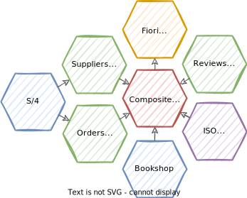

# Reuse and Compose

{{$frontmatter?.synopsis}}

## Introduction and Overview

CAP promotes reuse and composition by importing content from reuse packages. Reused content, shared and imported that way, can comprise models, code, initial data, and i18n bundles.


### Usage Scenarios

By applying CAP's techniques for reuse, composition, and integration, you can address several different usage scenarios, as depicted in the following illustration.


1. **Verticalized/Composite Solutions** — Pick one or more reuse packages/services. Enhance them, mash them up into a composite solution, and offer this as a new packaged solution to clients.

2. **Prebuilt Extension Packages** — Instead of offering a new packaged solution, you could also just provide your enhancements as a prebuilt extension package, for example, for **verticalization**, which you in turn offer to others as a reuse package.

3. **Prebuilt Integration Packages** — Prebuilt extension packages could also involve prefabricated integrations to services in back-end systems, such as S/4HANA and SAP SuccessFactors.

4. **Prebuilt Business Data Packages** — A variant of prebuilt integration packages, in which you would provide a reuse package that provides initial data for certain entities, like a list of *Languages*, *Countries*, *Regions*, *Currencies*, etc.

5. **Customizing SaaS Solutions** — Customers, who are subscribers of SaaS solutions, can apply the same techniques to adapt SaaS solutions to their needs. They can use prebuilt extension or business data packages, or create their own custom-defined ones.


### Examples from [cap/samples](https://github.com/sap-samples/cloud-cap-samples)

In the following sections, we frequently refer to examples from [cap/samples](https://github.com/sap-samples/cloud-cap-samples):




- **[@capire/bookshop](https://github.com/capire/bookshop)** provides a basic bookshop app and **reuse services** .
- **[@capire/common](https://github.com/capire/common)** is a **prebuilt extension** and **business data** package for *Countries*, *Currencies*, and *Languages*.
- **[@capire/reviews](https://github.com/capire/reviews)** provides an independent **reuse service**.
- **[@capire/orders](https://github.com/capire/orders)** provides another independent **reuse service**.
- **[@capire/bookstore](https://github.com/capire/bookstore)** combines all of the above into a **composite application**.


### Preparation for Exercises

If you want to exercise the code snippets in following sections, do the following:

**1)** &nbsp; Get cap/samples:

```sh
git clone https://github.com/sap-samples/cloud-cap-samples samples
cd samples
npm install
```

**2)** &nbsp; Start a sample project:

```sh
cds init sample
cd sample
npm i
# ... run the upcoming commands in here
```

## Importing Reuse Packages { #import}

CAP and CDS promote reuse of prebuilt content based on `npm` or `Maven` techniques. The following figure shows the basic procedure for `npm`.


> We use `npm` and `Maven` as package managers simply because we didn't want to reinvent the wheel here.

### Using `npm add/install` from _npm_ Registries

Use _`npm add/install`_ to import reuse packages to your project, like so:

```sh
npm add @capire/bookshop @capire/common
```


This installs the content of these packages into your project's `node_modules` folder and adds corresponding dependencies:

::: code-group
```json [package.json]
{
  "name": "sample", "version": "1.0.0",
  "dependencies": {
    "@capire/bookshop": "^1.0.0",
    "@capire/common": "^1.0.0",
    ...
  }
}
```
:::

> These dependencies allow you to use `npm outdated`, `npm update`, and `npm install` later to get the latest versions of imported packages.


### Importing from Other Sources

In addition to importing from _npm_ registries, you can also import from local sources. This can be other CAP projects that you have access to, or tarballs of reuse packages, for example, downloaded from some marketplace.

```sh
npm add ~/Downloads/@capire-bookshop-1.0.0.tgz
npm add ../bookshop
```

> You can use `npm pack` to create tarballs from your projects if you want to share them with others.


### Importing from Maven Dependencies

Add the dependency to the reuse package to your `pom.xml`:

::: code-group
```xml [pom.xml]
<dependency>
  <groupId>com.sap.capire</groupId>
  <artifactId>bookshop</artifactId>
  <version>1.0.0</version>
</dependency>
```
:::

As Maven dependencies are - in contrast to `npm` packages - downloaded into a global cache, you need to make the artifacts from the reuse package available in your project locally.
The CDS Maven Plugin provides a simple goal named `resolve`, that performs this task for you and extracts reuse packages into the `target/cds/` folder of the Maven project.
Include this goal into the `pom.xml`, if not already present:

::: code-group
```xml [pom.xml]
<plugin>
  <groupId>com.sap.cds</groupId>
  <artifactId>cds-maven-plugin</artifactId>
  <version>${cds.services.version}</version>
  <executions>
    ...
    <execution>
      <id>cds.resolve</id>
      <goals>
        <goal>resolve</goal>
      </goals>
    </execution>
    ...
  </executions>
</plugin>
```
:::

### Embedding vs. Integrating Reuse Services { #embedding-vs-integration}

By default, when importing reuse packages, all imported content becomes an integral part of your project, it literally becomes **embedded** in your project. This applies to all the things an imported package can contain, such as:

- Domain models
- Service definitions
- Service implementations
- i18n bundles
- Initial data

[See an example for a data package for `@sap/cds/common`](../../cds/common#prebuilt-data){ .learn-more}

However, you decide which parts to actually use and activate in your project by means of model references as shown in the following sections.

Instead of embedding reuse content, you can also **integrate** with remote services, deployed as separate microservices as outlined in [*Service Integration*](#service-integration).


## Reuse & Extend Models {#reuse-models}

Even though all imported content is embedded in your project, you decide which parts to actually use and activate by means of model references. For example, if an imported package comes with three service definitions, it's still you who decides which of them to serve as part of your app, if any. The rule is:

::: tip Active by Reachability
Everything that you are referring to from your own models is served.
Everything outside of your models is ignored.
:::

### Via `using from` Directives

Use the definitions from imported models through [`using` directives](../../cds/cdl#model-imports) as usual. For example, like in [@capire/bookstore](https://github.com/SAP-samples/cloud-cap-samples/blob/7b7686cb29aa835e17a95829c56dc3285e6e23b5/bookstore/srv/mashup.cds), simply add all:

::: code-group
```cds [bookstore/srv/mashup.cds]
using from '@capire/bookshop';
using from '@capire/common';
```
:::

The `cds` compiler finds the imported content in `node_modules` when processing imports with absolute targets as shown previously.

### Using _index.cds_ Entry Points {#index-cds}

The above `using from` statements assume that the imported packages provide _index.cds_ in their roots as [public entry points](#entry-points), which they do. For example see [@capire/bookshop/index.cds](https://github.com/SAP-samples/cloud-cap-samples/blob/7b7686cb29aa835e17a95829c56dc3285e6e23b5/bookshop/index.cds):

::: code-group
```cds [bookshop/index.cds]
// exposing everything...
using from './db/schema';
using from './srv/cat-service';
using from './srv/admin-service';
```
:::

This _index.cds_ imports and therefore activates everything. Running `cds watch` in your project would show you this log output, indicating that all initial data and services from your imported packages are now embedded and served from your app:

```log
[cds] - connect to db > sqlite { database: ':memory:' }
 > filling sap.common.Currencies from common/data/sap.common-Currencies.csv
 > filling sap.common.Currencies_texts from common/data/sap.common-Currencies_texts.csv
 > filling sap.capire.bookshop.Authors from bookshop/db/data/sap.capire.bookshop-Authors.csv
 > filling sap.capire.bookshop.Books from bookshop/db/data/sap.capire.bookshop-Books.csv
 > filling sap.capire.bookshop.Books_texts from bookshop/db/data/sap.capire.bookshop-Books_texts.csv
 > filling sap.capire.bookshop.Genres from bookshop/db/data/sap.capire.bookshop-Genres.csv
/> successfully deployed to sqlite in-memory db

[cds] - serving AdminService { at: '/admin', impl: 'bookshop/srv/admin-service.js' }
[cds] - serving CatalogService { at: '/browse', impl: 'bookshop/srv/cat-service.js' }
```


### Using Different Entry Points

If you don't want everything, but only a part, you can change your `using from` directives like this:

```cds
using { CatalogService } from '@capire/bookshop/srv/cat-service';
```

 The output of `cds watch` would reduce to:

```log
[cds] - connect to db > sqlite { database: ':memory:' }
 > filling sap.capire.bookshop.Authors from bookshop/db/data/sap.capire.bookshop-Authors.csv
 > filling sap.capire.bookshop.Books from bookshop/db/data/sap.capire.bookshop-Books.csv
 > filling sap.capire.bookshop.Books_texts from bookshop/db/data/sap.capire.bookshop-Books_texts.csv
 > filling sap.capire.bookshop.Genres from bookshop/db/data/sap.capire.bookshop-Genres.csv
/> successfully deployed to sqlite in-memory db

[cds] - serving CatalogService { at: '/browse', impl: 'bookshop/srv/cat-service.js' }
```


> Only the CatalogService is served now.
::: tip
Check the _readme_ files that come with reuse packages for information about which entry points are safe to use.
:::


### Extending Imported Definitions

You can freely use all definitions from the imported models in the same way as you use definitions from your own models. This includes using declared types, adding associations to imported entities, building views on top of imported entities, and so on.

You can even extend imported definitions, for example, add elements to imported entities, or add/override annotations, without limitations.

Here's an example from the [@capire/bookstore](https://github.com/SAP-samples/cloud-cap-samples/blob/7b7686cb29aa835e17a95829c56dc3285e6e23b5/bookstore/srv/mashup.cds):

::: code-group
```cds [bookstore/srv/mashup.cds]
using { sap.capire.bookshop.Books } from '@capire/bookshop';
using { ReviewsService.Reviews } from '@capire/reviews';

// Extend Books with access to Reviews and average ratings
extend Books with {
  reviews : Composition of many Reviews on reviews.subject = $self.ID;
  rating  : Decimal;
}
```
:::


## Reuse & Extend Code {#reuse-code}


Service implementations, in particular custom-coding, are also imported and served in embedding projects. Follow the instructions if you need to add additional custom handlers.

### In Node.js

One way to add your own implementations is to replace the service implementation as follows:

1. Add/override the `@impl` annotation
    ```cds
    using { CatalogService } from '@capire/bookshop';
    annotate CatalogService with @impl:'srv/my-cat-service-impl';
    ```

2. Place your implementation in `srv/my-cat-service-impl.js`:
    ::: code-group
    ```js [srv/my-cat-service-impl.js]
    module.exports = cds.service.impl (function(){
      this.on (...) // add your event handlers
    })
    ```
    :::

3. If the imported package already had a custom implementation, you can include that as follows:
    ::: code-group
    ```js [srv/my-cat-service-impl.js]
    const base_impl = require ('@capire/bookshop/srv/cat-service')
    module.exports = cds.service.impl (async function(){
      this.on (...) // add your event handlers
      await base_impl.call (this,this)
    })
    ```
    :::
    > Make sure to invoke the base implementation exactly like that, with `await`. And make sure to check the imported package's readme to check whether access to that implementation module is safe.


### In Java

You can provide your own implementation in the same way, as you do for your own services:

1. Import the service in your CDS files
    ```cds
    using { CatalogService } from 'com.sap.capire/bookshop';
    ```

2. Add your own implementation next to your other event handler classes:
    ```java
    @Component
    @ServiceName("CatalogService")
    public class CatalogServiceHandler implements EventHandler {

      @On(/* ... */)
      void myHandler(EventContext context) {
        // ...
      }

    }
    ```

## Reuse & Extend UIs {#reuse-uis}

If imported packages provide UIs, you can also serve them as part of your app — for example, using standard [express.js](https://expressjs.com) middleware means in Node.js.

The *@capire/bookstore* app has this [in its `server.js`](https://github.com/SAP-samples/cloud-cap-samples/blob/7b7686cb29aa835e17a95829c56dc3285e6e23b5/bookstore/server.js) to serve [the Vue.js app imported with *@capire/bookshop*](https://github.com/SAP-samples/cloud-cap-samples/tree/7b7686cb29aa835e17a95829c56dc3285e6e23b5/bookshop/app/vue) using the `app.serve(<endpoint>).from(<source>)` method:

::: code-group
```js [bookstore/server.js]
const express = require('express')
const cds = require('@sap/cds')

// Add routes to UIs from imported packages
cds.once('bootstrap',(app)=>{
  app.serve ('/bookshop') .from ('@capire/bookshop','app/vue')
  app.serve ('/reviews') .from ('@capire/reviews','app/vue')
  app.serve ('/orders') .from('@capire/orders','app/orders')
})
```
:::

[More about Vue.js in our _Getting Started in a Nutshell_](../../get-started/in-a-nutshell#uis){.learn-more} [Learn more about serving Fiori UIs.](../../advanced/fiori){.learn-more}

This ensures all static content for the app is served from the imported package.

In both cases, all dynamic requests to the service endpoint anyways reach the embedded service, which is automatically served at the same endpoint it was served in the bookshop.

In case of Fiori elements-based UIs, the reused UIs can be extended by [extending their models as decribed above](#reuse-models), in this case overriding or adding Fiori annotations.


## Service Integration

Instead of embedding and serving imported services as part of your application, you can decide to integrate with them, having them deployed and run as separate microservices.

<!-- Subsections of this section: -->


### Import the Remote Service's APIs

This is described in the [Import Reuse Packages section](#import)  &rarr; for example using `npm add`.

Here's the effect of this step in [@capire/bookstore](https://github.com/SAP-samples/cloud-cap-samples/blob/7b7686cb29aa835e17a95829c56dc3285e6e23b5/bookstore/package.json):

::: code-group
```json [bookstore/package.json]
  "dependencies": {
    "@capire/bookshop": "^1.0.0",
    "@capire/reviews": "^1.0.0",
    "@capire/orders": "^1.0.0",
    "@capire/common": "^1.0.0",
    ...
  },
```
:::

### Configuring Required Services

To configure required remote services in Node.js, simply add the respective entries to the [`cds.requires` config option](../../node.js/cds-env). You can see an example in [@capire/bookstore/package.json](https://github.com/SAP-samples/cloud-cap-samples/blob/7b7686cb29aa835e17a95829c56dc3285e6e23b5/bookstore/package.json), which integrates [@capire/reviews](https://github.com/SAP-samples/cloud-cap-samples/tree/7b7686cb29aa835e17a95829c56dc3285e6e23b5/reviews) and [@capire/orders](https://github.com/SAP-samples/cloud-cap-samples/tree/7b7686cb29aa835e17a95829c56dc3285e6e23b5/orders) as remote service:

::: code-group
```json [bookstore/package.json]
"cds": {
  "requires": {
    "ReviewsService": {
      "kind": "odata", "model": "@capire/reviews"
    },
    "OrdersService": {
      "kind": "odata", "model": "@capire/orders"
    },
  }
}
```
:::

> Essentially, this tells the service loader to not serve that service as part of your application, but expects a service binding at runtime in order to connect to the external service provider.

#### Restricted Reuse Options

Because models of integrated services only serve as imported APIs, you're restricted with respect to how you can use the models of services to integrate with. For example, only adding fields is possible, or cross-service navigation and expands.

Yet, there are options to make some of these work programmatically. This is explained in the [next section](#delegating-calls) based on the integration of [@capire/reviews](https://github.com/SAP-samples/cloud-cap-samples/tree/7b7686cb29aa835e17a95829c56dc3285e6e23b5/reviews) in [@capire/bookstore](https://github.com/SAP-samples/cloud-cap-samples/tree/7b7686cb29aa835e17a95829c56dc3285e6e23b5/bookstore).


### Delegating Calls to Remote Services { #delegating-calls}

Let's start from the following use case: The bookshop app exposed through [@capire/bookstore](https://github.com/SAP-samples/cloud-cap-samples/tree/7b7686cb29aa835e17a95829c56dc3285e6e23b5/bookstore) will allow end users to see the top 10 book reviews in the details page.

To avoid [CORS issues](https://developer.mozilla.org/de/docs/Web/HTTP/CORS), the request from the UI goes to the main `CatalogService` serving the end user's UI and is delegated from that to the remote `ReviewsService`, as shown in this sequence diagram:

 

And this is how we do that in [@cap/bookstore](https://github.com/SAP-samples/cloud-cap-samples/blob/7b7686cb29aa835e17a95829c56dc3285e6e23b5/bookstore/srv/mashup.js):

::: code-group
```js [bookstore/srv/mashup.js]
const CatalogService = await cds.connect.to ('CatalogService')
const ReviewsService = await cds.connect.to ('ReviewsService')
CatalogService.prepend (srv => srv.on ('READ', 'Books/reviews', (req) => {
  console.debug ('> delegating request to ReviewsService')
  const [id] = req.params, { columns, limit } = req.query.SELECT
  return ReviewsService.tx(req).read ('Reviews',columns).limit(limit).where({subject:String(id)})
}))
```
:::

Let's look at that step by step:

1. We connect to both the `CatalogService` (local) and the `ReviewsService` (remote) to mash them up.
2. We register an `.on` handler with the `CatalogService`, which delegates the incoming request to the `ReviewsService`.
3. We wrap that into a call to `.prepend` because the  `.on` handler needs to supersede the default generic handlers provided by the CAP runtime → see [ref docs for `srv.prepend`.](../../node.js/core-services#srv-prepend)


### Running with Mocked Remote Services {#mocking-required-services}

If you start [@capire/bookstore](https://github.com/SAP-samples/cloud-cap-samples/tree/7b7686cb29aa835e17a95829c56dc3285e6e23b5/bookstore) locally with `cds watch`, all [required services](https://github.com/SAP-samples/cloud-cap-samples/blob/7b7686cb29aa835e17a95829c56dc3285e6e23b5/bookstore/package.json#L15-L22) are automatically mocked, as you can see in the log output when the server starts:

```log
[cds] - serving AdminService { at: '/admin', impl: 'bookshop/srv/admin-service.js' }
[cds] - serving CatalogService { at: '/browse', impl: 'bookshop/srv/cat-service.js' }
[cds] - mocking OrdersService { at: '/orders', impl: 'orders/srv/orders-service.js' }
[cds] - mocking ReviewsService { at: '/reviews', impl: 'reviews/srv/reviews-service.js' }
```

> &rarr; `OrdersService` and `ReviewsService` are mocked, that is, served in the same process, in the same way as the local services.

This allows development and testing functionality with minimum complexity and overhead in fast, closed-loop dev cycles.


As all services are co-located in the same process, sharing the same database, you can send requests like this, which join/expand across *Books* and *Reviews*:
```http
GET http://localhost:4004/browse/Books/201?
&$expand=reviews
&$select=ID,title,rating
```


### Testing Remote Integration Locally {#testing-locally}

As a next step, following CAP's [Grow-as-you-go](../../about/#grow-as-you-go) philosophy, we can run the services as separate processes to test the remote integration, but still locally in a low-complexity setup. We use the [_automatic binding by `cds watch`_](#bindings-via-cds-watch) as follows:

1. Start the three servers separately, each in a separate shell (from within the root folder in your cloned _[cap/samples]( https://github.com/sap-samples/cloud-cap-samples)_ project):
    ```sh
    cds watch orders --port 4006
    ```
    ```sh
    cds watch reviews --port 4005
    ```
    ```sh
    cds watch bookstore --port 4004
    ```

2. Send a few requests to the reviews service (port 4005) to add `Reviews`:
    ```http
    POST http://localhost:4005/Reviews
    Content-Type: application/json;IEEE754Compatible=true
    Authorization: Basic itsme:secret
    {"subject":"201", "title":"boo", "rating":3 }
    ```

3. Send a request to bookshop (port 4004) to fetch reviews via `CatalogService`:
    ```http
    GET http://localhost:4004/browse/Books/201/reviews?
    &$select=rating,date,title
    &$top=3
    ```

    > You can find a script for this in [@capire/bookstore/test/requests.http](https://github.com/SAP-samples/cloud-cap-samples/blob/7b7686cb29aa835e17a95829c56dc3285e6e23b5/bookstore/test/requests.http).


### Binding Required Services

Service bindings provide the details about how to reach a required service at runtime, that is, providing the necessary credentials, most prominently the target service's `url`.


#### Basic Mechanism Using `cds.env` and Process env Variables {#bindings-via-cds-env}


At the end of the day, the CAP Node.js runtime expects to find the service bindings in the respective entries in `cds.env.requires`:

1. Configured required services constitute endpoints for service bindings:

    ::: code-group
    ```json [package.json]
    "cds": {
      "requires": {
        "ReviewsService": {...},
      }
    }
    ```
    :::

2. These are made available to the runtime via `cds.env.requires`.

    ```js
    const { ReviewsService } = cds.env.requires
    ```

3. Service bindings essentially fill in `credentials` to these entries.

    ```js
    const { ReviewsService } = cds.env.requires
    //> ReviewsService.credentials = {
    //>  url: "http://localhost:4005/reviews"
    //> }
    ```

While you could do the latter in test suites, you would never provide credentials in a hard-coded way like that in productive code. Instead, you'd use one of the options presented in the following sections.


#### Automatic Bindings by `cds watch` {#bindings-via-cds-watch}

When running separate services locally as described [in the previous section](#testing-locally), this is done automatically by `cds watch`, as indicated by this line in the bootstrapping log output:

```log
[cds] - using bindings from: { registry: '~/.cds-services.json' }
```

You can cmd/ctrl-click or double click on that to see the file's content, and find something like this:

::: code-group
```json [~/.cds-services.json]
{
  "cds": {
    "provides": {
      "OrdersService": {
        "kind": "odata",
        "credentials": {
          "url": "http://localhost:4006/orders"
        }
      },
      "ReviewsService": {
        "kind": "odata",
        "credentials": {
          "url": "http://localhost:4005/reviews"
        }
      },
      "AdminService": {
        "kind": "odata",
        "credentials": {
          "url": "http://localhost:4004/admin"
        }
      },
      "CatalogService": {
        "kind": "odata",
        "credentials": {
          "url": "http://localhost:4004/browse"
        }
      }
    }
  }
}
```
:::

Whenever you start a CAP server with `cds watch`, this is what happens automatically:

1. For all *provided* services, corresponding entries are written to _~/cds-services.json_ with respective `credentials`, namely the `url`.

2. For all *required* services, corresponding entries are fetched from _~/cds-services.json_. If found, the `credentials` are filled into the respective entry in `cds.env.requires.<service>`  [as introduced previously](#bindings-via-cds-env).

In effect, all the services that you start locally in separate processes automatically receive their required bindings so they can talk to each other out of the box.


#### Through Process Environment Variables {#bindings-via-process-env}

You can pass credentials as process environment variables, for example in ad-hoc tests from the command line:

```sh
export cds_requires_ReviewsService_credentials_url=http://localhost:4005/reviews
cds watch bookstore
```

... or add them to a local `.env` file for repeated local tests:

::: code-group
```properties [.env]
cds.requires.ReviewsService.credentials = { "url": "http://localhost:4005/reviews" }
```
:::
> Note: never check in or deploy these `.env` files!


#### Through `VCAP_SERVICES` {#bindings-via-vcap_services}

When deploying to Cloud Foundry, service bindings are provided in `VCAP_SERVICES` process environment variables [as documented here](../../node.js/cds-connect#vcap_services).


#### In Target Cloud Environments {#bindings-in-cloud-environments}

Find information about how to do so in different environment under these links:

- [Deploying Services using MTA Deployer](https://help.sap.com/docs/HANA_CLOUD_DATABASE/c2b99f19e9264c4d9ae9221b22f6f589/33548a721e6548688605049792d55295.html)
- [Service Bindings in SAP BTP Cockpit](https://help.sap.com/docs/SERVICEMANAGEMENT/09cc82baadc542a688176dce601398de/0e6850de6e7146c3a17b86736e80ee2e.html)
- [Service Bindings using the Cloud Foundry CLI](https://help.sap.com/products/BTP/65de2977205c403bbc107264b8eccf4b/296cd5945fd84d7d91061b2b2bcacb93.html)
- [Service Binding in Kyma](hhttps://help.sap.com/products/BTP/65de2977205c403bbc107264b8eccf4b/d1aa23c492694d669c89a8d214f29147.html)


## Providing Reuse Packages

In general, every CAP-based product can serve as a reuse package consumed by others. There's actually not much to do. Just create models and implementations as usual. The following sections are about additional things to consider as a provider of a reuse package.

### Considerations for Maven-based reuse packages

When providing your reuse package as a Maven dependency you need to ensure that the CDS, CSV and i18n files are included into the JAR.
Place them in a `cds` folder in your `resources` folder under a unique module directory (for example, leveraging group ID and artifact ID):

```txt
src/main/resources/cds/
  com.sap.capire/bookshop/
    index.cds
    CatalogService.cds
    data/
      com.sap.capire.bookshop-Books.csv
    i18n/
      i18n.properties
```

This structure ensures that the CDS Maven Plugin `resolve` goal extracts these files correctly to the `target/cds/` folder.

>Note that `com.sap.capire/bookshop` is used when importing the models with a `using` directive.

### Provide Public Entry Points {#entry-points}

Following the Node.js approach, there's no public/private mechanism in CDS.
Instead, it's good and proven practice to add an _index.cds_ in the root folder of reuse packages, similar to the use of _index.js_ files in Node.

For example:

::: code-group
```cds [provider/index.cds]
namespace my.reuse.package;
using from './db/schema';
using from './srv/cat-service';
using from './srv/admin-service';
```
:::

This allows your users to refer to your models in `using` directives using just the package name, like so:

::: code-group
```cds [consumer/some.cds]
using { my.thing } from 'my-reuse-package';
```
:::

In addition, you might want to provide other entry points to ease partial usage options. For example, you could provide a _schema.cds_ file in your root, to allow using the domain model without services:

::: code-group
```cds [consumer/more.cds]
using { my.domain.entity } from 'my-reuse-package/schema';
using { my.service } from 'my-reuse-package/services';
```
:::

### Provide Custom Handlers

#### In Node.js

In general, custom handlers can be placed in files matching the naming of the _.cds_ files they belong to. In a reuse package, you have to use the `@impl` annotation to make it explicit which custom handler to use. In addition you need to use the fully qualified module path inside the `@impl` annotation.

Imagine that our bookshop is an _@sap_-scoped reuse module and the _CatalogService_ has a custom handler. This is how the service definition would look:

::: code-group
```cds [bookshop/srv/cat-service.cds]
service CatalogService @(impl: '@sap/bookshop/srv/cat-service.js') {...}
```
:::

#### In Java

If your reuse project is Spring Boot independent, register your custom event handler classes in a `CdsRuntimeConfiguration`:

::: code-group
```java [src/main/java/com/sap/capire/bookshop/BookshopConfiguration.java]
package com.sap.capire.bookshop;

public class BookshopConfiguration implements CdsRuntimeConfiguration {

	@Override
	public void eventHandlers(CdsRuntimeConfigurer configurer) {
		configurer.eventHandler(new CatalogServiceHandler());
	}
}
```
:::

Additionally, register the `CdsRuntimeConfiguration` class in a `src/main/resources/META-INF/services/com.sap.cds.services.runtime.CdsRuntimeConfiguration` file to be detected by CAP Java:

::: code-group
``` txt [src/main/resources/META-INF/services/com.sap.cds.services.runtime.CdsRuntimeConfiguration]
com.sap.capire.bookshop.BookshopConfiguration
```
:::

Alternatively, if your reuse project is Spring Boot-based, define your event handler classes as Spring beans.
Then use Spring Boot's [auto-configuration mechanism](https://docs.spring.io/spring-boot/docs/current/reference/html/features.html#features.developing-auto-configuration) to ensure that your classes are registered automatically when importing the reuse package as a dependency.

### Add a Readme

You should inform potential consumers about the recommended ways to reuse content provided by your package. At least provide information about:

- What is provided – schemas, services, data, and so on
- What are the recommended, stable entry points


### Publish/Share with Consumers

The preferred way to share reuse packages is by publishing to registries, like _npmjs.org_, _pkg.github.com_ or _Maven Central_. This allows consumers to apply proper version management.

However, at the end of the day, any other way to share packages, which you create with `npm pack` or `mvn package` would work as well.


## Customizing SaaS Usage


Subscribers of SaaS solutions can use the same *reuse and extend* techniques to tailor the application to their requirements, for example by:

- Adding/overriding annotations
- Adding custom fields and entities
- Adding custom data
- Adding custom i18n bundles
- Importing prebuilt extension packages

The main difference is how and from where the import happens:

1. The reuse package, in this case, is the subscribed SaaS application.
2. The import happens via `cds pull`.
3. The imported package is named according to the `cds.extends` entry in package.json
4. The extensions are applied via `cds push`.

[Learn more in the **SaaS Extensibility** guide.](customization){.learn-more}
