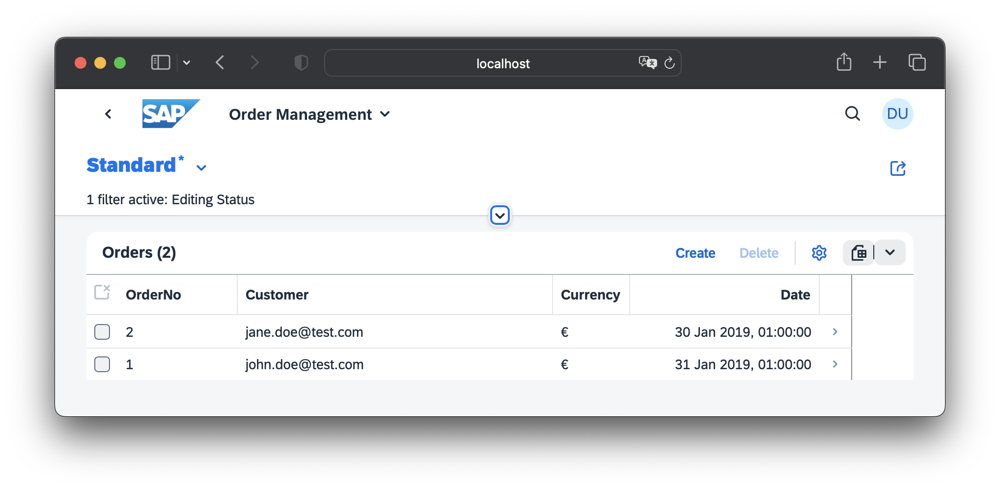
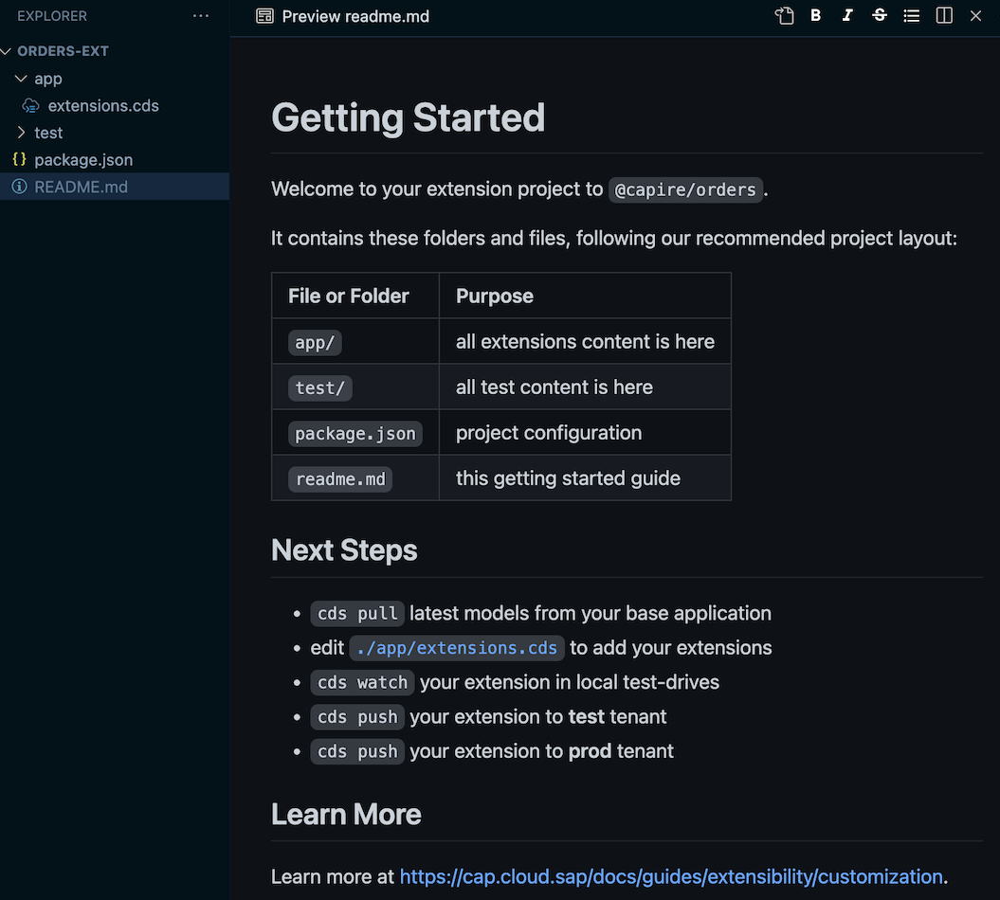
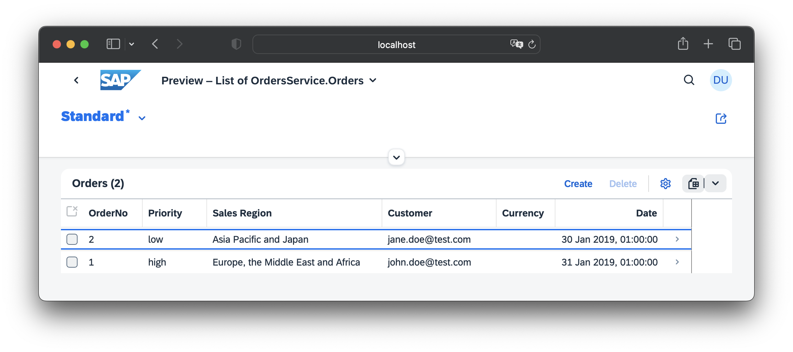
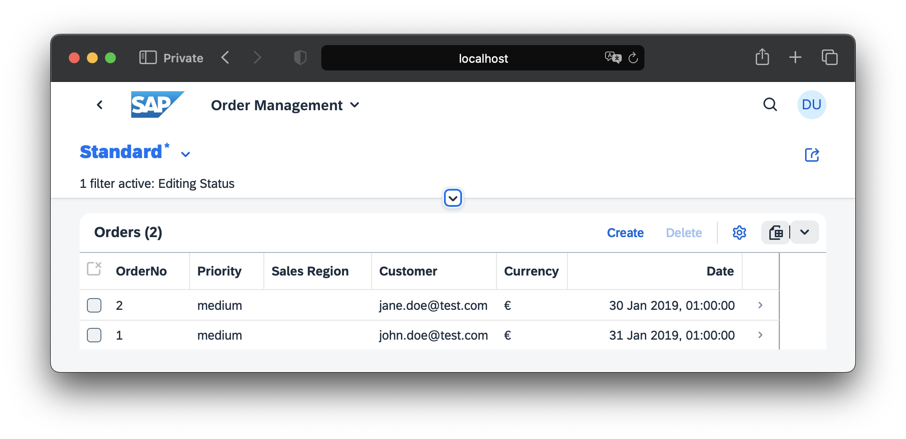
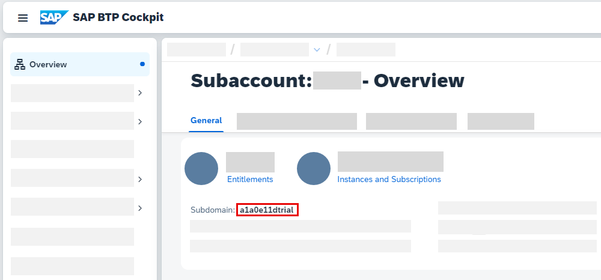

# Extending SaaS Applications

[[toc]]

## Introduction & Overview

Subscribers (customers) of SaaS solutions frequently need to tailor these to their specific needs, for example, by adding specific extension fields and entities. All CAP-based applications intrinsically support such **SaaS extensions** out of the box.

The overall process is depicted in the following figure:

![The graphic shows the three parts that are also discussed in this guide. Each part has it's steps. The first part is the one of the SaaS provider. As SaaS provider you need to deploy an extensible application and provide a guide that explains how to extend your application. In addition the SaaS provider should provide a project template for extension projects. The next part is for the SaaS customer. In this role you need to setup a tenant landscape for your extension, subscribe to the application you want to extend and authorize the extension developers. The last part is for the extension developer. As such, you start an extension project, develop and test your extension and then activate it.](assets/process_SAP_BTP.drawio.svg)

In this guide, you will learn the following:

- How to enable extensibility as a **SaaS provider**.
- How to develop SaaS extensions as a **SaaS customer**.
<!-- TODO: In the graphic the extension developer isn't the SaaS customer -->

## Prerequisites {#prerequisites}

Before we start, you'll need a **CAP-based [multitenant SaaS application](../multitenancy/)** that you can modify and deploy.

<!-- REVISIT: Use cds init bookshop --add sample instead -->
::: tip Jumpstart
You can download the ready-to-use [Orders Management application](https://github.com/SAP-samples/cloud-cap-samples/tree/main/orders):

```sh
git clone https://github.com/SAP-samples/cloud-cap-samples
cd cloud-cap-samples/orders
cds add multitenancy
```

Also, ensure you have the latest version of `@sap/cds-dk` installed globally:

```sh
npm update -g @sap/cds-dk
```

:::

## As a SaaS Provider { #prep-as-provider }

CAP provides intrinsic extensibility, which means all your entities and services are extensible by default.

Your SaaS app becomes the **base app** for extensions by your customers, and your data model the **base model**.

### 1. Enable Extensibility

Extensibility is enabled by running this command in your project root:

```sh
cds add extensibility
```

::: details Essentially, this automates the following steps…

1. It adds an `@sap/cds-mtxs` package dependency:

```sh
npm add @sap/cds-mtxs
```

2. It switches on <Config>cds.requires.extensibility: true</Config> in your _package.json_:

::: code-group

```json [package.json]
{
  "name": "@capire/orders",
  "version": "1.0.0",
  "dependencies": {
    "@capire/common": "*",
    "@sap/cds": ">=5",
    "@sap/cds-mtxs": "^1"
  },
  "cds": {
    "requires": {
      "extensibility": true // [!code focus]
    }
  }
}
```

:::

If `@sap/cds-mtxs` is newly added to your project install the dependencies:

```sh
npm i
```

### 2. Restrict Extension Points { #restrictions }

Normally, you'll want to restrict which services or entities your SaaS customers are allowed to extend and to what degree they may do so. Take a look at the following configuration:

::: code-group

```jsonc [mtx/sidecar/package.json]
{
  "cds": {
    "requires": {
      "cds.xt.ExtensibilityService": {
        "element-prefix": ["x_"],
        "extension-allowlist": [
          {
            "for": ["sap.capire.orders"],
            "kind": "entity",
            "new-fields": 2
          },
          {
            "for": ["OrdersService"],
            "new-entities": 2
          }
        ]
      }
    }
  }
}
```

:::

This enforces the following restrictions:

- All new elements have to start with `x_` → to avoid naming conflicts.
- Only entities in namespace `sap.capire.orders` can be extended, with a maximum 2 new fields allowed.
- Only the `OrdersService` can be extended, with a maximum of 2 new entities allowed.

[Learn more about extension restrictions.](../multitenancy/mtxs#extensibility-config){.learn-more}

### 3. Provide Template Projects {#templates}

To jumpstart your customers with extension projects, it's beneficial to provide a template project. Including this template with your application and making it available as a downloadable archive not only simplifies their work but also enhances their experience.

#### Create an Extension Project (Template)

Extension projects are standard CAP projects extending the SaaS application. Create one for your SaaS app following these steps:

1. Create a new CAP project — `orders-ext` in our walkthrough:

   ```sh
   cd ..
   cds init orders-ext
   code orders-ext # open in VS Code
   ```

2. Add this to your _package.json_:

    ::: code-group

    ```jsonc [package.json]
    {
      "name": "@capire/orders-ext",
      "extends": "@capire/orders",
      "workspaces": [ ".base" ]
    }
    ```

    :::

- `name` identifies the extension within a SaaS subscription; extension developers can choose the value freely.
- `extends` is the name by which the extension model will refer to the base model. This must be a valid npm package name as it will be used by `cds pull` as a package name for the base model. It doesn't have to be a unique name, nor does it have to exist in a package registry like npmjs, as it will only be used locally.
- `workspaces` is a list of folders including the one where the base model is stored. `cds pull` will add this property automatically if not already present.

::: details Uniqueness of base-model name…

You use the `extends` property as the name of the base model in your extension project. Currently, it's not an issue if the base model name isn't unique. However, to prevent potential conflicts, we recommend using a unique name for the base model.

:::

#### Add Sample Content

Create a new file _app/extensions.cds_ and fill in this content:

<!-- TODO: "for new entities, if any" is confusing here -->
::: code-group

```cds [app/extensions.cds]
namespace x_orders.ext; // only applies to new entities defined below
using { OrdersService, sap.capire.orders.Orders } from '@capire/orders';

extend Orders with {
  x_new_field : String;
}

// -------------------------------------------
// Fiori Annotations

annotate Orders:x_new_field with @title: 'New Field';
annotate OrdersService.Orders with @UI.LineItem: [
  ... up to { Value: OrderNo },
  { Value : x_new_field },
  ...
];
```

:::

The name of the _.cds_ file can be freely chosen. Yet, for the build system to work out of the box, it must be in either the `app`, `srv`, or `db` folder.

[Learn more about project layouts.](../../get-started/#project-structure){.learn-more}

::: tip Keep it simple
We recommend putting all extension files into `./app` and removing `./srv` and `./db` from extension projects.

You may want to consider [separating concerns](../domain-modeling#separation-of-concerns) by putting all Fiori annotations into a separate _./app/fiori.cds_.
:::

#### Add Test Data

To support [quick-turnaround tests of extensions](#test-locally) using `cds watch`, add some test data. In your template project, create a file _test/data/sap.capire.orders-Orders.csv_ like that:

::: code-group

```csv [test/data/sap.capire.orders-Orders.csv]
ID;createdAt;buyer;OrderNo;currency_code;
7e2f2640-6866-4dcf-8f4d-3027aa831cad;2019-01-31;john.doe@test.com;1;EUR
64e718c9-ff99-47f1-8ca3-950c850777d4;2019-01-30;jane.doe@test.com;2;EUR
```

:::

#### Add a Readme

Include additional documentation for the extension developer in a _README.md_ file inside the template project.
::: code-group

```md [README.md]
# Getting Started

Welcome to your extension project to  `@capire/orders`.

It contains these folders and files, following our recommended project layout:

| File or Folder | Purpose                        |
|----------------|--------------------------------|
| `app/`         | all extensions content is here |
| `test/`        | all test content is here       |
| `package.json` | project configuration          |
| `readme.md`    | this getting started guide     |


## Next Steps

- `cds pull` the latest models from the SaaS application
- edit [`./app/extensions.cds`](./app/extensions.cds) to add your extensions
- `cds watch` your extension in local test-drives
- `cds push` your extension to **test** tenant
- `cds push` your extension to **prod** tenant


## Learn More

Learn more at https://cap.cloud.sap/docs/guides/extensibility/customization.
```

:::

### 4. Provide Extension Guides {#guide}

You should provide documentation to guide your customers through the steps to add extensions. This guide should provide application-specific information along the lines of the walkthrough steps presented in this guide.

Here's a rough checklist what this guide should cover:

<!-- REVISIT: Why should these be part of the customer-built guide?? many of those steps are not app-specific -->
- [How to set up test tenants](#prepare-an-extension-tenant) for extension projects
- [How to assign requisite roles](#prepare-an-extension-tenant) to extension developers
- [How to start extension projects](#start-ext-project) from [provided templates](#templates)
- [How to find deployed app urls](#pull-base) of test and prod tenants
- [What can be extended?](#about-extension-models) → which services, entities, ...
- [With enclosed documentation](../../cds/cdl#doc-comment) to the models for these services and entities.

### 5. Deploy Application

Before deploying your SaaS application to the cloud, you can [test-drive it locally](../multitenancy/#test-locally).
Prepare this by going back to your app with `cd orders`.

With your application enabled and prepared for extensibility, you are ready to deploy the application as described in the  [Deployment Guide](../deployment/).

## As a SaaS Customer {#prep-as-operator}

The following sections provide step-by-step instructions on adding extensions.
All steps are based on our Orders Management sample which can be [started locally for testing](../multitenancy/#test-locally).

::: details On BTP…

To extend a SaaS app deployed to BTP, you'll need to subscribe to it [through the BTP cockpit](../multitenancy/#subscribe).

Refer to the [Deployment Guide](../deployment/to-cf) for more details on remote deployments.

Also, you have to replace local URLs used in `cds` commands later with the URL of the deployed App Router.
Use a passcode to authenticate and authorize you.
Refer to the section on [`cds login`](#cds-login) for a simplified workflow.

:::

### 1. Subscribe to SaaS App

It all starts with a customer subscribing to a SaaS application. In a productive application this is usually triggered by the platform to which the customer is logged on. The platform is using a technical user to call the application subscription API.
In your local setup, you can simulate this with a [mock user](../../node.js/authentication#mock-users) `yves`.

1. In a new terminal, subscribe as tenant `t1`:

    ```sh
    cds subscribe t1 --to http://localhost:4005 -u yves:
    ```

  Please note that the URL used for the subscription command is the sidecar URL, if a sidecar is used.
  Learn more about tenant subscriptions [via the MTX API for local testing](../multitenancy/mtxs#put-tenant).{.learn-more}

2. Verify that it worked by opening the [Orders Management Fiori UI](http://localhost:4004/orders/index.html#manage-orders) in a **new private browser window** and log in as `carol`, which is assigned to tenant `t1`.

{.mute-dark}

### 2. Prepare an Extension Tenant {#prepare-an-extension-tenant}

In order to test-drive and validate the extension before activating to production, you'll first need to set up a test tenant. This is how you simulate it in your local setup:

1. Set up a **test tenant** `t1-ext`

    ```sh
    cds subscribe t1-ext --to http://localhost:4005 -u yves:
    ```

2. Assign **extension developers** for the test tenant.

    > As you're using mocked auth, simulate this step by adding the following to the SaaS app's _package.json_, assigning user `bob` as extension developer for tenant `t1-ext`:

  ::: code-group

  ```json [package.json]
  {
    "cds": {
      "requires": {
        "auth": {
          "users": {
            "bob": {
              "tenant": "t1-ext",
              "roles": ["cds.ExtensionDeveloper"]
            }
          }
        }
      }
    }
  }
  ```

  :::

### 3. Start an Extension Project {#start-ext-project}

Extension projects are standard CAP projects extending the subscribed application. SaaS providers usually provide **application-specific templates**, which extension developers can download and open in their editor.

You can therefore use the extension template created in your walkthrough [as SaaS provider](#templates).
Open the `orders-ext` folder in your editor. Here's how you do it using VS Code:

```sh
code ../orders-ext
```

{.ignore-dark}

### 4. Pull the Latest Base Model {#pull-base}

Next, you need to download the latest base model.

```sh
cds pull --from http://localhost:4005 -u bob:
```

> Run `cds help pull` to see all available options.

This downloads the base model as a package into an npm workspace folder `.base`. The actual folder name is taken from the `workspaces` configuration. It also prepares the extension _package.json_ to reference the base model, if the extension template does not already do so.

::: details See what `cds pull` does…

1. Gets the base-model name from the extension _package.json_, property `extends`.

   If the previous value is not a valid npm package name, it gets changed to `"base-model"`. In this case, existing source files may have to be manually adapted. `cds pull` will notify you in such cases.

2. It fetches the base model from the SaaS app.
3. It saves the base model in a subdirectory `.base` of the extension project.

   This includes file _.base/package.json_ describing the base model as an npm package, including a `"name"` property set to the base-model name.

4. In the extension _package.json_:

    - It configures `.base` as an npm workspace folder.
    - It sets the `extends` property to the base-model name.

:::

### 5. Install the Base Model

To make the downloaded base model ready for use in your extension project, install it as a package:

```sh
npm install
```

This will link the base model in the workspace folder to the subdirectory `node_modules/@capire/orders` (in this example).

### 6. Write the Extension {#write-extension }

Edit the file _app/extensions.cds_ and replace its content with the following:

::: code-group

```cds [app/extensions.cds]
namespace x_orders.ext; // for new entities like SalesRegion below
using { OrdersService, sap, sap.capire.orders.Orders } from '@capire/orders';

extend Orders with { // 2 new fields....
  x_priority    : String enum {high; medium; low} default 'medium';
  x_salesRegion : Association to x_SalesRegion;
}

entity x_SalesRegion : sap.common.CodeList { // Value Help
  key code : String(11);
}


// -------------------------------------------
// Fiori Annotations

annotate Orders:x_priority with @title: 'Priority';
annotate x_SalesRegion:name with @title: 'Sales Region';

annotate OrdersService.Orders with @UI.LineItem: [
  ... up to { Value: OrderNo },
  { Value: x_priority },
  { Value: x_salesRegion.name },
  ...
];
```

:::

[Learn more about what you can do in CDS extension models](#about-extension-models){.learn-more}

<!-- REVISIT: do we need to say that? -->
::: tip
Make sure **no syntax errors** are shown in the [CDS editor](../../tools/cds-editors#vscode) before going on to the next steps.
:::

### 7. Test-Drive Locally {#test-locally }

To conduct an initial test of your extension, run it locally with `cds watch`:

```sh
cds watch --port 4006
```

> This starts a local Node.js application server serving your extension along with the base model and supplied test data stored in an in-memory database.<br>
> It does not include any custom application logic though.

#### Add Local Test Data

To improve local test drives, you can add _local_ test data for extensions.

Edit the template-provided file `test/data/sap.capire.orders-Orders.csv` and add data for the new fields as follows:

::: code-group

```csv [test/data/sap.capire.orders-Orders.csv]
ID;createdAt;buyer;OrderNo;currency_code;x_priority;x_salesRegion_code
7e2f2640-6866-4dcf-8f4d-3027aa831cad;2019-01-31;john.doe@test.com;1;EUR;high;EMEA
64e718c9-ff99-47f1-8ca3-950c850777d4;2019-01-30;jane.doe@test.com;2;EUR;low;APJ
```

:::

Create a new file `test/data/x_orders.ext-x_SalesRegion.csv` with this content:

::: code-group

```csv [test/data/x_orders.ext-x_SalesRegion.csv]
code;name;descr
AMER;Americas;North, Central and South America
EMEA;Europe, the Middle East and Africa;Europe, the Middle East and Africa
APJ;Asia Pacific and Japan;Asia Pacific and Japan
```

:::

#### Verify the Extension

Verify your extensions are applied correctly by opening the [Orders Fiori Preview](http://localhost:4006/$fiori-preview/OrdersService/Orders#preview-app) in a **new private browser window**, log in as `bob`, and see columns _Priority_ and _Sales Region_ filled as in the following screenshot:

{.mute-dark}

> Note: the screenshot includes local test data, added as explained below.

This test data will only be deployed to the local sandbox and not be processed during activation to the productive environment.

### 8. Push to Test Tenant {#push-extension }

Let's push your extension to the deployed application in your test tenant for final verification before pushing to production.

```sh
cds push --to http://localhost:4005 -u bob:
```

::: tip
`cds push` runs a `cds build` on your extension project automatically.
:::

::: details Prepacked extensions
To push a ready-to-use extension archive (.tar.gz or .tgz), run `cds push <archive or URL>`. The argument can be a local path to the archive or a URL to download it from.
Run `cds help push` to see all available options.
:::

> You pushed the extension with user `bob`, which in your local setup ensures they are sent to your test tenant `t1-ext`, not the production tenant `t1`.

::: details Building extensions

`cds build` compiles the extension model and validates the constraints defined by the SaaS application, for example, it checks if the entities are extendable.
It will fail in case of compilation or validation errors, which will in turn abort `cds push`.

_Warning_ messages related to the SaaS application base model are reclassified as _info_ messages. As a consequence they will not be shown by default.
Execute `cds build --log-level info` to display all messages, although they should not be of interest for the extension developer.

:::

#### Verify the Extension {#test-extension }

Verify your extensions are applied correctly by opening the [Order Management UI](http://localhost:4004/orders/index.html#manage-orders) in a **new private browser window**, log in as `bob`, and check that columns _Priority_ and _Sales Region_ are displayed as in the following screenshot. Also, check that there's content with a proper label in the _Sales Region_ column.

{.mute-dark}

### 9. Add Data {#add-data}

After pushing your extension, you have seen that the column for _Sales Region_ was added, but is not filled.
To change this, you need to provide initial data with your extension. Copy the data file that you created before from `test/data/` to `db/data/` and push the extension again.

[Learn more about adding data to extensions](#add-data-to-extensions) {.learn-more}

### 10. Activate the Extension {#push-to-prod}

Finally, after all tests, verifications and approvals are in place, you can push the extension to your production tenant:

```sh
cds push --to http://localhost:4005 -u carol:
```

> You pushed the extension with [mock user](../../node.js/authentication#mock-users) `carol`, which in your local setup ensures they are sent to your **production** tenant `t1`.

::: tip Simplify your workflow with `cds pull` and `cds push`

Particularly when extending deployed SaaS apps, refer to [`cds login`](#cds-login) to save project settings and authentication data for later reuse.

:::

# Appendices

<style scoped>
  h1#appendices { margin-top: 5em; border-top: .5px solid #666 }
  h1#appendices::before { content:"" }
</style>

## Configuring App Router {#app-router}

In a deployed multitenant SaaS application, you need to set up the App Router correctly. This setup lets the CDS command-line utilities connect to the MTX Sidecar without needing to authenticate again. If you haven't used both the `cds add multitenancy` and `cds add approuter` commands, it's likely that you'll need to tweak the App Router configuration. You can do this by adding a route to the MTX Sidecar.

```json [app/router/xs-app.json]
{
  "routes": [
    {
      "source": "^/-/cds/.*",
      "destination": "mtx-api",
      "authenticationType": "none"
    }
  ]
}
```

This ensures that the App Router doesn't try to authenticate requests to MTX Sidecar, which would fail. Instead, the Sidecar authenticates requests itself.

## About Extension Models

This section explains in detail about the possibilities that the _CDS_ languages provides for extension models.

All names are subject to [extension restrictions defined by the SaaS app](../multitenancy/mtxs#extensibility-config).

### Extending the Data Model

Following [the extend directive](../../cds/cdl#extend) it is pretty straightforward to extend the application with the following new artifacts:

- Extend existing entities with new (simple) fields.
- Create new entities.
- Extend existing entities with new associations.
- Add compositions to existing or new entities.
- Supply new or existing fields with default values, range checks, or value list (enum) checks.
- Define a mandatory check on new or existing fields.
- Define new unique constraints on new or existing entities.

```cds
using {sap.capire.bookshop, sap.capire.orders} from '@capire/fiori';
using {
  cuid, managed, Country, sap.common.CodeList
} from '@sap/cds/common';

namespace x_bookshop.extension;

// extend existing entity
extend orders.Orders with {
  x_Customer    : Association to one x_Customers;
  x_SalesRegion : Association to one x_SalesRegion;
  x_priority    : String @assert.range enum {high; medium; low} default 'medium';
  x_Remarks     : Composition of many x_Remarks on x_Remarks.parent = $self;
}
// new entity - as association target
entity x_Customers : cuid, managed {
  email        : String;
  firstName    : String;
  lastName     : String;
  creditCardNo : String;
  dateOfBirth  : Date;
  status       : String   @assert.range enum {platinum; gold; silver; bronze} default 'bronze';
  creditScore  : Decimal  @assert.range: [ 1.0, 100.0 ] default 50.0;
  PostalAddresses : Composition of many x_CustomerPostalAddresses on PostalAddresses.Customer = $self;
}

// new unique constraint (secondary index)
annotate x_Customers with @assert.unique: { email: [ email ] } {
  email @mandatory;  // mandatory check
}

// new entity - as composition target
entity x_CustomerPostalAddresses : cuid, managed {
  Customer     : Association to one x_Customers;
  description  : String;
  street       : String;
  town         : String;
  country      : Country;
}

// new entity - as code list
entity x_SalesRegion: CodeList {
  key regionCode : String(11);
}

// new entity - as composition target
entity x_Remarks : cuid, managed {
  parent      : Association to one orders.Orders;
  number      : Integer;
  remarksLine : String;
}
```

::: tip
This example provides annotations for business logic handled automatically by CAP as documented in [_Providing Services_](../providing-services#input-validation).
:::
Learn more about the [basic syntax of the `annotate` directive](../../cds/cdl#annotate) {.learn-more}

### Extending the Service Model

In the existing in `OrdersService`, the new entities `x_CustomerPostalAddresses` and `x_Remarks` are automatically included since they are targets of the corresponding _compositions_.

The new entities `x_Customers` and `x_SalesRegion` are [autoexposed](../providing-services#auto-exposed-entities) in a read-only way as [CodeLists](../../cds/common#aspect-codelist).  Only if wanted to _change_ it, you would need to expose them explicitly:

```cds
using { OrdersService } from '@capire/fiori';

extend service OrdersService with {
  entity x_Customers   as projection on extension.x_Customers;
  entity x_SalesRegion as projection on extension.x_SalesRegion;
}
```

### Extending UI Annotations

The following snippet demonstrates which UI annotations you need to expose your extensions to the SAP Fiori elements UI.

Add UI annotations for the completely new entities `x_Customers, x_CustomerPostalAddresses, x_SalesRegion, x_Remarks`:

```cds
using { OrdersService } from '@capire/fiori';

// new entity -- draft enabled
annotate OrdersService.x_Customers with @odata.draft.enabled;

// new entity -- titles
annotate OrdersService.x_Customers with {
  ID           @(
    UI.Hidden,
    Common : {Text : email}
  );
  firstName    @title : 'First Name';
  lastName     @title : 'Last Name';
  email        @title : 'Email';
  creditCardNo @title : 'Credit Card No';
  dateOfBirth  @title : 'Date of Birth';
  status       @title : 'Status';
  creditScore  @title : 'Credit Score';
}

// new entity -- titles
annotate OrdersService.x_CustomerPostalAddresses with {
  ID          @(
    UI.Hidden,
    Common : {Text : description}
  );
  description @title : 'Description';
  street      @title : 'Street';
  town        @title : 'Town';
  country     @title : 'Country';
}

// new entity -- titles
annotate x_SalesRegion : regionCode with @(
  title : 'Region Code',
  Common: { Text: name, TextArrangement: #TextOnly }
);


// new entity in service -- UI
annotate OrdersService.x_Customers with @(UI : {
  HeaderInfo       : {
    TypeName       : 'Customer',
    TypeNamePlural : 'Customers',
    Title          : { Value : email}
  },
  LineItem         : [
    {Value : firstName},
    {Value : lastName},
    {Value : email},
    {Value : status},
    {Value : creditScore}
  ],
  Facets           : [
  {$Type: 'UI.ReferenceFacet', Label: 'Main', Target : '@UI.FieldGroup#Main'},
  {$Type: 'UI.ReferenceFacet', Label: 'Customer Postal Addresses', Target: 'PostalAddresses/@UI.LineItem'}
],
  FieldGroup #Main : {Data : [
    {Value : firstName},
    {Value : lastName},
    {Value : email},
    {Value : status},
    {Value : creditScore}
  ]}
});

// new entity -- UI
annotate OrdersService.x_CustomerPostalAddresses with @(UI : {
  HeaderInfo       : {
    TypeName       : 'CustomerPostalAddress',
    TypeNamePlural : 'CustomerPostalAddresses',
    Title          : { Value : description }
  },
  LineItem         : [
    {Value : description},
    {Value : street},
    {Value : town},
    {Value : country_code}
  ],
  Facets           : [
    {$Type: 'UI.ReferenceFacet', Label: 'Main', Target : '@UI.FieldGroup#Main'}
  ],
  FieldGroup #Main : {Data : [
    {Value : description},
    {Value : street},
    {Value : town},
    {Value : country_code}
  ]}
}) {};

// new entity -- UI
annotate OrdersService.x_SalesRegion with @(
  UI: {
    HeaderInfo: {
      TypeName       : 'Sales Region',
      TypeNamePlural : 'Sales Regions',
      Title          : { Value : regionCode }
    },
    LineItem: [
      {Value: regionCode},
      {Value: name},
      {Value: descr}
    ],
    Facets: [
      {$Type: 'UI.ReferenceFacet', Label: 'Main', Target: '@UI.FieldGroup#Main'}
    ],
    FieldGroup#Main: {
      Data: [
        {Value: regionCode},
        {Value: name},
        {Value: descr}
      ]
    }
  }
) {};

// new entity -- UI
annotate OrdersService.x_Remarks with @(
  UI: {
    HeaderInfo: {
      TypeName       : 'Remark',
      TypeNamePlural : 'Remarks',
      Title          : { Value : number }
    },
    LineItem: [
      {Value: number},
      {Value: remarksLine}
    ],
    Facets: [
      {$Type: 'UI.ReferenceFacet', Label: 'Main', Target: '@UI.FieldGroup#Main'}
    ],
    FieldGroup#Main: {
      Data: [
          {Value: number},
          {Value: remarksLine}
      ]
    }
  }
) {};
```

#### Extending Array Values

Extend the existing UI annotation of the existing `Orders` entity with new extension fields and new facets using the special [syntax for array-valued annotations](../../cds/cdl#extend-array-annotations).

```cds
// extend existing entity Orders with new extension fields and new composition
annotate OrdersService.Orders with @(
  UI: {
    LineItem: [
      ... up to { Value: OrderNo },                             // head
      {Value: x_Customer_ID,            Label:'Customer'},     //> extension field
      {Value: x_SalesRegion.regionCode, Label:'Sales Region'}, //> extension field
      {Value: x_priority,               Label:'Priority'},     //> extension field
      ...,                                                     // rest
    ],
    Facets: [...,
      {$Type: 'UI.ReferenceFacet', Label: 'Remarks', Target: 'x_Remarks/@UI.LineItem'} // new composition
    ],
    FieldGroup#Details: {
      Data: [...,
        {Value: x_Customer_ID,            Label:'Customer'},      // extension field
        {Value: x_SalesRegion.regionCode, Label:'Sales Region'},  // extension field
        {Value: x_priority,               Label:'Priority'}       // extension field
      ]
    }
  }
);

```

The advantage of this syntax is that you do not have to replicate the complete array content of the existing UI annotation, you only have to add the delta.

#### Semantic IDs

Finally, exchange the display ID (which is by default a GUID) of the new `x_Customers` entity with a human readable text which in your case is given by the unique property `email`.

```cds
// new field in existing service -- exchange ID with text
annotate OrdersService.Orders:x_Customer with @(
  Common: {
    //show email, not id for Customer in the context of Orders
    Text: x_Customer.email  , TextArrangement: #TextOnly,
    ValueList: {
      Label: 'Customers',
      CollectionPath: 'x_Customers',
      Parameters: [
        { $Type: 'Common.ValueListParameterInOut',
          LocalDataProperty: x_Customer_ID,
          ValueListProperty: 'ID'
        },
        { $Type: 'Common.ValueListParameterDisplayOnly',
          ValueListProperty: 'email'
        }
      ]
    }
  }
);
```

### Localizable Texts

To externalize translatable texts, use the same approach as for standard applications, that is, create a _i18n/i18n.properties_ file:

::: code-group

```properties [i18n/i18n.properties]
SalesRegion_name_col = Sales Region
Orders_priority_col = Priority
...
```

:::

Then replace texts with the corresponding `{i18n>...}` keys from the properties file.
Make sure to run `cds build` again.

Properties files must be placed in the `i18n` folder.  If an entry with the same key exists in the SaaS application, the translation of the extension has preference.

> This feature is available with `@sap/cds` 6.3.0 or higher.

[Learn more about localization](../i18n){.learn-more}

## Simplify Your Workflow With `cds login` {#cds-login}

As a SaaS extension developer, you have the option to log in to the SaaS app and thus authenticate only once.
This allows you to re-run `cds pull` and `cds push` against the app without repeating the same options over and over again – and you can avoid generating a passcode every time.

Achieve this by running `cds login` once. This command fetches tokens using OAuth2 from XSUAA and saves them for later use. For convenience, further settings for the current project are also stored, so you don't have to provide them again (such as the app URL and tenant subdomain).

### Where Tokens Are Stored

Tokens are saved in the desktop keyring by default
(libsecret on Linux, Keychain Access on macOS, or Credential Vault on Windows).

Using the keyring is more secure because, depending on the platform, you can lock and unlock it, and data saved by `cds login` may be inaccessible to other applications you run.

> For details, refer to the documentation of the keyring implementation used on your development machine.

`cds login` therefore uses the keyring by default. To enable this, you need to install an additional Node.js module, [_keytar_](https://www.npmjs.com/package/keytar):

```sh
npm i -g keytar
```

If you decide against using the keyring, you can request `cds login` to write to a plain-text file by appending `--plain`.

::: tip Switching to and from plain-text
Once usage of the `--plain` option changes for a given SaaS app, `cds login` migrates pre-existing authentication data from the previous storage to the new storage.
:::

::: warning Handle secrets with caution
Local storage of authentication data incurs a security risk: a potential malicious, local process might be able to perform actions you're authorized for, with the SaaS app, as your tenant.
:::

> In SAP Business Application Studio, plain-text storage is enforced when using `cds login`, since no desktop keyring is available. The plain-text file resides in encrypted storage.

### How to Login

If you work with Cloud Foundry (CF) and you have got the `cf` client installed, you can call `cds login` with just a passcode. The command runs the `cf` client to determine suitable apps from the org and space that you're logged in to. This allows you to interactively choose the login target from a list of apps and their respective URLs.

To log in to the SaaS app in this way, first change to the folder you want to use for your extension project. Then run the following command (the one-time passcode will be prompted interactively if omitted):

```sh
cds login [-p <passcode>]
```

:::details Advanced options

If you need to call `cds login` automatically without user interaction, you may use the [Client Credentials](https://www.oauth.com/oauth2-servers/access-tokens/client-credentials/) grant, which does not require a passcode.

You can then omit the `-p <passcode>` option but will instead have to provide the Client ID and a specific form of client secret to authenticate.

Obtain these two from the `VCAP_SERVICES` environment variable in your deployed MTX server (`@sap/cds-mtxs`). In the JSON value, navigate to `xsuaa[0].credentials`.

- If you find a `key` property (Private Key of the Client Certificate), XSUAA is configured to use X.509 (mTLS). Use this Private Key by specifying `cds login … -m <clientid>[:key]`.

- Otherwise, find the Client Secret in the `clientsecret` property and use `cds login … -c <clientid>[:<clientsecret>]` in an analogous way.

**Note:** The `key` and `clientsecret` properties are secrets that should not be stored in an unsafe location in productive scenarios!

[Learn more about environment variables / `VCAP_Services`.](/node.js/cds-connect#bindings-in-cloud-platforms){.learn-more}

If you leave out the respective secret (enclosed in square brackets above), you will be prompted to enter it interactively.
This can be used to feed the secret from the environment to `cds login` via standard input, like so:

```sh
echo $MY_KEY | cds login … -m <clientid>
```

:::

For a synopsis of all options, run `cds help login`.

:::details Login without CF CLI

If you don't work with CF CLI, additionally provide the application URL and the subdomain as these can't be determined automatically:

```sh
cds login [<auth-options>] -s <subdomain> <app-url>
```

The `<app-url>` is the URL that you get in your subscriber account when you subscribe to an application. You find the `<subdomain>` in the overview page of your subaccount in the SAP BTP Cockpit:



:::

::: tip Multiple targets
Should you later want to extend other SaaS applications, you can log in to them as well, and it won't affect your other logins.
Logins are independent of each other, and `cds pull` etc. will be authenticated based on the requested target.
:::

### Simplified Workflow

Once you've logged in to the SaaS app, you can omit the passcode, the app URL, and the tenant subdomain, so in your development cycle you can run:

```sh
cds pull
# develop your extension
cds push
# develop your extension
cds push
# …
```

::: tip Override saved values with options
For example, run `cds push -s <otherSubdomain> -p <otherPasscode>` to activate your extension in another subdomain.
This usage of `cds push` may be considered a kind of cross-client transport mechanism.
:::

### Refreshing Tokens

Tokens have a certain lifespan, after which they lose validity. To save you the hassle, `cds login` also stores the refresh token sent by XSUAA alongside the token (depending on configuration) and uses it to automatically renew the token after it has expired. By default, refresh tokens expire much later than the token itself, allowing you to work without re-entering passcodes for multiple successive days.

### Cleaning Up

To remove locally saved authentication data and optionally, the project settings, run `cds logout` inside your extension project folder.

Append `--delete-settings` to include saved project settings for the current project folder as well.

`cds help logout` is available for more details.

::: tip
When your role-collection assignments have changed, run `cds logout` followed by `cds login` in order to fetch a token containing the new set of scopes.
:::

### Debugging

In case something unexpected happens, set the variable `DEBUG=cli` in your shell environment before re-running the corresponding command.

::: code-group

```sh [Mac/Linux]
export DEBUG="cli"
```

```cmd [Windows]
set DEBUG=cli
```

```powershell [Powershell]
Set-Variable -Name "DEBUG" -Value "cli"
```

:::

## Add Data to Extensions

As described in [Add Data](#add-data), you can provide local test data and initial data for your extension. In this guide we copied local data from the `test/data` folder into the `db/data` folder. When using SQLite, this step can be further simplified. For `sap.capire.orders-Orders.csv`, just add the _new_ columns along with the primary key:
`
::: code-group

```csv [sap.capire.orders-Orders.csv]
ID;x_priority;x_salesRegion_code
7e2f2640-6866-4dcf-8f4d-3027aa831cad;high;EMEA
64e718c9-ff99-47f1-8ca3-950c850777d4;low;APJ
```

:::

::: warning _❗ Warning_ <!--  -->
Adding data only for the missing columns doesn't work when using SAP HANA as a database. With SAP HANA, you always have to provide the full set of data.
:::

<span id="afterAddingData" />
