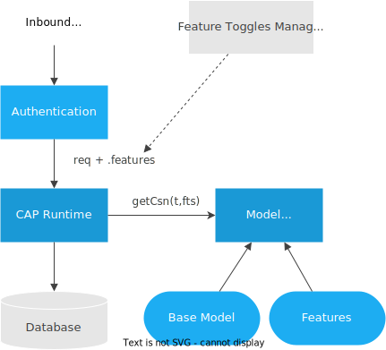
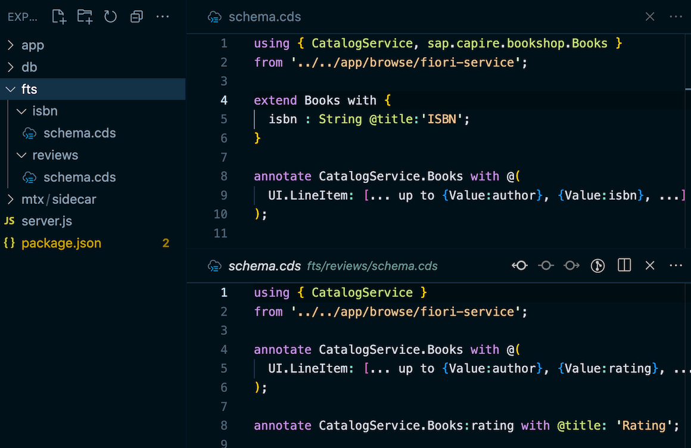
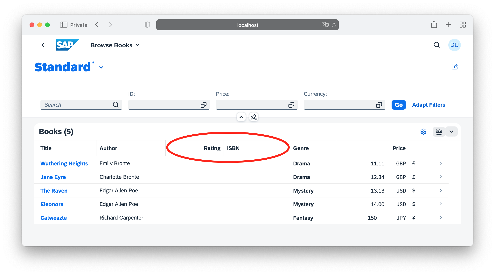

# Feature Toggles

{{$frontmatter?.synopsis}}

<ImplVariantsHint />

## Introduction and Overview

CAP feature-toggled aspects allow SaaS providers to create pre-built features as CDS models, extending the base models with new fields, entities, as well as annotations for SAP Fiori UIs. These features can be assigned to individual SaaS customers (tenants), users, and requests and are then activated dynamically at runtime, as illustrated in the following figure.



### Get `cloud-cap-samples-java` for step-by-step Exercises {.java}

The following steps will extend the [CAP samples for Java](https://github.com/SAP-samples/cloud-cap-samples-java) app to demonstrate how features can extend data models, services, as well as SAP Fiori UIs. If you want to exercise these steps, get [cloud-cap-samples-java](https://github.com/SAP-samples/cloud-cap-samples-java) before, and prepare to extend the *Fiori* app:

<div class="impl java">

```sh
git clone https://github.com/SAP-samples/cloud-cap-samples-java
cd cloud-cap-samples-java
mvn clean install
```

</div>

Now, open the app in your editor, for example, for VS Code type:

```sh
code .
```

### Get `cap/samples` for Step-By-Step Exercises {.node}

The following steps will extend the [cap/samples/fiori](https://github.com/sap-samples/cloud-cap-samples/blob/main/fiori) app to demonstrate how features can extend data models, services, as well as SAP Fiori UIs. If you want to exercise these steps, get [cap/samples](https://github.com/sap-samples/cloud-cap-samples) before, and prepare to extend the *fiori* app:

```sh
git clone https://github.com/sap-samples/cloud-cap-samples samples
cd samples
npm install
```

Now, open the `fiori` app in your editor, for example, by this if you're using VS Code on macOS:

```sh
code fiori
```

## Enable Feature Toggles {.node}

### Add `@sap/cds-mtxs` Package Dependency

For example, like this:

```sh
npm add @sap/cds-mtxs
```

### Switch on `cds.requires.toggles`

Switch on feature toggle support by adding <Config>cds.requires.toggles: true</Config>.

## Adding Features in CDS

Add a subfolder per feature to folder *fts* and put `.cds` files into it. The name of the folder is the name you later on use in feature toggles to switch the feature on/off. In our samples app, we add two features `isbn` and `reviews` as depicted in the following screenshot:

{.ignore-dark}

> The name of the *.cds* files within the *fts/* subfolders can be freely chosen. All *.cds* files found in there will be served, with special handling for *index.cds* files, as usual.

### Feature *fts/isbn*

Create a file *fiori/fts/isbn/schema.cds* with this content:

```cds
using { CatalogService, sap.capire.bookshop.Books }
from '../../app/browse/fiori-service';

// Add new field `isbn` to Books
extend Books with {
  isbn : String @title:'ISBN';
}

// Display that new field in list on Fiori UI
annotate CatalogService.Books with @(
  UI.LineItem: [... up to {Value:author}, {Value:isbn}, ...]
);
```

This feature adds a new field `isbn` to entity `Books` and extends corresponding SAP Fiori annotations to display this field in the *Browse Books* list view.

::: tip
Note that all features will be deployed to each tenant database in order to allow toggling per user/request.
:::

### Feature *fts/reviews*

Create a file *fiori/fts/reviews/schema.cds* with this content:

```cds
using { CatalogService } from '../../app/browse/fiori-service';

// Display existing field `rating` in list on Fiori UI
annotate CatalogService.Books with @(
  UI.LineItem: [... up to {Value:author}, {Value:rating}, ...]
);
```

This feature extends corresponding SAP Fiori annotations to display already existing field `rating` in the *Browse Books* list view.

### Limitations

::: warning
Note the following limitations for `.cds` files in features:

- no `.cds` files in subfolders, for example, `fts/isbn/sub/file.cds`
- no `using` dependencies between features, any entity, service or type that you refer to or extend needs to be part of the base model
- further limitations re `extend aspect` → to be documented
:::

## Toggling Features

In principle, features can be toggled per request, per user, or per tenant; most commonly they'll be toggled per tenant, as demonstrated in the following.

### In Development

<div class="impl node">

CAP Node.js' `mocked-auth` strategy has built-in support for toggling features per tenant, per user, or per request. To demonstrate toggling features per tenant, or user, you can add these lines of configuration to our `package.json` of the SAP Fiori app:

```json
{"cds":{
  "requires": {
    "auth": {
      "users": {
        "carol": { "tenant": "t1" },
        "erin":  { "tenant": "t2" },
        "fred":  { "tenant": "t2", "features":[] }
      },
      "tenants": {
        "t1": { "features": ["isbn"] },
        "t2": { "features": "*" }
      }
    }
  }
}}
```

</div>

<div class="impl java">

CAP Java's [Mock User Authentication with Spring Boot](../../java/security#mock-users) allows to assign feature toggles to users based on the mock user configuration. To demonstrate toggling features per user, you can add these lines to the mock user configuration in the `srv/src/main/resources/application.yaml` file:

```yaml
cds:
  security.mock.users:
    - name: carol
      features:
      - isbn
    - name: erin
      features:
      - isbn
      - reviews
    - name: fred
      features:
```

</div>

In effect of this, for the user `carol` the feature `isbn` is enabled, for `erin`, the features `isbn` and `reviews` are enabled, and for the user `fred` all features are disabled.

### In Production

<div class="impl node">

::: warning No features toggling for production yet
Note that the previous sample is only for demonstration purposes. As user and tenant management is outside of CAP's scope, there's no out-of-the-box feature toggles provider for production yet. → Learn more about that in the following section [*Feature Vector Providers*](#feature-vector-providers).
:::

<div id="toggle-production-node-end" />

</div>

<div class="impl java">

For productive use, the mock user configuration must not be used. The set of active features is determined per request by the [Feature Toggles Info Provider](../../java/reflection-api#feature-toggles-info-provider).

You can register a [Custom Implementation](../../java/reflection-api#custom-implementation) as a Spring bean that computes the active feature set based on the request's `UserInfo` and `ParameterInfo`.

<div id="toggle-production-java-end" />

</div>

## Test-Drive Locally {.node}

To test feature toggles, just run your CAP server as usual, then log on with different users, assigned to different tenants, to see the effects.

### Run `cds watch`

Start the CAP server with `cds watch` as usual:

```sh
cds watch
```

→ in the log output, note the line reporting:

```js
[cds] - serving cds.xt.ModelProviderService {
  path: '/-/cds/model-provider',
  impl: '@sap/cds/srv/model-provider.js'
}
```

> The `ModelProviderService` is used by the runtime to get feature-enhanced models.

### See Effects in SAP Fiori UIs {#test-fiori-node}

To see the effects in the UIs open three anonymous browser windows, one for each user to log in, and:

1. [Open SAP Fiori app in browser](http://localhost:4004/fiori-apps.html) and go to [Browse Books](http://localhost:4004/fiori-apps.html#Books-display).
2. Log in as `carol` and see `ISBN` column in list.
3. Log in as `erin` and see `Ratings` and `ISBN` columns in list.
4. Log in as `fred` and no features for *Fred*, even though same tenant as *Erin*.

For example the displayed UI should look like that for `erin`:



## Model Provider in Sidecar

The `ModelProviderService`, which is used for toggling features, is implemented in Node.js only. To use it with CAP Java apps, you run it in a so-called *MTX sidecar*. For a CAP Node.js project, this service is always run embedded with the main application.

### Create Sidecar as Node.js Project

An MTX sidecar is a standard, yet minimalistic Node.js CAP project. By default it's added to a subfolder *mtx/sidecar* within your main project, containing just a *package.json* file:

<div class="impl node">

::: code-group

```json [mtx/sidecar/package.json]
{
  "name": "mtx-sidecar", "version": "0.0.0",
  "dependencies": {
    "@sap/cds": "^9",
    "@sap/cds-mtxs": "^3",
    "express": "^4"
  },
  "cds": {
    "profile": "mtx-sidecar"
  }
}
```

:::

</div>


<div class="impl java">

::: code-group

```json [mtx/sidecar/package.json]
{
  "name": "mtx-sidecar", "version": "0.0.0",
  "dependencies": {
    "@sap/cds": "^9",
    "@sap/cds-mtxs": "^3",
    "express": "^4"
  },
  "cds": {
    "profiles": [
      "mtx-sidecar",
      "java"
    ]
  }
}
```

:::

</div>

[Learn more about setting up **MTX sidecars**.](../multitenancy/mtxs#sidecars){.learn-more}

### Add Remote Service Link to Sidecar

<div class="impl node">

::: tip
In Node.js apps you usually don't consume services from the sidecar. The *ModelProviderService* is served both, embedded in the main app as well as in the sidecar. The following is documented for the sake of completeness only...
:::

You can use the `from-sidecar` preset to tell the CAP runtime to use the remote model provider from the sidecar:

```json
"cds":{
  "requires": {
    "toggles": true,
    "cds.xt.ModelProviderService": "from-sidecar"
  }
}
```

[Learn more about configuring ModelProviderService.](../multitenancy/mtxs#model-provider-config){.learn-more}

</div>

<div class="impl java">

You need to configure the CAP Java application to request the CDS model from the Model Provider Service.
This is done in the `application.yaml` file of your application.
To enable the Model Provider Service for local development, add the following configuration to the `default` profile:

```yaml
cds:
  model:
    provider:
      url: http://localhost:4005
      # remove, in case you need tenant extensibility
      extensibility: false
```

</div>

### Test-Drive Sidecar Locally

With the setup as described in place, you can run the main app locally with the Model Provider as sidecar. Simply start the main app and the sidecar in two separate shells:

**First, start the sidecar** as the main app now depends on the sidecar:

```sh
cds watch mtx/sidecar
```

**Then, start the main app** in the second shell:

<div class="impl node">

```sh
cds watch
```

</div>

<div class="impl java">

```sh
mvn spring-boot:run
```

</div>

#### Remote `getCsn()` Calls to Sidecar at Runtime {.node}

When you now run and use our application again as described in the previous section [See Effects in SAP Fiori UIs](#test-fiori-node), you can see in the trace logs that the main app sends `getCsn` requests to the sidecar, which in response to that reads and returns the main app's models. That means, the models from two levels up the folder hierarchy as configured by `root: ../..` for development.

### See Effects in SAP Fiori UIs {#test-fiori-java .java}

To see the effects in the UIs open three anonymous browser windows, one for each user to log in, and:

1. [Open SAP Fiori app in browser](localhost:8080/fiori.html) and go to [Browse Books](localhost:8080/fiori.html#browse-books).
2. Log in as `carol` and see `ISBN` column in list.
3. Log in as `erin` and see `Ratings` and `ISBN` columns in list.
4. Log in as `fred` and no features for *Fred*, even though same tenant as *Erin*.

For example the displayed UI should look like that for `erin`:


## Feature Vector Providers {.node}

In principle, features can be toggled *per request* using the `req.features` property (`req` being the standard HTTP req object here, not the CAP runtimes `req` object). This property is expected to contain one of the following:

- An array with feature names, for example, `['isbn','reviews']`.
- A string with comma-separated feature names, for example, `'isbn,reviews'`.
- An object with keys being feature names, for example, `{isbn:true,reviews:true}`.

So, to add support for a specific feature toggles management you can add a simple Express.js middleware as follows, for example, in your `server.js`:

```js
const cds = require ('@sap/cds')
cds.on('bootstrap', app => app.use ((req,res,next) => {
  req.features = req.headers.features || 'isbn'
  next()
}))
```

## Feature-Toggled Custom Logic

<div class="impl java">

[Evaluate the `FeatureTogglesInfo` in custom code](../../java/reflection-api#using-feature-toggles-in-custom-code) to check if a feature is enabled:

```java
@Autowired FeatureTogglesInfo features;

...

if (features.isEnabled("discount")) {
  // specific coding when feature 'discount' is enabled...
}
```

</div>

<div class="impl node">

Within your service implementations, you can react on feature toggles by inspecting `cds.context.features` like so:

```js
const { features } = cds.context
if ('isbn' in features) {
  // specific coding when feature 'isbn' is enabled...
}
if ('reviews' in features) {
  // specific coding when feature 'reviews' is enabled...
}
// common coding...
```

Or alternatively:

```js
const { isbn, reviews } = cds.context.features
if (isbn) {
  // specific coding when feature 'isbn' is enabled...
}
if (reviews) {
  // specific coding when feature 'reviews' is enabled...
}
// common coding...
```

</div>
