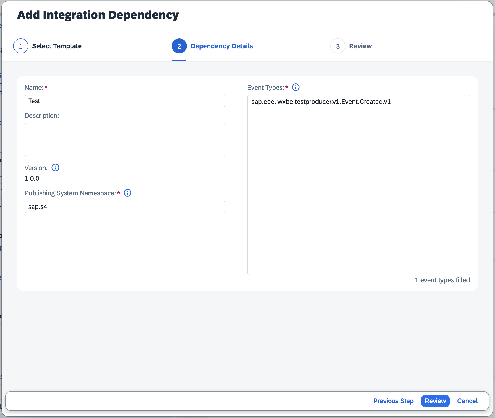

<script setup>
  import { h } from 'vue'
  const X =  () => h('span', { class: 'ga',      title: 'Available' },      ['✓']   )
  const Na = () => h('i',    { class: 'na',      title: 'not applicable' }, ['n/a'] )
  const D =  () => h('i',    { class: 'prog',    title: 'in progress'  },   ['in prog.'] )
  const O =  () => h('i',    { class: 'plan',    title: 'planned'  },       ['planned'] )
</script>
<style scoped>
  .ga   { color: var(--vp-c-green-2); font-weight:900;}
  .na   { color: #aaa; font-size:90%; }
  .prog { color: var(--vp-c-green-3); font-size:90%; font-weight:500; }
  .plan { color: #089; font-size:90% }
</style>


# Using SAP Cloud Application Event Hub in Cloud Foundry

[SAP Cloud Application Event Hub](https://help.sap.com/docs/event-broker) is the new default offering for messaging in SAP Business Technology Platform (SAP BTP).
CAP provides out-of-the-box support for SAP Cloud Application Event Hub, and automatically handles many things behind the scenes, so that application coding stays agnostic and focused on conceptual messaging.

::: warning
The following guide is based on a productive (paid) account on SAP BTP.
:::

[[toc]]

<span id="eventbrokerfeaturematrix" />


## Consuming Events in a Stand-alone App { #consume-standalone }

This guide describes the end-to-end process of developing a stand-alone (or "single tenant") CAP application that consumes messages via SAP Cloud Application Event Hub.
The guide uses SAP S/4HANA as the event emitter, but this is a stand-in for any system that is able to publish CloudEvents via SAP Cloud Application Event Hub.

Sample app: [@capire/incidents with Customers based on S/4's Business Partners](https://github.com/cap-js/incidents-app/tree/event-broker)


### Prerequisite: Events & Messaging in CAP

From the perspective of a CAP developer, SAP Cloud Application Event Hub is yet another messaging broker.
That is to say, CAP developers focus on [modeling their domain](../domain-modeling) and [implementing their domain-specific custom logic](../providing-services#custom-logic).
Differences between the various event transporting technologies are held as transparent as possible.

Hence, before diving into this guide, you should be familiar with the general guide for [Events & Messaging in CAP](../messaging/), as it already covers the majority of the content.

Since SAP Cloud Application Event Hub is based on the [CloudEvents](https://cloudevents.io/) standard, the `@topic` annotation for events in your CDS model is interpreted as the CloudEvents `type` attribute.


### Add Events and Handlers

There are two options for adding the events that shall be consumed to your model, and subsequently registering event handlers for the same.

#### 1. Import and Augment

This approach is described in [Events from SAP S/4HANA](../messaging/#events-from-sap-s-4hana), [Receiving Events from SAP S/4HANA Cloud Systems](../messaging/s4), and specifically [Consume Events Agnostically](../messaging/s4#consume-events-agnostically) regarding handler registration.

#### 2. Using Low-Level Messaging

As a second option, you can skip the modeling part and simply use [Low-Level Messaging](../messaging/s4#using-low-level-messaging).
However, please note that future [Open Resource Discovery (ORD)](https://sap.github.io/open-resource-discovery/) integration will most likely benefit from modeled approaches.


### Use `event-broker`

Configure your application to use the `event-broker` messaging service.

[Learn more about configuring SAP Cloud Application Event Hub in CAP Node.js](../../node.js/messaging#event-broker){.learn-more}

[Learn more about `cds.env` profiles](../../node.js/cds-env#profiles){.learn-more}

::: tip Local Testing
Since SAP Cloud Application Event Hub sends events via HTTP, you won't be able to receive events on your local machine unless you use a tunneling service. Therefore we recommend to use a messaging service of kind [`local-messaging`](../../node.js/messaging#local-messaging) for local testing.
:::


### Deploy to the Cloud (with MTA)

Please see [Deploy to Cloud Foundry](../deployment/to-cf) regarding deployment with MTA as well as the deployment section from [SAP Cloud Application Event Hub in CAP Node.js](../../node.js/messaging#event-broker).


### Connecting it All Together

In SAP BTP System Landscape, add a new system of type `SAP BTP Application` for your CAP application including its integration dependencies, connect all involved systems (incl. SAP Cloud Application Event Hub) into a formation and enable the event subscription.
Please refer to the [official SAP Cloud Application Event Hub documentation](https://help.sap.com/docs/event-broker) for more info.

<!-- TODO: enable once available -->
<!-- , as described in [CAP Application as a Subscriber](https://help.sap.com/docs/event-broker/event-broker-draft-service/integration-example-using-cap-application?state=DRAFT). -->

::: tip Test Events
For testing purposes, SAP S/4HANA can send technical test events of type `sap.eee.iwxbe.testproducer.v1.Event.Created.v1` which your app can subscribe to. You can trigger such events with _Enterprise Event Enablement - Event Monitor_.
:::


<!--The following mta.yaml snippet ensures the sequential creation of the SAP Event Broker and IAS service instances, as well as binds the application to both service instances with the respectively necessary configuration.-->

<!--```yaml-->
<!--ID: cap.incidents-->
<!---->
<!--modules:-->
<!--  - name: incidents-srv-->
<!--    provides:-->
<!--      - name: incidents-srv-api-->
<!--        properties:-->
<!--          url: ${default-url} #> needed in webhookUrl and home-url below-->
<!--    requires:-->
<!--      - name: incidents-event-broker-->
<!--        parameters:-->
<!--          config:-->
<!--            authentication-type: X509_IAS-->
<!--      - name: incidents-ias-->
<!--        parameters:-->
<!--          config:-->
<!--            credential-type: X509_GENERATED-->
<!--            app-identifier: cap.incidents #> any value, e.g., reuse MTA ID-->
<!---->
<!--resources:-->
<!--  - name: incidents-event-broker-->
<!--    type: org.cloudfoundry.managed-service-->
<!--    parameters:-->
<!--      service: event-broker-->
<!--      service-plan: event-connectivity-->
<!--      config:-->
<!--        # unique identifier for this event broker instance-->
<!--        # should start with own namespace (i.e., "foo.bar") and may not be longer than 15 characters-->
<!--        systemNamespace: cap.incidents-->
<!--        webhookUrl: ~{incidents-srv-api/url}/-/cds/event-broker/webhook-->
<!--    requires:-->
<!--      - name: incidents-srv-api-->
<!--  - name: incidents-ias-->
<!--    type: org.cloudfoundry.managed-service-->
<!--    requires:-->
<!--      - name: incidents-srv-api-->
<!--    processed-after:-->
<!--      # for consumed-services (cf. below), incidents-event-broker must already exist-->
<!--      # -> ensure incidents-ias is created after incidents-event-broker-->
<!--      - incidents-event-broker-->
<!--    parameters:-->
<!--      service: identity-->
<!--      service-plan: application-->
<!--      config:-->
<!--        consumed-services:-->
<!--          - service-instance-name: incidents-event-broker-->
<!--        display-name: cap.incidents #> any value, e.g., reuse MTA ID-->
<!--        home-url: ~{incidents-srv-api/url}-->
<!--```-->
<!---->
<!--Please note that the mta.yaml snippet above is based on the sample app [@capire/incidents](https://github.com/cap-js/incidents-app/tree/event-broker), i.e., ID, module, and resource names are taken from this context and need to be adjusted.-->
<!---->
<!--The full `mta.yaml` of the sample application can be found [here](https://github.com/cap-js/incidents-app/blob/event-broker/mta.yaml).-->


<!--
- Should not be part of the guide, but rather a link to their documentation
- Test events are not treated differently, if you want to test your app, trigger an event for which you already declared integration dependencies


### End-to-End Test

You can conduct an end-to-end test of your finalized setup by executing the following steps.

#### 1. Add Integration Dependency

In BTP Cockpit &rarr; System Landscape, navigate to the system that represents your CAP application.
Add an _Integration Dependency_ using the _Simplified Business Eventing Template_ for _Event Type_ `sap.eee.iwxbe.testproducer.v1.Event.Created.v1` and _Publishing System Namespace_ `sap.s4` as shown in the following screenshot.



#### 2. Activate Event Subscription

In SAP Event Broker Application, activate the subscription for the added integration dependency (cf. [Enabling SAP Event Subscriptions](https://help.sap.com/docs/event-broker/event-broker-service-guide/enable-subscriptions)).

#### 3. Trigger Test Event

In S/4HANA Cloud, navigate to application _Enterprise Event Enablement - Event Monitor_ and navigate into the channel you created during setup.
On the top right, press button _Produce Test Event_.
This will add an entry in the list of _Outbound Events_ with topic `na/na/na/ce/sap/eee/iwxbe/testproducer/v1/Event/Created/v1` and, eventually, status _Acknowledged_.

#### 4. Check Application Logs

In the application logs of your CAP application, check for a log entry noting the successful event reception as shown in the following screenshot.


-->


<!-- TODO

### Hybrid Testing

Possible? If yes, how?

-->


<span id="eventbrokersaasconsuming" />

<span id="eventbrokersaaspublishing" />
