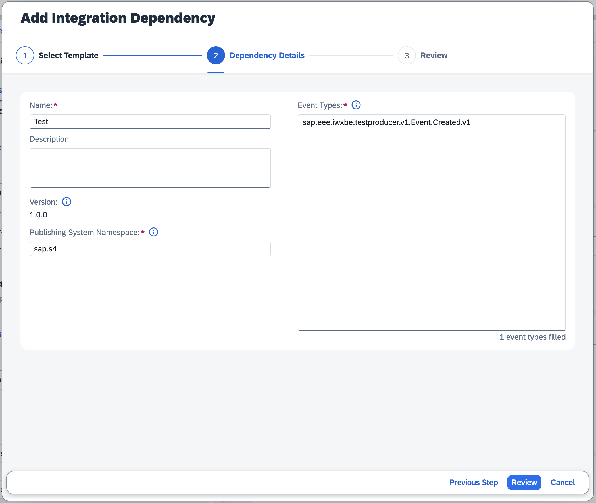
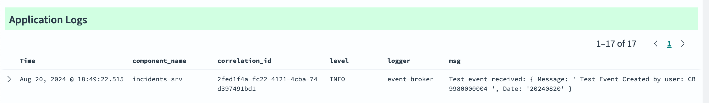

# Using SAP Event Broker in Cloud Foundry

[SAP Event Broker](https://help.sap.com/docs/event-broker) is the new default offering for messaging in SAP Business Technology Platform (SAP BTP).
CAP provides growing out-of-the-box support for SAP Event Broker, and automatically handles many things behind the scenes, so that application coding stays agnostic and focused on conceptual messaging.

::: warning
Only available for Node.js. Java to follow soon.
:::

::: warning
The following guide is based on a productive (paid) account on SAP BTP.
:::

[[toc]]

<span id="eventbrokerfeaturematrix" />


## Consuming Events in a Stand-alone App

This guide describes the end-to-end process of developing a stand-alone (or "single tenant") CAP application that consumes messages via SAP Event Broker.
The guide uses SAP S/4HANA as the event emitter, but this is a stand-in for any system that is able to publish cloud events via SAP Event Broker.

Sample app: [@capire/incidents with Customers based on S/4's Business Partners](https://github.com/cap-js/incidents-app/tree/event-broker)


### Prerequisite: Events & Messaging in CAP

From the perspective of a CAP developer, SAP Event Broker is yet another messaging broker.
That is to say, CAP developers focus on [modeling their domain](../domain-modeling) and [implementing their domain-specific custom logic](../providing-services#custom-logic).
Differences between the various event transporting technologies are held as transparent as possible.

Hence, before diving into this development guide, you should be familiar with the general guide for [Events & Messaging in CAP](../messaging/), as it already covers the majority of the content.


### Prerequisite: Setup SAP Event Broker

// TODO: the guide is not yet published!!!

Follow guide _SAP Event Broker Service Guide_ &rarr; _Integration Scenarios_ &rarr; [CAP Application as a Subscriber](https://help.sap.com/docs/event-broker/event-broker-draft-service/integration-example-using-cap-application?state=DRAFT) to prepare your SAP BTP account for event consumption.


### Add Events and Handlers

There are three options for adding the events that shall be consumed to your model, and subsequently registering event handlers for the same.

#### 1. Import and Augment

This approach is described in [Events from SAP S/4HANA](../messaging/#events-from-sap-s-4hana), [Receiving Events from SAP S/4HANA Cloud Systems](../messaging/s4), and specifically [Consume Events Agnostically](../messaging/s4#consume-events-agnostically) regarding handler registration.

#### 2. Decoupled

In the second option, you define the event manually in any service, but link it to the respective cloud event type via `@topic`.

```cds
service Foo {
  event Bar @(topic:'my.name.space.myentity.myoperation.v1') {
    baz: String;
  }
}
```
```js
Foo.on('Bar', msg => { ... })
```

#### 3. Using Low-Level Messaging

As a third option, you can skip the modeling part and simply use [Low-Level Messaging](../messaging/s4#using-low-level-messaging).
However, please note that future [Open Resource Discovery (ORD)](https://sap.github.io/open-resource-discovery/) integration will most likely benefit from modeled approaches.


### Use `event-broker`

Add the following to your _package.json_ to use SAP Event Broker:

```jsonc
"cds": {
  "requires": {
    "messaging": {
      "[production]": {
        "kind": "event-broker"
      }
    }
  }
}
```

[Learn more about `cds.env` profiles](../../node.js/cds-env#profiles){.learn-more}

For more details on how to configure using SAP Event Broker, see _Node.js_ &rarr; _Messaging_ &rarr; _Message Brokers_ &rarr; [SAP Event Broker](../../node.js/messaging#sap-event-broker).


### Deploy to the Cloud (with MTA)

Please see [Deploy to Cloud Foundry](../deployment/to-cf) regarding deployment with MTA.

The following mta.yaml snippet ensures the sequential creation of the SAP Event Broker and IAS service instances, as well as binds the application to both service instances with the respectively necessary configuration.

```yaml
ID: cap.incidents

modules:
  - name: incidents-srv
    provides:
      - name: incidents-srv-api
        properties:
          url: ${default-url} #> needed in webhookUrl and home-url below
    requires:
      - name: incidents-event-broker
        parameters:
          config:
            authentication-type: X509_IAS
      - name: incidents-ias
        parameters:
          config:
            credential-type: X509_GENERATED
            app-identifier: cap.incidents #> any value, e.g., reuse MTA ID

resources:
  - name: incidents-event-broker
    type: org.cloudfoundry.managed-service
    parameters:
      service: event-broker
      service-plan: event-connectivity
      config:
        # unique identifier for this event broker instance
        # should start with own namespace (i.e., "foo.bar") and may not be longer than 15 characters
        systemNamespace: cap.incidents
        webhookUrl: ~{incidents-srv-api/url}/-/cds/event-broker/webhook
    requires:
      - name: incidents-srv-api
  - name: incidents-ias
    type: org.cloudfoundry.managed-service
    requires:
      - name: incidents-srv-api
    processed-after:
      # for consumed-services (cf. below), incidents-event-broker must already exist
      # -> ensure incidents-ias is created after incidents-event-broker
      - incidents-event-broker
    parameters:
      service: identity
      service-plan: application
      config:
        consumed-services:
          - service-instance-name: incidents-event-broker
        display-name: cap.incidents #> any value, e.g., reuse MTA ID
        home-url: ~{incidents-srv-api/url}
```

Please note that the mta.yaml snippet above is based on the sample app [@capire/incidents](https://github.com/cap-js/incidents-app/tree/event-broker), i.e., ID, module, and resource names are taken from this context and need to be adjusted.

The full `mta.yaml` of the sample application can be found [here](https://github.com/cap-js/incidents-app/blob/event-broker/mta.yaml).


### End-to-End Test

You can conduct an end-to-end test of your finalized setup by executing the following steps.

#### 1. Add Integration Dependency

In BTP Cockpit &rarr; System Landscape, navigate to the system that represents your CAP application.
Add an _Integration Dependency_ using the _Simplified Business Eventing Template_ for _Event Type_ `sap.eee.iwxbe.testproducer.v1.Event.Created.v1` and _Publishing System Namespace_ `sap.s4` as shown in the following screenshot.



#### 2. Activate Event Subscription

In SAP Event Broker Application, activate the subscription for the added integration dependency (cf. [Enabling SAP Event Subscriptions](https://help.sap.com/docs/event-broker/event-broker-service-guide/enable-subscriptions)).

#### 3. Trigger Test Event

In S/4HANA Cloud, navigate to application _Enterprise Event Enablement - Event Monitor_ and navigate into the channel you created during setup.
On the top right, press button _Produce Test Event_.
This will add an entry in the list of _Outbound Events_ with topic `na/na/na/ce/sap/eee/iwxbe/testproducer/v1/Event/Created/v1` and, eventually, status _Acknowledged_.

#### 4. Check Application Logs

In the application logs of your CAP application, check for a log entry noting the successful the event reception as shown in the following screenshot.




<!-- TODO

### Hybrid Testing

Possible? If yes, how?

-->


<span id="eventbrokersaasconsuming" />

<span id="eventbrokersaaspublishing" />
