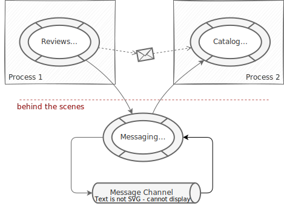

# Events and Messaging

<!-- <div id="impl-variants" style="margin:-80px 0 80px 3px;">
  <a impl-variant="node" class="impl-variant" title="Content for Node.js">Node.js</a>
  <a impl-variant="java" class="impl-variant" title="Content for Java">Java</a>
</div> -->

<div v-html="$frontmatter?.synopsis" />

[[toc]]


## Introduction — Ubiquitous Events in CAP {#intro}

We're starting with an introduction to the core concepts in CAP. If you want to skip the introduction, you can fast-forward to the samples part starting at [Books Reviews Sample](#books-reviews-sample).


### Intrinsic Eventing in CAP Core

As introduced in [About CAP](../../about/#events), everything happening at runtime is in response to events, and all service implementations take place in [event handlers](../providing-services#event-handlers). All CAP services intrinsically support emitting and reacting to events, as shown in this simple code snippet (you can copy & run it in `cds repl`):

```js
let srv = new cds.Service
// Receiving Events
srv.on ('some event', msg => console.log('1st listener received:', msg))
srv.on ('some event', msg => console.log('2nd listener received:', msg))
// Emitting Events
await srv.emit ('some event', { foo:11, bar:'12' })
```

::: tip Intrinsic support for events
The core of CAP's processing model: all services are event emitters. Events can be sent to them, emitted by them, and event handlers register with them to react to such events.
:::

### Typical Emitter and Receiver Roles

In contrast to the previous code sample, emitters and receivers of events are decoupled, in different services and processes. And as all active things in CAP are services, so are usually emitters and receivers of events. Typical patterns look like that:

```js
class Emitter extends cds.Service { async someMethod() {
  // inform unknown receivers about something happened
  await this.emit ('some event', { some:'payload' })
}}
```

```js
class Receiver extends cds.Service { async init() {
  // connect to and register for events from Emitter
  const Emitter = await cds.connect.to('Emitter')
  Emitter.on ('some event', msg => {...})
}}
```

::: tip
**Emitters** usually emit messages to *themselves* to inform *potential* listeners about certain events.
**Receivers** connect to *Emitters* to register handlers to such emitted events.
:::


### Ubiquitous Notion of Events

A *Request* in CAP is actually a specialization of an *Event Message*. The same intrinsic mechanisms of sending and reacting to events are used for asynchronous communication in inverse order. A typical flow:

{.adapt}

Asynchronous communication looks similar, just with reversed roles:

{.adapt}

::: tip Event Listeners vs Interceptors
Requests are handled the same ways as events, with one major difference: While `on` handlers for events are *listeners* (all are called), handlers for synchronous requests are *interceptors* (only the topmost is called by the framework). An interceptor then decides whether to pass down control to `next` handlers or not.
:::

### Asynchronous & Synchronous APIs

To sum up, handling events in CAP is done in the same way as you would handle requests in a service provider. Also, emitting event messages is similar to sending requests. The major difference is that the initiative is inverted: While *Consumers* connect to *Services* in synchronous communications, the *Receivers* connect to _Emitters_ in asynchronous ones;
_Emitters_ in turn don't know _Receivers_.

{.adapt}

::: tip Blurring the line between synchronous and asynchronous API
In essence, services receive events. The emitting service itself or other services can register handlers for those events in order to implement the logic of how to react to these events.
:::


### Why Using Messaging?

Using messaging has two major advantages:

::: tip Resilience
If a receiving service goes offline for a while, event messages are safely stored, and guaranteed to be delivered to the receiver as soon as it goes online again.
:::

::: tip Decoupling
Emitters of event messages are decoupled from the receivers and don't need to know them at the time of sending. This way a service is able to emit events that other services can register on in the future, for example, to implement **extension** points.
:::


## Books Reviews Sample

The following explanations walk us through a books review example from cap/samples:

* **[@capire/bookshop](https://github.com/sap-samples/cloud-cap-samples/tree/main/bookshop)** provides the well-known basic bookshop app.
* **[@capire/reviews](https://github.com/sap-samples/cloud-cap-samples/tree/main/reviews)** provides an independent service to manage reviews.
* **[@capire/bookstore](https://github.com/sap-samples/cloud-cap-samples/tree/main/bookstore)** combines both into a composite application.

{.adapt}

::: tip
Follow the instructions in [*cap/samples/readme*](https://github.com/SAP-samples/cloud-cap-samples#readme) for getting the samples and exercising the following steps.
:::

### Declaring Events in CDS {.h2}

Package `@capire/reviews` essentially provides a `ReviewsService`, [declared like that](https://github.com/sap-samples/cloud-cap-samples/blob/main/reviews/srv/reviews-service.cds):

```cds
service ReviewsService {

  // Sync API
  entity Reviews as projection on my.Reviews excluding { likes }
  action like (review: Reviews:ID);
  action unlike (review: Reviews:ID);

  // Async API
  event reviewed : {
    subject : Reviews:subject;
    count   : Integer;
    rating  : Decimal; // new avg rating
  }

}
```

[Learn more about declaring events in CDS.](../../cds/cdl#events){.learn-more}

As you can read from the definitions, the service's synchronous API allows to create, read, update, and delete user `Reviews` for arbitrary review subjects. In addition, the service's asynchronous API declares the `reviewed` event that shall be emitted whenever a subject's average rating changes.

::: tip
**Services in CAP** combine **synchronous** *and* **asynchronous** APIs. Events are declared on conceptual level focusing on domain, instead of low-level wire protocols.
:::

### Emitting Events {.h2}

Find the code to emit events in *[@capire/reviews/srv/reviews-service.js](https://github.com/SAP-samples/cloud-cap-samples/blob/139d9574950d1a5ead475c7b47deb174418500e4/reviews/srv/reviews-service.js#L12-L20)*:

```js
class ReviewsService extends cds.ApplicationService { async init() {

  // Emit a `reviewed` event whenever a subject's avg rating changes
  this.after (['CREATE','UPDATE','DELETE'], 'Reviews', (req) => {
    let { subject } = req.data, count, rating //= ...
    return this.emit ('reviewed', { subject, count, rating })
  })

}}
```
[Learn more about `srv.emit()` in Node.js.](../../node.js/core-services#srv-emit-event){.learn-more}
[Learn more about `srv.emit()` in Java.](../../java/consumption-api#an-event-based-api){.learn-more}

Method `srv.emit()` is used to emit event messages. As you can see, emitters usually emit messages to themselves, that is, `this`, to inform potential listeners about certain events. Emitters don't know the receivers of the events they emit. There might be none, there might be local ones in the same process, or remote ones in separate processes.

::: tip Messaging on Conceptual Level
Simply use `srv.emit()` to emit events, and let the CAP framework care for wire protocols like CloudEvents, transports via message brokers, multitenancy handling, and so forth.
:::

### Receiving Events {.h2}

Find the code to receive events in *[@capire/bookstore/srv/mashup.js](https://github.com/SAP-samples/cloud-cap-samples/blob/30764b261b6bf95854df59f54a8818a4ceedd462/bookstore/srv/mashup.js#L39-L47)* (which is the basic bookshop app enhanced by reviews, hence integration with `ReviewsService`):

```js
  // Update Books' average ratings when reviews are updated
  ReviewsService.on ('reviewed', (msg) => {
    const { subject, count, rating } = msg.data
    // ...
  })
```

[Learn more about registering event handlers in Node.js.](../../node.js/core-services#srv-on-before-after){.learn-more}
[Learn more about registering event handlers in Java.](../../java/provisioning-api#introduction-to-event-handlers){.learn-more}

The message payload is in the `data` property of the inbound `msg` object.


## In-Process Eventing

As emitting and handling events is an intrinsic feature of the CAP core runtimes, there's nothing else required when emitters and receivers live in the same process.

{.adapt}

Let's see that in action...

### 1. Start a Single Server Process {#start-single-server}

Run the following command to start a reviews-enhanced bookshop as an all-in-one server process:

```sh
cds watch bookstore
```

It produces a trace output like that:

```log
[cds] - mocking ReviewsService { path: '/reviews', impl: '../reviews/srv/reviews-service.js' }
[cds] - mocking OrdersService { path: '/orders', impl: '../orders/srv/orders-service.js' }
[cds] - serving CatalogService { path: '/browse', impl: '../bookshop/srv/cat-service.js' }
[cds] - serving AdminService { path: '/admin', impl: '../bookshop/srv/admin-service.js' }

[cds] - server listening on { url: 'http://localhost:4004' }
[cds] - launched at 5/25/2023, 4:53:46 PM, version: 7.0.0, in: 991.573ms
```

As apparent from the output, both, the two bookshop services `CatalogService` and `AdminService` as well as our new `ReviewsService`, are served in the same process (mocked, as the `ReviewsService` is configured as required service in _bookstore/package.json_).

### 2. Add or Update Reviews {#add-or-update-reviews}

Now, open [http://localhost:4004/reviews](http://localhost:4004/reviews) to display the Vue.js UI that is provided with the reviews service sample:


- Choose one of the reviews.
- Change the 5-star rating with the dropdown.
- Choose *Submit*.
- Enter *bob* to authenticate.

→ In the terminal window you should see a server reaction like this:

```log
[cds] - PATCH /reviews/Reviews/148ddf2b-c16a-4d52-b8aa-7d581460b431
< emitting: reviewed { subject: '201', count: 2, rating: 4.5 }
> received: reviewed { subject: '201', count: 2, rating: 4.5 }
```

Which means the `ReviewsService` emitted a `reviewed` message that was received by the enhanced `CatalogService`.

### 3. Check Ratings in Bookshop App

Open [http://localhost:4004/bookshop](http://localhost:4004/bookshop) to see the list of books served by `CatalogService` and refresh to see the updated average rating and reviews count:


## Using Message Channels

When emitters and receivers live in separate processes, you need to add a message channel to forward event messages. CAP provides messaging services, which take care for that message channel behind the scenes as illustrated in the following graphic:




::: tip Uniform, Agnostic Messaging
CAP provides messaging services, which transport messages behind the scenes using different messaging channels and brokers. All of this happens without the need to touch your code, which stays on conceptual level.
:::

### 1. Use `file-based-messaging` in Development

For quick tests during development, CAP provides a simple file-based messaging service implementation. Configure that as follows for the `[development]` profile:

```jsonc
"cds": {
  "requires": {
    "messaging": {
      "[development]": { "kind": "file-based-messaging" }
    },
  }
}
```

[Learn more about `cds.env` profiles.](../../node.js/cds-env#profiles){.learn-more}

In our samples, you find that in [@capire/reviews/package.json](https://github.com/SAP-samples/cloud-cap-samples/blob/main/reviews/package.json) as well as [@capire/bookstore/package.json](https://github.com/SAP-samples/cloud-cap-samples/blob/main/bookstore/package.json), which you'll run in the next step as separate processes.


### 2. Start the `reviews` Service and `bookstore` Separately

First start the `reviews` service separately:

```sh
cds watch reviews
```

The trace output should contain these lines, confirming that you're using `file-based-messaging`, and that the `ReviewsService` is served by that process at port 4005:

```log
[cds] - connect to messaging > file-based-messaging { file: '~/.cds-msg-box' }
[cds] - serving ReviewsService { path: '/reviews', impl: '../reviews/srv/reviews-service.js' }

[cds] - server listening on { url: 'http://localhost:4005' }
[cds] - launched at 5/25/2023, 4:53:46 PM, version: 7.0.0, in: 593.274ms
```

Then, in a separate terminal start the `bookstore` server as before:

```sh
cds watch bookstore
```

This time the trace output is different to [when you started all in a single server](#start-single-server). The output confirms that you're using `file-based-messaging`, and that you now *connected* to the separately started `ReviewsService` at port 4005:

```log
[cds] - connect to messaging > file-based-messaging { file: '~/.cds-msg-box' }
[cds] - mocking OrdersService { path: '/orders', impl: '../orders/srv/orders-service.js' }
[cds] - serving CatalogService { path: '/browse', impl: '../reviews/srv/cat-service.js' }
[cds] - serving AdminService { path: '/admin', impl: '../reviews/srv/admin-service.js' }
[cds] - connect to ReviewsService > odata { url: 'http://localhost:4005/reviews' }

[cds] - server listening on { url: 'http://localhost:4004' }
[cds] - launched at 5/25/2023, 4:55:46 PM, version: 7.0.0, in: 1.053s
```

### 3. Add or Update Reviews {#add-or-update-reviews-2}

Similar to before, open [http://localhost:4005/vue/index.html](http://localhost:4005/vue/index.html) to add or update reviews.

→ In the terminal window for the `reviews` server you should see this:

```log
[cds] - PATCH /reviews/Reviews/74191a20-f197-4829-bd47-c4676710e04a
< emitting: reviewed { subject: '251', count: 1, rating: 3 }
```

→ In the terminal window for the `bookstore` server you should see this:

```log
> received: reviewed { subject: '251', count: 1, rating: 3 }
```

::: tip **Agnostic Messaging APIs**
Without touching any code the event emitted from the `ReviewsService` got transported via `file-based-messaging` channel behind the scenes and was received in the `bookstore` as before, when you used in-process eventing → which was to be shown (*QED*).
:::

### 4. Shut Down and Restart Receiver → Resilience by Design

You can simulate a server outage to demonstrate the value of messaging for resilience as follows:

1. Terminate the `bookstore` server with <kbd>Ctrl</kbd> + <kbd>C</kbd> in the respective terminal.
2. Add or update more reviews as described before.
3. Restart the receiver with `cds watch bookstore`.

→ You should see some trace output like that:

```log
[cds] - server listening on { url: 'http://localhost:4004' }
[cds] - launched at 5/25/2023, 10:45:42 PM, version: 7.0.0, in: 1.023s
[cds] - [ terminate with ^C ]

> received: reviewed { subject: '207', count: 1, rating: 2 }
> received: reviewed { subject: '207', count: 1, rating: 2 }
> received: reviewed { subject: '207', count: 1, rating: 2 }
```

::: tip **Resilience by Design**
All messages emitted while the receiver was down stayed in the messaging queue and are delivered when the server is back.
:::


### Have a Look Into _~/.cds-msg-box_

You can watch the messages flowing through the message queue by opening _~/.cds-msg-box_ in a text editor. When the receiver is down and therefore the message not already consumed, you can see the event messages emitted by the `ReviewsService` in entries like that:

```json
ReviewsService.reviewed {"data":{"subject":"201","count":4,"rating":5}, "headers": {...}}
```


## Using Multiple Channels

By default CAP uses a single message channel for all messages.

For example: If you consume messages from SAP S/4HANA in an enhanced version of `bookstore`, as well as emit messages a customer could subscribe and react to in a customer extension, the overall topology would look like that:

{.adapt}

### Using Separate Channels

Now, sometimes you want to use separate channels for different emitters or receivers. Let's assume you want to have a dedicated channel for all events from SAP S/4HANA, and yet another separate one for all outgoing events, to which customer extensions can subscribe too. This situation is illustrated in this graphic:

{.adapt}

This is possible when using [low-level messaging](#low-level-messaging), but comes at the price of loosing all advantages of conceptual-level messaging as explained in the following.

### Using `composite-messaging` Implementation

To avoid falling back to low-level messaging, CAP provides the `composite-messaging` implementation, which basically acts like a transparent dispatcher for both, inbound and outbound messages. The resulting topology would look like that:

{.adapt}


::: tip **Transparent Topologies**
The `composite-messaging` implementation allows to flexibly change topologies of message channels at deployment time, without touching source code or models.
:::

### Configuring Individual Channels and Routes

You would configure this in `bookstore`'s _package.json_ as follows:

```jsonc
"cds": {
  "requires": {
    "messaging": {
      "kind": "composite-messaging",
      "routes": {
        "ChannelA": ["**/ReviewsService/*"],
        "ChannelB": ["**/sap/s4/**"]
        "ChannelC": ["**/bookshop/**"]
      }
    },
    "ChannelA": {
      "kind": "enterprise-messaging", ...
    },
    "ChannelB": {
      "kind": "enterprise-messaging", ...
    },
    "ChannelC": {
      "kind": "enterprise-messaging", ...
    }
  }
}
```

In essence, you first configure a messaging service for each channel. In addition, you would configure the default `messaging` service to be of kind `composite-messaging`.

In the `routes`, you can use the glob pattern to define filters for event names, that means:

- `**` will match any number of characters.
- `*` will match any number of characters except `/` and `.`.
- `?` will match a single character.

::: tip
You can also refer to events declared in CDS models, by using their fully qualified event name (unless annotation `@topic` is used on them).
:::

## Low-Level Messaging

In the previous sections it's documented how CAP promotes messaging on conceptual levels, staying agnostic to topologies and message brokers. While CAP strongly recommends staying on that level, CAP also offers lower-level messaging, which loses some of the advantages but still stays independent from specific message brokers.

::: tip Messaging as Just Another CAP Service
All messaging implementations are provided through class `cds.MessagingService` and broker-specific subclasses of that. This class is in turn a standard CAP service, derived from `cds.Service`, hence it's consumed as any other CAP service, and can also be extended by adding event handlers as usual.
:::

#### Configure Messaging Services

As with all other CAP services, add an entry to `cds.requires` in your _package.json_ or _.cdsrc.json_ like that:

```jsonc
"cds": {
  "requires": {
    "messaging": {
      "kind": // ...
    },
  }
}
```

[Learn more about `cds.env` and `cds.requires`.](../../node.js/cds-env#services){.learn-more}

You're free how you name your messaging service. Could be `messaging` as in the previous example, or any other name you choose. You can also configure multiple messages services with different names.

#### Connect to the Messaging Service

Instead of connecting to an emitter service, connect to the messaging service:

```js
const messaging = await cds.connect.to('messaging')
```

#### Emit Events to Messaging Service

Instead of emitter services emitting to themselves, emit to the messaging service:

```js
await messaging.emit ('ReviewsService.reviewed', { ... })
```

#### Receive Events from Messaging Service

Instead of registering event handlers with a concrete emitter service, register handlers on the messaging service:

```js
messaging.on ('ReviewsService.reviewed', msg => console.log(msg))
```

<br>

#### Declared Events and `@topic` Names

When declaring events in CDS models, be aware that the fully qualified name of the event is used as topic names when emitting to message brokers. Based on the following model, the resulting topic name is `my.namespace.SomeEventEmitter.SomeEvent`.

```cds
namespace my.namespace;
service SomeEventEmitter {
  event SomeEvent { ... }
}
```

If you want to manually define the topic, you can use the `@topic` annotation:

```cds
//...
@topic: 'some/very/different/topic-name'
event SomeEvent { ... }
```


#### Conceptual vs. Low-Level Messaging

When looking at the previous code samples, you see that in contrast to conceptual messaging you need to provide fully qualified event names now. This is just one of the advantages you lose. Have a look at the following list of advantages you have using conceptual messaging and lose with low-level messaging.

- Service-local event names (as already mentioned)
- Event declarations (as they go with individual services)
- Generated typed API classes for declared events
- Run in-process without any messaging service

::: tip Always prefer conceptual-level API over low-level API variants.
Besides the things listed above, this allows you to flexibly change topologies, such as starting with co-located services in a single process, and moving single services out to separate micro services later on.
:::


## CloudEvents Standard {#cloudevents}

CAP messaging has built-in support for formatting event data compliant to the [CloudEvents](https://cloudevents.io/) standard. Enable this using the `format` config option as follows:

```json
"cds": {
  "requires": {
    "messaging": {
      "format": "cloudevents"
    }
  }
}
```

With this setting, all mandatory and some more basic header fields, like `type`, `source`, `id`, `datacontenttype`, `specversion`, `time` are filled in automatically. The event name is used as `type`. The message payload is in the `data` property anyways.

::: tip CloudEvents is a wire protocol specification.
Application developers shouldn't have to care for such technical details. CAP ensures that for you, by filling in the respective fields behind the scenes.
:::


## [Using SAP Event Mesh](./event-mesh) {#sap-event-mesh}

CAP has out-of-the-box support for SAP Event Mesh. As an
application developer, all you need to do is configuring CAP to use `enterprise-messaging`,
usually in combination with `cloudevents` format, as in this excerpt from a _package.json_:

```jsonc
"cds": {
  "requires": {
    "messaging": {
      "[production]": {
        "kind": "enterprise-messaging",
        "format": "cloudevents"
      }
    }
  }
}
```

[Learn more about `cds.env` profiles](../../node.js/cds-env#profiles){.learn-more}


::: tip
Find additional information about deploying SAP Event Mesh on SAP BTP in this guide:
[&rarr; **_Using SAP Event Mesh in BTP_**](./event-mesh)
:::


## [Events from SAP S/4HANA](./s4)
<!-- {.toc-redirect} -->

SAP S/4HANA integrates SAP Event Mesh for messaging. That makes it relatively easy
for CAP-based applications to receive events from SAP S/4HANA systems.

In contrast to CAP, the asynchronous APIs of SAP S/4HANA are separate from the synchronous ones (OData, REST).
So, the effort on the CAP side is to fill this gap.
You can achieve it like that, for example, for an already imported SAP S/4HANA BusinessPartner API:

```cds
// filling in missing events as found on SAP Business Accelerator Hub
using { API_BUSINESS_PARTNER as S4 } from './API_BUSINESS_PARTNER';
extend service S4 with {
  event BusinessPartner.Created @(topic:'sap.s4.beh.businesspartner.v1.BusinessPartner.Created.v1') {
    BusinessPartner : String
  }
  event BusinessPartner.Changed @(topic:'sap.s4.beh.businesspartner.v1.BusinessPartner.Changed.v1') {
    BusinessPartner : String
  }
}
```

[Learn more about importing SAP S/4HANA service APIs.](../using-services#external-service-api){.learn-more}

With that gap filled, we can easily receive events from SAP S/4HANA the same way as from CAP services as explained in this guide, for example:

```js
const S4Bupa = await cds.connect.to ('API_BUSINESS_PARTNER')
S4Bupa.on ('BusinessPartner.Changed', msg => {...})
```

::: tip
Find more detailed information specific to receiving events from SAP S/4HANA in this separate guide:
[&rarr; **_Receiving Events from SAP S/4HANA_**](./s4)
:::
