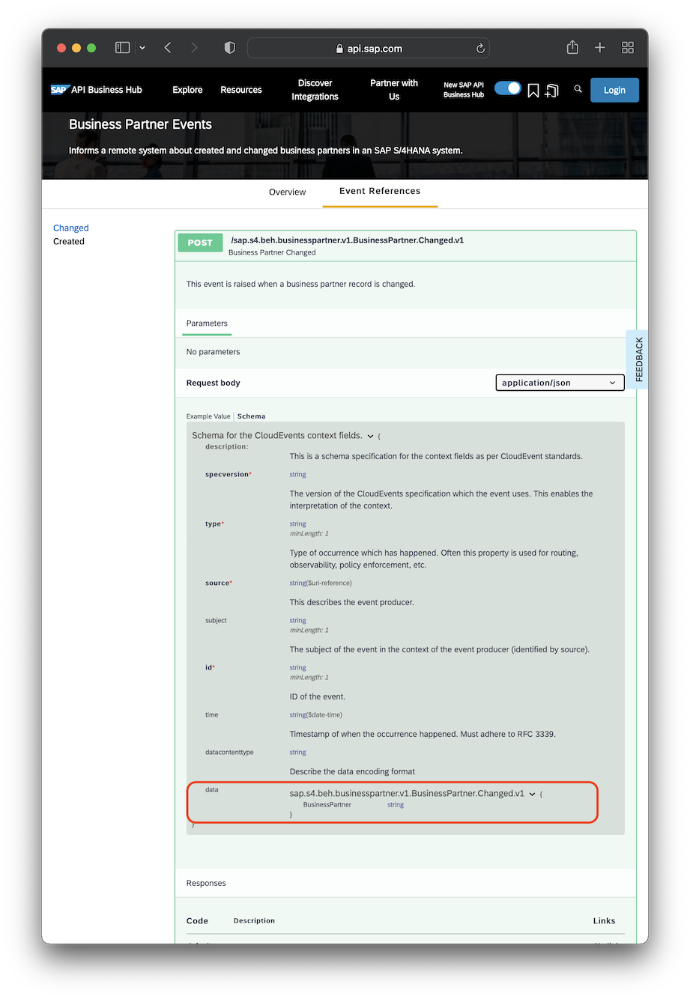

# Receiving Events from SAP S/4HANA Cloud Systems

SAP S/4HANA integrates SAP Event Mesh for messaging, hence it's relatively easy
for CAP-based application to receive events from SAP S/4HANA systems.
This guide provides detailed information on that.

::: tip See also:
[Tutorial: Consume Events from SAP S/4HANA Cloud Using CAP](https://developers.sap.com/mission.btp-consume-events-s4hana-cloud-cap.html)
:::

[[toc]]


## Find & Import APIs

As documented in the [Service Consumption guide](../using-services#external-service-api), get, and `cds import` the API specification of an SAP S/4HANA service you want to receive events from. For example, for "BusinessPartner" using [SAP Business Accelerator Hub](https://api.sap.com/):

1. Find / open [Business Partner (A2X) API](https://api.sap.com/api/API_BUSINESS_PARTNER).
2. Choose button *"API Specification"*.
3. Download the EDMX spec from this list:

1. Import it as a CDS model:

```sh
cds import <downloaded edmx file>
```
[Learn more about importing SAP S/4HANA service APIs.](../using-services#external-service-api){.learn-more}

## Find Information About Events

For example, using [SAP Business Accelerator Hub](https://api.sap.com/):

1. [Find the BusinessPartner Events page.](https://api.sap.com/event/SAPS4HANABusinessEvents_BusinessPartnerEvents/overview)
2. Choose _View Event Reference_.
3. Expand the _POST_ request shown.
4. Choose _Schema_ tab.
5. Expand the `data` property.

{.mute-dark}

The expanded part, highlighted in red, tells you all you need to know:

- the event name: `sap.s4.beh.businesspartner.v1.BusinessPartner.Changed.v1`
- the payload's schema → in `{...}`

> All the other information on this page can be ignored, as it's about standard CloudEvents wire format attributes, which are always the same, and handled automatically by CAP behind the scenes for you.

## Add Missing Event Declarations

In contrast to CAP, the asynchronous APIs of SAP S/4HANA are separate from synchronous APIs (that is, OData, REST).
On CAP side, you need to fill this gap. For example, for an already imported SAP S/4HANA BusinessPartner API:

```cds
// filling in missing events as found on SAP Business Accelerator Hub
using { API_BUSINESS_PARTNER as S4 } from './API_BUSINESS_PARTNER';
extend service S4 with {
  event BusinessPartner.Created @(topic:'<s4namespace>/ce/sap/s4/beh/businesspartner/v1/BusinessPartner/Created/v1') {
    BusinessPartner : String
  }
  event BusinessPartner.Changed @(topic:'<s4namespace>/ce/sap/s4/beh/businesspartner/v1/BusinessPartner/Created/v1') {
    BusinessPartner : String
  }
}
```

<div id="events-policy-sap" />


## Consume Events Agnostically

With agnostic consumption, you can easily receive events from SAP S/4HANA the same way as from CAP services as already explained in this guide, for example like that:

```js
const S4Bupa = await cds.connect.to ('API_BUSINESS_PARTNER')
S4bupa.on ('BusinessPartner.Changed', msg => {...})
```


## Configure SAP Event Mesh

To ease the pain of the afore-mentioned topic rewriting effects, CAP has built-in support for [SAP Event Mesh](./event-mesh). Configure the messaging service as follows, to let it automatically create correct technical topics to subscribe to SAP S/4HANA events:

```json
"cds": {
  "requires": {
    "messaging": {
      "kind": "enterprise-messaging-shared",
      "format": "cloudevents",
      // implicitly applied default prefixes
      "publishPrefix": "$namespace/ce/",
      "subscribePrefix": "+/+/+/ce/"
    }
  }
}
```

**Note:** In contrast to the default configuration recommended in the [SAP Event Mesh documentation](https://help.sap.com/docs/SAP_EM/bf82e6b26456494cbdd197057c09979f/5499e2e74e674c69b057072272c80d4f.html), ensure you configure your service instance to allow the pattern `+/+/+/ce/*` for subscriptions. That is, **do not** restrict `subscribeFilter`s to `${namespace}`!

With that, your developers can enter event names as they're found on SAP Business Accelerator Hub. And our CDS extensions, as previously described, simplify to that definition:

```cds
// filling in missing events as found on SAP Business Accelerator Hub
using { API_BUSINESS_PARTNER as S4 } from './API_BUSINESS_PARTNER';
extend service S4 with {
  event BusinessPartner.Created @(topic:'sap.s4.beh.businesspartner.v1.BusinessPartner.Changed.v1') {
    BusinessPartner : String
  }
  event BusinessPartner.Changed @(topic:'sap.s4.beh.businesspartner.v1.BusinessPartner.Created.v1') {
    BusinessPartner : String
  }
}
```


## Configure SAP S/4HANA

As a prerequisite for consuming SAP S/4HANA events, the SAP S/4HANA system itself needs to be configured to send out specific event messages to a specific SAP Event Mesh service instance. How to create an SAP Event Mesh service instance and use it with a CAP application was already described in the previous sections. A description of how to configure an SAP S/4HANA system to send out specific events is out of scope of this documentation here. See [this documentation](https://help.sap.com/docs/BTP/65de2977205c403bbc107264b8eccf4b/d476ff058bf1413a9505c5c25cfce86b.html) for more details.

## Using Low-Level Messaging

Instead of adding events found on [SAP Business Accelerator Hub](https://api.sap.com/content-type/Events/events/packages) to a CDS service model, it's also possible to use a messaging service directly to consume events from SAP S/4HANA.

You have to bind the `messaging` service directly to the SAP Event Mesh service instance that the SAP S/4HANA system sends the event messages to. Then you can consume the event by registering a handler on the `type` of the event that should be received (`sap.s4.beh.businesspartner.v1.BusinessPartner.Changed.v1` in the example):

```js
const messaging = await cds.connect.to ('messaging')
messaging.on ('sap.s4.beh.businesspartner.v1.BusinessPartner.Changed.v1', (msg) => {
  const { BusinessPartner } = msg.data
  console.log('--> Event received: BusinessPartner changed (ID="'+BusinessPartner+'")')
})
```

All the complex processes, like determining the correct technical topic to subscribe to and adding this subscription to a queue, will be done automatically in the background.
