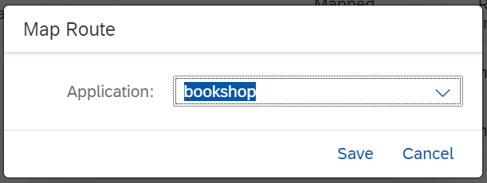
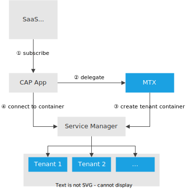

# Multitenancy

[[toc]]

## Introduction & Overview

CAP has built-in support for multitenancy with [the `@sap/cds-mtxs` package](https://www.npmjs.com/package/@sap/cds-mtxs).

Essentially, multitenancy is the ability to serve multiple tenants through single clusters of microservice instances, while strictly isolating the tenants' data. Tenants are clients using SaaS solutions.

In contrast to single-tenant mode, applications wait for tenants to subscribe before serving any end-user requests.

[Learn more about SaaS applications.](#about-saas-applications){.learn-more}

<ImplVariantsHint />

## Prerequisites

Make sure you have the latest version of `@sap/cds-dk` installed:

```sh
npm update -g @sap/cds-dk
```

## Jumpstart with an application

To get a ready-to-use _bookshop_ application you can modify and deploy, run:

::: code-group

```sh [Node.js]
cds init bookshop --add sample
cd bookshop
```

```sh [Java]
cds init bookshop --java --add tiny-sample
cd bookshop
```

:::

## Enable Multitenancy {#enable-multitenancy}

Now, you can run this to enable multitenancy for your CAP application:

```sh
cds add multitenancy
```

<div class="impl node">

::: details See what this adds to your Node.js project…

1. Adds package `@sap/cds-mtxs` to your project:

   ```jsonc
   {
      "dependencies": {
         "@sap/cds-mtxs": "^3"
      },
   }
   ```

2. Adds this configuration to your _package.json_ to enable multitenancy with sidecar:

   ```jsonc
   {
     "cds": {
       "profile": "with-mtx-sidecar",
        "requires": {
          "[production]": {
            "multitenancy": true
          }
       }
     }
   }
   ```

3. Adds a sidecar subproject at `mtx/sidecar` with this _package.json_:

   ```json
   {
     "name": "bookshop-mtx",
     "dependencies": {
       "@cap-js/hana": "^2",
       "@sap/cds": "^9",
       "@sap/cds-mtxs": "^3",
       "@sap/xssec": "^4",
       "express": "^4"
     },
     "devDependencies": {
       "@cap-js/sqlite": "^2"
     },
     "engines": {
       "node": ">=20"
     },
     "scripts": {
       "start": "cds-serve"
     },
     "cds": {
       "profile": "mtx-sidecar"
     }
   }
   ```

4. If necessary, modifies deployment descriptors such as `mta.yaml` for Cloud Foundry and Helm charts for Kyma.

:::

</div>

<div class="impl java">

::: details See what this adds to your Java project…

1. Adds the following to _.cdsrc.json_ in your app:

   ```jsonc
   {
     "profiles": [
       "with-mtx-sidecar",
       "java"
     ],
     "requires": {
       "[production]": {
         "multitenancy": true
       }
     }
   }
   ```

2. Adds the following to your _srv/pom.xml_ in your app:

    ```xml
    <dependency>
        <groupId>com.sap.cds</groupId>
        <artifactId>cds-feature-mt</artifactId>
        <scope>runtime</scope>
    </dependency>
    ```

3. Adds the following to your _srv/src/java/resources/application.yaml_:

    ```yml
    ---
    spring:
      config.activate.on-profile: cloud
    cds:
      multi-tenancy:
        mtxs.enabled: true

    ```

1. Adds a sidecar subproject at `mtx/sidecar` with this _package.json_:

   ```json
   {
     "name": "bookshop-mtx",
     "dependencies": {
       "@cap-js/hana": "^2",
       "@sap/cds": "^9",
       "@sap/cds-mtxs": "^3",
       "@sap/xssec": "^4",
       "express": "^4"
     },
     "devDependencies": {
       "@cap-js/sqlite": "^2"
     },
     "scripts": {
       "start": "cds-serve",
       "build": "cds build ../.. --for mtx-sidecar --production && npm ci --prefix gen"
     },
     "cds": {
       "profile": "mtx-sidecar"
     }
   }
   ```

:::

</div>

::: details Profile-based configuration presets

   The profiles `with-mtx-sidecar` and `mtx-sidecar` activate pre-defined configuration presets, which are defined as follows:

   ```js
   {
     "[with-mtx-sidecar]": { // [!code focus]
       requires: {
         db: {
           '[development]': {
              kind: 'sqlite',
              credentials: { url: 'db.sqlite' },
              schema_evolution: 'auto',
            },
           '[production]': {
              kind: 'hana',
              'deploy-format': 'hdbtable',
              'vcap': {
                'label': 'service-manager'
              }
            },
         },
         "[java]": {
           "cds.xt.ModelProviderService": { kind: 'rest', model:[] },
           "cds.xt.DeploymentService": { kind: 'rest', model:[] },
         },
         "cds.xt.SaasProvisioningService": false,
         "cds.xt.DeploymentService": false,
         "cds.xt.ExtensibilityService": false,
       }
     },
     "[mtx-sidecar]": { // [!code focus]
       requires: {
         db: {
           "[development]": {
              kind: 'sqlite',
              credentials: { url: "../../db.sqlite" },
              schema_evolution: 'auto',
            },
           "[production]": {
              kind: 'hana',
              'deploy-format': 'hdbtable',
              'vcap': {
                'label': 'service-manager'
              }
            },
         },
         "cds.xt.ModelProviderService": {
           "[development]": { root: "../.." }, // sidecar is expected to reside in ./mtx/sidecar
           "[production]": { root: "_main" },
           "[prod]": { root: "_main" } // for simulating production in local tests
         },
         "cds.xt.SaasProvisioningService": true,
         "cds.xt.DeploymentService": true,
         "cds.xt.ExtensibilityService": true,
       },
       "[development]": {
         server: { port: 4005 }
       }
     },
     …
   }
   ```

  ::: tip Inspect configuration
  You can always inspect the _effective_ configuration with `cds env`.
  :::

## Install Dependencies

<div class="impl node">

After adding multitenancy, install your application dependencies:

```sh
npm i
```

</div>

<div class="impl java">

After adding multitenancy, Maven build should be used to generate the model related artifacts:

```sh
mvn install
```

:::warning Error message: 'Invalid MTX sidecar configuration'
If you get the message 'Invalid MTX sidecar configuration', you need to add the dependency to `@sap/cds-mtxs` also to the `package.json` in your project root.
This is a known issue in CDS 9.
:::

</div>

## Test-Drive Locally {#test-locally}

For local testing, create a new profile that contains the multitenancy configuration:

```sh
cds add multitenancy --for local-multitenancy
```

<div class="impl java">

  For multitenancy you need additional dependencies in the _pom.xml_ of the `srv` directory. To support mock users in the local test scenario add `cds-starter-cloudfoundry`:

  ```xml
  <dependency>
    <groupId>com.sap.cds</groupId>
    <artifactId>cds-starter-cloudfoundry</artifactId>
  </dependency>
  ```

  Then you add additional mock users to the spring-boot profile:

  ::: code-group

  ```yaml [application.yaml]
  ---
  spring:
    config.activate.on-profile: local-multitenancy
  #...
  cds:
    multi-tenancy:
      mtxs.enabled: true
    security.mock.users: // [!code focus]
      - name: alice // [!code focus]
        tenant: t1
        roles: [ admin ]
      - name: bob // [!code focus]
        tenant: t1
        roles: [ cds.ExtensionDeveloper ]
      - name:  erin // [!code focus]
        tenant: t2
        roles: [ admin, cds.ExtensionDeveloper ]
  ```

  :::

Configure the sidecar to use dummy authentication.

::: code-group

```json [mtx/sidecar/package.json]
{
  "cds": {
    "profile": "mtx-sidecar",
    "[development]": {
      "requires": {
        "auth": "dummy"
      }
    }
  }
}
```

:::

</div>

Before deploying to the cloud, you can test-drive common SaaS operations with your app locally, including SaaS startup, subscribing tenants, and upgrading tenants.

::: details Using multiple terminals…
In the following steps, we start two servers, the main app and MTX sidecar, and execute some CLI commands. So, you need three terminal windows.
:::

### 1. Start MTX Sidecar

   ```sh
   cds watch mtx/sidecar
   ```

   ::: details  Trace output explained

   In the trace output, we see several MTX services being served; most interesting for multitenancy: the _ModelProviderService_ and the _DeploymentService_.

   ```log
   [cds] - connect using bindings from: { registry: '~/.cds-services.json' }
   [cds] - connect to db > sqlite { url: '../../db.sqlite' }
   [cds] - serving cds.xt.ModelProviderService { path: '/-/cds/model-provider' } // [!code focus]
   [cds] - serving cds.xt.DeploymentService { path: '/-/cds/deployment' } // [!code focus]
   [cds] - serving cds.xt.SaasProvisioningService { path: '/-/cds/saas-provisioning' }
   [cds] - serving cds.xt.ExtensibilityService { path: '/-/cds/extensibility' }
   [cds] - serving cds.xt.JobsService { path: '/-/cds/jobs' }
   ```

   In addition, we can see a `t0` tenant being deployed, which is used by the MTX services for book-keeping tasks.

   ```log
   [cds] - loaded model from 1 file(s):

     ../../db/t0.cds

   [mtx|t0] - (re-)deploying SQLite database for tenant: t0 // [!code focus]
   /> successfully deployed to db-t0.sqlite // [!code focus]
   ```

   With that, the server waits for tenant subscriptions, listening on port 4005 by default in development mode.

   ```log
   [cds] - server listening on { url: 'http://localhost:4005' } // [!code focus]
   [cds] - launched at 3/5/2023, 1:49:33 PM, version: 7.0.0, in: 1.320s
   [cds] - [ terminate with ^C ]
   ```

   :::

   [If you get an error on server start, read the troubleshooting information.](/get-started/troubleshooting#why-do-i-get-an-error-on-server-start){.learn-more}

### 2. Launch App Server

<div class="impl node">

   ```sh
   cds watch --profile local-multitenancy
   ```

   ::: details  Persistent database

   The server starts as usual, but automatically uses a persistent database instead of an in-memory one:

   ```log
   [cds] - loaded model from 6 file(s):

     db/schema.cds
     srv/admin-service.cds
     srv/cat-service.cds
     srv/user-service.cds
     ../../../cds-mtxs/srv/bootstrap.cds
     ../../../cds/common.cds

   [cds] - connect using bindings from: { registry: '~/.cds-services.json' }
   [cds] - connect to db > sqlite { url: 'db.sqlite' } // [!code focus]
   [cds] - serving AdminService { path: '/odata/v4/admin', impl: 'srv/admin-service.js' }
   [cds] - serving CatalogService { path: '/odata/v4/catalog', impl: 'srv/cat-service.js' }
   [cds] - serving UserService { path: '/user', impl: 'srv/user-service.js' }

   [cds] - server listening on { url: 'http://localhost:4004' }
   [cds] - launched at 3/5/2023, 2:21:53 PM, version: 6.7.0, in: 748.979ms
   [cds] - [ terminate with ^C ]
   ```

   :::

</div>

  <div class="impl java">

  ```sh
  cd srv
  mvn cds:watch -Dspring-boot.run.profiles=local-multitenancy
  ```

  ::: details  Persistent database

  The server starts as usual, with the difference that a persistent database is used automatically instead of an in-memory one:

  ```log
  2023-03-31 14:19:23.987  INFO 68528 --- [  restartedMain] c.s.c.bookshop.Application               : The following 1 profile is active: "local-mtxs"
  ...
  2023-03-31 14:19:23.987  INFO 68528 --- [  restartedMain] c.s.c.services.impl.ServiceCatalogImpl   : Registered service ExtensibilityService$Default
  2023-03-31 14:19:23.999  INFO 68528 --- [  restartedMain] c.s.c.services.impl.ServiceCatalogImpl   : Registered service CatalogService
  2023-03-31 14:19:24.016  INFO 68528 --- [  restartedMain] c.s.c.f.s.c.runtime.CdsRuntimeConfig     : Registered DataSource 'ds-mtx-sqlite'// [!code focus]
  2023-03-31 14:19:24.017  INFO 68528 --- [  restartedMain] c.s.c.f.s.c.runtime.CdsRuntimeConfig     : Registered TransactionManager 'tx-mtx-sqlite'// [!code focus]
  2023-03-31 14:19:24.554  INFO 68528 --- [  restartedMain] o.s.b.w.embedded.tomcat.TomcatWebServer  : Tomcat initialized with port(s): 8080 (http)
  2023-03-31 14:19:24.561  INFO 68528 --- [  restartedMain] o.apache.catalina.core.StandardService   : Starting service [Tomcat]
  2023-03-31 14:19:24.561  INFO 68528 --- [  restartedMain] org.apache.catalina.core.StandardEngine  : Starting Servlet engine: [Apache Tomcat/9.0.71]
  ```

  :::

  </div>

### 3. Subscribe Tenants

In the third terminal, subscribe to two tenants using one of the following methods.

   ::: code-group

   ```sh [CLI]
   cds subscribe t1 --to http://localhost:4005 -u yves:
   cds subscribe t2 --to http://localhost:4005 -u yves:
   ```

   ```http
   POST http://localhost:4005/-/cds/deployment/subscribe HTTP/1.1
   Content-Type: application/json
   Authorization: Basic yves:

   { "tenant": "t1" }
   ```

   ```js [JavaScript]
   const ds = await cds.connect.to('cds.xt.DeploymentService')
   await ds.subscribe('t1')
   ```

   :::

   > Run `cds help subscribe` to see all available options.

<!--
<div class="impl java">

   ::: code-group

   ```sh [CLI]
   cds subscribe t1 --to http://localhost:4005 -u yves:
   cds subscribe t2 --to http://localhost:4005 -u yves:
   ```

   ```http
   POST http://localhost:4005/-/cds/deployment/subscribe HTTP/1.1
   Content-Type: application/json

   { "tenant": "t1" }
   ```

   ```sh [with Java Handlers &gt;= Spring Boot 3.2.0]
   # For java you have to run the Subscribe main method. The method waits
   # until all deployments and custom subscribe handlers are finished and
   # then prints the result. To run this method locally, use the following
   # command where application.jar is the one of your application:
   java -cp application.jar -Dloader.main=com.sap.cds.framework.spring.utils.Subscribe org.springframework.boot.loader.launch.PropertiesLauncher <tenant> [<tenant options>]
   ```

  ```sh [with Java Handlers &lt; Spring Boot 3.2.0]
   # For java you have to run the Subscribe main method. The method waits
   # until all deployments and custom subscribe handlers are finished and
   # then prints the result. To run this method locally, use the following
   # command where application.jar is the one of your application:
   java -cp application.jar -Dloader.main=com.sap.cds.framework.spring.utils.Subscribe org.springframework.boot.loader.PropertiesLauncher <tenant> [<tenant options>]
   ```

   :::

</div>
-->

   ::: details  `cds subscribe` explained

   1. Be reminded that these commands are only relevant for local testing. For a deployed app, [subscribe to your tenants](#subscribe) through the BTP cockpit.

   2. In the CLI commands, we use the pre-defined mock user `yves`, see [pre-defined mock users](../../node.js/authentication#mock-users).

   3. The subscription is sent to the MTX sidecar process (listening on port **4005**)

   4. The sidecar reacts with trace outputs like this:

      ```log
      [cds] - POST /-/cds/deployment/subscribe
      ...
      [mtx] - successfully subscribed tenant t1 // [!code focus]
      ```

   5. In response to each subscription, the sidecar creates a new persistent tenant database per tenant, keeping tenant data isolated:

      ```log
      [cds] - POST /-/cds/deployment/subscribe
      [mtx] - (re-)deploying SQLite database for tenant: t1 // [!code focus]
      > init from db/init.js // [!code focus]
      > init from db/data/sap.capire.bookshop-Authors.csv // [!code focus]
      > init from db/data/sap.capire.bookshop-Books.csv // [!code focus]
      > init from db/data/sap.capire.bookshop-Books_texts.csv // [!code focus]
      > init from db/data/sap.capire.bookshop-Genres.csv // [!code focus]
      /> successfully deployed to ./../../db-t1.sqlite  // [!code focus]

      [mtx] - successfully subscribed tenant t1
      ```

   6. To unsubscribe a tenant, run:

      ```sh
      cds unsubscribe ‹tenant› --from http://localhost:4005 -u ‹user›
      ```

        > Run `cds help unsubscribe` to see all available options.
  :::

#### Test with Different Users/Tenants {.node}

Open the _Manage Books_ app at <http://localhost:4004/#Books-manage> and log in with `alice`. Select **Wuthering Heights** to open the details, edit here the title and save your changes. You've changed data in one tenant.

To see requests served in tenant isolation, that is, from different databases, check that it's not visible in the other one. Open a private/incognito browser window and log in as `erin` to see that the title still is _Wuthering Heights_.

In the following example, _Wuthering Heights (only in t1)_ was changed by _alice_.  _erin_ doesn't see it, though.

{style="width: 450px; box-shadow: 1px 1px 5px #888888"}

   ::: details Use private/incognito browser windows to test with different tenants...

   Do this to force new logins with different users, assigned to different tenants:

   1. Open a new _private_ / _incognito_ browser window.
   2. Open <http://localhost:4004/#Books-manage> in it &rarr; log in as `alice`.
   3. Repeat that with `erin`, another pre-defined user, assigned to tenant `t2`.

   :::

   ::: details Note tenants displayed in trace output...

   We can see tenant labels in server logs for incoming requests:

   ```log
   [cds] - server listening on { url: 'http://localhost:4004' }
   [cds] - launched at 3/5/2023, 4:28:05 PM, version: 6.7.0, in: 736.445ms
   [cds] - [ terminate with ^C ]

   ...
   [odata|t1] - POST /adminBooks { '$count': 'true', '$select': '... } // [!code focus]
   [odata|t2] - POST /adminBooks { '$count': 'true', '$select': '... }  // [!code focus]
   ...
   ```

   :::

   ::: details Pre-defined users in `mocked-auth`

   How users are assigned to tenants and how tenants are determined at runtime largely depends on your identity providers and authentication strategies. The `mocked` authentication strategy, used by default with `cds watch`, has a few [pre-defined users](../../node.js/authentication#mock-users) configured. You can inspect these by running `cds env requires.auth`:

   ```js
   [bookshop] cds env requires.auth
   {
    kind: 'basic-auth',
    strategy: 'mock',
    users: {
      alice: { tenant: 't1', roles: [ 'admin' ] },
      bob:   { tenant: 't1', roles: [ 'cds.ExtensionDeveloper' ] },
      carol: { tenant: 't1', roles: [ 'admin', 'cds.ExtensionDeveloper' ] },  // [!code focus]
      dave:  { tenant: 't1', roles: [ 'admin' ], features: [] },
      erin:  { tenant: 't2', roles: [ 'admin', 'cds.ExtensionDeveloper' ] },  // [!code focus]
      fred:  { tenant: 't2', features: ... },
      me:    { tenant: 't1', features: ... },
      yves:  { roles: [ 'internal-user' ] }
      '*':     true //> all other logins are allowed as well
    },
    tenants: { t1: { features: … }, t2: { features: '*' } }
   }
   ```

   You can also add or override users or tenants by adding something like this to your _package.json_:

   ```jsonc
   "cds":{
    "requires": {
      "auth": {
        "users": {
          "u2": { "tenant": "t2" }, // [!code focus]
          "u3": { "tenant": "t3" } // [!code focus]
        }
      }
    }
   }
   ```

   :::

### 4. Upgrade Your Tenant

When deploying new versions of your app, you also need to upgrade your tenants' databases. For example, open `db/data/sap.capire.bookshop-Books.csv` and add one or more entries in there. Then upgrade tenant `t1` as follows:

   ::: code-group

   ```sh [CLI]
   cds upgrade t1 --at http://localhost:4005 -u yves:
   ```

   ```http
   POST http://localhost:4005/-/cds/deployment/upgrade HTTP/1.1
   Content-Type: application/json
   Authorization: Basic yves:

   { "tenant": "t1" }
   ```

   ```js [JavaScript]
   const ds = await cds.connect.to('cds.xt.DeploymentService')
   await ds.upgrade('t1')
   ```

   :::

<!--
<div class="impl java">

   ::: code-group

   ```sh [CLI]
   cds upgrade t1 --at http://localhost:4005 -u yves:
   ```

   ```http
   POST http://localhost:4005/-/cds/deployment/upgrade HTTP/1.1
   Content-Type: application/json

   { "tenant": "t1" }
   ```

   ```sh [with Java Handlers &gt;= Spring Boot 3.2.0]
   # For java you have to run the Deploy main method. The method waits
   # until all deployments and custom handlers are finished and then
   # prints the result. To run this method locally, use the following
   # command where application.jar is the one of your application:
   java -cp application.jar -Dloader.main=com.sap.cds.framework.spring.utils.Deploy org.springframework.boot.loader.launch.PropertiesLauncher [<tenant 1>] ... [<tenant n>]
   ```

   ```sh [with Java Handlers &lt; Spring Boot 3.2.0]
   # For java you have to run the Deploy main method. The method waits
   # until all deployments and custom handlers are finished and then
   # prints the result. To run this method locally, use the following
   # command where application.jar is the one of your application:
   java -cp application.jar -Dloader.main=com.sap.cds.framework.spring.utils.Deploy org.springframework.boot.loader.PropertiesLauncher [<tenant 1>] ... [<tenant n>]
   ```
   :::

</div>
-->

<div class="impl node">

Now, open or refresh <http://localhost:4004/#Books-manage> again as _alice_ and _erin_ &rarr; the added entries are visible for _alice_, but still missing for _erin_, as `t2` has not yet been upgraded.

</div>

## Deploy to Cloud

### Cloud Foundry / Kyma

In order to get your multitenant application deployed, follow this excerpt from the [deployment to CF](../deployment/to-cf) and [deployment to Kyma](../deployment/to-kyma) guides.

Once: Add SAP HANA Cloud, XSUAA, and [App Router](../deployment/to-cf#add-app-router) configuration. The App Router acts as a single point-of-entry gateway to route requests to. In particular, it ensures user login and authentication in combination with XSUAA.

```sh
cds add hana,xsuaa
```

If you intend to serve UIs you can easily set up the SAP Cloud Portal service:

```sh
cds add portal
```

Once: add a **deployment descriptor**:

::: code-group

```sh [Cloud Foundry]
cds add mta
```

```sh [Kyma]
cds add helm,containerize
```

:::

::: details Add xsuaa redirect for trial / extension landscapes
Add the following snippet to your _xs-security.json_ and adapt it to the landscape you're deploying to:

```json
  "oauth2-configuration": {
    "redirect-uris": ["https://*.cfapps.us10-001.hana.ondemand.com/**"]
  }
```

:::

[Learn more about configured BTP services for SaaS applications.](#behind-the-scenes){.learn-more}


::: code-group

```sh [Cloud Foundry]
cds up
```

```sh [Kyma]
cds up --to k8s
```

:::

### Subscribe

**Create a BTP subaccount** to subscribe to your deployed application. This subaccount has to be in the same region as the provider subaccount, for example, `us10`.

See the [list of all available regions](https://help.sap.com/products/BTP/65de2977205c403bbc107264b8eccf4b/f344a57233d34199b2123b9620d0bb41.html). {.learn-more}

{.mute-dark}

In your **subscriber account** go to _Instances and Subscription_ and select _Create_.

{.mute-dark}

Select _bookshop_ and use the only available plan _default_.

{.mute-dark}

[Learn more about subscribing to a SaaS application using the SAP BTP cockpit.](https://help.sap.com/docs/btp/sap-business-technology-platform/subscribe-to-multitenant-applications-using-cockpit?version=Cloud#procedure){.learn-more}
[Learn more about subscribing to a SaaS application using the `btp` CLI.](https://help.sap.com/docs/btp/btp-cli-command-reference/btp-subscribe-accounts-subaccount?locale=en-US){.learn-more}

You can now access your subscribed application via _Go to Application_.

{.mute-dark}

As you can see, your route doesn't exist yet. You need to create and map it first.

> If you're deploying to Kyma, your application will load and you won't get the below error. You can skip the step of exposing the route.

```log
404 Not Found: Requested route ('...') does not exist.
```

> Leave the window open. You need the information to create the route.

#### Cloud Foundry

Use the following command to create and map a route to your application:

```sh
cf map-route ‹app› ‹paasDomain› --hostname ‹subscriberSubdomain›-‹saasAppName›
```

In our example, let's assume our `saas-registry` is configured in the _mta.yaml_ like this:

```yaml
- name: bookshop-registry
  type: org.cloudfoundry.managed-service
  parameters:
    service: saas-registry
    service-plan: application
    config:
      appName: bookshop-${org}-${space} # [!code focus]
```

Let's also assume we've deployed to our app to Cloud Foundry org `myOrg` and space `mySpace`. This would be the full command to create a route for the subaccount with subdomain `subscriber1`:

```sh
cf map-route bookshop cfapps.us10.hana.ondemand.com --hostname subscriber1-myOrg-mySpace-bookshop
```

::: details Learn how to do this in the BTP cockpit instead…

Switch to your **provider account** and go to your space → Routes. Click on _New Route_.

{.mute-dark}

Here, you need to enter a _Domain_ and _Host Name_.

{.mute-dark}

Let's use this route as example:

_<https://subscriber1-bookshop.cfapps.us10.hana.ondemand.com>_

- The **Domain** here is _cfapps.us10.hana.ondemand.com_
- The **Host Name** here is _subscriber1-bookshop_

Hit _Save_ to create the route.

You can now see the route is created but not mapped to an application yet.

{.mute-dark}

Click on _Map Route_, choose your App Router module and hit _Save_.

{.mute-dark}

You should now see the route mapped to your application.

{.mute-dark}

:::

### Update Database Schema

<div class="impl java">

[Learn best practices for schema updates in the Java Guide](/java/multitenancy#database-update){.learn-more style="margin-top: 20px"}

</div>

<div class="impl node">

There are several ways to run the update of the database schema.

#### MTX Sidecar API

Please check the [Upgrade API](./mtxs#upgrade-tenants-→-jobs) to see how the database schema update can be run for single or all tenants using the API endpoint.

#### `cds-mtx upgrade` Command

The database schema upgrade can also be run using `cds-mtx upgrade <tenant|*>`. The command must be run in the MTX sidecar root directory.

##### Run as Cloud Foundry hook

Example definition for a [module hook](https://help.sap.com/docs/btp/sap-business-technology-platform/module-hooks):

```yaml
hooks:
  - name: upgrade-all
    type: task
    phases:
    # - blue-green.application.before-start.idle
      - deploy.application.before-start
    parameters:
      name: upgrade
      memory: 512M
      disk-quota: 768M
      command: cds-mtx upgrade '*'
```

[Blue-green deployment strategy for MTAs](https://help.sap.com/docs/btp/sap-business-technology-platform/blue-green-deployment-strategy){.learn-more}

##### Manually run as Cloud Foundry Task

You can also invoke the command manually using `cf run-task`:

```sh
cf run-task <app> --name "upgrade-all" --command "cds-mtx upgrade '*'"
```

</div>

### Test-Drive with Hybrid Setup

For faster turnaround cycles in development and testing, you can run the app locally while binding it to remote service instances created by a Cloud Foundry deployment.

To achieve this, bind your SaaS app and the MTX sidecar to its required cloud services, for example:

```sh
cds bind --to-app-services bookshop-srv
```

For testing the sidecar, make sure to run the command there as well:

```sh
cd mtx/sidecar
cds bind --to-app-services bookshop-srv
```

To generate the SAP HANA HDI files for deployment, go to your project root and run the build:

```sh
cds build --production
```

::: warning Run `cds build` after model changes
Each time you update your model or any SAP HANA source file, you need repeat the build.
:::

> Make sure to stop any running CAP servers left over from local testing.

By passing `--profile hybrid` you can now run the app with cloud bindings and interact with it as you would while [testing your app locally](#test-locally). Run this in your project root:

```sh
cds watch mtx/sidecar --profile hybrid
```

And in another terminal:

<div class="impl java">

```sh
cd srv
mvn cds:watch -Dspring-boot.run.profiles=hybrid
```

</div>

<div class="impl node">

```sh
cds watch --profile hybrid
```

</div>

Learn more about [Hybrid Testing](../../advanced/hybrid-testing).{.learn-more}

::: tip Manage multiple deployments
Use a dedicated profile for each deployment landscape if you are using several, such as `dev`, `test`, `prod`. For example, after logging in to your `dev` space:

```sh
cds bind -2 bookshop-db --profile dev
cds watch --profile dev
```

:::

## SaaS Dependencies {#saas-dependencies}
Some of the xsuaa-based services your application consumes need to be registered as _reuse services_ to work in multitenant environments. This holds true for the usage of both the SaaS Registry service and the Subscription Manager Service (SMS).

CAP Java as well as `@sap/cds-mtxs`, each offer an easy way to integrate these dependencies. They support some services out of the box and also provide a simple API for applications. Most notably, you need such dependencies for the following SAP BTP services: [Audit Log](https://discovery-center.cloud.sap/serviceCatalog/audit-log-service), [Event Mesh](https://discovery-center.cloud.sap/serviceCatalog/event-mesh), [Destination](https://discovery-center.cloud.sap/serviceCatalog/destination), [HTML5 Application Repository](https://discovery-center.cloud.sap/serviceCatalog/html5-application-repository-service), and [Cloud Portal](https://discovery-center.cloud.sap/serviceCatalog/cloud-portal-service).

For CAP Java, all these services are supported natively and SaaS dependencies are automatically created if such a service instance is bound to the CAP Java application, that is, the `srv` module.

:::tip Explicitly activate the Destination service
SaaS dependency for Destination service needs to be activated explicitly in the `application.yaml` due to security reasons. SaaS dependencies for some of the other services can be **de**activated by setting the corresponding property to `false` in the `application.yaml`.

Refer to the `cds.multiTenancy.dependencies` section in the [CDS properties](/java/developing-applications/properties#cds-properties).
:::

For CAP Node.js, all these services are supported natively and can be activated individually by providing configuration in `cds.requires`. In the most common case, you simply activate service dependencies like so:

::: code-group

```json [mtx/sidecar/package.json]
"cds": {
  "requires": {
    "audit-log": true,
    "connectivity": true,
    "destinations": true,
    "html5-repo": true,
    "portal": true
  }
}
```

:::

::: details Defaults provided by `@sap/cds-mtxs`...

The Boolean values in the _mtx/sidecar/package.json_ activate the default configuration in `@sap/cds-mtxs`:

```json
"cds": {
  "requires": {
    "connectivity": {
      // Uses credentials.xsappname
      "vcap": { "label": "connectivity" },
      "subscriptionDependency": "xsappname"
    },
    "portal": {
      "vcap": { "label": "portal" },
      // Uses credentials.uaa.xsappname
      "subscriptionDependency": {
        "uaa": "xsappname"
      }
    },
    ...
  }
}
```

:::

### Additional Services

In **CAP Java**, if your application uses a service that isn't supported out of the box, you can define dependencies by providing a custom handler.

[Learn more about defining dependent services](../../java/multitenancy#define-dependent-services){.learn-more}

In **CAP Node.js**, you can use a custom `subscriptionDependency` entry in your application's or CAP plugin's _package.json_:

```json [package.json]
"cds": {
  "requires": {
    "my-service": {
      "subscriptionDependency": "xsappname"
    }
  }
}
```

> The `subscriptionDependency` specifies the property name of the credentials value with the desired `xsappname`, starting from `cds.requires['my-service'].credentials`. Usually it's just `"xsappname"`, but JavaScript objects interpreted as a key path are also allowed, such as `{ "uaa": "xsappname" }` in the defaults example for `portal`.

Alternatively, overriding the [`dependencies`](./mtxs#get-dependencies) handler gives you full flexibility for any custom implementation.

<div id="subscriptiondashboard" />

## Add Custom Handlers

MTX services are implemented as standard CAP services, so you can register for events just as you would for any application service.

### In the Java Main Project {.java}

For Java, you can add custom handlers to the main app as described in the [documentation](/java/multitenancy#custom-logic):

```java
@After
private void subscribeToService(SubscribeEventContext context) {
   String tenant = context.getTenant();
   Map<String, Object> options = context.getOptions();
}

@On
private void upgradeService(UpgradeEventContext context) {
   List<String> tenants = context.getTenants();
   Map<String, Object> options = context.getOptions();
}

@Before
private void unsubscribeFromService(UnsubscribeEventContext context) {
   String tenant = context.getTenant();
   Map<String, Object> options = context.getOptions();
}
```

### In the Sidecar Subproject

You can add custom handlers in the sidecar project, implemented in Node.js.

```js
cds.on('served', () => {
  const { 'cds.xt.DeploymentService': ds } = cds.services
  ds.before('subscribe', async (req) => {
    // HDI container credentials are not yet available here
    const { tenant } = req.data
  })
  ds.before('upgrade', async (req) => {
    // HDI container credentials are not yet available here
    const { tenant } = req.data
  })
  ds.after('deploy', async (result, req) => {
    const { container } = req.data.options
    const { tenant } = req.data
    ...
  })
  ds.after('unsubscribe', async (result, req) => {
    const { container } = req.data.options
    const { tenant } = req.data
  })
})

```
<!-- TODO: Learn more about the available events to plug in to{.learn-more}-->


## Configuring the Java Service { #binding-it-together .java}

`cds add multitenancy` added configuration similar to this:

::: code-group

```yaml [mta.yaml (Cloud Foundry)]
modules:
  - name: bookshop-srv
    type: java
    path: srv
    parameters:
      ...
    provides:
      - name: srv-api # required by consumers of CAP services (e.g. approuter)
        properties:
          srv-url: ${default-url}
    requires:
      - name: app-api
        properties:
          CDS_MULTITENANCY_APPUI_URL: ~{url}
          CDS_MULTITENANCY_APPUI_TENANTSEPARATOR: "-"
      - name: bookshop-auth
      - name: bookshop-db
      - name: mtx-api
        properties:
          CDS_MULTITENANCY_SIDECAR_URL: ~{mtx-url}
      - name: bookshop-registry
```

```yaml [values.yaml (Kyma)]
...
srv:
  bindings:
    ...
  image:
    repository: bookshop-srv
  env:
    SPRING_PROFILES_ACTIVE: cloud
    CDS_MULTITENANCY_APPUI_TENANTSEPARATOR: "-"
    CDS_MULTITENANCY_APPUI_URL: https://{{ .Release.Name }}-srv-{{ .Release.Namespace }}.{{ .Values.global.domain }}
    CDS_MULTITENANCY_SIDECAR_URL: https://{{ .Release.Name }}-sidecar-{{ .Release.Namespace }}.{{ .Values.global.domain }}
  ...
```
:::

- `CDS_MULTITENANCY_SIDECAR_URL` sets the application property <Config java>cds.multitenancy.sidecar.url</Config>. This URL is required by the CAP Java runtime to connect to the MTX Sidecar application and is derived from the property `mtx-url` of the mtx-sidecar module.
- `CDS_MULTITENANCY_APPUI_URL` sets the entry point URL that is shown in the SAP BTP Cockpit.
- `CDS_MULTITENANCY_APPUI_TENANTSEPARATOR` is the separator in generated tenant-specific URL.

The tenant application requests are separated by the tenant-specific app URL:

```http
https://<subaccount subdomain><CDS_MULTITENANCY_APPUI_TENANTSEPARATOR><CDS_MULTITENANCY_APPUI_URL>
```

::: tip Use MTA extensions for landscape-specific configuration

You can define the environment variable `CDS_MULTITENANCY_APPUI_TENANTSEPARATOR` in an MTA extension descriptor:

::: code-group

```yaml [mt.mtaext]
_schema-version: "3.1"
extends: my-app
ID: my-app.id
modules:
  - name: srv
    properties:
      CDS_MULTITENANCY_APPUI_TENANTSEPARATOR: "-"
  - name: app
    properties:
      TENANT_HOST_PATTERN: ^(.*)-${default-uri}
```

[Learn more about _Defining MTA Extension Descriptors_](https://help.sap.com/docs/btp/sap-business-technology-platform/defining-mta-extension-descriptors?q=The%20MTA%20Deployment%20Extension%20Descriptor){.learn-more style="margin-top: 10px;"}


:::

#### Option: Provisioning Only { #provisioning-only-mtx-sidecar .java}

Under certain conditions it makes a lot of sense to use the MTX Sidecar only for tenant provisioning. This configuration can be used in particular when the application doesn't offer (tenant-specific) model extensions and feature toggles. In such cases, business requests can be served by the Java runtime without interaction with the sidecar, for example to fetch an extension model.

Use the following MTX Sidecar configuration to achieve this:

::: code-group

```json [.cdsrc.json]
{
    "requires": {
        "multitenancy": true,
        "extensibility": false, // [!code focus]
        "toggles": false // [!code focus]
    },
    "build": {
        ...
    }
}
```

:::

In this case, the application can use its static local model without requesting the MTX sidecar for the model. This results in a significant performance gain because CSN and EDMX metadata are loaded from the JAR instead of the MTX Sidecar. To make the Java application aware of this setup as well, set the following properties:

::: code-group

```yaml [application.yaml]
cds:
  model:
    provider:
      extensibility: false // [!code focus]
      toggles: false // [!code focus]

```

:::
::: tip Enable only the features that you need
You can also selectively use these properties to enable only extensibility or feature toggles, thus decreasing the dimensions when looking up dynamic models.

:::

<div id="subscriptionmanager" />

## Appendix

### About SaaS Applications

Software-as-a-Service (SaaS) solutions are deployed once by a SaaS provider, and then used by multiple SaaS customers subscribing to the software.

SaaS applications need to register with the [_SAP BTP SaaS Provisioning service_](https://discovery-center.cloud.sap/serviceCatalog/saas-provisioning-service) to handle `subscribe` and `unsubscribe` events. In contrast to [single-tenant deployments](../deployment/to-cf), databases or other _tenant-specific_ resources aren't created and bootstrapped upon deployment, but upon subscription per tenant.

CAP includes the **MTX services**, which provide out-of-the-box handlers for `subscribe`/`unsubscribe` events, for example to manage SAP HANA database containers.
<!-- , as well as automated updates of subscribed tenants. (Not sure what this means here) -->

If everything is set up, the following graphic shows what's happening when a user subscribes to a SaaS application:

{style="margin: 30px auto"}

1. The SaaS Provisioning Service sends a `subscribe` event to the CAP application.
2. The CAP application delegates the request to the MTX services.
3. The MTX services use Service Manager to create the database tenant.
4. The CAP Application connects to this tenant at runtime using Service Manager.

<div class="impl java">

In CAP Java, tenant provisioning is delegated to CAP Node.js based services. This has the following implications:

- Java applications need to run and maintain the [_cds-mtxs_ module](../multitenancy/#enable-multitenancy) as a sidecar application (called _MTX sidecar_ in this documentation).
- But multitenant CAP Java applications automatically expose the tenant provisioning API called by the SaaS Provisioning service so that [custom logic during tenant provisioning](/java/multitenancy#custom-logic) can be written in Java.

</div>

### About Sidecar Setups

The SaaS operations `subscribe` and `upgrade` tend to be resource-intensive. Therefore, it's recommended to offload these tasks onto a separate microservice, which you can scale independently of your main app servers.

Java-based projects even require such a sidecar, as the MTX services are implemented in Node.js.

In these MTX sidecar setups, a subproject is added in _./mtx/sidecar_, which serves the MTX Services as depicted in the illustration below.


The main task for the MTX sidecar is to serve `subscribe` and `upgrade` requests.

The CAP services runtime requests models from the sidecar only when you apply tenant-specific extensions. For Node.js projects, you have the option to run the MTX services embedded in the main app, instead of in a sidecar.

<!-- Who cares? Also outdated with IAS -> busywork keeping that in sync -->
### Behind the Scenes { #behind-the-scenes}

With adding the MTX services, your project configuration is adapted at all relevant places.

Configuration and dependencies are added to your _package.json_ and an _xs-security.json_ containing MTX-specific scopes and roles is created. {.node}

Configuration and dependencies are added to your _.cdsrc.json_ and an _xs-security.json_ containing MTX-specific scopes and roles is created. {.java}

For the MTA deployment service dependencies are added to the _mta.yaml_ file. Each SaaS application will have bindings to at least three SAP BTP service instances.

| Service                                                      | Description                                                  |
| ------------------------------------------------------------ | ------------------------------------------------------------ |
| [Service Manager](https://help.sap.com/docs/SERVICEMANAGEMENT/09cc82baadc542a688176dce601398de/4e19b11211fe4ca2a266d3fdd4a72188.html) (`service-manager`) | CAP uses this service for creating a new SAP HANA Deployment Infrastructure (HDI) container for each tenant and for retrieving tenant-specific database connections. |
| [SaaS Provisioning Service](https://help.sap.com/products/BTP/65de2977205c403bbc107264b8eccf4b/3971151ba22e4faa9b245943feecea54.html) (`saas-registry`)                  | To make a SaaS application available for subscription to SaaS consumer tenants, the application provider must register the application in the SAP BTP Cloud Foundry environment through the SaaS Provisioning Service. |
| [User Account and Authentication Service](https://help.sap.com/docs/CP_AUTHORIZ_TRUST_MNG) (`xsuaa`)            | Binding information contains the OAuth client ID and client credentials. The XSUAA service can be used to validate the JSON Web Token (JWT) from requests and to retrieve the tenant context from the JWT.|


<!--

## Multiple Microservices

... as in Lothar's sample project

::: warning TODO
:::

## Sharing One Database

... as in Lothar's sample project

::: warning TODO
:::
-->

<!--
<div class="impl node">

Use CLI option `--without-sidecar` to do so, e.g.:

```sh
cds add multitenancy --without-sidecar
```

::: details See what this adds to your Node.js project...

1. Adds package `@sap/cds-mtxs` to your project:

   ```jsonc
   {
      "dependencies": { // [!code focus]
         "@sap/cds-mtxs": "^1" // [!code focus]
      },
   }
   ```

2. Adds these lines to your project's _package.json_ to enable multitenancy with sidecar:

   ```jsonc
   {
      "cds": {  // [!code focus]
         "requires": { "multitenancy": true }, // [!code focus]
         "profile": "with-mtx-sidecar" // [!code --]
      },
      "dependencies": {
         "@sap/cds-mtxs": "^1"
      },
   }
   ```

3. ~~**Doesn't** add a sidecar subproject at `mtx/sidecar`~~
:::

</div>
 -->

## Next Steps

- See the [MTX Services Reference](./mtxs) for details on service and configuration options, in particular about sidecar setups.
- See our guide on [Extending and Customizing SaaS Solutions](../extensibility/).
