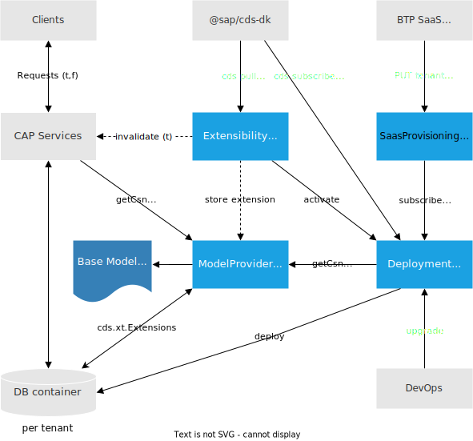

---

label: MTX Reference
# layout: reference-doc
breadcrumbs:
  - Cookbook
  - Multitenancy
  - MTX Reference
status: released
---

# MTX Services Reference

{{$frontmatter?.synopsis}}

<style scoped lang="scss">
  h3 code + em { color: #666; font-weight: normal; }
  ol {
    margin-left: 10px;
    counter-reset: my-counter;
    li {
      counter-increment: my-counter;
      list-style: none;
      &::before {
        content: counter(my-counter);
        color: var(--vp-c-text-1);
        background-color: var(--vp-code-bg);
        width: 20px;
        height: 20px;
        background-size: 20px;
        line-height: 22px;
        border-radius: 50%;
        font-weight: 400;
        text-align: center;
        font-size: 12px;
        vertical-align: middle;
        display: inline-block;
        position: relative;
        top: -2px;
        left: -30px;
        margin-right: -20px;
      }
      p {
        display: inline;
      }
    }
  }
</style>

## Introduction & Overview

The `@sap/cds-mtxs` package provides a set of CAP services which implement _**multitenancy**_, _[features toggles](../extensibility/feature-toggles)_ and _[extensibility](../extensibility/)_ (_'MTX'_ stands for these three functionalities). These services work in concert as depicted in the following diagram:



MTX services are implemented in Node.js and can run in the same Node.js server as your application services or in separate micro services called _sidecars_. All services can be consumed via REST APIs.

As the services are defined and implemented as standard CAP services, with definitions in CDS and implementations based on the CAP Node.js framework, application projects can hook into all events to add custom logic using CAP Node.js.

## Getting Started…

### Add `@sap/cds-mtxs` Package Dependency

```sh
npm add @sap/cds-mtxs
```

### Enable MTX Functionality

Add one or more of the following convenience configuration flags, for example, to your `package.json` in a Node.js-based project:

```json
  "cds": {
    "requires": {
      "multitenancy": true,
      "extensibility": true,
      "toggles": true
    }
  }
```
<!-- REVISIT: Strongly recommended for Node.js, too. Also redundant if we're using cds add mtx instead of adding requires manually -->
[Java-based projects require a sidecar setup.](#sidecars){.learn-more}

### Test-Drive Locally

After enabling MTX features, you can test MTX functionality with local development setups and in-memory databases as usual:

```sh
cds watch
```

This shows the MTX services being served in addition to your app services:

```log{6-8,11-15}
[cds] - loaded model from 6 file(s):

  db/schema.cds
  srv/admin-service.cds
  srv/cat-service.cds
  ../../db/extensions.cds
  ../../srv/deployment-service.cds
  ../../srv/bootstrap.cds

[cds] - connect to db > sqlite { url: ':memory:' }
[cds] - serving cds.xt.SaasProvisioningService { path: '/-/cds/saas-provisioning' }
[cds] - serving cds.xt.DeploymentService { path: '/-/cds/deployment' }
[cds] - serving cds.xt.ModelProviderService { path: '/-/cds/model-provider' }
[cds] - serving cds.xt.ExtensibilityService { path: '/-/cds/extensibility' }
[cds] - serving cds.xt.JobsService { path: '/-/cds/jobs' }
[cds] - serving AdminService { path: '/admin' }
[cds] - serving CatalogService { path: '/browse', impl: 'srv/cat-service.js' }

[cds] - server listening on { url: 'http://localhost:4004' }
[cds] - launched at 5/6/2023, 9:31:11 AM, in: 863.803ms
```

<!-- REVISIT: Not very specific, does this add enough value to stay here (in the MTXS Services Reference)? -->
## Grow As You Go

Follow CAP principles of _'Grow as you go...'_  to minimize complexity of setups, stay in [inner loops](https://www.getambassador.io/docs/telepresence/latest/concepts/devloop) with fast turnarounds, and hence minimize costs and accelerate development.

### Enable MTX Only if Required

During development you rarely need to run your servers with MTX functionality enabled. Only do so when you really need it. For example, in certain tests or by using configuration profiles.

 This configuration would have development not use MTX by default. You could still run with MTX enabled on demand and have it always active in production:

<!-- REVISIT: built-in cds watch --local-multitenancy could simplify this a lot -->
```jsonc
  "cds": {
    "requires": {
      "[local-multitenancy]": {
         "multitenancy": true,
         "extensibility": true,
         "toggles": true
      },
      "[production]": {
         "multitenancy": true,
         "extensibility": true,
         "toggles": true
      }
    }
  }
```

During development you could occasionally run with MTX:

```sh
cds watch --profile local-multitenancy
```

### Testing With Minimal Setup

When designing test suites that run frequently in CI/CD pipelines, you can shorten runtimes and reduce costs. First run a set of functional tests which use MTX in minimized setups – that is, with local servers and in-memory databases as introduced in the [_Multitenancy_ guide](../multitenancy/#test-locally).

Only in the second and third phases, you would then run the more advanced hybrid tests. These hybrid tests could include testing tenant subscriptions with SAP HANA, or integration tests with the full set of required cloud services.

## Sidecar Setups {#sidecars}

In the minimal setup introduced in the _[Getting Started...](#getting-started)_ chapter, we had the MTX services being served embedded with our main app, that is, in the same server as our application services. While this is possible for Node.js and even recommended to reduce complexity during development, quite frequently, we'd want to run them in a separate micro service. Reasons for that include:

- **For Java-based projects** — As these services are implemented in Node.js we need to run them separately and consume them remotely for Java-based apps.
- **To scale independently** — As some operations, especially `upgrade`, are very resource-intensive, we want to scale these services separate from our main application.

As MTX services are built and consumed as CAP services, we benefit from CAP's agnostic design and can easily move them to separate services.

### Create Sidecar as a Node.js Subproject

An MTX sidecar is a standard, yet minimal Node.js CAP project. By default it's added to a subfolder `mtx/sidecar` within your main project, containing just a _package.json_ file.

::: code-group

```json [mtx/sidecar/package.json]
{
  "name": "bookshop-mtx", "version": "0.0.0",
  "dependencies": {
    "@sap/cds": "^9",
    "@cap-js/hana": "^2",
    "@sap/cds-mtxs": "^3",
    "@sap/xssec": "^4",
    "express": "^4"
  },
  "devDependencies": {
    "@cap-js/sqlite": "^2"
  },
  "scripts": {
    "start": "cds-serve"
  },
  "cds": {
    "profile": "mtx-sidecar"
  }
}
```

:::

The only configuration necessary for the project is the `mtx-sidecar` profile.

::: details Let's have a look at what this profile provides...

#### Required MTX Services

```jsonc
...
"cds": {
  "requires": {
    "cds.xt.ModelProviderService": "in-sidecar",
    "cds.xt.DeploymentService": true,
    "cds.xt.SaasProvisioningService": true,
    "cds.xt.ExtensibilityService": true
    ...
  }
}
```

Here we enable all MTX services in a standard configuration. Of course, you can choose to only serve some of which, according to your needs, using [individual configuration](#conf-individual).

#### Using Shared Database

```jsonc
...
"[development]": {
  "db": { "kind": "sqlite", "credentials": {
    "url": "../../db.sqlite"
  }}
}
...
```

With multitenancy the _[DeploymentService](#deploymentservice)_ needs to deploy the very database instances which are subsequently used by the main application. This setting ensures that for local development with SQLite.

#### Additional `[development]` Settings

```jsonc
...
"[development]": {
  "requires": { "auth": "mocked" },
  "server": { "port": 4005 }
}
...
```

These additional settings for profile `[development]` are to support local tests with default values for the server port (different from the default port `4004` of the main app), and to allow mock authentication in the sidecar (secured by default in production).

:::

### Testing Sidecar Setups

With the above setup in place, we can test-drive the sidecar mode locally. To do so, we'll simply start the sidecar and main app in separate shells.

1. Run sidecar in first shell:

   ```sh
   cds watch mtx/sidecar
   ```

   ::: details You see the sidecar starting on port 4005...

   ```log
   cd mtx/sidecar

   cds serve all --with-mocks --in-memory?
   live reload enabled for browsers

           ___________________________

   [cds] - loaded model from 3 file(s):

     ../cds-mtxs/srv/model-provider.cds
     ../cds-mtxs/srv/deployment-service.cds
     ../cds-mtxs/db/t0.cds

   [cds] - connect using bindings from: { registry: '~/.cds-services.json' }
   [cds] - connect to db > sqlite { url: '../../db.sqlite' }
   [cds] - using authentication: { kind: 'mocked' }

   [cds] - serving cds.xt.ModelProviderService { path: '/-/cds/model-provider' }
   [cds] - serving cds.xt.DeploymentService { path: '/-/cds/deployment' }
   [cds] - loaded model from 1 file(s):

     ../cds-mtxs/db/t0.cds

   [mtx] - (re-)deploying SQLite database for tenant: t0
   /> successfully deployed to db-t0.sqlite


   [cds] - server listening on { url: 'http://localhost:4005' } // [!code highlight]
   [cds] - launched at 5/6/2023, 1:08:33 AM, version: 7.3.0, in: 772.25ms
   [cds] - [ terminate with ^C ]
   ```

   :::

2. Run the main app as before in a second shell:

   ```sh
   cds watch
   ```

#### _ModelProviderService_ serving models from main app

When we use our application, we can see `model-provider/getCsn` requests in the sidecar's trace log. In response to those requests, the sidecar reads and returns the main app's models, that is, the models from two levels up the folder hierarchy as is the default with the `mtx-sidecar` profile.

#### Note: Service Bindings by `cds watch`

Required service bindings are done automatically by `cds watch`'s built-in runtime service registry. This is how it works:

1. Each server started using `cds watch` registers all served services in `~/cds-services.json`.

2. Every subsequently started server binds automatically all `required` remote services, to equally named services already registered in `~/cds-services.json`.

In our case: The main app's `ModelProviderService` automatically receives the service binding credentials, for example `url`, to talk to the one served by the sidecar.

### Build Sidecar for Production

When deploying a sidecar for production, it doesn't have access to the main app's models two levels up the deployed folder hierarchy. Instead we have to prepare deployment by running `cds build` in the project's root:

```sh
cds build
```

One of the build tasks that are executed is the `mtx-sidecar` build task. It generates log output similar to the following:

```log
[cds] - the following build tasks will be executed
  {"for":"mtx-sidecar", "src":"mtx/sidecar", "options":... }
[cds] - done > wrote output to:
   gen/mtx/sidecar/_main/fts/isbn/csn.json
   gen/mtx/sidecar/_main/fts/reviews/csn.json
   gen/mtx/sidecar/_main/resources.tgz
   gen/mtx/sidecar/_main/srv/_i18n/i18n.json
   gen/mtx/sidecar/_main/srv/csn.json
   gen/mtx/sidecar/package.json
   gen/mtx/sidecar/srv/_i18n/i18n.json
   gen/mtx/sidecar/srv/csn.json
[cds] - build completed in 687 ms
```

The outcome of that build task is a compiled and deployable version of the sidecar in the _gen/mtx/sidecar_ staging areas:

```zsh{6-17}
bookshop/
├─ _i18n/
├─ app/
├─ db/
├─ fts/
├─ gen/mtx/sidecar/
│   ├─ _main/
│   │   ├── fts/
│   │   │   ├── isbn/
│   │   │   │   └── csn.json
│   │   │   └── reviews/
│   │   │       └── csn.json
│   │   ├── srv/
│   │   │   ├── _i18n
│   │   │   └── csn.json
│   │   └── resources.tgz
│   └─ package.json
├─ mtx/sidecar/
├─ ...
```

In essence, the `mtx-sidecar` build task does the following:

1. It runs a standard Node.js build for the sidecar.
2. It pre-compiles the main app's models, including all features into respective _csn.json_ files, packaged into the `_main` subfolder.
3. It collects all additional sources required for subsequent deployments to `resources.tgz`. For example, these include _.csv_ and _i18n_ files.

### Test-Drive Production Locally

We can also test-drive the production-ready variant of the sidecar locally before actual deployment, again using two separate shells.

1. **First, start sidecar** from `gen/mtx/sidecar` in `prod` simulation mode:

   ```sh
   cds watch gen/mtx/sidecar --profile development,prod
   ```

2. **Second, start main** app as usual:

   ```sh
   cds watch
   ```

#### _ModelProviderService_ serving models from main app

When we now use our application again, and inspect the sidecar's trace logs, we see that the sidecar reads and returns the main app's precompiled models from `_main` now:

```log
[cds] – POST /-/cds/model-provider/getCsn
[cds] – model loaded from 3 file(s):

  gen/mtx/sidecar/_main/srv/csn.json
  gen/mtx/sidecar/_main/fts/isbn/csn.json
  gen/mtx/sidecar/_main/fts/reviews/csn.json
```

## Configuration {#conf}

### Shortcuts `cds.requires.multitenancy / extensibility / toggles` {#conf-shortcuts}

The easiest way to enable multitenancy, extensibility, and feature toggles is as follows:

```json
  "cds": {
    "requires": {
      "multitenancy": true,
      "extensibility": true,
      "toggles": true
    }
  }
```

On the one hand, these settings are interpreted by the CAP runtime to support features such as tenant-specific database connection pooling when `multitenancy` is enabled.

On the other hand, these flags are checked during server bootstrapping to ensure the required combinations of services are served by default. The following tables shows which services are enabled by one of the shortcuts:

|                                                       | `multitenancy` | `extensibility` | `toggles` |
| ----------------------------------------------------- | :------------: | :-------------: | :-------: |
| _[SaasProvisioningService](#saasprovisioningservice)_ |      yes       |       no        |    no     |
| _[DeploymentService](#deploymentservice)_             |      yes       |       no        |    no     |
| _[ExtensibilityService](#extensibilityservice)_       |      no        |       yes       |    no     |
| _[ModelProviderService](#modelproviderservice)_       |      yes       |       yes       |    yes    |

### Configuring Individual Services {#conf-individual}

In addition or alternatively to the convenient shortcuts above you can configure each service individually, as shown in the following examples:

```jsonc
  "cds": {
    "requires": {
      "cds.xt.DeploymentService": true
    }
  }
```

The names of the service-individual configuration options are:

- `cds/requires/<service definition name>`

##### Allowed Values

- `false` — deactivates the service selectively
- `true` — activates the service with defaults for embedded usage
- `<preset name>` — uses [preset](#presets), for example, with defaults for sidecar usage
- `{ ...options }` — add/override individual configuration options

##### Common Config Options

- `model` — specifies/overrides the service model to be used
- `impl` — specifies/overrides the service implementation to be used
- `kind` — the kind of service/consumption, for example, `rest` for remote usage

> These options are supported by all services.

#### Combined with Convenience Flags

```json
  "cds": {
    "requires": {
      "multitenancy": true,
      "cds.xt.SaasProvisioningService": false,
      "cds.xt.DeploymentService": false,
      "cds.xt.ModelProviderService": { "kind": "rest" }
    }
  }
```

This tells the CAP runtime to enable multitenancy, but neither serve the _DeploymentService_, nor the _SaasProvisioningService_, and to use a remote _ModelProviderService_ via REST protocol.

#### Individual Configurations Only

We can also use only the individual service configurations:

```json
  "cds": {
    "requires": {
      "cds.xt.DeploymentService": true,
      "cds.xt.ModelProviderService": { "root": "../.." }
    }
  }
```

In this case, the server will **not** run in multitenancy mode. Also, extensibility and feature toggles are not supported. Yet, the _DeploymentService_ and the _ModelProviderService_ are served selectively. For example, this kind of configuration can be used in [sidecars](#sidecars).

### Using Configuration Presets {#presets}

#### Profile-based configuration

The simplest and for most projects sufficient configuration is the profile-based one, where just these two entries are necessary:

::: code-group

```json [package.json]
"cds": {
  "profile": "with-mtx-sidecar"
}
```

:::

::: code-group

```json [mtx/sidecar/package.json]
"cds": {
  "profile": "mtx-sidecar"
}
```

:::

<!-- REVISIT: remove preset-based config? -->
#### Preset-based configuration

Some MTX services come with pre-defined configuration presets, which can easily be used by referring to the preset suffixes. For example, to simplify and standardize sidecar configuration, _[ModelProviderService](#modelproviderservice)_ supports the `in-sidecar` preset which can be used like that:

```json
  "cds": {
    "requires": {
      "cds.xt.ModelProviderService": "in-sidecar"
    }
  }
```

These presets are actually configured in `cds.env` defaults like that:

```js
cds: {
  requires: {
    // Configuration Presets (in cds.env.requires.kinds)
    kinds: {
      "cds.xt.ModelProviderService-in-sidecar": {
        "[development]": { root: "../.." },
        "[production]": { root: "_main" },
      },
      "cds.xt.ModelProviderService": {
        model: "@sap/cds/srv/model-provider"
      },
      // ...
    }
  }
}
```

[Learn more about `cds.env`](../../node.js/cds-env){.learn-more}

### Inspecting Effective Configuration

You can always inspect the effective configuration by executing this in the _mtx/sidecar_ folder:

```sh
cds env get requires
```

This will give you an output like this:

```js
{
  auth: { strategy: 'dummy', kind: 'dummy' },
  'cds.xt.ModelProviderService': {
    root:'../..',
    model:'@sap/cds/srv/model-provider',
    kind:'in-sidecar'
  }
}
```

Add CLI option `--profile` to inspect configuration in different profiles:

```sh
cds env get requires --profile development
cds env get requires --profile production
```

## Customization

All services are defined and implemented as standard CAP services, with service definitions in CDS, and implementations based on the CAP Node.js framework. Thus, you can easily do both, adapt service definitions, as well as hook into all events to add custom logic using CAP Node.js.

### Customizing Service Definitions

For example, you could override the endpoints to serve a service:

```cds
using { cds.xt.ModelProviderService } from '@sap/cds-mtxs';
annotate ModelProviderService with @path: '/mtx/mps';
```

For sidecar scenarios, define the annotations in the Node.js sidecar application and not as part of the main application.

### Adding Custom Lifecycle Event Handlers

Register handlers in `server.js` files:

::: code-group

```js [mtx/sidecar/server.js]
const cds = require('@sap/cds')
cds.on('served', ()=>{
  const { 'cds.xt.ModelProviderService': mps } = cds.services
  const { 'cds.xt.DeploymentService': ds } = cds.services
  ds.before ('upgrade', (req) => { ... })
  ds.after ('subscribe', (_,req) => { ... })
  mps.after ('getCsn', (csn) => { ... })
})
```

:::

::: tip Custom hooks for CLI usage
For CLI usage via `cds subscribe|upgrade|unsubscribe` you can create a `mtx/sidecar/cli.js` file, which works analogously to a `server.js`.
:::

## Consumption

### Via Programmatic APIs

Consume MTX services using standard [Service APIs](../../node.js/core-services). For example, in `cds repl`:

```js
await cds.test()
var { 'cds.xt.ModelProviderService': mps } = cds.services
var { 'cds.xt.DeploymentService': ds } = cds.services
var db = await ds.subscribe ('t1')
var csn = await mps.getCsn('t1')
cds.context = { tenant:'t1' }
await db.run('SELECT type, name from sqlite_master')
```

### Via REST APIs

Common usage of the MTX services is through REST APIs. Here's an example:

1. Start the server

   ```sh
   cds watch
   ```

2. Subscribe a tenant

   ```http
   POST /-/cds/deployment/subscribe HTTP/1.1
   Content-Type: application/json

   {
     "tenant": "t1"
   }
   ```

3. Get CSN from `ModelProviderService`

   ```http
   POST /-/cds/model-provider/getCsn HTTP/1.1
   Content-Type: application/json

   {
     "tenant": "t1",
     "toggles": ["*"]
   }
   ```

## ModelProviderService

The _ModelProviderService_ serves model variants, which may include tenant-specific extensions and/or feature-toggled aspects.

|                         |                                    |
| ----------------------- | ---------------------------------- |
| Service Definition      | `@sap/cds-mtxs/srv/model-provider` |
| Service Definition Name | `cds.xt.ModelProviderService`      |
| Default HTTP Endpoint   | `/-/cds/model-provider`            |

### Configuration {#model-provider-config}

```json
"cds.xt.ModelProviderService": {
  "root": "../../custom/path"
}
```

- [Common Config Options](#common-config-options)
- `root` — a directory name, absolute or relative to the _package.json_'s location, specifying the location to search for models and resources to be served by the model provider services. Default is undefined, for embedded usage of model provider. In case of a sidecar, it refers to the main app's model; usually `"../.."` during development, and `"_main"` in production.

##### Supported Presets {#model-provider-presets}

- `in-sidecar` — provides defaults for usage in sidecars
- `from-sidecar` — shortcut for `{ "kind": "rest" }`

### `getCsn` _(tenant, toggles) → CSN_

Returns the application's effective CSN document for the given tenant + feature toggles vector. CAP runtimes call that method to obtain the effective models to serve.

| Arguments |  Description                                                |
| --------- | ----------------------------------------------------------- |
| `tenant`  | A string identifying the tenant                             |
| `toggles` | An array listing toggled features; `['*']` for all features |

#### Example Usage {#example-get-csn }

```http
POST /-/cds/model-provider/getCsn HTTP/1.1
Content-Type: application/json

{
  "tenant": "t1",
  "toggles": ["*"]
}
```

The response is a CSN in JSON representation.

[Learn more about **CSN**](http://localhost:5173/docs/cds/csn) {.learn-more}

### `getEdmx` _(tenant, toggles, service, locale) → EDMX_

Returns the EDMX document for a given service in context of the given tenant and feature toggles vector. CAP runtimes call this to get the EDMX document they return in response to OData `$metadata` requests.

| Arguments |  Description                                                |
| --------- | ----------------------------------------------------------- |
| `tenant`  | A string identifying the tenant                             |
| `toggles` | An array listing toggled features; `['*']` for all features |
| `service` | Fully-qualified name of a service definition                |
| `locale`  | Requested locale, that is, as from `accept-language` header     |

#### Example Usage {#example-get-edmx}

```http
POST /-/cds/model-provider/getEdmx HTTP/1.1
Content-Type: application/json

{
  "tenant": "t1",
  "toggles": ["*"],
  "service": "CatalogService",
  "locale": "en"
}
```

### `getResources` _() → TAR_

Returns a _.tar_ archive containing CSV files, I18n files, as well as native database artifacts, required for deployment to databases. `DeploymentService` calls that whenever it receives a `subscribe` or `upgrade` event.

### `getExtensions` _(tenant) → CSN_ {get-extensions}

Returns a _parsed_ CSN document containing all the extensions stored in `cds.xt.Extensions` for the given tenant.

| Arguments |  Description                    |
| --------- | ------------------------------- |
| `tenant`  | A string identifying the tenant |

### `isExtended` _(tenant) → true|false_

Returns `true` if the given `tenant` has extensions applied.

| Arguments |  Description                    |
| --------- | ------------------------------- |
| `tenant`  | A string identifying the tenant |

## ExtensibilityService

The _ExtensibilityService_ allows to add and activate tenant-specific extensions at runtime.

|                         |                                           |
| ----------------------- | ----------------------------------------- |
| Service Definition      | `@sap/cds-mtxs/srv/extensibility-service` |
| Service Definition Name | `cds.xt.ExtensibilityService`             |
| Default HTTP Endpoint   | `/-/cds/extensibility`                    |

[See the extensibility guide for more context](../extensibility/customization){.learn-more}

### Configuration {#extensibility-config}

```jsonc
"cds.xt.ExtensibilityService": {
  // fields must start with x_ or xx_
  "element-prefix": ["x_", "xx_"],
   // namespaces starting with com.sap or sap. can't be extended
  "namespace-blocklist": ["com.sap.", "sap."],
  "extension-allowlist": [
    {
      // at most 2 new fields in entities from the my.bookshop namespace
      "for": ["my.bookshop"],
      "kind": "entity",
      "new-fields": 2,
      // allow extensions for field "description" only
      "fields": ["description"]
    },
    {
      // at most 2 new entities in CatalogService
      "for": ["CatalogService"],
      "new-entities": 2,
      // allow @readonly annotations in CatalogService
      "annotations": ["@readonly"]
    }
  ]
}
```

- [Common Config Options](#common-config-options)
- `element-prefix` — restrict field names to prefix
- `namespace-blocklist` — restrict namespaces to be extended
- `extension-allowlist` — allow certain entities to be extended

> Without `extension-allowlist` configured, extensions are forbidden.

Using `"for": ["*"]` applies the rules to all possible values.

See the [list of possible `kind` values](../../cds/csn#def-properties).{.learn-more}

- `new-fields` specifies the maximum number of fields that can be added.
- `fields` lists the fields that are allowed to be extended. If the list is omitted, all fields can be extended.
- `new-entities` specifies the maximum number of entities that can be added to a service.

### GET `Extensions/<ID>` _→ [{ ID, csn, timestamp }]_ {#get-extensions}

Returns a list of all tenant-specific extensions.

<div class="cols-2">

<div>

#### Request Format

| **Parameters** | Description |
| - | - |
| `ID`  | String uniquely identifying the extension |

> Omitting `ID` will return all extensions.

</div>

<div>

#### Response Format

| **Body** | Description |
| - | - |
| `ID`  | String uniquely identifying the extension |
| `csn` | Compiled extension CSN |
| `timestamp` | Timestamp of activation date |

</div>

</div>

#### Example Request

##### Get a specific extension {#get-extension}

::: code-group

```http [Request]
GET /-/cds/extensibility/Extensions/isbn-extension HTTP/1.1
Content-Type: application/json
```

```json [Response]
{
    "ID": "isbn-extension",
    "csn": "{\"extensions\":[{\"extend\":\"my.bookshop.Books\",\"elements\":{\"Z_ISBN\":{\"type\":\"cds.String\"}}}],\"definitions\":{}}",
    "timestamp": "2023-01-01T01:01:01.111Z"
}
```

:::

##### Get all extensions {#get-all-extensions}

::: code-group

```http [Request]
GET /-/cds/extensibility/Extensions HTTP/1.1
Content-Type: application/json
```

```json [Response]
[
  {
    "ID": "isbn-extension",
    "csn": "{\"extensions\":[{\"extend\":\"my.bookshop.Books\",\"elements\":{\"Z_ISBN\":{\"type\":\"cds.String\"}}}],\"definitions\":{}}",
    "timestamp": "2023-01-01T01:01:01.111Z"
  },
  {
    "ID": "rental-extension",
    "csn": "{\"extensions\":[{\"extend\":\"my.bookshop.Books\",\"elements\":{\"Z_rentalPrice\":{\"type\":\"cds.Integer\"}}}],\"definitions\":{}}",
    "timestamp": "2023-01-01T01:02:01.111Z"
  }
]
```

:::

### PUT `Extensions/<ID>` (\[csn\]) _→ \[{ ID, csn, timestamp }\]_ {#put-extensions}

Creates a new tenant-specific extension.

#### HTTP Request Options

| Request Header        |  Example Value                                         | Description  |
| ----------------      | -------------------------------------------------------|--------------|
| `prefer`              | `respond-async`                                        | Trigger asynchronous extension activation |

<div class="cols-2">

<div>

#### Request Format

| **Parameters** | Description |
| - | - |
| `ID`  | String uniquely identifying the extension |
| **Body**
| `csn` | Array of extension CDL or CSN to apply |
| `i18n` | Texts and translations |

</div>

<div>

#### Response Format

| **Body** | Description |
| - | - |
| `ID`  | String uniquely identifying the extension |
| `csn` | Compiled extension CSN |
| `i18n` | Texts and translations |
| `timestamp` | Timestamp of activation date |

</div>

</div>

#### Example Request

::: code-group

```http [Request]
PUT /-/cds/extensibility/Extensions/isbn-extension HTTP/1.1
Content-Type: application/json

{
  "csn": ["using my.bookshop.Books from '_base/db/data-model';
           extend my.bookshop.Books with { Z_ISBN: String };"],
  "i18n": [{ "name": "i18n.properties", "content": "Books_stock=Stock" },
           { "name": "i18n_de.properties", "content": "Books_stock=Bestand" }]
}
```

```json [Response]
{
    "ID": "isbn-extension",
    "csn": "{\"extensions\":[{\"extend\":\"my.bookshop.Books\",\"elements\":{\"Z_ISBN\":{\"type\":\"cds.String\"}}}],\"definitions\":{}}",
    "i18n": "{\"\":{\"Books_stock\":\"Stock\"},\"de\":{\"Books_stock\":\"Bestand\"}}",
    "timestamp": "2023-09-07T22:31:28.246Z"
}
```

:::

The request can also be triggered asynchronously by setting the `Prefer: respond-async` header.
You can use the URL returned in the `Location` response header to poll the job status.

In addition, you can poll the status for individual tenants using its individual task ID:

```http
GET /-/cds/jobs/pollTask(ID='<taskID>') HTTP/1.1
```

The response is similar to the following:

```js
{
  "status": "FINISHED",
  "op": "activateExtension"
}
```

The job and task status can take on the values `QUEUED`, `RUNNING`, `FINISHED` and `FAILED`.


> By convention, custom (tenant-specific) fields are usually prefixed with `Z_`.

The i18n data can also be passed in JSON format:
```json
"i18n": [{
  "name": "i18n.json",
  "content": "{\"\":{\"Books_stock\":\"Stock\"},\"de\":{\"Books_stock\":\"Bestand\"}}"
}]
```
You also get this JSON in the response body of PUT or [GET](#get-extensions) requests.
In this example, the text with key "Books_stock" from the base model is replaced.


### DELETE `Extensions/<ID>` {#delete-extensions}

Deletes a tenant-specific extension.

#### HTTP Request Options

| Request Header        |  Example Value                                         | Description  |
| ----------------      | -------------------------------------------------------|--------------|
| `prefer`              | `respond-async`                                        | Trigger asynchronous extension activation |


<div class="cols-2">

<div>

#### Request Format

| **Parameters** | Description |
| - | - |
| `ID`  | String uniquely identifying the extension |

</div>

</div>

#### Example Usage

```http [Request]
DELETE /-/cds/extensibility/Extensions/isbn-extension HTTP/1.1
Content-Type: application/json
```

The request can also be triggered asynchronously by setting the `Prefer: respond-async` header.
You can use the URL returned in the `Location` response header to poll the job status.

In addition, you can poll the status for individual tenants using its individual task ID:

```http
GET /-/cds/jobs/pollTask(ID='<taskID>') HTTP/1.1
```

The response is similar to the following:

```js
{
  "status": "FINISHED",
  "op": "activateExtension"
}
```

The job and task status can take on the values `QUEUED`, `RUNNING`, `FINISHED` and `FAILED`.

## DeploymentService

The _DeploymentService_ handles `subscribe`, `unsubscribe`, and `upgrade` events for single tenants and single apps or micro services. Actual implementation is provided through internal plugins, for example, for SAP HANA and SQLite.

|                         |                                        |
| ----------------------- | -------------------------------------- |
| Service Definition      | `@sap/cds-mtxs/srv/deployment-service` |
| Service Definition Name | `cds.xt.DeploymentService`             |
| Default HTTP Endpoint   | `/-/cds/deployment`                    |

### Configuration {#deployment-config}

```jsonc
"cds.xt.DeploymentService": {
  "hdi": {
    "deploy": {
      ...
    },
    "create": {
      "database_id": "<SAP HANA Cloud instance ID>",
      ...
    },
    "bind": {
      ...
    }
  }
}
```

- [Common Config Options](#common-config-options)
- `hdi` — bundles HDI-specific settings
  - `deploy` — [HDI deployment parameters](https://www.npmjs.com/package/@sap/hdi-deploy#supported-features)
  - `create` — tenant creation parameters (≈ [`cf create-service`](https://help.sap.com/docs/BTP/65de2977205c403bbc107264b8eccf4b/a36df26b36484129b482ae20c3eb8004.html))
    - `database_id` — SAP HANA Cloud instance ID
  - `bind` — binding parameters (≈ [`cf bind-service`](https://help.sap.com/docs/BTP/65de2977205c403bbc107264b8eccf4b/c7b09b79d3bb4d348a720ba27fe9a2d5.html))

<span id="internal-lmlmthc" />

##### Supported Presets {#deployment-presets}

- `in-sidecar` — provides defaults for usage in sidecars
- `from-sidecar` — shortcut for `{ "kind": "rest" }`

### `subscribe` _(tenant)_

Received when a new tenant subscribes.

The implementations create and initialize required resources, that is, creating and initializing tenant-specific HDI containers in case of SAP HANA, or tenant-specific databases in case of SQLite.

### `upgrade` _(tenant)_

Used to upgrade a subscribed tenant.

Implementations read the latest models and content from the latest deployed version of the application and re-deploy that to the tenant's database.

##### Drop-Creating Databases for SQLite

In case of SQLite, especially in case of in-memory databases, an upgrade will simply drop and create a new tenant-specific database. Which means all data is lost.

##### Schema Evolution for SAP HANA

In case of SAP HANA, the delta to the former database layout will be determined, and corresponding CREATE TABLE, DROP-CREATE VIEW, and ALTER TABLE statements will eventually be executed without any data loss.

### `unsubscribe` _(tenant)_

Received when a tenant is deleted.

The implementations free required resources, that is, dispose tenant-specific HDI containers in case of SAP HANA, or tenant-specific databases in case of SQLite.

## SaasProvisioningService

The _SaasProvisioningService_ is a façade for the _DeploymentService_ to adapt to the API expected by [SAP BTP's SaaS Provisioning service](https://discovery-center.cloud.sap/serviceCatalog/saas-provisioning-service), hence providing out-of-the-box integration.

|                         |                                                  |
| ----------------------- | ------------------------------------------------ |
| Service Definition      | `@sap/cds-mtxs/srv/cf/saas-provisioning-service` |
| Service Definition Name | `cds.xt.SaasProvisioningService`                 |
| Default HTTP Endpoint   | `/-/cds/saas-provisioning`                       |

### Configuration {#saas-provisioning-config}

```jsonc
"cds.xt.SaasProvisioningService": {
  "jobs": {
    "queueSize": 5, // default: 100
    "workerSize": 5, // default: 1
    "clusterSize": 5, // default: 1
  }
}
```

- [Common Config Options](#common-config-options)
- `jobs` — settings of the built-in job orchestrator
  - `workerSize` — max number of parallel asynchronous jobs per database
  - `clusterSize` — max number of database clusters, running `workerSize` jobs each
  - `queueSize` — max number of jobs waiting to run in the job queue

#### HTTP Request Options

| Request Header        |  Example Value                                         | Description  |
| ----------------      | -------------------------------------------------------|--------------|
| `prefer`              | `respond-async`                                        | Trigger subscription, upgrade or unsubscription request asynchronously. |
| `status_callback`     | `/saas-manager/v1/subscription-callback/123456/result` | Callback path for SAP BTP SaaS Provisioning service. Set automatically if asynchronous subscription is configured for `saas-registry` service. |
<!--| `mtx_status_callback` | `https://example.com/subscribed-callback`              | A custom URL called after asynchronous subscription.  |-->

::: tip No `prefer: respond-async` needed with callback
Requests are implicitly asynchronous when `status_callback` is set.
:::

##### Example Usage

<br>

##### Subscription

A subscription for a tenant `t1` with a specific database ID:

```http
PUT /-/cds/saas-provisioning/tenant/t1 HTTP/1.1
Content-Type: application/json

{
  "subscribedTenantId": "t1",
  "eventType": "CREATE",
  "_": {
    "hdi": {
      "create": {
        "database_id": "<SAP HANA Cloud instance ID>"
      }
    }
  }
}
```

##### Upgrade

With `@sap/hdi-deploy` [parameters](https://help.sap.com/docs/hana-cloud-database/sap-hana-cloud-sap-hana-database-developer-guide-for-cloud-foundry-multitarget-applications-sap-business-app-studio/deployment-options-in-hdi) `trace` and `version`:

```http
POST /-/cds/saas-provisioning/upgrade HTTP/1.1
Content-Type: application/json

{
    "tenants": ["t1"],
    "options": {
        "_": {
            "hdi": {
                "deploy": {
                    "trace": "true",
                    "version": "true"
                }
            }
        }
    }
}
```

### GET `tenant/<tenant>` {#get-tenant}

Returns tenant-specific metadata if `<tenant>` is set, and a list of all tenants' metadata if omitted.

| Parameters |  Description                                                |
| ---------------- | ----------------------------------------------------------- |
| `tenant`         | A string identifying the tenant.                            |

#### Example Usage {#example-tenant-metadata}

##### Get Metadata for a Specific Tenant {#example-get-tenant-metadata}

::: code-group

```http [Request]
GET /-/cds/saas-provisioning/tenant/t1 HTTP/1.1
Content-Type: application/json
```

```json [Response]
{
    "subscribedTenantId": "tenant-1",
    "eventType": "CREATE",
    "subscribedSubdomain": "subdomain-1",
    "subscriptionAppName": "app-1",
    "subscribedSubaccountId": "subaccount-1",
    "createdAt": "2023-11-10T14:36:22.639Z",
    "modifiedAt": "2023-13-10T15:16:22.802Z"
}
```

:::

##### Get Metadata for All Tenants

::: code-group

```http [Request]
GET /-/cds/saas-provisioning/tenant HTTP/1.1
Content-Type: application/json
```

```json [Response]
[
  {
    "subscribedTenantId": "tenant-1",
    "eventType": "CREATE",
    "subscribedSubdomain": "subdomain-1",
    "subscriptionAppName": "app-1",
    "subscribedSubaccountId": "subaccount-1",
    "createdAt": "2023-11-10T14:36:22.639Z",
    "modifiedAt": "2023-13-10T15:16:22.802Z"
  },
  {
    "subscribedTenantId": "tenant-2",
    "eventType": "CREATE",
    "subscribedSubdomain": "subdomain-2",
    "subscriptionAppName": "app-2",
    "subscribedSubaccountId": "subaccount-2",
    "createdAt": "2023-11-11T14:36:22.639Z",
    "modifiedAt": "2023-11-12T12:14:45.452Z"
  }
]
```

:::

### PUT `tenant/<tenant>` (...) {#put-tenant}

Creates tenant resources required for onboarding.

Learn about query parameters, arguments, and their description in the following table:

| Parameters |                                                                         |
| ---------------- | ------------------------------------------------------------------------ |
| `tenant`         | A string identifying the tenant                                          |
| <span style="font-weight: 600; color: var(--vp-c-text-2)">Arguments</span><!--table header styling -->    |
| `subscribedTenantId`  | A string identifying the tenant                                     |
| `subscribedSubdomain` | A string identifying the tenant-specific subdomain                   |
| `eventType`           | The `saas-registry` event (`CREATE` or `UPDATE`)                    |

#### Example Usage {#example-post-tenant}

::: code-group

```http [Request]
PUT /-/cds/saas-provisioning/tenant/t1 HTTP/1.1
Content-Type: application/json

{
  "subscribedTenantId": "t1",
  "subscribedSubdomain": "subdomain1",
  "eventType": "CREATE"
}
```

```txt [Response]
https://my.app.url
```

:::

### DELETE `tenant/<tenant>` {#delete-tenant}

Deletes all tenant resources.

### GET `dependencies` _→ [{ xsappname }]_ {#get-dependencies}

Returns configured SAP BTP SaaS Provisioning service dependencies.

[Learn how to configure SaaS dependencies](./#saas-dependencies){.learn-more}

### `upgrade` _[tenants] → Jobs_

Use the `upgrade` endpoint to upgrade tenant base models.

| Arguments |  Description                                                |
| --------- | ----------------------------------------------------------- |
| `tenants` | A list of tenants, or `[*]` for all tenants                 |
| `options` | Additional options, including HDI deployment options, see [DeploymentService](#deployment-config), prefixed with `_` |

#### Example Usage {#example-upgrade}

##### Asynchronously Upgrade a List of Tenants

::: code-group

```http [Request]
POST /-/cds/saas-provisioning/upgrade HTTP/1.1
Content-Type: application/json
Prefer: respond-async

{
  "tenants": ["t1", "t2"],
  "options": {
      "_": {
          "hdi": {
              "deploy": {
                  "trace": "true",
                  "version": "true"
              }
          }
      }
    }
}
```

```json [Response]
{
  "ID": "<jobID>",
  "createdAt": "<timestamp>",
  "op": "upgrade",
  "tenants": {
    "t1": {
      "ID": "<taskID>"
    }
  }
}
```

:::

##### Asynchronously Upgrade All Tenants

::: code-group

```http [Request]
POST /-/cds/saas-provisioning/upgrade HTTP/1.1
Content-Type: application/json
Prefer: respond-async

{
  "tenants": ["*"]
}
```

```json [Response]
{
  "ID": "<jobID>",
  "createdAt": "<timestamp>",
  "op": "upgrade",
  "tenants": {
    "t1": {
      "ID": "<taskID>"
    }
  }
}
```

:::

We recommended to execute the upgrades asynchronously by setting the `Prefer: respond-async` header.
You can use the URL returned in the `Location` response header to poll the job status.

In addition, you can poll the status for individual tenants using its individual task ID:

```http
GET /-/cds/jobs/pollTask(ID='<taskID>') HTTP/1.1
```

The response is similar to the following:

```js
{
  "status": "FINISHED",
  "op": "upgrade"
}
```

The job and task status can take on the values `QUEUED`, `RUNNING`, `FINISHED` and `FAILED`.

<span id="sms-provisioning-service" />

## [Old MTX Reference](old-mtx-apis) {.toc-redirect}

[See Reference docs for former 'old' MTX Services.](old-mtx-apis){.learn-more}
