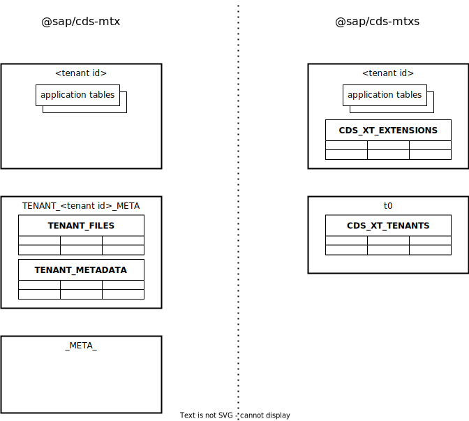
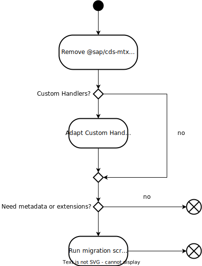
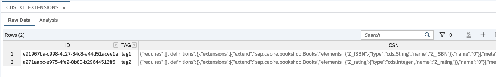

# Migration from Old MTX {#migration}

Towards new multitenancy capabilities
{.subtitle}

<div v-html="$frontmatter?.synopsis" />

<ImplVariantsHint />

::: warning
It is strongly recommended to separate any model changes from the migration. If you need to do model changes for the migration, please deploy the application
based on `@sap/cds-mtx` and upgrade all tenants using the [upgrade endpoint](./old-mtx-apis.md#upgrade-base-model-from-filesystem-asynchronous) before you do the migration.
:::
::: warning
Make sure that you always use the latest version of the CAP modules using `npm outdated`. For Java, also check the versions configured in `pom.xml` files. Since
`@sap/cds-mtx` is deprecated for quite some time now and will no longer run with e. g. the latest version of `@sap/cds`, updating the versions and adapting your application to it
can only be done together with the migration to `@sap/cds-mtxs`. Please also read all release notes carefully and check it for changes that need to be made to the configuration.
:::

## Functional Differences

Before you start to migrate to `@sap/cds-mtxs`, read about the differences compared to the old MTX.

### Persistence Changes

With `@sap/cds-mtxs`, the persistence has been simplified. There's no second container needed (META-tenant) any longer. Instead, tenant-specific metadata, such as extensions, are stored in the same container as the application data.



In addition, `@sap/cds-mtxs` also uses a dedicated tenant `t0` to store some runtime data, such as job logs.

### Extensibility

#### Changes of Extension Persistence

In contrast to `@sap/cds-mtx`, with `@sap/cds-mtxs`, the extensions are no longer stored as sources, but only as compiled `csn` files. Instead of running a build on the server with each extension activation, the build is now run locally _before_ the extension is deployed. The extensions are then stored as `csn` files with a `tag` as key. When using [`cds push`](../extensibility/customization#push-extension), the `tag` is derived from the name of the extension project in `package.json`.

Example `package.json` of extension project:

```json
{
  "name": "@capire/orders-ext",
  "extends": "@capire/orders",
  ...
}

```

When the extension is pushed, it is stored with the tag `@capire/orders-ext`.

Also check the [Push API](mtxs#extensibilityservice). <!-- What is the push API? Is the link correct? -->

#### Handling of extension sources

As mentioned previously, `cds push` only uploads compiled extensions as CSN files. Thus, it's no longer possible to download the CDS sources from the server. Source control is expected to be done by the SaaS application provider using his own repository.

### Security

Some of the roles have changed with `@sap/cds-mtxs`.

| @sap/cds-mtx      | @sap/cds-mtxs            |
| ----------------- | ------------------------ |
| `ExtendCDS`       | `cds.ExtensionDeveloper` |
| `ExtendCDSdelete` | w/o replacement          |

## Permanent and Temporary Limitations

### Temporary Limitations

- Diagnose API isn't available.

### Permanent Limitations

- Scopes aren't configurable.
  <span id="afterpermanentlimitations" />

- It isn't possible to have tenant-specific model versions.
- Use of SAP HANA hdbmigrationtable is only possible for entities that aren't to be extended.
- Upload of arbitrary custom files together with extensions is no longer available.

## Migration Steps

To switch to `@sap/cds-mtxs`, you need to change your project configuration, your custom handlers, and you might need to update the database content.

{style="width:500px"}

### Adapt Project Configuration

<div class="impl node">

#### Switch to `@sap/cds-mtxs`

To switch your Node.js project to `@sap/cds-mtxs`, perform the following steps:

1. Remove `@sap/cds-mtx`:
   ```sh
   npm remove @sap/cds-mtx
   ```
2. Add `@sap/cds-mtxs`:
   ```sh
   npm add @sap/cds-mtxs
   ```
3. Open your _package.json_ and add the following:

   ```json
   "cds": {
       "requires": {
           "multitenancy": true
       }
   }

   ```

#### Enable Extensibility

If your project supports extensibility, you need to enable extensibility in your configuration.
To do so, you only need to add `extensibility: true` to your cds configuration in `.cdsrc.json` or `package.json`.

```json
"requires": {
  "multitenancy": true,
  "extensibility": true
}
```

</div>

<div class="impl java">

#### Create New Sidecar and Adapt mta.yaml

To create a sidecar based on `@sap/cds-mtxs`, you can use the following command:

```sh
cds add multitenancy
```

It creates a new sidecar folder _mtx/sidecar_ and also modifies other files, including _mta.yaml_.
Currently, as `cds add multitenancy` is meant to be used with new projects, the best way is to **revert** the changes that have been made to _mta.yaml_ and to make a few manual changes instead.

##### Remove Global Build Section

The global build section can be removed. The necessary build script has moved to the sidecar module.

```yaml
# build-parameters:
#   before-all:
#     - builder: custom
#       commands:
#         - npm install --production
#         - npx -p @sap/cds-dk cds build --production
```

##### Add MTXS Flag to Java Module

To switch the runtime module to `@sap/cds-mtxs`, you need to add the corresponding environment variable:

```yaml
requires:
  ...
  - name: mtx-sidecar
    properties:
      CDS_MULTITENANCY_MTXS_ENABLED: true # Only required for cds-services version 2
      CDS_MULTITENANCY_SIDECAR_URL: ~{url}
```

#### Adapt _mta.yaml_ to Use New Sidecar

To enable the newly created sidecar, you need to change the path of your existing sidecar to the new path.
You only need to adapt the path to `mtx/sidecar` and add a custom build section.

::: code-group

```yaml [mta.yaml]
modules:
  - name: bookshop-mtx
    type: nodejs
    path: mtx/sidecar # adapted path
    build-parameters: # added build section
      builder: custom
      build-result: gen
      commands:
        - npm run build
      requires:
        - name: bookshop-srv
    parameters:
      memory: 256M
      disk-quota: 1G
    requires:
      - name: bookshop-auth
      - name: bookshop-db
    provides:
      - name: mtx-api
        properties:
          mtx-url: ${default-url}
```

:::

#### Add Workspace for Sidecar in Root package.json

To make the `@sap/cds-mtxs` models part of the installation, add a workspace to the root `package.json` to include the sidecar dependencies.

```json
"workspaces": [
  "mtx/sidecar"
]
```

::: tip Freeze Sidecar Dependencies
To prepare the build of the MTA archive (`mbt build`), you need to generate a <nobr>`package-lock.json`</nobr> for the sidecar by executing this in the project root:

```sh
npm i --package-lock-only --prefix mtx/sidecar
```

:::

#### Adapt Build Tasks

`cds add multitenancy` also adapts the build tasks in `.cdsrc.json` or `package.json`.
You only need to remove the `mtx` build task.

If your project uses the default project layout, all build tasks can be removed from the build configuration as follows:

```json
{
  "build": {
    "target": "."
  },
  "profiles": ["with-mtx-sidecar", "java"],
  "requires": {
    "multitenancy": true
  }
}
```

#### Enable Extensibility

If your project supports extensibility, you need to enable extensibility in your configuration.
To do so, you only need to add `extensibility: true` to your cds configuration in `.cdsrc.json` or `package.json`.

```json
"requires": {
    "multitenancy": true,
    "extensibility": true
  }
```

</div>

#### Security Adaptations

The scopes needed by extension developers have changed.
Scopes `ExtendCDS` and `ExtendCDSdelete` have changed to `cds.ExtensionDeveloper`.
Make sure to adapt all occurrences in your security configuration (`xs-security.json`).

Communicate to customer admins and extension developers to add the new scope to their role collection.
Also adjust the documentation for the SaaS application accordingly if available.

<div class="impl node">

#### Handler Registration

A typical handler registration in `server.js` now looks like

```js
cds.on('served', async () => {
  const { 'cds.xt.SaasProvisioningService': provisioning } = cds.services
  const { 'cds.xt.DeploymentService': deployment } = cds.services

  await provisioning.prepend(() => {
    provisioning.on('UPDATE', 'tenant', async (req, next) => { ... })
    provisioning.on('dependencies', async (req, next) => { ... })
    ...
  })
  await deployment.prepend(() => {
    // previously this was `upgradeTenant`
    deployment.on('upgrade', async (req) => {
      // HDI container credentials are not yet available here
    })
    // previously this was `deployToDb`
    deployment.on('deploy', async (req) => {
      const { tenant, options: { container } } = req.data
      ...
    })
    ...
  })
})
```

Here's what has changed:

- `ProvisioningService` changed to `cds.xt.SaasProvisioningService`
- `DeploymentService` changed to `cds.xt.DeploymentService`
- Use `cds.on('served')` instead of `cds.on('mtx')`.

For Node.js, the `saas-registry` endpoints in `mta.yaml` need to be changed to `.../-/cds/saas-provisioning/...`:

```yaml
parameters:
  service: saas-registry
  config:
    appUrls:
      getDependencies: ~{mtx-api/mtx-url}/-/cds/saas-provisioning/dependencies
      onSubscription: ~{mtx-api/mtx-url}/-/cds/saas-provisioning/tenant/{tenantId}
```

</div>

#### Miscellaneous Configuration

`@sap/cds-mtx` offers some additional configuration that you can also set in `@sap/cds-mtxs`.

##### HDI Container Configuration

In `@sap/cds-mtx`, you can configure the HDI container creation as follows:

```json
"mtx": {
  "provisioning": {
      "lazymetadatacontainercreation": true,
      "container": {
          "provisioning_parameters": {
              "database_id": "<ID>"
          },
          "binding_parameters": {
            "key": "value"
          }
      },
      "metadatacontainer": {
        "provisioning_parameters": {
              "database_id": "<ID_META>"
          }
      }
  }
}
```

In `@sap/cds-mtxs`, you can do the same configuration for the `cds.xt.DeploymentService`:

```json
"requires": {
  "cds.xt.DeploymentService": {
    "lazyT0": true,
    "hdi": {
      "create": {
          "database_id": "<ID>"
      },
      "bind": {
        "key": "value"
      }
    },
    "for": {
      "t0": {
        "hdi": {
          "create": {
            "database_id": "<ID_META>"
          }
        }
      }
    }
  },
}
```
See also [Deployment configuration](./mtxs.md#deployment-config)

##### Extension Restrictions

This configuration allows to set what extensions are allowed.

With `@sap/cds-mtx`:

```json
"mtx" : {
  "extension-allowlist": [
    {
        "for": ["my.bookshop.Authors", "my.bookshop.Books"],
        "new-fields": 2
    },
    {
        "for": ["CatalogService"]
    }
  ]
}
```

With `@sap/cds-mtxs`, the same configuration has moved to the `cds.xt.ExtensibilityService` configuration:

```json
"requires": {
  "cds.xt.ExtensibilityService": {
    "extension-allowlist": [
      {
          "for": ["my.bookshop.Authors", "my.bookshop.Books"],
          "new-fields": 2
      },
      {
          "for": ["CatalogService"]
      }]
  }
}
```

See also [Extensibility configuration](./mtxs.md#extensibility-config)

### Verify application locally

As first verification of your configuration changes, you can try to run your application locally in [hybrid mode](../../advanced/hybrid-testing#run-with-service-bindings). To bind all the service
that are bound to your existing application, you can call `cds bind --to-app-services <your application>`. Afterwards, you can run `cds run --profile hybrid --resolve-bindings`.

### Migrate Tenant Content of Existing Applications

Depending on the MTX features that your existing application has used, you need to execute some steps to move your data to the persistence used by `@sap/cds-mtxs`.

#### Multitenancy Only

In case you only used the multitenancy features such as subscription/unsubscription, you just need to make the [configuration changes described earlier](#adapt-project-configuration).

::: tip When does this scenario apply?

- Your application doesn't support extensibility.
- You don't need to read all tenant IDs or the tenant metadata using
  <br>`GET /-/cds/saas-provisioning/tenant/` or
  <br>`GET /-/cds/saas-provisioning/tenant/<tenantId>`.

The tenant metadata is the data that is sent to the MTX API by the SAP BTP SaaS Provisioning Service on subscription, similar to this:

```json
{
    "subscriptionAppId": "...",
    "subscriptionAppName": "..." ,
    "subscribedTenantId": "...",
    ...
}
```

:::

See [project configuration](#adapt-project-configuration).

#### Saving Subscription Metadata

If your application needs access to the tenant list or tenant metadata, you need to update this data for `@sap/cds-mtxs`.

::: tip When does this scenario apply?

- Your application doesn't support extensibility.
- Your application needs to read all tenant IDs or the tenant metadata using <br>`GET /-/cds/saas-provisioning/tenant/` or
  <br>`GET /-/cds/saas-provisioning/tenant/<tenantId>`.
  :::

In order to copy the metadata from existing subscriptions to the new persistence of `@sap/cds-mtxs`, you need to run [a migration script](#run-the-migration-script) that comes with `@sap/cds-mtxs`.

#### Migration of Extensions

If your application supports extensibility, you also need to update the existing extensions for `@sap/cds-mtxs`. You can do this with the [same migration script](#run-the-migration-script).

::: tip When does this scenario apply?

- Your application supports extensibility.
  :::

#### Run the Migration Script

The migration script is part of `@sap/cds-mtxs`. You can run it locally or during application deployment. Before running the script, you need to make the [configuration changes](#adapt-project-configuration) mentioned earlier.

##### Run the Migration Script Locally

The script has to run in the (Node.js) application environment resulting from `cds build --production` to correctly simulate the execution in the deployment environment.
For Node.js applications, this result is the `gen/srv` folder generated in the application root, for Java applications, this result is the `gen` folder of the new `@sap/cds-mtxs` sidecar (`mtx/sidecar/gen`).

It also needs access to the application bindings. That means, when running locally, it has to [run in hybrid mode](../../advanced/hybrid-testing#run-with-service-bindings).

You also need to add the `production` profile to ensure that the models are resolved correctly.

::: tip
Make sure, that the sources you want to migrate have the exact same version on your local machine as the sources that are deployed to the `@sap/cds-mtx` application .
:::

Example:

```sh
cds migrate "*" --dry --profile hybrid,production --resolve-bindings
```

##### Options

To run the migration for all or a set of tenants, you need to run:

```sh
cds migrate <tenant>[,<tenant>]|"*"
```

The option `--dry` allows you to perform a dry run, without changing the database content.

Keep in mind that, depending on the number of tenants, the script requires some time to run. This is important when you consider to run it in combination with the application deployment.

If the migration was successful, tenants are marked as migrated. When running the migration a second time, these tenants are ignored. If you want to rerun the migration also for the already migrated tenants, you can do so by using parameter `--force`.

##### Save Existing Extension Projects

You can use the migration script to save the content of the subscribers' extension projects.

With parameter `-d`, you can specify a directory that is used by the script to store the existing, migrated extension projects.

```sh
cds migrate <tenant>[,<tenant>]|"*" -d <your directory>
```

To really access the saved extension projects, you need access to the file system, of course. So, the easiest way is to run the script locally for that.

##### Add the Migration Script as Cloud Foundry Task to mta.yaml

You can add the migration script as a `hook` to your Node.js server module (application or sidecar) in _mta.yaml_.
For that, you can use the script `cds-mtx-migrate` that also comes with the `@sap/cds-mtxs` but doesn't require `@sap/cds-dk` to be installed.
Example:

```yaml
- name: bookshop-mt-sidecar
  type: nodejs
  path: mtx/sidecar
  ...
  hooks:
    - name: migrate-tenants
      type: task
      phases:
      #  - blue-green.application.before-start.idle
        - deploy.application.before-start
      parameters:
        name: migration
        memory: 512M
        disk-quota: 768M
        command: cds-mtx-migrate "*"
```

See also [Module Hooks](https://help.sap.com/docs/btp/sap-business-technology-platform/module-hooks)
::: warning
Warning: In case you already run an upgrade as task and your project supports extensions, make sure that the upgrade is run **AFTER** the migration. Otherwise, the content of extended tables can get lost.
:::

##### Advanced: Separate Extensions Based on Extension File Names

The concept of extensions has slightly changed with `@sap/cds-mtxs`. Extensions sources are no longer stored in the backend. Instead, each extension gets a _tag_ and the extension is stored as `csn` with the _tag_ as key.
When running the migration script, all extension files are compiled to one `csn` and are stored with a default _tag_: `migrated`.

You can change the _default tag_ by passing your _own tag_ using the `--tag` parameter:

```sh
cds migrate "*" -d migrated_projects --tag "mytag"
```

In addition, you can separate your extensions into several `csn`-files with different tags. For example, if your original extension files follow a pattern, you can do so by passing parameter `--tagRule` with a regular expression.

Let's use the following extension project structure:

```zsh
old-bookshop-ext/
├── db/
│   ├── extension_id_1.cds
│   └── extension_id_2.cds
│   └── order_ext_id_1.cds
│   └── order_ext_id_2.cds
├── srv/
└── package.json
```

You can split your extensions as follows:

```sh
cds migrate "*" -d migrated_projects --tagRule "(?:ext_|extension_)(.*)\.cds"
```

As a result, you get two extensions with tags `id_1` and `id_2`. The _tag_ is taken from the first captured group of the regular expression.

::: tip Find the right regular expression
To verify if the result meets your expectations, you can make a dry run:

```sh
cds migrate "*" -d migrated_projects --tagRule "(?:ext_|extension_)(.*)\.cds" --dry
```

You can find the result in the folder _migrated_projects_.
:::

<span id="afterseparateextensions" />

### Check Migration Result

To verify the result of the migration script, check the tenant's content of the HDI container. You can use any database client that can access SAP HANA databases.

#### Check Content Using SAP HANA Database Explorer

To see the content of an HDI Container, you can [add the tenant container to the SAP HANA Database Explorer](https://help.sap.com/docs/HANA_CLOUD/a2cea64fa3ac4f90a52405d07600047b/4e2e8382f8484edba31b8b633005e937.html).

You can find the migrated extensions in table `CDS_XT_EXTENSIONS`. The table contains:

- extensions parsed as `csn` strings in column **csn**
- key column **tag**

{ .adapt style="width:800px; box-shadow: 1px 1px 5px #888888"}

## Migrated Extension Projects

As mentioned in [Save Existing Extension Projects](#save-existing-extension-projects), you can store existing extension projects locally.
We recommend to upload the projects to a source repository (e. g. github), because with `@sap/cds-mtxs` the content of extension projects is no longer stored in the tenant database. With that setup you can change and push the extension again later.

The content of extension projects is usually the property of the customer (subscriber). So, alternatively, the customer can [download](#download-of-migrated-extension-projects) the extension projects himself and upload them to his own source repository.

### Adapt for Streamlined MTX

As described in the [extensibility guide](../extensibility/customization##start-ext-project), you usually start with an empty extension project and pull the base model of the application using [`cds pull`](../extensibility/customization#pull-base).

When starting with a migrated extension project, you need to make some adaptations after running [`cds pull`](../extensibility/customization#pull-base). Previously, extension projects were using the full set of CDS files whereas extension projects based on `@sap/cds-mtxs` are using a compiled `index.csn` of the base model. This affects the references in the extension sources of the migrated project. So these references need to be adapted.

Recommended steps:

- Run [`cds pull`](../extensibility/customization#pull-base) to fetch the latest version of the base model as `index.csn`.
- Fix the references in your extension sources. All references to the base model must use the name specified in the `cds.extends` entry of the extension _package.json_, omitting any additional subfolders.
  Example: `using sap.capire.bookshop from '_base/db/schema';` must be replaced by `using sap.capire.bookshop from 'base-model';`
  <br>You can see all broken references as error messages when using the CDS Editor.

### Download of Migrated Extension Projects

As long as the metadata containers (`TENANT-<id>-META`) created by `@sap/cds-mtx` still exist, the customer extension projects can be downloaded using the CDS client. The [user](../extensibility/customization#cds-login) running the download command needs to have the scope `cds.ExtensionDeveloper` assigned:

```sh
cds extend <url> --download-migrated-projects
```
The command downloads an archive named `migrated_projects.tgz` that contains the existing extensions that are ready to be used with `@sap/cds-mtxs`.<br>

<span id="dynamicdeployer" />
