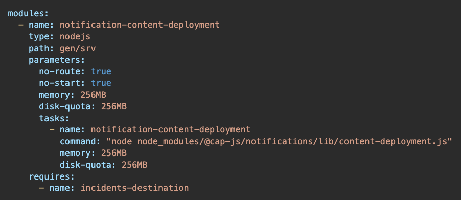

# Notifications

The [`@cap-js/notifications`](https://www.npmjs.com/package/@cap-js/notifications) plugin allows you to send `business notifications` to applications deployed on SAP BTP Platform using [SAP Alert Notification Service](https://help.sap.com/docs/alert-notification?locale=en-US).

:::warning

_The following is mainly written from a Node.js perspective._ <!--For Java's perspective, please see [Java - Notifications](../../java/notifications).-->

:::

[[toc]]

In this guide, we use the [Incidents Management reference sample app](https://github.com/cap-js/incidents-app) as the base to add notifications to.

## Adding the Plugin { #setup }

To be able to publish Business Notifications, simply add the [`@cap-js/notifications`](https://www.npmjs.com/package/@cap-js/notifications) plugin package to your project like so:

```sh
cds add notifications
```

::: details Behind the Scenes…

[CDS Plugin Packages](../../node.js/cds-plugins) are self-contained extensions. They not only include the relevant code but also bring their own default configuration. In our case, next to bringing the respective code, the plugin does the following:

1. Adding the `@cap-js/notifications` package:
   ```sh
   npm add @cap-js/notifications
   ```

2. Sets `cds.requires.notifications: true` in `cds.env`, equivalent to:
    ```json
    {
      "cds": {
        "requires": {
          "notifications": true
        }
      }
    }
    ```

3. Which in turn activates the `notifications` configuration **presets**:
    ```jsonc
    {
       "notifications": {
         "[development]": {
           "impl": "@cap-js/notifications/srv/notifyToConsole",
            "outbox": false
         },
         "[production]": {
           "impl": "@cap-js/notifications/srv/notifyToRest",
            "outbox": true
         }
       }
    }
    ```

  **The individual configuration options are:**

  - `impl` — the service implementation to use
  - `outbox` — whether to use transactional outbox or not

  **The preset uses profile-specific configurations** for development and production. Use the `cds env` command to find out the effective configuration for your current environment:
::: code-group

  ```sh [w/o profile]
  cds env requires.notifications
  ```

  ```sh [production profile]
  cds env requires.notifications --profile production
  ```

4. If the project contains `mta.yaml` file, then following content deployement job configuration is added which creates/updates the notification types during deployment.
  
:::

**Adding Notification Types:**

Before sending notifications, we first need to identify what notification types we want to publish.

Execute the following command to add `notifications` configuration: `cds add notifications`

On executing the command, it creates a file `notificationtypes.json` in the root directory of the project. This file will contain the `notification types` which we want to use in our application. 

Example: The content of the `notificationtypes.json` file to create a `Notification Type` to publish a `notification` whenever a `new incident is created` would look like:

```jsonc
[
  {
    "NotificationTypeKey": "IncidentResolved",
    "NotificationTypeVersion": "1",
    "Templates": [
      {
        "Language": "en",
        "TemplatePublic": "Incident Resolved",
        "TemplateSensitive": "Incident '{{name}}' Resolved",
        "TemplateGrouped": "Incident Status Update",
        "TemplateLanguage": "mustache",
        "Subtitle": "Incident '{{name}}' from '{{customer}}' resolved by Jarvis."
      }
    ]
  }
]
```

## Using the Plugin {#usage}

1. **Create a `server.js` file** in the root of your project.

2. **Connecting to the service:**
    ```js
    const notification = await cds.connect.to('notifications');
    ```

3. **Sending notifications:**
  
    There are 3 ways of sending notifications.

    - Example to send a notification of `default notification type with title only`. The default notification type is created by the `cap-js/notifications` plugin.
      ```js
      notification.notify({
        recipients: recipients,
        priority: priority,
        title: title
      });
      ```
    - Example to send a notification of `default notification type with both title and description`.
      ```js
      notification.notify({
        recipients: recipients,
        priority: priority,
        title: title,
        description: description
      });
      ```
    - Example to send a notification of your `custom notification type`, just pass the complete custom notification object to this function.
      ```js
      notification.notify(customNotificationObject);
      ```

## Sample Code {#sample}

The sample code for sending `notification` of your `custom notification type`:

```js
const cds = require("@sap/cds");

const recipients = ["abc@abc.com"];

let notification;

cds.once("served", (services) => {

  let publishNewIncidentAlert = async (data) => {

    notification = notification || await cds.connect.to('notifications');
    
    const query = data.req ? data.req.query : data.query;
    
    if (query.INSERT && query.INSERT.entries.length > 0) {
      for (const entry of query.INSERT.entries) {
        let customer = await SELECT.one.from`sap.capire.incidents.Customers`
          .columns`firstName, lastName, email`.where({ ID: entry.customer_ID });

        const customerDetails = `${customer.firstName} ${customer.lastName} (${customer.email})`;

        // Create custom notification type
        const customNotificationObject = {
          NotificationTypeKey: 'IncidentCreated',
          NotificationTypeVersion: '1',
          Priority: 'NEUTRAL',
          Properties: [
            {
              Key: 'name',
              IsSensitive: false,
              Language: 'en',
              Value: entry.title,
              Type: 'String'
            },
            {
              Key: 'customer',
              IsSensitive: false,
              Language: 'en',
              Value: customerDetails,
              Type: 'String'
            }
          ],
          Recipients: recipients.map((recipient) => ({ RecipientId: recipient }))
        };

        notification.notify(customNotificationObject);
      }
    }
  };

  for (const service of services) {
    if (!(service instanceof cds.ApplicationService)) continue;

    for (const entity of service.entities) {
      if (entity.name === "ProcessorService.Incidents") {
        cds.db.after("CREATE", entity, publishNewIncidentAlert);
      }
    }
  }
});

```

## Test-drive Locally

With the steps above, we have successfully set up `@cap-js/notifications` plugin for our reference application. Let's see that in action.

1. Start in local: `cds watch`
2. Go to `http://localhost:4004/incidents/`
3. Create a new incident and check for notification in the console logs.

  You should see the following `notification` being console logged:

  ```log
  [notifications] - SAP Alert Notification Service notification: {
    "NotificationTypeKey": "sample/IncidentResolved",
    "NotificationTypeVersion": "1",
    "Priority": "NEUTRAL",
    "Properties": [
      {
        "Key": "name",
        "IsSensitive": false,
        "Language": "en",
        "Value": "asdf",
        "Type": "String"
      },
      {
        "Key": "customer",
        "IsSensitive": false,
        "Language": "en",
        "Value": "Sunny Sunshine (sunny.sunshine@demo.com)",
        "Type": "String"
      }
    ],
    "Recipients": [
      {
        "RecipientId": "abc@abc.com"
      }
    ]
  }
  ```
  **NOTE:** This is a simulation of the scenario shown in the [sample section](#sample-code-sample).

## Deployment

### Prerequisite

1. BTP Subaccount with the following entitlements: 
    - SAP HANA Cloud (tools and hana plan)
    - SAP HANA Schemas & HDI Containers (hdi-shared)
    - SAP Build Work Zone, standard edition (standard)
    - Destination Service (lite)
    - HTML5 Application Repository Service (app-host)
    - Authorization and Trust Management Service (application)

2. [Enable Notifications for Custom Apps on SAP BTP Cloud Foundry](https://help.sap.com/docs/build-work-zone-standard-edition/sap-build-work-zone-standard-edition/enabling-notifications-for-custom-apps-on-sap-btp-cloud-foundry?locale=en-US)

### Deploy to Cloud Foundry

1. Make the following changes in the file `incidents-app/app/incidents/webapp/manifest.json`:

    ```diff
    {
      "_version": "1.49.0",
      "sap.app": {
          ...
          "dataSources": {
              "mainService": {
    -              "uri": "/odata/v4/processors/",
    +              "uri": "odata/v4/processors/",
                  "type": "OData",
                  "settings": {
    -                 "localUri": "localService/metadata.xml",
                      "odataVersion": "4.0"
                  }
              }
          }
      },
      ... 
    +  "sap.cloud": {
    +      "public": true,
    +      "service": "incidents.mgmt"
    +  }
    }
    ```

2. Make the following changes in the file `incidents-app/app/incidents/webapp/xs-app.json`:

    ```diff
    {
    +  "welcomeFile": "/index.html",
      "authenticationMethod": "route",
    -  "logout": {
    -    "logoutEndpoint": "/do/logout"
    -  },
      "routes": [
    +    {
    +      "source": "^/odata/(.*)$",
    +      "target": "/odata/$1",
    +      "destination": "incidents-srv",
    +      "authenticationType": "xsuaa",
    +      "csrfProtection": false
    +    },
        {
          "source": "^(.*)$",
          "target": "$1",
          "service": "html5-apps-repo-rt",
          "authenticationType": "xsuaa"
        }
      ]
    }
    ```

3. Change directory to `samples/notifications` folder.
4. Execute the following command to build the project: `mbt build`.
5. Deploy the project to CF using `cf deploy mta_archives/capire.incidents_1.0.0.mtar`.

### Test the deployment

1. Go to Role Collections. Create a Role Collection with the name `incident-management`. Add `support` role and your user to the role collection.
1. In your subaccount, go to `Instances and Subscriptions` > Click on `SAP Build Work Zone, standard edition` in `Application` Table.
2. Go to `Channel Manager` and sync `HTML5 Apps`.
3. Go to `Content Manager` and click on `Content Explorer`. Click on HTML5 Apps and add the `Incident-Management` application.
4. In `Content Manager` create a new role, catalog and a group. Add `Incident-Management` HTML5 application to them.
5. Go to Site Directory and click on `Create Site`.
6. Click on `Edit` inside the site you just created and add the role you created in step 4. Also enable `Show Notifications`.
7. Visit the site. Create a new Incident. A new notification should show up.
