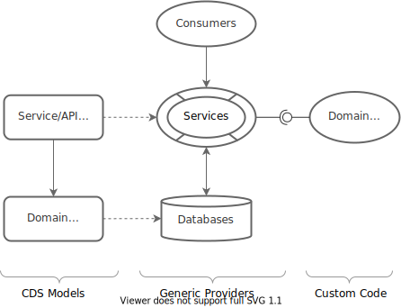
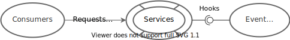
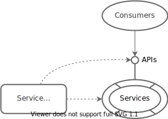
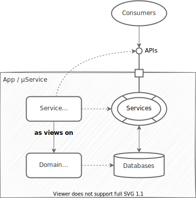

# Providing Services

<div v-html="$frontmatter?.synopsis" />

<!--- % include _toc levels="2,3,6" %} -->
<!--- % include _chapters %} -->
<!--- % include links.md %} -->


## Introduction — Core Concepts

The following sections give a brief overview of CAP's core concepts.

### Service-Centric Paradigm

A CAP application commonly provides services defined in CDS models and served by the CAP runtimes. Every active thing in CAP is a service. They embody the behavioral aspects of a domain in terms of exposed entities, actions, and events.


{.adapt}


### Ubiquitous Events

At runtime, everything happening is in response to events. CAP features a ubiquitous notion of events, which represent both, *requests* coming in through **synchronous** APIs, as well as **asynchronous** *event messages*, blurring the line between both worlds.


{.adapt}


### Event Handlers

Service providers basically react on events in event handlers, plugged in to respective hooks provided by the core service runtimes.
{.indent}


### Generic Providers
 {#generic-providers-intro}

The CAP runtimes provide sets of event handlers for common tasks as documented hereinafter.
{.indent}


## Modeling Services in CDS
 {#defining-services}


### Services Provide APIs to Consumers
 {#all-in-one-definitions}

In its most basic form, a service definition simply declares the data entities and operations it serves. For example:

```cds
service BookshopService {

  entity Books {
    key ID : UUID;
    title  : String;
    author : Association to Authors;
  }

  entity Authors {
    key ID : UUID;
    name   : String;
    books  : Association to many Books on books.author = $self;
  }

  action submitOrder (book : Books:ID, quantity : Integer);

}
```

This definition effectively defines the API served by `BookshopService`.

{.adapt}

Simple service definitions like that are all we need to run full-fledged servers out-of-the-box, served by CAP's generic runtimes, without any implementation coding required.

### Services Act as Facades
 {#services-as-facades}

In contrast to the all-in-one definition above, services usually expose views, aka projections, on underlying domain model entities:

```cds
using { sap.capire.bookshop as my } from '../db/schema';
service BookshopService {
  entity Books as projection on my.Books;
  entity Authors as projection on my.Authors;
  action submitOrder (book : Books:ID, quantity : Integer);
}
```

This way, services become facades to encapsulated domain data, exposing different aspects tailored to respective use cases.

{.adapt}


### Serving Denormalized Views

Instead of exposing access to underlying data in a 1:1 fashion, services frequently expose denormalized views, tailored to specific use cases.

For example, the following service definition, undiscloses information about maintainers from end users and also [marks the entities as `@readonly`](#readonly):

```cds
using { sap.capire.bookshop as my } from '../db/schema';

/** For serving end users */
service CatalogService @(path:'/browse') {

  /** For displaying lists of Books */
  @readonly entity ListOfBooks as projection on Books
  excluding { descr };

  /** For display in details pages */
  @readonly entity Books as projection on my.Books { *,
    author.name as author
  } excluding { createdBy, modifiedBy };

}
```

[Learn more about **CQL** the language used for `projections`.](../../cds/cql){.learn-more}
[See also: Prefer Single-Purposed Services!](#single-purposed-services){.learn-more}
 [Find above sources in **cap/samples**.](https://github.com/sap-samples/cloud-cap-samples/tree/main/bookshop/srv/cat-service.cds){ .learn-more}


### Auto-Exposed Entities

Annotate entities with `@cds.autoexpose` to automatically include them in services containing entities with Association referencing to them.
For example, this is commonly done for code list entities in order to serve Value Lists dropdowns on UIs:

```cds
service Zoo {
  entity Foo { //...
    code : Association to SomeCodeList;
  }
}
@cds.autoexpose entity SomeCodeList {...}
```

[Learn more about Auto-Exposed Entities in the CDS reference docs.](../../cds/cdl#auto-expose){.learn-more}


### Auto-Redirected Associations

When exposing related entities, associations are automatically redirected. This ensures that clients can navigate between projected entities as expected. For example:

```cds
service AdminService {
  entity Books as projection on my.Books;
  entity Authors as projection on my.Authors;
  //> AdminService.Authors.books refers to AdminService.Books
}
```

[Learn more about Redirected Associations in the CDS reference docs.](../../cds/cdl#auto-redirect){.learn-more}


## Generic Service Providers
 {#generic-providers}

The CAP runtimes for [Node.js](../../node.js/) and [Java](../../java/) provide a wealth of generic implementations, which serve most requests automatically, with out-of-the-box solutions to recurring tasks such as search, pagination, or input validation — the majority of this guide focuses on these generic features.

In effect, a service definition [as introduced above](#defining-services) is all we need to run a full-fledged server out-of-the-box. The need for coding reduces to real custom logic specific to a project's domain &rarr; section [Adding Custom Logic](#adding-custom-logic) picks that up.


### Serving CRUD Requests Automatically
 {#serving-crud}

The CAP runtimes for [Node.js](../../node.js/) and [Java](../../java/) provide generic handlers, which automatically serve all CRUD requests to entities for CDS-modelled services on top of a default [primary database](../databases).

This comprises read and write operations like that:

* `GET /Books/201` → reading single data entities
* `GET /Books?...` → reading data entity sets with advanced query options
* `POST /Books {....}` → creating new data entities
* `PUT/PATCH /Books/201 {...}` → updating data entities
* `DELETE /Books/201` → deleting data entities

<br>


### Serving Structured Document Data
 {#serving-documents }

CDS and the runtimes have advanced support for modeling and serving document-oriented data. The runtimes provide generic handlers for serving deeply nested document structures and graphs out of the box as follows...

### – Deep `READ`

You can read deeply nested documents by *expanding* along associations or compositions.
For example, like this in OData:

```http
GET .../Orders?$expand=header($expand=items)
```

same using [`cds.ql` in Node.js](../../node.js/cds-ql):

```js
SELECT.from ('Orders', o => o.`*`, o.header (h => h.`*`, h.items('*')))
```

Both would return an array of nested structures as follows:

```js
[{
    ID:1, title: 'first order', header: { // to-one
      ID:2, status: 'open', items: [{     // to-many
        ID:3, description: 'first order item'
      },{
        ID:4, description: 'second order item'
      }]
    }
  },
  ...
]
```


### – Deep `INSERT`

Create a parent entity along with child entities in a single operation, for example, like that:

```http
POST .../Orders {
  ID:1, title: 'new order', header: { // to-one
    ID:2, status: 'open', items: [{   // to-many
      ID:3, description: 'child of child entity'
    },{
      ID:4, description: 'another child of child entity'
    }]
  }
}
```


### – Deep `UPDATE`

Deep `UPDATE` of the deeply nested documents look very similar to deep `INSERT`:

```http
PUT .../Orders/1 {
  title: 'changed title of existing order', header: {
    ID:2, items: [{
      ID:3, description: 'modified child of child entity'
    },{
      ID:5, description: 'new child of child entity'
    }]
  }]
}
```

Depending on existing data, child entities will be created, updated, or deleted as follows:

- entries existing on the database, but not in the payload, are deleted → for example, `ID:4`
- entries existing on the database, and in the payload are updated → for example, `ID:3`
- entries not existing on the database are created → for example, `ID:5`

**`PUT` vs `PATCH`** — Omitted fields get reset to `default` values or `null` in case of `PUT` requests; they are left untouched for `PATCH` requests.

Omitted compositions have no effect, whether during `PATCH` or during `PUT`. That is, to delete all children, the payload must specify `null` or `[]`, respectively, for the to-one or to-many composition.


### – Deep `DELETE`

Deleting a root of a composition hierarchy results in a cascaded delete of all nested children.

```sql
DELETE .../Orders/1  -- would also delete all headers and items
```

>


### Associations vs Compositions

Associations and Compositions are handled differently in (deep) inserts and updates:

- Compositions →  runtime **deeply creates or updates** entries in target entities
- Associations →  runtime **fills in foreign keys** to *existing* target entries

For example, the following request would create a new `Book` with a *reference* to an existing `Author`, with `{ID:12}` being the foreign key value filled in for association `author`:

```http
POST .../Books {
  ID:121, title: 'Jane Eyre', author: {ID:12}
}
```


### Auto-Generated Keys


On `CREATE` operations, `key` elements of type `UUID` are filled in automatically. In addition, on deep inserts and upserts, respective foreign keys of newly created nested objects are filled in accordingly.

For example, given a model like that:

```cds
entity Orders {
  key ID : UUID;
  title  : String;
  Items  : Composition of many OrderItems on Items.order = $self;
}
entity OrderItems {
  key order : Association to Orders;
  key pos  : Integer;
  descr: String;
}
```

When creating a new `Order` with nested `OrderItems` like that:

```js
POST .../Orders {
  title: 'Order #1', Items: [
    { pos:1, descr: 'Item #1' },
    { pos:2, descr: 'Item #2' }
  ]
}
```

CAP runtimes will automatically fill in `Orders.ID` with a new uuid, as well as the nested `OrderItems.order.ID` referring to the parent.


## Searching Textual Data
 {#searching-data}

### Introduction & General Usage

CAP runtimes provide out-of-the-box support for advanced search of a given text in all textual elements of an entity including nested entities along composition hierarchies.

A typical search request looks like that:

```js
GET .../Books?$search=Heights
```

That would basically search for occurrences of `"Heights"` in all text fields of Books, that is, in `title` and `descr` using database-specific `contains` operations (for example, using `like '%Heights%'` in standard SQL).

### Using `@cds.search` Annotation

By default all elements of type `String` of an entity are searched. Yet, sometimes you may want to deviate from this default and specify a different set of searchable elements, or to extend the search to associated entities. Use the `@cds.search` annotation to do so. The general usage is:

```cds
@cds.search: {
    element1,         // included
    element2 : true,  // included
    element3 : false, // excluded
    assoc1,           // extend to searchable elements in target entity
    assoc2.elementA   // extend to a specific element in target entity
}
entity E { }
```

[Learn more about the syntax of annotations.](../../cds/cdl#annotations){.learn-more}

### Search in Certain Elements Only

```cds
@cds.search: { title }
entity Books { ... }
```

Searches the `title` element only.

### Exclude Elements from Being Searched

```cds
@cds.search: { isbn: false }
entity Books { ... }
```

Searches all elements of type `String` excluding the element `isbn`, which leaves the `title` and `descr` elements to be searched.

### Extend Search to *Associated* Entities

```cds
@cds.search: { author }
entity Books { ... }

@cds.search: { biography: false }
entity Authors { ... }
```

Searches all elements of the `Books` entity, as well as all searchable elements of the associated `Authors` entity. Which elements of the associated entity are searchable is determined by the `@cds.search` annotation on the associated entity. So, from `Authors`, all elements of type `String` are searched but `biography` is excluded.

::: warning Only Java
Extending the search to associated entities is currently only supported on the Java runtime.
:::

### Extend to Individual Elements in Associated Entities

```cds
@cds.search: { author.name }
entity Books { ... }
```

Searches only in the element `name` of the associated `Authors` entity.

::: warning Only Java
Extending the search to individual elements in associated entities is currently only supported on the Java runtime.
:::

## Pagination & Sorting
 {#pagination}


### Implicit Pagination

By default, the generic handlers for READ requests automatically **truncate** result sets to a size of 1,000 records max.
If there are more entries available, a link is added to the response allowing clients to fetch the next page of records.

The OData response body for truncated result sets contains a `nextLink` as follows:

```http
GET .../Books
>{
  value: [
    {... first record ...},
    {... second record ...},
    ...
  ],
  @odata.nextLink: "Books?$skiptoken=1000"
}
```

To retrieve the next page of records from the server, the client would use this `nextLink` in a follow-up request, like so:

```http
GET .../Books?$skiptoken=1000
```

On firing this query, you get the second set of 1,000 records with a link to the next page, and so on, until the last page is returned, with the response not containing a `nextLink`.
::: warning
Per OData specification for [Server Side Paging](http://docs.oasis-open.org/odata/odata/v4.01/odata-v4.01-part1-protocol.html#sec_ServerDrivenPaging), the value of the `nextLink` returned by the server must not be interpreted or changed by the clients.
:::

### Reliable Pagination

> Note: This feature is available only for OData V4 endpoints.

Using a numeric skip token based on the values of `$skip` and `$top` can result in duplicate or missing rows if the entity set is modified between the calls. _Reliable Pagination_ avoids this inconsistency by generating a skip token based on the values of the last row of a page.

The reliable pagination is available with following limitations:

- Results of functions or arithmetic expressions can't be used in the `$orderby` option (explicit ordering).
- The elements used in the `$orderby` of the request must be of simple type.
- All elements used in `$orderby` must also be included in the `$select` option, if it's set.
- Complex [concatenations](../../advanced/odata#concat) of result sets aren't supported.
::: warning
Don't use reliable pagination if an entity set is sorted by elements that contain sensitive information, the skip token could reveal the values of these elements.
:::

The feature can be enabled with the following [configuration options](../../node.js/cds-env#project-settings) set to `true`:
- Java: `cds.query.limit.reliablePaging.enabled`
- Node.js: `cds.query.limit.reliablePaging`

### Configuring Defaults with `cds.query.limit`

You can configure default and maximum limits in the app environment as follows.

- The **maximum limit** defines the maximum number of items that can get retrieved, regardless of `$top`.
- The **default limit** defines the number of items that are retrieved if no `$top` was specified.

The two limits can be specified in the `cds` section of your [project configuration](../../node.js/cds-env#project-settings) as follows:

```json
"cds": {
  "query": {
    "limit": {
      "default": 20, //> no default
      "max": 100     //> default 1,000
    }
  }
}
```

### Annotation `@cds.query.limit`

You can override the defaults by applying the `@cds.query.limit` annotation on the service or entity level, as follows:

<!-- cds-mode: ignore -->
```cds
@cds.query.limit: { default?, max? } | Number
```

The limit definitions for `CatalogService` and `AdminService` in the following example are equivalent.

```cds
@cds.query.limit.default: 20
@cds.query.limit.max: 100
service CatalogService {
  [...]
}
@cds.query.limit: { default: 20, max: 100 }
service AdminService {
  [...]
}
```

`@cds.query.limit` can be used as shorthand if no maximum limit needs to be specified at the same level.

```cds
@cds.query.limit: 100
service CatalogService {
  entity Books as projection on my.Books;     //> pages at 100
  @cds.query.limit: 20
  entity Authors as projection on my.Authors; //> pages at 20
}
service AdminService {
  entity Books as projection on my.Books;     //> pages at 1000 (default)
}
```

### Precedence

The closest limit applies, that means, an entity-level limit overrides that of its service, and a service-level limit overrides the global setting. The value `0` disables the respective limit at the respective level.

```cds
@cds.query.limit.default: 20
service CatalogService {
  @cds.query.limit.max: 100
  entity Books as projection on my.Books;     //> default = 20 (from CatalogService), max = 100
  @cds.query.limit: 0
  entity Authors as projection on my.Authors; //> no default, max = 1,000 (from environment)
}
```


### Implicit Sorting


Paging requires implied sorting, otherwise records might be skipped accidentally when reading follow-up pages.
By default the entity's primary key is used as a sort criterion.

For example, given a service definition like this:

```cds
service CatalogService {
  entity Books as projection on my.Books;
}
```

The SQL query executed in response to incoming requests to Books will be enhanced with an additional order-by clause as follows:

```sql
SELECT ... from my_Books
ORDER BY ID; -- default: order by the entity's primary key
```

If the request specifies a sort order, for example, `GET .../Books?$orderby=author`, both are applied as follows:

```sql
SELECT ... from my_Books ORDER BY
  author,     -- request-specific order has precedence
  ID;         -- default order still applied in addition
```

We can also define a default order when serving books as follows:

```cds
service CatalogService {
  entity Books as projection on my.Books order by title asc;
}
```

Now, the resulting order by clauses are as follows for `GET .../Books`:

```sql
SELECT ... from my_Books ORDER BY
  title asc,  -- from entity definition
  ID;         -- default order still applied in addition
```

... and for `GET .../Books?$orderby=author`:

```sql
SELECT ... from my_Books ORDER BY
  author,     -- request-specific order has precedence
  title asc,  -- from entity definition
  ID;         -- default order still applied in addition
```


## Input Validation

CAP runtimes automatically validate user input, controlled by the following annotations.


### `@readonly` Fields
 {#readonly}

Elements annotated with `@readonly`, as well as [_calculated elements_](../../cds/cdl#calculated-elements), are protected against write operations. That is, if a CREATE or UPDATE operation specifies values for such fields, these values are **silently ignored**.

By default [`virtual` elements](../../cds/cdl#virtual-elements) are also _calculated_.
::: tip
The same applies for fields with the [OData Annotations](../../advanced/odata#annotations) `@FieldControl.ReadOnly` (static), `@Core.Computed`, or `@Core.Immutable` (the latter only on UPDATEs).

 :::

### `@mandatory` Fields
 {#mandatory}

Elements marked with `@mandatory` are checked for nonempty input: `null` and (trimmed) empty strings are rejected.
::: tip
The same applies for fields with the [OData Annotation](../../advanced/odata#annotations) `@FieldControl.Mandatory`.

 :::

### `@assert.unique` Constraints
 {#unique}

Annotate an entity with `@assert.unique.<constraintName>`, specifying one or more element combinations to enforce uniqueness checks on all CREATE and UPDATE operations. For example:

```cds
@assert.unique: {
  locale: [ parent, locale ],
  timeslice: [ parent, validFrom ],
}
entity LocalizedTemporalData {
  key record_ID : UUID; // technical primary key
  parent    : Association to Data;
  locale    : String;
  validFrom : Date;  validTo : Date;
}
```
{.indent}

This annotation is applicable to entities, which result in tables in SQL databases only.

The value of the annotation is an array of paths referring to elements in the entity. These elements may be of a scalar type, structs, or managed associations. Individual foreign keys or unmanaged associations are not supported.

If structured elements are specified, the unique constraint will contain all columns stemming from it. If the path points to a managed association, the unique constraint will contain all foreign key columns stemming from it.
::: tip
You don't need to specify `@assert.unique` constraints for the primary key elements of an entity as these are automatically secured by a SQL `PRIMARY KEY` constraint.
:::

### `@assert.integrity` Constraint for to-one Associations
 {#refs}

All managed `Association to-one` and `Compositions to-one` can be automatically checked for referential integrity, that is:

- CREATEs and UPDATEs are rejected if a reference's target doesn't exist
- DELETEs are rejected if it would result in dangling references
- ... except for associations, entities, or services annotated with `@assert.integrity:false`

```sql
-- Equivalent SQL DDL statement:
CREATE TABLE Books ( -- elements ...
  CONSTRAINT FK_author FOREIGN KEY (author_ID) REFERENCES Authors (ID)
)
```
::: tip
This feature can be switch on/off globally with the configuration `cds.env.features.assert_integrity`.
:::
[Learn more about global configuration with `cds.env.features.assert_integrity`.](../../releases/archive/2022/mar22#database-integrity-constraints){.learn-more}
 [Learn more about database integrity constraints.](../databases#db-constraints){.learn-more}


### `@assert.target` Constraint for managed to-one Associations
 {#assert-target}

Annotate a [managed to-one association](../../cds/cdl#managed-associations) of a CDS model entity definition with the
`@assert.target` annotation to check whether the target entity referenced by the association (the reference's target)
exists. In other words, use this annotation to check whether a non-null foreign key input in a table has a corresponding
primary key in the associated/referenced target table.

You can check whether multiple targets exist in the same transaction. For example, in the `Books` entity, you could
annotate one or more managed to-one associations with the `@assert.target` annotation. However, it is assumed that
dependent values were inserted before the current transaction. For example, in a deep create scenario, when creating a
book, checking whether an associated author exists that was created as part of the same deep create transaction isn't
supported, in this case, you will get an error.

The `@assert.target` check constraint is meant to **validate user input** and not to ensure referential integrity.
Therefore only `CREATE`, and `UPDATE` events are supported (`DELETE` events are not supported). To ensure that every
non-null foreign key in a table has a corresponding primary key in the associated/referenced target table
(ensure referential integrity), the [`@assert.integrity`](#refs) constraint must be used instead.

If the reference's target doesn't exist, an HTTP response
(error message) is provided to HTTP client applications and logged to stdout in debug mode. The HTTP response body's
content adheres to the standard OData specification for an error
[response body](https://docs.oasis-open.org/odata/odata-json-format/v4.01/cs01/odata-json-format-v4.01-cs01.html#sec_ErrorResponse).

#### Example
 {#assert-target-example}

Add `@assert.target` annotation to the service definition as previously mentioned:

```cds
entity Books {
    key ID : UUID;
    title  : String;
    author : Association to Authors @assert.target;
  }

  entity Authors {
    key ID : UUID;
    name   : String;
    books  : Association to many Books on books.author = $self;
  }
```

**HTTP Request** — *assume that an author with the ID `"796e274a-c3de-4584-9de2-3ffd7d42d646"` doesn't exist in the database*

```http
POST Books HTTP/1.1
Accept: application/json;odata.metadata=minimal
Prefer: return=minimal
Content-Type: application/json;charset=UTF-8

{"author_ID": "796e274a-c3de-4584-9de2-3ffd7d42d646"}
```

**HTTP Response**

```http
HTTP/1.1 400 Bad Request
odata-version: 4.0
content-type: application/json;odata.metadata=minimal

{"error": {
  "@Common.numericSeverity": 4,
  "code": "400",
  "message": "Value doesn't exist",
  "target": "author_ID"
}}
```
::: tip
In contrast to the `@assert.integrity` constraint, whose check is performed on the underlying database layer,
the `@assert.target` check constraint is performed on the application service layer before the custom application handlers are called.
:::
::: warning
Cross-service checks are not supported. It is expected that the associated entities are defined in the same service.
:::
::: warning
The `@assert.target` check constraint relies on database locks to ensure accurate results in concurrent scenarios. However, locking is a database-specific feature, and some databases don't permit to lock certain kinds of objects. On SAP HANA, for example, views with joins or unions can't be locked. Do not use `@assert.target` on such artifacts/entities.
:::

### `@assert.format` Pattern Check Constraints
 {#assert-format}

Allows you to specify a regular expression string (in ECMA 262 format in CAP Node.js and java.util.regex.Pattern format in CAP Java) that all string input must match.

```cds
entity Foo {
  bar : String @assert.format: '[a-z]ear';
}
```

### `@assert.range` Check Constraints
 {#assert-range}

Allows you to specify `[ min, max ]` ranges for elements with ordinal types &mdash; that is, numeric or date/time types. For `enum` elements, `true` can be specified to restrict all input to the defined enum values.

```cds
entity Foo {
  bar : Integer  @assert.range: [ 0, 3 ];
  boo : Decimal  @assert.range: [ 2.1, 10.25 ];
  car : DateTime @assert.range: ['2018-10-31', '2019-01-15'];
  zoo : String   @assert.range enum { high; medium; low; };
}
```
::: tip
Specified ranges are interpreted as closed intervals, that means, the performed checks are `min ≤ input ≤ max`.
:::

### `@assert.notNull`
 {#assert-notNull}

Annotate a property with `@assert.notNull: false` to have it ignored during the generic not null check, for example if your persistence fills it automatically.

```cds
entity Foo {
  bar : String not null @assert.notNull: false;
}
```


## Managed Data


Use the annotations `@cds.on.insert` and `@cds.on.update` to signify elements to be auto-filled by the generic handlers upon insert and update.
For example, you could add fields to track who created and updated data records and when.


### Using `@cds.on.insert/update` Annotations Individually

```cds
entity Foo { //...
   createdAt  : Timestamp @cds.on.insert: $now;
   createdBy  : User      @cds.on.insert: $user;
   modifiedAt : Timestamp @cds.on.insert: $now  @cds.on.update: $now;
   modifiedBy : User      @cds.on.insert: $user @cds.on.update: $user;
}
```
[Learn more about the syntax of annotations.](../../cds/cdl#annotations){.learn-more}

These **rules** apply:

- Data is auto-filled, that is, data is ignored if provided in the request payload.
- Data can be filled with initial data, for example, through `.csv` files.
- Data can be set explicitly in custom handlers. For example:
```js
Foo.modifiedBy = req.user.id
Foo.modifiedAt = new Date()
```
::: tip
In effect, values for these elements are handled automatically and are write-protected for external service clients.
:::
::: warning
Upon `Upsert` the generic handlers for `@cds.on.update` are executed but the handlers for `@cds.on.insert` are not.
:::


### Using pre-defined aspect `managed`

You can also use the [pre-defined aspect `managed`](../../cds/common#aspect-managed) from [@sap/cds/common](../../cds/common) to get the very same as by the definition above:

```cds
using { managed } from '@sap/cds/common';
entity Foo : managed { /*...*/ }
```
[Learn more about `@sap/cds/common`](../../cds/common){.learn-more}


### Pseudo Variables `$user` and `$now`

The pseudo variables used in the annotations are resolved as follows:

- `$now` is replaced by the current server time (in UTC)
  + The value of `$now` is stable for the current transaction
- `$user` is the current user's ID as obtained from the authentication middleware
  + `$user.<attr>` is replaced by the value of the respective attribute of the current user
- `$uuid` is replaced by a version 4 UUID

[Learn more about **Authentication** in Node.js.](../../node.js/authentication){.learn-more}
[Learn more about **Authentication** in Java.](../../java/security#authentication){.learn-more}

### Differences to `defaults`

Note the differences to [defaults](../../cds/cdl#default-values), for example, given this model:

```cds
entity Foo { //...
  managed   : Timestamp @cds.on.insert: $now;
  defaulted : Timestamp default $now;
}
```

While both behave identical `INSERT`s on database-level operations, they differ for `CREATE` requests on higher-level service providers: Values for `managed` in the request payload will be ignored, while provided values for `defaulted` will be written to the database.


## Concurrency Control

CAP runtimes support different ways to avoid lost-update situations as documented in the following.

Use _optimistic locking_ to _detect_ concurrent modification of data _across requests_. The implementation relies on [ETags](#etag).

Use _pessimistic locking_ to _protect_ data from concurrent modification by concurrent _transactions_. CAP leverages database locks for [pessimistic locking](#select-for-update).

### Conflict Detection Using ETags {#etag}

The CAP runtimes support optimistic concurrency control and caching techniques using ETags.
An ETag identifies a specific version of a resource found at a URL.

Enable ETags by adding the `@odata.etag` annotation to an element to be used to calculate an ETag value as follows:

```cds
using { managed } from '@sap/cds/common';
entity Foo : managed {...}
annotate Foo with { modifiedAt @odata.etag }
```

> The value of an ETag element should uniquely change with each update per row.
> The `modifiedAt` element from the [pre-defined `managed` aspect](../../cds/common#aspect-managed) is a good candidate, as this is automatically updated.
> You could also use update counters or UUIDs, which are recalculated on each update.

You use ETags when updating, deleting, or invoking the action bound to an entity by using the ETag value in an `If-Match` or `If-None-Match` header.
The following examples represent typical requests and responses:

```http
POST Employees { ID:111, name:'Name' }
> 201 Created {'@odata.etag': 'W/"2000-01-01T01:10:10.100Z"',...}
//> Got new ETag to be used for subsequent requests...
```

```http
GET Employees/111
If-None-Match: "2000-01-01T01:10:10.100Z"
> 304 Not Modified // Record was not changed
```

```http
GET Employees/111
If-Match: "2000-01-01T01:10:10.100Z"
> 412 Precondition Failed // Record was changed by another user
```

```http
UPDATE Employees/111
If-Match: "2000-01-01T01:10:10.100Z"
> 200 Ok {'@odata.etag': 'W/"2000-02-02T02:20:20.200Z"',...}
//> Got new ETag to be used for subsequent requests...
```

```http
UPDATE Employees/111
If-Match: "2000-02-02T02:20:20.200Z"
> 412 Precondition Failed // Record was modified by another user
```

```http
DELETE Employees/111
If-Match: "2000-02-02T02:20:20.200Z"
> 412 Precondition Failed // Record was modified by another user
```

If the ETag validation detects a conflict, the request typically needs to be retried by the client. Hence, optimistic concurrency should be used if conflicts occur rarely.

### Pessimistic Locking
 {#select-for-update}

_Pessimistic locking_ allows you to lock the selected records so that other transactions are blocked from changing the records in any way.

Use _exclusive_ locks when reading entity data with the _intention to update_ it in the same transaction and you want to prevent the data to be read or updated in a concurrent transaction.

Use _shared_ locks if you only need to prevent the entity data to be updated in a concurrent transaction, but don't want to block concurrent read operations.

The records are locked until the end of the transaction by commit or rollback statement.

[Learn more about using the `SELECT ... FOR UPDATE` statement in the Node.js runtime.](../../node.js/cds-ql#select-forUpdate){.learn-more}

[Learn more about using the `Select.lock()` method in the Java runtime.](../../java/query-api#write-lock){.learn-more}
::: warning
Pessimistic locking is not supported by SQLite. H2 supports exclusive locks only.
:::

<div id=" beforeaddingcustom" />

## Adding Custom Logic


### Examples for Custom Logic

As most standard tasks and use cases are covered by [generic service providers](#generic-providers), the need to add service implementation code is greatly reduced and minified, and hence the quantity of individual boilerplate coding.

The remaining cases that need custom handlers, reduce to real custom logic, specific to your domain and application, such as:

- Domain-specific programmatic [Validations](#input-validation)
- Augmenting result sets, for example to add computed fields for frontends
- Programmatic [Authorization Enforcements](../authorization#enforcement)
- Triggering follow-up actions, for example calling other services or emitting outbound events in response to inbound events
- And more... In general, all the things not (yet) covered by generic handlers

The following sections give an overview how to do so, which links to respective deep dives in the reference documentations for [Java](../../java/) and [Node.js](https://nodejs.org).

### Providing Custom Implementations
 {#service-impls}

**In Node.js**, the easiest way to provide implementations for services is through equally named _.js_ files placed next to a service definition's _.cds_ file:

```sh
./srv
  - cat-service.cds  # service definitions
  - cat-service.js   # service implementation
...
```

[Learn more about providing service implementations in Node.js.](../../node.js/services#srv-impls){.learn-more}


**In Java**, you'd assign `EventHandler` classes using dependency injection as follows:

```js
@Component
@ServiceName("org.acme.Foo")
public class FooServiceImpl implements EventHandler {...}
```

[Learn more about Event Handler classes in Java.](../../java/provisioning-api#handlerclasses){.learn-more}

### Registering Event Handlers

Given [assigned implementation classes/modules](#service-impls), you can register individual event handlers for each potential event, on different hooks of the event processing cycle, for example:

```js
const cds = require('@sap/cds')
module.exports = function (){
  this.on ('submitOrder', (req)=>{...}) //> custom actions
  this.on ('CREATE',`Books`, (req)=>{...})
  this.before ('UPDATE',`*`, (req)=>{...})
  this.after ('READ',`Books`, (each)=>{...})
}
```
[Learn more about **adding event handlers in Node.js**.](../../node.js/services#event-handlers){.learn-more}

```js
@Component
@ServiceName("BookshopService")
public class BookshopServiceImpl implements EventHandler {
  @On(event="submitOrder") public void onSubmitOrder (EventContext req) {...}
  @On(event="CREATE", entity="Books") public void onCreateBooks (EventContext req) {...}
  @Before(event="UPDATE", entity="*") public void onUpdate (EventContext req) {...}
  @After(event="READ", entity="Books") public void onReadBooks (EventContext req) {...}
}
```

[Learn more about **adding event handlers in Java**.](../../java/provisioning-api#handlerclasses){.learn-more}

### Hooks for Event Handlers → `on`, `before`, `after`

In essence, event handlers are functions/method registered to be called when a certain event occurs, with the event being a custom operation, like `submitOrder`, or a CRUD operation on a certain entity, like `READ Books`; in general following this scheme:

- `<hook:on|before|after>` , `<event>` , `[<entity>]` &rarr; handler function

CAP allows to plug in event handlers to these different hooks, that is phases during processing a certain event:

- `on` handlers run _instead of_ the generic/default handlers.
- `before` handlers run _before_ the `on` handlers
- `after` handlers run _after_ the `on` handlers, and get the result set as input

`on` handlers form an *interceptor* stack: the topmost handler getting called by the framework. The implementation of this handler   is in control whether to delegate to default handlers down the stack or not.

`before` and `after` handlers are *listeners*: all registered listeners are invoked in parallel. If one vetoes / throws an error the request fails.

### Within Event Handlers
 {#handler-impls}

Event handlers all get a uniform _Request_/_Event Message_ context object as their primary argument, which, among others, provides access to the following:

- The `event` name — that is, a CRUD method name, or a custom-defined one
- The `target` entity, if any
- The `query` in [CQN](../../cds/cqn) format, for CRUD requests
- The `data` payload
- The `user`, if identified/authenticated
- The `tenant` using your SaaS application, if enabled

[Learn more about **implementing event handlers in Node.js**.](../../node.js/events#cds-request){.learn-more}
 [Learn more about **implementing event handlers in Java**.](../../java/provisioning-api#eventcontext){.learn-more}


## Custom Actions & Functions
 {#actions-and-functions }

In addition to common CRUD operations, you can declare domain-specific custom operations as shown below. These custom operations always need custom implementations in corresponding events handlers.


### Modeling in CDS

You can define actions and functions in CDS models like that:
```cds
service Sue {
  // unbound actions & functions
  function sum (x:Integer, y:Integer) returns Integer;
  function stock (id : Foo:ID) returns Integer;
  action add (x:Integer, to: Integer) returns Integer;

  // bound actions & functions
  entity Foo { key ID:Integer } actions {
    function getStock() returns Integer;
    action order (x:Integer) returns Integer;
  }
}
```

[Learn more about modeling actions and functions in CDS.](../../cds/cdl#actions){.learn-more}

### Actions vs Functions

The differentiation between Actions and Functions stems from the OData specifications and in essence is as follows:

- **Actions** are meant for operations, which add or modify data in the server; they are called through `POST` request with the arguments passed in `application/json` bodies.
- **Functions** are meant for operations, which only retrieve data from the server; they are called through `GET` requests with the arguments passed in the URL path.

### Bound vs Unbound

Also from OData stems the concept of bound and unbound actions and functions:

- **Bound** actions/functions are similar to class methods in Java, with the first implicit argument always being the bound  entity's primary key.
- **Unbound** actions/functions are like functions in JavaScript.
::: tip
From CDS perspective we recommend **preferring unbound** actions/functions, as these are much more straightforward to implement and invoke.
:::

### Implementing Actions or Functions

In general, implement actions or functions like that:

```js
module.exports = function Sue(){
  this.on('sum', ({data:{x,y}}) => x+y)
  this.on('add', ({data:{x,to}}) => stocks[to] += x)
  this.on('stock', ({data:{id}}) => stocks[id])
  this.on('getStock','Foo', ({params:[id]}) => stocks[id])
  this.on('order','Foo', ({params:[id],data:{x}}) => stocks[id] -= x)
}
```

Event handlers for actions or functions are very similar to those for CRUD events, with the name of the action/function replacing the name of the CRUD operations. No entity is specific for unbound actions/functions.

**Method-style Implementations** in Node.js, you can alternatively implement actions and functions using conventional JavaScript methods with subclasses of `cds.Service`:

```js
module.exports = class Sue extends cds.Service {
  sum(x,y) { return x+y }
  add(x,to) { return stocks[to] += x }
  stock(id) { return stocks[id] }
  getStock(Foo,id) { return stocks[id] }
  order(Foo,id,x) { return stocks[id] -= x }
}
```


### Calling Actions or Functions

**HTTP Requests** to call the actions/function declared above look like that:

```js
GET .../sue/sum(x=1,y=2)              // unbound function
GET .../sue/stock(id=2)               // unbound function
POST .../sue/add {"x":1,"to":2}       // unbound action
GET .../sue/Foo(2)/Sue.getStock()     // bound function
POST .../sue/Foo(2)/Sue.order {"x":1} // bound action
```

> Note: You always need to add the `()` for functions, even if no arguments are required. For reasons of compliance with the OData standard, bound actions/functions always need to be prefixed with the service's name.

<br>


**Programmatic** usage via **generic APIs** would look like this for Node.js:

```js
  const srv = await cds.connect.to('Sue')
  // unbound actions/functions
  await srv.send('sum',{x:1,y:2})
  await srv.send('add',{x:11,to:2})
  await srv.send('stock',{id:2})
  // bound actions/functions
  await srv.send('getStock','Foo',{id:2})
  await srv.send('order','Foo',{id:2,x:3})
```

> Note: Always pass the target entity name as second argument for bound actions/functions.

<br>

**Programmatic** usage via **typed API** — Node.js automatically equips generated service instances with specific methods matching the definitions of actions/functions found in the services' model. This allows convenient usage like that:

```js
  const srv = await cds.connect.to(Sue)
  // unbound actions/functions
  srv.sum(1,2)
  srv.add(11,2)
  srv.stock(2)
  // bound actions/functions
  srv.getStock('Foo',2)
  srv.order('Foo',2,3)
```

> Note: Even with that typed APIs, always pass the target entity name as second argument for bound actions/functions.


# Best Practices

Following are recommended best practices when designing and implementing services.

## Single-Purposed Services
 {#single-purposed-services}


We strongly recommend designing your services for single use cases.
Services in CAP are cheap, so there's no need to save on them.


### **DON'T:**{style="color:darkred"} Single Services Exposing All Entities 1:1

The anti-pattern to that are single services exposing all underlying entities in your app in a 1:1 fashion. While that may save you some thoughts in the beginning, it's likely that it will result in lots of headaches in the long run:

* They open huge entry doors to your clients with only few restrictions
* Individual use-cases aren't reflected in your API design
* You have to add numerous checks on a per-request basis...
* Which have to reflect on the actual use cases in complex and expensive evaluations


### **DO:**{style="color:teal"} One Service Per Use Case

For example, let's assume that we have a domain model defining *Books* and *Authors* more or less as above, and then we add *Orders*. We could define the following services:

```cds
using { my.domain as my } from './db/schema';
```

```cds
/** Serves end users browsing books and place orders */
service CatalogService {
  @readonly entity Books as select from my.Books {
    ID, title, author.name as author
  };
  @requires: 'authenticated-user'
  @insertonly entity Orders as projection on my.Orders;
}
```

```cds
/** Serves registered users managing their account and their orders */
@requires: 'authenticated-user'
service UsersService {
  @restrict: [{ grant: 'READ', where: 'buyer = $user' }] // limit to own ones
  @readonly entity Orders as projection on my.Orders;
  action cancelOrder ( ID:Orders.ID, reason:String );
}
```

```cds
/** Serves administrators managing everything */
@requires: 'authenticated-user'
service AdminService {
  entity Books   as projection on my.Books;
  entity Authors as projection on my.Authors;
  entity Orders  as projection on my.Orders;
}
```

These services serve different use cases and are tailored for each.
Note, for example, that we intentionally don't expose the `Authors` entity
to end users.

## Late-Cut Microservices
 {#late-cut-microservices}

Compared to Microservices, CAP services are 'Nano'. As shown in the previous sections, you should design your application as a set of loosely coupled, single-purposed services, which can all be served embedded in a single-server process at first (that is, a monolith).

Yet, given such loosely coupled services, and enabled by CAP's uniform way to define and consume services, you can decide later on to separate, deploy, and run your services as separate microservices, even without changing your models or code.

This flexibility allows you to, again, focus on solving your domain problem first, and avoid the efforts and costs of premature microservice design and DevOps overhead, at least in the early phases of development.
