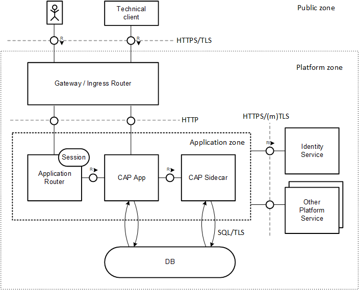

# Platform Security

{{ $frontmatter.synopsis }}

## Platform Compliance { #platform-compliance }

CAP applications run in a certain environment, that is, in the context of some platform framework that has specific characteristics.
The underlying framework has a major impact on the security of the application,
regardless of whether it runs a [cloud](#cloud) environment or [local](#local) environment.
Moreover, CAP applications are tightly integrated with [platform services](#btp-services), in particular with identity and persistence service.

End-to-end security necessarily requires compliance with all security policies of all involved components.

::: warning
❗ **CAP application security requires consistent security configuration of the underlying platform and all consumed services**.
Consult the relevant security documentation accordingly.
:::

### CAP in Cloud Environment { #cloud }

Currently, CAP supports to run on two cloud runtimes of [SAP Business Technology Platform](https://help.sap.com/docs/btp):

- [SAP BTP, Cloud Foundry Runtime](https://help.sap.com/docs/btp/sap-business-technology-platform/cloud-foundry-environment)
- [SAP BTP, Kyma Runtime](https://help.sap.com/docs/btp/sap-business-technology-platform/kyma-environment)

Application providers are responsible to ensure a **secure platform environment**.
In particular, this includes *configuring* [platform services](#btp-services) the application consumes.
For instance, the provider (user) administrator needs to configure the [identity service](#identity-service) to separate platform users from business users that come from different identity provider.
Likewise login policies (e.g. multifactor authentication or single-sign-on) need to be aligned with company-specific requirements.

Note that achieving production-ready security requires to meet all relevant aspects of the **development process** as well.
For instance, source code repositories need to be protected and may not contain any secrets or personal data.
Likewise, **deployment process** needs to be secured. That includes not only setting up CI/CD pipelines running on technical platform users, but also defining integration tests to ensure properly secured application endpoints.

As part of **secure operations**, application providers need to establish a patch and vulnerability management as well as a secure support process. Component versions need to be updated and credentials need to be rotated regularly, for instance.

::: warning
❗ The application provider is responsible to **develop, deploy, and operate the application in a secure platform environment**.
CAP offers seamless integration into platform services and tools to help to meet these requirements.
:::

Find more about BTP platform security here:

[SAP BTP Security](https://help.sap.com/docs/btp/sap-business-technology-platform/security-e129aa20c78c4a9fb379b9803b02e5f6){.learn-more}
[SAP BTP Security Recommendations](https://help.sap.com/docs/btp/sap-btp-security-recommendations-c8a9bb59fe624f0981efa0eff2497d7d/sap-btp-security-recommendations){.learn-more}
[SAP BTP Security (Community)](https://community.sap.com/topics/btp-security){.learn-more}

### CAP in Local Environment { #local }

Security not only plays a crucial role in [cloud](#cloud) environments, but also during local development.
Apparently the security requirements are different from cloud scenario as local endpoints are typically not exposed for remote clients.
But there are still a few things to consider because exploited vulnerabilities could be the basis for attacks on productive cloud services:

- Make sure that locally started HTTP endpoints are bound to `localhost`.
- In case you run your service in hybrid mode with bindings to cloud service instances,
use [cds bind](../../advanced/hybrid-testing) instead of copying bindings manually to `default-env.json` file.
`cds bind` avoids materialization of secrets to local disc, which is inherently dangerous.
- Don't write sensitive data to application logs, also not via debug logging.
- Don't test with real business data, for example, copied from a productive system.

### SAP BTP Services for Security { #btp-services}

SAP BTP offers a set of platform services that CAP applications can build on, to cover production-grade security requirements.
CAP application security hence requires compliance with corresponding service level agreement (SLA) of the platform services.
*It's the responsibility of the application providers to ensure that these requirements are met by ensuring the proper configuration and use of these services*

::: tip
SAP BTP services and the underlying platform infrastructure hold various certifications and attestations, which can be found under the naming of SAP Cloud Platform in the [SAP Trust Center](https://www.sap.com/about/trust-center/certification-compliance/compliance-finder.html?search=SAP%20Business%20Technology%20Platform%20ISO).
:::

CAP as a framework has flexible APIs to integrate with services including custom services. If platform services are replaced by custom services, application providers have to ensure that corresponding SLAs on which CAP relies on are still fulfilled.

The most important services for security offered by the platform:
[Webcast SAP BTP Cloud Identity and Security Services](https://assets.dm.ux.sap.com/webinars/sap-user-groups-k4u/pdfs/221117_sap_security_webcast_series_sap_btp_cloud_identity_and_security_services.pdf){.learn-more}

#### [SAP Cloud Identity Services - Identity Authentication](https://help.sap.com/docs/IDENTITY_AUTHENTICATION) { #identity-service }

The Identity Authentication service defines the user base for (CAP) applications resp. services and allows to control access.
Customers can integrate their 3rd party or on-premise identity provider (IdP) and harden security by defining multifactor authentication or by narrowing client IP ranges.
It helps to introduce a strict separation between platform users (provider) and business users (subscribers) which is required by CAP.
Various authentication methods are supported (SAML 2.0 or [OpenID Connect](https://openid.net/connect/) based) and single sign-on access can be configured.

Note the [security guide](https://help.sap.com/docs/IDENTITY_AUTHENTICATION?#discover_task-security).

#### [SAP Authorization and Trust Management Service](https://help.sap.com/docs/CP_AUTHORIZ_TRUST_MNG)

The service lets customers manage user authorizations in technical roles at application level, which can be aggregated into business-level role collections for large-scale cloud scenarios.
Obviously, developers must define application roles carefully as they form basic access rules to business data.

#### [SAP Malware Scanning Service](https://help.sap.com/docs/MALWARE_SCANNING)

This service can be used to scan transferred business documents for malware and viruses.
Currently, there is no CAP integration. A scan needs to be triggered by the business application explicitly.

Note the security [guide](https://help.sap.com/docs/btp?#operate_task-security).

#### [SAP Credential Store](https://help.sap.com/docs/CREDENTIAL_STORE)

Credentials managed by applications need to be stored in a secure way.
This service provides a REST API for (CAP) applications to store and retrieve credentials at runtime.

Note the security [guide](https://help.sap.com/docs/CREDENTIAL_STORE?#discover_task-security).

#### [SAP BTP Connectivity](https://help.sap.com/docs/CP_CONNECTIVITY)

The connectivity service allows SAP BTP applications to securely access remote services that run on the Internet or on-premise.
It provides a way to establish a secure communication channel between remote endpoints that are connected via an untrusted network infrastructure.

Note the security [guide](https://help.sap.com/docs/CP_CONNECTIVITY/cca91383641e40ffbe03bdc78f00f681/cb50b6191615478aa11d2050dada467d.html).

## Architecture and Platform Requirements

As [pointed out](#platform-compliance), CAP cloud applications run in a specific context that has a major impact on the security [architecture](#architecture-overview).
CAP requires a dedicated [platform environment](#platform-environment) to integrate with in order to ensure end-to-end security.

### Architecture Overview { #architecture-overview }

The following diagram provides a high-level overview about the security-relevant aspects of a deployed CAP application in a cloud environment:

<!-- TODO: Redraw as .drawio.svg -->

To serve a business request, different runtime components are involved: a request, issued by a UI or technical client ([public zone](#public-zone)), is forwarded by a gateway or ingress router to the CAP application. In case of an UI request, an [Application Router](https://help.sap.com/docs/btp/sap-business-technology-platform/application-router) instance acts as a proxy. The CAP application might make use of a CAP sidecar. All application components ([application zone](#application-zone)) might make use of platform services such as database or identity service ([platform zone](#platform-zone)).

#### Public Zone { #public-zone }

From CAP's point of view, all components without specific security requirements belong to the public zone.
Hence, security of server components may not relay on the behaviour or structure of consumer components such as browsers or technical clients.
The platform's gateway provides a single point of entry for any incoming call and defines the API visible to public zone.
As malicious users have free access to public zone, these endpoints need to be protected carefully.
Ideally, the set of exposed endpoints is reduced to a minimum, for instance by means of adequate network configuration.

#### Platform Zone { #platform-zone }

The platform zone contains all platform components and services that are *configured and maintained* by the application provider.
CAP applications consume these low-level [platform services](#btp-services) in order to serve higher-level business requests.
For instance, persistence service to store business data and identity service to authenticate the business user play a fundamental role.

The gateway as a single entry point for external requests as well as additional ingress routers (optional) also belong to platform zone.

#### Application Zone { #application-zone}

The application zone comprises all microservices that represent a CAP application. They are tightly integrated and form a unit of trust. The application provider is responsible to *develop, deploy and operate* these services:

- The [Application Router](https://help.sap.com/docs/btp/sap-business-technology-platform/application-router) acts as as an optional reverse proxy wrapping the application service and providing business-independent functionality required for UIs.
This includes serving UI content, providing a login flow as well as managing the session with the browser.
It can be deployed as application (reusable module) or alternatively consumed as a [service](https://help.sap.com/docs/btp/sap-business-technology-platform/managed-application-router).

- The CAP application service exposes the API to serve business requests. Usually, it makes use of lower-level platform services. As built on CAP, a significant number of security requirements is covered either out of the box or by adding minimal configuration.

- The optional CAP sidecar (reusable module) is used to outsource application-independent tasks such as providing multitenancy and extension support.

Application providers, i.e. platform users, have privileged access to the application zone.
In contrast, application subscribers, i.e. business users, are restricted to a minimal interface.

::: warning
❗ Application providers **may not share any secrets from the application zone** such as binding information with other components or persons.
In a productive environment, it is recommended to deploy and operate the application on behalf of a technical user.
:::

::: tip
Without limitation of generality, there may be multiple CAP services or sidecars according to common [microservice architecture pattern](https://microservices.io/patterns/microservices.html).
:::

### Required Platform Environment { #platform-environment }

There are several assumptions that a CAP application need to make about the platform environment it is deployed to:

1. Application and (platform) service endpoints are exposed externally by the API gateway via TLS protocol.
Hence, the **CAP application can offer a pure HTTP endpoint** without having to enforce TLS and to deal with certificates.

2. The server certificates presented by the external endpoints are signed by a trusted certificate authority.
This **frees CAP applications from the need to manage trust certificates**. The underlying runtimes (Java or Node) can validate the server certificates by default.

3. **Secrets** that are required to protect the application or to consume other platform services **are injected by the platform** into the application in a secure way.

All supported [environments](overview#cloud) fulfill the given requirements. Additional requirements could be added in future.

::: tip
Custom domain certificates need to be signed by trusted certificate authority.
:::

::: warning
❗ **In general, application endpoints are visible to public zone**. Hence, CAP can't rely on private endpoints.
In particular, an application router does not prevent external access to the CAP application service.
As a consequence, **all CAP endpoints must be protected in an appropriate manner**.
:::
