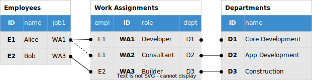
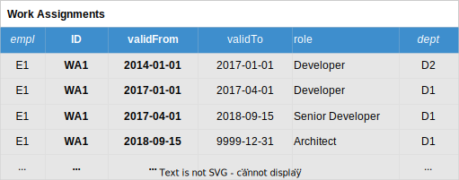

<!--- Migrated: @external/guides/53-Temporal-Data/index.md -> @external/guides/temporal-data/index.md -->

# Temporal Data

<div v-html="$frontmatter?.synopsis" />

Temporal data allows you to maintain information relating to past, present, and future application time.
Built-in support for temporal data follows the general principle of CDS to capture intent with models while staying conceptual, concise, and comprehensive, and minimizing pollution by technical artifacts.

> For an introduction to this topic, see [Temporal database](https://en.wikipedia.org/w/index.php?title=Temporal_database&oldid=911558203) (Wikipedia) and [Temporal features in SQL:2011](https://files.ifi.uzh.ch/dbtg/ndbs/HS17/SQL2011.pdf).
<!-- and [Temporal features in SQL:2011](https://cs.ulb.ac.be/public/_media/teaching/infoh415/tempfeaturessql2011.pdf).-->

[[toc]]


## Starting with 'Timeless' Models {#timeless-model}

For the following explanation, let's start with a base model to manage employees and their work assignments, which is free of any traces of temporal data management.

### Timeless Model

::: code-group
```cds [timeless-model.cds]
namespace com.acme.hr;
using { com.acme.common.Persons } from './common';

entity Employees : Persons {
  jobs : Composition of many WorkAssignments on jobs.empl=$self;
  job1 : Association to one /*of*/ WorkAssignments;
}

entity WorkAssignments {
  key ID  : UUID;
  role    : String(111);
  empl    : Association to Employees;
  dept    : Association to Departments;
}

entity Departments {
  key ID  : UUID;
  name    : String(111);
  head    : Association to Employees;
  members : Association to many Employees on members.jobs.dept = $self;
}

```
:::

> An employee can have several work assignments at the same time.
> Each work assignment links to one department.

### Timeless Data

A set of sample data entries for this model, which only captures the latest state, can look like this:

{.adapt}

> Italic titles indicate to-one associations; actual names of the respective foreign key columns in SQL are `job1_ID`, `empl_ID`, and `dept_ID`.


## Declaring Temporal Entities

_Temporal Entities_ represent _logical_ records of information for which we track changes over time by recording each change as individual _time slices_ in the database with valid from/to boundaries. For example, we could track the changes of Alice's primary work assignment _WA1_ over time:

{.adapt}

::: tip
Validity periods are expected to be **non-overlapping** and **closed-open** intervals; same as in SQL:2011.
:::

### Using Annotations `@cds.valid.from/to`

To track temporal data, just add a pair of date/time elements to the respective entities annotated with `@cds.valid.from/to`, as follows:

```cds
entity WorkAssignments { //...
  start : Date @cds.valid.from;
  end   : Date @cds.valid.to;
}
```
::: tip
The annotation pair `@cds.valid.from/to` actually triggers the built-in mechanisms for [serving temporal data](#serving-temporal-data). It specifies which elements form the **application-time** period, similar to SQL:2011.
:::

### Using Common Aspect `temporal`

Alternatively, use the predefined aspect [`temporal`](../cds/common#aspect-temporal) to declare temporal entities:

```cds
using { temporal } from '@sap/cds/common';
entity WorkAssignments : temporal {/*...*/}
```

Aspect [`temporal`](../cds/common#aspect-temporal) is defined in _[@sap/cds/common](../cds/common)_ as follows:

```cds
aspect temporal {
  validFrom : Timestamp @cds.valid.from;
  validTo   : Timestamp @cds.valid.to;
}
```


### Separate Temporal Details

The previous samples would turn the whole _WorkAssignment_ entity into a temporal one. Frequently though, only some parts of an entity are temporal, while others stay timeless. You can reflect this by separating temporal elements from non-temporal ones:

```cds
entity WorkAssignments {          // non-temporal head entity
  key ID  : UUID;
  empl    : Association to Employees;
  details : Composition of WorkDetails on details.ID = $self.ID;
}
entity WorkDetails : temporal {   // temporal details entity
  key ID  : UUID;                 // logical record ID
  role    : String(111);
  dept    : Association to Departments;
}
```

The data situation would change as follows:

{.adapt}


## Serving Temporal Data

We expose the entities from the following timeless model in a service as follows:

::: code-group
```cds [service.cds]
using { com.acme.hr } from './temporal-model';
service HRService {
  entity Employees as projection on hr.Employees;
  entity WorkAssignments as projection on hr.WorkAssignments;
  entity Departments as projection on hr.Departments;
}
```
:::

> You can omit composed entities like _WorkAssignments_ from the service, as they would get
[auto-exposed](providing-services#auto-exposed-entities) automatically.

<div id="beforereadingtempdata" />

## Reading Temporal Data

### As-of-now Queries

READ requests without specifying any temporal query parameter will automatically return data valid _as of now_.

For example, assumed the following OData query to read all employees with their current work assignments is processed on March 2019:

```cds
GET Employees?
$expand=jobs($select=role&$expand=dept($select=name))
```

The values of `$at`, and so also the respective session variables, would be set to, for example:

|              |                                  |                            |
|--------------|----------------------------------|----------------------------|
| `$at.from` = | _session_context('valid-from')_= | _2019-03-08T22:11:00Z_     |
| `$at.to` =   | _session_context('valid-to')_ =  | _2019-03-08T22:11:00.001Z_ |

The result set would be:

```json
[
  { "ID": "E1", "name": "Alice", "jobs": [
    { "role": "Architect", "dept": {"name": "Core Development"}},
    { "role": "Consultant", "dept": {"name": "App Development"}}
  ]},
  { "ID": "E2", "name": "Bob", "jobs": [
    { "role": "Builder", "dept": {"name": "Construction"}}
  ]}
]
```

### Time-Travel Queries

We can run the same OData query as in the previous sample to read a snapshot data as valid on January 1, 2017 using the `sap-valid-at` query parameter:

```cds
GET Employees?sap-valid-at=date'2017-01-01'
$expand=jobs($select=role&$expand=dept($select=name))
```

The values of `$at` and hence the respective session variables would be set to, for example:

|              |                                  |                            |
|--------------|----------------------------------|----------------------------|
| `$at.from` = | _session_context('valid-from')_= | _2017-01-01T00:00:00Z_     |
| `$at.to` =   | _session_context('valid-to')_ =  | _2017-01-01T00:00:00.001Z_ |

The result set would be:

```json
[
    { "ID": "E1", "name": "Alice", "jobs": [
      { "role": "Developer", "dept": {"name": "Core Development"}},
      { "role": "Consultant", "dept": {"name": "App Development"}}
    ]}, ...
]
```
::: warning
Time-travel queries aren’t supported on SQLite due to the lack of *session_context* variables.
:::

### Time-Period Queries

We can run the same OData query as in the previous sample to read all history of data as valid since 2016 using the `sap-valid-from` query parameter:

```cds
GET Employees?sap-valid-from=date'2016-01-01'
$expand=jobs($select=role&$expand=dept($select=name))
```

The result set would be:

```json
[
  { "ID": "E1", "name": "Alice", "jobs": [
    { "role": "Developer", "dept": {"name": "App Development"}},
    { "role": "Developer", "dept": {"name": "Core Development"}},
    { "role": "Senior Developer", "dept": {"name": "Core Development"}},
    { "role": "Consultant", "dept": {"name": "App Development"}}
  ]}, ...
]
```

> You would add `validFrom` in such time-period queries, for example:

```cds
GET Employees?sap-valid-from=date'2016-01-01'
$expand=jobs($select=validFrom,role,dept/name)
```
::: warning
> Time-series queries aren’t supported on SQLite due to the lack of *session_context* variables.
:::
::: tip
> Writing temporal data must be done in custom handlers.
:::

### Transitive Temporal Data

The basic techniques and built-in support for reading temporal data serves all possible use cases with respect to as-of-now and time-travel queries. Special care has to be taken though if time-period queries transitively expand across two or more temporal data entities.

As an example, assume that both, _WorkAssignments_ and _Departments_ are temporal:

```cds
using { temporal } from '@sap/cds/common';
entity WorkAssignments : temporal {/*...*/
  dept : Association to Departments;
}
entity Departments : temporal {/*...*/}
```

When reading employees with all history since 2016, for example:

```cds
GET Employees?$sap-valid-from=date'2016-01-01'
$expand=jobs(
  $select=validFrom,role&$expand=dept(
    $select=validFrom,name
  )
)
```

The results for `Alice` would be:

```json
[
  { "ID": "E1", "name": "Alice", "jobs": [
    { "validFrom":"2014-01-01", "role": "Developer", "dept": [
      {"validFrom":"2013-04-01", "name": "App Development"}
    ]},
    { "validFrom":"2017-01-01", "role": "Consultant", "dept": [
      {"validFrom":"2013-04-01", "name": "App Development"}
    ]},
    { "validFrom":"2017-01-01", "role": "Developer", "dept": [
      {"validFrom":"2014-01-01", "name": "Tech Platform Dev"},
      {"validFrom":"2017-07-01", "name": "Core Development"}
    ]},
    { "validFrom":"2017-04-01", "role": "Senior Developer", "dept": [
      {"validFrom":"2014-01-01", "name": "Tech Platform Dev"},
      {"validFrom":"2017-07-01", "name": "Core Development"}
    ]},
    { "validFrom":"2018-09-15", "role": "Architect", "dept": [
      {"validFrom":"2014-01-01", "name": "Tech Platform Dev"},
      {"validFrom":"2017-07-01", "name": "Core Development"}
    ]}
  ]}, ...
]
```

That is, all-time slices for changes to departments since 2016 are repeated for each time slice of work assignments in that time frame, which is a confusing and redundant piece of information. You can fix this by adding an alternative association to departments as follows:

```cds
using { temporal } from '@sap/cds/common';
entity WorkAssignments : temporal {/*...*/
  dept : Association to Departments;
  dept1 : Association to Departments on dept1.id = dept.id
    and dept1.validFrom <= validFrom and validFrom < dept1.validTo;
}
entity Departments : temporal {/*...*/}
```


## Primary Keys of Time Slices

While timeless entities are uniquely identified by the declared primary `key` — we call that the _conceptual_ key in CDS — time slices are uniquely identified by _the conceptual `key` **+** `validFrom`_.

In effect the SQL DDL statement for the _WorkAssignments_ would look like this:

```sql
CREATE TABLE com_acme_hr_WorkAssignments (
    ID : nvarchar(36),
    validFrom : timestamp,
    validTo : timestamp,
    -- ...
    PRIMARY KEY ( ID, validFrom )
)
```

In contrast to that, the exposed API preserves the timeless view, to easily serve as-of-now and time-travel queries out of the box [as described above](#serving-temporal-data):

```xml
<EntityType Name="WorkAssignments">
  <Key>
    <PropertyRef Name="ID"/>
  </Key>
  ...
</EntityType>
```

Reading an explicit time slice can look like this:

```sql
SELECT from WorkAssignments WHERE ID='WA1' and validFrom='2017-01-01'
```

Similarly, referring to individual time slices by an association:

```cds
entity SomeSnapshotEntity {
  //...
  workAssignment : Association to WorkAssignments { ID, validFrom }
}
```

<div id="afterprimarykeyof" />