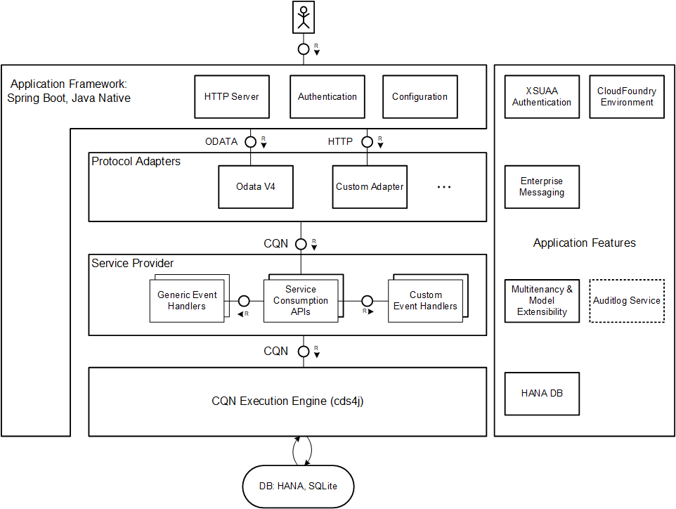

# Modular Architecture
<style scoped>
  h1:before {
    content: "Java"; display: block; font-size: 60%; margin: 0 0 .2em;
  }
</style>

One of the key [CAP design principles](../about/#open-and-opinionated) is to be an opinionated but yet open framework. Giving a clear guidance for cutting-edge technologies on the one hand and still keeping the door wide open for custom choice on the other hand, demands a highly flexible CAP Java SDK.
The [modular architecture](#modular_architecture) reflects this requirement, allowing fine-grained [stack configuration](#stack_configuration) and custom extensions.


## Stack Architecture { #modular_architecture}

### Architecture Overview

One of the basic design principle of the CAP Java SDK is to keep orthogonal functionality separated in independent components. The obvious advantage of this decoupling is that it makes concrete components exchangeable independently.
Hence, it reduces the risk of expensive adaptions in custom code, which can be necessary due to new requirements with regards to the platform environment or used version of platform services. Hence, the application is [platform **and** service agnostic](../about/#agnostic-approach).

For instance, custom code doesn’t need to be written against the chosen type of persistence service, but can use the generic persistence service based on [CQL](./query-api). Likewise, the application isn't aware of the concrete (cloud) platform environment in which it gets embedded. Consequently, preparing an application to be deployable in different platform contexts is rather a matter of configuration than of code adaption.

Consequently, CAP Java SDK doesn't determine the technology the application is built on.
But it comes with a chosen set of industry-proven frameworks that can be consumed easily. Nevertheless, you can override the defaults separately depending on the demands in your scenario.

Moreover, the fine-grained modularization allows you to assemble a minimum set of components, which is necessary to fulfill the application-specific requirements. This reduces resource consumption at runtime as well as maintenance costs significantly.

Another helpful result of the described architecture is that it simplifies local testing massively. Firstly, as components are coupled weakly, you can define the actual test scope precisely and concentrate on the parts that need a high test coverage. Components outside of the test scope are replaceable with mocks, which ideally simulate all the possible corner cases.
Alternatively, you can even configure test on integration level to be executed locally if you replace all dependencies to remote services by local service providers. A common example for this is to run the application locally on SQLite instead of SAP HANA.

The following diagram illustrates the modular stack architecture and highlights the generic components:



You can recognize five different areas of the stack, which comprise components according to different tasks:
* The [application framework](#application-framework) defines the runtime basis of your application typically inclusing a web server.
* [Protocol adapters](#protocol-adapters) map protocol-specific web events into [CQN](../cds/cqn) events for further processing.
* The resulting CQN-events are passed to [service providers](#service-providers), which drive the processing of the event.
* The [CQN execution engine](#cqn-execution-engine) is capable of translating [CQN](../cds/cqn) statements into native statements of any data sink such as a persistence service.
* [Application features](#application-features) are optional extensions that add additional functionality to your application, for instance to add multitenancy capabilities or a platform service integration.


### Application Framework { #application-framework}

Before starting the development of a new CAP-based application, an appropriate application framework to build on needs to be chosen. The architecture of the chosen framework not only has a strong impact on the structure of your project, but it also affects efforts for maintenance as well as support capabilities.
The framework provides the basis of your web application in terms of a runtime container in which your business code can be embedded and executed. This helps to separate your business logic from common tasks like processing HTTP/REST endpoints including basic web request handling.
Typically, a framework also provides you with a rich set of generic tools for recurring tasks like configuration, localization, or logging. In addition, some frameworks come with higher-level concepts like dependency injection or sophisticated testing infrastructure.

CAP Java SDK positions [Spring](https://spring.io) or more precisely [Spring Boot](https://spring.io/projects/spring-boot) as the first choice application framework, which is seamlessly integrated. Spring comes as a rich set of industry-proven frameworks, libraries, and tools that greatly simplify custom development. Spring Boot also allows the creation of self-contained applications that are easy to configure and run.

As all other components in the different layers of the CAP Java SDK are decoupled from the concrete application framework, thus you aren’t obligated to build on Spring. In some scenarios, it might be even preferable to run the (web) service with minimal resource consumption or with smallest possible usage of open source dependencies. In this case, a solution based on plain Java Servlets could be favorable. Lastly, in case you want to run your application on a 3rd party application framework, you're free to bundle it with CAP modules and provide the glue code, which is necessary for integration.


### Protocol Adapters { #protocol-adapters}

The CAP runtime is based on an [event](../about/#events) driven approach. Generally, [Service](../about/#services) providers are the consumers of events, that means, they do the actual processing of events in [handlers](../guides/providing-services#event-handlers). During execution, services can send events to other service providers and consume the results. The native query language in CAP is [CQN](../cds/cqn), which is accepted by all services that deal with data query and manipulation. Inbound requests therefore need to be mapped to corresponding CQN events, which are sent to an accepting Application Service (see concept [details](../about/#querying)) afterwards. Mapping the ingress protocol to CQN essentially summarizes the task of protocol adapters depicted in the diagram. Most prominent example is the [OData V4](https://www.odata.org/documentation/) protocol adapter, which is fully supported by the CAP Java SDK. Further HTTP-based protocols can be added in future, but often applications require specific protocols, most notably [RESTful](https://en.wikipedia.org/wiki/Representational_state_transfer) ones. Such application-specific protocols can easily be implemented by means of Spring RestControllers.

The modular architecture allows to add custom protocol adapters in a convenient manner, which can be plugged into the stack at runtime. Note that different endpoints can be served by different protocol adapters at the same time.


### Service Providers { #service-providers}

Services have different purposes. For instance, CDS model services provide an interface to work with persisted data of your [domain model](../about/#domain-modeling). Other services are rather technical, for example, hiding the consumption API of external services behind a generic interface. As described in CAPs [core concepts](../about/#services), services share the same generic provider interface and are implemented by event handlers. The service provider layer contains all generic services, which are auto-exposed by the CAP Java SDK according to the appropriate CDS model. In addition, technical services are offered such as the [Persistence Service](consumption-api#persistenceservice) or [Auditlog Service](auditlog#auditlog-service), which can be consumed in custom service handlers.

In case the generic handler implementation of a specific service doesn't match the requirements, you can extend or replace it with custom handler logic that fits your business needs. See section [Event Handlers](provisioning-api) for more details.


### CQN Execution Engine { #cqn-execution-engine}

The CQN execution engine is responsible for processing the passed CQN events and translating them to native statements that get executed in a target persistence service like SAP HANA or SQLite. CQN statements can be built conveniently in a [fluent API](./query-api). In the future, additional targets can be added to the list of supported outbound sources.


### Application Features { #application-features}

The overall architecture of the CAP Java SDK allows additional components to be plugged in at runtime. This plugin mechanism makes the architecture open for future extensions and allows context-based configuration. It also enables you to override standard behavior with custom-defined logic in all different layers. Customer components or [extension modules](https://blogs.sap.com/2023/05/16/how-to-build-reusable-plugin-components-for-cap-java-applications/comment-page-1/#comment-674200) that are registered by the runtime can bring custom adapters, custom services or just custom handlers for existing services.
CAP Java makes use of [features](#feature-list) itself to provide optional functionality, examples are [SAP Event Mesh](./messaging-foundation) and [Audit logging](./auditlog) integration.


## Stack Configuration { #stack_configuration}

 As outlined in section [Modular Architecture](#modular_architecture), the CAP Java SDK is highly flexible. You can’t only choose among modules prepared for different environments. You can also include optional or custom extensions.
 Which set of modules is active at runtime is a matter of compile time and runtime configuration.

 At compile time, you can assemble modules from the different layers:
 * The [application framework](#application-framework)
 * One or more [protocol adapters](#protocol-adapters)
 * The core [service providers](#service-providers)
 * [Application features](#application-features) to optionally extend the application or adapt to a specific environment

### Module Configuration

All CAP Java SDK modules are built as [Maven](https://maven.apache.org/) artifacts and are available on [Apache Maven Central Repository](https://search.maven.org/search?q=com.sap.cds). They've group id `com.sap.cds`.
Beside the Java libraries (Jars) reflecting the modularized functionality, the group also contains a "bill of materials" (BOM) pom named `cds-services-bom`, which is recommended especially for multi-project builds. It basically helps to control the dependency versions of the artifacts and should be declared in dependency management of the parent `pom`:

```xml
<properties>
	<cds.services.version>2.0.2</cds.services.version>
</properties>

<dependencyManagement>
	<dependencies>
		<dependency>
			<groupId>com.sap.cds</groupId>
			<artifactId>cds-services-bom</artifactId>
			<version>${cds.services.version}</version>
			<type>pom</type>
			<scope>import</scope>
		</dependency>
	</dependencies>
</dependencyManagement>
```

::: tip
Importing `cds-services-bom` into the DependencyManagement of your project ensures that all cds-module versions are in sync.
:::

The actual Maven dependencies specified in your `pom` need to cover all libraries that are necessary to run the web application: An application framework, a protocol adapter, and the CAP Java SDK.

The dependencies of a Spring Boot application with OData V4 endpoints could look like in the following example:
<!-- to XML code ? -->
```xml
<dependencies>
	<!-- Application framework -->
	<dependency>
		<groupId>com.sap.cds</groupId>
		<artifactId>cds-framework-spring-boot</artifactId>
		<scope>runtime</scope>
	</dependency>

	<!-- Protocol adapter -->
	<dependency>
		<groupId>com.sap.cds</groupId>
		<artifactId>cds-adapter-odata-v4</artifactId>
		<scope>runtime</scope>
	</dependency>

	<!-- CAP Java SDK -->
	<dependency>
		<groupId>com.sap.cds</groupId>
		<artifactId>cds-services-api</artifactId>
	</dependency>
	<dependency>
		<groupId>com.sap.cds</groupId>
		<artifactId>cds-services-impl</artifactId>
		<scope>runtime</scope>
	</dependency>
</dependencies>
```
::: tip
Only API modules should be added without dependency scope (they gain `compile` scope by default) such as `cds-services-api` or `cds4j-api`.
All other dependencies should have a dedicated scope e.g. `runtime` or `test` to prevent misuse.
:::

You are not obliged to choose one of the prepared application frameworks, which have artifact id prefix `cds-framework`. 
It's also possible to use the CAP Java SDK in a different context. 
You're also free to add additional adapters or to bring your own adapter.

Additional application features you want to use are added as additional dependencies. For instance

```xml
<dependencies>
	<!-- Features -->
	<dependency>
		<groupId>com.sap.cds</groupId>
		<artifactId>cds-feature-mt</artifactId>
		<scope>runtime</scope>
	</dependency>
</dependencies>
```

is required to make your application multitenancy-aware.

Choosing a feature by adding the Maven dependency *at compile time* enables the application to make use of the feature *at runtime*. If a chosen feature misses the required environment at runtime, the feature won't be activated. Together with the fact that all features have a built-in default implementation ready for local usage, you can run the application locally with the same set of dependencies as for productive mode.
For instance, the authentication feature `cds-feature-hana` requires a valid `hana`-binding in the environment. Hence, during local development without this binding, this feature gets deactivated and the stack falls back to default feature adapted for SQLite.

### CAP Java Standard Modules

CAP Java comes with a rich set of prepared modules in all different layers of the stack:

#### Application Frameworks
* `cds-framework-spring`:  Makes your application a Spring Boot application.
* `cds-framework-plain`:  Adds support to run as plain Java Servlet-based application.

#### Protocol adapters
* `cds-adapter-odata-v4`:  Auto-exposes Application Services as OData V4 endpoints.
* `cds-adapter-odata-v2`:  Auto-exposes Application Services as OData V2 endpoints.
* `cds-adapter-api`:  Generic protocol adapter interface to be implemented by customer adapters.

#### Runtime (mandatory)
* `cds-services-api`:  Interface of the CAP Java SDK. Custom handler or adapter code needs to compile against.
* `cds-services-impl`:  Implementation of the CAP Java SDK.

#### Application features { #feature-list }

* `cds-feature-cloudfoundry`:  Makes your application aware of SAP BTP, Cloud Foundry environment.
* `cds-feature-k8s`: [Service binding support for SAP BTP, Kyma Runtime](./development/#kubernetes-service-bindings).
* `cds-feature-hana`:  Makes your application aware of SAP HANA data sources.
* `cds-feature-xsuaa`:  Adds [XSUAA](https://github.com/SAP/cloud-security-xsuaa-integration)-based authentication to your application.
* `cds-feature-identity`: Adds [Identity Services](https://github.com/SAP/cloud-security-xsuaa-integration) integration covering IAS to your application.
* `cds-feature-mt`:  Makes your application multitenant-aware.
* `cds-feature-enterprise-messaging`:  Connects your application to SAP Event Mesh.
* `cds-feature-remote-odata`: Adds [Remote Service](remote-services#remote-services) support.

::: tip
`cds-feature-cloudfoundry` and `cds-feature-k8s` can be combined to create binaries that support both environments.
:::

### Starter Bundles

To simplify the configuration on basis of Maven dependencies, the CAP Java SDK comes with several starter bundles that help to set up your configuration for most common use cases quickly:

* `cds-starter-cloudfoundry`: Bundles features to make your application production-ready for SAP BTP, Cloud Foundry environment. It comprises XSUAA authentication, SAP HANA persistence, Cloud Foundry environment for SAP BTP, and multitenancy support.
* `cds-starter-k8s`: Bundles features to make your application production-ready for SAP BTP, Kyma/K8s environment. It comprises XSUAA authentication, SAP HANA persistence, Kyma/K8s environment for SAP BTP, and multitenancy support.
* `cds-starter-spring-boot`: Bundles all dependencies necessary to set up a web-application based on Spring Boot. No protocol adapter is chosen.

Starter bundle `cds-starter-spring-boot` can be combined with any of the other bundles.


An example of a CAP application with OData V4 on Cloud Foundry environment:
```xml
<dependencies>
		<dependency>
			<groupId>com.sap.cds</groupId>
			<artifactId>cds-starter-spring-boot</artifactId>
		</dependency>

		<dependency>
			<groupId>com.sap.cds</groupId>
			<artifactId>cds-adapter-odata-v4</artifactId>
			<scope>runtime</scope>
		</dependency>

		<dependency>
			<groupId>com.sap.cds</groupId>
			<artifactId>cds-starter-cloudfoundry</artifactId>
			<scope>runtime</scope>
		</dependency>
</dependencies>
```