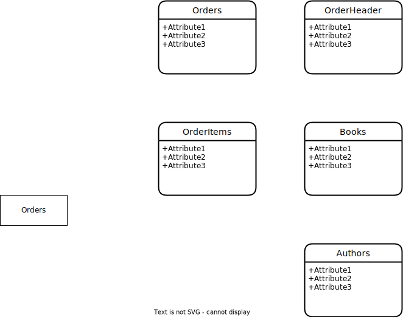
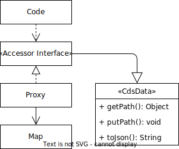

# Working with Data

<style scoped>
  h1:before {
    content: "Java"; display: block; font-size: 60%; margin: 0 0 .2em;
  }
</style>

{{ $frontmatter.synopsis }}


## Predefined Types

The [predefined CDS types](../cds/types) are mapped to Java types and as follows:

| CDS Type           | Java Type              | Remark                                                                   |
|--------------------|------------------------|--------------------------------------------------------------------------|
| `cds.UUID`         | `java.lang.String`     |                                                                          |
| `cds.Boolean`      | `java.lang.Boolean`    |                                                                          |
| `cds.UInt8`        | `java.lang.Short`      |                                                                          |
| `cds.Int16`        | `java.lang.Short`      |                                                                          |
| `cds.Int32`        | `java.lang.Integer`    |                                                                          |
| `cds.Integer`      | `java.lang.Integer`    |                                                                          |
| `cds.Int64`        | `java.lang.Long`       |                                                                          |
| `cds.Integer64`    | `java.lang.Long`       |                                                                          |
| `cds.Decimal`      | `java.math.BigDecimal` |                                                                          |
| `cds.DecimalFloat` | `java.math.BigDecimal` | deprecated                                                               |
| `cds.Double`       | `java.lang.Double`     |                                                                          |
| `cds.Date`         | `java.time.LocalDate`  | date without a time-zone (year-month-day)                                |
| `cds.Time`         | `java.time.LocalTime`  | time without a time-zone (hour-minute-second)                            |
| `cds.DateTime`     | `java.time.Instant`    | instant on the time-line with _sec_ precision                            |
| `cds.Timestamp`    | `java.time.Instant`    | instant on the time-line with _µs_ precision                             |
| `cds.String`       | `java.lang.String`     |                                                                          |
| `cds.LargeString`  | `java.lang.String`     | `java.io.Reader` <sup>(1)</sup> if annotated with `@Core.MediaType`      |
| `cds.Binary`       | `byte[]`               |                                                                          |
| `cds.LargeBinary`  | `byte[]`               | `java.io.InputStream` <sup>(1)</sup> if annotated with `@Core.MediaType` |
| `cds.Vector`       | `com.sap.cds.CdsVector`| for [vector embeddings](#vector-embeddings)                              |

### SAP HANA-Specific Data Types

To facilitate using legacy CDS models, the following [SAP HANA-specific data types](../advanced/hana#hana-types) are supported:

| CDS Type | Java Type | Remark |
| --- | --- | ---  |
| `hana.TINYINT` | `java.lang.Short` | |
| `hana.SMALLINT` | `java.lang.Short` | |
| `hana.SMALLDECIMAL` | `java.math.BigDecimal` | |
| `hana.REAL` | `java.lang.Float` | |
| `hana.CHAR` | `java.lang.String` | |
| `hana.NCHAR` | `java.lang.String` | |
| `hana.VARCHAR` | `java.lang.String` | |
| `hana.CLOB` | `java.lang.String` | `java.io.Reader` <sup>(1)</sup> if annotated with `@Core.MediaType` |
| `hana.BINARY` | `byte[]` |  |


> <sup>(1)</sup> Although the API to handle large objects is the same for every database, the streaming feature, however, is supported (and tested) in **SAP HANA**, **PostgreSQL**, and **H2**. See section [Database Support in Java](./cqn-services/persistence-services#database-support) for more details on database support and limitations.

::: warning
The framework isn't responsible for closing the stream when writing to the database. You decide when the stream is to be closed. If you forget to close the stream, the open stream can lead to a memory leak.
:::

These types are used for the values of CDS elements with primitive type. In the [Model Reflection API](./reflection-api), they're represented by the enum [CdsBaseType](https://javadoc.io/doc/com.sap.cds/cds4j-api/latest/com/sap/cds/reflect/CdsBaseType.html).

## Structured Data

In CDS, structured data is used as payload of *Insert*, *Update*, and *Upsert* statements. Also the query result of *Select* may be structured.
CAP Java represents data of entities and structured types as `Map<String, Object>` and provides the `CdsData` interface as an extension of `Map` with additional convenience methods.

In the following we use this CDS model:

```cds
entity Books {
    key ID     : Integer;
        title  : String;
        author : Association to one Authors;
}

entity Authors {
    key ID    : Integer;
        name  : String;
        books : Association to many Books on books.author = $self;
}

entity Orders {
    key ID     : Integer;
        header : Composition of one  OrderHeaders;
        items  : Composition of many OrderItems;
}

entity OrderHeaders {
    key ID     : Integer;
        status : String;
}

aspect OrderItems {
    key ID     : Integer;
        book   : Association to one Books;
}
```
[Find this source also in **cap/samples**.](https://github.com/sap-samples/cloud-cap-samples-java/blob/5396b0eb043f9145b369371cfdfda7827fedd039/db/schema.cds#L5-L22){ .learn-more}

In this model, there is a bidirectional many-to-one association between `Books` and `Authors`, which is managed by the `Books.author` association. The `Orders` entity owns the composition `header`, which relates it to the `OrderHeaders` entity, and the composition `items`, which relates the order to the `OrderItems`. The items are modeled using a managed composition of aspects:


::: tip
Use [Managed Compositions of Aspects](../guides/domain-modeling#composition-of-aspects) to model unidirectional one-to-many compositions.
:::

### Relationships to other entities

Relationships to other entities are modeled as associations or compositions. While _associations_ capture relationships between entities, _compositions_ constitute document structures through 'contained-in' relationships.

### Entities and Structured Types

Entities and structured types are represented in Java as a `Map<String, Object>` that maps the element names to the element values.

The following example shows JSON data and how it can be constructed in Java:

```json
{
    "ID"    : 97,
    "title" : "Dracula"
}
```

```java
Map<String, Object> book = new HashMap<>();
book.put("ID", 97);
book.put("title", "Dracula");
```

> Data of structured types and entities can be sparsely populated.

### Nested Structures and Associations

Nested structures and single-valued associations, are represented by elements where the value is structured. In Java, the value type for such a representation is a map.

The following example shows JSON data and how it can be constructed in Java:

```json
{
    "ID"     : 97,
    "author" : { "ID": 23, "name": "Bram Stoker" }
}
```

Using plain maps:
```java
Map<String, Object> author = new HashMap<>();
author.put("ID", 23);
author.put("name", "Bram Stoker");

Map<String, Object> book = new HashMap<>();
book.put("ID", 97);
book.put("author", author);
```

Using the `putPath` method of `CdsData`:
```java
CdsData book = Struct.create(CdsData.class);
book.put("ID", 97);
book.putPath("author.ID", 23);
book.putPath("author.name", "Bram Stoker");
```

Using the generated [accessor interfaces](#generated-accessor-interfaces):
```java
Authors author = Authors.create();
author.setId(23)
author.setName("Bram Stoker");
Books book = Books.create();
book.setId(97);
book.setAuthor(author);
```

A [to-many association](../cds/cdl#to-many-associations) is represented by a `List<Map<String, Object>>`.

The following example shows JSON data and how it can be constructed in Java:

```json
{
    "ID"    : 23,
    "name" : "Bram Stoker",
    "books" : [
        { "ID" : 97, "title" : "Dracula" },
        { "ID" : 98, "title" : "Miss Betty" }
    ]
}
```

```java
// java
Map<String, Object> book1 = new HashMap<>();
book1.put("ID", 97);
book1.put("title", "Dracula");

Map<String, Object> book2 = new HashMap<>();
book2.put("ID", 98);
book2.put("title", "Miss Betty");

Map<String, Object> author = new HashMap<>();
author.put("ID", 23);
author.put("name", "Bram Stoker");
author.put("books", Arrays.asList(book1, book2));
```

## CDS Data

In CAP Java data is represented in maps. To simplify data access in custom code, CAP Java additionally provides generated [accessor interfaces](#typed-access) which extend [CdsData](https://javadoc.io/doc/com.sap.cds/cds4j-api/latest/com/sap/cds/ql/CdsData.html), enhancing the `Map` interface with path access to nested data and build-in serialization to JSON.



The `Row`s of a [query result](./working-with-cql/query-execution#result) as well as the [generated accessor interfaces](#generated-accessor-interfaces) already extend `CdsData`. Using the helper class [Struct](#struct) you can extend any `Map<String, Object>` with the CdsData `interface`:

```java
Map<String, Object> map = new HashMap<>();
CdsData data = Struct.access(map).as(CdsData.class);
```

Or create an empty `CdsData` map using `Struct.create`:
```java
CdsData data = Struct.create(CdsData.class);
```

### Path Access

Manipulate deeply nested data using `CdsData.putPath`:
```java
data.putPath("author.name", "Bram Stoker");
```
This results in a nested data structure: `{ "author" : { "name" : "Bram Stoker" } }`.
The path access in `putPath` is null-safe, nested maps are created on the fly if required.

Read nested data using `CdsData.getPath`:
```java
String authorName = data.getPath("author.name");
```

To check if the data contains a value in a nested map with a specific path use `containsPath`:

```java
boolean b = data.containsPath("author.name");
```

To do a deep remove use `removePath`:

```java
String authorName = data.removePath("author.name");
```

Empty nested maps are automatically removed by `removePath`.
::: tip
Use path access methods of `CdsData` to conveniently manipulate nested data structures.
:::

### Serialization

CDS Data has built-in serialization to JSON, which is helpful for debugging:

```java
CdsData person = Struct.create(CdsData.class);
person.put("salutation", "Mr.");
person.putPath("name.first", "Frank"); // path access

person.toJson(); // { "salutation" : "Mr.", name : { "first" : "Frank" } }
```
::: warning
Avoid cyclic relationships between CdsData objects when using toJson.
:::


## Vector Embeddings <Badge type="warning" text="beta" title="This is a beta feature. Beta features aren't part of the officially delivered scope that SAP guarantees for future releases. " /> { #vector-embeddings }

In CDS [vector embeddings](../guides/databases-hana#vector-embeddings) are stored in elements of type `cds.Vector`:

```cds
entity Books : cuid { // [!code focus]
  title         : String(111);
  description   : LargeString;  // [!code focus]
  embedding     : Vector(1536); // vector space w/ 1536 dimensions // [!code focus]
} // [!code focus]
```

In CAP Java, vector embeddings are represented by the `CdsVector` type, which allows a unified handling of different vector representations such as `float[]` and `String`:

```Java
// Vector embedding of text, e.g. from SAP GenAI Hub or via LangChain4j
float[] embedding = embeddingModel.embed(bookDescription).content().vector();

CdsVector v1 = CdsVector.of(embedding); // float[] format
CdsVector v2 = CdsVector.of("[0.42, 0.73, 0.28, ...]"); // String format
```

You can use the functions, `CQL.cosineSimilarity` or `CQL.l2Distance` (Euclidean distance) in queries to compute the similarity or distance of embeddings in the vector space. To use vector embeddings in functions, wrap them using `CQL.vector`:

```Java
CqnVector v = CQL.vector(embedding);

Result relatedBooks = service.run(Select.from(BOOKS).where(b ->
  CQL.cosineSimilarity(b.embedding(), v).gt(0.9))
);
```

You can also use parameters for vectors in queries:

```Java
CqnSelect query = Select.from(BOOKS).where(b ->
  CQL.cosineSimilarity(b.embedding(), CQL.param("embedding")
    .type(CdsBaseType.VECTOR)).gt(0.9)

Result relatedBooks = service.run(query,
  Map.of("embedding", CdsVector.of(embedding)));
```

In CDS QL queries, elements of type `cds.Vector` are not included in select _all_ queries. They must be explicitly added to the select list:

```Java
CdsVector embedding = service.run(Select.from(BOOKS).byId(101)
  .columns(b -> b.embedding())).single(Books.class).getEmbedding();
```


## Data in CDS Query Language (CQL)

This section shows examples using structured data in [CQL](../cds/cql) statements.

### Deep Inserts through Compositions and Cascading Associations

*Deep Inserts* create new target entities along compositions and associations that [cascade](./working-with-cql/query-execution#cascading-over-associations) the insert operation.
In this example an order with a header in status 'open' is created via a deep insert along the `header` composition.

```java
OrderHeaders header = OrderHeaders.create();
header.setId(11)
header.setStatus("open");

Orders order = Orders.create();
order.setId(1);
order.setHeader(header);

Insert insert = Insert.into(ORDERS).entry(order);
```

### Setting Managed Associations to Existing Target Entities

If you're using associations that don't cascade the insert and update operations, those associations can only be set to existing target entities.
The data is structured in the same way as in deep inserts, but the insert operation is *flat*, only the target values that are required to set the association are considered, all other target values are ignored:

```java
Authors author = Authors.create();
author.setId(100);

Books book = Books.create();
book.setId(101);
book.setAuthor(author);

Insert insert = Insert.into(BOOKS).entry(book);
```
::: tip
Set managed associations using the _association element_ and avoid using generated foreign key elements.
:::

### Inserts through Compositions via Paths

To insert via compositions, use paths in `into`. In the following example we add an order item to the set of items of the order 100:

```java
OrderItems orderItem = OrderItems.create();
orderItem.setId(1);
orderItem.putPath("book.ID", 201); // set association to book 201

Insert.into(ORDERS, o -> o.filter(o.Id().eq(100)).items())
      .entry(orderItem);
```
::: tip
Access child entities of a composition using a path expression from the parent entity instead of accessing the child entities directly.
:::

### Select Managed Associations

To select the mapping elements of a managed association, simply add the [association](./working-with-cql/query-api#managed-associations-on-the-select-list) to the select list:

```java
CqnSelect select = Select.from(BOOKS).byId(123)
                         .columns(b -> b.author());

Row row = persistence.run(select).single();

Integer authorId = row.getPath("author.ID");
```
::: tip
Don't select from and rely on compiler generated foreign key elements of managed associations.
:::

### Select with Paths in Matching

Paths are also supported in [matching](./working-with-cql/query-api#using-matching), for example, to select all *orders* that are in status *canceled*:

```java
Map<String, Object> order = new HashMap<>();
order.put("header.status", "canceled");

CqnSelect select = Select.from("bookshop.Orders").matching(order);
Result canceledOrders = persistence.run(select);
```

## Typed Access

Representing data given as `Map<String, Object>` is flexible and interoperable with other frameworks. But it also has some disadvantages:

* Names of elements are checked only at runtime
* No code completion in the IDE
* No type safety

To simplify the handling of data, CAP Java additionally provides _typed_ access to data through _accessor interfaces_:

Let's assume following data for a book:

```java
Map<String, Object> book = new HashMap<>();
book.put("ID", 97);
book.put("title", "Dracula");
```

You can now either define an accessor interface or use a [generated accessor interface](#generated-accessor-interfaces). The accessor interface then looks like in the following example:

```java
interface Book extends Map<String, Object> {
  @CdsName("ID")   // name of the CDS element
  Integer getID();

  String getTitle();
  void setTitle(String title);
}
```
### Struct

At runtime, the `Struct.access` method is used to create a [proxy](#cds-data) that gives typed access to the data through the accessor interface:

```java
import static com.sap.cds.Struct.access;
...

Book book = access(data).as(Book.class);

String title = book.getTitle();   // read the value of the element 'title' from the underlying map
book.setTitle("Miss Betty");      // update the element 'title' in the underlying map

title = data.get("title");        // direct access to the underlying map

title = book.get("title");        // hybrid access to the underlying map through the accessor interface
```

To support _hybrid_ access, like simultaneous typed _and_ generic access, the accessor interface just needs to extend `Map<String, Object>`.
::: tip
The name of the CDS element referred to by a getter or setter, is defined through `@CdsName` annotation. If the annotation is missing, it's determined by removing the get/set from the method name and lowercasing the first character.
:::

### Generated Accessor Interfaces {#generated-accessor-interfaces}

For all structured types of the CDS model, accessor interfaces can be generated using the [CDS Maven Plugin](./cqn-services/persistence-services#staticmodel). The generated accessor interfaces allow for hybrid access and easy serialization to JSON.

By default, the accessor interfaces provide the setter and getter methods inspired by the JavaBeans specification.

Following example uses accessor interfaces that have been generated with the default (JavaBeans) style:

```java
    Authors author = Authors.create();
    author.setName("Emily Brontë");

    Books book = Books.create();
    book.setAuthor(author);
    book.setTitle("Wuthering Heights");
```

Alternatively, you can generate accessor interfaces in _fluent style_. In this mode, the getter methods are named after the property names. To enable fluent chaining, the setter methods return the accessor interface itself.

Following is an example of the fluent style:

```java
   Authors author = Authors.create().name("Emily Brontë");
   Books.create().author(author).title("Wuthering Heights");
```

The generation mode is configured by the property [`<methodStyle>`](./assets/cds-maven-plugin-site/generate-mojo.html#methodstyle) of the goal `cds:generate` provided by the CDS Maven Plugin. The selected `<methodStyle>` affects all entities and event contexts in your services. The default value is `BEAN`, which represents JavaBeans-style interfaces.

Once, when starting a project, decide on the style of the interfaces that is best for your team and project. We recommend the default JavaBeans style.

The way the interfaces are generated determines only how data is accessed by custom code. It does not affect how the data is represented in memory and handled by the CAP Java runtime.

Moreover, it doesn't change the way how event contexts and entities, delivered by CAP, look like. Such interfaces from CAP are always modelled in the default JavaBeans style.

#### Renaming Elements in Java

Element names used in the CDS model might conflict with reserved [Java keywords](https://docs.oracle.com/javase/specs/jls/se13/html/jls-3.html#jls-3.9) (`class`, `private`, `transient`, etc.). In this case, the `@cds.java.name` annotation must be used to specify an alternative property name that will be used for the generation of accessor interfaces and [static model](./cqn-services/persistence-services#staticmodel) interfaces. The element name used as key in the underlying map for [dynamic access](#entities-and-structured-types) isn't affected by this annotation.

See the following example:

```cds
entity Equity {
  @cds.java.name : 'clazz'
  class : String;
  ...
}
```

```java
interface Equity {
  String getClazz();

  void setClazz(String clazz);
	...
}
```

#### Entity Inheritance in Java

In CDS models it is allowed to extend a definition (for example, of an entity) with one or more named [aspects](../cds/cdl#aspects). The aspect allows to define elements or annotations that are common to all extending definitions in one place.

This concept is similar to a template or include mechanism as the extending definitions can redefine the included elements, for example, to change their types or annotations. Therefore, Java inheritance cannot be used in all cases to mimic the [include mechanism](../cds/cdl#includes). Instead, to establish Java inheritance between the interfaces generated for an aspect and the interfaces generated for an extending definition, the `@cds.java.extends` annotation must be used. This feature comes with many limitations and does not promise support in all scenarios.
The `@cds.java.extends` annotation can contain an array of string values, each of which denoting the fully qualified name of a CDS definition (typically an aspect) that is extended. In the following example, the Java accessor interface generated for the `AuthorManager` entity shall extend the accessor interface of the aspect `temporal` for which the Java accessor interface `my.model.Temporal` is generated.

```cds
using { temporal } from '@sap/cds/common';

@cds.java.extends: ['temporal']
entity AuthorManager : temporal {
	key Id : Integer;
	name 	  : String(30);
}
```

The accessor interface generated for the `AuthorManager` entity is as shown in the following sample:

```java
import com.sap.cds.CdsData;
import com.sap.cds.Struct;
import com.sap.cds.ql.CdsName;
import java.lang.Integer;
import java.lang.String;

@CdsName("AuthorManager")
public interface AuthorManager extends CdsData, Temporal {
  String ID = "Id";

  String NAME = "name";

  @CdsName(ID)
  Integer getId();

  @CdsName(ID)
  void setId(Integer id);

  String getName();

  void setName(String name);

  static AuthorManager create() {
    return Struct.create(AuthorManager.class);
  }
}
```

In CDS, annotations on an entity are propagated to views on that entity. If a view does a projection exposing different elements, the inheritance relationship defined on the underlying entity via `@cds.java.extends` does not hold for the view. Therefore, the `@cds.java.extends` annotation needs to be overwritten in the view definition.
In the following example, a view with projection is defined on the `AuthorManager` entity and the inherited annotation overwritten via `@cds.java.extends : null` to avoid the accessor interface of `AuthorManagerService` to extend the interface generated for `temporal`.

```cds
service Catalogue {
	@cds.java.extends : null
	entity AuthorManagerService as projection on AuthorManager { Id, name, validFrom };
}
```

::: warning
The `@cds.java.extends` annotation does not support extending another entity.
:::


### Creating a Data Container for an Interface

To create an empty data container for an interface, use the `Struct.create` method:

```java
import static com.sap.cds.Struct.create;
...

Book book = create(Book.class);

book.setTitle("Dracula");
String title = book.getTitle();   // title: "Dracula"
```

Generated accessor interfaces contain a static `create` method that further facilitates the usage:

```java
Book book = Books.create();

book.setTitle("Dracula");
String title = book.getTitle();   // title: "Dracula"
```

If the entity has a single key, the generated interface has an additional static `create` method that has the key as the argument. For example, given that the `Book` entity has key `ID` of type `String`, you can create the entity and set a key like that:

```java
Book book = Books.create("9780141439846");

String id = book.getId(); // id: 9780141439846
```

For entities that have more than one key, for example, for draft-enabled entities, the additional `create` method isn't generated and only the default one is available.

### Read-Only Access

Create a typed read-only view using `access`. Calling a setter on the view throws an exception.

```java
import static com.sap.cds.Struct.access;
...

Book book = access(data).asReadOnly(Book.class);

String title = book.getTitle();
book.setTitle("CDS4j");           // throws Exception
```

### Typed Streaming of Data

Data given as `Iterable<Map<String, Object>>` can also be [streamed](https://docs.oracle.com/javase/8/docs/api/?java/util/stream/Stream.html):

```java
import static com.sap.cds.Struct.stream;
...

Stream<Book> books = stream(data).as(Book.class);

List<Book> bookList = books.collect(Collectors.toList());
```

### Typed Access to Query Results

Typed access through custom or generated accessor interfaces eases the [processing of query result](working-with-cql/query-execution#typed-result-processing).

## Data Processor { #cds-data-processor}

The `CdsDataProcessor` allows to process deeply nested maps of CDS data, by executing a sequence of registered actions (_validators_, _converters_, and _generators_).

Using the `create` method, a new instance of the `CdsDataProcessor` can be created:

```java
CdsDataProcessor processor = CdsDataProcessor.create();
```

_Validators_, _converters_, and _generators_ can be added using the respective `add` method, which takes a filter and an action as arguments and is executed when the `filter` is matching.

```java
processor.addValidator(filter, action);
```

When calling the `process` method of the `CdsDataProcessor`, the actions are executed sequentially in order of the registration.

```java
List<Map<String, Object>> data;  // data to be processed
CdsStructuredType rowType;       // row type of the data

processor.process(data, rowType);
```

The process method can also be used on CDS.ql results that have a row type:

```java
CqnSelect query; // some query
Result result = service.run(query);

processor.process(result);
```

### Element Filters

Filters can be defined as lambda expressions on `path`, `element`, and `type`, for instance:

```java
(path, element, type) -> element.isKey()
   && type.isSimpleType(CdsBaseType.STRING)
```
which matches key elements of type String.

- `path` describes the path from the structured root type of the data to the parent type of `element` and provides access to the data values of each path segment
- `element` is the CDS element
- `type`
  - for primitive elements the element's CDS type
  - for associations the association's target type
  - for arrayed elements the array's item type


### Data Validators

_Validators_ validate the values of CDS elements matching the filter. New _validators_ can be added using the `addValidator` method.
The following example adds a _validator_ that logs a warning if the CDS element `quantity` has a negative value. The warning message contains the `path` to the `element`.

```java
processor.addValidator(
   (path, element, type) -> element.getName().equals("quantity"), // filter
   (path, element, value) -> {                               // validator
      if ((int) value < 0) {
         log.warn("Negative quantity: " + path.toRef());
      }
   });
```

By default, validators are called if the data map _contains_ a value for an element. This can be changed via the _processing mode_, which can be set to:

- `CONTAINS` (default): The validator is called for declared elements for which the data map contains any value, including `null`.
- `NOT_NULL`: The validator is called for declared elements for which the data map contains a non-null value.
- `NULL`: The validator is called for declared elements for which the data map contains `null` or no value mapping, using `ABSENT` as a placeholder value.
- `DECLARED`: The validator is called for all declared elements, using `ABSENT` as a placeholder value for elements with no value mapping.

```java
processor.addValidator(
   (p, e, t) -> e.isNotNull(), // filter
   (p, e, v) -> { // validator
      throw new RuntimeException(e.getName() + " must not be null or absent");
   }, Mode.NULL);
```

### Data Converters

_Converters_ convert or remove values of CDS elements matching the filter and are only called if the data map contains a value for the element matching the filter. New _converters_ can be added using the `addConverter` method. The following example adds a _converter_ that formats elements with name `price`.

```java
processor.addConverter(
   (path, element, type)  -> element.getName().equals("price"), // filter
   (path, element, value) -> formatter.format(value));       // converter
```

To remove a value from the data, return `Converter.REMOVE`.
The following example adds a _converter_ that removes values of associations and compositions.

```java
processor.addConverter(
   (path, element, type)  -> element.getType().isAssociation(), // filter
   (path, element, value) -> Converter.REMOVE);                // remover
```

### Data Generators

_Generators_ generate the values for CDS elements matching the filter and are missing in the data or mapped to null.
New _generators_ can be added using the `addGenerator` method.
The following example adds a UUID generator for elements of type UUID that are missing in the data.

```java
processor.addGenerator(
   (path, element, type)   -> type.isSimpleType(UUID),       // filter
   (path, element, isNull) -> isNull ? null : randomUUID()); // generator
```

## Media Type Processing { #mediatypeprocessing}

The data for [media type entity properties](../guides/providing-services#serving-media-data) (annotated with `@Core.MediaType`) - as with any other CDS property with primitive type - can be retrieved by their CDS name from the [entity data argument](./event-handlers/#pojoarguments). See also [Structured Data](#structured-data) and [Typed Access](#typed-access) for more details. The Java data type for such byte-based properties is `InputStream`, and for character-based properties it is `Reader` (see also [Predefined Types](#predefined-types)).

Processing such elements within a custom event handler requires some care though, as such an `InputStream` or `Reader` is *non-resettable*. That means, the data can only be read once. This has some implications you must be aware of, depending on what you want to do.

Let's assume we have the following CDS model:

```cds
entity Books : cuid, managed {
  title         : String(111);
  descr         : String(1111);
  coverImage    : LargeBinary @Core.MediaType: 'image/png';
}
```

When working with media types, we can differentiate upload and download scenarios. Both have their own specifics on how we can deal with the stream.

### No Custom Processing

#### Media Upload

If you just want to pass the uploaded stream to the persistence layer of the CAP architecture to have the data written into the database, you don't have to implement any custom handler. This is the simplest scenario and our default `On` handler already takes care of that for you.

#### Media Download

For the download scenario, as well, you don't need to implement any custom handler logic. The default `On` handler reads from the database and passes the stream to the client that requested the media type element.

### Custom Processing

#### Media Upload

If you want to override the default logic to process the uploaded stream with custom logic (for example, to parse a stream of CSV data), the best place to do that is in a custom `On` handler, as the following examples shows:

```java
@On(event = CdsService.EVENT_UPDATE)
public void processCoverImage(CdsUpdateEventContext context, List<Books> books) {
	books.forEach(book -> {
		InputStream is = book.getCoverImage();
		// ... your custom code fully consuming the input stream
	});
	context.setResult(books);
}
```
::: warning
After you have fully consumed the stream in your handler logic, passing the same `InputStream` or `Reader` instance for further consumption would result in no bytes returned, because a *non-resettable* stream can only be consumed once. In particular, make sure that the default `On` handler is not called after your custom processing.
:::

Using a custom `On` handler and setting `context.setResult(books)` prevents the execution of the default `On` handler.

#### Media Download

The previous described approach is only useful when uploading data. If you need custom processing for media downloads, have a look at the approach using a stream proxy described below.

<!-- I'm not so sure here. If you want to provide custom data from whatever source, this is a valid scenario! What is, for example, with downloading CSV data? -->

### Pre- or Post-Processing Using a Stream Proxy

The following sections describe how to pre-process an uploaded stream of data before it gets persisted or how to post-process a downloaded stream of data before it's handed over to the client. For example, this is useful if you want to send uploaded data to a virus scanner, before persisting it on the database.

This requires that the stream is consumed by several parties (for example, the virus scanner and the persistence layer). To achieve this, implement a proxy that wraps the original `InputStream` or `Reader` instance and executes the processing logic within the `read()` methods on the data read directly. Such a proxy can be implemented by extending a [FilterInputStream](https://docs.oracle.com/en/java/javase/11/docs/api/java.base/java/io/FilterInputStream.html), a [ProxyInputStream](https://commons.apache.org/proper/commons-io/apidocs/org/apache/commons/io/input/ProxyInputStream.html), a [FilterReader](https://docs.oracle.com/en/java/javase/11/docs/api/java.base/java/io/FilterReader.html) or a [ProxyReader](https://commons.apache.org/proper/commons-io/apidocs/org/apache/commons/io/input/ProxyReader.html).

The following example uses a [FilterInputStream](https://docs.oracle.com/en/java/javase/11/docs/api/java.base/java/io/FilterInputStream.html):

```java
public class CoverImagePreProcessor extends FilterInputStream {

	public CoverImagePreProcessor(InputStream wrapped) {
		super(wrapped);
	}

	@Override
	public int read() throws IOException {
		int nextByte = super.read();

		// ... your custom processing code on nextByte

		return nextByte
	}

	@Override
	public int read(byte[] bts, int off, int len) throws IOException {
		int bytesRead = super.read(bts, off, len);

		// ... your custom processing code on bts array

		return bytesRead;
	}
}
```

This proxy is then used to wrap the original `InputStream`. This works for both upload and download scenarios.

#### Media Upload

For uploads, you can either use a custom `Before` or `On` handler to wrap the proxy implementation around the original stream before passing it to its final destination.

Using a custom `Before` handler makes sense if the stream's final destination is the persistence layer of the CAP Java SDK, which writes the content to the database. Note that the pre-processing logic in this example is implemented in the `read()` methods of the `FilterInputStream` and is only called when the data is streamed, during the `On` phase of the request:

```java
@Before(event = CdsService.EVENT_UPDATE)
public void preProcessCoverImage(CdsUpdateEventContext context, List<Books> books) {
	books.forEach(book -> {
		book.setCoverImage(new CoverImagePreProcessor(book.getCoverImage()));
	});
}
```

The original `InputStream` is replaced by the proxy implementation in the `coverImage` element of the `book` entity and passed along. Every further code trying to access the `coverImage` element will use the proxy implementation instead.

Using a custom `On` handler makes sense if you want to prevent that the default `On` handler is executed and to control the final destination for the stream. You then have the option to pass the streamed data on to some other service for persistence:

```java
@On(event = CdsService.EVENT_UPDATE)
public Result processCoverImage(CdsUpdateEventContext context, List<Books> books) {
	books.forEach(book -> {
		book.setCoverImage(new CoverImagePreProcessor(book.getCoverImage()));
	});

	// example for invoking some CQN-based service
	return service.run(Update.entity(Books_.CDS_NAME).entries(books));
}
```

#### Media Download

For download scenarios, the stream to wrap is only available in `After` handlers as shown in this example:

```java
@After(event = CdsService.EVENT_READ)
public void preProcessCoverImage(CdsReadEventContext context, List<Books> books) {
	books.forEach(book -> {
		book.setCoverImage(new CoverImagePreProcessor(book.getCoverImage()));
	});
}
```

### Reminder

::: tip _Be aware_ <!--  -->
in which event phase you do the actual consumption of the `InputStream` or `Reader` instance that is passed around. Once fully consumed, it can no longer be read from in remaining event phases.
:::
