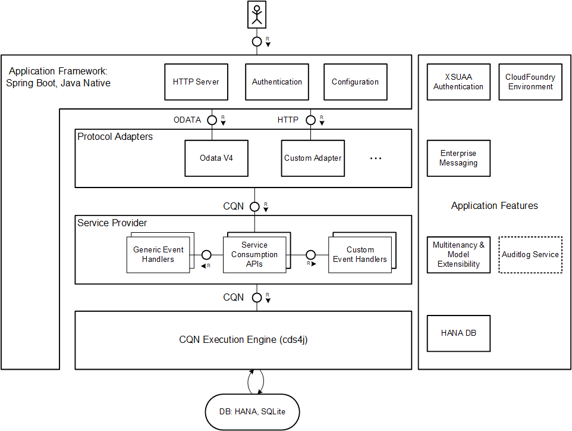

# Building Applications
<style scoped>
  h1:before {
    content: "Java"; display: block; font-size: 60%; margin: 0 0 .2em;
  }
</style>

One of the key [CAP design principles](../../about/#open-and-opinionated) is to be an opinionated but yet open framework.
Giving a clear guidance for cutting-edge technologies on the one hand and still keeping the door wide open for custom choice on the other hand, demands a highly flexible CAP Java runtime stack.
The [modular architecture](#modular_architecture) reflects this requirement, allowing a fine-grained and flexible [configuration](#stack_configuration) based on standard or custom modules.

## Modular Stack Architecture { #modular_architecture}

### Overview

One of the basic design principle of the CAP Java is to keep orthogonal functionality separated in independent components.
The obvious advantage of this decoupling is that it makes concrete components exchangeable independently.
Hence, it reduces the risk of expensive adaptions in custom code, which can be necessary due to new requirements with regards to the platform environment or used version of platform services.
Hence, the application is [platform **and** service agnostic](../../about/best-practices#agnostic-by-design).

For instance, custom code doesn't need to be written against the chosen type of persistence service, but can use the generic persistence service based on [CQL](../working-with-cqn/../working-with-cql/query-api).
Likewise, the application isn't aware of the concrete (cloud) platform environment in which it gets embedded.
Consequently, preparing an application to be deployable in different platform contexts is rather a matter of configuration than of code adaption.

Consequently, CAP Java doesn't determine the technology the application is built on.
But it comes with a chosen set of industry-proven frameworks that can be consumed easily.
Nevertheless, you can override the defaults separately depending on the demands in your scenario.

Moreover, the fine-grained modularization allows you to assemble a minimum set of components, which is necessary to fulfill the application-specific requirements.
This reduces resource consumption at runtime as well as maintenance costs significantly.

Another helpful result of the described architecture is that it simplifies local testing massively.
Firstly, as components are coupled weakly, you can define the actual test scope precisely and concentrate on the parts that need a high test coverage.
Components outside of the test scope are replaceable with mocks, which ideally simulate all the possible corner cases.
Alternatively, you can even configure test on integration level to be executed locally if you replace all dependencies to remote services by local service providers.
A common example for this is to run the application locally on H2 instead of SAP HANA.

The following diagram illustrates the modular stack architecture and highlights the generic components:

{width="600px"}

You can recognize five different areas of the stack, which comprise components according to different tasks:

* The mandatory [application framework](#application-framework) defines the runtime basis of your application typically comprising a web server.
* [Protocol adapters](#protocol-adapters) map protocol-specific web events into [CQN](../../cds/cqn) events for further processing.
* The resulting CQN-events are passed to [service providers](#service-providers) or the mandatory core runtime, which drives the processing of the event.
* The [CQN execution engine](#cqn-execution-engine) is capable of translating [CQN](../../cds/cqn) statements into native statements of a data sink such as a persistence service or remote service.
* [Application features](#application-features) are optional application extensions, for instance to add multitenancy capabilities or a platform service integration.


### Application Framework

Before starting the development of a new CAP-based application, an appropriate application framework to build on needs to be chosen.
The architecture of the chosen framework not only has a strong impact on the structure of your project, but it also affects efforts for maintenance as well as support capabilities.
The framework provides the basis of your web application in terms of a runtime container in which your business code can be embedded and executed.
This helps to separate your business logic from common tasks like processing HTTP/REST endpoints including basic web request handling.
Typically, a framework also provides you with a rich set of generic tools for recurring tasks like configuration, localization, or logging.
In addition, some frameworks come with higher-level concepts like dependency injection or sophisticated testing infrastructure.

CAP Java positions [Spring](https://spring.io) or more precisely [Spring Boot](https://spring.io/projects/spring-boot) as the first choice application framework, which is seamlessly integrated.
Spring comes as a rich set of industry-proven frameworks, libraries, and tools that greatly simplify custom development.
Spring Boot also allows the creation of self-contained applications that are easy to configure and run.

As all other components in the different layers of the CAP Java stack are decoupled from the concrete application framework, you aren't obligated to build on Spring.
In some scenarios, it might be even preferable to run the (web) service with minimal resource consumption or with smallest possible usage of open source dependencies.
In this case, a solution based on plain Java Servlets could be favorable.
Lastly, in case you want to run your application on a 3rd party application framework, you're free to bundle it with CAP modules and provide the glue code, which is necessary for integration.


### Protocol Adapters


The CAP runtime is based on an [event](../../about/best-practices#events) driven approach.
Generally, [Service](../../about/best-practices#services) providers are the consumers of events, that means, they do the actual processing of events in [handlers](../../guides/providing-services#event-handlers).
During execution, services can send events to other service providers and consume the results.
The native query language in CAP is [CQN](../../cds/cqn), which is accepted by all services that deal with data query and manipulation.
Inbound requests therefore need to be mapped to corresponding CQN events, which are sent to an accepting Application Service (see concept [details](../../about/best-practices#querying)) afterwards.
Mapping the ingress protocol to CQN essentially summarizes the task of protocol adapters depicted in the diagram.
Most prominent example is the [OData V4](https://www.odata.org/documentation/) protocol adapter, which is fully supported by the CAP Java.
Further HTTP-based protocols can be added in future, but often applications require specific protocols, most notably [RESTful](https://en.wikipedia.org/wiki/Representational_state_transfer) ones.
Such application-specific protocols can easily be implemented by means of Spring RestControllers.

The modular architecture allows to add custom protocol adapters in a convenient manner, which can be plugged into the stack at runtime.
Note that different endpoints can be served by different protocol adapters at the same time.


### Service Providers { #service-providers}

Services have different purposes. For instance, CDS model services provide an interface to work with persisted data of your [domain model](../../guides/domain-modeling).
Other services are rather technical, for example, hiding the consumption API of external services behind a generic interface.
As described in CAPs [core concepts](../../about/best-practices#services), services share the same generic provider interface and are implemented by event handlers.
The service provider layer contains all generic services, which are auto-exposed by CAP Java according to the appropriate CDS model.
In addition, technical services are offered such as the [Persistence Service](../cqn-services/#persistenceservice) or [Auditlog Service](../auditlog#auditlog-service), which can be consumed in custom service handlers.

In case the generic handler implementation of a specific service doesn't match the requirements, you can extend or replace it with custom handler logic that fits your business needs.
See section [Event Handlers](../event-handlers/) for more details.


### CQN Execution Engine { #cqn-execution-engine}

The CQN execution engine is responsible for processing the passed CQN events and translating them to native statements that get executed in a target persistence service like SAP HANA, PostgreSQL or H2.
CQN statements can be built conveniently in a [fluent API](../working-with-cqn/../working-with-cql/query-api). In the future, additional targets can be added to the list of supported outbound sources.


### Application Features { #application-features}

The CAP Java architecture allows **additional modules to be plugged in at runtime**.
This plugin mechanism makes the architecture open for future extensions and allows context-based configuration.
It also enables you to override standard behavior with custom-defined logic in all different layers.
Custom [plugins](../building-plugins) are automatically loaded by the runtime and can bring CDS models, CDS services, adapters or just handlers for existing services.

::: info
Plugins are optional modules that adapt runtime behaviour.
:::

CAP Java makes use of the plugin technique itself to offer optional functionality.
Examples are [SAP Event Mesh](../messaging) and [Audit logging](../auditlog) integration.
Find a full list of standard plugins in [Standard Modules](#standard-modules).

## Stack Configuration { #stack_configuration}

 As outlined in section [Modular Stack Architecture](#modular_architecture), the CAP Java runtime is highly flexible.
 You can choose among modules prepared for different environments and in addition also include plugins which are optional extensions.
 Which set of modules and plugins is active at runtime is a matter of compile time and runtime configuration.

 At compile time, you can assemble modules from the different layers:
 * The [application framework](#application-framework)
 * One or more [protocol adapters](#protocol-adapters)
 * The core [service providers](#service-providers)
 * [Application features](#application-features) to optionally extend the application or adapt to a specific environment

### Module Dependencies

All CAP Java modules are built as [Maven](https://maven.apache.org/) artifacts and are available on [Apache Maven Central Repository](https://search.maven.org/search?q=com.sap.cds).
They have `groupId` `com.sap.cds`.
Beside the Java libraries (Jars) reflecting the modularized functionality, the group also contains a "bill of materials" (BOM) pom named `cds-services-bom`, which is recommended especially for multi-project builds.
It basically helps to control the dependency versions of the artifacts and should be declared in dependency management of the parent `pom`:

```xml
<properties>
	<cds.services.version>2.6.0</cds.services.version>
</properties>

<dependencyManagement>
	<dependencies>
		<dependency>
			<groupId>com.sap.cds</groupId>
			<artifactId>cds-services-bom</artifactId>
			<version>${cds.services.version}</version>
			<type>pom</type>
			<scope>import</scope>
		</dependency>
	</dependencies>
</dependencyManagement>
```

::: tip Keep Versions in Sync
Importing `cds-services-bom` into the `dependencyManagement` of your project ensures that versions of all CAP modules are in sync.
:::

The actual Maven dependencies specified in your `pom` need to cover all modules that are required to run the web application:
- The application framework.
- At least one protocol adapter (in case of inbound requests).
- The CAP Java runtime.

The dependencies of a Spring Boot application with OData V4 endpoints could look like in the following example:
<!-- to XML code ? -->
```xml
<dependencies>
	<!-- Application framework -->
	<dependency>
		<groupId>com.sap.cds</groupId>
		<artifactId>cds-framework-spring-boot</artifactId>
		<scope>runtime</scope>
	</dependency>

	<!-- Protocol adapter -->
	<dependency>
		<groupId>com.sap.cds</groupId>
		<artifactId>cds-adapter-odata-v4</artifactId>
		<scope>runtime</scope>
	</dependency>

	<!-- CAP Java SDK -->
	<dependency>
		<groupId>com.sap.cds</groupId>
		<artifactId>cds-services-api</artifactId>
	</dependency>
	<dependency>
		<groupId>com.sap.cds</groupId>
		<artifactId>cds-services-impl</artifactId>
		<scope>runtime</scope>
	</dependency>
</dependencies>
```

::: tip API Modules w/o scope `dependency`
Only API modules without dependency scope should be added (they gain `compile` scope by default) such as `cds-services-api` or `cds4j-api`.
All other dependencies should have a dedicated scope, like `runtime` or `test` to prevent misuse.
:::

You are not obliged to choose one of the prepared application frameworks (identifiable by `artifactId` prefix `cds-framework`),
instead you can define your own application context if required.
Similarly, you're free to configure multiple adapters including custom implementations that map any specific web service protocol.

::: tip Recommended Application Framework
We highly recommended to configure `cds-framework-spring-boot` as application framework.
It provides you with a lot of [integration with CAP](../spring-boot-integration#spring-boot-integration) out of the box, as well as enhanced features, such as dependency injection and auto configuration.
:::

Additional application features (plugins) you want to use can be added as additional dependencies.
The following is required to make your application multitenancy aware:

```xml
<dependencies>
	<!-- Features -->
	<dependency>
		<groupId>com.sap.cds</groupId>
		<artifactId>cds-feature-mt</artifactId>
		<scope>runtime</scope>
	</dependency>
</dependencies>
```

Choosing a feature by adding the Maven dependency *at compile time* enables the application to make use of the feature *at runtime*.
If a chosen feature misses the required environment at runtime, the feature won't be activated.
Together with the fact that all features have a built-in default implementation ready for local usage, you can run the application locally with the same set of dependencies as for productive mode.
For instance, the authentication feature `cds-feature-hana` requires a valid `hana` binding in the environment.
Hence, during local development without this binding, this feature gets deactivated and the stack falls back to default feature adapted for H2.

#### Standard Modules { #standard-modules }

CAP Java comes with a rich set of prepared modules for all different layers of the stack:

**Application Frameworks**:
* `cds-framework-spring-boot`:  Makes your application a Spring Boot application.
* `cds-framework-plain`:  Adds support to run as plain Java Servlet-based application.

**Protocol adapters**:
* `cds-adapter-odata-v4`:  Auto-exposes Application Services as OData V4 endpoints.
* `cds-adapter-odata-v2`:  Auto-exposes Application Services as OData V2 endpoints.

**Core runtime**:
* `cds-adapter-api`:  Generic protocol adapter interface to be implemented by customer adapters.
* `cds-services-api`:  Interface of the CAP Java SDK. Custom handler or adapter code needs to compile against.
* `cds-services-impl`:  Implementation of the core CAP Java runtime (**mandatory**).

**Application plugins**:
* `cds-feature-cloudfoundry`:  Makes your application aware of SAP BTP, Cloud Foundry environment.
* `cds-feature-k8s`: Service binding support for SAP BTP, Kyma Runtime.
* `cds-feature-jdbc`: Consuming JDBC persistences using the CDS4j JDBC runtime.
* `cds-feature-hana`:  Makes your application aware of SAP HANA data sources.
* `cds-feature-postgresql`: Makes your application aware of PostgreSQL data sources.
* `cds-feature-xsuaa`:  Adds [XSUAA](https://github.com/SAP/cloud-security-xsuaa-integration)-based authentication to your application.
* `cds-feature-identity`: Adds [Identity Services](https://github.com/SAP/cloud-security-xsuaa-integration) integration covering IAS to your application.
* `cds-feature-mt`:  Makes your application multitenant aware.
* `cds-feature-enterprise-messaging`:  Connects your application to SAP Event Mesh.
* `cds-feature-kafka`: Benefit from intra-application messaging with Apache Kafka.
* `cds-feature-remote-odata`: Adds [Remote Service](../cqn-services/remote-services#remote-services) support.
* `cds-feature-auditlog-v2`: Provides out of the box integration with SAP BTP Auditlog Service V2.
* `cds-integration-cloud-sdk`: Allows smooth integration with Cloud SDK to connect with remote REST-based services.

::: tip
`cds-feature-cloudfoundry` and `cds-feature-k8s` can be combined to create binaries that support both environments.
:::

### Starter Bundles

To simplify the configuration on basis of Maven dependencies, the CAP Java comes with several starter bundles that help to set up your configuration for most common use cases quickly:

* `cds-starter-cloudfoundry`: Bundles features to make your application production-ready for SAP BTP, Cloud Foundry environment. It comprises XSUAA authentication, SAP HANA persistence, Cloud Foundry environment for SAP BTP, and multitenancy support.
* `cds-starter-k8s`: Bundles features to make your application production-ready for SAP BTP, Kyma/K8s environment. It comprises XSUAA authentication, SAP HANA persistence, Kyma/K8s environment for SAP BTP, and multitenancy support.
* `cds-starter-spring-boot`: Bundles all dependencies necessary to set up a web-application based on Spring Boot. No protocol adapter is chosen.

Starter bundle `cds-starter-spring-boot` can be combined with any of the other bundles.

An example of a CAP application with OData V4 on Cloud Foundry environment:
```xml
<dependencies>
		<dependency>
			<groupId>com.sap.cds</groupId>
			<artifactId>cds-starter-spring-boot</artifactId>
		</dependency>

		<dependency>
			<groupId>com.sap.cds</groupId>
			<artifactId>cds-adapter-odata-v4</artifactId>
			<scope>runtime</scope>
		</dependency>

		<dependency>
			<groupId>com.sap.cds</groupId>
			<artifactId>cds-starter-cloudfoundry</artifactId>
			<scope>runtime</scope>
		</dependency>
</dependencies>
```


## Generating Projects with Maven { #the-maven-archetype }

Use the following command line to create a project from scratch with the CDS Maven archetype:

::: code-group
```sh [Mac/Linux]
mvn archetype:generate -DarchetypeArtifactId=cds-services-archetype -DarchetypeGroupId=com.sap.cds -DarchetypeVersion=RELEASE
```

```cmd [Windows]
mvn archetype:generate -DarchetypeArtifactId=cds-services-archetype -DarchetypeGroupId=com.sap.cds -DarchetypeVersion=RELEASE
```

```powershell [Powershell]
mvn archetype:generate `-DarchetypeArtifactId=cds-services-archetype `-DarchetypeGroupId=com.sap.cds `-DarchetypeVersion=RELEASE
```
:::

<div id="release-sap" />

It supports the following command-line options:

| Option | Description |
| -- | -- |
| `-DgroupId=<a valid Maven groupId>` | The `groupId` of the Maven artifact for the new project. If not specified, Maven prompts for user input. |
| `-DartifactId=<a valid Maven artifactId>` | The `artifactId` of the Maven artifact for the new project. If not specified, Maven prompts for user input. |
| `-Dversion=<a valid Maven version>` | The `version` of the Maven artifact for the new project. Defaults to `1.0.0-SNAPSHOT` |
| `-Dpackage=<a valid Java package>` | The Java package for your project's classes. Defaults to `${groupId}.${artifactId}`. |
| `-DincludeModel=true` | Adds a minimalistic sample CDS model to the project. |
| `-DincludeIntegrationTest=true` | Adds an integration test module to the project. |
| `-DodataVersion=[v2\|v4]` | Specify which protocol adapter is activated by default. |
| `-DtargetPlatform=cloudfoundry` | Adds CloudFoundry target platform support to the project. |
| `-DinMemoryDatabase=[h2\|sqlite]` | Specify which in-memory database is used for local testing. If not specified, the default value is `h2`. |
| `-DjdkVersion=[17\|21]` | Specifies the target JDK version. If not specified, the default value is `21`. |
| `-Dpersistence=[true\|false]` | Specify whether persistence is enabled (`true`) or disabled (`false`). Defaults to `true`. |
| `-DcdsdkVersion=<a valid cds-dk version>` | Sets the provided cds-dk version in the project. If not specified, the default of CAP Java is used. |

## Building Projects with Maven { #maven-build-options }

You can build and run your application by means of the following Maven command:

```sh
mvn spring-boot:run
```


### CDS Maven Plugin

CDS Maven plugin provides several goals to perform CDS-related build steps.
For instance, the CDS model needs to be compiled to a CSN file which requires a Node.js runtime with module `@sap/cds-dk`.

It can be used in CAP Java projects to perform the following build tasks:

- Install Node.js in the specified version
- Install the CDS Development Kit `@sap/cds-dk` with a specified version
- Perform arbitrary CDS commands on a CAP Java project
- Generate Java classes for type-safe access
- Clean a CAP Java project from artifacts of the previous build

Since CAP Java 1.7.0, the CDS Maven Archetype sets up projects to leverage the CDS Maven plugin to perform the previous mentioned build tasks.
To have an example on how you can modify a project generated with a previous version of the CDS Maven Archetype, see [this commit](https://github.com/SAP-samples/cloud-cap-samples-java/commit/ceb47b52b1e30c9a3f6e0ea29e207a3dad3c0190).

See [CDS Maven Plugin documentation](../assets/cds-maven-plugin-site/plugin-info.html){target="_blank"} for more details.

::: tip
Use the _.cdsrc.json_ file to add project specific configuration of `@sap/cds-dk` in case defaults are not appropriate.
:::

[Learn more about configuration and `cds.env`](../../node.js/cds-env){.learn-more}


## Code Generation for Typed Access {#codegen-config}

The [interfaces for typed access](../cds-data#generated-accessor-interfaces) are generated at each build
by the [`cds:generate`](/java/assets/cds-maven-plugin-site/generate-mojo.html) goal of the [CDS Maven Plugin](/java/assets/cds-maven-plugin-site/plugin-info.html).

You configure this goal just like any other Maven plugin via its configuration options via your application's POM. For example:

```xml [pom.xml]
<execution>
    <id>cds.generate</id>
    <goals>
        <goal>generate</goal>
    </goals>
    <configuration>
        <basePackage>cds.gen</basePackage>
        ...
    </configuration>
</execution>
```

Each time your application is built, these interfaces are regenerated. By default, they are excluded from your version control. 

### Package for Generated Code

The option [`basePackage`](/java/assets/cds-maven-plugin-site/generate-mojo.html#basePackage) can be used to specify a base package prefix for generated code. The suffix package structure will reflect namespaces defined in your CDS model.

### Filter for CDS Entities

By default, the complete model of your application is generated including all imported or re-used models.
You can use options [`includes`](/java/assets/cds-maven-plugin-site/generate-mojo.html#includes) and [`excludes`](/java/assets/cds-maven-plugin-site/generate-mojo.html#excludes) to specify the part of your overall model that is subject to code generation. Both inclusion and exclusion can be used together, inclusion is evaluated first, then exclusion filters out of the included set of entities.

These options use patterns that are applied on the fully qualified names of the entities in CDS models. For example, the pattern `my.bookshop.*` will cover all definitions with namespace `my.bookshop` and the pattern `my.bookshop.**` will cover all definitions with fully qualified name starting with `my.bookshop`.

:::warning Cross-namespace references are not resolved
Options `includes` and `excludes` are simple filters. If included parts of your model reference types from the excluded area, the resulting code will not compile.
:::

### Style of Interfaces

By default, the accessor interfaces provide the setter and getter methods inspired by the JavaBeans specification. In this style, getter and setter method names are prefixed with `get` and `set`:


```java
    Authors author = Authors.create();
    author.setName("Emily Brontë");

    Books book = Books.create();
    book.setAuthor(author);
    book.setTitle("Wuthering Heights");
```

Alternatively, you can generate accessor interfaces in _fluent style_. In this mode, the getter methods are named after the property names. To enable fluent chaining, the setter methods return the accessor interface itself:


```java
   Authors author = Authors.create().name("Emily Brontë");
   Books.create().author(author).title("Wuthering Heights");
```

The generation mode is configured by the option [`methodStyle`](/java/assets/cds-maven-plugin-site/generate-mojo.html#methodStyle). The selected style affects all entities and event contexts in your services. The default value is `BEAN`, which represents JavaBeans-style interfaces.

Once, when starting a project, decide on the style of the interfaces that is best for your team and project.

The way the interfaces are generated only determines how data is accessed by custom code. It does not affect how the data is represented in memory and handled by the CAP Java runtime.

Moreover, it doesn't change the way how event contexts, delivered by CAP, look like. Such interfaces from CAP are always modelled in the default JavaBeans style.

### Code Generation Features

Other options in this goal enable or disable certain features that change the way generated code looks in a certain aspect. These changes can be incompatible with the existing code and require manual adaptation.

- [`strictSetters`](/java/assets/cds-maven-plugin-site/generate-mojo.html#strictSetters)

  This switch changes the signature of the setter methods in typed access interfaces so that they require concrete type instead of generic `Map` interface.
  For example:

  ```java
  void setManager(Map<String, ?> manager); // [!code --]
  void setManager(Manager manager); // [!code ++]
  ```

  It does not introduce any additional type checks at runtime, the correctness of the assignment is checked only at the time of compilation.

- [`interfacesForAspects`](/java/assets/cds-maven-plugin-site/generate-mojo.html#interfacesForAspects)

  If your entity is modelled with the [composition of aspects](/cds/cdl#with-named-targets), the generated interfaces always reference original aspect as type for setters and getters.
  When this switch is enabled, the code generator uses the type generated by the compiler instead of the type of the aspect itself and will include methods to fetch keys, for example.

  :::warning Limitations
  This is supported only for the named aspects (inline targets are not supported) and does not respect all possible options how such entities might be exposed by services.
  :::

- [`betterNames`](/java/assets/cds-maven-plugin-site/generate-mojo.html#betterNames)

  CDS models from external sources might include elements that have some special characters in their names or include elements that clash with Java keywords. Such cases always can be solved with the [renaming features](/java/cds-data#renaming-elements-in-java) provided by code generator, but in case of large models, this is tedious.
  When this switch is enabled, characters `/` and `$` behave as a separators for the name during case conversions, similar to `_` and `.`. For example, `GET_MATERIAL` yields `GetMaterial` (or `getMaterial` for attributes and methods). The same now applies for the names with `/`, for example, name `/DMO/GET_MATERIAL` will be converted to `DmoGetMaterial`.
  
  The following conversions are applied:  
    - Names from CDS model that are Java keywords are suffixed with `_`.
    - Names from CDS model that use characters that are not valid as Java identifiers, are replaced by `_`. This, however, might lead to a conflicts between names that yield the same name in Java.
    - Leading `_` will remain in the name after conversions. This supports conventions where an association and its foreign key have names like `_assoc` and `assoc`.
  These conversions no longer influence the splitting.

- [`cqnServiceGetters`](/java/assets/cds-maven-plugin-site/generate-mojo.html#cqnServiceGetters)

  The method `getService()` in generated [event-specific Event Context interfaces](../event-handlers/#eventcontext) is overridden to return the typed service interface instead of the generic `Service` type.

:::warning Check migration guides!
In major releases of CAP Java, some of these switches can be made the new default and some other switches might be removed. This might introduce compile errors
in your application that needs to be fixed.
:::

See [Maven Plugin Documentation](/java/assets/cds-maven-plugin-site/generate-mojo.html) for actual status of deprecation and switches that are not described here. {.learn-more}

### Annotation Detail Level

The option [`annotationDetailLevel`](/java/assets/cds-maven-plugin-site/generate-mojo.html#annotationDetailLevel) lets you choose the amount of the details for the Java annotation [`@Generated`](https://docs.oracle.com/en/java/javase/21/docs/api/java.compiler/javax/annotation/processing/Generated.html) added to each interface. This annotation has no effect at runtime but is evaluated by static code analysis tools to identify the artifacts as generated.

Following levels of the details are available:
- `MINIMAL` (default) - only the annotation is added, no additional information is added.

   ```java
    @CdsName("service.Entity")
    @Generated("cds-maven-plugin")
    public interface Entity extends CdsData {  }
   ```

- `FULL` - annotation contains the timestamp of the generation.

  ```java
  @CdsName("service.Entity")
  @Generated(
      value = "cds-maven-plugin",
      date = "9999-12-31T23:59:59.999999Z",
      comments = ""
  )
  public interface Entity extends CdsData {  }
  ```

- `NONE` - no `@Generated` annotation is added. This is not recommended.

## Using a Local cds-dk

Starting with version 3.6.0 of the `cds-services-archetype`, the default setup of a newly created CAP Java project has changed. The `@sap/cds-dk` is maintained as a `devDependency` in `package.json` and installed with an `npm ci` during the Maven build.
The `install-cdsdk` goal is no longer used to install the `@sap/cds-dk` locally and it's also marked as deprecated. The version of the `@sap/cds-dk` is no longer maintained in _pom.xml_, it's configured in the _package.json_:
```json
{
  "devDependencies" : {
    "@sap/cds-dk" : "^8.5.1",
  }
}
```
A `package-lock.json` is also created during project creation with the `cds-services-archetype`. The lock file is needed for `npm ci` to run successfully and pins the transitive dependencies of `@sap/cds-dk` to fixed versions. Fixing the versions ensures that the CDS build is fully reproducible.

::: warning
For multitenant applications, ensure that the `@sap/cds-dk` version in the sidecar is in sync.
:::

#### Migrate From Goal `install-cdsdk` to `npm ci` { #migration-install-cdsdk }

To migrate from the deprecated goal `install-cdsdk` to the new `npm ci` approach, the following steps are required:

1. Remove execution of goal `install-cdsdk` from the `cds-maven-plugin` in _srv/pom.xml_:
	```xml
	<plugin>
		<groupId>com.sap.cds</groupId>
		<artifactId>cds-maven-plugin</artifactId>
		<version>${cds.services.version}</version>
		<executions>
			<!-- Delete from here ...  -->
			<execution>
				<id>cds.install-cdsdk</id>
				<goals>
					<goal>install-cdsdk</goal>
				</goals>
			</execution>
			<!-- ... to here -->
	```

2. Then add execution of goal `npm` with arguments `ci` instead to the `cds-maven-plugin` in _srv/pom.xml_:
	```xml
			<execution>
				<id>cds.npm-ci</id>
				<goals>
					<goal>npm</goal>
				</goals>
				<configuration>
					<arguments>ci</arguments>
				</configuration>
			</execution>
	```

3. Remove cds-dk version property `cds.install-cdsdk.version` from _pom.xml_:
	```xml
		<properties>
			<!-- Delete from here ...  -->
			<cds.install-cdsdk.version>8.4.2</cds.install-cdsdk.version>
			<!-- ... to here -->
		</properties>
	```

4. Add `@sap/cds-dk` as devDependency to _package.json_:
	```json
	{
	"devDependencies" : {
		"@sap/cds-dk" : "^8.5.0"
	}
	}
	```

5. Perform `npm install` on the command line to get the _package-lock.json_ created or updated.

6. Finally, do a `mvn clean install` and verify that the installation of `@sap/cds-dk` is done with the new approach.

#### Maintaining cds-dk

1. _package.json_ and `npm ci` <br>
Newly created CAP Java projects maintain the `@sap/cds-dk` with a specific version as a devDependency in `package.json`. So, when you update the version, run npm install from the command line to update the `package-lock.json`. `npm ci` will then install the updated version of `@sap/cds-dk`.

2. Goal `install-cdsdk` <br>
 Older CAP Java projects that use the `install-cdsdk` goal of the `cds-maven-plugin` don't update `@sap/cds-dk`. By default, the goal skips the installation if it's already installed.
To update the `@sap/cds-dk` version:

3. Specify a newer version of `@sap/cds-dk` in your *pom.xml* file.
4. Execute `mvn spring-boot:run` with an additional property `-Dcds.install-cdsdk.force=true`, to force the installation of a **`@sap/cds-dk`** in the configured version.

    ```sh
    mvn spring-boot:run -Dcds.install-cdsdk.force=true
    ```

::: tip _Recommendation_ <!--  -->
This should be done regularly to get the latest bugfixes, but at least with every **major update** of `@sap/cds-dk`.
:::

<div id="xmake-troubleshooting" />

### Using a Global cds-dk

By default, the build is configured to download a Node.js runtime and the `@sap/cds-dk` tools and install them locally within the project.
This step makes the build self-contained, but the build also takes more time. You can omit these steps and speed up the Maven build, using the Maven profile `cdsdk-global`.

Prerequisites:
* `@sap/cds-dk` is [globally installed](../../get-started/#setup).
* Node.js installation is available in current *PATH* environment.

If these prerequisites are met, you can use the profile `cdsdk-global` by executing:

```sh
mvn spring-boot:run -P cdsdk-global
```
