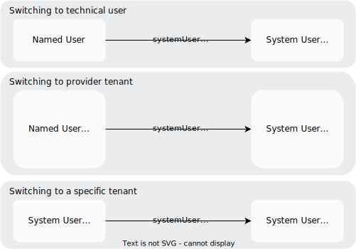
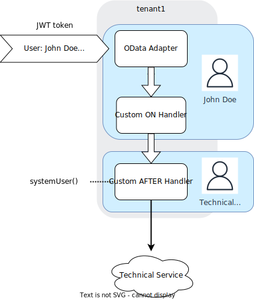
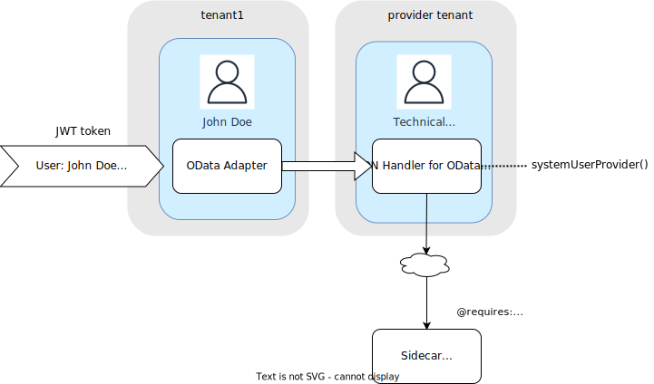
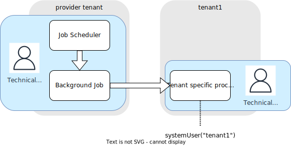

# Request Contexts
<style scoped>
  h1:before {
    content: "Java"; display: block; font-size: 60%; margin: 0 0 .2em;
  }
</style>

{{ $frontmatter.synopsis }}


## Overview

When [events](../../about/#events) are processed on [services](../services), [event context](../event-handlers#eventcontext) objects are used to store information related to a specific event.
However, when processing an HTTP request in a protocol adapter or receiving an asynchronous event from a messaging system not only a single event is triggered. Other services, like the [Persistence Service](../cqn-services/persistence-services) or additional technical services might be involved in processing. All of these services and their event handler need access to certain overarching metadata, such as user information, the selected locale, the tenant, and its (extended) CDS model or headers and query parameters.

The CAP Java SDK manages and exposes this kind of information by means of [RequestContext](https://www.javadoc.io/doc/com.sap.cds/cds-services-api/latest/com/sap/cds/services/request/RequestContext.html) instances. They define a scope that is typically determined by the context of a single HTTP request. The active Request Context can be accessed from the Event Context. However, those two are managed independently, as Event Contexts are passed along event handlers, while Request Contexts are maintained as thread-locals. For example, the Persistence Service requires the tenant to be set correctly in the Request Context in order to access the tenant-specific persistence.

Inside an event handler, it's guaranteed that a Request Context is available. How to access the exposed information is described in detail in [Accessing Request Contexts](#reading-requestcontext).

Usually, the protocol adapter opens a *single* Request Context that makes the request's parameters available to CAP services used during request processing. In contrast, an OData `$batch` request sequentially opens *different*  Request Contexts with divergent parameters for the different requests inside the batch. This behaviour ensures that Event Handlers triggered by the individual requests can only access the relevant parameters.

In general, it's possible to explicitly define (nested) Request Contexts and control their scope of validity. For example, in some cases an application might be required to break out from the current tenant to access a shared, tenant-independent persistence. All events triggered within the same context also share the same parameters. This is described in detail in [Defining Request Contexts](#defining-requestcontext).

How to propagate Request Context instances to several threads is explained in [Passing Request Contexts to Threads](#threading-requestcontext), and [Registering Global Parameter Providers](#global-providers) shows how you can influence or even override the standard way of retrieving the parameters from the request.

## Accessing Request Contexts { #reading-requestcontext}

The Request Context provides information about the request's parameters as well as the current user:
- [UserInfo](https://www.javadoc.io/doc/com.sap.cds/cds-services-api/latest/com/sap/cds/services/request/UserInfo.html): Exposes an API to fetch data of the (authenticated) user such as the logon name, id, CAP roles, and the tenant.
- [ParameterInfo](https://www.javadoc.io/doc/com.sap.cds/cds-services-api/latest/com/sap/cds/services/request/ParameterInfo.html): Exposes an API to retrieve additional request data such as header values, query parameters, and the locale.
- [AuthenticationInfo](https://www.javadoc.io/doc/com.sap.cds/cds-services-api/latest/com/sap/cds/services/authentication/AuthenticationInfo.html): Exposes an API to retrieve the authentication claims according to the authentication strategy. Can be used for user propagation.
- [FeatureTogglesInfo](https://www.javadoc.io/doc/com.sap.cds/cds-services-api/latest/com/sap/cds/services/request/FeatureTogglesInfo.html): Exposes an API to retrieve activated feature toggles of the request.

In addition, it provides access to the [CDS model](../working-with-cql/query-introspection), which specifically can be dependent on tenant information or feature toggles.

You can get instances from the [Event Context](../event-handlers#eventcontext):

```java
@Before(event = CqnService.EVENT_READ)
public void beforeRead(CdsReadEventContext context) {
    UserInfo userInfo = context.getUserInfo();
    boolean isAuthenticated = userInfo.isAuthenticated();

    ParameterInfo parameterInfo = context.getParameterInfo();
    Locale locale = parameterInfo.getLocale();

    // OAuth2 authentication provided:
    AuthenticationInfo authInfo = context.getAuthenticationInfo();
    JwtTokenAuthenticationInfo jwtTokenInfo = authInfo.as(JwtTokenAuthenticationInfo.class);
    String jwtToken = jwtTokenInfo.getToken();

    FeatureTogglesInfo ftsInfo = context.getFeatureTogglesInfo();
    if (ftsInfo.isEnabled("experimental")) {
      // ...
    }
}
```

When running in Spring, you can also use Dependency Injection:

```java
@Autowired
UserInfo userInfo;

@Autowired
ParameterInfo parameterInfo;

@Autowired
AuthenticationInfo authInfo;

@Autowired
FeatureTogglesInfo ftsInfo;


@Before(event = CqnService.EVENT_READ)
public void beforeRead() {
    boolean isAuthenticated = userInfo.isAuthenticated();
    Locale locale = parameterInfo.getLocale();
    // ...
}
```

[UserInfo](https://www.javadoc.io/doc/com.sap.cds/cds-services-api/latest/com/sap/cds/services/request/UserInfo.html) reflects the minimal API, which is required by generic CAP handlers (for example, for authorization). Depending on the configured authentication strategy, a lot more useful information might be presented in the user claim. For instance, XSUAA users additionally bear email, given, and family name etc. You can retrieve these properties with `userInfo.getAdditionalAttribute("<property-name>")`.
To establish type-safe access, additional attributes may also be accessed via custom extensions of `UserInfo`. To map XSUAA users, interface `XsuaaUserInfo` is available by default. You can create `XsuaaUserInfo` instances either by calling `userInfo.as(XsuaaUserInfo.class)` or by Spring injection:

```java
@Autowired
XsuaaUserInfo xsuaaUserInfo;

@Before(event = CqnService.EVENT_READ)
public void beforeRead() {
	boolean isAuthenticated = xsuaaUserInfo.isAuthenticated();
	String email = xsuaaUserInfo.getEmail();
	String givenName = xsuaaUserInfo.getGivenName();
	String familyName = xsuaaUserInfo.getFamilyName();
    // ...
}
```

The same functionality is provided for arbitrary custom interfaces, which are extensions of `UserInfo`.

[ParameterInfo](https://www.javadoc.io/doc/com.sap.cds/cds-services-api/latest/com/sap/cds/services/request/ParameterInfo.html) provides access to request-specific information.
For example, if the request is processed by an HTTP-based protocol adapter, `ParameterInfo` provides access to the HTTP request information. It exposes the [correlation ID](../operating-applications/observability#correlation-ids), the locale, the headers, and the query parameters of a request.

[AuthenticationInfo](https://www.javadoc.io/doc/com.sap.cds/cds-services-api/latest/com/sap/cds/services/authentication/AuthenticationInfo.html) stores the authentication claims of the authenticated user. For instance, if OAuth2-based authentication is used, this is a JWT token (for example, XSUAA or IAS). You can call `is(Class<? extends AuthenticationInfo>)` to find the concrete `AuthenticationInfo` type.
[JwtTokenAuthenticationInfo](https://www.javadoc.io/doc/com.sap.cds/cds-services-api/latest/com/sap/cds/services/authentication/JwtTokenAuthenticationInfo.html) represents a JWT token, but [BasicAuthenticationInfo](https://www.javadoc.io/doc/com.sap.cds/cds-services-api/latest/com/sap/cds/services/authentication/BasicAuthenticationInfo.html) can be observed on requests with basic authentication (e.g. test scenario with mock users). The method `as(Class<? extends AuthenticationInfo>)` helps to perform the downcast to a concrete subtype.

## Defining New Request Contexts { #defining-requestcontext}

The CAP Java SDK allows you to create new Request Contexts and define their scope. This helps you to control, which set of parameters is used when events are processed by services.

There are a few typical use cases in a CAP-based, multitenant application on SAP BTP in which creation of new Request Contexts is necessary. These scenarios are identified by a combination of the user (technical or named) and the tenant (provider or subscribed).



When calling CAP Services, it's important to call them in an appropriate Request Context. Services might, for example,  trigger HTTP requests to external services by deriving the target tenant from the current Request Context.

The `RequestContextRunner` API offers convenience methods that allow an easy transition from one scenario to the other.

| Method               | Description                                                                                                                          |
|----------------------|--------------------------------------------------------------------------------------------------------------------------------------|
| systemUserProvider() | Switches to a technical user targeting the provider account.                                                                         |
| systemUser()         | Switches to a technical user and preserves the tenant from the current `UserInfo` (for example down grade of a named user Request Context). |
| systemUser(tenant)   | Switches to a technical user targeting a given subscriber account.                                                                   |
| anonymousUser()      | Switches to an anonymous user.                                                                                                       |
| privilegedUser()     | Elevates the current `UserInfo` to by-pass all authorization checks.                                                                 |

::: info Note
The [RequestContextRunner](https://www.javadoc.io/doc/com.sap.cds/cds-services-api/latest/com/sap/cds/services/runtime/RequestContextRunner.html) API does not allow you to create a Request Context based on a named user. Named user contexts are only created by the CAP Java framework as initial Request Context is based on appropriate authentication information (e.g. JWT token) attached to the incoming HTTP request.
:::

In the following a few concrete examples are given:
- [Switching to Technical User](#switching-to-technical-user)
- [Switching to Provider Tenant](#switching-to-provider-tenant)
- [Switching to a Specific Technical Tenant](#switching-to-a-specific-technical-tenant)

### Switching to Technical User



The incoming JWT token triggers the creation of an initial RequestContext with a named user. Accesses to the database in the OData Adapter as well as the custom `on` handler are executed within <i>tenant1</i> and authorization checks are performed for user <i>JohnDoe</i>. An additionally defined `after` handler wants to call out to an external service using a technical user without propagating the named user <i>JohnDoe</i>.
Therefore, the `after` handler needs to create a new Request Context. To achieve this, it's required to call `requestContext()` on the current `CdsRuntime` and use the `systemUser()` method to remove the named user from the new Request Context:

```java
@After(entity = Books_.CDS_NAME)
public void afterHandler(EventContext context){
    runtime.requestContext().systemUser().run(reqContext -> {
        // call technical service
        ...
    });
}
```
### Switching to Technical Provider Tenant {#switching-to-provider-tenant}



The application offers an action for one of its CDS entities. Within the action, a communication happens with a remote CAP service using an internal technical user from the provider account. The corresponding `on` handler of the action needs to create a new Request Context by calling `requestContext()`. Using the `systemUserProvider()` method, the existing user information is removed and the tenant is automatically set to the provider tenant. This allows the application to perform an HTTP call to the remote CAP service, which is secured using the pseudo-role `internal-user`.

```java
@On(entity = Books_.CDS_NAME)
public void onAction(AddToOrderContext context){
    runtime.requestContext().systemUserProvider().run(reqContext -> {
        // call remote CAP service
        ...
    });
}
```
### Switching to a Specific Technical Tenant



The application is using a job scheduler that needs to regularly perform tasks on behalf of a certain tenant. By default, background executions (for example in a dedicated thread pool) aren't associated to any subscriber tenant and user. In this case, it's necessary to explicitly define a new Request Context based on the subscribed tenant by calling `systemUser(tenantId)`. This ensures that the Persistence Service performs the query for the specified tenant.

```java
runtime.requestContext().systemUser(tenant).run(reqContext -> {
    return persistenceService.run(Select.from(Books_.class)).listOf(Books.class);
});
```
## Modifying Request Contexts { #modifying-requestcontext}

Besides the described common use cases, it's possible to modify parts of an existing Request Context. To manually add, modify or reset specific attributes within the scope of a new Request Context, you can use the [RequestContextRunner](https://www.javadoc.io/doc/com.sap.cds/cds-services-api/latest/com/sap/cds/services/runtime/RequestContextRunner.html) API.

```java
List<Books> readBooksNotLocalized(EventContext context) {
  return context.getCdsRuntime().requestContext()
    .modifyParameters(param -> param.setLocale(null))
    .run(newContext -> {
      return persistenceService.run(Select.from(Books_.class)).listOf(Books.class);
    });
}
```

In the example, executing the CQN Select query on the Persistence Service needs to run inside a Request Context without locale in order to retrieve unlocalized data. Before the execution, the newly created context that wraps the functional code, can be modified arbitrarily:

- `modifyParameters()`: Add, modify, or remove (single) parameters.
- `clearParameters()`: Resets all parameters.
- `providedParameters()`: Resets the parameters according to the registered `ParameterInfoProvider`.

Similarly, it's possible to fully control the `UserInfo` instance provided in the RequestContext. It's guaranteed, that the original parameters aren't touched by the nested `RequestContext`. In addition, all original parameter values, which aren't removed or modified are visible in the nested scope. This enables you to either define the parameters from scratch or just to put a modification layer on top.

Some more examples:

- `modifyUser(user -> user.removeRole("read").setTenant(null).run(...)`: Creates a context with a user that is similar to the outer context but without role `read` and tenant.
- `modifyParameters(param -> param.setHeader("MY-HEADER", "my value"))`: Adds a header parameter `MY-HEADER:my value`.

The modifications can be combined arbitrarily in fluent syntax.

### Request Context Inheritance

When creating a new Request Context all information that is stored in it is obtained through _providers_, see also [Registering Global Providers](#global-providers).
Any modifications that you perform are applied on the information obtained by these providers. However:
- A new nested Request Context, created within a scope that already has a Request Context, inherits copies of all values from its parent Request Context.
- Modifications in that scenario are applied on the inherited information.

Special care needs to be taken with regards to the CDS model and feature toggles.
- Both of these are _only_ determined in the initial Request Context.
- It's not possible to modify the CDS Model and feature toggles when creating a nested Request Context.

There's one exception to that rule: When modifying the user's tenant the CDS model is also redetermined.

::: tip
When changing the user's tenant it's required to open a new ChangeSet, to ensure that database transactions and connections are directed to the new tenant. In case you miss this step CAP Java SDK detects this error and prevent any database access to avoid leaking information between tenants.
:::

## Registering Global Providers { #global-providers}

The CAP Java SDK ensures that each Request Context provides non-null values of the objects stored in it. Hence, if a service is called outside the scope of an existing Request Context, the runtime implicitly creates a Request Context for that service call. To accomplish the initialization of a Request Context, the CAP Java SDK uses provider APIs, such as [UserInfoProvider](https://www.javadoc.io/doc/com.sap.cds/cds-services-api/latest/com/sap/cds/services/runtime/UserInfoProvider.html) or [ParameterInfoProvider](https://www.javadoc.io/doc/com.sap.cds/cds-services-api/latest/com/sap/cds/services/runtime/ParameterInfoProvider.html). The default providers registered with the `CdsRuntime` usually derive the required information from the HTTP request, if available.

These provider interfaces allow for customization. That means, the way how `UserInfo` or `ParameterInfo` are initially determined, can be modified or replaced.

For example, in some scenarios the user information can't be derived from a principal attached to the current thread, as done in the default `UserInfoProvider`. Authentication is done outside the service and user information is passed via dedicated header parameters. A custom provider to support this could look like in this sketch:

```java
@Component
@Order(1)
public class HeaderBasedUserInfoProvider implements UserInfoProvider {

    @Autowired
    HttpServletRequest req; // accesses current HTTP request

    @Override
    public UserInfo get() {
        if (RequestContextHolder.getRequestAttributes() != null) {
            // only within request thread req is available
            return UserInfo.create()
                .setTenant(req.getHeader("custom-tenant-header"))
                .setName(req.getHeader("custom-username-header"));
        }
        return UserInfo.create();
    }
}
```

It's allowed to define several providers of the same type. In Spring, the provider with the lowest `@Order` is first. In plain Java, the order is given by registration order. You can reuse the provider with lower priority and build a modified result. To accomplish this, remember the previous provider instance, which is passed during registration via `setPrevious()` method call. Such a chain of providers can be used to normalize user names or adjust user roles to match specific needs.

```java
@Component
public class CustomUserInfoProvider implements UserInfoProvider {

    private UserInfoProvider previousProvider;

    @Override
    public UserInfo get() {
        ModifiableUserInfo userInfo = UserInfo.create();
        if (previousProvider != null) {
            UserInfo previous = previousProvider.get();
            if (previous != null) {
                userInfo = previous.copy();
            }
        }
        if (userInfo != null) {
            userInfo.setName(userInfo.getName().toLowerCase()); // Normalize user name
        }

        return userInfo;
    }

    @Override
    public void setPrevious(UserInfoProvider previous) {
        this.previousProvider = previous;
    }
}
```

## Passing Request Contexts to Threads { #threading-requestcontext}

CAP service calls can be executed in different threads. In most cases the Request Context from the parent thread - typically the worker thread executing the request - needs to be propagated to one or more child threads. Otherwise, required parameter and user information might be missing, for example, when authorizing CRUD events or creating tenant-specific database connections.

To propagate the parent context, create an instance of `RequestContextRunner` in the *parent* thread and open a new `RequestContext` with `run()` method in the *child* thread. This way all parameters from the parent context are also available in the context of one or more spawned threads, as demonstrated in the following example:

```java
RequestContextRunner runner = runtime.requestContext();
Future<Result> result = Executors.newSingleThreadExecutor().submit(() -> {
	return runner.run(threadContext -> {
		return persistenceService.run(Select.from(Books_.class));
	});
});
```

Even though the `threadContext` variable isn't directly used in the example, executing the `run` method takes care of populating the Request Context to the thread-local store of the child thread. The Persistence Service then internally uses the thread-local store to access the Request Context in order to access the currently active tenant.

You're free to modify the parameters by means of the API described in [Defining Request Contexts](#defining-requestcontext) in addition. But be aware that `providedParameters()` resp. `providedUser()` might lead to unexpected behavior as typically the [standard providers](#global-providers) require to run in the context of the original worker thread to access request-local data.
