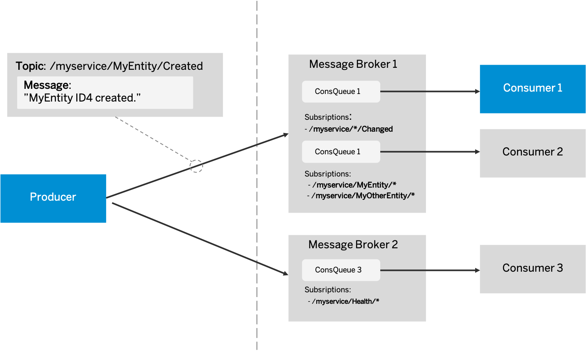

<script setup>
  import { h } from 'vue'
  const X    = () => h('span', { class: 'ga',      title: 'Available' },     ['✓']   )
  const Na   = () => h('i',    { class: 'na',      title: 'Not available' }, ['n/a'] )
  const Beta = () => h('i',    { class: 'beta'                            }, ['beta'] )
</script>
<style scoped>
  .ga   { color: var(--vp-c-green-1); }
  .na   { color: #fff; font-size:90%; }
  .beta { color: #aaa; font-size:90%; }
</style>

# Messaging

<style scoped>
  h1:before {
    content: "Java"; display: block; font-size: 60%; margin: 0 0 .2em;
  }
</style>

{{ $frontmatter.synopsis }}

In contrast, the nature of synchronous communication between services can be disadvantageous depending on the desired information flow, for example, sender and receiver need to be available at the time of the request. The sender needs to know the receiver and how to call it, and that communication per request is usually point-to-point only.

In the following, we provide a basic introduction to publish-subscribe-based messaging and then explain how to use it in CAP. If you're already familiar with publish-subscribe-based messaging, feel free to skip the following introduction section.

## Pub-Sub Messaging

In a publish-subscribe-based messaging scenario (pub-sub messaging), senders send a message tagged with a topic to a message broker. Receivers can create queues at the message broker and subscribe these queues to the topics they're interested in. The message broker will then copy incoming messages matching the subscribed topics to the corresponding queues. Receivers can now consume these messages from their queues. If the receiver is offline, no messages will be lost as the message broker safely stores messages in the queue until a receiver consumes the messages. After the receiver acknowledges the successful processing of a message, the message broker will delete the acknowledged message from the queue.

{width="700px"}

CAP makes sending and receiving messages easy by providing an API agnostic from specific message brokers, and taking care of broker-specific mechanics like connection handling, protocols to use, creating queues, subscriptions, etc. The API seamlessly blends into the common event API of CAP services, so that event messages can be sent using `emit` and handlers to execute when receiving event messages can be declared with the `@On` annotation.

CAP provides support for different message brokers by providing several messaging services implementing the API for different message brokers. Messaging support as such is built into the core of CAP, as well as a "file-based message broker" for local testing, that mocks a message broker and persists messages to a file on the local file system. Support for other message brokers can be added by including separate Maven dependencies specifically for that broker. See [Supported Message Brokers](#supported-message-brokers) for more details.

In the following, we'll first describe how to send and receive messages in general, before we explain more complex scenarios and configuration options.


## Sending

For a quick start in a local development scenario, use the file-based messaging service (mocking a message broker on the local file system), so you do not need to set up a real message broker first. Later, the configured messaging service can be changed to a real one, without the need of changing the code.

CAP services can be configured in the file _application.yaml_. Here, enable the `file-based-messaging` message service with a specific file to store messages in - like shown in the following example:

::: code-group
```yaml [srv/src/main/resources/application.yaml]
cds:
  messaging:
    services:
      - name: "messaging-name"
        kind: "file-based-messaging"
        binding: "/any/path/to/file.txt"
```
:::

With the availability of a messaging service, you can now use it to send messages, as illustrated in the following example:

```java
@Autowired
MessagingService messagingService;

// Sending via the technical API of the messaging service
messagingService.emit("My/Topic", Map.of("message", "hello world"));

// Sending by emitting a context via CAP service API
TopicMessageEventContext context = TopicMessageEventContext.create("My/Topic");
context.setDataMap(Map.of("message", "hello world"));
messagingService.emit(context);
```

As shown in the example, there are two flavors of sending messages with the messaging service:

- Directly using the `emit` method of the technical messaging service API. This is a convenient way of sending messages, in case you shouldn't need the context object as such and quickly want to send a message with given topic and payload.

- A CAP messaging service is also a normal CAP service, and as such provides an EventContext-based `emit` method. Using the standard way of creating and dispatching a context via `emit` can also be used to send a message. As shown, create a `TopicMessageEventContext` with the desired topic (in terms of CAP the topic represents an event) for the message, set the payload of the message, and emit the context.

In section [CDS-Declared Events](#cds-declared-events), we show how to declare events in CDS models and by this let CAP generate EventContext interfaces especially tailored for the defined payload, that allows type safe access to the payload.

::: tip Using an outbox
The messages are sent once the transaction is successful. Per default, an in-memory outbox is used, but there's also support for a [persistent outbox](./outbox#persistent).

You can configure a [custom outbox](./outbox#custom-outboxes) for a messaging service by setting the property
`cds.messaging.services.<key>.outbox.name` to the name of the custom outbox. This specifically makes sense when [using multiple channels](../guides/messaging/#using-multiple-channels).
:::


## Receiving

To receive messages matching a desired topic from a message broker, you just need to define a custom handler for the topic on the messaging service.

Example:

```java
@On(service = "messaging-name", event = "My/Topic")
public void receiveMyTopic(TopicMessageEventContext context) {
  // get ID and payload of message
  String msgId = context.getMessageId();
  Map<String, Object> payload = context.getDataMap();
  // ...
}
```

As you can see in the example, the event context not only provides access to the raw message, but also to a unique message ID.

<span id="inreceiving" />

::: tip
For messaging services, the `@On` handlers don't need to be completed by the `context.setCompleted()` method. The reason for that is because CAP wants to support the parallel handling of the messaging events and completes the context automatically. There could be numerous use cases where different components of the CAP application want to be notified by messaging events. Even more, you should not complete the context in the handler manually. Otherwise, not all registered handlers can be notified.
:::

::: warning _❗ Warning_
If any exceptions occur in the handler, the messaging service will not acknowledge the message as successfully processed to the broker. In consequence, the broker will deliver this message again.
:::

## CDS-Declared Events

In CDS models, services can declare events and the structure of their payload. When compiling, CAP will automatically generate interfaces to access the event message and its payload in a type safe fashion.

Example:

```cds
service ReviewService {
  // ...
  event reviewed : {
    subject: String;
    rating: Decimal(2,1)
  }
  // ...
}
```

**Sending**

The `ReviewService` of the example is now able to construct the payload of the event message and emit the event in a type safe fashion. In the following example, the `ReviewService` does this whenever a review was changed:

```java
@Component
@ServiceName(ReviewService_.CDS_NAME)
public class ReviewServiceHandler implements EventHandler {

  @Autowired
  @Qualifier(ReviewService_.CDS_NAME)
  CqnService reviewService;

  @After(event = { CqnService.EVENT_CREATE, CqnService.EVENT_UPSERT, CqnService.EVENT_UPDATE })
  public void afterReviewChanged(Stream<Reviews> reviews) {
    reviews.forEach(review -> {

      // Calculate the new average rating
      BigDecimal avg = ...;

      // Set event payload
      Reviewed event = Reviewed.create();
      event.setSubject(review.getSubject());
      event.setRating(avg);

      // Set event context to emit
      ReviewedContext evContext = ReviewedContext.create();
      evContext.setData(event);

      // Emit event context
      reviewService.emit(evContext);

    });
  }
}
```

Note that the `ReviewService` itself emits the event context. The `ReviewService` does not explicitly need to use a technical messaging service. If no messaging service has been bound to your application, then the event will be dispatched purely within the runtime of this service. As soon as a messaging service has been bound, the event message will also be sent via the respective message broker, to allow other, external consumers to subscribe to this event message.

When sending the event message, CAP chooses the fully qualified name (FQN) of the event according to the CDS model as the default topic name to use. In the case of the example this would be `ReviewService.reviewed`. If you want to manually override the automatically derived topic name, you can use the `@topic` annotation in the CDS model.

Example:

```cds
service ReviewService {
  // ...
  @topic: 'sap.cap.reviews.v1.ReviewService.changed.v1'
  event reviewed : {
    subject: String;
    rating: Decimal(2,1)
  }
  // ...
}
```

**Receiving**

Other CAP services are able to define handlers on this declared event using the `@On` annotation that references the `ReviewsService` to a method that has the automatically generated `ReviewedContext` as input parameter.

Example:

```java
@On(service = ReviewService_.CDS_NAME)
private void ratingChanged(ReviewedContext context) {
  // Extract payload from message
  Reviewed event = context.getData();
  // Access payload structure in typed fashion
  System.out.println("Rating changed for: '" + event.getSubject() + "'");
}
```

When a CAP service declares such a handler on the `reviewed` event of the `ReviewService` and this service is served within the same runtime, then the event message will be dispatched within this runtime, without being technically transported via a message broker. As soon as the `ReviewService` is declared to be a remote service, and a messaging service is declared, a subscription for this event message will automatically be created at the configured message broker.

Example (excerpt of _application.yaml_):

::: code-group
```yaml [srv/src/main/resources/application.yaml]
cds:
  remote.services:
    - name: ReviewService
  messaging.services:
    messaging-em:
      kind: enterprise-messaging
      subscribePrefix: '$namespace/'
```
:::

In this example, the `ReviewService` is declared as a remote service and thus will not be served by the current runtime. SAP Event Mesh is declared as the message broker to use. In addition, the configuration parameter `subscribePrefix` was set to `'$namespace/'` to define, that whenever doing subscriptions to topics at SAP Event Mesh, to always prefix the technical topic used for subscribing with the namespace of the bound SAP Event Mesh instance. SAP Event Mesh instances may define their own rules for valid topic names, and a common pattern is to require all topics to start with the namespace of the used instance, which would be automatically fulfilled in the example by always prefixing its namespace.

[Learn more about **Topic Prefixing**.](#topic-prefixing){.learn-more}


## Supported Message Brokers

### Local Testing

The local messaging service is the simplest way to test messaging in a single process. It is especially useful for automated tests, as the emitting of an event blocks until all receivers have processed the event.

::: code-group
```yaml [srv/src/main/resources/application.yaml]
cds:
  messaging.services:
  - name: "messaging-name"
    kind: "local-messaging"
```
:::

Alternatively you can use the file-based messaging service, which mocks a message broker on the local file system. With it emitting of the event is completely decoupled from the receivers of the event, like with real message brokers.
In case you want two services served in different processes to exchange messages, you can achieve this by configuring both services to use the same file for storing and receiving messages.
The file is defined by the parameter `binding`, as can be seen in the following example:

::: code-group
```yaml [srv/src/main/resources/application.yaml]
cds:
  messaging.services:
  - name: "messaging-name"
    kind: "file-based-messaging"
    binding: "/any/path/to/file.txt"
```
:::

::: tip
In local testing scenarios it might be useful to manually inject messages into the `file-based message broker`, by manually editing its storage file and adding lines to it. New lines will be interpreted as new messages and will be consumed by services subscribed to matching topics. Have a look at the contents of the storage file with a normal text editor after having sent a few messages to get an example of the syntax, which should be self-explanatory.
:::

### Using Real Brokers

Besides the built-in support for `local-messaging` and `file-based-messaging`, all other implementations of technical messaging services are provided as separate CAP features, that can be included as Maven dependencies. This way you can include only the implementations needed for the message brokers you want to address.


#### Configuring SAP Event Mesh Support: { #configuring-sap-event-mesh-support}

::: code-group
```xml [srv/pom.xml]
<dependency>
  <groupId>com.sap.cds</groupId>
  <artifactId>cds-feature-enterprise-messaging</artifactId>
  <scope>runtime</scope>
</dependency>
```
```yaml [srv/src/main/resources/application.yaml]
cds:
  messaging.services:
  - name: "messaging-name"
    kind: "enterprise-messaging"
```
:::

#### Configuring SAP Cloud Application Event Hub Support: { #configuring-sap-event-hub-support}

::: code-group
```xml [srv/pom.xml]
<dependency>
  <groupId>com.sap.cds</groupId>
  <artifactId>cds-feature-event-hub</artifactId>
  <version>${version}</version>
</dependency>
```
```yaml [srv/src/main/resources/application.yaml]
cds:
  messaging.services:
  - name: "messaging-name"
    kind: "event-hub"
```
:::

Support for SAP Cloud Application Event Hub is provided via [plugin](../plugins/#event-hub).

#### Configuring SAP Integration Suite, Advanced Event Mesh Support <Beta />: { #configuring-advanced-event-mesh-support}

::: code-group
```xml [srv/pom.xml]
<dependency>
  <groupId>com.sap.cds</groupId>
  <artifactId>cds-feature-advanced-event-mesh</artifactId>
  <version>${version}</version>
</dependency>
```
```yaml [srv/src/main/resources/application.yaml]
cds:
  messaging.services:
  - name: "messaging-name"
    kind: "aem"
```
:::

[Support for SAP Integration Suite, advanced event mesh is provided via plugin.](../plugins/#advanced-event-mesh){.learn-more}

<span id="beforeredispubsub" />

#### Configuring Redis PubSub Support <Beta />: { #configuring-redis-pubsub-support-beta}

::: warning
This is a beta feature. Beta features aren't part of the officially delivered scope that SAP guarantees for future releases.
:::

::: code-group
```xml [srv/pom.xml]
<dependency>
  <groupId>com.sap.cds</groupId>
  <artifactId>cds-feature-redis</artifactId>
  <scope>runtime</scope>
</dependency>
```
```yaml [srv/src/main/resources/application.yaml]
cds:
  messaging.services:
  - name: "messaging-name"
    kind: "redis-pubsub"
```
:::

::: tip
In contrast to SAP Event Mesh the Redis feature is a PubSub service which means that the Redis events are broadcasted and delivered to all subscribed clients simultaneously. That means, each instance of your application receives the same event send by the Redis service. And it's not guaranteed that really all events are delivered by the infrastructure, for example: If an application instance is not connected to the Redis service, the emitted events are going to be lost.
:::

<span id="beforeinjecting" />

#### Injecting Messaging Services

The included broker dependencies create technical CAP messaging services at the time of application start, corresponding to the bound platform services. You can access these messaging services at runtime either via the CAP service catalog, or conveniently use autowiring for injecting an instance.

If you're using autowiring and there is only one messaging service bound, then this single instance can be injected without further parameterization. But if several messaging services are bound to your application, you need to define which of these to inject. In the following, different ways of declaring CAP messaging service instances are explained and how they relate to specific message broker service instances. After that we show how to inject a specific CAP messaging service using its name, to avoid ambiguity in case of multiple of such services should exist.

Example:

You have two SAP Event Mesh service instances on Cloud Foundry named `messaging-01` and `messaging-02`. If you bind both of these instances to your application, then CAP will automatically detect these at the time of startup and create two CAP messaging services with the same name as the broker service instance has on the platform. This mechanism works automatically, even without declaring any of these service instances in the _application.yaml_. The result is equivalent to declaring the CAP messaging services in _application.yaml_ using the names of their broker service instances on the platform, like this:

::: code-group
```yaml [srv/src/main/resources/application.yaml]
cds:
  messaging:
    services:
      - name: "messaging-01"
      - name: "messaging-02"
```
:::

In this case, you do not even need to provide configuration parameters for the kind of the services, as CAP will simply check of which kind these service instances are. After startup, the technical CAP messaging services matching these services will be available under the names `messaging-01` and `messaging-02`.

If you want to abstract from the technical names of the services on the used platform, then you might introduce your own names for the CAP messaging service instances in the configuration and reference the concrete service instances on the platform to use via the configuration parameter `binding`:

::: code-group
```yaml [srv/src/main/resources/application.yaml]
cds:
  messaging:
    services:
      - name: "messaging1"
        binding: "messaging-01"
      - name: "messaging2"
        binding: "messaging-02"
```
:::

In this case, the technical CAP messaging services will be available under the names `messaging1` and `messaging2`, which will be using the services named `messaging-01` and `messaging-02` on the platform. This way you can easily switch the names of the used platform services, while keeping the names of the technical CAP services stable.

If you want to configure the usage of a single messaging service that is of a special kind, but do not want to specify its service name on the platform, this can be done like this:

::: code-group
```yaml [srv/src/main/resources/application.yaml]
cds:
  messaging:
    services:
      - name: "messaging-name"
        kind: "enterprise-messaging"
```
:::

In this case, CAP searches for a SAP Event Mesh service instance that is bound to the application, and will provide a CAP messaging service to use it under the name `messaging`, regardless of the name the service instance has on the platform. But if CAP should find multiple SAP Event Mesh service instances bound to your application at runtime, you will get an Exception, as CAP cannot decide which of these to use. In this case you need to be more explicit and define the service instance name to use in one of the ways shown above.

Regardless of the way you have chosen to define the name of the technical CAP messaging service, you can always specify which CAP messaging service you want to inject, by using the `@Qualifier` annotation in your code. When considering the second example above and you want to explicitly inject the CAP messaging service named `messaging2` (that uses the platform service named `messaging-02` - regardless of its kind), then you can do this as follows:

```java
@Autowired
@Qualifier("messaging2")
MessagingService messagingService;
```


### Using Message Brokers in Cloud Foundry

In the Cloud Foundry environment, you can create service instances for message brokers and bind these to your application. CAP will map all bound messaging service instances to technical CAP services that can then be used within your CAP application.

::: tip
If you want to use message broker services you created in the Cloud Foundry environment while testing on your local machine, then you need to manually provide binding information when starting your application. How this works will be explained in the following section.
:::

As a prerequisite of using message brokers from the Cloud Foundry environment, you need to include the Maven dependency for CAP's Cloud Foundry support to your _pom.xml_ file, as well as the dependency for the desired message broker, and a dependency for a messaging adapter if you not only want to send, but also receive messages.


#### Maven Dependency for Cloud Foundry Support:

```xml
<dependency>
	<groupId>com.sap.cds</groupId>
	<artifactId>cds-feature-cloudfoundry</artifactId>
	<scope>runtime</scope>
</dependency>
```

The Cloud Foundry environment provides information about bound services to the application via the `VCAP_SERVICES` environment variable.


#### Running on the Local System

For a local development scenario, it would be annoying to deploy the application to the cloud after each change to test messaging with real brokers. You can let your local application use the message broker services in Cloud Foundry by mocking the `VCAP_SERVICES` and `VCAP_APPLICATION` environment variables locally which Cloud Foundry uses to parametrize your application and bound services.

In `VCAP_APPLICATION` environment variable, you need to set `application_id` and `application_name` as this information will be used when automatically generating queue names in case no names have been configured explicitly. You can set these values to arbitrary values for testing, for example, as shown here:

```sh
VCAP_APPLICATION = {
  "application_id" : "any unique id",
  "application_name" : "any name"
}
```

Cloud Foundry message broker services that should be bound to your application need to be provided in the `VCAP_SERVICES` environment variable. In the following sections, you will find templates for specific message brokers that are supported. You can define multiple service bindings there. The concrete values to set in the templates can be found by creating a service key for the desired service in Cloud Foundry and then viewing the service key and extracting relevant information from there.

Instead of setting the `VCAP_SERVICES` and `VCAP_APPLICATION` environment variables manually, you can provide a file called _default-env.json_ in a service project's root directory to define their values.

Example:

```json
{
  "VCAP_SERVICES": {
    ...
  },
  "VCAP_APPLICATION": {
    ...
  }
}
```

[Learn more about _default-env.json_.](../node.js/cds-env#in-default-env-json){.learn-more}


#### VCAP_SERVICES Template for SAP Event Mesh

```sh
VCAP_SERVICES = {
  "enterprise-messaging": [{
    "label": "enterprise-messaging",
    "credentials": {
      ... Insert content of service key here! ...
    }
  }]
}
```

<span id="beforecomposite" />

## Composite Messaging Service

In some scenarios you need to deal with multiple message brokers, and thus have multiple messaging services bound to your application. Unfortunately, at the time of development, it is not always known how many and what kind of messaging services will be bound to the application later, and which messages should be sent to or received from which of these brokers.

In such scenarios, the "Composite Messaging Service" can be used, which allows you to change the routing of messages to/from different brokers later on by the means of pure configuration, without the need of changing your code.

Let's start with a configuration example (excerpt from _application.yaml_):

::: code-group
```yaml [srv/src/main/resources/application.yaml]
cds:
  messaging:
    routes:
      - service: "em-instance-01"
        events:
          - "My/Topic/A"
      - service: "em-instance-02"
        events:
          - "My/Topic/B"
          - "My/Topic/C*"
```
:::

To use such a configuration, you need to use the composite messaging service for message handling. You can get hold of an instance of such a service in your code, by using the qualifier `MessagingService.COMPOSITE_NAME` when autowiring the messaging service – as shown in the following example:

```java
@Autowired
@Qualifier(MessagingService.COMPOSITE_NAME)
MessagingService messagingService;

messagingService.emit("My/Topic/A", Map.of("hello", "instance 01"));
messagingService.emit("My/Topic/B", Map.of("hello", "instance 02"));
```

As you can see in the configuration, the usage and routing of two messaging services is defined (`em-instance-01`, and `em-instance-02`), each with different topics that should be routed via the service (for example, topic `My/Topic/A` will be sent/received via `em-instance-01`, and topic `My/Topic/B` will be sent/received via `em-instance-02`). The composite service uses the routing configuration in order to dispatch messages as well as subscriptions to the appropriate messaging service. As shown in the sample code, you can simply use the composite message service and submit messages to topics as desired. The messages will be routed to according messaging services as defined in the configuration automatically. To change the routing of messages you can simply change the configuration, without the need of changing your code.

::: tip
If you emit messages with a topic to the composite messaging service that isn't defined in its routing configuration, then the delivery will fail. Consider careful review of your configuration, when you start sending/receiving messages from/to new topics.
:::

Example for receiving messages with a given topic via the composite messaging service:

```java
@On(service = MessagingService.COMPOSITE_NAME, event = "My/Topic/A")
public void receiveA(TopicMessageEventContext context) {
  ...
}

@On(service = MessagingService.COMPOSITE_NAME, event = "My/Topic/B")
public void receiveB(TopicMessageEventContext context) {
  ...
}
```

The configuration of the composite service is used to determine for which messaging service the handlers are registered, and thus in which message broker the subscription for that topic is made.

## Details and Advanced Concepts

### Queue Configuration

By default, each messaging service uses one queue in the broker for all its subscriptions. If no queue exists, a queue with an autogenerated name will be created. If you want a service to use a specific queue name, you can configure it in your _application.yaml_:

::: code-group
```yaml [srv/src/main/resources/application.yaml]
cds:
  messaging:
    services:
      - name: "messaging-name"
        queue:
          name: "my-custom-queue"
```
:::

If a queue with the given name already exists on the broker, then this queue will be used. If a queue with that name doesn't exist yet, it will be created.

::: tip
Depending on the used message broker, there can be restrictions to what names can be used for queues. Check the documentation of the used broker to ensure you're using a valid name. See [Syntax for Naming Queues, Topics, and Topic Patterns](https://help.sap.com/docs/SAP_EM/bf82e6b26456494cbdd197057c09979f/72ac1fad2dd34c4886d672e66b22b54b.html) in the SAP Event Mesh documentation for more details.
:::

At the time of queue creation, configuration parameters can be passed to the queue. As options and parameters that can be set for a queue depend on the used message broker, custom key value pairs can be defined that will be passed as queue configuration to the broker at time of queue creation. Check the documentation of the used message broker to see which options can be set. Here is an example:

::: code-group
```yaml [srv/src/main/resources/application.yaml]
cds:
  messaging:
    services:
      - name: "messaging-name"
        queue:
          name: "my-custom-queue"
          config:
            accessType: "EXCLUSIVE"
```
:::

[Learn more about SAP Event Mesh configuration options.](https://hub.sap.com/api/SAPEventMeshDefaultManagementAPIs/path/putQueue){.learn-more}

<div id="queue-config-more" />

### Queue Configuration Changes

Depending on the configuration, queues can be set up on the broker with autogenerated names or given names. It is possible to manually create queues on the broker and then configure their name, so that already existing queues can be used. When changing the configuration of CAP messaging it is impossible for CAP to do an automated cleanup on the broker, for example, remove previously used, but now unused queues.

::: warning
Queues will not be deleted when removed from the configuration, as you might have configured a manually created queue that should not be deleted and messages in the queue must not be deleted.
:::

At startup of your application CAP messaging will make sure that all configured queues exist, and only if not, that they're created with specified configuration options. Then subscriptions to the queues will be made as defined.

As a queue will never be automatically deleted, renamed, or messages within deleted automatically (as this could cause unintentional, catastrophic loss of messages), unused queues and their subscriptions need to be manually removed. SAP Event Mesh provides a management console to manage queues on the broker as well as a REST API to do so. See [Use REST APIs to Manage Queues and Queue Subscriptions](https://help.sap.com/docs/SAP_EM/bf82e6b26456494cbdd197057c09979f/00160292a8ed445daa0185589d9b43c5.html) in the SAP Event Mesh documentation for more details.


### Using Multiple Queues

Each CAP messaging service instance uses by default one queue for all its topic subscriptions. For some use cases, you might want to separate incoming messages into different queues. This can be achieved by configuring multiple CAP messaging services for one message broker instance – each using its own queue.

Example:
::: code-group
```yaml [srv/src/main/resources/application.yaml]
cds:
  messaging:
    services:
      - name: "first-messaging"
        binding: "cf-messaging-service-instance-name"
      - name: "second-messaging"
        binding: "cf-messaging-service-instance-name"
```
:::

### Consuming from a Queue

All handlers registered to a messaging service cause a subscription to a specified handler event. But in some scenarios, the broker sends the messages straight to the queue without topic or event origin. In this case, you can register a handler using the queue name as a handler event to receive queue messages.

Example:
::: code-group
```yaml [srv/src/main/resources/application.yaml]
cds:
  messaging:
    services:
      - name: "messaging-name"
        queue:
          name: "my-custom-queue"
```
:::

```java
@On(service = "messaging-name", event = "my-custom-queue")
public void receiveMyCustomQueueMessage(TopicMessageEventContext context) {
  // access the message as usual
  Map<String, Object> payload = context.getDataMap();
}
```

Furthermore, some messaging brokers support forwarding of messages to another queue. A typical use case is a dead-letter queue that receives messages that could not be delivered from another queue. For those messages you can't register a queue event as the messages have a different topic or event origin. To receive messages from a dead-letter queue, you need to register a `*`-handler in order to receive all topic or event messages. As a `*`-handler is not an explicit subscription it doesn't start queue listening by default. You need to explicitly enable queue listening and set property `forceListening` to `true`.

Example:
::: code-group
```yaml [srv/src/main/resources/application.yaml]
cds:
  messaging:
    services:
      - name: "messaging-name"
        queue:
          forceListening: true
```
:::

```java
@On(service = "messaging-name")
public void receiveMyCustomQueueAllMessages(TopicMessageEventContext context) {
  // access the message as usual
  Map<String, Object> payload = context.getDataMap();
  // ...
}
```

### Dedicated Connections

To keep the number of simultaneous connections to message brokers as low as possible, only one connection for all CAP messaging services bound to the same message broker service instance is used. All the incoming and outgoing messages are handled via this single connection to the broker.

There can be scenarios in which using multiple queues with dedicated connections for each of them is desired, for example, to balance data throughput. The following example shows how you can use the `dedicated: true` parameter to create a second messaging service bound to the same message broker, but using a different queue with a dedicated connection to it (instead of sharing the same connection with the first messaging service).

Example:
::: code-group
```yaml [srv/src/main/resources/application.yaml]
cds:
  messaging:
    services:
      - name: "first-messaging"
        binding: "cf-messaging-service-instance-name"
        queue:
          name: "my-first-queue"
      - name: "second-messaging"
        binding: "cf-messaging-service-instance-name"
        connection:
          dedicated: true
        queue:
          name: "my-second-queue"
```
:::
In this example, the `first-messaging` service uses the default connection and the `second-messaging` service uses a new, separate connection.

<span id="indedicatedconnections" />

### Error Handling

To ensure successful delivery of messages, some message brokers require that consumers acknowledge successfully received and processed messages. Otherwise, they redeliver the message. By default, messages are only acknowledged if they have been successfully processed by the CAP handler. Hence, if the message handling fails with an exception, it's redelivered by the messaging broker which can end up in an endless loop. To avoid this, you can register an error handler on the corresponding messaging service. The error handler is called when an exception is thrown during message processing and it allows you to explicitly control whether the message should be acknowledged or not.

The following example demonstrates how the error handler can be used to catch messaging errors. Based on the error code you can differentiate between the CAP infrastructure errors and application errors in order to inspect them and decide whether the message should be acknowledged by the broker or not.

```java
@On(service = "messaging-name")
private void handleError(MessagingErrorEventContext ctx) {

  String errorCode = ctx.getException().getErrorStatus().getCodeString();
  if (errorCode.equals(CdsErrorStatuses.NO_ON_HANDLER.getCodeString()) ||
      errorCode.equals(CdsErrorStatuses.INVALID_DATA_FORMAT.getCodeString())) {
      // error handling for infrastructure error
      ctx.setResult(false); // no acknowledgement
    } else {
      // error handling for application errors

      // how to access the event context of the raised exception:
      // ctx.getException().getEventContexts().stream().findFirst().ifPresent(e -> {
      //    TopicMessageEventContext errorContext = e.as(TopicMessageEventContext.class);
      //    String event = e.getEvent());
      //    Map<String, Object> payload = errorContext.getDataMap();
      // });

      ctx.setResult(true); // acknowledge
    }
}
```

In a multi-tenant setup with several microservices, messages of a tenant not yet subscribed to the own microservice would be already received from the message queue. In this case, the message cannot be processed for the tenant because the tenant context is not yet available. By default, the standard error handler still acknowledges the message to prevent it from getting stuck in the message sequence. To change this behavior, the custom error handler from the example above can be extended by checking the exception type of the unknown tenant.


```java
@On(service = "messaging")
private void handleError(MessagingErrorEventContext ctx) {

  String errorCode = ctx.getException().getErrorStatus().getCodeString();
  if (errorCode.equals(CdsErrorStatuses.NO_ON_HANDLER.getCodeString()) ||
      errorCode.equals(CdsErrorStatuses.INVALID_DATA_FORMAT.getCodeString())) {
      // error handling for infrastructure error
      ctx.setResult(false); // no acknowledgement

    } else if (errorCode.equals(CdsErrorStatuses.TENANT_NOT_EXISTS.getCodeString())) {
      // error handling for unknown tenant context

       // tenant of the received message
      String tenant = ctx.getTenant();

      // received message
      Map<String, Object> headers = ctx.getMessageHeaders();
      Map<String, Object> message = ctx.getMessageData();

      ctx.setResult(true); // acknowledge
    } else {
      // error handling for application errors

      // how to access the event context of the raised exception:
      // ctx.getException().getEventContexts().stream().findFirst().ifPresent(e -> {
      //    TopicMessageEventContext errorContext = e.as(TopicMessageEventContext.class);
      //    String event = e.getEvent());
      //    Map<String, Object> payload = errorContext.getDataMap();
      // });

      ctx.setResult(true); // acknowledge
    }
}
```

::: warning _❗ Warning_
The way how unsuccessfully delivered messages are treated, fully depends on the messaging broker. Please check in section [Acknowledgement Support](#acknowledgement-support)  whether the messaging broker you are using is suitable for your error handler implementation.
:::


#### Acknowledgement Support

Not all messaging brokers provide the acknowledgement support. This means, the result of the error handler has no effect for the messaging broker.

| Messaging Broker                                       | Support |         Cause          |
| ------------------------------------------------------ | :-----: | :--------------------: |
| [File Base Messaging](#local-testing)                  |  <Na/>  |                        |
| [Event Mesh](#configuring-sap-event-mesh-support)      |  <X/>   | removed from the queue |
| [Message Queuing](#configuring-sap-event-mesh-support) |  <X/>   | removed from the queue |
| [Redis PubSub](#configuring-redis-pubsub-support-beta) | <Beta/> |                        |


::: tip
If a broker supports the message acknowledgement and a message is not acknowledged by the application, it will be redelivered.
:::

### Sending and Receiving in the Same Instance

Consider the following scenario: You send messages with a certain topic in your application. Now, you are also registering an `@On` handler for the same event or message topic in the same application. In such a situation the message will be sent to the broker, and once it is received back from the message broker, your registered handler will be called.

If you want to consume the message purely locally, and prevent the message from being sent out to the message broker, you need to register your handler with a higher priority than the default handler that sends out the message, and set the message's context to completed, so it won't be processed further (and thus sent out by the default handler).

You can register your handler with a higher priority than the default handler like this:

```java
@On(service = "messaging-name", event = "My/Topic")
@HandlerOrder(HandlerOrder.EARLY)
public void receiveMyTopic(TopicMessageEventContext context) {
	// Check if message is outgoing to message broker, or incoming from message broker
	if (!context.getIsInbound()) {
		// Process message locally
		…
		// Prevent further processing of message (i.e. prevent sending to broker)
		context.setCompleted();
	}
}
```

In the handler, we now receive the message regardless if it is incoming from a real broker, or if it is outgoing because it was emitted in the local application. We can now check if the message is incoming or outgoing, and set the context to completed, if we want to stop further processing (that means "sending") of the message.


### Topic Prefixing

Before a CAP messaging service finally submits the topic of an event message to the message broker, it provides the configuration option to prefix the topic with an arbitrary string.

Example:
::: code-group
```yaml [srv/src/main/resources/application.yaml]
...
cds:
  messaging.services:
    messaging-em:
      kind: "enterprise-messaging"
      publishPrefix: '$namespace/'
      subscribePrefix: '$namespace/'
...
```
:::
`publishPrefix` will prefix the topic when sending messages, while `subscribePrefix` will prefix the topic when subscriptions to a topic are made. If a service is only sending events, defining `publishPrefix` would be sufficient. If a service is only receiving events, defining `subscribePrefix` would be sufficient.

When using SAP Event Mesh, the placeholder `$namespace` can be used to dynamically use the namespace of the bound SAP Event Mesh instance. In the case of subscribing to messages `+/+/+/` can be used as a prefix to subscribe to all SAP Event Mesh namespaces (needs to be allowed in the defined "topic rules" of the used SAP Event Mesh instance). Regardless of the used messaging service, a fixed string, like `default/my.app/1/` can be used for prefixing.

Besides these kinds of topic manipulations, additional topic manipulations might occur, depending on the used message broker or the chosen format of the event message.


### Messages Representation {#messages-representation}

Messages are provided as two separate `Map` objects, representing data and headers. This enables handling of message headers, like `cloudevents` headers, separately from the message data itself. If using a message broker that supports native headers, for example Kafka, the headers are separated from the business data in the message broker. For message brokers that don't natively support headers, headers and data are merged into a combined structure by following the rule `{...headers, data: data}`.

Message data is always structured and when sent to message brokers serialized to JSON. In case a message data is received, that is not a JSON string and can't be parsed as a `Map`, the plain message data is wrapped into a `Map` structure with key `message`.

::: tip
[Events declared in the CDS model](#cds-declared-events) always result in a structured message data.
:::

### CloudEvents

CAP is able to produce event messages compatible with the [CloudEvents](https://cloudevents.io/) standard. To enable this feature, set the configuration parameter `format` of the messaging service to `cloudevents`, for example, like:

Excerpt from _application.yaml_:
::: code-group
```yaml [srv/src/main/resources/application.yaml]
cds:
  messaging:
    services:
      - name: "messaging-name"
        kind: [...]
        format: "cloudevents"
```
:::
With this setting, basic header fields (like `type`, `source`, `id`, `datacontenttype`, `specversion`, `time`) will be populated with sensible data (if they have not been set manually before). The event name will be used as-is (without prefixing or any other modifications) as `type` and set in the according CloudEvents header field.

When using CloudEvents format with SAP Event Mesh, the following default prefixing of topics will be applied (if not manually declared differently): Default for `publishPrefix` is set to `$namespace/ce/` and default for `subscribePrefix` is set to `+/+/+/ce/`. Make sure that these prefixes are allowed topic prefixes in your SAP Event Mesh service configuration (especially its topic rules section).

The message data will automatically be embedded in the `data` attribute of the CloudEvents message.

::: tip
Headers of the CloudEvents message can be accessed using the EventContext generated for this event by using its generic `get(String)` API.
:::

The following example shows how to access headers of a CloudEvents message:

```java
@On(service = ReviewService_.CDS_NAME)
private void ratingChanged(ReviewedContext context) {
  // Access the CloudEvents header named "type"
  String eventType = (String) context.get("type");
  // Or access in a type-safe way (only for common CloudEvents headers)
  eventType = context.as(CloudEventMessageEventContext.class).getType();
}
```

[Learn more about **CloudEvents**.](../guides/messaging/#cloudevents){.learn-more}

<span id="aftercloudevents" />
