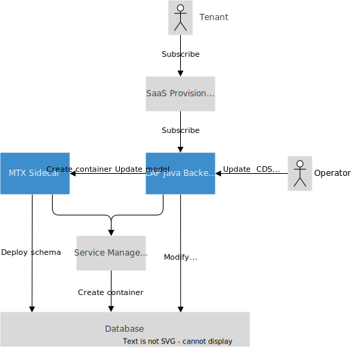
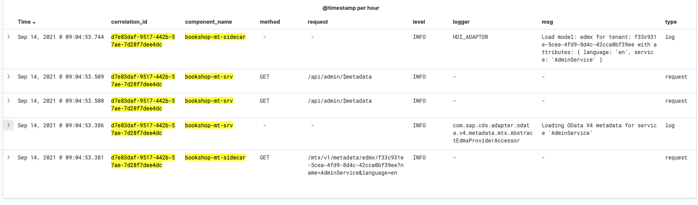

# Multitenancy (Classic) { #multitenancy-classic}

{{ $frontmatter.synopsis }}

::: warning
The multitenancy services (`@sap/cds-mtx`) described in this chapter are in maintenance mode and only supported until CAP Java 2.x.
If you start a new multitenancy project, it's highly recommended to make use of [Multitenancy](multitenancy) based on CAP Java 3.x and streamlined MTX (`@sap/cds-mtxs`).
:::

## Overview

For a general overview on this topic, see the [Multitenancy guide](../guides/multitenancy/?impl-variant=java).

In CAP Java, the Node.js based [*cds-mtx* module](../guides/multitenancy/?impl-variant=java) is reused to handle tenant provisioning. This reuse has the following implications:

- Java applications need to run and maintain the *cds-mtx* module as a sidecar application (called *MTX sidecar* in this documentation). The following sections describe the setup as a [Multitarget Application](https://help.sap.com/products/BTP/65de2977205c403bbc107264b8eccf4b/d04fc0e2ad894545aebfd7126384307c.html) using a [Multitarget Application Development Descriptor](https://help.sap.com/products/BTP/65de2977205c403bbc107264b8eccf4b/c2d31e70a86440a19e47ead0cb349fdb.html) (*mta.yaml*) file. It can be packaged by means of the [MTA Build Tool](https://sap.github.io/cloud-mta-build-tool) and deployed to the SAP BTP by means of the Deploy Service.
- Multitenant CAP Java applications automatically expose the tenant provisioning API called by the SaaS Provisioning service so that [custom logic during tenant provisioning](#custom-logic) can be written in Java.

The following figure describes the basic setup:



<!-- TODO: Where to put this information?
If you deploy your application to the cloud or configure your local environment in a way that this feature becomes active (hybrid scenario), it's important to know that client requests without user information, for example, provided by a token, are no longer possible. The reason for this is that the server needs to decide for which tenant to open the connection to the database.

To implement multitenancy support, the CAP Java SDK integrates with the multitenancy libraries `com.sap.cloud.mt.multi-tenant-runtime` and `com.sap.cloud.mt.multi-tenant-subscription`. -->

## Maven Dependencies

Multitenancy support is available as a so called optional [application feature](developing-applications/building#starter-bundles#application-features) of the CAP Java SDK. It's already included when you use the `cds-starter-cloudfoundry` dependency. Otherwise, you can add the following Maven dependency to apply the feature:

```xml
<dependency>
    <groupId>com.sap.cds</groupId>
    <artifactId>cds-feature-mt</artifactId>
</dependency>
```

::: tip
When you add this dependency to your project, it becomes active when certain conditions are fulfilled, for example, [when your application is deployed to SAP BTP](#required-services-mt). This condition check lets you test your application locally without multitenancy turned on.
:::

## Tenant Subscription Events { #custom-logic }

The [SaaS Provisioning service](https://help.sap.com/products/BTP/65de2977205c403bbc107264b8eccf4b/ed08c7dcb35d4082936c045e7d7b3ecd.html) (`saas-registry`) in SAP BTP sends [specific requests](https://help.sap.com/products/BTP/65de2977205c403bbc107264b8eccf4b/ff540477f5404e3da2a8ce23dcee602a.html) to applications when tenants are subscribed or unsubscribed. For these requests, the CAP Java SDK internally generates CAP events on the technical service [`MtSubscriptionService`](https://www.javadoc.io/doc/com.sap.cds/cds-feature-mt/latest/com/sap/cds/services/mt/MtSubscriptionService.html).

[For a general introduction to CAP events, see Service Provisioning API.](event-handlers/){.learn-more}

Register event handlers for the following CAP events to add custom logic for requests sent by the SaaS Provisioning service. Each event passes a special type of `EventContext` object to the event handler method and provides event-specific information:

| Event Name               | Event Context                                                                         | Use Case        |
| ------------------------ | ------------------------------------------------------------------------------------- | --------------- |
| `EVENT_SUBSCRIBE`        | [MtSubscribeEventContext](https://www.javadoc.io/doc/com.sap.cds/cds-feature-mt/latest/com/sap/cds/services/mt/MtSubscribeEventContext.html)             | Add a tenant    |
| `EVENT_UNSUBSCRIBE`      | [MtUnsubscribeEventContext](https://www.javadoc.io/doc/com.sap.cds/cds-feature-mt/latest/com/sap/cds/services/mt/MtUnsubscribeEventContext.html)         | Remove a tenant |
| `EVENT_GET_DEPENDENCIES` | [MtGetDependenciesEventContext](https://www.javadoc.io/doc/com.sap.cds/cds-feature-mt/latest/com/sap/cds/services/mt/MtGetDependenciesEventContext.html) | Dependencies    |

<div id="incustomlogic" />

You only need to register event handlers to override the default behavior.

Default behaviors:

- A new tenant-specific database container is created through the [Service Manager](https://help.sap.com/docs/SERVICEMANAGEMENT/09cc82baadc542a688176dce601398de/3a27b85a47fc4dff99184dd5bf181e14.html) during subscription.
- A tenant-specific database container *isn't* deleted during unsubscription.

The following sections describe how to register to these events in more detail.

## Subscribe Tenant

Subscription events are generated when a new tenant is added.
By default, subscription creates a new database container for a newly subscribed tenant.

### Synchronous Tenant Subscription

By default an `EVENT_SUBSCRIBE` event is sent when a tenant is added.

The following example shows how to register to this event:

```java
package com.sap.cds.demo.spring.handler;

import org.springframework.stereotype.Component;

import com.sap.cds.services.handler.EventHandler;
import com.sap.cds.services.handler.annotations.Before;
import com.sap.cds.services.handler.annotations.ServiceName;
import com.sap.cds.services.mt.MtSubscriptionService;
import com.sap.cds.services.mt.MtUnsubscribeEventContext;

@Component
@ServiceName(MtSubscriptionService.DEFAULT_NAME)
public class SubscriptionHandler implements EventHandler {

  @Before(event = MtSubscriptionService.EVENT_SUBSCRIBE)
  public void beforeSubscription(MtSubscribeEventContext context) {
      // Activities before tenant database container is created
  }

}
```
<!-- ***TODO Add JavaDoc for "instanceCreationOptions" -> Ask  Silvestre***  -->

To send notifications when a subscription was successful, you could register an `@After` handler:

```java
@After(event = MtSubscriptionService.EVENT_SUBSCRIBE)
public void afterSubscription(MtSubscribeEventContext context) {
    // For example, send notification, …
}
```

<span id="beforereturningdbid" />

### Returning a Database ID

When you've registered exactly one SAP HANA instance in your SAP BTP space, a new tenant-specific database container is created automatically. However, if you've registered more than one SAP HANA instance in your SAP BTP space, you have to pass the target database ID for the new database container in a customer handler, as illustrated in the following example:

```java
@Before(event = MtSubscriptionService.EVENT_SUBSCRIBE)
public void beforeSubscription(MtSubscribeEventContext context) {
    context.setInstanceCreationOptions(
      new InstanceCreationOptions().withProvisioningParameters(
        Collections.singletonMap("database_id", "<database ID>")));
}
```

### Returning a Custom Application URL

The following example shows how to return a custom application URL that is shown in SAP BTP Cockpit:

```java
@After(event = MtSubscriptionService.EVENT_SUBSCRIBE)
public void afterSubscribe(MtSubscribeEventContext context) {
    if (context.getResult() == null) {
        context.setResult(
          "https://" +
          context.getSubscriptionPayload().subscribedSubdomain +
          ".myapp.com");
    }
}
```

By default, the application URL is constructed by configuration as described in [Wiring It Up](#binding-it-together).

### Returning Dependencies

The event `EVENT_GET_DEPENDENCIES` fires when the SaaS Provisioning calls the [`getDependencies` callback](https://help.sap.com/products/BTP/65de2977205c403bbc107264b8eccf4b/ff540477f5404e3da2a8ce23dcee602a.html). Hence, if your application consumes any reuse services provided by SAP, you must implement the `EVENT_GET_DEPENDENCIES` to return the service dependencies of the application. The callback must return a `200` response code and a JSON file with the dependent services' `appName` and `appId`, or just the `xsappname`.

::: tip
The `xsappname` of an SAP reuse service that is bound to your application can be found as part of the `VCAP_SERVICES` JSON structure under the path `VCAP_SERVICES.<service>.credentials.xsappname`.
:::

The following example shows this in more detail:

```java
import com.sap.cloud.mt.subscription.json.ApplicationDependency;

@Value("${vcap.services.<my-service-instance>.credentials.xsappname}")
private String xsappname;

@On(event = MtSubscriptionService.EVENT_GET_DEPENDENCIES)
public void onGetDependencies(MtGetDependenciesEventContext context) {
    ApplicationDependency dependency = new ApplicationDependency();
    dependency.xsappname = xsappname;
    List<ApplicationDependency> dependencies = new ArrayList<>();
    dependencies.add(dependency);
    context.setResult(dependencies);
}
```

## Unsubscribe Tenant

Unsubscription events are generated, when a tenant is offboarded. By default, the tenant-specific database container is *not* deleted during offboarding. You can change this behavior by registering a custom event handler as illustrated in the following examples.

### Synchronous Tenant Unsubscription

By default an `EVENT_UNSUBSCRIBE` is sent when a tenant is removed. The following example shows how to add custom logic for this event:

```java
@Before(event = MtSubscriptionService.EVENT_UNSUBSCRIBE)
public void beforeUnsubscribe(MtUnsubscribeEventContext context) {
    // Activities before offboarding
}
```

You can also register an `@After` handler, for example to notify when removal is finished:

```java
@After(event = MtSubscriptionService.EVENT_UNSUBSCRIBE)
public void afterUnsubscribe(MtUnsubscribeEventContext context) {
    // Notify offboarding finished
}
```

<span id="beforedeletingcontainer" />

### Deleting Tenant Containers During Tenant Unsubscription

By default, tenant-specific database containers aren't deleted during removal. However, you can register a customer handler change this behavior. For example:

```java
@Before(event = MtSubscriptionService.EVENT_UNSUBSCRIBE)
public void beforeUnsubscribe(MtUnsubscribeEventContext context) {
    // Trigger deletion of database container of offboarded tenant
    context.setDelete(true);
}
```

## Configuring the Required Services { #required-services-mt}

To enable multitenancy on SAP BTP, three services are involved:

- XSUAA
- Service Manager
- SaaS Provisioning service (`saas-registry`)

Only when these services are bound to your application, the multitenancy feature is turned on. You can either create and configure these services manually. See section [Developing Multitenant Applications in SAP BTP, Cloud Foundry Environment](https://help.sap.com/products/BTP/65de2977205c403bbc107264b8eccf4b/5e8a2b74e4f2442b8257c850ed912f48.html) for more details. The following sections describe how to configure and bind these services by means of an *mta.yaml* file.

### XSUAA { #xsuaa-mt-configuration }

A special configuration of an XSUAA service instance is required to enable authorization between the SaaS Provisioning service, CAP Java application, and MTX sidecar.

The service can be configured in the *mta.yaml* by adding an `xsuaa` resource as follows:

```yaml
resources:
  […]
  - name: xsuaa
    type: com.sap.xs.uaa
    parameters:
      service-plan: application
      path: ./xs-security.json
      config:
        xsappname: <appname>
```

Choose a value for property `xsappname` that is unique globally.

Also, you have to create an [Application Security Descriptor (*xs-security.json*)](https://help.sap.com/products/BTP/65de2977205c403bbc107264b8eccf4b/517895a9612241259d6941dbf9ad81cb.html) file, which must include two scopes:

- `mtcallback`
- `mtdeployment`

> You can also use custom scope names by configuring them. Use the following application configuration properties:
>
> - mtcallback: `cds.multitenancy.security.subscription-scope`
> - mtdeployment: `cds.multitenancy.security.deployment-scope`

The `mtcallback` scope is required by the onboarding process. The `mtdeployment` scope is required to redeploy database artifacts at runtime.

An example *xs-security.json* file looks like this:

```json
{
    "xsappname": "<appname>",
    "tenant-mode": "shared",
    "scopes": [
        {
            "name": "$XSAPPNAME.mtcallback",
            "description": "Multi Tenancy Callback Access",
            "grant-as-authority-to-apps": [
                "$XSAPPNAME(application, sap-provisioning, tenant-onboarding)"
            ]
        },
        {
            "name": "$XSAPPNAME.mtdeployment",
            "description": "Scope to trigger a re-deployment of the database artifacts"
        }
    ],
    "authorities": [
        "$XSAPPNAME.mtdeployment"
    ]
}
```

In this example, the `grant-as-authority-to-apps` section is used to grant the `mtcallback` scope to the applications *sap-provisioning* and *tenant-onboarding*. These are services provided by SAP BTP involved in the onboarding process.

It isn't necessary to have the security configuration in a separate file. It can also be added to the *mta.yaml* file directly.

::: warning *❗ Warning*
The `mtcallback` and `mtdeployment` scopes **must not be exposed** to any business user, for example, using a role template. Else a malicious user could update or even delete the artifacts of arbitrary tenants. In addition, if you implement a service broker in order to expose your service API for (technical) users of SaaS tenants, you must ensure that both scopes **cannot be consumed as authorities** in cloned service instances created by clients. To achieve that, set  `authorities-inheritance: false`. It is **strongly recommended** to explicitly enumerate all authorities that should be exposed in the the broker configuration (allow-list).
:::

### Service Manager

A service instance of the [Service Manager](https://help.sap.com/docs/SERVICEMANAGEMENT/09cc82baadc542a688176dce601398de/3a27b85a47fc4dff99184dd5bf181e14.html) (`service-manager`) is required that the CAP Java SDK can create database containers per tenant at application runtime. It doesn't require special parameters and can be added as a resource in *mta.yaml* as follows:

```yaml
resources:
  […]
  - name: service-manager
    type: org.cloudfoundry.managed-service
    parameters:
      service: service-manager
      service-plan: container
```

### SaaS Provisioning Service (saas-registry) { #saas-registry }

A `saas-registry` service instance is required to make your application known to the SAP BTP Provisioning Service and to register the endpoints that should be called when tenants are added or removed. The service can be configured as a resource in *mta.yaml* as follows. See section [Register the Multitenant Application to the SaaS Provisioning Service](https://help.sap.com/products/BTP/65de2977205c403bbc107264b8eccf4b/3971151ba22e4faa9b245943feecea54.html) for more details.

```yaml
resources:
  […]
  - name: saas-registry
    type: org.cloudfoundry.managed-service
    parameters:
      service: saas-registry
      service-plan: application
      config:
        appName: <app display name>
        xsappname: <appname>
        appUrls:
          getDependencies: ~{srv/url}/mt/v1.0/subscriptions/dependencies
          onSubscription: ~{srv/url}/mt/v1.0/subscriptions/tenants/{tenantId}
    requires:
      - name: srv
```

It's required to configure the parameters:

- `appName`: Choose an appropriate application display name.
- `xsappname`: Use the value for `xsappname` you configured at your [UAA service instance](#xsuaa-mt-configuration).
- `appUrls`: Configure the callback URLs used by the SaaS Provisioning service to get the dependencies of the application and to trigger a subscription. In the above example, the property `~{srv/url}` that is provided by the `srv` module is used. See section [Wiring It Up](#binding-it-together) for more details. If you use different module and property names for your CAP Java backend module, you have to adapt these properties here accordingly.

## Adding the MTX Sidecar Application { #mtx-sidecar-server }

This section describes how to use the `cds-mtx` Node.js module and add the MTX sidecar microservice to the *mta.yaml* file.

In a dedicated project subfolder named *mtx-sidecar*, create a Node.js start script in a file named *server.js* to bootstrap the `cds-mtx` library:

```js
const app = require('express')();
const cds = require('@sap/cds');

const main = async () => {
 await cds.connect.to('db');
 const PORT = process.env.PORT || 4004;
 await cds.mtx.in(app);
 app.listen(PORT);
}

main();
```

::: tip
By default, this script implements authorization and checks for the scope `mtcallback`. If you use a custom scope name for requests issued by the SaaS Provisioning Service in your application security descriptor (*xs-security.json*), you have to configure the custom scope name at the MTX sidecar as well. Use the environment variable `CDS_MULTITENANCY_SECURITY_SUBSCRIPTIONSCOPE`, for example, by specifying it in the *mta.yaml* file.
:::

To define the dependencies and start command, also create a file *package.json* like this:

```json
{
    "name": "deploy",
    "engines": {
        "node": ">=12"
    },
    "scripts": {
        "start": "node server.js"
    }
}
```

Next, add the required dependencies:

```sh
npm add @sap/cds @sap/cds-mtx @sap/xssec hdb express
```

Because the MTX sidecar will build the CDS model, you need to configure the build by means of two *.cdsrc.json* files.

The first *.cdsrc.json* file goes into the root folder of your project and specifies from which location the CDS files should be collected. The following example demonstrates this:

```json
{
    "build": {
        "target": ".",
        "tasks": [
            {
                "for": "java-cf"
            },
            {
                "for": "mtx",
                "src": ".",
                "dest": "mtx-sidecar"
            },
            {
                "for": "hana"
            }
        ]
    },
    "requires": {
        "db": {
            "kind": "hana-mt"
        }
    },
    "odata": {
        "version": "v4"
    }
}
```

::: tip
You only need to change this configuration if you named your project folders, `app`, `db`, `srv`, and `mtx-sidecar` differently.
:::

A detailed description of this configuration file can be found in section [Build Configuration](../guides/deployment/custom-builds#build-config). In the following, you find a short summary of this example:

The `build` section defines the build `tasks` that should be executed. Three build tasks are defined in this example:

| Task      | Description                                                                     |
| --------- | ------------------------------------------------------------------------------- |
| `java-cf` | Generates *csn.json* and EDMX files                                             |
| `mtx`     | Collects *.cds* files to copy to *mtx-sidecar* directory, generates *i18n.json* |
| `hana`    | Generates SAP HANA artifacts                                                    |

In the previous example, the `options` section specifies the source directories for each build task. <!-- The other parameters specify technical details, like the OData version and the format of the SAP HANA artifacts. The `requires` section serves only as a marker for the *cds* tool. -->

::: tip
The `hana` build task is optional because the SAP HANA artifacts are also generated by the *mtx-sidecar* directly. However, the generated SAP HANA artifacts enable you to test your application in a single tenant scenario.
:::

The second *.cdsrc.json* file goes into the *mtx-sidecar* directory. The following example demonstrates this:

```json
{
    "hana": {
        "deploy-format": "hdbtable"
    },
    "build": {
        "tasks": [
            {
                "for": "hana"
            },
            {
                "for": "java-cf"
            }
        ]
    },
    "odata": {
        "version": "v4"
    },
    "requires": {
        "db": {
            "kind": "hana-mt",
        },
        "auth": {
            "kind": "xsuaa"
        },
        "multitenancy": true
    }
}
```

::: tip
You only need to change this configuration if you named your project folders, `app`, `db`, `srv`, and `mtx-sidecar` differently.
:::

::: warning
If you have configured a location for your i18n files as described in the [Localization Section](../guides/i18n#where-to-place-text-bundles), please make sure to add the same CDS configuration in both, the *.cdsrc.json* of the SaaS application and in the *.cdsrc.json* of the `mtx-sidecar`.
:::

In this file, the `requires` section configures the service instances that should be used by the *mtx-sidecar*. In this case, it's an instance of the UAA Service, to enable authentication and authorization, as well as the Service Manager, that enables multitenancy.

Now, add the `mtx-sidecar` module to your *mta.yaml* file:

```yaml
modules:
  […]
  - name: mtx-sidecar
    type: nodejs
    path: mtx-sidecar
    parameters:
      memory: 256M
      disk-quota: 512M
    requires:
      - name: xsuaa
      - name: service-manager
    provides:
      - name: mtx-sidecar
        properties:
          url: ${default-url}
```

The `mtx-sidecar` module requires the XSUAA and Service Manager services. Also you need to provide its URL to be able to configure the URL in the service module as shown in the previous *mta.yaml*. The authentication works through token validation.

<span id="beforebindingittogehter" />

## Wiring It Up { #binding-it-together }

To bind the previously mentioned services and the MTX sidecar to your CAP Java application, you could use the following example of the `srv` module in the *mta.yaml* file:

```yaml
modules:
  […]
  - name: srv
    type: java
    path: srv
    parameters:
      […]
    requires:
      - name: service-manager
      - name: xsuaa
      - name: mtx-sidecar
        properties:
          CDS_MULTITENANCY_SIDECAR_URL: ~{url}
      - name: app
        properties:
          CDS_MULTITENANCY_APPUI_URL: ~{url}
          CDS_MULTITENANCY_APPUI_TENANTSEPARATOR: "."
    provides:
      - name: srv
        properties:
          url: '${default-url}'
```

The environment variable `CDS_MULTITENANCY_SIDECAR_URL` of the `srv` module is internally mapped to property `cds.multitenancy.sidecar.url`. This URL is required by the runtime to connect to the [MTX Sidecar application](#mtx-sidecar-server) and it's derived from property `url` of the mtx-sidecar [module](#mtx-sidecar-server) (Note that `${default-url}` is a placeholder for the own URL).
Similarly, `CDS_MULTITENANCY_APPUI_URL` configures the URL that is shown in the SAP BTP Cockpit. Usually it's pointing to the app providing the UI, which is the module `app` in this example.

As value for `CDS_MULTITENANCY_APPUI_TENANTSEPARATOR` only `"."` is supported at the moment. The actual URL shown in the SAP BTP Cockpit is then composed of:

```txt
https://<subaccount subdomain>.<CDS_MULTITENANCY_APPUI_URL>
```

<div id="beforeapplogsupport" />

## Adding Logging Service Support { #app-log-support }

Logging service support gives you the capability to observe properly correlated requests between the different components of your CAP application in Kibana. This is especially useful for `multi-tenant aware applications` that use the `MTX sidecar`.

As described in the section [Observability > Logging](./operating-applications/observability#logging-service), in order to enable the Cloud Foundry `application-logs` service support with CAP Java SDK, it's recommended to use the [cf-java-logging-support](https://github.com/SAP/cf-java-logging-support). Information about configuration options is provided there, as well.

### Adding the Service Bindings

Aside from that, a service binding to the `application-logs` service in the Cloud Foundry environment is required. This can be set up manually with the SAP BTP cockpit for both, the CAP application and the MTX sidecar, or more easily with an `mta` deployment.

The *mta.yaml* file needs a new resource definition for the `application-logs` service which is required by both the `srv` module of the CAP Java application and the `mtx-sidecar` module. Building and deploying from this manifest then creates the necessary `application-logs` service instance if not existing yet and the `service bindings`:

```yaml
modules:
  […]
  - name: srv
    type: java
    path: srv
    parameters:
      […]
    requires:
      […]
      - name: cf-logging
      […]
    provides:
      - name: srv
        properties:
          url: '${default-url}'
  […]
  - name: sidecar
    type: nodejs
    path: mtx-sidecar
    parameters:
      […]
    requires:
      […]
      - name: cf-logging
      […]
    provides:
      - name: sidecar
        properties:
          url: ${default-url}
  […]
resources:
  […]
  - name: cf-logging
    type: org.cloudfoundry.managed-service
    parameters:
      service: application-logs
      service-plan: lite
  […]
```

::: tip
In our example, we use the service-plan `lite` of the `application-logs` service, but you might require one with larger quota limits.
:::

::: tip
Complete examples for *mta.yaml* files can be found in the [CAP Java bookshop samples](https://github.com/SAP-samples/cloud-cap-samples-java/).
:::

### Configuring the MTX Sidecar Application

To properly correlate requests in the `mtx-sidecar`, a `correlate()` function needs to be added to the `Express` app that acts as a middleware that either reads the `correlation id` from the request headers if provided or generates a new one if not.

One way to do so, is to modify the Node.js start script `server.js`, that was introduced in [Adding the MTX Sidecar Application](#mtx-sidecar-server), as follows:

```js
const app = require('express')();
const cds = require('@sap/cds');

const main = async () => {
  app.use(defaults.correlate);

  await cds.connect.to('db');
  const PORT = process.env.PORT || 4004;

  await cds.mtx.in(app);
  app.listen(PORT);
}

const defaults = {
  get correlate() {
    return (req, res, next) => {
      const id = req.headers['x-correlation-id'] || req.headers['x-correlationid']
        || req.headers['x-request-id'] || req.headers['x-vcap-request-id']
        || cds.utils.uuid()
      // new intermediate cds.context, if necessary
      cds.context = { id }
      // guarantee x-correlation-id going forward and set on res
      req.headers['x-correlation-id'] = id
      res.set('x-correlation-id', id)
      // guaranteed access to cds.context._.req -> REVISIT
      if (!cds.context._) cds.context._ = {}
      if (!cds.context._.req) cds.context._.req = req
      next()
    }
  }
}

main();
```

The final piece of configuration required for the MTX sidecar is to enable the Kibana formatter feature.

The following object literal needs be added to the json object within the *package.json* file in the *mtx-sidecar* subfolder of your CAP Java application:

```json
"cds": {
    "features": {
        "kibana_formatter": true
    }
}
```

::: tip
For the Kibana formatter feature it is recommended to use *@sap/cds* in version *5.4.3 or higher*, *@sap/cds-mtx* in version *2.2.0 or higher* and *node* in version *16.2.0 or higher*.
:::

### Correlated Application Logs

With a successful deployment of the CAP application with all the previously mentioned configuration in place, application logs from both, the `srv` and `mtx sidecar` modules, will be properly correlated by their `correlation id`.

This can easily be seen in `Kibana`, which is part of the ELK (*Elasticsearch/Logstash/Kibana*) stack on Cloud Foundry and available by default with the `application-logs` service:



<span id="beforedatabaseupdate" />

## Database Schema Update { #database-update }

When shipping a new application version with an updated CDS model, the database schema for each subscribed tenant needs an update. The database schema update needs to be triggered explicitly, as described in the following sections.

When the database schema update is triggered, the following CAP events are sent. By registering custom handlers for these events, you can add custom logic to influence the deployment process. By default, the CAP Java SDK notifies the *MTX Sidecar* to perform any schema upgrade if necessary.

| Event Name                  | Event Context                                                                             |
| --------------------------- | ----------------------------------------------------------------------------------------- |
| `EVENT_ASYNC_DEPLOY`        | [MtAsyncDeployEventContext](https://www.javadoc.io/doc/com.sap.cds/cds-feature-mt/latest/com/sap/cds/services/mt/MtAsyncDeployEventContext.html)             |
| `EVENT_ASYNC_DEPLOY_STATUS` | [MtAsyncDeployStatusEventContext](https://www.javadoc.io/doc/com.sap.cds/cds-feature-mt/latest/com/sap/cds/services/mt/MtAsyncDeployStatusEventContext.html) |

<!-- TODO: At least link to a section where we describe this! -->
It's often desired to update the whole service in a zero downtime manner. This section doesn't deal with the details about updating a service productively, but describes tool support the CAP Java SDK offers to update database schemas.

The following sections describe how to trigger the database schema upgrade for tenants.

### Deploy Endpoint { #deploy-endpoint }

When multitenancy is configured, the CAP Java SDK exposes a REST endpoint to update database schemata.

::: warning *❗ Warning*
You must use the scope `mtdeployment` for the following requests!
:::

#### Deployment Request

Send this request when a new version of your application with an updated database schema was deployed. This call triggers updating the persistence of each tenant.

##### Route

```http
POST /mt/v1.0/subscriptions/deploy/async
```

::: tip
This is the default endpoint. One or more endpoints might differ if you configure different endpoints through properties.
:::

##### Body

The `POST` request must contain the following body:

```json
{
  "tenants": [ "all" ]
}
```

Alternatively, you can also update single tenants:

```json
{
  "tenants": ["<tenant-id-1>", "<tenant-id-2>", …]
}
```

##### Response

The deploy endpoint is asynchronous, so it returns immediately with status code `202` and JSON structure containing a `jobID` value:

```json
{
  "jobID": "<jobID>"
}
```

#### Job Status Request

You can use this `jobID` to check the progress of the operation by means of the following REST endpoint:

##### Route

```http
GET /mt/v1.0/subscriptions/deploy/async/status/<jobID> HTTP/1.1
```

##### Response

The server responds with status code `200`. During processing, the response looks like:

```json
{
  "error": null,
  "status": "RUNNING",
  "result": null
}
```

Once a job is finished, the collective status is reported like this:

```json
{
  "error": null,
  "status": "FINISHED",
  "result": {
      "tenants": {
          "<tenantId1>": {
              "status": "SUCCESS",
              "message": "",
              "buildLogs": "<build logs>"
          },
          "<tenantId2>": {
              "status": "FAILURE",
              "message": "<error log output>",
              "buildLogs": "<build logs>"
          }
      }
  }
}
```

::: tip
Logs are persisted for a period of 30 minutes before they get deleted automatically. If you're requesting the job status after the 30-minute period expired, you get a *404 Not Found* response.
:::

<!-- TODO: Marcel: How would you call these endpoints with that scope with e.g. Postman? -->

### Deploy Main Method

As an alternative to calling the [deploy REST endpoints](#deploy-endpoint), the CAP Java SDK also offers a `main` method in the class `com.sap.cds.framework.spring.utils.Deploy` that can be called from the command line while the CAP Java application is still stopped. This way, you can run the database deployment for all tenants before you start a new version of the Java application. This prevents new application code to access database artifacts that aren't yet deployed.

::: warning
While the CAP Java backend might be stopped when you call this method, the *MTX Sidecar* application must be running!
:::

<div id="afterdeploymainmethod" />

This synchronization can also be automated, for example using [Cloud Foundry Tasks](https://docs.cloudfoundry.org/devguide/using-tasks.html) on SAP BTP and [Module Hooks](https://help.sap.com/products/BTP/65de2977205c403bbc107264b8eccf4b/b9245ba90aa14681a416065df8e8c593.html) in your MTA.

The `main` method takes an optional list of tenant IDs as input arguments. If tenant IDs are specified, only these tenants are updated. If no input parameters are specified, all tenants are updated. The method waits until all deployments are finished and then prints the result.

The method returns the following exit codes

| Exit Code | Result                                                                                           |
| --------- | ------------------------------------------------------------------------------------------------ |
| 0         | All tenants updated successfully.                                                                |
| 1         | Failed to update at least one tenant. Re-run the procedure to make sure that all tenants are updated. |

To run this method locally, use the following command where `<jar-file>` is the one of your application:

::: code-group

```sh [&gt;= Spring Boot 3.2.0]
java -cp <jar-file> -Dloader.main=com.sap.cds.framework.spring.utils.Deploy org.springframework.boot.loader.launch.PropertiesLauncher [<tenant 1>] … [<tenant n>]
```

```sh [&lt; Spring Boot 3.2.0]
java -cp <jar-file> -Dloader.main=com.sap.cds.framework.spring.utils.Deploy org.springframework.boot.loader.PropertiesLauncher [<tenant 1>] … [<tenant n>]
```

:::

In the SAP BTP, Cloud Foundry environment it can be tricky to construct such a command. The reason is, that the JAR file is extracted by the Java Buildpack and the place of the Java executable isn't easy to determine. Also the place differs for different Java versions. Therefore, we recommend to adapt the start command that is generated by the buildpack and run the adapted command:

::: code-group

```sh [&gt;= Spring Boot 3.2.0]
sed -i 's/org.springframework.boot.loader.launch.JarLauncher/org.springframework.boot.loader.launch.PropertiesLauncher/g' /home/vcap/staging_info.yml && sed -i 's/-Dsun.net.inetaddr.negative.ttl=0/-Dsun.net.inetaddr.negative.ttl=0 -Dloader.main=com.sap.cds.framework.spring.utils.Deploy/g' /home/vcap/staging_info.yml && jq -r .start_command /home/vcap/staging_info.yml | bash
```

```sh [&lt; Spring Boot 3.2.0]
sed -i 's/org.springframework.boot.loader.JarLauncher/org.springframework.boot.loader.PropertiesLauncher/g' /home/vcap/staging_info.yml && sed -i 's/-Dsun.net.inetaddr.negative.ttl=0/-Dsun.net.inetaddr.negative.ttl=0 -Dloader.main=com.sap.cds.framework.spring.utils.Deploy/g' /home/vcap/staging_info.yml && jq -r .start_command /home/vcap/staging_info.yml | bash
```

```sh [Java 8]
sed -i 's/org.springframework.boot.loader.JarLauncher/-Dloader.main=com.sap.cds.framework.spring.utils.Deploy org.springframework.boot.loader.PropertiesLauncher/g' /home/vcap/staging_info.yml && jq -r .start_command /home/vcap/staging_info.yml | bash
```

:::

## Developing Multitenant CAP Applications

### Local Development

A multitenant CAP application can still be started and tested locally, for example with SQLite. In this case,
the CAP Java SDK simply disables the multitenancy feature (as there is no Service Manager service binding present) to enable local testing of the general business logic.

Another option is to access cloud services from the local development machine (hybrid scenario). You can decide whether you want to access just one fixed SAP HANA service binding or access all available SAP HANA service bindings that were created through the Service Manager binding, which is described by the following sections.

#### Static SAP HANA Binding

For the static case, just copy the credentials of the SAP HANA service binding you want to use into the *default-env.json*. You can, for example, see all application-managed service instances in the SAP BTP Cockpit. The app behaves like in the single tenant case.

#### Service Manager Binding

If you want to test multitenancy locally, just copy the complete Service Manager binding into the *default-env.json*. If you have extensibility enabled, you also need to set the property `cds.multitenancy.sidecar.url` to the URL of the deployed MTX sidecar app. Now you can access the data of different tenants locally, if user information is set for the requests to your locally running server.

You can locally authenticate at your app either through mock users or the UAA.

The configuration of mock users is described in section [Security](./security). For a mock user, you can also set the `tenant` property. The value needs to be the subaccount ID, which can be found in SAP BTP Cockpit in the *Subaccount* details. You can then authenticate at your app using basic authentication. If you already secured your services, the browser asks you automatically for credentials. Otherwise, you can also set username and password explicitly, for example, in Postman.

If you want to authenticate using the XSUAA, just copy the XSUAA service binding into the *default-env.json*. You then need to have a valid token for the tenant to authenticate. This can be obtained through client-credential-flow, for example, using Postman.

::: warning *❗ Warning*
Requests without user information fail!
:::

::: tip
Currently you need to push the changes to Cloud Foundry, to update the database artifacts. If you're working on the data model, it's recommended to use a static SAP HANA binding.
:::

### Accessing Arbitrary Tenants

You can override the tenant ID that is set in the current `RequestContext`. This enables accessing data of arbitrary tenants programmatically. This might be useful for example:

- To access configuration data stored by means of a "technical" tenant while processing the request of a business tenant.
- To access tenant data in asynchronously scheduled jobs, where no tenant information is present in the `RequestContext`, yet (for example, a startup task prefilling tables of tenants with certain data).

You can use the [`TenantProviderService`](https://javadoc.io/doc/com.sap.cds/cds-services-api/latest/com/sap/cds/services/mt/TenantProviderService.html) to get a list of available tenants. You can set a particular tenant and access it by running your code in [nested `RequestContext`](event-handlers/request-contexts#defining-requestcontext) as demonstrated by the following example:

```java
TenantProviderService tenantProvider = runtime.getServiceCatalog()
  .getService(TenantProviderService.class, TenantProviderService.DEFAULT_NAME);
List<String> tenants = tenantProvider.readTenants();
tenants.forEach(tenant -> {
  runtime.requestContext().privilegedUser().modifyUser(user -> user.setTenant(tenant)).run(context -> {
    // ... your code
  });
});
```

::: warning *❗ Warning*
If an application overrides the default behavior of the CAP Java SDK this way, it's responsible of ensuring data privacy and isolation!
:::

### Data Source Pooling Configuration

> Pretty much everything in this section depends on your modeling, the load, and also on the sizing (JVM/DB). As there's no one-size-fits-all recommendation, the mentioned configuration parameters are a good starting point.

Data source pool configuration is a tradeoff between resources and latency:

##### Pool per tenant - less latency, more resources

The dedicated pools per tenant approach creates a dedicated connection pool for each tenant. In it's default
configuration this strategy uses a static sizing approach: the number of configured connections (defaults to 10) is
opened on startup of the application and kept open. This has the lowest possible latency and the highest resource
consumption. The application will need a static number of connections per subscribed client. In case you need
low latency but a bit less resource consumption you can [configure dynamic pool sizing](#configure-data-pools) for your tenants'
connection pools. Then the application will need at least the minimum number of connections per subscribed clients. Depending
on the concurrent load the number can increase per client until the configured maximum number of connections is reached.

##### Pool per database - less resources, more latency { #combine-data-pools}

The combined pool approach uses only one pool for all tenants holding a fixed number of connections. This approach, however, needs to switch
connections to the correct schema and user of the tenant, before handing out the connection. This causes some additional latency compared to
the pools per tenant, where a connection, once opened for a given schema and user, can be reused until it's retired. For the combined pool
you can, as for the dedicated pools, decide between static sizing (the default) and [dynamic sizing](#configure-data-pools). For the latter the
resource consumption can be even more reduced while adding a bit more latency because new database connections might be opened
upon incoming requests.

In order to activate the combined pool approach set the property `cds.multiTenancy.datasource.combinePools.enabled = true`.

::: warning *❗ Warning*
Since the pool is shared among all tenants, one tenant could eat up all available connections, either intentionally or by accident. Applications using combined pools need to take adequate measures to mitigate this risk, for example by introducing rate-limiting.
:::

#### Dynamic Data Source Pooling { #configure-data-pools}

If not configured differently both, the dedicated pool and the combined pool approaches use static sizing strategies by default.

The connections are kept open regardless of whether the application is currently serving requests for the given tenant. If you expect a low
number of tenants, this shouldn't be an issue. With a large number of active tenants, this might lead to resource problems, for example, too
many database connections or out-of-memory situations.

Once you have an increased number of tenants, or run short of connections on the database side, you need to adjust the
[configuration of the CDS datasource](./cqn-services/persistence-services#datasource-configuration) for HikariCP as described in the following section. We're using three parameters for the configuration:

- `cds.dataSource.<service-instance>.hikari.minimum-idle`
- `cds.dataSource.<service-instance>.hikari.maximum-pool-size`
- `cds.dataSource.<service-instance>.hikari.idle-timeout`

Keep in mind that `<service-instance>` is the placeholder for the service manager instance bound to your CAP Java application.

|Parameter           |Description  |
|--------------------|-------------|
|`minimum-idle`      | The minimum number of connections kept in the pool after being considered as idle. This helps to adjust the usage of resources to the actual load of a given tenant at runtime. In order to save resources (Java heap and DB connections), this value should be kept rather small (for example `1`). |
|`maximum-pool-size` | The maximum number of connections in the pool. Here, the value needs to be balanced. Counter-intuitively a bigger value doesn't necessarily lead to higher response/time or throughput. Closely monitor your application under load in order to find a good value. As a starting point you can just leave the default value `10`. |
|`idle-timeout`      | The time span after which a connection is considered as *idle*. It controls how fast the size of the pool is adjusted to the load of the application, until `minimum-idle` is reached. Keep in mind that opening a connection comes at a latency cost, too. Don't retire connections too soon.  |

See section [Multitenancy Configuration Properties](#mtx-properties) for more details.

## Multitenancy Configuration Properties { #mtx-properties }

A number of multitenancy settings can be configured through application configuration properties. See section [Application Configuration](./developing-applications/configuring#profiles-and-properties) for more details. All properties can be found in the [properties overview](./developing-applications/properties#cds-multiTenancy). The prefix for multitenancy-related settings is `cds.multitenancy`.

<span id="aftermtxpropertis" />
