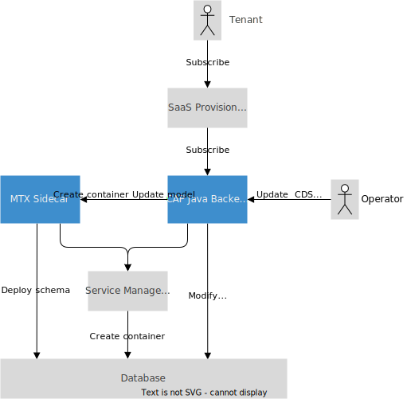

# Multitenancy { #multitenancy}

{{ $frontmatter.synopsis }}

## Setup Overview

This chapter describes how CAP Java applications can deal with multiple business tenants.
To add multitenancy flavour seamlessly, the CAP Java backend can be enriched with CAP multitenancy services as described in detail in general [Multitenancy](../guides/multitenancy/?impl-variant=java) guide.

The overall setup is sketched in the following figure:



The **MTX sidecar** services provide basic functionality such as:

- Deploying or undeploying database containers during subscription or unsubscription of business tenants.
- Managing CDS model [extensions](../guides/extensibility/customization#extending-saas-applications) for tenants.
- Managing CDS models for [feature toggles](../guides/extensibility/feature-toggles#feature-toggles).

There are different web adapters available in the Java backend to integrate with **platform services for tenant lifecycle** such as:

- SAP BTP [SaaS Provisioning service](https://help.sap.com/products/BTP/65de2977205c403bbc107264b8eccf4b/ed08c7dcb35d4082936c045e7d7b3ecd.html) for XSUAA tenants
- SAP BTP Subscription Manager Service for IAS tenants.

This chapter describes the APIs available in the **Java backend**, most notably the technical [DeploymentService](#custom-logic),
which can be used to add custom handlers that influence or react on subscription or unsubscription events

## React on Tenant Events { #custom-logic }

CAP Java can automatically react on tenant lifecycle events sent by platform services such as [SaaS Provisioning service](https://help.sap.com/products/BTP/65de2977205c403bbc107264b8eccf4b/ed08c7dcb35d4082936c045e7d7b3ecd.html).
For these requests, CAP Java internally generates CAP events on the technical service [`DeploymentService`](https://www.javadoc.io/doc/com.sap.cds/cds-services-api/latest/com/sap/cds/services/mt/DeploymentService.html).

[For a general introduction to CAP events, see Event Handlers.](../java/event-handlers/){.learn-more}

Register event handlers for the following CAP events to add custom logic for requests sent by the platform service.
Each event passes a special type of `EventContext` object to the event handler method and provides event-specific information:

| Event Name       | Event Context                                                                  | Use Case        |
| -----------------| -------------------------------------------------------------------------------| --------------- |
| `SUBSCRIBE`      | [SubscribeEventContext](https://www.javadoc.io/doc/com.sap.cds/cds-services-api/latest/com/sap/cds/services/mt/SubscribeEventContext.html)         | Add a tenant    |
| `UNSUBSCRIBE`    | [UnsubscribeEventContext](https://www.javadoc.io/doc/com.sap.cds/cds-services-api/latest/com/sap/cds/services/mt/UnsubscribeEventContext.html)     | Remove a tenant |
| `DEPENDENCIES`   | [DependenciesEventContext](https://www.javadoc.io/doc/com.sap.cds/cds-services-api/latest/com/sap/cds/services/mt/DependenciesEventContext.html)   | Dependencies    |

You only need to register event handlers to override the default behavior.

Default behaviors:

- A new tenant-specific database container is created through the [Service Manager](https://help.sap.com/docs/SERVICEMANAGEMENT/09cc82baadc542a688176dce601398de/3a27b85a47fc4dff99184dd5bf181e14.html) during subscription.
- The tenant-specific database container _is deleted_ during unsubscription.

The following sections describe how to register to these events in more detail.

### Subscribe Tenant

Subscription events are generated when a new tenant is added.
By default, subscription creates a new database container for a newly subscribed tenant. This happens during the `@On` phase of the `SUBSCRIBE` event.
You can add additional `@On` handlers to perform additional subscription steps. Note that these `@On` handlers should not call `setCompleted()`, as the event processing is auto-completed.

The following examples show how to register custom handlers for the `SUBSCRIBE` event:

```java
@Before
public void beforeSubscription(SubscribeEventContext context) {
    // Activities before tenant database container is created
}

@After
public void afterSubscribe(SubscribeEventContext context) {
    // For example, send notification, ...
}
```

#### Defining a Database ID

When you've registered exactly one SAP HANA instance in your SAP BTP space, a new tenant-specific database container is created automatically.
However, if you've registered more than one SAP HANA instance in your SAP BTP space, you have to pass the target database ID for the new database container in a customer handler, as illustrated in the following example:

```java
@Before
public void beforeSubscription(SubscribeEventContext context) {
    context.getOptions().put("provisioningParameters",
        Collections.singletonMap("database_id", "<database ID>"));
}
```

### Unsubscribe Tenant

By default, the tenant-specific database container _is deleted_ during offboarding. This happens during the `@On` phase of the `UNSUBSCRIBE` event.
You can add additional `@On` handlers to perform additional unsubscription steps. Note that these `@On` handlers should not call `setCompleted()`, as the event processing is auto-completed.

The following example shows how to add custom logic for the `UNSUBSCRIBE` event:

```java
@Before
public void beforeUnsubscribe(UnsubscribeEventContext context) {
    // Activities before offboarding
}

@After
public void afterUnsubscribe(UnsubscribeEventContext context) {
    // Notify offboarding finished
}
```

::: warning
If you are accessing the tenant database container during unsubscription, you need to wrap the access into a dedicated ChangeSetContext or transaction. This ensures that the transaction to the tenant database container is committed, before the container is deleted.
:::

#### Skipping Deletion of Tenant Data

By default, tenant-specific resources (for example, database containers) are deleted during removal. However, you can register a customer handler to change this behavior.
This is required, for example, in case a tenant is subscribed to your application multiple times and only the last unsubscription should remove its resources.

```java
@Before
public void beforeUnsubscribe(UnsubscribeEventContext context) {
    if (keepResources(context.getTenant())) {
      context.setCompleted(); // avoid @On handler phase
    }
}
```

### Define Dependent Services

The event `DEPENDENCIES` fires when the platform service calls the [`getDependencies` callback](https://help.sap.com/products/BTP/65de2977205c403bbc107264b8eccf4b/ff540477f5404e3da2a8ce23dcee602a.html).
Hence, if your application consumes any reuse services provided by SAP, you must implement the `DEPENDENCIES` event to return the service dependencies of the application.
The event must return a list of all of the dependent services' `xsappname` values.
CAP automatically adds dependencies of services to the list, for which it provides dedicated integrations. This includes AuditLog and Event Mesh.
::: tip
The `xsappname` of an SAP reuse service that is bound to your application can be found as part of the `VCAP_SERVICES` JSON structure under the path `VCAP_SERVICES.<service>.credentials.xsappname`.
:::

The following example shows this in more detail:

```java
@Value("${vcap.services.<my-service-instance>.credentials.xsappname}")
private String xsappname;

@On
public void onDependencies(DependenciesEventContext context) {
    List<Map<String, Object>> dependencies = new ArrayList<>();
    dependencies.add(SaasRegistryDependency.create(xsappname));
    context.setResult(dependencies);
}
```

### Database Schema Update { #database-update }

When shipping a new application version with an updated CDS model, the database schema for each subscribed tenant needs an update. The database schema update needs to be triggered explicitly.

When the database schema update is triggered, the following CAP event is sent:

| Event Name       | Event Context                                                              |
| ---------------- | ---------------------------------------------------------------------------|
| `UPGRADE`        | [UpgradeEventContext](https://www.javadoc.io/doc/com.sap.cds/cds-services-api/latest/com/sap/cds/services/mt/UpgradeEventContext.html)         |

By registering custom handlers for these events, you can add custom logic to influence the deployment and upgrade process of a tenant.
By default, the CAP Java SDK notifies the _MTX Sidecar_ to perform any schema upgrade if necessary.

<!-- TODO: At least link to a section where we describe this! -->

> It's often desired to update the whole service in a zero downtime manner. This section doesn't deal with the details about updating a service productively, but describes tool support the CAP Java SDK offers to update tenants.

The following sections describe how to trigger the update for tenants, including the database schema upgrade.

#### Deploy Main Method { #deploy-main-method }

The CAP Java SDK offers a `main` method in the class `com.sap.cds.framework.spring.utils.Deploy` that can be called from the command line while the CAP Java application is still stopped. This way, you can run the update for all tenants before you start a new version of the Java application. This prevents new application code to access database artifacts that aren't yet deployed.

In order to register all handlers of the application properly during the execution of a tenant operation `main` method, the component scan package must be configured. To set the component scan, the property `cds.multitenancy.component-scan` must be set to the package name of your application.

The handler registration provides additional information that is used for the tenant upgrade, for example, messaging subscriptions that are created.

::: warning
While the CAP Java backend might be stopped when you call this method, the _MTX Sidecar_ application must be running!
:::

<div id="afterdeploymainmethod" />

This synchronization can also be automated, for example using [Cloud Foundry Tasks](https://docs.cloudfoundry.org/devguide/using-tasks.html) on SAP BTP and [Module Hooks](https://help.sap.com/products/BTP/65de2977205c403bbc107264b8eccf4b/b9245ba90aa14681a416065df8e8c593.html) in your MTA.

The `main` method takes an optional list of tenant IDs as input arguments. If tenant IDs are specified, only these tenants are updated. If no input parameters are specified, all tenants are updated. The method waits until all deployments are finished and then prints the result.

The method returns the following exit codes

| Exit Code | Result                                                                                                |
| --------- | ----------------------------------------------------------------------------------------------------- |
| 0         | All tenants updated successfully.                                                                     |
| 1         | Failed to update at least one tenant. Re-run the procedure to make sure that all tenants are updated. |

To run this method locally, use the following command where `<jar-file>` is the one of your application:

::: code-group

```sh [&gt;= Spring Boot 3.2.0]
java -cp <jar-file> -Dloader.main=com.sap.cds.framework.spring.utils.Deploy org.springframework.boot.loader.launch.PropertiesLauncher [<tenant 1>] ... [<tenant n>]
```

```sh [&lt; Spring Boot 3.2.0]
java -cp <jar-file> -Dloader.main=com.sap.cds.framework.spring.utils.Deploy org.springframework.boot.loader.PropertiesLauncher [<tenant 1>] ... [<tenant n>]
```

:::

For local development you can create a launch configuration in your IDE. For example in case of VS Code it looks like this:

```json
{
   "type": "java",
   "name": "MTX Update tenants",
   "request": "launch",
   "mainClass": "com.sap.cds.framework.spring.utils.Deploy",
   "args": "", // optional: specify the tenants to upgrade, defaults to all
   "projectName": "<your project>",
   "vmArgs": "-Dspring.profiles.active=local-mtxs" // or any other profile required for MTX
}
```

In the SAP BTP, Cloud Foundry environment it can be tricky to construct such a command. The reason is, that the JAR file is extracted by the Java Buildpack and the place of the Java executable isn't easy to determine. Also, the place differs for different Java versions. Therefore, we recommend to adapt the start command that is generated by the buildpack and run the adapted command:

::: code-group

```sh [&gt;= Spring Boot 3.2.0]
sed -i 's/org.springframework.boot.loader.launch.JarLauncher/org.springframework.boot.loader.launch.PropertiesLauncher/g' /home/vcap/staging_info.yml && \
  sed -i 's/-Dsun.net.inetaddr.negative.ttl=0/-Dsun.net.inetaddr.negative.ttl=0 -Dloader.main=com.sap.cds.framework.spring.utils.Deploy/g' /home/vcap/staging_info.yml && \
  jq -r .start_command /home/vcap/staging_info.yml | bash
```

```sh [&lt; Spring Boot 3.2.0]
sed -i 's/org.springframework.boot.loader.JarLauncher/org.springframework.boot.loader.PropertiesLauncher/g' /home/vcap/staging_info.yml && \
  sed -i 's/-Dsun.net.inetaddr.negative.ttl=0/-Dsun.net.inetaddr.negative.ttl=0 -Dloader.main=com.sap.cds.framework.spring.utils.Deploy/g' /home/vcap/staging_info.yml && \
  jq -r .start_command /home/vcap/staging_info.yml | bash
```

```sh [Java 8]
sed -i 's/org.springframework.boot.loader.JarLauncher/-Dloader.main=com.sap.cds.framework.spring.utils.Deploy org.springframework.boot.loader.PropertiesLauncher/g' /home/vcap/staging_info.yml && \
  jq -r .start_command /home/vcap/staging_info.yml | bash
```

:::

To run the command manually or automated, you can for example use [Cloud Foundry Tasks](https://docs.cloudfoundry.org/devguide/using-tasks.html) on SAP BTP and [Module Hooks](https://help.sap.com/products/BTP/65de2977205c403bbc107264b8eccf4b/b9245ba90aa14681a416065df8e8c593.html) in your MTA.
To trigger it as part of a Cloud Foundry Task, login to the Cloud Foundry landscape using the Cloud Foundry command line client and execute:

```sh
cf run-task <application_name> "<command>"
```

`<application_name>` needs to be replaced with the name of a Cloud Foundry application, typically the <i>srv</i> module of your CAP project. You can find the name for example in the section `modules` in your `mta.yaml`. `<command>` represents the adapted start command. The output of the command will be logged to the application logs of the application you have specified in `<application_name>`.

## Development Aspects

### Working with Tenants

You can override the tenant ID that is set in the current `RequestContext`. This enables accessing data of arbitrary tenants programmatically. This might be useful for example:

- To access configuration data stored by means of the [provider tenant](#switching-provider-tenant) while processing the request of a business tenant.
- To access [subscriber tenant](#switching-subscriber-tenant) data in asynchronously scheduled jobs, where no tenant information is present in the `RequestContext`.

#### Switching to Provider Tenant { #switching-provider-tenant }

`RequestContextRunner` API provides convenient methods to switch to the underlying provider tenant:

```java
runtime.requestContext().systemUserProvider().run(context -> {
   // call technical service
   ...
});
```

[Learn more about how to switch to a technical tenant.](../java/event-handlers/request-contexts#switching-to-provider-tenant){.learn-more}

#### Switching to Subscriber Tenants { #switching-subscriber-tenant }

You can set a particular tenant and access it by running your code in a nested `RequestContext` as explained [here](../java/event-handlers/request-contexts#switching-to-a-specific-technical-tenant) and demonstrated by the following example:

```java
runtime.requestContext().systemUser(tenant).run(context -> {
   // call technical service
   ...
});
```

Note that switching the tenant in the context is a quite expensive operation as CDS model data might need to be fetched from MTX sidecar in case of tenant extensions.
Hence, avoid setting the context for all subscribed tenants iteratively as this might overload the sidecar and also could flood the local CDS model cache.

::: warning _❗ Warning_
If an application deviates from default behaviour and switches the tenant context internally, it needs to ensure data privacy and proper isolation!
:::

#### Enumerating Subscriber Tenants

Dealing with multiple business tenants is usually on behalf of the provider tenant.

You can use the [`TenantProviderService`](https://javadoc.io/doc/com.sap.cds/cds-services-api/latest/com/sap/cds/services/mt/TenantProviderService.html) to get a list of available tenants:

```java
@Autowired
TenantProviderService tenantProvider;
...
List<TenantInfo> tenantInfo = tenantProvider.readTenants();
```

::: warning _❗ Warning_
Retrieving the tenants is an expensive operation. It might be a good idea to cache the results if appropriate.
:::

### DB Connection Pooling

::: tip
Pretty much everything in this section depends on your modeling, the load, and also on the sizing (JVM, HTTP server, DB etc.).
As there's no one-size-fits-all recommendation, the mentioned configuration parameters are a good starting point.
:::

Data source pool configuration is a tradeoff between resources and latency:

#### Pool per tenant - less latency, more resources

The dedicated pools per tenant approach creates a dedicated connection pool for each tenant. In it's default
configuration this strategy uses a static sizing approach: the number of configured connections (defaults to 10) is
opened on startup of the application and kept open. This has the lowest possible latency and the highest resource
consumption. The application will need a static number of connections per subscribed client. In case you need
low latency but a bit less resource consumption you can [configure dynamic pool sizing](#configure-data-pools) for your tenants'
connection pools. Then the application will need at least the minimum number of connections per subscribed clients. Depending
on the concurrent load the number can increase per client until the configured maximum number of connections is reached.

#### Pool per database - less resources, more latency { #combine-data-pools}

The combined pool approach uses only one pool for all tenants holding a fixed number of connections. This approach, however, needs to switch
connections to the correct schema and user of the tenant, before handing out the connection. This causes some additional latency compared to
the pools per tenant, where a connection, once opened for a given schema and user, can be reused until it's retired. For the combined pool
you can, as for the dedicated pools, decide between static sizing (the default) and [dynamic sizing](#configure-data-pools). For the latter the
resource consumption can be even more reduced while adding a bit more latency because new database connections might be opened
upon incoming requests.

In order to activate the combined pool approach set the property `cds.multiTenancy.datasource.combinePools.enabled = true`.

::: warning _❗ Warning_
Since the pool is shared among all tenants, one tenant could eat up all available connections, either intentionally or by accident. Applications using combined pools need to take adequate measures to mitigate this risk, for example by introducing rate-limiting.
:::

#### Dynamic Data Source Pooling { #configure-data-pools}

If not configured differently both, the dedicated pool and the combined pool approaches use static sizing strategies by default.

The connections are kept open regardless of whether the application is currently serving requests for the given tenant. If you expect a low
number of tenants, this shouldn't be an issue. With a large number of active tenants, this might lead to resource problems, for example, too
many database connections or out-of-memory situations.

Once you have an increased number of tenants, or run short of connections on the database side, you need to adjust the
[configuration of the CDS datasource](./cqn-services/persistence-services#datasource-configuration) for HikariCP as described in the following section. We're using three parameters for the configuration:

- `cds.dataSource.<service-instance>.hikari.minimum-idle`
- `cds.dataSource.<service-instance>.hikari.maximum-pool-size`
- `cds.dataSource.<service-instance>.hikari.idle-timeout`

Keep in mind that `<service-instance>` is the placeholder for the service manager instance bound to your CAP Java application.

|Parameter           |Description  |
|--------------------|-------------|
|`minimum-idle`      | The minimum number of connections kept in the pool after being considered as idle. This helps to adjust the usage of resources to the actual load of a given tenant at runtime. In order to save resources (Java heap and DB connections), this value should be kept rather small (for example `1`). |
|`maximum-pool-size` | The maximum number of connections in the pool. Here, the value needs to be balanced. Counter-intuitively a bigger value doesn't necessarily lead to higher response/time or throughput. Closely monitor your application under load in order to find a good value. As a starting point you can just leave the default value `10`. |
|`idle-timeout`      | The time span after which a connection is considered as _idle_. It controls how fast the size of the pool is adjusted to the load of the application, until `minimum-idle` is reached. Keep in mind that opening a connection comes at a latency cost, too. Don't retire connections too soon.  |

See section [Multitenancy Configuration Properties](#mtx-properties) for more details.

### Logging Support { #app-log-support}

Logging service support gives you the capability to observe properly correlated requests between the different components of your CAP application in Kibana.
This is especially useful for multi-tenant aware applications that use the `MTX sidecar`.
Just enable either [`application-logs`](../java/operating-applications/observability#logging-service) service or [`cloud-logging`](../java/operating-applications/observability#open-telemetry) service for both, the Java service as well as for the `MTX sidecar`, to get correlated log messages from these components.

The logs can be inspected in the corresponding front ends such as `Kibana`, `Cloud Logging Service` or `Dynatrace`.

### Configuration Properties { #mtx-properties }

A number of multitenancy settings can be configured through application configuration properties.
See section [Application Configuration](./developing-applications/configuring#profiles-and-properties) for more details.
All properties can be found in the [properties overview](./developing-applications/properties#cds-multiTenancy).
The prefix for multitenancy-related settings is `cds.multitenancy`.

<span id="aftermtxpropertis" />
