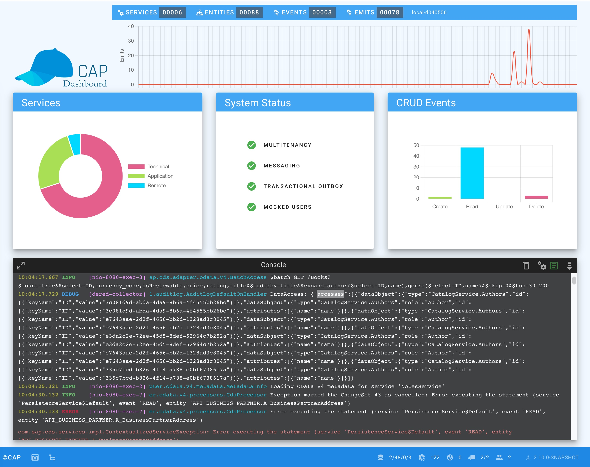

# Developer Dashboard
<style scoped>
  h1:before {
    content: "Java"; display: block; font-size: 60%; margin: 0 0 .2em;
  }
</style>

::: warning Only to be used in development
The dashboard is only intended for use in the development environment. It is strictly forbidden to use the dashboard in a production environment, as it allows access to sensitive data and presents a security risk.
:::
<br>




The CAP Developer Dashboard simplifies development by providing a centralized point where developers can efficiently manage and monitor their CAP applications. It offers tools and functions to support the development process and helps developers to quickly identify and resolve problems. Additionally, the dashboard facilitates better integration of CAP components, such as messaging, resilience and multitenancy, ensuring seamless functionality throughout CAP applications.

Add the `cds-feature-dev-dashboard` feature to your maven dependencies:

```xml [pom.xml]
<dependency>
    <groupId>com.sap.cds</groupId>
    <artifactId>cds-feature-dev-dashboard</artifactId>
</dependency>
```

## Local Setup

By default, the dashboard requires authorized access, which requires the `cds.Developer` role. The default mock user configuration provides the user `developer` already configured with this role. If you use your own mocked users, you must assign them the `cds.Developer` role if you want to give them access to the dashboard. 

::: code-group
```yaml [application.yaml]
cds:
  security:
    mock:
      users:
        - name: myUser
          password: myPass
          roles:
            - cds.Developer
```
:::

## Cloud Setup

If you also want to use the CAP Developer Dashboard in your cloud development scenario, you need to take a few more steps to achieve this. Let's take an example of a BTP Cloud Foundry app example with Approuter and XSUAA.

First you must deactivate the [production profile](https://pages.github.tools.sap/cap/docs/java/developing-applications/configuring#production-profile). To do this, set the property `cds.environment.production.enabled` in `application.yaml` or `CDS_ENVIRONMENT_PRODUCTION_ENABLED` in `mta.yaml` to `false`.

Second, you need to add the `cds.Developer` role to your security configuration. Here is an example of the XSUAA configuration:

::: code-group
```json [xs-security.json]
{
	"xsappname": "dashboard-test",
	...
	"scopes": [
		{
			"name": "$XSAPPNAME.cds.Developer",
			"description": "CAP Developer"
		},
    ...
	],
 "attributes": [
		{
			...
		}
	],
	"role-templates": [
		{
			"name": "capDeveloper",
			"description": "generated",
			"scope-references": [
				"$XSAPPNAME.cds.Developer"
			]
		},
    ...
	]
}
```
:::

Finally, you need to customize the approuter configuration by enabling support for websocket connections and defining the dashboard routes:

::: code-group
```json [xs-app.json]
{
	...
	"authenticationMethod": "route",
	"websockets": {
		"enabled": true
	},
	"routes": [
		{
			"source": "^/dashboard",
			"authenticationType": "xsuaa",
			"destination": "backend"
		},
		{
			"source": "^/dashboard/(.*)",
			"authenticationType": "xsuaa",
			"destination": "backend"
		},
		{
			"source": "^/dashboard_api/(.*)",
			"authenticationType": "xsuaa",
			"destination": "backend"
		}, 
    ...
	]
}
```
:::

Now you can deploy the application in BTP and assign the `cds.Developer` role to the users you want to grant access to the CAP Developer Dashboard.

::: warning
For security reasons, the **cds.Developer** role should only be used in conjunction with test users. It is strongly recommended not to use this role with users who could potentially be used in production systems.
:::

## Unauthorized Access

In some cases, your application may run in a complex environment such as DwC and you simply want to access the CAP Developer Dashboard running in your CAP Service Module directly without using a router in between. For this reason, you can switch off the authorization to grant direct unauthorized access. 

::: code-group
```yaml [application.yaml]
cds:
  dashboard:
    authorization:
      enabled: false
```
:::

To open finally the endpoint, authentication can be disabled via the spring web security configuration. Alternatively, the DwC web security configuration is provided to disable mTLS for the CAP Developer Dashboard endpoint.

::: code-group
```java [WebSecurity]
import static org.springframework.security.web.util.matcher.AntPathRequestMatcher.antMatcher;

import org.springframework.context.annotation.Bean;
import org.springframework.context.annotation.Configuration;
import org.springframework.core.annotation.Order;
import org.springframework.security.config.annotation.web.builders.HttpSecurity;
import org.springframework.security.web.SecurityFilterChain;

@Configuration
@Order(1)
public class WebSecurity {

	@Bean
	public SecurityFilterChain appFilterChain(HttpSecurity http) throws Exception {

		return http
				.securityMatchers(m -> m.requestMatchers(antMatcher("/dashboard/**"), antMatcher("/dashboard_api/**")))
				.authorizeHttpRequests(auth -> auth.anyRequest().permitAll())
				.csrf(c-> c.disable())
				.build();

	}
}
```

```java [DwC WebSecurity]
import static org.springframework.security.web.util.matcher.AntPathRequestMatcher.antMatcher;

import org.springframework.context.annotation.Bean;
import org.springframework.context.annotation.Configuration;
import org.springframework.core.annotation.Order;
import org.springframework.security.config.annotation.web.builders.HttpSecurity;
import org.springframework.security.config.annotation.web.configuration.EnableWebSecurity;
import org.springframework.security.config.http.SessionCreationPolicy;
import org.springframework.security.web.SecurityFilterChain;

@Configuration
@EnableWebSecurity
@Order(1)
public class DwcWebSecurityConfiguration {

	@Bean
	SecurityFilterChain configure(HttpSecurity http) throws Exception {

		return http
				.authorizeHttpRequests(auth -> auth.requestMatchers(antMatcher("/dashboard/**"), antMatcher("/dashboard_api/**")).permitAll())
				.authorizeHttpRequests(auth -> auth.anyRequest().authenticated())
				.sessionManagement(session -> session.sessionCreationPolicy(SessionCreationPolicy.STATELESS))
				.httpBasic(b -> b.disable())
				.formLogin(f -> f.disable())
				.csrf(c -> c.disable())
				.build();
	}
}
```
:::