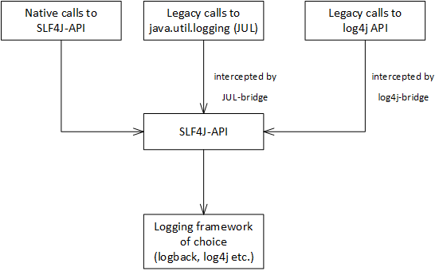
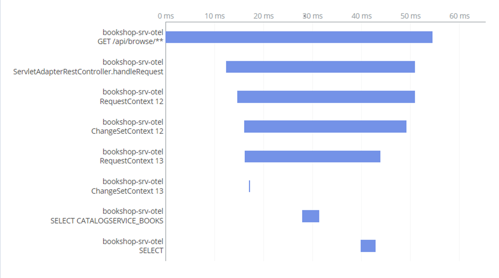

<!--- Migrated: @external/java/700-observability0-index.md -> @external/java/observability.md -->

# Observability
<style scoped>
  h1:before {
    content: "Java"; display: block; font-size: 60%; margin: 0 0 .2em;
  }
</style>

{{ $frontmatter.synopsis }}


<!-- #### Content -->
<!--- % include _chapters toc="2,3" %} -->


## Logging { #logging}

When tracking down erroneous behavior, *application logs* often provide useful hints to reconstruct the executed program flow and isolate functional flaws. In addition, they help operators and supporters to keep an overview about the status of a deployed application. In contrast, messages created using the [Messages API](indicating-errors#messages) in custom handlers are reflected to the business user who has triggered the request.


### Logging Façade { #logging-facade}

Various logging frameworks for Java have evolved and are widely used in Open Source software. Most prominent are `logback`, `log4j`, and `JDK logging` (`java.util.logging` or briefly `jul`). These well-established frameworks more or less deal with the same problem domain, that is:

- Logging API for (parameterized) messages with different log levels.
- Hierarchical logger components that can be configured independently.
- Separation of log input (messages, parameters, context) and log output (format, destination).

CAP Java SDK seamlessly integrates with Simple Logging Façade for Java ([SLF4J](https://www.slf4j.org)), which provides an abstraction layer for logging APIs. Applications compiled against SLF4J are free to choose a logging framework implementation at deployment time. Most famous libraries have a native integration to SLF4J, but it also can bridge legacy logging API calls:



### Logger API { #logging-api}

The SLF4J API is simple to use. Retrieve a logger object, choose the log method of the corresponding log level and compose a message with optional parameters via the Java API:

```java
import org.slf4j.Logger;
import org.slf4j.LoggerFactory;

Logger logger = LoggerFactory.getLogger("my.loggers.order.consolidation");

@After(event = CqnService.EVENT_READ)
public void readAuthors(List<Orders> orders) {
	orders.forEach(order -> {
		logger.debug("Consolidating order {}", order);
		consolidate(order);
	});
	logger.info("Consolidated {} orders", orders.size());
}
```

Some remarks:

* [Logging Configuration](#logging-configuration) shows how to configure loggers individually to control the emitted log messages.
* The API is robust with regards to the passed parameters that means no exception is thrown on parameters mismatch or invalid parameters.

::: tip
Prefer *passing parameters* over *concatenating* the message. `logger.info("Consolidating order " + order)` creates the message `String` regardless the configured log level. This can have a negative impact on performance.
:::

::: tip
A `ServiceException` thrown in handler code and indicating a server error (that is, HTTP response code `5xx`) is *automatically* logged as error along with a stacktrace.
:::


### Spring Boot Logging { #logging-configuration}

To set up a logging system, a concrete logging framework has to be chosen and, if necessary, corresponding SLF4j adapters.
In case your application runs on Spring Boot and you use the Spring starter packages, **you most likely don't have to add any explicit dependency**, as the bundle `spring-boot-starter-logging` is part of all Spring Boot starters. It provides `logback` as default logging framework and in addition adapters for the most common logging frameworks (`log4j` and `jul`).

Similarly, no specific log output configuration is required for local development, as per default, log messages are written to the console in human-readable form, which contains timestamp, thread, and logger component information. To customize the log output, for instance to add some application-specific information, you can create corresponding configuration files (such as `logback-spring.xml` for logback). Add them to the classpath and Spring picks them automatically. Consult the documentation of the dedicated logging framework to learn about the configuration file format.

All logs are written that have a log level greater or equal to the configured log level of the corresponding logger object.
The following log levels are available:

| Level    | Use case
| :--------| :--------
| `OFF`    | Turns off the logger
| `TRACE`  | Tracks the application flow only
| `DEBUG`  | Shows diagnostic messages
| `INFO`   | Shows important flows of the application (default level)
| `WARN`   | Indicates potential error scenarios
| `ERROR`  | Shows errors and exceptions

With Spring Boot, there are different convenient ways to configure log levels in a development scenario, which is explained in the following section.

#### At Compile Time { #logging-configuration-compiletime}

The following log levels can be configured:

::: code-group
```sh [srv/src/main/resources/application.yaml]
# Set new default level
logging.level.root: WARN

# Adjust custom logger
logging.level.my.loggers.order.Consolidation: INFO

# Turn off all loggers matching org.springframework.*:
logging.level.org.springframework: OFF
```
:::

Note that loggers are organized in packages, for instance `org.springframework` controls all loggers that match the name pattern `org.springframework.*`.

#### At Runtime with Restart { #logging-configuration-restart}

You can overrule the given logging configuration with a corresponding environment variable. For instance, to set loggers in package `my.loggers.order` to `DEBUG` level add the following environment variable:

```sh
LOGGING_LEVEL_MY_LOGGERS_ORDER = DEBUG
```

and restart the application.
::: tip
Note that Spring normalizes the variable's suffix to lower case, for example, `MY_LOGGERS_ORDER` to `my.loggers.order`, which actually matches the package name. However, configuring a dedicated logger (such as `my.loggers.order.Consolidation`) can't work in general as class names are in camel case typically.
:::

::: tip
On SAP BTP, Cloud Foundry environment, you can add the environment variable with `cf set-env <app name> LOGGING_LEVEL_MY_LOGGERS_ORDER DEBUG`. Don't forget to restart the application with `cf restart <app name>` afterwards. The additional configuration endures an application restart but might be lost on redeployment.
:::

#### At Runtime Without Restart { #logging-configuration-runtime}

If configured, you can use [Spring actuators](https://docs.spring.io/spring-boot/docs/current/reference/html/actuator.html) to view and adjust logging configuration. Disregarding security aspects and provided that the `loggers` actuator is configured as HTTP endpoint on path `/actuator/loggers`, following example HTTP requests show how to accomplish this:

```sh
# retrieve state of all loggers:
curl http://<app-url>/actuator/loggers

# retrieve state of single logger:
curl http://<app-url>/actuator/loggers/my.loggers.oder.consolidation
 {"configuredLevel":null,"effectiveLevel":"INFO"}

# Change logging level:
curl -X POST -H 'Content-Type: application/json' -d '{"configuredLevel": "DEBUG"}'
  http://<app-url>/actuator/loggers/my.loggers.oder.consolidation
```

[Learn more about Spring actuators and security aspects in the section **Metrics**.](#spring-boot-actuators){ .learn-more}

#### Predefined Loggers { #predefined-loggers}

CAP Java SDK has useful built-in loggers that help to track runtime behavior:

| Logger                         | Use case
| :------------------------------| :--------
| `com.sap.cds.security.authentication`  | Logs authentication and user information
| `com.sap.cds.security.authorization`  | Logs authorization decisions
| `com.sap.cds.odata.v2`  | Logs OData V2 request handling in the adapter
| `com.sap.cds.odata.v4`  | Logs OData V4 request handling in the adapter
| `com.sap.cds.handlers`  | Logs sequence of executed handlers as well as the lifecycle of RequestContexts and ChangeSetContexts
| `com.sap.cds.persistence.sql` | Logs executed queries such as CQN and SQL statements (w/o parameters)
| `com.sap.cds.persistence.sql-tx` | Logs transactions, ChangeSetContexts, and connection pool
| `com.sap.cds.multitenancy`  | Logs tenant-related events and sidecar communication
| `com.sap.cds.messaging`  | Logs messaging configuration and messaging events
| `com.sap.cds.remote.odata`  | Logs request handling for remote OData calls
| `com.sap.cds.remote.wire`  | Logs communication of remote OData calls
| `com.sap.cds.auditlog`  | Logs audit log events

Most of the loggers are used on DEBUG level by default as they produce quite some log output. It's convenient to control loggers on package level, for example, `com.sap.cds.security` covers all loggers that belong to this package (namely `com.sap.cds.security.authentication` and `com.sap.cds.security.authorization`).

::: tip
Spring comes with its own [standard logger groups](https://docs.spring.io/spring-boot/docs/2.1.1.RELEASE/reference/html/boot-features-logging.html#boot-features-custom-log-groups). For instance, `web` is useful to track HTTP requests. However, HTTP access logs gathered by the Cloud Foundry platform router are also available in the application log.
:::

### Logging Service { #logging-service}

The SAP BTP platform offers the [SAP Application Logging service for SAP BTP](https://help.sap.com/docs/r/product/APPLICATION_LOGGING) to which bound Cloud Foundry applications can stream logs. Operators can access and analyze the [application log, container metrics, and custom metrics](https://help.sap.com/docs/application-logging-service/sap-application-logging-service/access-and-analyze-application-logs-container-metrics-and-custom-metrics).

To get connected with the SAP BTP Application Logging Service, the application needs to be [bound to the service](https://help.sap.com/docs/application-logging-service/sap-application-logging-service/produce-logs-container-metrics-and-custom-metrics). To match the log output format and structure expected by the logging service, it's recommended to use a prepared encoder from [cf-java-logging-support](https://github.com/SAP/cf-java-logging-support) that matches the configured logger framework. `logback` is used by default as outlined in [Logging Frameworks](#logging-configuration):

```xml
<dependency>
	<groupId>com.sap.hcp.cf.logging</groupId>
	<artifactId>cf-java-logging-support-logback</artifactId>
	<version>${logging.support.version}</version>
</dependency>
```

By default, the library appends additional fields to the log output such as correlation id or Cloud Foundry space. To instrument incoming HTTP requests, a servlet filter needs to be created. See [Instrumenting Servlets](https://github.com/SAP/cf-java-logging-support/wiki/Instrumenting-Servlets) for more details.

During local development, you might want to stick to the (human-readable) standard log line format. This boils down to have different logger configurations for different Spring profiles. The following sample configuration outlines how you can achieve this. `cf-java-logging-support` is only active for profile `cloud`, since all other profiles are configured with the standard logback output format:
::: code-group
```xml [srv/src/main/resources/logback-spring.xml]
<?xml version="1.0" encoding="UTF-8"?>
<!DOCTYPE xml>
<configuration debug="false" scan="false">
	<springProfile name="cloud">
		<!-- logback configuration of ConsoleAppender according
		     to cf-java-logging-support documentation -->
		...
	</springProfile>
	<springProfile name="!cloud">
		<include resource="org/springframework/boot/logging/logback/base.xml"/>
	</springProfile>
</configuration>
```
:::

::: tip
For an example of how to set up a multitenant aware CAP Java application with enabled logging service support, have a look at section [Multitenancy > Adding Logging Service Support](./multitenancy#app-log-support).
:::

### Correlation IDs

In general, a request can be handled by unrelated execution units such as internal threads or remote services. This fact makes it hard to correlate the emitted log lines of the different contributors in an aggregated view. The problem can be solved by enhancing the log lines with unique correlation IDs, which are assigned to the initial request and propagated throughout the call tree.

In case you've configured `cf-java-logging-support` as described in [Logging Service](#logging-service) before, *correlation IDs are handled out of the box by the CAP Java SDK*. In particular, this includes:

- Generation of IDs in non-HTTP contexts
- Thread propagation through [Request Contexts](./request-contexts#threading-requestcontext)
- Propagation to remote services when called via CloudSDK (for instance [Remote Services](./remote-services) or [MTX sidecar](./multitenancy-classic#mtx-sidecar-server))

By default, the ID is accepted and forwarded via HTTP header `X-CorrelationID`. If you want to accept `X-Correlation-Id` header in incoming requests alternatively, 
follow the instructions given in the guide [Instrumenting Servlets](https://github.com/SAP/cf-java-logging-support/wiki/Instrumenting-Servlets#correlation-id).


## Monitoring { #monitoring }

Connect your productive application to a [monitoring](#monitoring) tool to identify resource bottlenecks at an early stage and to take appropriate countermeasurements.

When connected to a monitoring tool, applications can report information about memory, CPU, and network usage, which forms the basis for resource consumption overview and reporting capabilities.
In addition, call-graphs can be reconstructed and visualized that represent the flow of web requests within the components and services.

CAP Java integrates with the following monitoring tools:

- [Open Telemetry](#open-telemetry) for reporting signals like distributed traces, logs, and metrics into Open Telemetry-compliant solutions. 
SAP BTP Cloud Logging Service is supported with [minimal configuration](#open-telemetry-configuration-cls).

- [Dynatrace](#dynatrace) provides sophisticated features to monitor a solution on SAP BTP.

- [Spring Boot Actuators](#spring-boot-actuators) can help operators to quickly get an overview about the general status of the application on a technical level. 

- [Availability](#availability) checks are offered by [SAP Cloud ALM for Operations](https://help.sap.com/docs/cloud-alml).


### Open Telemetry { #open-telemetry }

[Open Telemetry](https://opentelemetry.io/) is an Open Source framework for observability in cloud applications. Applications can collect signals (distributed traces and metrics) and send them to observability front ends that offer a wide set of capabilities to analyze the current state or failures of an application. On SAP BTP, for example, the  [SAP BTP Cloud Logging service](https://help.sap.com/docs/cloud-logging) is offered as a front end for these purposes.

CAP Java applications can easily be configured to connect to SAP BTP Cloud Logging Service or Dynatrace. In your CAP Java application, you configure one of these services inside the Open Telemetry configuration. Then the application automatically benefits from the following features:

- Out-of-the-box traces and metrics by auto-instrumented [libraries and frameworks](https://github.com/open-telemetry/opentelemetry-java-instrumentation/blob/main/docs/supported-libraries.md#libraries--frameworks)
- Additional traces for CAP-specific capabilities
- Automatic forwarding of telemetry signals (logs, traces, or metrics) to SAP BTP Cloud Logging or Dynatrace
- Full setup of Open Telemetry relevant configuration, including span hierarchy and Open Telemetry collectors

Spans and traces that are produced out of the box, include HTTP requests as well as CAP-specific execution of CQN statements or individual requests inside an OData $batch request. Metrics that are automatically provided, include standard JVM metrics like CPU and memory utilization.

In addition, it's possible to add manual instrumentations using the [Open Telemetry Java API](https://opentelemetry.io/docs/instrumentation/java/manual/), for example, in a custom event handler.



#### Configuration of CLoud Logging Service { #open-telemetry-configuration-cls }

Open Telemetry support using SAP BTP Cloud Logging Service leverages the [Open Telemetry Java Agent](https://opentelemetry.io/docs/instrumentation/java/automatic/) which needs to be attached to the CAP Java application. The following steps describe how this can be done:

1) Bind your CAP Java application to a service instance of `cloud-logging`. On creation of the service instance, it's important to enable the Open Telemetry capabilities by passing `ingest_otlp` as additional configuration parameter. The following snippet shows an example how to add this to a _mta.yaml_ descriptor:
    ```yaml
    ...
	resources:
	  - name: cloud-logging-instance
	    type: org.cloudfoundry.managed-service
	    parameters:
	      service: cloud-logging
	      service-plan: standard
	      config:
	        ingest_otlp: true
    ...
    ```

2) Add the following maven dependency to the service `pom.xml` of your CAP Java application:
    ```json
    <dependency>
      <groupId>com.sap.hcp.cf.logging</groupId>
      <artifactId>cf-java-logging-support-opentelemetry-agent-extension</artifactId>
      <version>${java-logging-version}</version>
    </dependency>
    ```

3) Configure your application to enable the Open Telemetry Java Agent by adding or adapting the `JBP_CONFIG_JAVA_OPTS` parameter in your deployment descriptor, for example, _mta.yaml_:

   ```yaml
   - name: <srv-module>
     ...
     properties:
       ...
       JBP_CONFIG_JAVA_OPTS: "[from_environment: false, java_opts: '-javaagent:META-INF/.sap_java_buildpack/otel_agent/opentelemetry-javaagent.jar -Dotel.javaagent.extensions=BOOT-INF/lib/cf-java-logging-support-opentelemetry-agent-extension-<version>.jar']"
   ```

   Make sure that you replace the `<version>` tag with the same version that you've added to your maven dependencies in the previous step.
   For troubleshooting purposes, you can increase the log level of the Open Telemetry Java Agent by adding the parameter `-Dotel.javaagent.debug=true` to the `JBP_CONFIG_JAVA_OPTS` argument.

::: tip
It's possible to suppress auto-instrumentation for specific libraries as described [here](https://opentelemetry.io/docs/instrumentation/java/automatic/agent-config/#suppressing-specific-agent-instrumentation). The corresponding `-Dotel.instrumentation.[name].enabled=false` parameter(s) can be added to the `JBP_JAVA_OPTS` argument.
:::

#### Configuration of Dynatrace { #open-telemetry-configuration-dynatrace }

Open Telemetry support using Dynatrace leverages the Dynatrace OneAgent which needs to be attached to the CAP Java application:

1) Follow the description to [connect your CAP Java application to Dynatrace](#dynatrace).
2) Open Telemetry support in OneAgent needs to be enabled once in your Dynatrace environment via the Dynatrace UI. Navigate to **Settings > Preferences > OneAgent features** and turn on the switch for **OpenTelemetry (Java)**.
3) In addition enable W3C Trace Context for proper context propagation between remote services. Navigate to **Settings > Server-side service monitoring > Deep monitoring > Distributed tracing** and turn on **Send W3C Trace Context HTTP headers**.

#### CAP Instrumentation

Instrumentations for CAP-specific components are disabled by default so that no traces and spans are created even if the Open Telemetry Java Agent has been configured. It's possible to selectively activate specific spans by changing the log level for the respective component.

| Logger Name                              | Required Level | Description                                     |
|------------------------------------------|----------------|-------------------------------------------------|
| `com.sap.cds.otel.span.OData`            | `INFO`         | Spans for individual requests of a OData $batch request. |
| `com.sap.cds.otel.span.CQN`              | `INFO`         | Spans for executed CQN statement.                        |
| `com.sap.cds.otel.span.RequestContext`   | `DEBUG` | Spans for each Request Context. |
| `com.sap.cds.otel.span.ChangeSetContext` | `DEBUG` | Spans for each ChangeSet Context. |
| `com.sap.cds.otel.span.Emit`             | `DEBUG` | Spans for dispatching events in the CAP runtime. |

For specific steps to change the log level, please refer to the respective section for [configuring logging](#logging-configuration).

#### Custom Instrumentation

Using the Open Telemetry Java API, it's possible to provide additional observability signals from within a CAP Java application. This can include additional spans as well as metrics.

Add a dependency to the Open Telemetry Java API in the `pom.xml` of the CAP Java application:
```yaml
<dependency>
   <groupId>io.opentelemetry</groupId>
   <artifactId>opentelemetry-api</artifactId>
</dependency>
```

There's no need for initializing the Open Telemetry configuration. This is automatically established once the Open Telemetry Java Agent was attached as described in the previous section.

The following example produces an additional span when the `@After` handler is executed. The Open Telemetry API automatically ensures that the span is correctly added to the current span hierarchy. Span attributes allow an application to associate additional data to the span, which helps identifying and analyzing the span. Exceptions that were thrown within the span should be associated with the span using the `recordException` method. This marks the span as erroneous and helps to analyze failures. It's important to close the span in any case. Otherwise, the span isn't recorded and is lost.

```java
@Component
@ServiceName(CatalogService_.CDS_NAME)
class CatalogServiceHandler implements EventHandler {
  Tracer tracer = GlobalOpenTelemetry.getTracerProvider().tracerBuilder("RatingCalculator").build();

  @After(entity = Books_.CDS_NAME)
  public void afterAddReview(AddReviewContext context) {
      Span childSpan = tracer.spanBuilder("setBookRating").startSpan();
      childSpan.setAttribute("book.title", context.getResult().getTitle());
      childSpan.setAttribute("book.id", context.getResult().getBookId());
      childSpan.setAttribute("book.rating", context.getResult().getRating());

      try(Scope scope = childSpan.makeCurrent()) {
          ratingCalculator.setBookRating(context.getResult().getBookId());
      } catch (Throwable t) {
          childSpan.recordException(t);
          throw t;
      } finally {
          childSpan.end();
      }
  }
}
```

Similarly, you can record metrics during execution of, for example, a custom event handler. The following example manages a metric `reviewCounter`, which counts the number of book reviews posted by users. Adding the `bookId` as additional attribute improves the value of the data as this can be handled by the Open Telemetry front end as dimension for aggregating values of this metric.

```java
@Component
@ServiceName(CatalogService_.CDS_NAME)
class CatalogServiceHandler implements EventHandler {
  Metric tracer = GlobalOpenTelemetry.getTracerProvider().tracerBuilder("RatingCalculator").build();

  @After(entity = Books_.CDS_NAME)
  public void afterAddReview(AddReviewContext context) {
     ratingCalculator.setBookRating(context.getResult().getBookId());

     LongCounter counter = meter.counterBuilder("reviewCounter").setDescription("Counts the number of reviews created per book").build();
     counter.add(1, Attributes.of(AttributeKey.stringKey("bookId"), context.getResult().getBookId()));
  }
}
```


### Dynatrace { #dynatrace }

[Dynatrace](https://www.dynatrace.com/support/help) is a comprehensive platform that delivers analytics and automation based on monitoring events sent by the backend services.
It requires OneAgent that runs in the backend capturing monitoring data and sending to the Dynatrace service.

How to configure a Dynatrace connection to your CAP Java application is described in [Dynatrace Integration](https://help.sap.com/docs/BTP/65de2977205c403bbc107264b8eccf4b/1610eac123c04d07babaf89c47d82c91.html).


<!--- Migrated: @external/java/700-observability04-metrics.md -> @external/java/observabilitymetrics.md -->
### Spring Boot Actuators { #spring-boot-actuators }

Metrics are mainly referring to operational information about various resources of the running application, such as HTTP sessions and worker threads, JDBC connections, JVM memory including garbage collector statistics and so on. 
Similar to [health checks](#spring-health-checks), Spring Boot comes with a bunch of built-in metrics based on the [Spring Actuator](#spring-boot-actuators) framework.
Actuators form an open framework, which can be enhanced by libraries (see [CDS Actuator](#cds-actuator)) as well as the application (see [Custom Actuators](#custom-actuators)) with additional information.

[Spring Boot Actuators](https://docs.spring.io/spring-boot/docs/current/reference/html/production-ready-features.html) are designed to provide a set of out-of-the-box supportability features, that help to make your application observable in production.

To add actuator support in your application, add the following dependency:

```xml
<dependency>
    <groupId>org.springframework.boot</groupId>
    <artifactId>spring-boot-starter-actuator</artifactId>
</dependency>
```

The following table lists some of the available actuators that might be helpful to understand the internal status of the application:

| Actuator    | Description
| :--------| :--------
| `metrics`    | Thread pools, connection pools, CPU, and memory usage of JVM and HTTP web server
| `beans`    | Information about Spring beans created in the application
| `env`    | Exposes the full Spring environment including application configuration
| `loggers`    | List and modify application loggers

By default, nearly all actuators are active. You can switch off actuators individually in the configuration. The following configuration turns off `flyway` actuator:

```yaml
management.endpoint.flyway.enabled=false
```

Depending on the configuration, exposed actuators can have HTTP or [JMX](https://en.wikipedia.org/wiki/Java_Management_Extensions) endpoints. For security reasons, it's recommended to expose only the `health` actuator as web endpoint as described in [Health Indicators](#spring-health-checks). All other actuators are recommended for local JMX-based access as described in [JMX-based Tools](#profiling-jmx).


#### CDS Actuator { #cds-actuator }

CAP Java SDK plugs a CDS-specific actuator `cds`. This actuator provides information about:

- The version and commit ID of the currently used `cds-services` library
- All services registered in the service catalog
- Security configuration (authentication type and so on)
- Loaded features such as `cds-feature-xsuaa`
- Database pool statistics (requires `registerMbeans: true` in [Hikari pool configuration](./persistence-services#datasource-configuration))


#### Custom Actuators { #custom-actuators }

Similar to [Custom Health Indicators](#custom-health-indicators), you can add application-specific actuators as done in the following example:

```java
@Component
@ConditionalOnClass(Endpoint.class)
@Endpoint(id = "app", enableByDefault = true)
public class AppActuator {
	@ReadOperation
	public Map<String, Object> info() {
		Map<String, Object> info = new LinkedHashMap<>();
		info.put("Version", "1.0.0");
		return info;
	}
}
```
The `AppActuator` bean registers an actuator with name `app` that exposes a simple version string.


<!--- Migrated: @external/java/700-observability03-availability.md -> @external/java/observabilityavailability.md -->
### Availability { #availability}

This section describes how to set up an endpoint for availability or health check. At a first glance, providing such a health check endpoint sounds like a simple task. But some aspects need to be considered:

- Authentication (for example, Basic or OAuth2) increases security but introduces higher configuration and maintenance effort.
- Only low resource consumption can be introduced. If you provide a public endpoint, only low overhead is accepted to avoid denial-of-service attacks.
- Ideally, the health check response shows not only the aggregate status, but also the status of crucial services the application depends on such as the underlying persistence.

#### Spring Boot Health Checks { #spring-health-checks}

Conveniently, Spring Boot offers out-of-the-box capabilities to report the health of the running application and its components. Spring provides a bunch of health indicators, especially `PingHealthIndicator` (`/ping`) and `DataSourceHealthIndicator` (`/db`). This set can be extended by [custom health indicators](#custom-health-indicators) if necessary, but most probably, **setting up an appropriate health check for your application is just a matter of configuration**.

To do so, first add a dependency to Spring Actuators, which forms the basis for health indicators:

```xml
<dependency>
    <groupId>org.springframework.boot</groupId>
    <artifactId>spring-boot-starter-actuator</artifactId>
</dependency>
```

By default, Spring exposes the *aggregated* health status on web endpoint `/actuator/health`, including the result of all registered health indicators. But also the `info` actuator is exposed automatically, which might be not desired for security reasons. It's recommended to **explicitly** control web exposition of actuator components in the application configuration. The following configuration snippet is an example suitable for public visible health check information:

```yaml
management:
  endpoint:
    health:
      show-components: always # shows individual indicators
  endpoints:
    web:
      exposure:
        include: health # only expose /health as web endpoint
  health:
     defaults.enabled: false # turn off all indicators by default
     ping.enabled: true
     db.enabled: true
```

The example configuration makes Spring exposing only the health endpoint with health indicators `db` and `ping`. Other indicators ready for auto-configuration such as `diskSpace` are omitted. All components contributing to the aggregated status are shown individually, which helps to understand the reason for overall status `DOWN`.

::: tip
For multitenancy scenarios, CAP Java SDK replaces default the `db` indicator with an implementation that includes the status of all tenant databases.
:::

Endpoint `/actuator/health` delivers a response (HTTP response code `200` for up, `503` for down) in JSON format with the overall `status` property (for example, `UP` or `DOWN`) and the contributing components:

```json
{
  "status": "UP",
  "components": {
    "db": {
      "status": "UP"
    },
    "ping": {
      "status": "UP"
    }
  }
}
```

It might be advantageous to expose information on a detailed level. This configuration is only an option for a [protected](#protected-health-checks) health endpoint:

```yaml
management.endpoint.health.show-details: always
```

::: warning Be mindful about data exposure and resource consumption
A public health check endpoint may neither disclose system internal data (for example, health indicator details) nor introduce significant resource consumption (for example, doing synchronous database request).
:::

Find all details about configuration opportunities in [Spring Boot Actuator](https://docs.spring.io/spring-boot/docs/current/reference/html/production-ready-features.html) documentation.

#### Custom Health Indicators { #custom-health-indicators}

In case your application relies on additional, mandatory services not covered by default health indicators, you can add a custom health indicator as sketched in this example:

```java
@Component("crypto")
@ConditionalOnEnabledHealthIndicator("crypto")
public class CryptoHealthIndicator implements HealthIndicator {

    @Autowired
    CryptoService cryptoService;

    @Override
    public Health health() {
        Health.Builder status = cryptoService.isAvailalbe() ?
              Health.up() : Health.down();
        return status.build();
    }
}
```

The custom `HealthIndicator` for the mandatory `CryptoService` is registered by Spring automatically and can be controlled with property `management.health.crypto.enabled: true`.

#### Protected Health Checks { #protected-health-checks}

Optionally, you can configure a protected health check endpoint. On the one hand this gives you higher flexibility with regards to the detail level of the response but on the other hand introduces additional configuration and management efforts (for instance key management).
As this highly depends on the configuration capabilities of the client services, CAP doesn't come with an auto-configuration. Instead, the application has to provide an explicit security configuration on top as outlined with `ActuatorSecurityConfig` in [Customizing Spring Boot Security Configuration](security#custom-spring-security-config).
